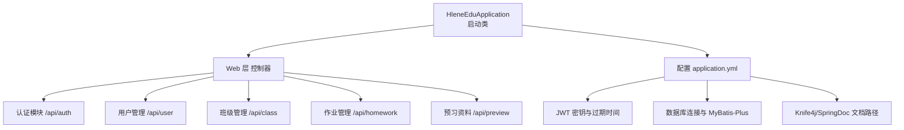
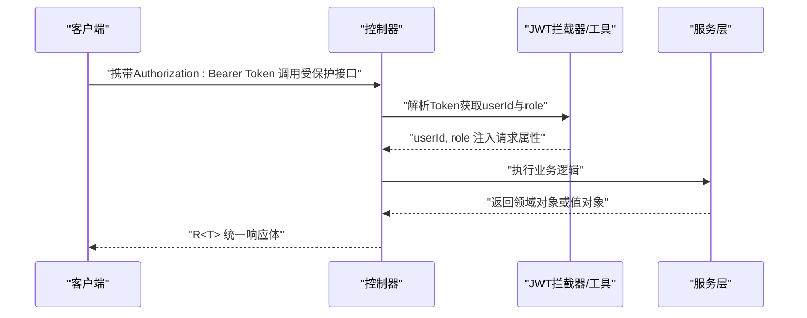
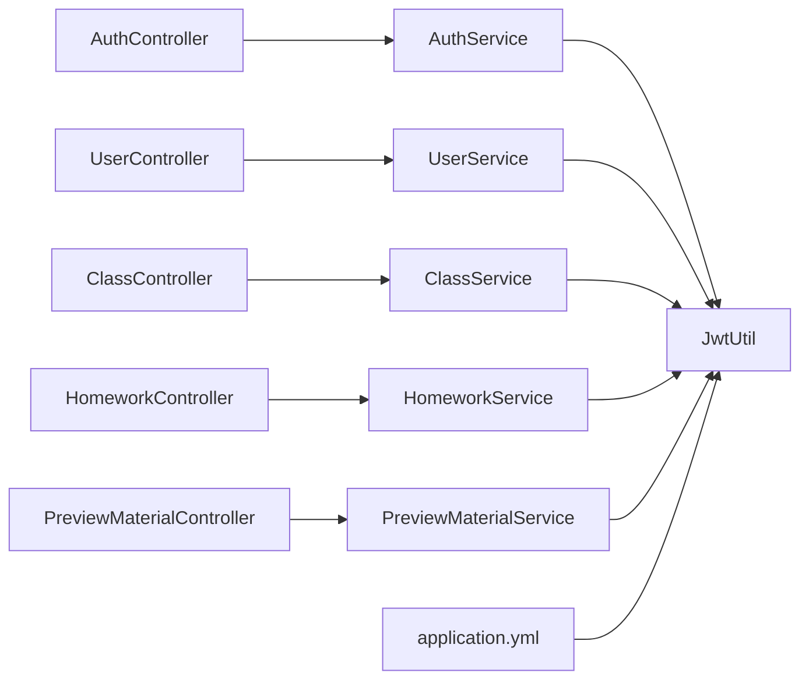

# API接口文档

<cite>
**本文引用的文件**
- [HleneEduApplication.java](file://helenedu-backend/src/main/java/com/helen/eduedu/HleneEduApplication.java)
- [application.yml](file://helenedu-backend/src/main/resources/application.yml)
- [JwtUtil.java](file://helenedu-backend/src/main/java/com/helen/eduedu/security/JwtUtil.java)
- [R.java](file://helenedu-backend/src/main/java/com/helen/eduedu/common/R.java)
- [PageResult.java](file://helenedu-backend/src/main/java/com/helen/eduedu/common/PageResult.java)
- [AuthController.java](file://helenedu-backend/src/main/java/com/helen/eduedu/controller/AuthController.java)
- [UserController.java](file://helenedu-backend/src/main/java/com/helen/eduedu/controller/UserController.java)
- [ClassController.java](file://helenedu-backend/src/main/java/com/helen/eduedu/controller/ClassController.java)
- [HomeworkController.java](file://helenedu-backend/src/main/java/com/helen/eduedu/controller/HomeworkController.java)
- [PreviewMaterialController.java](file://helenedu-backend/src/main/java/com/helen/eduedu/controller/PreviewMaterialController.java)
- [WxLoginRequest.java](file://helenedu-backend/src/main/java/com/helen/eduedu/dto/WxLoginRequest.java)
- [UserRequest.java](file://helenedu-backend/src/main/java/com/helen/eduedu/dto/UserRequest.java)
- [ClassRequest.java](file://helenedu-backend/src/main/java/com/helen/eduedu/dto/ClassRequest.java)
- [HomeworkRequest.java](file://helenedu-backend/src/main/java/com/helen/eduedu/dto/HomeworkRequest.java)
- [PreviewMaterialRequest.java](file://helenedu-backend/src/main/java/com/helen/eduedu/dto/PreviewMaterialRequest.java)
</cite>

## 目录
1. [简介](#简介)
2. [项目结构](#项目结构)
3. [核心组件](#核心组件)
4. [架构总览](#架构总览)
5. [详细组件分析](#详细组件分析)
6. [依赖分析](#依赖分析)
7. [性能考虑](#性能考虑)
8. [故障排查指南](#故障排查指南)
9. [结论](#结论)
10. [附录](#附录)

## 简介
本文件为 HelenEdu 系统的完整 API 接口文档，覆盖认证、用户管理、班级管理、作业管理、预习资料等模块。文档提供各端点的 URL 模式、HTTP 方法、请求参数、响应格式与错误码说明，并给出认证机制、参数约束、响应结构、接口测试与调试建议、版本与兼容性策略，以及客户端集成最佳实践。

## 项目结构
后端采用 Spring Boot + MyBatis-Plus 架构，统一响应体与分页封装，基于 Knife4j/SpringDoc 提供 OpenAPI 文档入口。应用启动类负责扫描 Mapper 包与启动应用。

图表来源
- [HleneEduApplication.java:1-15](file://helenedu-backend/src/main/java/com/helen/eduedu/HleneEduApplication.java#L1-L15)
- [application.yml:1-59](file://helenedu-backend/src/main/resources/application.yml#L1-L59)

章节来源
- [HleneEduApplication.java:1-15](file://helenedu-backend/src/main/java/com/helen/eduedu/HleneEduApplication.java#L1-L15)
- [application.yml:1-59](file://helenedu-backend/src/main/resources/application.yml#L1-L59)

## 核心组件
- 统一响应体 R<T>
  - 字段：code、message、data
  - 成功：code=200，message="success"
  - 失败：默认 code=500，可自定义
- 分页结果 PageResult<T>
  - 字段：total、page、size、records
- JWT 工具类 JwtUtil
  - 生成、解析、校验 Token，提取 userId 与 role
- 配置 application.yml
  - 服务器端口、上下文路径、数据库连接、文件上传大小、Jackson 时间格式与空值策略、JWT 密钥与过期时间、微信小程序配置、文件上传目录与访问基础 URL、Knife4j/SpringDoc 文档路径

章节来源
- [R.java:1-42](file://helenedu-backend/src/main/java/com/helen/eduedu/common/R.java#L1-L42)
- [PageResult.java:1-25](file://helenedu-backend/src/main/java/com/helen/eduedu/common/PageResult.java#L1-L25)
- [JwtUtil.java:1-87](file://helenedu-backend/src/main/java/com/helen/eduedu/security/JwtUtil.java#L1-L87)
- [application.yml:1-59](file://helenedu-backend/src/main/resources/application.yml#L1-L59)

## 架构总览
系统通过拦截器在进入控制器前解析 JWT，将 userId 与 role 注入到请求属性中，控制器据此进行权限控制与业务处理。OpenAPI 文档可通过 Knife4j 的 /swagger-ui.html 或 /v3/api-docs 访问。

图表来源
- [JwtUtil.java:34-85](file://helenedu-backend/src/main/java/com/helen/eduedu/security/JwtUtil.java#L34-L85)
- [AuthController.java:32-37](file://helenedu-backend/src/main/java/com/helen/eduedu/controller/AuthController.java#L32-L37)
- [UserController.java:29-77](file://helenedu-backend/src/main/java/com/helen/eduedu/controller/UserController.java#L29-L77)
- [ClassController.java:31-128](file://helenedu-backend/src/main/java/com/helen/eduedu/controller/ClassController.java#L31-L128)
- [HomeworkController.java:32-122](file://helenedu-backend/src/main/java/com/helen/eduedu/controller/HomeworkController.java#L32-L122)
- [PreviewMaterialController.java:27-79](file://helenedu-backend/src/main/java/com/helen/eduedu/controller/PreviewMaterialController.java#L27-L79)

## 详细组件分析

### 认证模块 /api/auth
- 端点概览
  - POST /wx-login：微信登录，返回登录态与用户信息
  - GET /userinfo：获取当前登录用户信息

- 请求与响应
  - 微信登录
    - 请求体：WxLoginRequest
      - code：字符串，必填
      - nickName：字符串，可选
      - avatarUrl：字符串，可选
    - 响应体：R<LoginVO>
  - 获取当前用户信息
    - 请求头：Authorization: Bearer <token>
    - 响应体：R<UserVO>

- 错误码
  - 通用：R.fail(message) 返回 code=500
  - 参数校验失败：由 Bean Validation 抛出，最终以统一响应体返回

- 示例
  - 请求示例（POST /api/auth/wx-login）
    - Content-Type: application/json
    - Body: {"code":"<小程序临时登录凭证>","nickName":"<昵称>","avatarUrl":"<头像URL>"}
  - 响应示例（成功）
    - Status: 200
    - Body: {"code":200,"message":"success","data":{...}}
  - 响应示例（失败）
    - Status: 200
    - Body: {"code":500,"message":"<错误信息>","data":null}

- 参数说明
  - code：非空字符串，长度限制由后端校验注解决定
  - 其他字段：可为空字符串

- 响应结构
  - R<T>：包含 code、message、data；data 类型随具体接口变化

章节来源
- [AuthController.java:18-39](file://helenedu-backend/src/main/java/com/helen/eduedu/controller/AuthController.java#L18-L39)
- [WxLoginRequest.java:1-19](file://helenedu-backend/src/main/java/com/helen/eduedu/dto/WxLoginRequest.java#L1-L19)
- [R.java:1-42](file://helenedu-backend/src/main/java/com/helen/eduedu/common/R.java#L1-L42)

### 用户管理 /api/user
- 权限要求
  - 需要管理员角色（RequireRole({3})）

- 端点概览
  - POST /api/user：创建用户
  - PUT /api/user/{id}：更新用户
  - PUT /api/user/{id}/toggle-status：禁用/启用用户
  - DELETE /api/user/{id}：删除用户
  - GET /api/user/list?page=&size=&role=&keyword=：用户列表（支持分页与筛选）
  - GET /api/user/teachers：获取所有教师
  - GET /api/user/students：获取所有学生

- 请求与响应
  - 创建/更新用户
    - 请求体：UserRequest
      - name：字符串，必填
      - phone：字符串，可选
      - role：整数，必填（枚举值由系统角色定义）
      - avatarUrl：字符串，可选
    - 响应体：R<Long>（返回新增用户ID）
  - 列表查询
    - 查询参数：page（默认1）、size（默认10）、role（可选）、keyword（可选）
    - 响应体：R<PageResult<UserVO>>

- 错误码
  - 通用：R.fail(message) 返回 code=500
  - 参数校验失败：由 Bean Validation 抛出，最终以统一响应体返回

- 示例
  - 请求示例（POST /api/user）
    - Content-Type: application/json
    - Body: {"name":"<姓名>","phone":"<电话>","role":1,"avatarUrl":"<头像URL>"}
  - 响应示例（成功）
    - Status: 200
    - Body: {"code":200,"message":"success","data":<userId>}

- 参数说明
  - name：非空
  - role：必填，取值范围由系统角色枚举定义
  - phone/avatarUrl：可空

- 响应结构
  - R<T>：data 为 Long 或 PageResult<UserVO>

章节来源
- [UserController.java:17-78](file://helenedu-backend/src/main/java/com/helen/eduedu/controller/UserController.java#L17-L78)
- [UserRequest.java:1-23](file://helenedu-backend/src/main/java/com/helen/eduedu/dto/UserRequest.java#L1-L23)
- [R.java:1-42](file://helenedu-backend/src/main/java/com/helen/eduedu/common/R.java#L1-L42)
- [PageResult.java:1-25](file://helenedu-backend/src/main/java/com/helen/eduedu/common/PageResult.java#L1-L25)

### 班级管理 /api/class
- 权限要求
  - 创建/更新/删除/成员管理：管理员角色（RequireRole({3})）
  - 教师查看“我的班级”：教师角色（RequireRole({2})）
  - 学生查看“我的班级”：学生角色（RequireRole({1})）

- 端点概览
  - POST /api/class：创建班级
  - PUT /api/class/{id}：更新班级
  - DELETE /api/class/{id}：删除/解散班级
  - GET /api/class/list?page=&size=&keyword=：班级列表
  - GET /api/class/{id}：班级详情
  - GET /api/class/{id}/students：班级学生列表
  - POST /api/class/{id}/students：添加学生到班级
  - DELETE /api/class/{id}/students/{studentId}：从班级移除学生
  - GET /api/class/{id}/teachers：班级教师列表
  - POST /api/class/{id}/teachers：添加教师到班级
  - DELETE /api/class/{id}/teachers/{teacherId}：从班级移除教师
  - GET /api/class/my-classes：教师我的班级
  - GET /api/class/my-student-classes：学生我的班级

- 请求与响应
  - 创建/更新班级
    - 请求体：ClassRequest
      - name：字符串，必填
      - grade：字符串，可选
      - teacherId：长整型，可选
    - 响应体：R<Long>（返回新增班级ID）
  - 成员管理
    - 添加成员请求体：ClassMemberRequest（见后续 DTO）
    - 响应体：R<Void>（成功返回空数据）
  - 列表查询
    - 查询参数：page（默认1）、size（默认10）、keyword（可选）
    - 响应体：R<PageResult<ClassVO>>

- 错误码
  - 通用：R.fail(message) 返回 code=500
  - 参数校验失败：由 Bean Validation 抛出，最终以统一响应体返回

- 示例
  - 请求示例（POST /api/class）
    - Content-Type: application/json
    - Body: {"name":"<班级名称>","grade":"<年级>","teacherId":1}
  - 响应示例（成功）
    - Status: 200
    - Body: {"code":200,"message":"success","data":<classId>}

- 参数说明
  - name：非空
  - teacherId：可空（允许后续设置）

- 响应结构
  - R<T>：data 为 Long 或 PageResult<ClassVO>

章节来源
- [ClassController.java:20-129](file://helenedu-backend/src/main/java/com/helen/eduedu/controller/ClassController.java#L20-L129)
- [ClassRequest.java:1-19](file://helenedu-backend/src/main/java/com/helen/eduedu/dto/ClassRequest.java#L1-L19)
- [R.java:1-42](file://helenedu-backend/src/main/java/com/helen/eduedu/common/R.java#L1-L42)
- [PageResult.java:1-25](file://helenedu-backend/src/main/java/com/helen/eduedu/common/PageResult.java#L1-L25)

### 作业管理 /api/homework
- 权限要求
  - 教师：布置/更新/删除作业、查看与批改提交
  - 学生：提交作业、查看作业列表与详情

- 端点概览
  - POST /api/homework：布置作业
  - PUT /api/homework/{id}：更新作业
  - DELETE /api/homework/{id}：删除作业
  - GET /api/homework/{id}：作业详情（区分教师/学生）
  - GET /api/homework/list?classId=&page=&size=：教师作业列表
  - GET /api/homework/student-list?status=&page=&size=：学生作业列表
  - POST /api/homework/{id}/submit：提交作业
  - GET /api/homework/{id}/submits?status=：作业提交列表（教师）
  - PUT /api/homework/submit/{id}/review：批改作业
  - GET /api/homework/submit/{id}：提交详情

- 请求与响应
  - 布置/更新作业
    - 请求体：HomeworkRequest
      - title：字符串，必填
      - content：字符串，可选
      - classId：长整型，必填
      - subject：字符串，可选
      - deadline：日期时间，可选
      - attachmentUrls：字符串数组，可选
      - status：整数，0-草稿，1-已发布
    - 响应体：R<Long>（返回作业ID）
  - 提交作业
    - 请求体：HomeworkSubmitRequest（见后续 DTO）
    - 响应体：R<Void>
  - 批改作业
    - 请求体：HomeworkReviewRequest（见后续 DTO）
    - 响应体：R<Void>

- 错误码
  - 通用：R.fail(message) 返回 code=500
  - 参数校验失败：由 Bean Validation 抛出，最终以统一响应体返回

- 示例
  - 请求示例（POST /api/homework）
    - Content-Type: application/json
    - Body: {"title":"<标题>","content":"<内容>","classId":1,"subject":"<科目>","deadline":"<截止时间>","attachmentUrls":["<URL1>","<URL2>"],"status":1}
  - 响应示例（成功）
    - Status: 200
    - Body: {"code":200,"message":"success","data":<homeworkId>}

- 参数说明
  - classId：必填且需存在
  - status：0/1
  - deadline：遵循 ISO 8601 日期时间格式

- 响应结构
  - R<T>：data 为 Long 或 PageResult<HomeworkVO>

章节来源
- [HomeworkController.java:21-123](file://helenedu-backend/src/main/java/com/helen/eduedu/controller/HomeworkController.java#L21-L123)
- [HomeworkRequest.java:1-33](file://helenedu-backend/src/main/java/com/helen/eduedu/dto/HomeworkRequest.java#L1-L33)
- [R.java:1-42](file://helenedu-backend/src/main/java/com/helen/eduedu/common/R.java#L1-L42)
- [PageResult.java:1-25](file://helenedu-backend/src/main/java/com/helen/eduedu/common/PageResult.java#L1-L25)

### 预习资料 /api/preview
- 权限要求
  - 教师：发布/更新/删除资料、查看列表
  - 学生：查看资料列表

- 端点概览
  - POST /api/preview：发布资料
  - PUT /api/preview/{id}：更新资料
  - DELETE /api/preview/{id}：删除资料
  - GET /api/preview/{id}：资料详情
  - GET /api/preview/list?classId=&page=&size=：教师资料列表
  - GET /api/preview/student-list?page=&size=：学生资料列表

- 请求与响应
  - 发布/更新资料
    - 请求体：PreviewMaterialRequest
      - title：字符串，必填
      - description：字符串，可选
      - classId：长整型，必填
      - subject：字符串，可选
      - fileUrls：字符串数组，可选
      - status：整数，0-下架，1-发布
    - 响应体：R<Long>（返回资料ID）
  - 列表查询
    - 查询参数：page（默认1）、size（默认10）、classId（可选）
    - 响应体：R<PageResult<PreviewMaterialVO>>

- 错误码
  - 通用：R.fail(message) 返回 code=500
  - 参数校验失败：由 Bean Validation 抛出，最终以统一响应体返回

- 示例
  - 请求示例（POST /api/preview）
    - Content-Type: application/json
    - Body: {"title":"<标题>","description":"<描述>","classId":1,"subject":"<科目>","fileUrls":["<URL1>","<URL2>"],"status":1}
  - 响应示例（成功）
    - Status: 200
    - Body: {"code":200,"message":"success","data":<materialId>}

- 参数说明
  - classId：必填且需存在
  - status：0/1

- 响应结构
  - R<T>：data 为 Long 或 PageResult<PreviewMaterialVO>

章节来源
- [PreviewMaterialController.java:16-80](file://helenedu-backend/src/main/java/com/helen/eduedu/controller/PreviewMaterialController.java#L16-L80)
- [PreviewMaterialRequest.java:1-30](file://helenedu-backend/src/main/java/com/helen/eduedu/dto/PreviewMaterialRequest.java#L1-L30)
- [R.java:1-42](file://helenedu-backend/src/main/java/com/helen/eduedu/common/R.java#L1-L42)
- [PageResult.java:1-25](file://helenedu-backend/src/main/java/com/helen/eduedu/common/PageResult.java#L1-L25)

### 数据模型与请求参数说明
- 通用响应体 R<T>
  - code：整数，200 表示成功，500 表示失败
  - message：字符串，描述信息
  - data：泛型数据，可能为 null（如 Void）

- 分页结果 PageResult<T>
  - total：总数
  - page：页码
  - size：每页条数
  - records：当前页记录列表

- 认证与权限
  - Authorization: Bearer <token>
  - Token 内含 userId 与 role，用于接口鉴权与业务判断

章节来源
- [R.java:1-42](file://helenedu-backend/src/main/java/com/helen/eduedu/common/R.java#L1-L42)
- [PageResult.java:1-25](file://helenedu-backend/src/main/java/com/helen/eduedu/common/PageResult.java#L1-L25)
- [JwtUtil.java:34-85](file://helenedu-backend/src/main/java/com/helen/eduedu/security/JwtUtil.java#L34-L85)

## 依赖分析
- 控制器层依赖
  - 控制器依赖服务层接口，服务层再依赖 Mapper 与实体类
  - 控制器通过 RequireRole 注解实现基于角色的访问控制
- 统一响应与分页
  - 所有控制器返回 R<T>，服务层返回领域对象，控制器负责封装
- 安全与配置
  - JWT 工具类提供 Token 生成、解析与校验
  - application.yml 提供数据库、文件上传、Knife4j/SpringDoc、JWT 等配置

图表来源
- [AuthController.java:24-37](file://helenedu-backend/src/main/java/com/helen/eduedu/controller/AuthController.java#L24-L37)
- [UserController.java:27-76](file://helenedu-backend/src/main/java/com/helen/eduedu/controller/UserController.java#L27-L76)
- [ClassController.java:29-127](file://helenedu-backend/src/main/java/com/helen/eduedu/controller/ClassController.java#L29-L127)
- [HomeworkController.java:30-121](file://helenedu-backend/src/main/java/com/helen/eduedu/controller/HomeworkController.java#L30-L121)
- [PreviewMaterialController.java:25-78](file://helenedu-backend/src/main/java/com/helen/eduedu/controller/PreviewMaterialController.java#L25-L78)
- [JwtUtil.java:21-25](file://helenedu-backend/src/main/java/com/helen/eduedu/security/JwtUtil.java#L21-L25)
- [application.yml:33-36](file://helenedu-backend/src/main/resources/application.yml#L33-L36)

## 性能考虑
- 分页查询
  - 使用 PageResult 进行分页，避免一次性返回大量数据
- 文件上传
  - application.yml 中限制了单文件与总请求大小，建议前端按需压缩与分片
- 序列化
  - Jackson 默认排除空值，减少响应体积
- 缓存与索引
  - 对高频查询字段建立数据库索引（如班级ID、用户ID、状态等）

## 故障排查指南
- 统一错误响应
  - 后端通过 R.fail(message) 或 R.fail(code, message) 返回错误
- 参数校验
  - 若出现参数缺失或格式错误，Bean Validation 将触发校验异常，最终以统一响应体返回
- Token 相关
  - 校验失败：检查 Authorization 头是否正确、Token 是否过期
  - 解析失败：确认密钥与过期时间配置一致
- 文档入口
  - 访问 /swagger-ui.html 或 /v3/api-docs 查看接口定义与示例

章节来源
- [R.java:28-40](file://helenedu-backend/src/main/java/com/helen/eduedu/common/R.java#L28-L40)
- [application.yml:48-59](file://helenedu-backend/src/main/resources/application.yml#L48-L59)

## 结论
本接口文档基于后端控制器与配置文件整理，覆盖认证、用户、班级、作业、预习资料等模块。统一响应体与分页封装提升了前后端协作效率。建议在生产环境完善权限校验、参数校验与日志监控，并结合 Knife4j/SpringDoc 进行持续的接口治理。

## 附录

### 认证机制与使用
- 获取 Token
  - 通过 /api/auth/wx-login 登录获取登录态
- 使用 Token
  - 在请求头中携带 Authorization: Bearer <token>
  - 服务端会解析 userId 与 role 并注入请求属性，用于权限控制与业务逻辑

章节来源
- [AuthController.java:26-30](file://helenedu-backend/src/main/java/com/helen/eduedu/controller/AuthController.java#L26-L30)
- [JwtUtil.java:34-85](file://helenedu-backend/src/main/java/com/helen/eduedu/security/JwtUtil.java#L34-L85)

### 请求参数与响应格式对照
- 通用
  - 请求头：Content-Type: application/json
  - 成功：{"code":200,"message":"success","data":...}
  - 失败：{"code":500,"message":"<错误信息>","data":null}
- 分页
  - PageResult：{"total":...,"page":...,"size":...,"records":[...]}

章节来源
- [R.java:16-40](file://helenedu-backend/src/main/java/com/helen/eduedu/common/R.java#L16-L40)
- [PageResult.java:10-24](file://helenedu-backend/src/main/java/com/helen/eduedu/common/PageResult.java#L10-L24)

### 接口测试与调试建议
- Swagger UI
  - 访问 /swagger-ui.html，选择对应标签，填写参数直接测试
- Postman
  - 设置 Authorization 为 Bearer Token，发送请求验证鉴权与业务逻辑
- 日志
  - application.yml 开启 MyBatis 日志输出，便于定位 SQL 问题

章节来源
- [application.yml:48-59](file://helenedu-backend/src/main/resources/application.yml#L48-L59)

### API 版本管理与兼容性
- 当前未显式声明 API 版本号，建议在 URL 中引入版本前缀（如 /api/v1/...），并在 application.yml 中统一管理路径
- 向后兼容策略
  - 新增字段采用可选与默认值
  - 不破坏现有字段类型与语义
  - 通过文档明确废弃字段与迁移计划

[本节为通用指导，不直接分析具体文件]