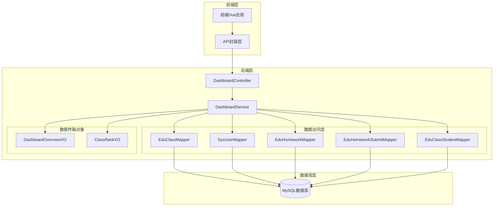
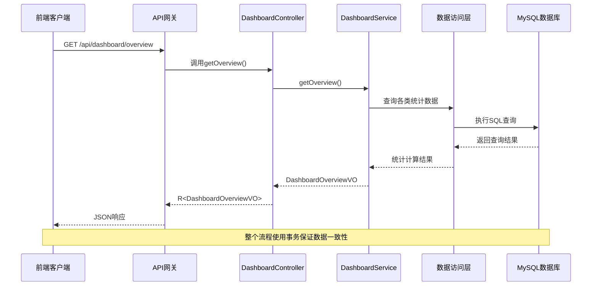
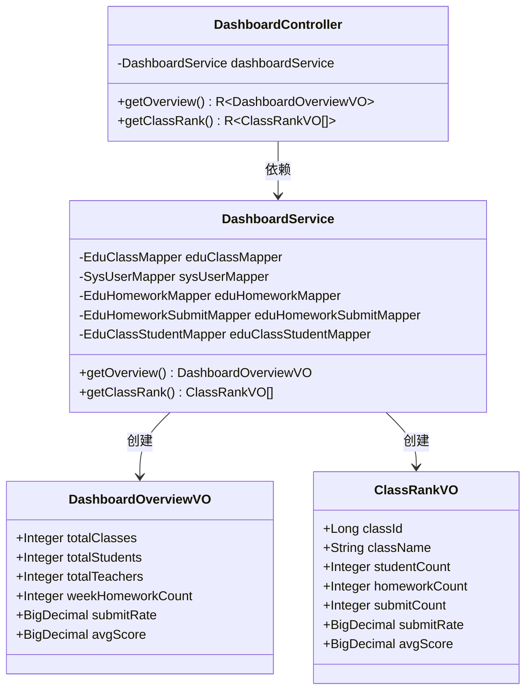
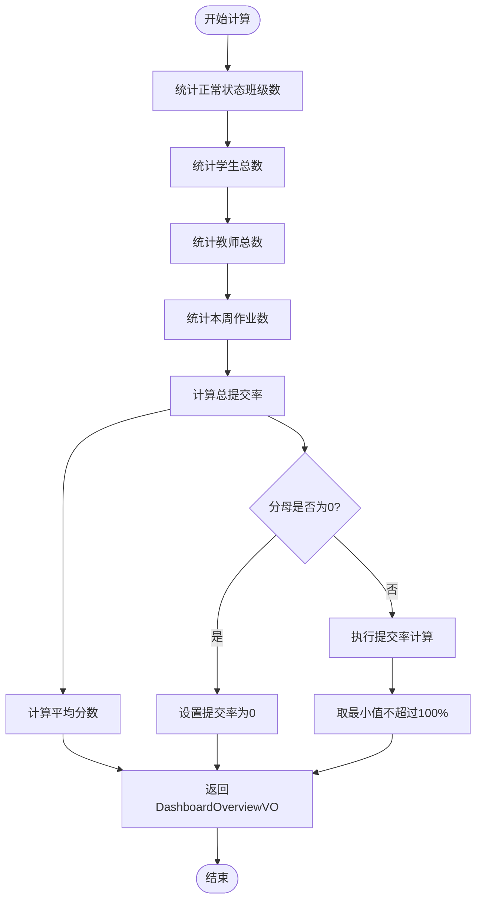
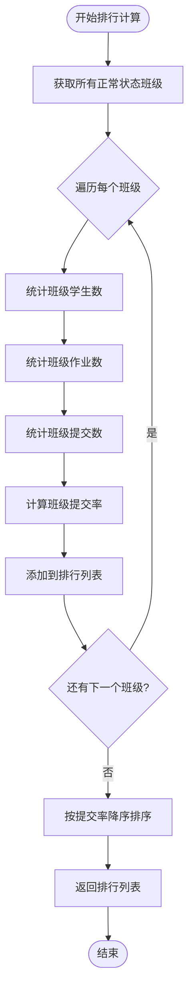
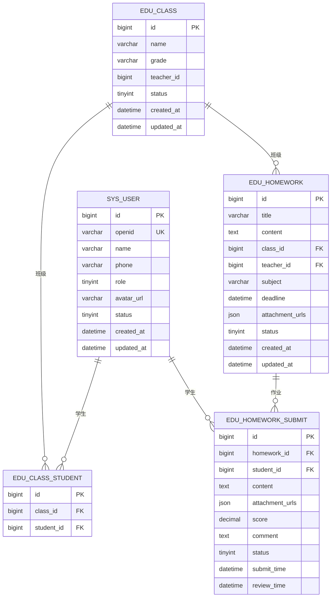
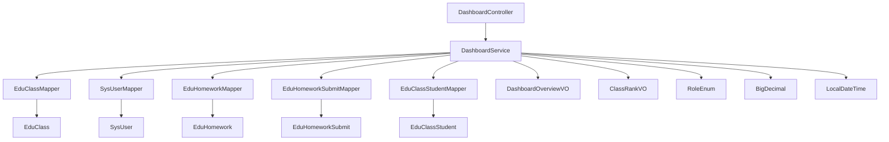
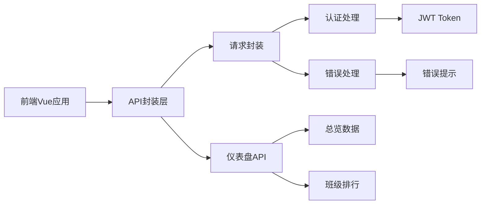

# 仪表盘API

<cite>
**本文档引用的文件**
- [DashboardController.java](file://helenedu-backend/src/main/java/com/helen/eduedu/controller/DashboardController.java)
- [DashboardService.java](file://helenedu-backend/src/main/java/com/helen/eduedu/service/DashboardService.java)
- [DashboardOverviewVO.java](file://helenedu-backend/src/main/java/com/helen/eduedu/vo/DashboardOverviewVO.java)
- [ClassRankVO.java](file://helenedu-backend/src/main/java/com/helen/eduedu/vo/ClassRankVO.java)
- [RoleEnum.java](file://helenedu-backend/src/main/java/com/helen/eduedu/common/RoleEnum.java)
- [EduClass.java](file://helenedu-backend/src/main/java/com/helen/eduedu/entity/EduClass.java)
- [SysUser.java](file://helenedu-backend/src/main/java/com/helen/eduedu/entity/SysUser.java)
- [application.yml](file://helenedu-backend/src/main/resources/application.yml)
- [schema.sql](file://helenedu-backend/src/main/resources/db/schema.sql)
- [dashboard.vue](file://helenedu-frontend/src/pages/admin/dashboard.vue)
- [index.js](file://helenedu-frontend/src/api/index.js)
- [request.js](file://helenedu-frontend/src/utils/request.js)
</cite>

## 目录
1. [简介](#简介)
2. [项目结构](#项目结构)
3. [核心组件](#核心组件)
4. [架构概览](#架构概览)
5. [详细组件分析](#详细组件分析)
6. [依赖关系分析](#依赖关系分析)
7. [性能考虑](#性能考虑)
8. [故障排除指南](#故障排除指南)
9. [结论](#结论)

## 简介

仪表盘API模块为教育管理系统提供了数据统计和概览功能，主要面向管理员用户，提供系统整体运行情况的数据展示。该模块包含两个核心接口：总览数据接口和班级排行接口，能够帮助管理员快速了解系统的运行状态和各班级的学习情况。

## 项目结构

仪表盘模块采用典型的三层架构设计，包含控制器层、服务层和数据传输对象层：

**图表来源**
- [DashboardController.java:1-41](file://helenedu-backend/src/main/java/com/helen/eduedu/controller/DashboardController.java#L1-L41)
- [DashboardService.java:1-157](file://helenedu-backend/src/main/java/com/helen/eduedu/service/DashboardService.java#L1-L157)

**章节来源**
- [DashboardController.java:1-41](file://helenedu-backend/src/main/java/com/helen/eduedu/controller/DashboardController.java#L1-L41)
- [DashboardService.java:1-157](file://helenedu-backend/src/main/java/com/helen/eduedu/service/DashboardService.java#L1-L157)

## 核心组件

### 接口概述

仪表盘模块提供以下核心接口：

| 接口 | 方法 | 路径 | 权限 | 功能描述 |
|------|------|------|------|----------|
| 总览数据 | GET | `/api/dashboard/overview` | 管理员 | 获取系统总体统计数据 |
| 班级排行 | GET | `/api/dashboard/class-rank` | 管理员 | 获取各班级提交率排行 |

### 数据传输对象

#### DashboardOverviewVO 结构

DashboardOverviewVO 是系统总览数据的响应对象，包含以下字段：

| 字段名 | 类型 | 描述 | 单位 |
|--------|------|------|------|
| totalClasses | Integer | 总班级数 | 个 |
| totalStudents | Integer | 总学生数 | 人 |
| totalTeachers | Integer | 总教师数 | 人 |
| weekHomeworkCount | Integer | 本周布置作业数 | 份 |
| submitRate | BigDecimal | 总提交率 | % |
| avgScore | BigDecimal | 平均分数 | 分 |

#### ClassRankVO 结构

ClassRankVO 是班级排行数据的响应对象，包含以下字段：

| 字段名 | 类型 | 描述 | 单位 |
|--------|------|------|------|
| classId | Long | 班级ID | - |
| className | String | 班级名称 | - |
| studentCount | Integer | 学生人数 | 人 |
| homeworkCount | Integer | 作业数量 | 份 |
| submitCount | Integer | 提交数量 | 份 |
| submitRate | BigDecimal | 提交率 | % |
| avgScore | BigDecimal | 平均分数 | 分 |

**章节来源**
- [DashboardOverviewVO.java:1-25](file://helenedu-backend/src/main/java/com/helen/eduedu/vo/DashboardOverviewVO.java#L1-L25)
- [ClassRankVO.java:1-20](file://helenedu-backend/src/main/java/com/helen/eduedu/vo/ClassRankVO.java#L1-L20)

## 架构概览

仪表盘模块采用RESTful API设计，遵循Spring Boot的标准架构模式：

**图表来源**
- [DashboardController.java:29-33](file://helenedu-backend/src/main/java/com/helen/eduedu/controller/DashboardController.java#L29-L33)
- [DashboardService.java:38-96](file://helenedu-backend/src/main/java/com/helen/eduedu/service/DashboardService.java#L38-L96)

## 详细组件分析

### DashboardController 控制器

DashboardController 是仪表盘模块的入口控制器，负责处理HTTP请求和响应：

#### 主要职责
- 接收前端的仪表盘数据请求
- 调用DashboardService执行业务逻辑
- 返回标准化的响应格式

#### 访问控制
控制器使用`@RequireRole({3})`注解，仅允许管理员角色访问：
- STUDENT: 1
- TEACHER: 2  
- ADMIN: 3

#### 接口实现

**图表来源**
- [DashboardController.java:25-40](file://helenedu-backend/src/main/java/com/helen/eduedu/controller/DashboardController.java#L25-L40)
- [DashboardService.java:27-157](file://helenedu-backend/src/main/java/com/helen/eduedu/service/DashboardService.java#L27-L157)
- [DashboardOverviewVO.java:11-24](file://helenedu-backend/src/main/java/com/helen/eduedu/vo/DashboardOverviewVO.java#L11-L24)
- [ClassRankVO.java:11-19](file://helenedu-backend/src/main/java/com/helen/eduedu/vo/ClassRankVO.java#L11-L19)

**章节来源**
- [DashboardController.java:17-40](file://helenedu-backend/src/main/java/com/helen/eduedu/controller/DashboardController.java#L17-L40)
- [RoleEnum.java:11-27](file://helenedu-backend/src/main/java/com/helen/eduedu/common/RoleEnum.java#L11-L27)

### DashboardService 服务层

DashboardService 实现了具体的业务逻辑，包含两个核心方法：

#### getOverview() 方法

该方法计算系统总体统计数据：

**图表来源**
- [DashboardService.java:38-96](file://helenedu-backend/src/main/java/com/helen/eduedu/service/DashboardService.java#L38-L96)

#### getClassRank() 方法

该方法计算各班级的提交率排行：

**图表来源**
- [DashboardService.java:101-155](file://helenedu-backend/src/main/java/com/helen/eduedu/service/DashboardService.java#L101-L155)

**章节来源**
- [DashboardService.java:25-157](file://helenedu-backend/src/main/java/com/helen/eduedu/service/DashboardService.java#L25-L157)

### 数据模型分析

#### 实体类关系

**图表来源**
- [schema.sql:5-94](file://helenedu-backend/src/main/resources/db/schema.sql#L5-L94)

**章节来源**
- [EduClass.java:13-36](file://helenedu-backend/src/main/java/com/helen/eduedu/entity/EduClass.java#L13-L36)
- [SysUser.java:13-42](file://helenedu-backend/src/main/java/com/helen/eduedu/entity/SysUser.java#L13-L42)
- [schema.sql:5-94](file://helenedu-backend/src/main/resources/db/schema.sql#L5-L94)

## 依赖关系分析

### 后端依赖关系

**图表来源**
- [DashboardController.java:25-40](file://helenedu-backend/src/main/java/com/helen/eduedu/controller/DashboardController.java#L25-L40)
- [DashboardService.java:27-34](file://helenedu-backend/src/main/java/com/helen/eduedu/service/DashboardService.java#L27-L34)

### 前端依赖关系

**图表来源**
- [dashboard.vue:72-96](file://helenedu-frontend/src/pages/admin/dashboard.vue#L72-L96)
- [index.js:47-50](file://helenedu-frontend/src/api/index.js#L47-L50)
- [request.js:7-44](file://helenedu-frontend/src/utils/request.js#L7-L44)

**章节来源**
- [DashboardController.java:23-24](file://helenedu-backend/src/main/java/com/helen/eduedu/controller/DashboardController.java#L23-L24)
- [RoleEnum.java:11-14](file://helenedu-backend/src/main/java/com/helen/eduedu/common/RoleEnum.java#L11-L14)

## 性能考虑

### 数据库优化策略

1. **索引优化**
   - 在`sys_user`表上对`role`和`status`字段建立复合索引
   - 在`edu_homework`表上对`class_id`和`created_at`字段建立复合索引
   - 在`edu_homework_submit`表上对`homework_id`和`student_id`建立复合索引

2. **查询优化**
   - 使用`selectCount`方法进行高效计数查询
   - 避免N+1查询问题，批量处理班级数据
   - 使用`TemporalAdjusters`和`LocalTime`进行高效的日期计算

3. **内存优化**
   - 对BigDecimal运算使用`RoundingMode.HALF_UP`确保精度
   - 合理使用`Collectors.toList()`避免不必要的数据复制

### 缓存策略

当前实现未包含缓存机制，建议在生产环境中考虑：

1. **短期缓存**：使用Redis缓存每日统计结果，过期时间设置为5-10分钟
2. **热点数据**：缓存热门班级的排行信息
3. **分布式锁**：防止并发查询导致的重复计算

### 前端性能优化

1. **并发请求**：前端使用`Promise.all`同时获取多个接口数据
2. **懒加载**：根据需要动态加载图表组件
3. **虚拟滚动**：对于大量数据时使用虚拟滚动技术

## 故障排除指南

### 常见问题及解决方案

#### 1. 权限不足错误
**问题**：非管理员用户访问仪表盘接口返回403
**解决方案**：确保用户具有管理员角色（code=3）

#### 2. 数据为空或为零
**问题**：某些统计数据显示为0
**解决方案**：
- 检查数据库中是否存在相关数据
- 验证状态字段是否正确设置
- 确认时间范围计算是否正确

#### 3. 性能问题
**问题**：接口响应时间过长
**解决方案**：
- 优化数据库查询语句
- 添加适当的索引
- 考虑引入缓存机制

#### 4. 前端显示异常
**问题**：仪表盘页面无法正常显示数据
**解决方案**：
- 检查API接口连通性
- 验证JWT Token的有效性
- 确认数据格式与前端期望一致

**章节来源**
- [request.js:20-44](file://helenedu-frontend/src/utils/request.js#L20-L44)
- [DashboardService.java:73-80](file://helenedu-backend/src/main/java/com/helen/eduedu/service/DashboardService.java#L73-L80)

## 结论

仪表盘API模块为教育管理系统提供了完整的数据统计和概览功能。通过合理的架构设计和清晰的接口定义，该模块能够有效支持管理员对系统运行状态的监控和分析。

### 主要优势

1. **权限控制严格**：通过角色注解确保只有管理员可以访问
2. **数据准确性高**：基于数据库的精确统计计算
3. **接口设计简洁**：遵循RESTful API标准，易于集成
4. **前端友好**：提供直观的数据可视化展示

### 改进建议

1. **增加时间范围参数**：允许用户自定义统计的时间范围
2. **实现缓存机制**：提升接口响应性能
3. **扩展角色支持**：为教师和学生提供相应的数据视图
4. **增强错误处理**：提供更详细的错误信息和恢复机制

该模块为整个教育管理系统的数据驱动决策提供了坚实的基础，建议在后续版本中继续完善和扩展功能。