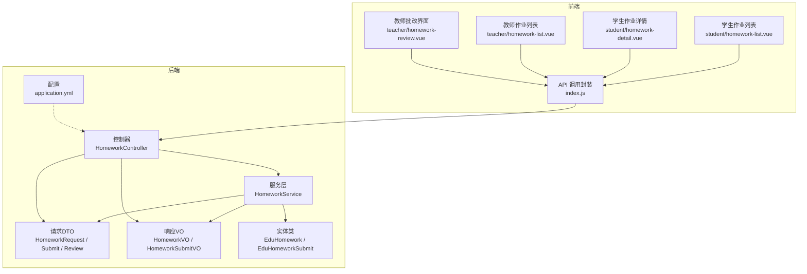
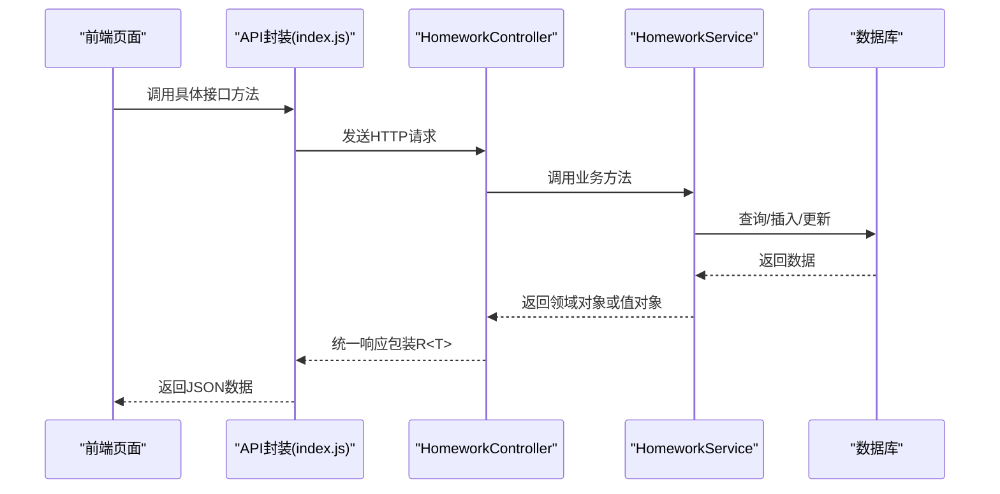
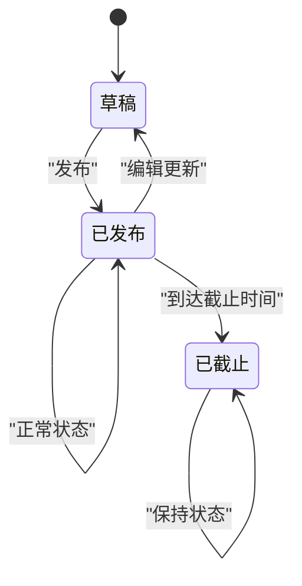
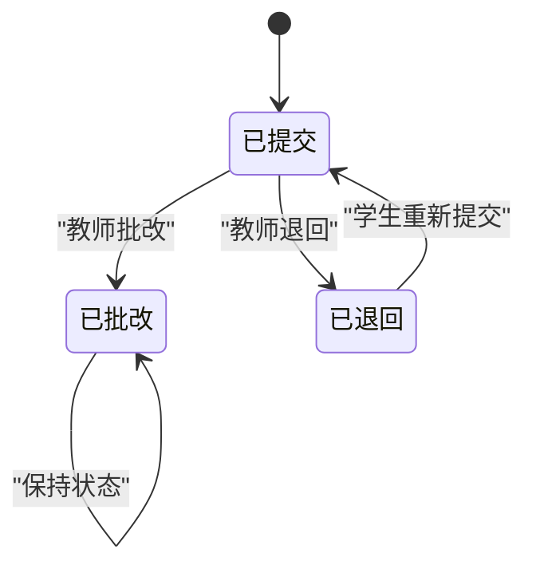
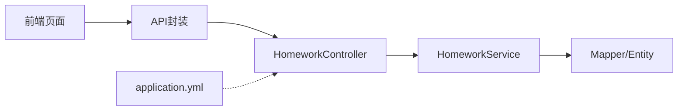

# 作业管理API

<cite>
**本文引用的文件**
- [HomeworkController.java](file://helenedu-backend/src/main/java/com/helen/eduedu/controller/HomeworkController.java)
- [HomeworkService.java](file://helenedu-backend/src/main/java/com/helen/eduedu/service/HomeworkService.java)
- [HomeworkRequest.java](file://helenedu-backend/src/main/java/com/helen/eduedu/dto/HomeworkRequest.java)
- [HomeworkSubmitRequest.java](file://helenedu-backend/src/main/java/com/helen/eduedu/dto/HomeworkSubmitRequest.java)
- [HomeworkReviewRequest.java](file://helenedu-backend/src/main/java/com/helen/eduedu/dto/HomeworkReviewRequest.java)
- [HomeworkVO.java](file://helenedu-backend/src/main/java/com/helen/eduedu/vo/HomeworkVO.java)
- [HomeworkSubmitVO.java](file://helenedu-backend/src/main/java/com/helen/eduedu/vo/HomeworkSubmitVO.java)
- [EduHomework.java](file://helenedu-backend/src/main/java/com/helen/eduedu/entity/EduHomework.java)
- [EduHomeworkSubmit.java](file://helenedu-backend/src/main/java/com/helen/eduedu/entity/EduHomeworkSubmit.java)
- [application.yml](file://helenedu-backend/src/main/resources/application.yml)
- [index.js](file://helenedu-frontend/src/api/index.js)
- [homework-list.vue（学生端）](file://helenedu-frontend/src/pages/student/homework-list.vue)
- [homework-detail.vue（学生端）](file://helenedu-frontend/src/pages/student/homework-detail.vue)
- [homework-list.vue（教师端）](file://helenedu-frontend/src/pages/teacher/homework-list.vue)
- [homework-review.vue（教师端）](file://helenedu-frontend/src/pages/teacher/homework-review.vue)
</cite>

## 目录
1. [简介](#简介)
2. [项目结构](#项目结构)
3. [核心组件](#核心组件)
4. [架构总览](#架构总览)
5. [详细组件分析](#详细组件分析)
6. [依赖分析](#依赖分析)
7. [性能考虑](#性能考虑)
8. [故障排查指南](#故障排查指南)
9. [结论](#结论)
10. [附录](#附录)

## 简介
本文件为“作业管理模块”的完整API文档，覆盖作业发布、提交、批改、查询等全流程。内容包括：
- 接口定义与调用方式
- 请求与响应数据结构说明
- 作业状态流转与业务规则
- 常见问题与排错建议
- 完整的接口调用示例路径

## 项目结构
后端采用Spring Boot分层架构：Controller负责HTTP接口，Service封装业务逻辑，Mapper访问数据库，DTO/VO用于接口数据传输。

图表来源
- [HomeworkController.java:24-122](file://helenedu-backend/src/main/java/com/helen/eduedu/controller/HomeworkController.java#L24-L122)
- [HomeworkService.java:26-306](file://helenedu-backend/src/main/java/com/helen/eduedu/service/HomeworkService.java#L26-L306)
- [HomeworkRequest.java:10-32](file://helenedu-backend/src/main/java/com/helen/eduedu/dto/HomeworkRequest.java#L10-L32)
- [HomeworkSubmitRequest.java:7-14](file://helenedu-backend/src/main/java/com/helen/eduedu/dto/HomeworkSubmitRequest.java#L7-L14)
- [HomeworkReviewRequest.java:8-22](file://helenedu-backend/src/main/java/com/helen/eduedu/dto/HomeworkReviewRequest.java#L8-L22)
- [HomeworkVO.java:8-34](file://helenedu-backend/src/main/java/com/helen/eduedu/vo/HomeworkVO.java#L8-L34)
- [HomeworkSubmitVO.java:9-27](file://helenedu-backend/src/main/java/com/helen/eduedu/vo/HomeworkSubmitVO.java#L9-L27)
- [EduHomework.java:13-51](file://helenedu-backend/src/main/java/com/helen/eduedu/entity/EduHomework.java#L13-L51)
- [EduHomeworkSubmit.java:14-51](file://helenedu-backend/src/main/java/com/helen/eduedu/entity/EduHomeworkSubmit.java#L14-L51)
- [application.yml:1-59](file://helenedu-backend/src/main/resources/application.yml#L1-L59)
- [index.js:1-13](file://helenedu-frontend/src/api/index.js#L1-L13)

章节来源
- [HomeworkController.java:24-122](file://helenedu-backend/src/main/java/com/helen/eduedu/controller/HomeworkController.java#L24-L122)
- [HomeworkService.java:26-306](file://helenedu-backend/src/main/java/com/helen/eduedu/service/HomeworkService.java#L26-L306)
- [application.yml:1-59](file://helenedu-backend/src/main/resources/application.yml#L1-L59)

## 核心组件
- 控制器：提供REST接口，负责鉴权、参数校验、调用服务层并返回统一响应包装。
- 服务层：实现业务逻辑，如作业发布、提交、批改、统计、状态判断等。
- 数据传输对象：HomeworkRequest、HomeworkSubmitRequest、HomeworkReviewRequest。
- 视图对象：HomeworkVO、HomeworkSubmitVO，用于对外输出。
- 实体类：EduHomework、EduHomeworkSubmit，映射数据库表结构。

章节来源
- [HomeworkController.java:24-122](file://helenedu-backend/src/main/java/com/helen/eduedu/controller/HomeworkController.java#L24-L122)
- [HomeworkService.java:26-306](file://helenedu-backend/src/main/java/com/helen/eduedu/service/HomeworkService.java#L26-L306)
- [HomeworkRequest.java:10-32](file://helenedu-backend/src/main/java/com/helen/eduedu/dto/HomeworkRequest.java#L10-L32)
- [HomeworkSubmitRequest.java:7-14](file://helenedu-backend/src/main/java/com/helen/eduedu/dto/HomeworkSubmitRequest.java#L7-L14)
- [HomeworkReviewRequest.java:8-22](file://helenedu-backend/src/main/java/com/helen/eduedu/dto/HomeworkReviewRequest.java#L8-L22)
- [HomeworkVO.java:8-34](file://helenedu-backend/src/main/java/com/helen/eduedu/vo/HomeworkVO.java#L8-L34)
- [HomeworkSubmitVO.java:9-27](file://helenedu-backend/src/main/java/com/helen/eduedu/vo/HomeworkSubmitVO.java#L9-L27)
- [EduHomework.java:13-51](file://helenedu-backend/src/main/java/com/helen/eduedu/entity/EduHomework.java#L13-L51)
- [EduHomeworkSubmit.java:14-51](file://helenedu-backend/src/main/java/com/helen/eduedu/entity/EduHomeworkSubmit.java#L14-L51)

## 架构总览
后端通过Swagger/OpenAPI生成接口文档，前端通过封装的API方法调用后端接口。

图表来源
- [index.js:1-13](file://helenedu-frontend/src/api/index.js#L1-L13)
- [HomeworkController.java:24-122](file://helenedu-backend/src/main/java/com/helen/eduedu/controller/HomeworkController.java#L24-L122)
- [HomeworkService.java:26-306](file://helenedu-backend/src/main/java/com/helen/eduedu/service/HomeworkService.java#L26-L306)

## 详细组件分析

### 1. 作业发布接口
- 接口：POST /api/homework
- 权限：教师角色
- 功能：创建作业，支持设置标题、内容、班级、学科、截止时间、附件、状态（默认发布）
- 参数说明（HomeworkRequest）
  - title：作业标题（必填）
  - content：作业内容（可选）
  - classId：班级ID（必填）
  - subject：学科（可选）
  - deadline：截止时间（可选）
  - attachmentUrls：附件URL列表（可选）
  - status：状态（0-草稿；1-已发布；默认1）
- 响应：Long类型作业ID
- 注意事项
  - 服务层会自动设置教师ID与默认状态
  - 前端可通过“布置作业”入口进入创建页

章节来源
- [HomeworkController.java:32-38](file://helenedu-backend/src/main/java/com/helen/eduedu/controller/HomeworkController.java#L32-L38)
- [HomeworkRequest.java:10-32](file://helenedu-backend/src/main/java/com/helen/eduedu/dto/HomeworkRequest.java#L10-L32)
- [HomeworkService.java:36-49](file://helenedu-backend/src/main/java/com/helen/eduedu/service/HomeworkService.java#L36-L49)
- [homework-list.vue（教师端）:61-67](file://helenedu-frontend/src/pages/teacher/homework-list.vue#L61-L67)

### 2. 作业更新接口
- 接口：PUT /api/homework/{id}
- 权限：教师角色
- 功能：更新指定作业信息
- 参数：同作业发布请求
- 响应：空对象

章节来源
- [HomeworkController.java:39-46](file://helenedu-backend/src/main/java/com/helen/eduedu/controller/HomeworkController.java#L39-L46)
- [HomeworkService.java:51-62](file://helenedu-backend/src/main/java/com/helen/eduedu/service/HomeworkService.java#L51-L62)

### 3. 作业删除接口
- 接口：DELETE /api/homework/{id}
- 权限：教师角色
- 功能：删除作业
- 响应：空对象

章节来源
- [HomeworkController.java:47-54](file://helenedu-backend/src/main/java/com/helen/eduedu/controller/HomeworkController.java#L47-L54)
- [HomeworkService.java:63-70](file://helenedu-backend/src/main/java/com/helen/eduedu/service/HomeworkService.java#L63-L70)

### 4. 作业详情查询接口
- 接口：GET /api/homework/{id}
- 权限：登录用户（根据角色区分可见性）
- 功能：获取作业详情，包含班级名、教师名、提交统计、学生端“我的提交状态”
- 响应：HomeworkVO
  - 基础字段：id、title、content、classId、className、teacherId、teacherName、subject、deadline、attachmentUrls、status、createdAt
  - 统计字段（教师视角）：totalCount、submitCount、reviewedCount
  - 学生视角：mySubmitStatus（0-未提交；1-已提交；2-已批改；3-已退回）、mySubmitId
- 注意事项
  - 学生端可看到“我的提交状态”，便于引导提交或查看批改结果

章节来源
- [HomeworkController.java:55-62](file://helenedu-backend/src/main/java/com/helen/eduedu/controller/HomeworkController.java#L55-L62)
- [HomeworkService.java:72-81](file://helenedu-backend/src/main/java/com/helen/eduedu/service/HomeworkService.java#L72-L81)
- [HomeworkVO.java:8-34](file://helenedu-backend/src/main/java/com/helen/eduedu/vo/HomeworkVO.java#L8-L34)

### 5. 教师作业列表接口
- 接口：GET /api/homework/list
- 权限：教师角色
- 参数：
  - classId：班级过滤（可选）
  - page：页码，默认1
  - size：每页条数，默认10
- 响应：分页结果（PageResult<HomeworkVO>）

章节来源
- [HomeworkController.java:63-74](file://helenedu-backend/src/main/java/com/helen/eduedu/controller/HomeworkController.java#L63-L74)
- [HomeworkService.java:83-101](file://helenedu-backend/src/main/java/com/helen/eduedu/service/HomeworkService.java#L83-L101)

### 6. 学生作业列表接口
- 接口：GET /api/homework/student-list
- 权限：学生角色
- 参数：
  - status：按提交状态过滤（0-未提交；1-已提交；2-已批改；3-已退回；可选）
  - page：页码，默认1
  - size：每页条数，默认10
- 响应：分页结果（PageResult<HomeworkVO>），仅展示已发布的作业

章节来源
- [HomeworkController.java:75-86](file://helenedu-backend/src/main/java/com/helen/eduedu/controller/HomeworkController.java#L75-L86)
- [HomeworkService.java:103-136](file://helenedu-backend/src/main/java/com/helen/eduedu/service/HomeworkService.java#L103-L136)
- [homework-list.vue（学生端）:78-98](file://helenedu-frontend/src/pages/student/homework-list.vue#L78-L98)

### 7. 作业提交接口
- 接口：POST /api/homework/{id}/submit
- 权限：学生角色
- 参数：HomeworkSubmitRequest
  - content：提交内容（可选）
  - attachmentUrls：附件URL列表（可选）
- 行为规则
  - 若超过截止时间则拒绝提交
  - 已提交且非“已退回”状态不可重复提交
  - 退回后可重新提交，重新提交时会清空分数与评语并重置状态为“已提交”
- 响应：空对象

图表来源
- [HomeworkService.java:138-182](file://helenedu-backend/src/main/java/com/helen/eduedu/service/HomeworkService.java#L138-L182)

章节来源
- [HomeworkController.java:87-98](file://helenedu-backend/src/main/java/com/helen/eduedu/controller/HomeworkController.java#L87-L98)
- [HomeworkSubmitRequest.java:7-14](file://helenedu-backend/src/main/java/com/helen/eduedu/dto/HomeworkSubmitRequest.java#L7-L14)
- [HomeworkService.java:138-182](file://helenedu-backend/src/main/java/com/helen/eduedu/service/HomeworkService.java#L138-L182)

### 8. 提交列表查询接口
- 接口：GET /api/homework/{id}/submits
- 权限：教师角色
- 参数：
  - status：按状态过滤（0-已提交；1-已批改；2-已退回；可选）
- 响应：List<HomeworkSubmitVO>
  - 字段：id、homeworkId、homeworkTitle、studentId、studentName、content、attachmentUrls、score、comment、status、statusName、submitTime、reviewTime

章节来源
- [HomeworkController.java:99-107](file://helenedu-backend/src/main/java/com/helen/eduedu/controller/HomeworkController.java#L99-L107)
- [HomeworkService.java:183-199](file://helenedu-backend/src/main/java/com/helen/eduedu/service/HomeworkService.java#L183-L199)
- [HomeworkSubmitVO.java:9-27](file://helenedu-backend/src/main/java/com/helen/eduedu/vo/HomeworkSubmitVO.java#L9-L27)

### 9. 提交详情查询接口
- 接口：GET /api/homework/submit/{id}
- 权限：登录用户（可查看自己的提交详情）
- 响应：HomeworkSubmitVO

章节来源
- [HomeworkController.java:116-121](file://helenedu-backend/src/main/java/com/helen/eduedu/controller/HomeworkController.java#L116-L121)
- [HomeworkService.java:218-228](file://helenedu-backend/src/main/java/com/helen/eduedu/service/HomeworkService.java#L218-L228)

### 10. 作业批改接口
- 接口：PUT /api/homework/submit/{id}/review
- 权限：教师角色
- 参数：HomeworkReviewRequest
  - score：分数（必填）
  - comment：评语（可选）
  - status：状态（1-已批改；2-已退回；必填）
- 行为规则
  - 设置分数、评语、状态，并记录批改时间
  - 支持“退回”操作，便于学生重新提交

章节来源
- [HomeworkController.java:108-115](file://helenedu-backend/src/main/java/com/helen/eduedu/controller/HomeworkController.java#L108-L115)
- [HomeworkReviewRequest.java:8-22](file://helenedu-backend/src/main/java/com/helen/eduedu/dto/HomeworkReviewRequest.java#L8-L22)
- [HomeworkService.java:201-216](file://helenedu-backend/src/main/java/com/helen/eduedu/service/HomeworkService.java#L201-L216)
- [homework-review.vue（教师端）:94-122](file://helenedu-frontend/src/pages/teacher/homework-review.vue#L94-L122)

### 11. 数据模型与状态说明
- 实体类
  - EduHomework：作业实体，包含标题、内容、班级、教师、学科、截止时间、附件、状态、创建/更新时间
  - EduHomeworkSubmit：提交实体，包含内容、附件、分数、评语、状态、提交/批改时间
- 状态定义
  - 作业状态：0-草稿；1-已发布；2-已截止
  - 提交状态：0-已提交；1-已批改；2-已退回
- VO结构
  - HomeworkVO：作业详情，含统计与学生端“我的提交状态”
  - HomeworkSubmitVO：提交详情，含状态名称与关联作业/学生信息

章节来源
- [EduHomework.java:13-51](file://helenedu-backend/src/main/java/com/helen/eduedu/entity/EduHomework.java#L13-L51)
- [EduHomeworkSubmit.java:14-51](file://helenedu-backend/src/main/java/com/helen/eduedu/entity/EduHomeworkSubmit.java#L14-L51)
- [HomeworkVO.java:8-34](file://helenedu-backend/src/main/java/com/helen/eduedu/vo/HomeworkVO.java#L8-L34)
- [HomeworkSubmitVO.java:9-27](file://helenedu-backend/src/main/java/com/helen/eduedu/vo/HomeworkSubmitVO.java#L9-L27)

### 12. 作业状态流转

图表来源
- [EduHomework.java:45-46](file://helenedu-backend/src/main/java/com/helen/eduedu/entity/EduHomework.java#L45-L46)
- [HomeworkService.java:44-46](file://helenedu-backend/src/main/java/com/helen/eduedu/service/HomeworkService.java#L44-L46)

图表来源
- [EduHomeworkSubmit.java:43-44](file://helenedu-backend/src/main/java/com/helen/eduedu/entity/EduHomeworkSubmit.java#L43-L44)
- [HomeworkService.java:160-181](file://helenedu-backend/src/main/java/com/helen/eduedu/service/HomeworkService.java#L160-L181)

## 依赖分析
- 控制器依赖服务层，服务层依赖Mapper与实体类
- 前端通过API封装调用后端接口
- 配置文件影响文件上传大小限制与Swagger文档路径

图表来源
- [HomeworkController.java:24-122](file://helenedu-backend/src/main/java/com/helen/eduedu/controller/HomeworkController.java#L24-L122)
- [HomeworkService.java:26-306](file://helenedu-backend/src/main/java/com/helen/eduedu/service/HomeworkService.java#L26-L306)
- [application.yml:1-59](file://helenedu-backend/src/main/resources/application.yml#L1-L59)
- [index.js:1-13](file://helenedu-frontend/src/api/index.js#L1-L13)

章节来源
- [HomeworkController.java:24-122](file://helenedu-backend/src/main/java/com/helen/eduedu/controller/HomeworkController.java#L24-L122)
- [HomeworkService.java:26-306](file://helenedu-backend/src/main/java/com/helen/eduedu/service/HomeworkService.java#L26-L306)
- [application.yml:1-59](file://helenedu-backend/src/main/resources/application.yml#L1-L59)
- [index.js:1-13](file://helenedu-frontend/src/api/index.js#L1-L13)

## 性能考虑
- 列表查询使用分页（Page）避免一次性加载过多数据
- 统计信息在服务层聚合，减少多次查询
- 建议对高频查询增加索引（如作业表的班级ID、状态、创建时间；提交表的作业ID、学生ID、状态）

## 故障排查指南
- 提交被拒
  - 现象：提示“已过截止时间，无法提交”
  - 处理：确认作业截止时间设置，或联系教师延长
  - 参考：[HomeworkService.java:148-151](file://helenedu-backend/src/main/java/com/helen/eduedu/service/HomeworkService.java#L148-L151)
- 重复提交
  - 现象：提示“已提交，请勿重复提交”
  - 处理：若状态为“已退回”，可重新提交
  - 参考：[HomeworkService.java:160-163](file://helenedu-backend/src/main/java/com/helen/eduedu/service/HomeworkService.java#L160-L163)
- 作业不存在
  - 现象：查询详情或批改时提示作业不存在
  - 处理：检查作业ID是否正确
  - 参考：[HomeworkService.java:57-59](file://helenedu-backend/src/main/java/com/helen/eduedu/service/HomeworkService.java#L57-L59)
- 提交记录不存在
  - 现象：批改或查看提交详情时报错
  - 处理：确认提交ID是否正确
  - 参考：[HomeworkService.java:207-209](file://helenedu-backend/src/main/java/com/helen/eduedu/service/HomeworkService.java#L207-L209)

章节来源
- [HomeworkService.java:148-163](file://helenedu-backend/src/main/java/com/helen/eduedu/service/HomeworkService.java#L148-L163)
- [HomeworkService.java:57-59](file://helenedu-backend/src/main/java/com/helen/eduedu/service/HomeworkService.java#L57-L59)
- [HomeworkService.java:207-209](file://helenedu-backend/src/main/java/com/helen/eduedu/service/HomeworkService.java#L207-L209)

## 结论
本模块提供了完整的作业生命周期管理能力：教师端可发布、管理作业；学生端可查看、提交作业；教师端可查看提交并进行批改。接口设计清晰、状态流转明确、错误处理完善。建议在生产环境中结合分页与索引优化查询性能，并在前端做好状态提示与交互反馈。

## 附录

### A. 接口调用示例（路径参考）
- 学生端
  - 获取作业列表：[index.js](file://helenedu-frontend/src/api/index.js#L4)
  - 查看作业详情：[index.js](file://helenedu-frontend/src/api/index.js#L6)
  - 提交作业：[index.js](file://helenedu-frontend/src/api/index.js#L10)
  - 查看提交详情：[index.js](file://helenedu-frontend/src/api/index.js#L13)
- 教师端
  - 获取作业列表：[index.js](file://helenedu-frontend/src/api/index.js#L5)
  - 查看提交列表：[index.js](file://helenedu-frontend/src/api/index.js#L11)
  - 批改作业：[index.js](file://helenedu-frontend/src/api/index.js#L12)

章节来源
- [index.js:1-13](file://helenedu-frontend/src/api/index.js#L1-L13)

### B. 前端页面与接口映射
- 学生作业列表页：[homework-list.vue（学生端）:78-98](file://helenedu-frontend/src/pages/student/homework-list.vue#L78-L98)
- 学生作业详情页：[homework-detail.vue（学生端）:96-106](file://helenedu-frontend/src/pages/student/homework-detail.vue#L96-L106)
- 教师作业列表页：[homework-list.vue（教师端）:52-59](file://helenedu-frontend/src/pages/teacher/homework-list.vue#L52-L59)
- 教师批改页：[homework-review.vue（教师端）:73-81](file://helenedu-frontend/src/pages/teacher/homework-review.vue#L73-L81)

章节来源
- [homework-list.vue（学生端）:78-98](file://helenedu-frontend/src/pages/student/homework-list.vue#L78-L98)
- [homework-detail.vue（学生端）:96-106](file://helenedu-frontend/src/pages/student/homework-detail.vue#L96-L106)
- [homework-list.vue（教师端）:52-59](file://helenedu-frontend/src/pages/teacher/homework-list.vue#L52-L59)
- [homework-review.vue（教师端）:73-81](file://helenedu-frontend/src/pages/teacher/homework-review.vue#L73-L81)