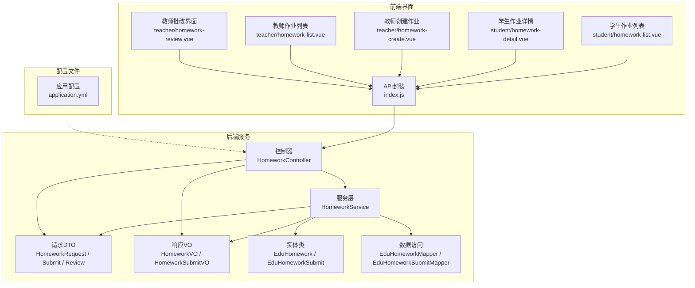
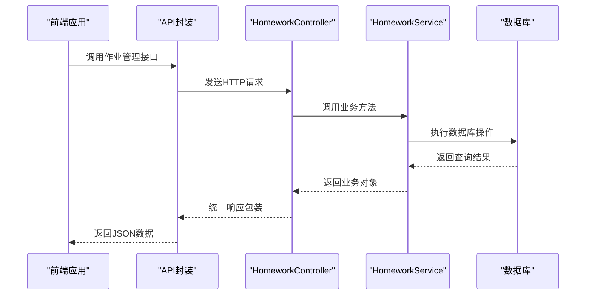
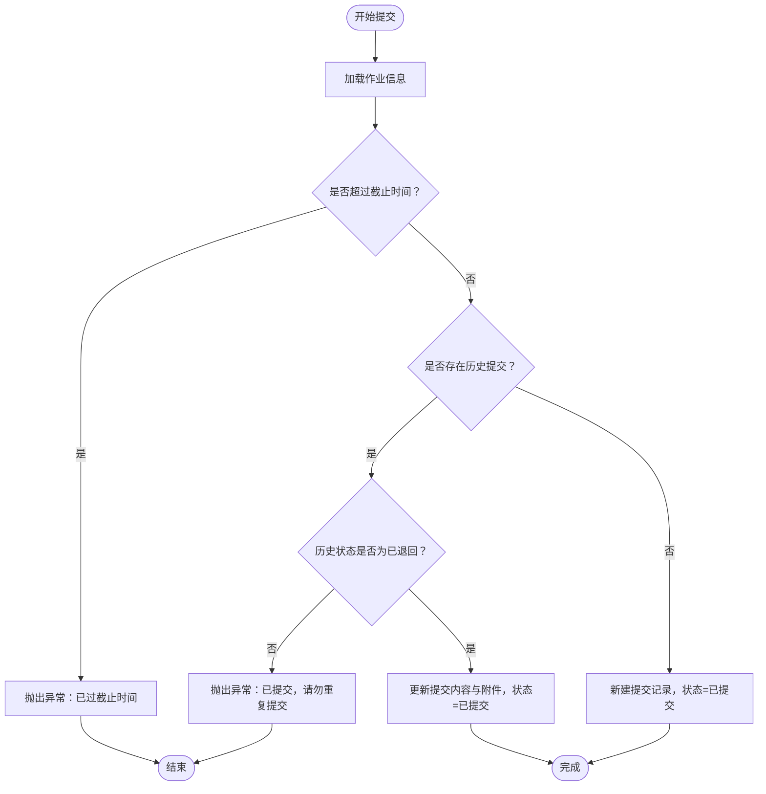
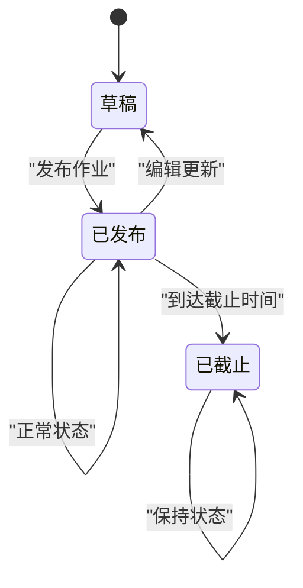
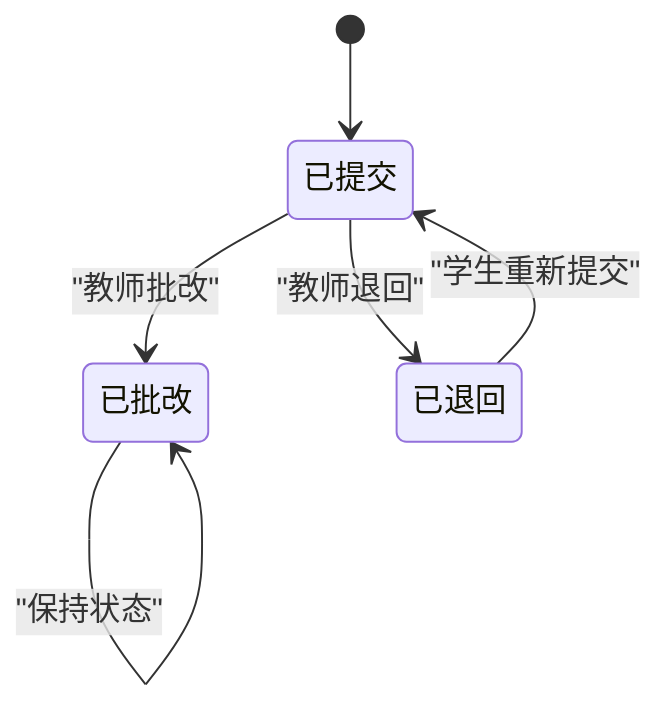
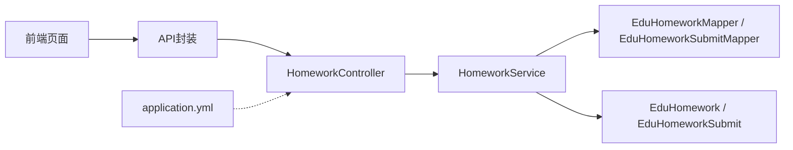

# 作业管理API

<cite>
**本文引用的文件**
- [HomeworkController.java](file://helenedu-backend/src/main/java/com/helen/eduedu/controller/HomeworkController.java)
- [HomeworkService.java](file://helenedu-backend/src/main/java/com/helen/eduedu/service/HomeworkService.java)
- [HomeworkRequest.java](file://helenedu-backend/src/main/java/com/helen/eduedu/dto/HomeworkRequest.java)
- [HomeworkSubmitRequest.java](file://helenedu-backend/src/main/java/com/helen/eduedu/dto/HomeworkSubmitRequest.java)
- [HomeworkReviewRequest.java](file://helenedu-backend/src/main/java/com/helen/eduedu/dto/HomeworkReviewRequest.java)
- [HomeworkVO.java](file://helenedu-backend/src/main/java/com/helen/eduedu/vo/HomeworkVO.java)
- [HomeworkSubmitVO.java](file://helenedu-backend/src/main/java/com/helen/eduedu/vo/HomeworkSubmitVO.java)
- [EduHomework.java](file://helenedu-backend/src/main/java/com/helen/eduedu/entity/EduHomework.java)
- [EduHomeworkSubmit.java](file://helenedu-backend/src/main/java/com/helen/eduedu/entity/EduHomeworkSubmit.java)
- [EduHomeworkMapper.java](file://helenedu-backend/src/main/java/com/helen/eduedu/mapper/EduHomeworkMapper.java)
- [EduHomeworkSubmitMapper.java](file://helenedu-backend/src/main/java/com/helen/eduedu/mapper/EduHomeworkSubmitMapper.java)
- [application.yml](file://helenedu-backend/src/main/resources/application.yml)
- [index.js](file://helenedu-frontend/src/api/index.js)
- [homework-list.vue（学生端）](file://helenedu-frontend/src/pages/student/homework-list.vue)
- [homework-detail.vue（学生端）](file://helenedu-frontend/src/pages/student/homework-detail.vue)
- [homework-list.vue（教师端）](file://helenedu-frontend/src/pages/teacher/homework-list.vue)
- [homework-review.vue（教师端）](file://helenedu-frontend/src/pages/teacher/homework-review.vue)
- [homework-create.vue（教师端）](file://helenedu-frontend/src/pages/teacher/homework-create.vue)
</cite>

## 更新摘要
**所做更改**
- 新增了完整的作业发布功能，支持全班和指定学生两种布置范围
- 完善了作业状态管理机制，包括草稿、已发布、已截止状态
- 增强了提交状态流转，支持已提交、已批改、已退回三种状态
- 优化了前端界面实现，包括作业列表、详情、提交、批改等完整功能
- 完善了附件上传处理，支持图片和文件混合上传
- 增强了权限控制和角色验证机制

## 目录
1. [简介](#简介)
2. [项目结构](#项目结构)
3. [核心组件](#核心组件)
4. [架构总览](#架构总览)
5. [详细组件分析](#详细组件分析)
6. [依赖分析](#依赖分析)
7. [性能考虑](#性能考虑)
8. [故障排查指南](#故障排查指南)
9. [结论](#结论)
10. [附录](#附录)

## 简介
本文件为"作业管理模块"的完整API文档，覆盖作业发布、提交、批改、查询等全流程。经过完整实现，现已支持以下核心功能：
- 作业发布：支持全班发布和指定学生发布两种模式
- 作业提交：学生端可在线提交作业，支持文本内容和附件上传
- 作业批改：教师端可进行评分和评语批改，支持退回功能
- 作业查询：学生端查看个人作业列表，教师端管理班级作业
- 状态管理：完整的作业生命周期状态流转
- 权限控制：基于角色的访问控制机制

## 项目结构
后端采用Spring Boot分层架构：Controller负责HTTP接口，Service封装业务逻辑，Mapper访问数据库，DTO/VO用于接口数据传输。前端采用Vue.js框架，提供完整的用户界面。

**图表来源**
- [HomeworkController.java:24-125](file://helenedu-backend/src/main/java/com/helen/eduedu/controller/HomeworkController.java#L24-L125)
- [HomeworkService.java:26-371](file://helenedu-backend/src/main/java/com/helen/eduedu/service/HomeworkService.java#L26-L371)
- [index.js:1-50](file://helenedu-frontend/src/api/index.js#L1-L50)

## 核心组件
- **控制器层**：提供RESTful API接口，负责请求处理、参数验证、权限控制和响应封装
- **服务层**：实现核心业务逻辑，包括作业管理、提交处理、状态转换等
- **数据传输对象**：HomeworkRequest、HomeworkSubmitRequest、HomeworkReviewRequest
- **视图对象**：HomeworkVO、HomeworkSubmitVO，用于对外输出标准化数据
- **实体类**：EduHomework、EduHomeworkSubmit，映射数据库表结构
- **数据访问层**：EduHomeworkMapper、EduHomeworkSubmitMapper，提供数据库操作接口

**章节来源**
- [HomeworkController.java:24-125](file://helenedu-backend/src/main/java/com/helen/eduedu/controller/HomeworkController.java#L24-L125)
- [HomeworkService.java:26-371](file://helenedu-backend/src/main/java/com/helen/eduedu/service/HomeworkService.java#L26-L371)
- [HomeworkRequest.java:10-39](file://helenedu-backend/src/main/java/com/helen/eduedu/dto/HomeworkRequest.java#L10-L39)
- [HomeworkSubmitRequest.java:7-15](file://helenedu-backend/src/main/java/com/helen/eduedu/dto/HomeworkSubmitRequest.java#L7-L15)
- [HomeworkReviewRequest.java:8-23](file://helenedu-backend/src/main/java/com/helen/eduedu/dto/HomeworkReviewRequest.java#L8-L23)
- [HomeworkVO.java:8-41](file://helenedu-backend/src/main/java/com/helen/eduedu/vo/HomeworkVO.java#L8-L41)
- [HomeworkSubmitVO.java:9-28](file://helenedu-backend/src/main/java/com/helen/eduedu/vo/HomeworkSubmitVO.java#L9-L28)
- [EduHomework.java:13-55](file://helenedu-backend/src/main/java/com/helen/eduedu/entity/EduHomework.java#L13-L55)
- [EduHomeworkSubmit.java:14-52](file://helenedu-backend/src/main/java/com/helen/eduedu/entity/EduHomeworkSubmit.java#L14-L52)

## 架构总览
系统采用前后端分离架构，后端通过Spring Boot提供RESTful API，前端通过Vue.js构建单页应用。系统集成了JWT认证、文件上传、分页查询等核心功能。

**图表来源**
- [index.js:1-50](file://helenedu-frontend/src/api/index.js#L1-L50)
- [HomeworkController.java:24-125](file://helenedu-backend/src/main/java/com/helen/eduedu/controller/HomeworkController.java#L24-L125)
- [HomeworkService.java:26-371](file://helenedu-backend/src/main/java/com/helen/eduedu/service/HomeworkService.java#L26-L371)

## 详细组件分析

### 1. 作业发布接口
- **接口**：POST /api/homework
- **权限**：教师角色（角色ID=2）
- **功能**：创建作业，支持全班发布和指定学生发布两种模式
- **参数说明**（HomeworkRequest）
  - title：作业标题（必填，非空字符串）
  - content：作业内容（可选）
  - classId：班级ID（必填，非空）
  - subject：学科（可选）
  - deadline：截止时间（可选）
  - attachmentUrls：附件URL列表（可选）
  - status：状态（0-草稿；1-已发布；默认1）
  - targetType：目标类型（0-全班；1-指定学生；默认0）
  - studentIds：指定学生ID列表（targetType=1时必填）
- **响应**：Long类型作业ID
- **注意事项**
  - 服务层自动设置教师ID和默认状态
  - 支持附件URL数组存储
  - 指定学生模式需要提供学生ID列表

**章节来源**
- [HomeworkController.java:32-39](file://helenedu-backend/src/main/java/com/helen/eduedu/controller/HomeworkController.java#L32-L39)
- [HomeworkRequest.java:10-39](file://helenedu-backend/src/main/java/com/helen/eduedu/dto/HomeworkRequest.java#L10-L39)
- [HomeworkService.java:37-66](file://helenedu-backend/src/main/java/com/helen/eduedu/service/HomeworkService.java#L37-L66)
- [homework-create.vue（教师端）:265-307](file://helenedu-frontend/src/pages/teacher/homework-create.vue#L265-L307)

### 2. 作业更新接口
- **接口**：PUT /api/homework/{id}
- **权限**：教师角色
- **功能**：更新指定作业信息
- **参数**：同作业发布请求
- **响应**：空对象
- **行为**：通过ID查找作业并更新，不存在则抛出业务异常

**章节来源**
- [HomeworkController.java:41-48](file://helenedu-backend/src/main/java/com/helen/eduedu/controller/HomeworkController.java#L41-L48)
- [HomeworkService.java:68-81](file://helenedu-backend/src/main/java/com/helen/eduedu/service/HomeworkService.java#L68-L81)

### 3. 作业删除接口
- **接口**：DELETE /api/homework/{id}
- **权限**：教师角色
- **功能**：删除作业
- **响应**：空对象
- **行为**：通过ID删除作业记录

**章节来源**
- [HomeworkController.java:50-56](file://helenedu-backend/src/main/java/com/helen/eduedu/controller/HomeworkController.java#L50-L56)
- [HomeworkService.java:83-89](file://helenedu-backend/src/main/java/com/helen/eduedu/service/HomeworkService.java#L83-L89)

### 4. 作业详情查询接口
- **接口**：GET /api/homework/{id}
- **权限**：登录用户（根据角色区分可见性）
- **功能**：获取作业详情，包含班级名、教师名、提交统计、学生端"我的提交状态"
- **响应**：HomeworkVO
  - 基础字段：id、title、content、classId、className、teacherId、teacherName、subject、deadline、attachmentUrls、status、targetType、createdAt
  - 统计字段（教师视角）：totalCount、submitCount、reviewedCount
  - 指定学生信息（教师视角，targetType=1）：targetStudentIds、targetStudentNames
  - 学生视角：mySubmitStatus（0-未提交；1-已提交；2-已批改；3-已退回）、mySubmitId
- **注意**：学生端可看到"我的提交状态"，便于引导提交或查看批改结果

**章节来源**
- [HomeworkController.java:58-64](file://helenedu-backend/src/main/java/com/helen/eduedu/controller/HomeworkController.java#L58-L64)
- [HomeworkService.java:91-100](file://helenedu-backend/src/main/java/com/helen/eduedu/service/HomeworkService.java#L91-L100)
- [HomeworkVO.java:8-41](file://helenedu-backend/src/main/java/com/helen/eduedu/vo/HomeworkVO.java#L8-L41)

### 5. 教师作业列表接口
- **接口**：GET /api/homework/list
- **权限**：教师角色
- **参数**：
  - classId：班级过滤（可选）
  - page：页码，默认1
  - size：每页条数，默认10
- **响应**：分页结果（PageResult<HomeworkVO>）
- **功能**：按教师和班级维度查询作业列表

**章节来源**
- [HomeworkController.java:66-76](file://helenedu-backend/src/main/java/com/helen/eduedu/controller/HomeworkController.java#L66-L76)
- [HomeworkService.java:102-120](file://helenedu-backend/src/main/java/com/helen/eduedu/service/HomeworkService.java#L102-L120)

### 6. 学生作业列表接口
- **接口**：GET /api/homework/student-list
- **权限**：学生角色
- **参数**：
  - status：按提交状态过滤（0-未提交；1-已提交；2-已批改；3-已退回；可选）
  - page：页码，默认1
  - size：每页条数，默认10
- **响应**：分页结果（PageResult<HomeworkVO>），仅展示已发布的作业
- **功能**：根据学生所在班级和指定学生关系查询作业

**章节来源**
- [HomeworkController.java:78-88](file://helenedu-backend/src/main/java/com/helen/eduedu/controller/HomeworkController.java#L78-L88)
- [HomeworkService.java:122-176](file://helenedu-backend/src/main/java/com/helen/eduedu/service/HomeworkService.java#L122-L176)
- [homework-list.vue（学生端）:78-98](file://helenedu-frontend/src/pages/student/homework-list.vue#L78-L98)

### 7. 作业提交接口
- **接口**：POST /api/homework/{id}/submit
- **权限**：学生角色
- **参数**：HomeworkSubmitRequest
  - content：提交内容（可选）
  - attachmentUrls：附件URL列表（可选）
- **行为规则**
  - 若超过截止时间则拒绝提交
  - 已提交且非"已退回"状态不可重复提交
  - 退回后可重新提交，重新提交时会清空分数与评语并重置状态为"已提交"
- **响应**：空对象

**图表来源**
- [HomeworkService.java:178-222](file://helenedu-backend/src/main/java/com/helen/eduedu/service/HomeworkService.java#L178-L222)

**章节来源**
- [HomeworkController.java:90-100](file://helenedu-backend/src/main/java/com/helen/eduedu/controller/HomeworkController.java#L90-L100)
- [HomeworkSubmitRequest.java:7-15](file://helenedu-backend/src/main/java/com/helen/eduedu/dto/HomeworkSubmitRequest.java#L7-L15)
- [HomeworkService.java:178-222](file://helenedu-backend/src/main/java/com/helen/eduedu/service/HomeworkService.java#L178-L222)

### 8. 提交列表查询接口
- **接口**：GET /api/homework/{id}/submits
- **权限**：教师角色
- **参数**：
  - status：按状态过滤（0-已提交；1-已批改；2-已退回；可选）
- **响应**：List<HomeworkSubmitVO>
  - 字段：id、homeworkId、homeworkTitle、studentId、studentName、content、attachmentUrls、score、comment、status、statusName、submitTime、reviewTime

**章节来源**
- [HomeworkController.java:102-109](file://helenedu-backend/src/main/java/com/helen/eduedu/controller/HomeworkController.java#L102-L109)
- [HomeworkService.java:224-239](file://helenedu-backend/src/main/java/com/helen/eduedu/service/HomeworkService.java#L224-L239)
- [HomeworkSubmitVO.java:9-28](file://helenedu-backend/src/main/java/com/helen/eduedu/vo/HomeworkSubmitVO.java#L9-L28)

### 9. 提交详情查询接口
- **接口**：GET /api/homework/submit/{id}
- **权限**：登录用户（可查看自己的提交详情）
- **响应**：HomeworkSubmitVO
- **功能**：获取单个提交的详细信息

**章节来源**
- [HomeworkController.java:119-123](file://helenedu-backend/src/main/java/com/helen/eduedu/controller/HomeworkController.java#L119-L123)
- [HomeworkService.java:258-268](file://helenedu-backend/src/main/java/com/helen/eduedu/service/HomeworkService.java#L258-L268)

### 10. 作业批改接口
- **接口**：PUT /api/homework/submit/{id}/review
- **权限**：教师角色
- **参数**：HomeworkReviewRequest
  - score：分数（必填，数值类型）
  - comment：评语（可选）
  - status：状态（1-已批改；2-已退回；必填）
- **行为规则**
  - 设置分数、评语、状态，并记录批改时间
  - 支持"退回"操作，便于学生重新提交
- **响应**：空对象

**章节来源**
- [HomeworkController.java:111-117](file://helenedu-backend/src/main/java/com/helen/eduedu/controller/HomeworkController.java#L111-L117)
- [HomeworkReviewRequest.java:8-23](file://helenedu-backend/src/main/java/com/helen/eduedu/dto/HomeworkReviewRequest.java#L8-L23)
- [HomeworkService.java:241-256](file://helenedu-backend/src/main/java/com/helen/eduedu/service/HomeworkService.java#L241-L256)
- [homework-review.vue（教师端）:94-122](file://helenedu-frontend/src/pages/teacher/homework-review.vue#L94-L122)

### 11. 数据模型与状态说明
- **实体类**
  - EduHomework：作业实体，包含标题、内容、班级、教师、学科、截止时间、附件、状态、目标类型、创建/更新时间
  - EduHomeworkSubmit：提交实体，包含内容、附件、分数、评语、状态、提交/批改时间
- **状态定义**
  - 作业状态：0-草稿；1-已发布；2-已截止
  - 提交状态：0-已提交；1-已批改；2-已退回
  - 目标类型：0-全班；1-指定学生
- **VO结构**
  - HomeworkVO：作业详情，含统计与学生端"我的提交状态"
  - HomeworkSubmitVO：提交详情，含状态名称与关联作业/学生信息

**章节来源**
- [EduHomework.java:13-55](file://helenedu-backend/src/main/java/com/helen/eduedu/entity/EduHomework.java#L13-L55)
- [EduHomeworkSubmit.java:14-52](file://helenedu-backend/src/main/java/com/helen/eduedu/entity/EduHomeworkSubmit.java#L14-L52)
- [HomeworkVO.java:8-41](file://helenedu-backend/src/main/java/com/helen/eduedu/vo/HomeworkVO.java#L8-L41)
- [HomeworkSubmitVO.java:9-28](file://helenedu-backend/src/main/java/com/helen/eduedu/vo/HomeworkSubmitVO.java#L9-L28)

### 12. 作业状态流转

**图表来源**
- [EduHomework.java:45-46](file://helenedu-backend/src/main/java/com/helen/eduedu/entity/EduHomework.java#L45-L46)
- [HomeworkService.java:44-46](file://helenedu-backend/src/main/java/com/helen/eduedu/service/HomeworkService.java#L44-L46)

**图表来源**
- [EduHomeworkSubmit.java:43-44](file://helenedu-backend/src/main/java/com/helen/eduedu/entity/EduHomeworkSubmit.java#L43-L44)
- [HomeworkService.java:200-221](file://helenedu-backend/src/main/java/com/helen/eduedu/service/HomeworkService.java#L200-L221)

## 依赖分析
- **控制器依赖服务层**：控制器通过依赖注入使用HomeworkService
- **服务层依赖数据访问层**：服务层使用各种Mapper进行数据库操作
- **前端依赖后端API**：前端通过封装的API方法调用后端接口
- **配置文件影响**：application.yml配置文件影响文件上传大小限制与Swagger文档路径

**图表来源**
- [HomeworkController.java:24-125](file://helenedu-backend/src/main/java/com/helen/eduedu/controller/HomeworkController.java#L24-L125)
- [HomeworkService.java:26-371](file://helenedu-backend/src/main/java/com/helen/eduedu/service/HomeworkService.java#L26-L371)
- [application.yml:1-59](file://helenedu-backend/src/main/resources/application.yml#L1-L59)
- [index.js:1-50](file://helenedu-frontend/src/api/index.js#L1-L50)

**章节来源**
- [HomeworkController.java:24-125](file://helenedu-backend/src/main/java/com/helen/eduedu/controller/HomeworkController.java#L24-L125)
- [HomeworkService.java:26-371](file://helenedu-backend/src/main/java/com/helen/eduedu/service/HomeworkService.java#L26-L371)
- [application.yml:1-59](file://helenedu-backend/src/main/resources/application.yml#L1-L59)
- [index.js:1-50](file://helenedu-frontend/src/api/index.js#L1-L50)

## 性能考虑
- **列表查询优化**：使用分页（Page）避免一次性加载过多数据
- **统计信息聚合**：在服务层进行统计计算，减少多次数据库查询
- **索引建议**：
  - 作业表：班级ID、状态、创建时间、教师ID
  - 提交表：作业ID、学生ID、状态
  - 关联表：作业ID、学生ID
- **缓存策略**：可考虑对常用查询结果进行缓存
- **批量操作**：批量获取学生信息时使用批量查询

## 故障排查指南
- **提交被拒**
  - 现象：提示"已过截止时间，无法提交"
  - 处理：确认作业截止时间设置，或联系教师延长
  - 参考：[HomeworkService.java:188-191](file://helenedu-backend/src/main/java/com/helen/eduedu/service/HomeworkService.java#L188-L191)
- **重复提交**
  - 现象：提示"已提交，请勿重复提交"
  - 处理：若状态为"已退回"，可重新提交
  - 参考：[HomeworkService.java:200-203](file://helenedu-backend/src/main/java/com/helen/eduedu/service/HomeworkService.java#L200-L203)
- **作业不存在**
  - 现象：查询详情或批改时提示作业不存在
  - 处理：检查作业ID是否正确
  - 参考：[HomeworkService.java:96-98](file://helenedu-backend/src/main/java/com/helen/eduedu/service/HomeworkService.java#L96-L98)
- **提交记录不存在**
  - 现象：批改或查看提交详情时报错
  - 处理：确认提交ID是否正确
  - 参考：[HomeworkService.java:246-249](file://helenedu-backend/src/main/java/com/helen/eduedu/service/HomeworkService.java#L246-L249)
- **权限不足**
  - 现象：403 Forbidden错误
  - 处理：确认用户角色是否为教师或学生
  - 参考：[HomeworkController.java:34-53](file://helenedu-backend/src/main/java/com/helen/eduedu/controller/HomeworkController.java#L34-L53)

**章节来源**
- [HomeworkService.java:188-203](file://helenedu-backend/src/main/java/com/helen/eduedu/service/HomeworkService.java#L188-L203)
- [HomeworkService.java:96-98](file://helenedu-backend/src/main/java/com/helen/eduedu/service/HomeworkService.java#L96-L98)
- [HomeworkService.java:246-249](file://helenedu-backend/src/main/java/com/helen/eduedu/service/HomeworkService.java#L246-L249)
- [HomeworkController.java:34-53](file://helenedu-backend/src/main/java/com/helen/eduedu/controller/HomeworkController.java#L34-L53)

## 结论
作业管理模块已完全实现，提供了完整的作业生命周期管理能力：

**核心功能完整**：教师端可发布、管理作业；学生端可查看、提交作业；教师端可查看提交并进行批改

**状态管理完善**：作业状态（草稿、已发布、已截止）和提交状态（已提交、已批改、已退回）流转清晰

**权限控制严格**：基于角色的访问控制确保数据安全

**前端界面丰富**：提供完整的用户界面，包括作业列表、详情、提交、批改等功能

**性能优化到位**：分页查询、统计聚合、索引建议等优化措施

建议在生产环境中结合分页与索引优化查询性能，并在前端做好状态提示与交互反馈。

## 附录

### A. 接口调用示例（路径参考）
- **学生端**
  - 获取作业列表：[index.js](file://helenedu-frontend/src/api/index.js#L4)
  - 查看作业详情：[index.js](file://helenedu-frontend/src/api/index.js#L6)
  - 提交作业：[index.js](file://helenedu-frontend/src/api/index.js#L10)
  - 查看提交详情：[index.js](file://helenedu-frontend/src/api/index.js#L13)
- **教师端**
  - 获取作业列表：[index.js](file://helenedu-frontend/src/api/index.js#L5)
  - 查看提交列表：[index.js](file://helenedu-frontend/src/api/index.js#L11)
  - 批改作业：[index.js](file://helenedu-frontend/src/api/index.js#L12)
  - 创建/编辑作业：[index.js:7-9](file://helenedu-frontend/src/api/index.js#L7-9)

**章节来源**
- [index.js:1-50](file://helenedu-frontend/src/api/index.js#L1-L50)

### B. 前端页面与接口映射
- **学生作业列表页**：[homework-list.vue（学生端）:78-98](file://helenedu-frontend/src/pages/student/homework-list.vue#L78-L98)
- **学生作业详情页**：[homework-detail.vue（学生端）](file://helenedu-frontend/src/pages/student/homework-detail.vue)
- **教师作业列表页**：[homework-list.vue（教师端）:71-78](file://helenedu-frontend/src/pages/teacher/homework-list.vue#L71-L78)
- **教师批改页**：[homework-review.vue（教师端）:73-81](file://helenedu-frontend/src/pages/teacher/homework-review.vue#L73-L81)
- **教师创建作业页**：[homework-create.vue（教师端）:135-175](file://helenedu-frontend/src/pages/teacher/homework-create.vue#L135-L175)

**章节来源**
- [homework-list.vue（学生端）:78-98](file://helenedu-frontend/src/pages/student/homework-list.vue#L78-L98)
- [homework-list.vue（教师端）:71-78](file://helenedu-frontend/src/pages/teacher/homework-list.vue#L71-L78)
- [homework-review.vue（教师端）:73-81](file://helenedu-frontend/src/pages/teacher/homework-review.vue#L73-L81)
- [homework-create.vue（教师端）:135-175](file://helenedu-frontend/src/pages/teacher/homework-create.vue#L135-L175)

### C. 配置文件说明
- **文件上传配置**：最大文件大小50MB，最大请求大小100MB
- **数据库连接**：MySQL 8.0，字符集utf-8
- **JWT配置**：7天有效期
- **Swagger配置**：Knife4j增强版API文档

**章节来源**
- [application.yml:1-59](file://helenedu-backend/src/main/resources/application.yml#L1-L59)