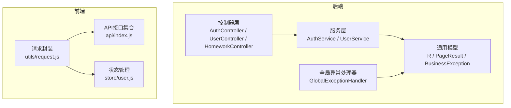
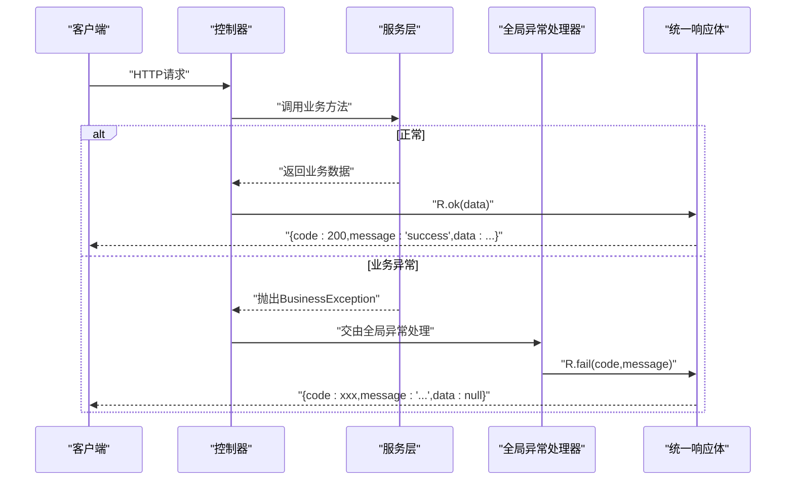
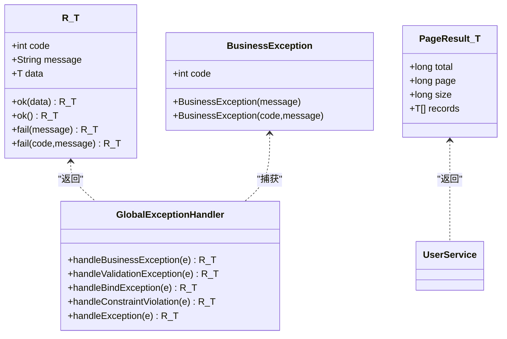

# 响应格式规范

<cite>
**本文引用的文件**
- [R.java](file://helenedu-backend/src/main/java/com/helen/eduedu/common/R.java)
- [PageResult.java](file://helenedu-backend/src/main/java/com/helen/eduedu/common/PageResult.java)
- [BusinessException.java](file://helenedu-backend/src/main/java/com/helen/eduedu/common/BusinessException.java)
- [GlobalExceptionHandler.java](file://helenedu-backend/src/main/java/com/helen/eduedu/common/GlobalExceptionHandler.java)
- [AuthController.java](file://helenedu-backend/src/main/java/com/helen/eduedu/controller/AuthController.java)
- [UserController.java](file://helenedu-backend/src/main/java/com/helen/eduedu/controller/UserController.java)
- [HomeworkController.java](file://helenedu-backend/src/main/java/com/helen/eduedu/controller/HomeworkController.java)
- [AuthService.java](file://helenedu-backend/src/main/java/com/helen/eduedu/service/AuthService.java)
- [UserService.java](file://helenedu-backend/src/main/java/com/helen/eduedu/service/UserService.java)
- [request.js](file://helenedu-frontend/src/utils/request.js)
- [index.js](file://helenedu-frontend/src/api/index.js)
- [user.js](file://helenedu-frontend/src/store/user.js)
- [application.yml](file://helenedu-backend/src/main/resources/application.yml)
</cite>

## 目录
1. [简介](#简介)
2. [项目结构](#项目结构)
3. [核心组件](#核心组件)
4. [架构总览](#架构总览)
5. [详细组件分析](#详细组件分析)
6. [依赖关系分析](#依赖关系分析)
7. [性能考量](#性能考量)
8. [故障排查指南](#故障排查指南)
9. [结论](#结论)
10. [附录](#附录)

## 简介
本规范文档面向HelenEdu系统的前后端开发者，统一后端API的响应格式与错误处理机制，明确R类统一响应体、PageResult分页响应、BusinessException业务异常的错误码与消息格式，并给出HTTP状态码与业务状态码的映射关系、序列化与反序列化注意事项，以及客户端处理响应的最佳实践与错误处理策略。

## 项目结构
后端采用Spring Boot工程，统一响应体与异常处理位于common包；控制器层通过R类返回统一格式；分页结果通过PageResult封装；全局异常处理器将业务异常转换为统一响应体；前端通过封装的请求工具对响应进行解析与错误提示。

图表来源
- [AuthController.java:1-39](file://helenedu-backend/src/main/java/com/helen/eduedu/controller/AuthController.java#L1-L39)
- [UserController.java:1-78](file://helenedu-backend/src/main/java/com/helen/eduedu/controller/UserController.java#L1-L78)
- [HomeworkController.java:1-123](file://helenedu-backend/src/main/java/com/helen/eduedu/controller/HomeworkController.java#L1-L123)
- [AuthService.java:1-128](file://helenedu-backend/src/main/java/com/helen/eduedu/service/AuthService.java#L1-L128)
- [UserService.java:1-130](file://helenedu-backend/src/main/java/com/helen/eduedu/service/UserService.java#L1-L130)
- [R.java:1-42](file://helenedu-backend/src/main/java/com/helen/eduedu/common/R.java#L1-L42)
- [PageResult.java:1-25](file://helenedu-backend/src/main/java/com/helen/eduedu/common/PageResult.java#L1-L25)
- [BusinessException.java:1-22](file://helenedu-backend/src/main/java/com/helen/eduedu/common/BusinessException.java#L1-L22)
- [GlobalExceptionHandler.java:1-58](file://helenedu-backend/src/main/java/com/helen/eduedu/common/GlobalExceptionHandler.java#L1-L58)
- [request.js:1-83](file://helenedu-frontend/src/utils/request.js#L1-L83)
- [index.js:1-50](file://helenedu-frontend/src/api/index.js#L1-L50)
- [user.js:1-62](file://helenedu-frontend/src/store/user.js#L1-L62)

章节来源
- [application.yml:1-59](file://helenedu-backend/src/main/resources/application.yml#L1-L59)

## 核心组件
- R<T> 统一响应体：包含code、message、data三部分，提供静态工厂方法ok()与fail()，支持泛型承载任意业务数据。
- PageResult<T> 分页结果：包含total、page、size、records四个字段，用于分页查询的统一返回格式。
- BusinessException 业务异常：继承RuntimeException，携带业务错误码code与message，便于全局捕获并转换为统一响应体。
- GlobalExceptionHandler 全局异常处理：将不同异常类型转换为R<T>统一响应体，并设置合适的HTTP状态码。

章节来源
- [R.java:1-42](file://helenedu-backend/src/main/java/com/helen/eduedu/common/R.java#L1-L42)
- [PageResult.java:1-25](file://helenedu-backend/src/main/java/com/helen/eduedu/common/PageResult.java#L1-L25)
- [BusinessException.java:1-22](file://helenedu-backend/src/main/java/com/helen/eduedu/common/BusinessException.java#L1-L22)
- [GlobalExceptionHandler.java:1-58](file://helenedu-backend/src/main/java/com/helen/eduedu/common/GlobalExceptionHandler.java#L1-L58)

## 架构总览
后端控制器直接返回R<T>或PageResult<T>，服务层抛出BusinessException时由全局异常处理器统一拦截并转换为R<T>；前端请求封装根据HTTP状态码与业务code进行判断，提取data或提示错误信息。

图表来源
- [AuthController.java:26-37](file://helenedu-backend/src/main/java/com/helen/eduedu/controller/AuthController.java#L26-L37)
- [UserService.java:78-98](file://helenedu-backend/src/main/java/com/helen/eduedu/service/UserService.java#L78-L98)
- [GlobalExceptionHandler.java:19-56](file://helenedu-backend/src/main/java/com/helen/eduedu/common/GlobalExceptionHandler.java#L19-L56)
- [R.java:16-40](file://helenedu-backend/src/main/java/com/helen/eduedu/common/R.java#L16-L40)

## 详细组件分析

### R<T> 统一响应体
- 字段定义
  - code: 业务状态码，整数类型
  - message: 业务消息，字符串类型
  - data: 泛型业务数据，可为任意对象或null
- 工厂方法
  - ok(data): code=200，message="success"，data为传入业务数据
  - ok(): code=200，message="success"，data=null
  - fail(message): code=500，message为传入错误信息
  - fail(code,message): code为指定业务错误码，message为错误信息
- 使用场景
  - 控制器直接返回R.ok()/R.fail()，确保前后端一致的响应结构
  - 支持泛型承载复杂对象或列表

章节来源
- [R.java:9-41](file://helenedu-backend/src/main/java/com/helen/eduedu/common/R.java#L9-L41)

### PageResult 分页响应
- 字段定义
  - total: 总记录数，long类型
  - page: 当前页码，long类型
  - size: 每页大小，long类型
  - records: 当前页记录列表，List<T>
- 构造方式
  - 提供全参构造函数与默认构造函数
- 使用场景
  - 列表查询接口统一返回分页结果，便于前端分页展示与交互

章节来源
- [PageResult.java:10-24](file://helenedu-backend/src/main/java/com/helen/eduedu/common/PageResult.java#L10-L24)

### BusinessException 业务异常
- 错误码与消息
  - 默认错误码：500
  - 可自定义错误码与消息
- 抛出位置
  - 服务层在业务校验失败时抛出
  - 全局异常处理器捕获并转换为R<T>统一响应体
- 常见用法
  - 用户不存在、账号被禁用、参数校验失败等

章节来源
- [BusinessException.java:9-21](file://helenedu-backend/src/main/java/com/helen/eduedu/common/BusinessException.java#L9-L21)
- [AuthService.java:65-67](file://helenedu-backend/src/main/java/com/helen/eduedu/service/AuthService.java#L65-L67)
- [UserService.java:47-52](file://helenedu-backend/src/main/java/com/helen/eduedu/service/UserService.java#L47-L52)

### 全局异常处理 GlobalExceptionHandler
- 异常映射
  - BusinessException: 返回R.fail(code,message)，HTTP状态码200
  - 参数校验异常: MethodArgumentNotValidException、BindException、ConstraintViolationException，返回R.fail(400,...)，HTTP状态码400
  - 其他未捕获异常: 返回R.fail("系统内部错误")，HTTP状态码500
- 日志记录
  - 对业务异常与系统异常进行日志输出，便于问题定位

章节来源
- [GlobalExceptionHandler.java:19-56](file://helenedu-backend/src/main/java/com/helen/eduedu/common/GlobalExceptionHandler.java#L19-L56)

### 控制器层响应示例
- 成功响应
  - 登录接口：返回R.ok(LoginVO)
  - 用户信息：返回R.ok(UserVO)
  - 列表接口：返回R.ok(PageResult<UserVO>)
- 分页响应
  - 用户列表：R.ok(userService.getUserList(page,size,role,keyword))
  - 作业列表：R.ok(homeworkService.getTeacherHomeworkList(...)) 或 R.ok(homeworkService.getStudentHomeworkList(...))
- 错误响应
  - 参数校验失败：返回R.fail(400,...)，HTTP 400
  - 业务异常：返回R.fail(code,message)，HTTP 200

章节来源
- [AuthController.java:28-37](file://helenedu-backend/src/main/java/com/helen/eduedu/controller/AuthController.java#L28-L37)
- [UserController.java:58-64](file://helenedu-backend/src/main/java/com/helen/eduedu/controller/UserController.java#L58-L64)
- [HomeworkController.java:67-86](file://helenedu-backend/src/main/java/com/helen/eduedu/controller/HomeworkController.java#L67-L86)

### 服务层与分页实现
- 分页查询
  - 使用MyBatis-Plus Page对象与LambdaQueryWrapper构建分页条件
  - 将实体列表映射为VO列表，封装为PageResult
- 业务异常抛出
  - 在用户不存在、状态异常等场景抛出BusinessException

章节来源
- [UserService.java:78-98](file://helenedu-backend/src/main/java/com/helen/eduedu/service/UserService.java#L78-L98)
- [AuthService.java:88-97](file://helenedu-backend/src/main/java/com/helen/eduedu/service/AuthService.java#L88-L97)

### 前端响应处理最佳实践
- 请求封装
  - 统一设置Authorization头，处理401未授权跳转登录
  - 成功条件：HTTP 200且R.code=200时才解析data
  - 失败条件：弹窗提示message，reject错误对象
- API接口
  - 所有接口通过封装的get/post/put/del方法调用
- 状态管理
  - 登录成功后写入token与userInfo，登出时清理缓存并跳转登录页

章节来源
- [request.js:7-44](file://helenedu-frontend/src/utils/request.js#L7-L44)
- [index.js:1-50](file://helenedu-frontend/src/api/index.js#L1-L50)
- [user.js:8-31](file://helenedu-frontend/src/store/user.js#L8-L31)

## 依赖关系分析
- 控制器依赖服务层，服务层依赖通用模型（R、PageResult、BusinessException）
- 全局异常处理器依赖R与BusinessException，统一转换异常为响应体
- 前端请求封装依赖后端统一响应格式，按约定解析data与message

图表来源
- [R.java:9-41](file://helenedu-backend/src/main/java/com/helen/eduedu/common/R.java#L9-L41)
- [PageResult.java:10-24](file://helenedu-backend/src/main/java/com/helen/eduedu/common/PageResult.java#L10-L24)
- [BusinessException.java:9-21](file://helenedu-backend/src/main/java/com/helen/eduedu/common/BusinessException.java#L9-L21)
- [GlobalExceptionHandler.java:19-56](file://helenedu-backend/src/main/java/com/helen/eduedu/common/GlobalExceptionHandler.java#L19-L56)
- [UserService.java:78-98](file://helenedu-backend/src/main/java/com/helen/eduedu/service/UserService.java#L78-L98)

## 性能考量
- 序列化与反序列化
  - 后端Jackson配置了日期格式、时区与非空字段过滤，避免冗余字段传输
  - 前端请求封装统一使用JSON格式，减少额外处理开销
- 分页优化
  - PageResult仅返回当前页records，避免一次性传输大量数据
  - 建议合理设置size，避免超大分页导致内存压力
- 异常处理
  - 全局异常处理器统一返回R<T>，减少重复代码与分支判断

章节来源
- [application.yml:16-19](file://helenedu-backend/src/main/resources/application.yml#L16-L19)

## 故障排查指南
- HTTP状态码与业务状态码映射
  - 200: 业务成功（R.code=200），message通常为"success"
  - 400: 参数校验失败（R.code=400），message为具体校验错误
  - 401: 未授权（前端检测到401，清理token并跳转登录）
  - 500: 系统内部错误（R.code=500），message为"系统内部错误"
- 常见问题
  - 参数校验失败：检查请求体字段与注解约束，确认message中包含字段名与错误描述
  - 业务异常：查看BusinessException抛出处与message，确认code与message是否符合预期
  - 登录失效：前端收到401时自动清理本地存储并跳转登录页
- 建议
  - 前端统一在请求封装中处理401与业务错误，避免在各处重复判断
  - 后端异常日志保留关键上下文，便于快速定位问题

章节来源
- [GlobalExceptionHandler.java:25-56](file://helenedu-backend/src/main/java/com/helen/eduedu/common/GlobalExceptionHandler.java#L25-L56)
- [request.js:20-44](file://helenedu-frontend/src/utils/request.js#L20-L44)

## 结论
通过R<T>统一响应体、PageResult分页封装与BusinessException异常体系，HelenEdu实现了前后端一致的响应格式与清晰的错误处理流程。配合全局异常处理器与前端请求封装，能够有效提升开发效率与用户体验。建议在后续迭代中持续完善错误码与message的国际化与可维护性。

## 附录

### 响应类型与示例说明
- 成功响应
  - 结构：{code:200,message:"success",data:业务数据}
  - 示例路径：
    - [AuthController.wxLogin:28-30](file://helenedu-backend/src/main/java/com/helen/eduedu/controller/AuthController.java#L28-L30)
    - [UserController.createUser:31-33](file://helenedu-backend/src/main/java/com/helen/eduedu/controller/UserController.java#L31-L33)
- 分页响应
  - 结构：{code:200,message:"success",data:{total,page,size,records:[...]}}
  - 示例路径：
    - [UserController.getUserList:58-64](file://helenedu-backend/src/main/java/com/helen/eduedu/controller/UserController.java#L58-L64)
    - [HomeworkController.getTeacherHomeworkList:67-74](file://helenedu-backend/src/main/java/com/helen/eduedu/controller/HomeworkController.java#L67-L74)
- 错误响应
  - 参数校验失败：{code:400,message:"字段: 错误信息"}
  - 业务异常：{code:业务码,message:"业务错误信息"}
  - 系统异常：{code:500,message:"系统内部错误"}
  - 示例路径：
    - [GlobalExceptionHandler.handleBusinessException:19-23](file://helenedu-backend/src/main/java/com/helen/eduedu/common/GlobalExceptionHandler.java#L19-L23)
    - [GlobalExceptionHandler.handleValidationException:25-33](file://helenedu-backend/src/main/java/com/helen/eduedu/common/GlobalExceptionHandler.java#L25-L33)

### HTTP状态码与业务状态码对照
- 200：业务成功（R.code=200）
- 400：参数校验失败（R.code=400）
- 401：未授权（前端处理）
- 500：系统内部错误（R.code=500）

章节来源
- [GlobalExceptionHandler.java:25-56](file://helenedu-backend/src/main/java/com/helen/eduedu/common/GlobalExceptionHandler.java#L25-L56)
- [request.js:20-28](file://helenedu-frontend/src/utils/request.js#L20-L28)