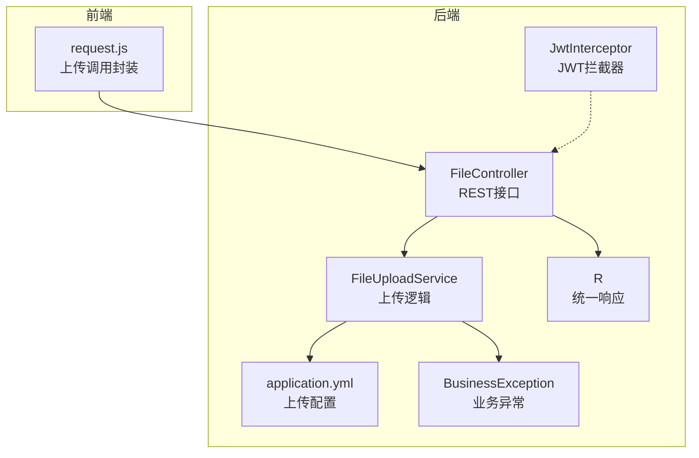
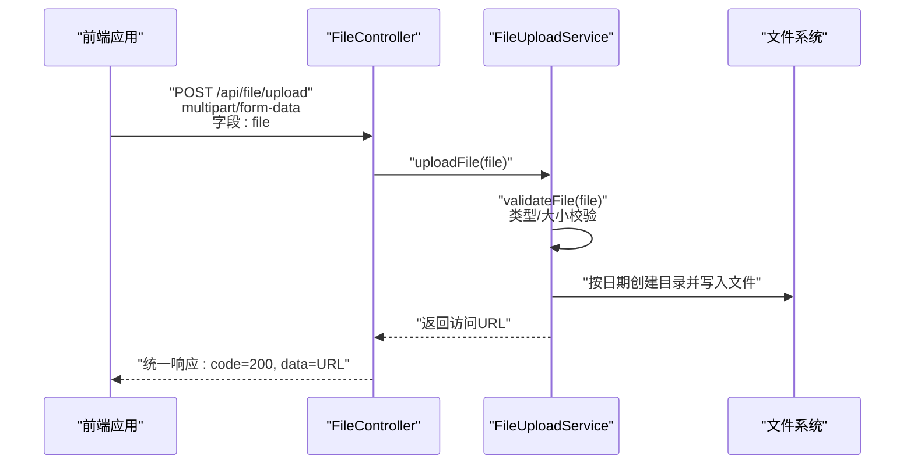
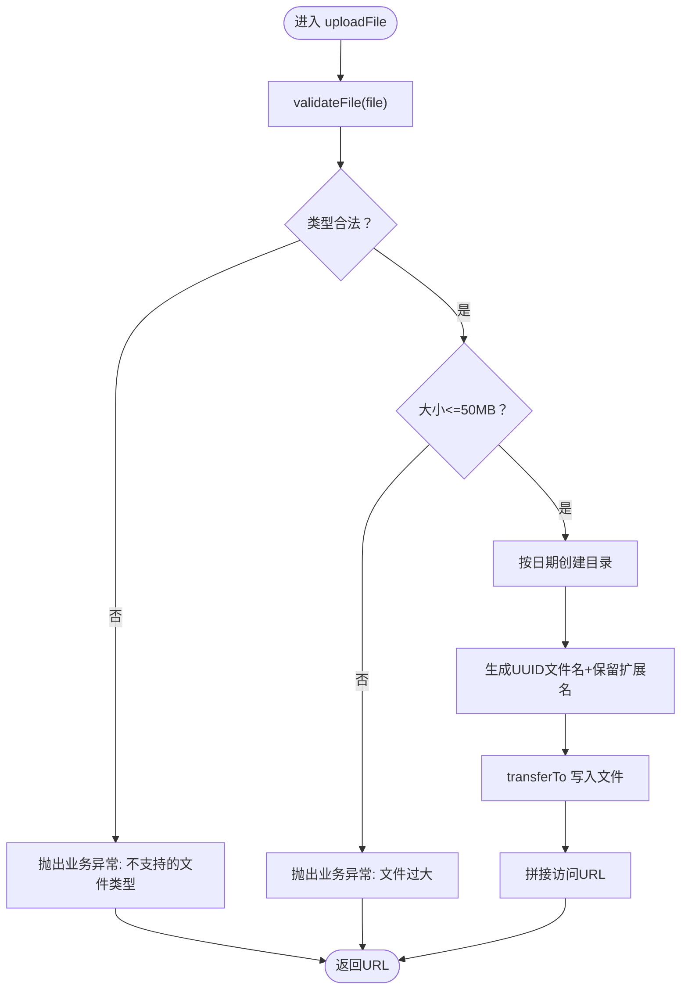
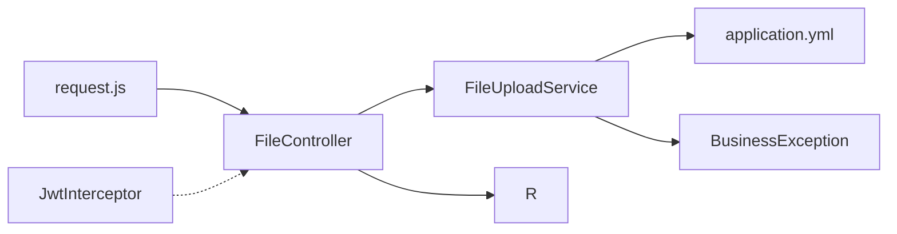

# 文件上传API

<cite>
**本文引用的文件**
- [FileController.java](file://helenedu-backend/src/main/java/com/helen/eduedu/controller/FileController.java)
- [FileUploadService.java](file://helenedu-backend/src/main/java/com/helen/eduedu/service/FileUploadService.java)
- [application.yml](file://helenedu-backend/src/main/resources/application.yml)
- [R.java](file://helenedu-backend/src/main/java/com/helen/eduedu/common/R.java)
- [BusinessException.java](file://helenedu-backend/src/main/java/com/helen/eduedu/common/BusinessException.java)
- [JwtInterceptor.java](file://helenedu-backend/src/main/java/com/helen/eduedu/security/JwtInterceptor.java)
- [request.js](file://helenedu-frontend/src/utils/request.js)
</cite>

## 目录
1. [简介](#简介)
2. [项目结构](#项目结构)
3. [核心组件](#核心组件)
4. [架构总览](#架构总览)
5. [详细组件分析](#详细组件分析)
6. [依赖分析](#依赖分析)
7. [性能考虑](#性能考虑)
8. [故障排查指南](#故障排查指南)
9. [结论](#结论)
10. [附录](#附录)

## 简介
本文件上传API文档面向后端与前端开发者，系统性说明文件上传模块的接口设计、数据格式、安全与存储策略、错误处理以及最佳实践。当前后端实现提供单文件上传与批量上传能力，并通过统一响应体与业务异常进行标准化输出；前端通过微信小程序的上传能力对接后端接口。

## 项目结构
文件上传功能由以下关键部分组成：
- 控制层：提供HTTP接口，接收multipart请求并返回统一响应
- 服务层：执行文件校验、存储与URL拼接
- 配置：Spring Boot与文件上传相关的全局配置
- 统一响应与异常：封装返回结构与业务异常
- 安全拦截：基于JWT的认证与权限控制
- 前端对接：小程序上传能力与后端接口的集成

**图表来源**
- [FileController.java:1-36](file://helenedu-backend/src/main/java/com/helen/eduedu/controller/FileController.java#L1-L36)
- [FileUploadService.java:1-101](file://helenedu-backend/src/main/java/com/helen/eduedu/service/FileUploadService.java#L1-L101)
- [application.yml:1-59](file://helenedu-backend/src/main/resources/application.yml#L1-L59)
- [R.java:1-42](file://helenedu-backend/src/main/java/com/helen/eduedu/common/R.java#L1-L42)
- [BusinessException.java:1-22](file://helenedu-backend/src/main/java/com/helen/eduedu/common/BusinessException.java#L1-L22)
- [JwtInterceptor.java:1-85](file://helenedu-backend/src/main/java/com/helen/eduedu/security/JwtInterceptor.java#L1-L85)
- [request.js:1-83](file://helenedu-frontend/src/utils/request.js#L1-L83)

**章节来源**
- [FileController.java:1-36](file://helenedu-backend/src/main/java/com/helen/eduedu/controller/FileController.java#L1-L36)
- [FileUploadService.java:1-101](file://helenedu-backend/src/main/java/com/helen/eduedu/service/FileUploadService.java#L1-L101)
- [application.yml:1-59](file://helenedu-backend/src/main/resources/application.yml#L1-L59)
- [R.java:1-42](file://helenedu-backend/src/main/java/com/helen/eduedu/common/R.java#L1-L42)
- [BusinessException.java:1-22](file://helenedu-backend/src/main/java/com/helen/eduedu/common/BusinessException.java#L1-L22)
- [JwtInterceptor.java:1-85](file://helenedu-backend/src/main/java/com/helen/eduedu/security/JwtInterceptor.java#L1-L85)
- [request.js:1-83](file://helenedu-frontend/src/utils/request.js#L1-L83)

## 核心组件
- 接口暴露
  - 单文件上传：POST /api/file/upload，表单字段名为file
  - 批量上传：POST /api/file/upload-batch，表单字段名为files（数组）
- 统一响应
  - 成功时返回code=200、message="success"及data（字符串或字符串列表）
  - 失败时返回code=500与message
- 业务异常
  - 通过BusinessException抛出，拦截器会将其转换为统一JSON响应

**章节来源**
- [FileController.java:24-34](file://helenedu-backend/src/main/java/com/helen/eduedu/controller/FileController.java#L24-L34)
- [R.java:16-40](file://helenedu-backend/src/main/java/com/helen/eduedu/common/R.java#L16-L40)
- [BusinessException.java:12-20](file://helenedu-backend/src/main/java/com/helen/eduedu/common/BusinessException.java#L12-L20)

## 架构总览
下图展示从前端发起上传请求到后端完成文件落地与URL返回的整体流程。

**图表来源**
- [FileController.java:24-28](file://helenedu-backend/src/main/java/com/helen/eduedu/controller/FileController.java#L24-L28)
- [FileUploadService.java:46-73](file://helenedu-backend/src/main/java/com/helen/eduedu/service/FileUploadService.java#L46-L73)
- [request.js:55-80](file://helenedu-frontend/src/utils/request.js#L55-L80)

## 详细组件分析

### 控制层：FileController
- 责任边界
  - 对外暴露上传接口，负责接收multipart请求
  - 将文件对象委托给服务层处理
  - 使用统一响应体包装结果
- 接口定义
  - 单文件上传：POST /api/file/upload，参数名file
  - 批量上传：POST /api/file/upload-batch，参数名files（数组）

**章节来源**
- [FileController.java:24-34](file://helenedu-backend/src/main/java/com/helen/eduedu/controller/FileController.java#L24-L34)

### 服务层：FileUploadService
- 存储策略
  - 上传根目录：由配置项file.upload-dir决定，默认./uploads
  - 目录组织：按“年/月/日”分层创建子目录
  - 文件命名：UUID去横线作为文件名，保留原扩展名
  - 访问URL：由配置项file.base-url与日期路径拼接
- 安全校验
  - 支持类型：图片（jpeg/png/gif/webp）与常见办公文档（PDF、Word、Excel及其XML版本）
  - 最大尺寸：50MB
  - 空文件检测
- 错误处理
  - IO异常统一包装为业务异常，返回统一响应

**图表来源**
- [FileUploadService.java:86-99](file://helenedu-backend/src/main/java/com/helen/eduedu/service/FileUploadService.java#L86-L99)
- [FileUploadService.java:46-73](file://helenedu-backend/src/main/java/com/helen/eduedu/service/FileUploadService.java#L46-L73)

**章节来源**
- [FileUploadService.java:26-41](file://helenedu-backend/src/main/java/com/helen/eduedu/service/FileUploadService.java#L26-L41)
- [FileUploadService.java:46-84](file://helenedu-backend/src/main/java/com/helen/eduedu/service/FileUploadService.java#L46-L84)
- [FileUploadService.java:86-99](file://helenedu-backend/src/main/java/com/helen/eduedu/service/FileUploadService.java#L86-L99)

### 配置：application.yml
- 文件上传相关
  - spring.servlet.multipart.max-file-size：单文件最大50MB
  - spring.servlet.multipart.max-request-size：请求整体最大100MB
- 自定义文件配置
  - file.upload-dir：本地上传目录
  - file.base-url：对外访问基础URL

**章节来源**
- [application.yml:13-15](file://helenedu-backend/src/main/resources/application.yml#L13-L15)
- [application.yml:44-46](file://helenedu-backend/src/main/resources/application.yml#L44-L46)

### 统一响应与异常
- 统一响应体R
  - 成功：code=200，message="success"，data为实际数据
  - 失败：code=500，message为错误信息
- 业务异常BusinessException
  - 提供默认code=500与自定义code构造

**章节来源**
- [R.java:16-40](file://helenedu-backend/src/main/java/com/helen/eduedu/common/R.java#L16-L40)
- [BusinessException.java:12-20](file://helenedu-backend/src/main/java/com/helen/eduedu/common/BusinessException.java#L12-L20)

### 安全拦截：JwtInterceptor
- 认证流程
  - 从Header提取Authorization或兼容参数token
  - 校验JWT有效性，无效则返回401并统一JSON
  - 可选角色注解校验，无权限返回403
- 与上传接口的关系
  - 上传接口未标注特定角色注解，通常受全局拦截器保护

**章节来源**
- [JwtInterceptor.java:27-67](file://helenedu-backend/src/main/java/com/helen/eduedu/security/JwtInterceptor.java#L27-L67)

### 前端对接：request.js
- 上传入口
  - uploadFile(filePath)：向 /api/file/upload 发起上传
  - 表单字段名：file
  - 自动携带Authorization头（若存在token）
- 响应处理
  - 当后端返回code=200时解析data（URL）
  - 否则弹出message提示

**章节来源**
- [request.js:55-80](file://helenedu-frontend/src/utils/request.js#L55-L80)

## 依赖分析
- 控制层依赖服务层与统一响应
- 服务层依赖配置与校验逻辑
- 前端依赖后端接口与统一响应结构
- 安全拦截器贯穿所有接口（含文件上传）

**图表来源**
- [FileController.java:24-34](file://helenedu-backend/src/main/java/com/helen/eduedu/controller/FileController.java#L24-L34)
- [FileUploadService.java:26-41](file://helenedu-backend/src/main/java/com/helen/eduedu/service/FileUploadService.java#L26-L41)
- [application.yml:44-46](file://helenedu-backend/src/main/resources/application.yml#L44-L46)
- [R.java:16-40](file://helenedu-backend/src/main/java/com/helen/eduedu/common/R.java#L16-L40)
- [BusinessException.java:12-20](file://helenedu-backend/src/main/java/com/helen/eduedu/common/BusinessException.java#L12-L20)
- [JwtInterceptor.java:27-67](file://helenedu-backend/src/main/java/com/helen/eduedu/security/JwtInterceptor.java#L27-L67)
- [request.js:55-80](file://helenedu-frontend/src/utils/request.js#L55-L80)

**章节来源**
- [FileController.java:24-34](file://helenedu-backend/src/main/java/com/helen/eduedu/controller/FileController.java#L24-L34)
- [FileUploadService.java:26-41](file://helenedu-backend/src/main/java/com/helen/eduedu/service/FileUploadService.java#L26-L41)
- [application.yml:44-46](file://helenedu-backend/src/main/resources/application.yml#L44-L46)
- [R.java:16-40](file://helenedu-backend/src/main/java/com/helen/eduedu/common/R.java#L16-L40)
- [BusinessException.java:12-20](file://helenedu-backend/src/main/java/com/helen/eduedu/common/BusinessException.java#L12-L20)
- [JwtInterceptor.java:27-67](file://helenedu-backend/src/main/java/com/helen/eduedu/security/JwtInterceptor.java#L27-L67)
- [request.js:55-80](file://helenedu-frontend/src/utils/request.js#L55-L80)

## 性能考虑
- 单文件大小限制与请求总量限制：避免内存溢出与拒绝服务
- 本地磁盘IO：建议在高并发场景下评估磁盘吞吐与目录层级深度
- URL访问：通过file.base-url统一前缀，便于CDN或反向代理加速
- 批量上传：服务层逐个校验与落盘，建议前端拆分批次以提升稳定性

[本节为通用指导，无需列出章节来源]

## 故障排查指南
- 常见错误与定位
  - 401 未登录/Token过期：检查Authorization头或token参数是否正确传递
  - 403 无权限：确认接口是否需要角色注解或用户角色
  - 500 文件过大/类型不支持：检查文件类型与大小是否超出限制
  - 500 IO异常：检查上传目录可写性与磁盘空间
- 建议排查步骤
  - 前端：确认表单字段名与Authorization头
  - 后端：查看日志与业务异常消息，核对配置项与磁盘权限

**章节来源**
- [JwtInterceptor.java:41-67](file://helenedu-backend/src/main/java/com/helen/eduedu/security/JwtInterceptor.java#L41-L67)
- [FileUploadService.java:86-99](file://helenedu-backend/src/main/java/com/helen/eduedu/service/FileUploadService.java#L86-L99)
- [application.yml:13-15](file://helenedu-backend/src/main/resources/application.yml#L13-L15)

## 结论
当前文件上传模块提供了简洁可靠的上传能力：统一的接口、严格的类型与大小校验、清晰的存储策略与URL返回。结合JWT拦截器与统一响应，能够满足大多数教学场景下的文件上传需求。后续可根据业务扩展断点续传、直传云存储等高级特性。

[本节为总结性内容，无需列出章节来源]

## 附录

### 接口定义与请求格式
- 单文件上传
  - 方法：POST
  - 路径：/api/file/upload
  - 内容类型：multipart/form-data
  - 字段：file（二进制文件）
  - 响应：统一响应体，data为文件访问URL
- 批量上传
  - 方法：POST
  - 路径：/api/file/upload-batch
  - 内容类型：multipart/form-data
  - 字段：files（文件数组）
  - 响应：统一响应体，data为URL字符串数组

**章节来源**
- [FileController.java:24-34](file://helenedu-backend/src/main/java/com/helen/eduedu/controller/FileController.java#L24-L34)

### 文件类型与大小限制
- 支持类型
  - 图片：jpeg、png、gif、webp
  - 文档：pdf、doc、docx、xls、xlsx
- 最大文件大小：50MB
- 请求总量大小：100MB

**章节来源**
- [FileUploadService.java:32-41](file://helenedu-backend/src/main/java/com/helen/eduedu/service/FileUploadService.java#L32-L41)
- [FileUploadService.java:41](file://helenedu-backend/src/main/java/com/helen/eduedu/service/FileUploadService.java#L41)
- [application.yml:13-15](file://helenedu-backend/src/main/resources/application.yml#L13-L15)

### 存储策略与命名规则
- 上传目录：file.upload-dir（默认./uploads）
- 目录结构：按“年/月/日”分层
- 文件命名：UUID（去除横线）+ 原扩展名
- 访问URL：file.base-url + 日期路径 + 文件名

**章节来源**
- [FileUploadService.java:26-31](file://helenedu-backend/src/main/java/com/helen/eduedu/service/FileUploadService.java#L26-L31)
- [FileUploadService.java:46-68](file://helenedu-backend/src/main/java/com/helen/eduedu/service/FileUploadService.java#L46-L68)
- [application.yml:44-46](file://helenedu-backend/src/main/resources/application.yml#L44-L46)

### 下载与访问
- 访问URL：服务端返回的完整URL
- 权限控制：依赖JWT拦截器，未登录或无权限将被拒绝
- 临时链接：当前实现未提供临时链接生成，建议在生产环境引入签名URL或令牌访问

**章节来源**
- [FileUploadService.java:67-68](file://helenedu-backend/src/main/java/com/helen/eduedu/service/FileUploadService.java#L67-L68)
- [JwtInterceptor.java:27-67](file://helenedu-backend/src/main/java/com/helen/eduedu/security/JwtInterceptor.java#L27-L67)

### 错误处理与最佳实践
- 错误处理
  - 类型不支持：抛出业务异常，message提示
  - 文件过大：抛出业务异常，message提示
  - IO异常：抛出业务异常，服务端日志记录
- 最佳实践
  - 前端在上传前进行类型与大小预检
  - 分批上传大批量文件
  - 在生产环境配置持久化存储与CDN加速
  - 引入断点续传与签名URL以增强安全性与体验

**章节来源**
- [FileUploadService.java:86-99](file://helenedu-backend/src/main/java/com/helen/eduedu/service/FileUploadService.java#L86-L99)
- [BusinessException.java:12-20](file://helenedu-backend/src/main/java/com/helen/eduedu/common/BusinessException.java#L12-L20)

### 前端使用示例
- 单文件上传
  - 调用封装函数，传入本地文件路径
  - 成功后得到data为URL字符串
- 批量上传
  - 将多个文件路径放入数组，逐个上传或服务端批量处理

**章节来源**
- [request.js:55-80](file://helenedu-frontend/src/utils/request.js#L55-L80)