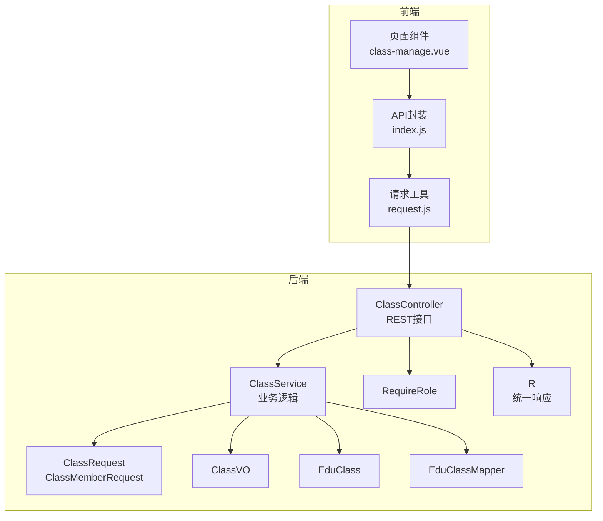
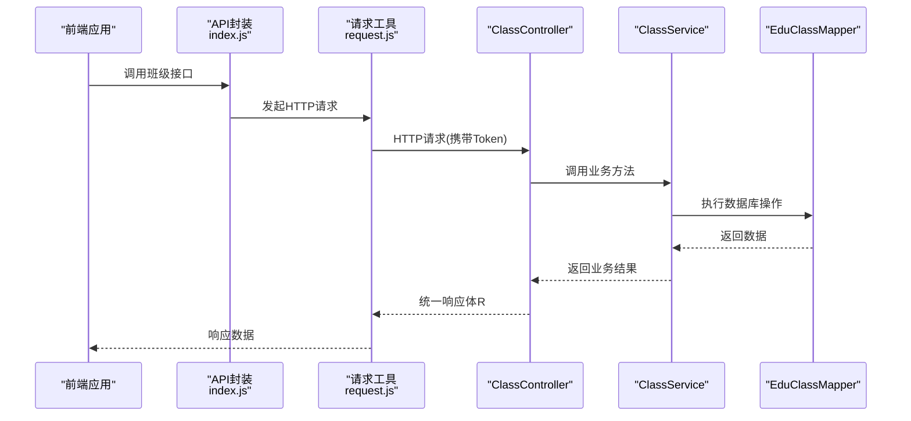
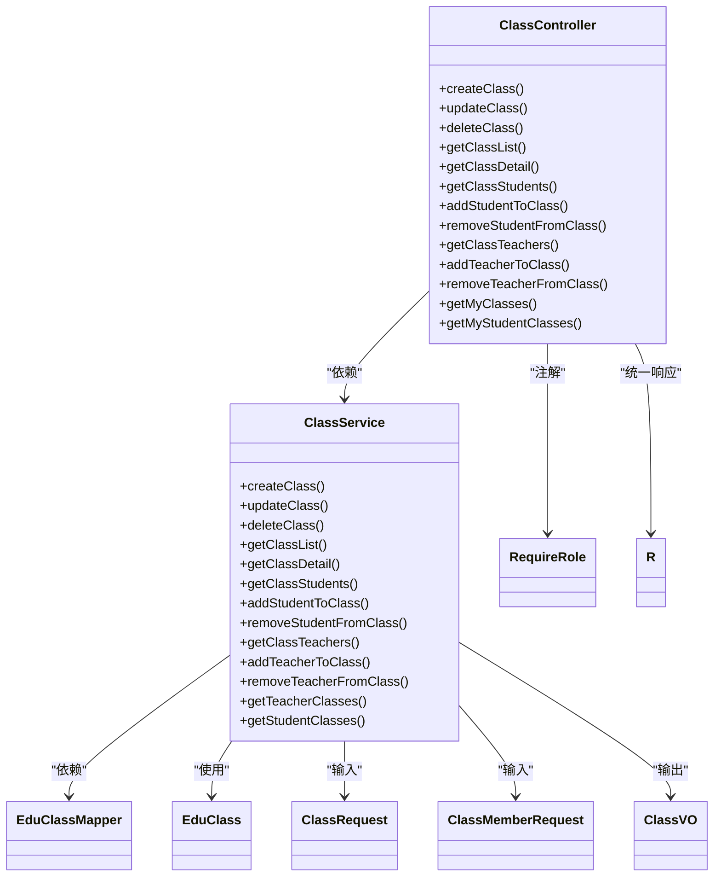
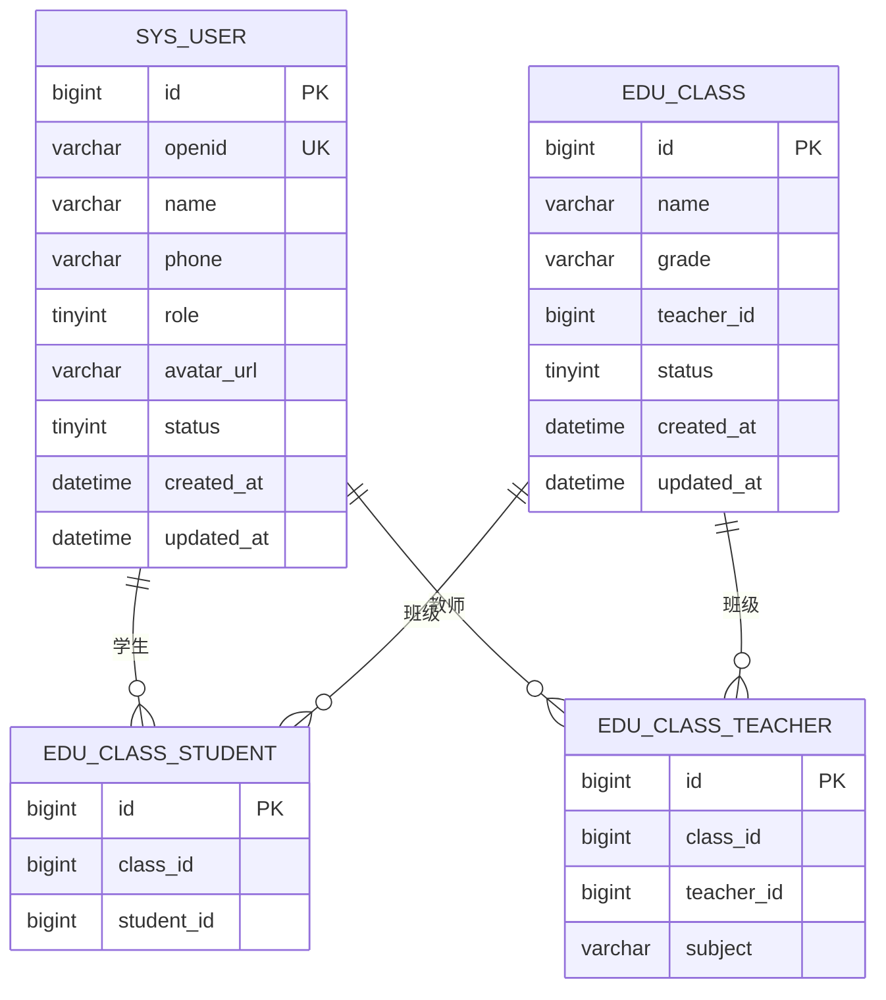

# 班级管理API

<cite>
**本文引用的文件**
- [ClassController.java](file://helenedu-backend/src/main/java/com/helen/eduedu/controller/ClassController.java)
- [ClassService.java](file://helenedu-backend/src/main/java/com/helen/eduedu/service/ClassService.java)
- [ClassRequest.java](file://helenedu-backend/src/main/java/com/helen/eduedu/dto/ClassRequest.java)
- [ClassMemberRequest.java](file://helenedu-backend/src/main/java/com/helen/eduedu/dto/ClassMemberRequest.java)
- [ClassVO.java](file://helenedu-backend/src/main/java/com/helen/eduedu/vo/ClassVO.java)
- [EduClass.java](file://helenedu-backend/src/main/java/com/helen/eduedu/entity/EduClass.java)
- [EduClassMapper.java](file://helenedu-backend/src/main/java/com/helen/eduedu/mapper/EduClassMapper.java)
- [RequireRole.java](file://helenedu-backend/src/main/java/com/helen/eduedu/security/RequireRole.java)
- [RoleEnum.java](file://helenedu-backend/src/main/java/com/helen/eduedu/common/RoleEnum.java)
- [R.java](file://helenedu-backend/src/main/java/com/helen/eduedu/common/R.java)
- [application.yml](file://helenedu-backend/src/main/resources/application.yml)
- [schema.sql](file://helenedu-backend/src/main/resources/db/schema.sql)
- [index.js](file://helenedu-frontend/src/api/index.js)
- [request.js](file://helenedu-frontend/src/utils/request.js)
- [class-manage.vue](file://helenedu-frontend/src/pages/admin/class-manage.vue)
</cite>

## 目录
1. [简介](#简介)
2. [项目结构](#项目结构)
3. [核心组件](#核心组件)
4. [架构总览](#架构总览)
5. [详细组件分析](#详细组件分析)
6. [依赖分析](#依赖分析)
7. [性能考虑](#性能考虑)
8. [故障排查指南](#故障排查指南)
9. [结论](#结论)
10. [附录](#附录)

## 简介
本文件为“班级管理模块”的完整API文档，覆盖以下内容：
- 班级CRUD操作接口：创建、查询、更新、删除（解散）
- 班级成员管理接口：添加教师、添加学生、移除成员
- 班级列表查询接口：支持分页与关键词筛选
- 请求与响应数据结构说明：ClassRequest、ClassVO
- 权限控制说明：不同角色对班级操作的权限差异
- 接口调用示例与错误处理方案

## 项目结构
后端采用Spring Boot + MyBatis-Plus架构，按职责分层组织：
- 控制器层：ClassController 提供REST接口
- 服务层：ClassService 实现业务逻辑
- 数据传输对象：ClassRequest、ClassMemberRequest
- 响应模型：ClassVO
- 实体与映射：EduClass、EduClassMapper
- 安全注解：RequireRole
- 统一响应体：R
- 配置：application.yml、数据库脚本schema.sql

图表来源
- [ClassController.java:1-129](file://helenedu-backend/src/main/java/com/helen/eduedu/controller/ClassController.java#L1-L129)
- [ClassService.java:1-262](file://helenedu-backend/src/main/java/com/helen/eduedu/service/ClassService.java#L1-L262)
- [ClassRequest.java:1-19](file://helenedu-backend/src/main/java/com/helen/eduedu/dto/ClassRequest.java#L1-L19)
- [ClassMemberRequest.java:1-18](file://helenedu-backend/src/main/java/com/helen/eduedu/dto/ClassMemberRequest.java#L1-L18)
- [ClassVO.java:1-22](file://helenedu-backend/src/main/java/com/helen/eduedu/vo/ClassVO.java#L1-L22)
- [EduClass.java:1-36](file://helenedu-backend/src/main/java/com/helen/eduedu/entity/EduClass.java#L1-L36)
- [EduClassMapper.java:1-10](file://helenedu-backend/src/main/java/com/helen/eduedu/mapper/EduClassMapper.java#L1-L10)
- [RequireRole.java:1-20](file://helenedu-backend/src/main/java/com/helen/eduedu/security/RequireRole.java#L1-L20)
- [R.java:1-42](file://helenedu-backend/src/main/java/com/helen/eduedu/common/R.java#L1-L42)

章节来源
- [ClassController.java:1-129](file://helenedu-backend/src/main/java/com/helen/eduedu/controller/ClassController.java#L1-L129)
- [ClassService.java:1-262](file://helenedu-backend/src/main/java/com/helen/eduedu/service/ClassService.java#L1-L262)
- [application.yml:1-59](file://helenedu-backend/src/main/resources/application.yml#L1-L59)

## 核心组件
- ClassController：暴露REST接口，负责接收请求、参数校验、鉴权与返回统一响应
- ClassService：实现业务逻辑，包括班级CRUD、成员管理、列表查询与转换
- DTO与VO：ClassRequest用于创建/更新班级；ClassMemberRequest用于成员管理；ClassVO用于响应展示
- 实体与映射：EduClass对应数据库edu_class表；EduClassMapper提供基础CRUD能力
- 安全与响应：RequireRole注解控制角色权限；R提供统一响应格式

章节来源
- [ClassController.java:23-129](file://helenedu-backend/src/main/java/com/helen/eduedu/controller/ClassController.java#L23-L129)
- [ClassService.java:25-262](file://helenedu-backend/src/main/java/com/helen/eduedu/service/ClassService.java#L25-L262)
- [ClassRequest.java:9-19](file://helenedu-backend/src/main/java/com/helen/eduedu/dto/ClassRequest.java#L9-L19)
- [ClassMemberRequest.java:9-18](file://helenedu-backend/src/main/java/com/helen/eduedu/dto/ClassMemberRequest.java#L9-L18)
- [ClassVO.java:10-22](file://helenedu-backend/src/main/java/com/helen/eduedu/vo/ClassVO.java#L10-L22)
- [EduClass.java:13-36](file://helenedu-backend/src/main/java/com/helen/eduedu/entity/EduClass.java#L13-L36)
- [EduClassMapper.java:7-10](file://helenedu-backend/src/main/java/com/helen/eduedu/mapper/EduClassMapper.java#L7-L10)
- [RequireRole.java:13-19](file://helenedu-backend/src/main/java/com/helen/eduedu/security/RequireRole.java#L13-L19)
- [R.java:8-42](file://helenedu-backend/src/main/java/com/helen/eduedu/common/R.java#L8-L42)

## 架构总览
后端通过控制器接收HTTP请求，经参数校验与权限检查后，调用服务层执行业务逻辑。服务层使用MyBatis-Plus进行数据库操作，并将结果转换为VO返回。前端通过API封装与请求工具发起HTTP请求并处理响应。

图表来源
- [index.js:23-36](file://helenedu-frontend/src/api/index.js#L23-L36)
- [request.js:7-44](file://helenedu-frontend/src/utils/request.js#L7-L44)
- [ClassController.java:31-129](file://helenedu-backend/src/main/java/com/helen/eduedu/controller/ClassController.java#L31-L129)
- [ClassService.java:37-92](file://helenedu-backend/src/main/java/com/helen/eduedu/service/ClassService.java#L37-L92)
- [EduClassMapper.java:7-10](file://helenedu-backend/src/main/java/com/helen/eduedu/mapper/EduClassMapper.java#L7-L10)

## 详细组件分析

### 班级CRUD接口
- 创建班级
  - 方法与路径：POST /api/class
  - 权限：管理员（角色代码3）
  - 请求体：ClassRequest
  - 响应：R<Long>（返回新建班级ID）
- 更新班级
  - 方法与路径：PUT /api/class/{id}
  - 权限：管理员（角色代码3）
  - 请求体：ClassRequest
  - 响应：R<Void>
- 删除/解散班级
  - 方法与路径：DELETE /api/class/{id}
  - 权限：管理员（角色代码3）
  - 响应：R<Void>（实际执行软删除，设置状态为0）
- 获取班级详情
  - 方法与路径：GET /api/class/{id}
  - 响应：R<ClassVO>
- 获取我的班级列表（教师）
  - 方法与路径：GET /api/class/my-classes
  - 权限：教师（角色代码2）
  - 响应：R<List<ClassVO>>
- 获取我的班级列表（学生）
  - 方法与路径：GET /api/class/my-student-classes
  - 权限：学生（角色代码1）
  - 响应：R<List<ClassVO>>

章节来源
- [ClassController.java:31-129](file://helenedu-backend/src/main/java/com/helen/eduedu/controller/ClassController.java#L31-L129)
- [RequireRole.java:13-19](file://helenedu-backend/src/main/java/com/helen/eduedu/security/RequireRole.java#L13-L19)
- [ClassService.java:37-103](file://helenedu-backend/src/main/java/com/helen/eduedu/service/ClassService.java#L37-L103)

### 班级成员管理接口
- 添加学生到班级
  - 方法与路径：POST /api/class/{id}/students
  - 权限：管理员（角色代码3）
  - 请求体：ClassMemberRequest（包含userId，subject不适用）
  - 响应：R<Void>
- 从班级移除学生
  - 方法与路径：DELETE /api/class/{id}/students/{studentId}
  - 权限：管理员（角色代码3）
  - 响应：R<Void>
- 添加教师到班级
  - 方法与路径：POST /api/class/{id}/teachers
  - 权限：管理员（角色代码3）
  - 请求体：ClassMemberRequest（包含userId与subject）
  - 响应：R<Void>
- 从班级移除教师
  - 方法与路径：DELETE /api/class/{id}/teachers/{teacherId}
  - 权限：管理员（角色代码3）
  - 响应：R<Void>
- 获取班级学生列表
  - 方法与路径：GET /api/class/{id}/students
  - 响应：R<List<UserVO>>
- 获取班级教师列表
  - 方法与路径：GET /api/class/{id}/teachers
  - 响应：R<List<UserVO>>

章节来源
- [ClassController.java:69-129](file://helenedu-backend/src/main/java/com/helen/eduedu/controller/ClassController.java#L69-L129)
- [ClassService.java:108-205](file://helenedu-backend/src/main/java/com/helen/eduedu/service/ClassService.java#L108-L205)

### 班级列表查询接口
- 获取班级列表（分页与筛选）
  - 方法与路径：GET /api/class/list
  - 查询参数：page（默认1）、size（默认10）、keyword（可选）
  - 响应：R<PageResult<ClassVO>>（包含总数、当前页、每页大小与记录列表）

章节来源
- [ClassController.java:54-61](file://helenedu-backend/src/main/java/com/helen/eduedu/controller/ClassController.java#L54-L61)
- [ClassService.java:76-92](file://helenedu-backend/src/main/java/com/helen/eduedu/service/ClassService.java#L76-L92)

### 请求与响应数据结构

#### ClassRequest（创建/更新班级请求）
- 字段
  - name：字符串，必填（NotBlank），班级名称
  - grade：字符串，可选，年级
  - teacherId：长整型，可选，班主任用户ID
- 校验规则
  - name不能为空

章节来源
- [ClassRequest.java:9-19](file://helenedu-backend/src/main/java/com/helen/eduedu/dto/ClassRequest.java#L9-L19)

#### ClassMemberRequest（添加班级成员请求）
- 字段
  - userId：长整型，必填（NotNull），成员用户ID
  - subject：字符串，可选，教师所教学科
- 校验规则
  - userId不能为空

章节来源
- [ClassMemberRequest.java:9-18](file://helenedu-backend/src/main/java/com/helen/eduedu/dto/ClassMemberRequest.java#L9-L18)

#### ClassVO（班级信息响应）
- 字段
  - id：长整型，班级ID
  - name：字符串，班级名称
  - grade：字符串，年级
  - teacherId：长整型，班主任ID
  - teacherName：字符串，班主任姓名
  - status：整型，状态（0-解散，1-正常）
  - studentCount：整型，学生人数
  - teacherCount：整型，教师人数
  - createdAt：日期时间，创建时间
- 说明
  - teacherName由服务层根据teacherId查询用户信息填充
  - studentCount与teacherCount由服务层统计关联表得出

章节来源
- [ClassVO.java:10-22](file://helenedu-backend/src/main/java/com/helen/eduedu/vo/ClassVO.java#L10-L22)
- [ClassService.java:235-260](file://helenedu-backend/src/main/java/com/helen/eduedu/service/ClassService.java#L235-L260)

### 权限控制说明
- 角色枚举（RoleEnum）
  - STUDENT：1
  - TEACHER：2
  - ADMIN：3
- 注解RequireRole
  - 作用于Controller方法，限制允许访问的角色代码集合
  - 示例：@RequireRole({3}) 表示仅管理员可访问
- 接口权限对照
  - 创建/更新/删除/成员管理：管理员（1）
  - 我的班级列表（教师）：教师（2）
  - 我的班级列表（学生）：学生（1）

章节来源
- [RoleEnum.java:11-27](file://helenedu-backend/src/main/java/com/helen/eduedu/common/RoleEnum.java#L11-L27)
- [RequireRole.java:13-19](file://helenedu-backend/src/main/java/com/helen/eduedu/security/RequireRole.java#L13-L19)
- [ClassController.java:33, 40, 48, 77, 85, 99, 107, 115, 123:33-123](file://helenedu-backend/src/main/java/com/helen/eduedu/controller/ClassController.java#L33-L123)

### 统一响应与错误处理
- 统一响应体R
  - 成功：code=200，message="success"，data为业务数据
  - 失败：code=500，message为错误信息
- 错误处理策略
  - 业务异常：抛出BusinessException，由全局异常处理器转换为R.fail
  - 参数校验：@Valid触发校验失败时返回参数错误
  - 前端处理：request.js对401进行拦截并跳转登录；对非200或code!=200弹窗提示

章节来源
- [R.java:8-42](file://helenedu-backend/src/main/java/com/helen/eduedu/common/R.java#L8-L42)
- [request.js:20-44](file://helenedu-frontend/src/utils/request.js#L20-L44)

### 接口调用示例（基于前端封装）
- 获取班级列表
  - 调用：getClassList({ page: 1, size: 10 })
  - 返回：records为ClassVO数组
- 创建班级
  - 调用：createClass({ name: "高三1班", grade: "高三", teacherId: 1 })
  - 返回：新建班级ID
- 添加学生到班级
  - 调用：addStudentToClass(1, { userId: 101 })
- 添加教师到班级
  - 调用：addTeacherToClass(1, { userId: 201, subject: "数学" })
- 获取我的班级列表（教师）
  - 调用：getMyClasses()

章节来源
- [index.js:23-36](file://helenedu-frontend/src/api/index.js#L23-L36)
- [class-manage.vue:28-54](file://helenedu-frontend/src/pages/admin/class-manage.vue#L28-L54)

## 依赖分析
- 控制器依赖服务层，服务层依赖Mapper与实体
- 控制器通过RequireRole注解声明权限，R提供统一响应
- 前端通过API封装与请求工具与后端交互

图表来源
- [ClassController.java:27-129](file://helenedu-backend/src/main/java/com/helen/eduedu/controller/ClassController.java#L27-L129)
- [ClassService.java:27-262](file://helenedu-backend/src/main/java/com/helen/eduedu/service/ClassService.java#L27-L262)
- [EduClassMapper.java:7-10](file://helenedu-backend/src/main/java/com/helen/eduedu/mapper/EduClassMapper.java#L7-L10)
- [EduClass.java:13-36](file://helenedu-backend/src/main/java/com/helen/eduedu/entity/EduClass.java#L13-L36)
- [ClassRequest.java:9-19](file://helenedu-backend/src/main/java/com/helen/eduedu/dto/ClassRequest.java#L9-L19)
- [ClassMemberRequest.java:9-18](file://helenedu-backend/src/main/java/com/helen/eduedu/dto/ClassMemberRequest.java#L9-L18)
- [ClassVO.java:10-22](file://helenedu-backend/src/main/java/com/helen/eduedu/vo/ClassVO.java#L10-L22)
- [RequireRole.java:13-19](file://helenedu-backend/src/main/java/com/helen/eduedu/security/RequireRole.java#L13-L19)
- [R.java:8-42](file://helenedu-backend/src/main/java/com/helen/eduedu/common/R.java#L8-L42)

## 性能考虑
- 分页查询：列表接口使用MyBatis-Plus分页，避免一次性加载大量数据
- 统计字段：学生数与教师数通过独立COUNT查询计算，减少JOIN复杂度
- 软删除：删除操作设置状态而非物理删除，便于后续恢复与审计
- 建议
  - 对高频查询增加索引（如edu_class.status、关联表唯一键）
  - 合理设置分页大小，避免过大页码导致数据库压力

## 故障排查指南
- 常见错误与处理
  - 未授权访问：检查Token与RequireRole注解配置
  - 参数校验失败：确认ClassRequest与ClassMemberRequest字段
  - 班级不存在：确保传入正确的班级ID
  - 成员已存在：添加成员前检查唯一约束
- 前端常见问题
  - 401未认证：前端会自动清除本地Token并跳转登录
  - 请求失败：弹窗显示message，可在后端日志查看具体原因

章节来源
- [ClassService.java:52-56, 65-71, 134-136, 184-186:52-71](file://helenedu-backend/src/main/java/com/helen/eduedu/service/ClassService.java#L52-L71)
- [request.js:20-44](file://helenedu-frontend/src/utils/request.js#L20-L44)

## 结论
本API文档覆盖了班级管理模块的完整功能：CRUD、成员管理、列表查询与权限控制。通过统一响应体与前后端约定，保证了接口的一致性与易用性。建议在生产环境中进一步完善索引、缓存与监控，以提升性能与稳定性。

## 附录

### 数据模型图

图表来源
- [schema.sql:5-44](file://helenedu-backend/src/main/resources/db/schema.sql#L5-L44)