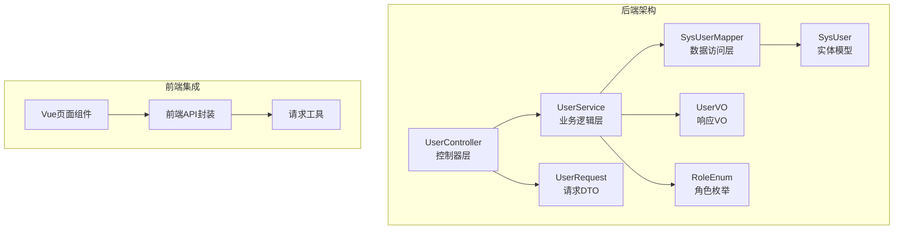
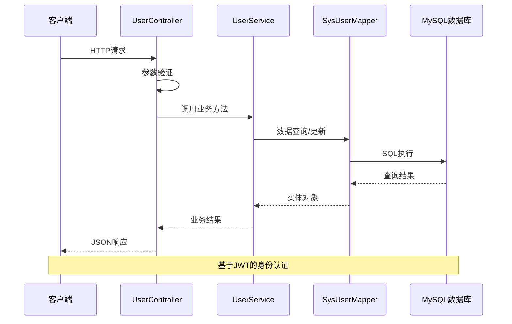
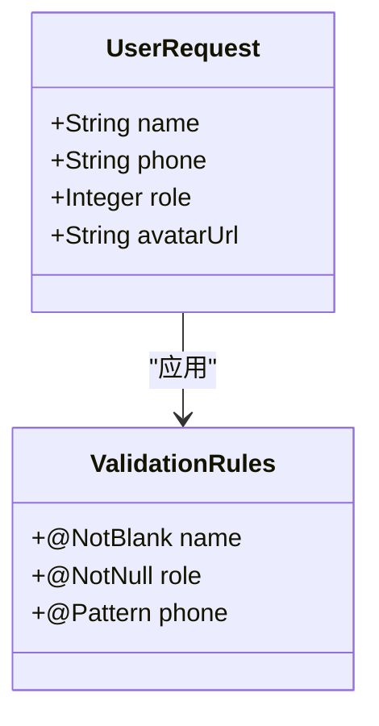
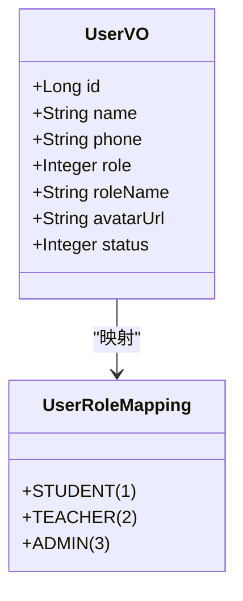
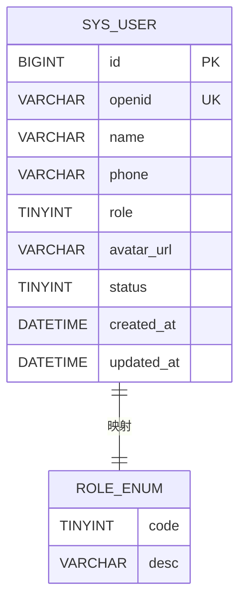
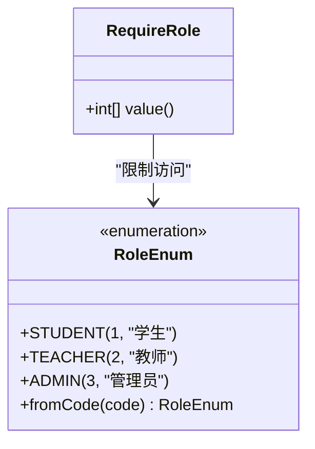
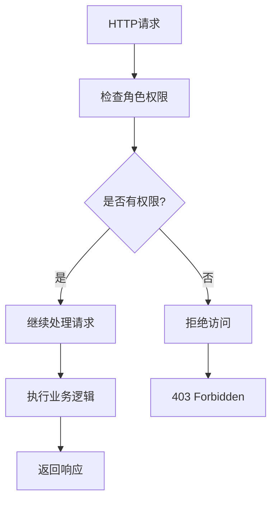
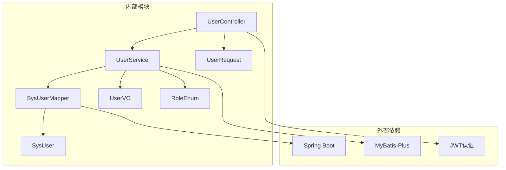

# 用户管理API

<cite>
**本文档引用的文件**
- [UserController.java](file://helenedu-backend/src/main/java/com/helen/eduedu/controller/UserController.java)
- [UserService.java](file://helenedu-backend/src/main/java/com/helen/eduedu/service/UserService.java)
- [UserRequest.java](file://helenedu-backend/src/main/java/com/helen/eduedu/dto/UserRequest.java)
- [UserVO.java](file://helenedu-backend/src/main/java/com/helen/eduedu/vo/UserVO.java)
- [SysUser.java](file://helenedu-backend/src/main/java/com/helen/eduedu/entity/SysUser.java)
- [SysUserMapper.java](file://helenedu-backend/src/main/java/com/helen/eduedu/mapper/SysUserMapper.java)
- [RoleEnum.java](file://helenedu-backend/src/main/java/com/helen/eduedu/common/RoleEnum.java)
- [RequireRole.java](file://helenedu-backend/src/main/java/com/helen/eduedu/security/RequireRole.java)
- [application.yml](file://helenedu-backend/src/main/resources/application.yml)
- [schema.sql](file://helenedu-backend/src/main/resources/db/schema.sql)
- [index.js](file://helenedu-frontend/src/api/index.js)
- [request.js](file://helenedu-frontend/src/utils/request.js)
- [user-manage.vue](file://helenedu-frontend/src/pages/admin/user-manage.vue)
</cite>

## 目录
1. [简介](#简介)
2. [项目结构](#项目结构)
3. [核心组件](#核心组件)
4. [架构概览](#架构概览)
5. [详细组件分析](#详细组件分析)
6. [依赖关系分析](#依赖关系分析)
7. [性能考虑](#性能考虑)
8. [故障排除指南](#故障排除指南)
9. [结论](#结论)
10. [附录](#附录)

## 简介

用户管理API是HelenEdu教育管理系统中的核心功能模块，负责处理用户信息的全生命周期管理。该模块提供了完整的用户信息管理接口，包括用户基本信息的查询、修改、删除、状态管理等功能。系统采用基于角色的权限控制机制，支持管理员、教师、学生三种角色，并为不同角色提供相应的操作权限。

## 项目结构

用户管理模块位于后端项目的`controller`、`service`、`dto`、`vo`、`entity`、`mapper`等包中，形成了清晰的分层架构：



**图表来源**
- [UserController.java:1-78](file://helenedu-backend/src/main/java/com/helen/eduedu/controller/UserController.java#L1-L78)
- [UserService.java:1-130](file://helenedu-backend/src/main/java/com/helen/eduedu/service/UserService.java#L1-L130)
- [UserRequest.java:1-23](file://helenedu-backend/src/main/java/com/helen/eduedu/dto/UserRequest.java#L1-L23)
- [UserVO.java:1-18](file://helenedu-backend/src/main/java/com/helen/eduedu/vo/UserVO.java#L1-L18)
- [SysUser.java:1-42](file://helenedu-backend/src/main/java/com/helen/eduedu/entity/SysUser.java#L1-L42)

**章节来源**
- [UserController.java:1-78](file://helenedu-backend/src/main/java/com/helen/eduedu/controller/UserController.java#L1-L78)
- [UserService.java:1-130](file://helenedu-backend/src/main/java/com/helen/eduedu/service/UserService.java#L1-L130)

## 核心组件

### 控制器层 - UserController

UserController作为RESTful API的入口点，提供了完整的用户管理接口。所有接口都使用`@RequireRole({3})`注解，确保只有管理员角色才能访问这些敏感操作。

主要功能包括：
- 用户创建、更新、删除
- 用户状态切换（启用/禁用）
- 用户列表查询（支持分页、角色筛选、关键词搜索）
- 教师和学生列表查询

### 服务层 - UserService

UserService实现了具体的业务逻辑，包括数据验证、业务规则处理、事务管理等。关键特性：
- 使用MyBatis-Plus进行数据持久化
- 支持分页查询和条件筛选
- 自动状态管理（新用户默认启用）
- 角色名称映射

### 数据传输对象

- **UserRequest**: 用户管理请求参数对象
- **UserVO**: 用户信息响应对象
- **SysUser**: 数据库实体映射

**章节来源**
- [UserController.java:25-77](file://helenedu-backend/src/main/java/com/helen/eduedu/controller/UserController.java#L25-L77)
- [UserService.java:25-129](file://helenedu-backend/src/main/java/com/helen/eduedu/service/UserService.java#L25-L129)

## 架构概览

用户管理模块采用经典的三层架构设计，确保了关注点分离和代码的可维护性：



**图表来源**
- [UserController.java:29-76](file://helenedu-backend/src/main/java/com/helen/eduedu/controller/UserController.java#L29-L76)
- [UserService.java:32-73](file://helenedu-backend/src/main/java/com/helen/eduedu/service/UserService.java#L32-L73)
- [SysUserMapper.java:1-10](file://helenedu-backend/src/main/java/com/helen/eduedu/mapper/SysUserMapper.java#L1-L10)

## 详细组件分析

### 用户信息管理接口

#### 创建用户接口

**接口定义**
- 方法：POST
- 路径：`/api/user`
- 权限：管理员
- 请求体：UserRequest对象

**请求参数验证规则**
- `name`: 必填，不能为空字符串
- `phone`: 可选，手机号格式验证
- `role`: 必填，角色代码（1-学生，2-教师，3-管理员）
- `avatarUrl`: 可选，头像URL

**响应结构**
- 成功：返回新创建用户的ID
- 失败：返回错误信息和HTTP状态码

#### 更新用户接口

**接口定义**
- 方法：PUT
- 路径：`/api/user/{id}`
- 权限：管理员
- 路径参数：用户ID

**处理流程**
1. 验证用户是否存在
2. 复制请求参数到用户实体
3. 更新数据库记录
4. 返回成功响应

#### 删除用户接口

**接口定义**
- 方法：DELETE
- 路径：`/api/user/{id}`
- 权限：管理员

**注意事项**
- 删除操作为物理删除
- 建议在实际生产环境中改为软删除

#### 禁用/启用用户接口

**接口定义**
- 方法：PUT
- 路径：`/api/user/{id}/toggle-status`
- 权限：管理员

**状态转换逻辑**
- 启用状态(1) ↔ 禁用状态(0)
- 自动切换当前状态

**章节来源**
- [UserController.java:29-54](file://helenedu-backend/src/main/java/com/helen/eduedu/controller/UserController.java#L29-L54)
- [UserService.java:32-73](file://helenedu-backend/src/main/java/com/helen/eduedu/service/UserService.java#L32-L73)

### 用户列表查询接口

#### 接口定义
- 方法：GET
- 路径：`/api/user/list`
- 权限：管理员

#### 查询参数
- `page`: 分页页码，默认值1
- `size`: 分页大小，默认值10
- `role`: 角色筛选（可选）
- `keyword`: 关键词搜索（可选）

#### 搜索逻辑
- 支持按姓名模糊搜索
- 支持按手机号模糊搜索
- 结合角色筛选条件

#### 响应结构
返回PageResult<UserVO>对象，包含：
- 总记录数
- 当前页码
- 页面大小
- 用户列表数据

**章节来源**
- [UserController.java:56-64](file://helenedu-backend/src/main/java/com/helen/eduedu/controller/UserController.java#L56-L64)
- [UserService.java:78-98](file://helenedu-backend/src/main/java/com/helen/eduedu/service/UserService.java#L78-L98)

### 教师和学生查询接口

#### 获取所有教师
- 方法：GET
- 路径：`/api/user/teachers`
- 条件：状态为启用的教师

#### 获取所有学生
- 方法：GET
- 路径：`/api/user/students`
- 条件：状态为启用的学生

**章节来源**
- [UserController.java:66-76](file://helenedu-backend/src/main/java/com/helen/eduedu/controller/UserController.java#L66-L76)
- [UserService.java:103-128](file://helenedu-backend/src/main/java/com/helen/eduedu/service/UserService.java#L103-L128)

### 数据模型分析

#### UserRequest请求参数



**字段说明**
- **name**: 用户真实姓名，必填
- **phone**: 联系电话，可选
- **role**: 用户角色代码，必填
- **avatarUrl**: 头像图片URL，可选

**验证规则**
- 姓名不能为空
- 角色必须指定且有效
- 手机号遵循标准格式验证

#### UserVO响应结构



**字段说明**
- **id**: 用户唯一标识符
- **name**: 用户姓名
- **phone**: 联系电话
- **role**: 角色代码
- **roleName**: 角色名称（如"学生"、"教师"、"管理员"）
- **avatarUrl**: 头像URL
- **status**: 用户状态（0-禁用，1-启用）

#### SysUser实体模型



**数据库字段说明**
- **id**: 主键自增
- **openid**: 微信开放平台标识
- **name**: 姓名（必填）
- **phone**: 手机号
- **role**: 角色（1-学生，2-教师，3-管理员）
- **avatar_url**: 头像URL
- **status**: 状态（0-禁用，1-启用，默认1）
- **created_at**: 创建时间
- **updated_at**: 更新时间

**图表来源**
- [SysUser.java:15-41](file://helenedu-backend/src/main/java/com/helen/eduedu/entity/SysUser.java#L15-L41)
- [schema.sql:6-16](file://helenedu-backend/src/main/resources/db/schema.sql#L6-L16)

**章节来源**
- [UserRequest.java:10-22](file://helenedu-backend/src/main/java/com/helen/eduedu/dto/UserRequest.java#L10-L22)
- [UserVO.java:9-17](file://helenedu-backend/src/main/java/com/helen/eduedu/vo/UserVO.java#L9-L17)
- [SysUser.java:15-41](file://helenedu-backend/src/main/java/com/helen/eduedu/entity/SysUser.java#L15-L41)

### 权限控制机制

#### 角色枚举定义



**角色权限矩阵**

| 角色 | 可访问接口 | 特殊权限 |
|------|------------|----------|
| 学生 | 仅个人资料 | 有限操作 |
| 教师 | 仅个人资料 | 有限操作 |
| 管理员 | 所有用户管理接口 | 完全权限 |

#### 访问控制实现



**图表来源**
- [RequireRole.java:13-19](file://helenedu-backend/src/main/java/com/helen/eduedu/security/RequireRole.java#L13-L19)
- [RoleEnum.java:11-27](file://helenedu-backend/src/main/java/com/helen/eduedu/common/RoleEnum.java#L11-L27)

**章节来源**
- [RequireRole.java:1-20](file://helenedu-backend/src/main/java/com/helen/eduedu/security/RequireRole.java#L1-L20)
- [RoleEnum.java:1-28](file://helenedu-backend/src/main/java/com/helen/eduedu/common/RoleEnum.java#L1-L28)

## 依赖关系分析

用户管理模块的依赖关系清晰明确，遵循了良好的软件工程原则：



**依赖特点**
- **低耦合高内聚**：各层职责明确，相互独立
- **依赖注入**：使用Spring的依赖注入机制
- **ORM框架**：MyBatis-Plus简化数据访问层开发
- **自动配置**：Spring Boot自动配置减少样板代码

**章节来源**
- [UserService.java:25-27](file://helenedu-backend/src/main/java/com/helen/eduedu/service/UserService.java#L25-L27)
- [SysUserMapper.java:7-9](file://helenedu-backend/src/main/java/com/helen/eduedu/mapper/SysUserMapper.java#L7-L9)

## 性能考虑

### 数据库优化建议

1. **索引策略**
   - 在`role`字段上建立索引以支持角色筛选
   - 在`name`和`phone`字段上建立复合索引支持搜索
   - 在`status`字段上建立索引支持状态查询

2. **查询优化**
   - 使用分页查询避免一次性加载大量数据
   - 限制查询字段数量，只选择需要的列
   - 使用合适的连接策略

3. **缓存策略**
   - 缓存常用的角色映射信息
   - 缓存用户基础信息

### 事务管理

- 所有写操作都在事务中执行
- 保证数据一致性
- 异常时自动回滚

## 故障排除指南

### 常见问题及解决方案

#### 1. 用户不存在异常
**症状**：更新或删除用户时报错
**原因**：用户ID不正确或用户已被删除
**解决**：先验证用户存在性，再执行操作

#### 2. 权限不足
**症状**：403 Forbidden响应
**原因**：当前用户角色不满足接口权限要求
**解决**：使用管理员账号登录或调整用户角色

#### 3. 数据验证失败
**症状**：400 Bad Request响应
**原因**：请求参数不符合验证规则
**解决**：检查请求参数格式和必填字段

#### 4. 数据库连接问题
**症状**：500 Internal Server Error
**原因**：数据库连接失败或配置错误
**解决**：检查数据库连接配置和网络连通性

**章节来源**
- [UserService.java:47-48](file://helenedu-backend/src/main/java/com/helen/eduedu/service/UserService.java#L47-L48)
- [UserService.java:59-62](file://helenedu-backend/src/main/java/com/helen/eduedu/service/UserService.java#L59-L62)

## 结论

用户管理API模块设计合理，实现了完整的用户生命周期管理功能。模块具有以下优点：

1. **清晰的架构设计**：采用分层架构，职责分离明确
2. **完善的权限控制**：基于角色的访问控制机制
3. **良好的扩展性**：易于添加新的用户属性和操作
4. **健壮的错误处理**：提供详细的错误信息和状态码
5. **完整的文档支持**：配合Swagger提供API文档

建议在未来版本中考虑增加：
- 用户密码重置功能
- 批量操作支持
- 更细粒度的权限控制
- 审计日志记录

## 附录

### 接口调用示例

#### 前端调用示例

```javascript
// 获取用户列表
getUserList({ page: 1, size: 10, role: 1 })
  .then(response => {
    console.log('用户列表:', response.records);
  });

// 创建新用户
createUser({
  name: '张三',
  phone: '13800000000',
  role: 1,
  avatarUrl: 'https://example.com/avatar.jpg'
});

// 更新用户信息
updateUser(userId, {
  name: '李四',
  phone: '13900000000',
  role: 2
});

// 切换用户状态
toggleUserStatus(userId);

// 删除用户
deleteUser(userId);
```

#### 后端接口定义

| 接口 | 方法 | 路径 | 权限 | 功能 |
|------|------|------|------|------|
| 创建用户 | POST | `/api/user` | 管理员 | 创建新用户 |
| 更新用户 | PUT | `/api/user/{id}` | 管理员 | 修改用户信息 |
| 删除用户 | DELETE | `/api/user/{id}` | 管理员 | 删除用户 |
| 切换状态 | PUT | `/api/user/{id}/toggle-status` | 管理员 | 启用/禁用用户 |
| 用户列表 | GET | `/api/user/list` | 管理员 | 分页查询用户 |
| 教师列表 | GET | `/api/user/teachers` | 管理员 | 获取所有教师 |
| 学生列表 | GET | `/api/user/students` | 管理员 | 获取所有学生 |

### 配置说明

#### JWT配置
- 密钥：HelenEduSecretKey2024ForJwtTokenGenerationMustBeLongEnough
- 过期时间：604800000毫秒（7天）
- 认证方式：Bearer Token

#### 数据库配置
- 数据源：MySQL 8.0+
- 字符集：utf8mb4
- 时区：Asia/Shanghai

**章节来源**
- [application.yml:34-36](file://helenedu-backend/src/main/resources/application.yml#L34-L36)
- [application.yml:8-11](file://helenedu-backend/src/main/resources/application.yml#L8-L11)