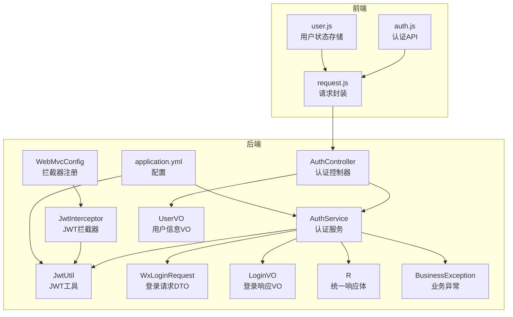
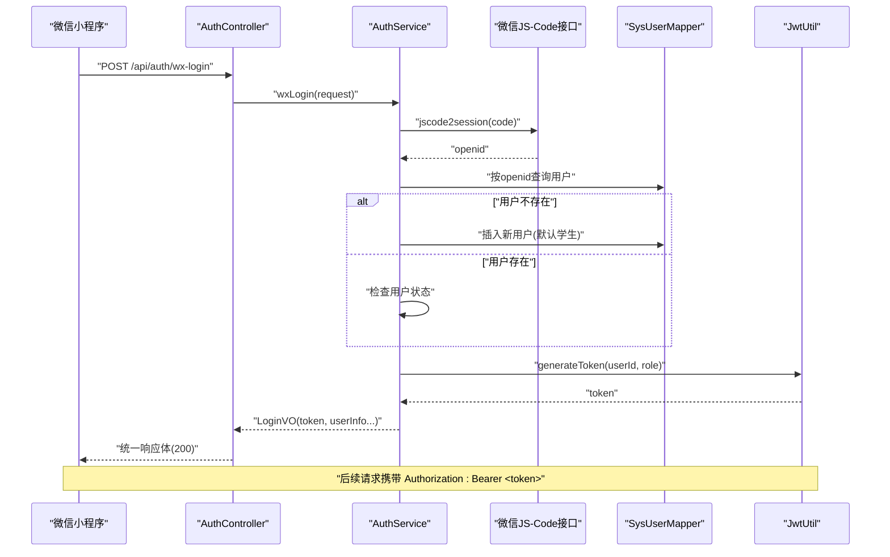
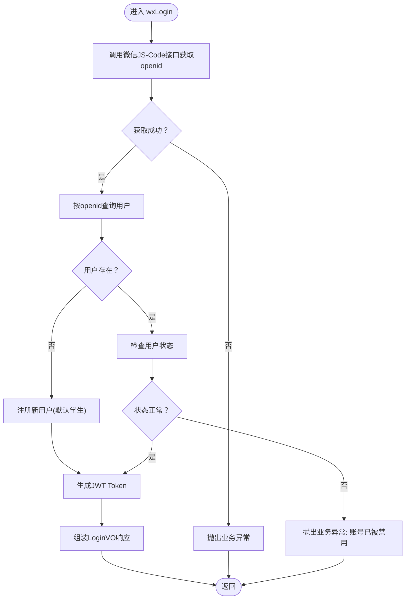
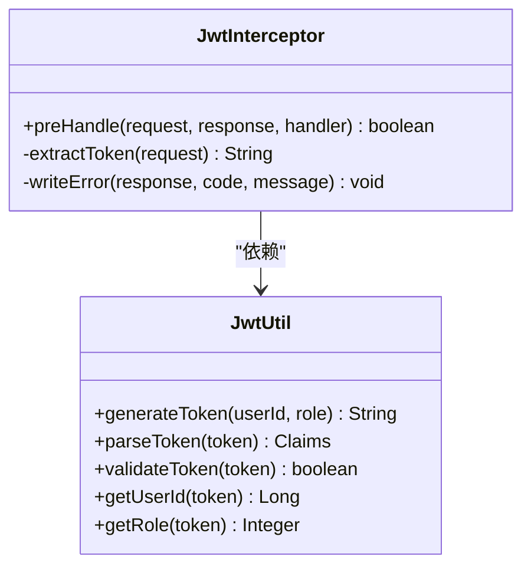
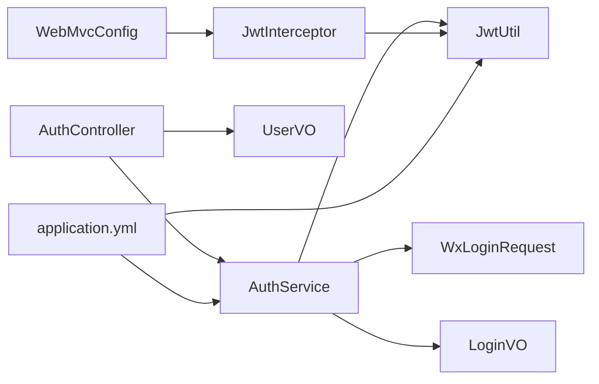

# 用户认证API

<cite>
**本文引用的文件**
- [AuthController.java](file://helenedu-backend/src/main/java/com/helen/eduedu/controller/AuthController.java)
- [AuthService.java](file://helenedu-backend/src/main/java/com/helen/eduedu/service/AuthService.java)
- [WxLoginRequest.java](file://helenedu-backend/src/main/java/com/helen/eduedu/dto/WxLoginRequest.java)
- [LoginVO.java](file://helenedu-backend/src/main/java/com/helen/eduedu/vo/LoginVO.java)
- [UserVO.java](file://helenedu-backend/src/main/java/com/helen/eduedu/vo/UserVO.java)
- [JwtUtil.java](file://helenedu-backend/src/main/java/com/helen/eduedu/security/JwtUtil.java)
- [JwtInterceptor.java](file://helenedu-backend/src/main/java/com/helen/eduedu/security/JwtInterceptor.java)
- [RequireRole.java](file://helenedu-backend/src/main/java/com/helen/eduedu/security/RequireRole.java)
- [WebMvcConfig.java](file://helenedu-backend/src/main/java/com/helen/eduedu/config/WebMvcConfig.java)
- [R.java](file://helenedu-backend/src/main/java/com/helen/eduedu/common/R.java)
- [BusinessException.java](file://helenedu-backend/src/main/java/com/helen/eduedu/common/BusinessException.java)
- [application.yml](file://helenedu-backend/src/main/resources/application.yml)
- [auth.js](file://helenedu-frontend/src/api/auth.js)
- [request.js](file://helenedu-frontend/src/utils/request.js)
- [user.js](file://helenedu-frontend/src/store/user.js)
</cite>

## 目录
1. [简介](#简介)
2. [项目结构](#项目结构)
3. [核心组件](#核心组件)
4. [架构总览](#架构总览)
5. [详细组件分析](#详细组件分析)
6. [依赖分析](#依赖分析)
7. [性能考虑](#性能考虑)
8. [故障排查指南](#故障排查指南)
9. [结论](#结论)
10. [附录](#附录)

## 简介
本文件为用户认证模块的详细API文档，聚焦微信小程序登录流程（JS-Code换OpenID）、Token生成与验证机制、登录状态管理，以及后端AuthController提供的认证相关接口。文档同时覆盖前端如何携带认证头、如何使用Token访问受保护接口，并给出常见错误码与解决方案。

## 项目结构
后端采用Spring Boot分层架构：控制器层负责暴露REST接口；服务层封装业务逻辑；安全层提供JWT工具与拦截器；统一响应体与异常体系保证接口一致性；前端通过封装的请求库自动注入认证头。

图表来源
- [AuthController.java:1-39](file://helenedu-backend/src/main/java/com/helen/eduedu/controller/AuthController.java#L1-L39)
- [AuthService.java:1-128](file://helenedu-backend/src/main/java/com/helen/eduedu/service/AuthService.java#L1-L128)
- [JwtUtil.java:1-87](file://helenedu-backend/src/main/java/com/helen/eduedu/security/JwtUtil.java#L1-L87)
- [JwtInterceptor.java:1-85](file://helenedu-backend/src/main/java/com/helen/eduedu/security/JwtInterceptor.java#L1-L85)
- [WebMvcConfig.java:1-40](file://helenedu-backend/src/main/java/com/helen/eduedu/config/WebMvcConfig.java#L1-L40)
- [WxLoginRequest.java:1-19](file://helenedu-backend/src/main/java/com/helen/eduedu/dto/WxLoginRequest.java#L1-L19)
- [LoginVO.java:1-17](file://helenedu-backend/src/main/java/com/helen/eduedu/vo/LoginVO.java#L1-L17)
- [UserVO.java:1-18](file://helenedu-backend/src/main/java/com/helen/eduedu/vo/UserVO.java#L1-L18)
- [R.java:1-42](file://helenedu-backend/src/main/java/com/helen/eduedu/common/R.java#L1-L42)
- [BusinessException.java:1-22](file://helenedu-backend/src/main/java/com/helen/eduedu/common/BusinessException.java#L1-L22)
- [application.yml:1-59](file://helenedu-backend/src/main/resources/application.yml#L1-L59)
- [auth.js:1-8](file://helenedu-frontend/src/api/auth.js#L1-L8)
- [request.js:1-83](file://helenedu-frontend/src/utils/request.js#L1-L83)
- [user.js:1-62](file://helenedu-frontend/src/store/user.js#L1-L62)

章节来源
- [AuthController.java:1-39](file://helenedu-backend/src/main/java/com/helen/eduedu/controller/AuthController.java#L1-L39)
- [WebMvcConfig.java:24-31](file://helenedu-backend/src/main/java/com/helen/eduedu/config/WebMvcConfig.java#L24-L31)

## 核心组件
- 认证控制器：提供微信登录与获取当前用户信息两个接口。
- 认证服务：实现微信登录流程、用户状态检查、Token生成与用户信息查询。
- JWT工具：生成、解析、校验Token，并提取用户ID与角色。
- JWT拦截器：统一校验Token有效性、注入用户上下文、进行角色权限控制。
- 统一响应体与异常：规范返回结构与错误码。
- 前端请求封装：自动注入Authorization头，处理401与业务错误。

章节来源
- [AuthController.java:26-37](file://helenedu-backend/src/main/java/com/helen/eduedu/controller/AuthController.java#L26-L37)
- [AuthService.java:42-97](file://helenedu-backend/src/main/java/com/helen/eduedu/service/AuthService.java#L42-L97)
- [JwtUtil.java:34-85](file://helenedu-backend/src/main/java/com/helen/eduedu/security/JwtUtil.java#L34-L85)
- [JwtInterceptor.java:27-68](file://helenedu-backend/src/main/java/com/helen/eduedu/security/JwtInterceptor.java#L27-L68)
- [R.java:16-40](file://helenedu-backend/src/main/java/com/helen/eduedu/common/R.java#L16-L40)
- [BusinessException.java:12-20](file://helenedu-backend/src/main/java/com/helen/eduedu/common/BusinessException.java#L12-L20)
- [request.js:9-19](file://helenedu-frontend/src/utils/request.js#L9-L19)

## 架构总览
下图展示从微信小程序发起登录请求，到后端完成OpenID换取、用户注册/查询、Token签发，再到前端携带Token访问受保护接口的整体流程。

图表来源
- [AuthController.java:27-30](file://helenedu-backend/src/main/java/com/helen/eduedu/controller/AuthController.java#L27-L30)
- [AuthService.java:42-82](file://helenedu-backend/src/main/java/com/helen/eduedu/service/AuthService.java#L42-L82)
- [JwtUtil.java:34-46](file://helenedu-backend/src/main/java/com/helen/eduedu/security/JwtUtil.java#L34-L46)
- [application.yml:33-41](file://helenedu-backend/src/main/resources/application.yml#L33-L41)

## 详细组件分析

### 认证控制器（AuthController）
- 接口1：微信登录
  - 方法与路径：POST /api/auth/wx-login
  - 请求体：WxLoginRequest（包含code、昵称、头像URL等）
  - 响应体：统一响应体包裹LoginVO
  - 业务要点：调用AuthService执行微信登录流程，返回Token与用户基础信息
- 接口2：获取当前用户信息
  - 方法与路径：GET /api/auth/userinfo
  - 认证要求：需携带有效Token（拦截器自动注入userId/role）
  - 响应体：统一响应体包裹UserVO
  - 业务要点：根据请求上下文中的userId查询用户详情并返回

章节来源
- [AuthController.java:26-37](file://helenedu-backend/src/main/java/com/helen/eduedu/controller/AuthController.java#L26-L37)
- [WxLoginRequest.java:10-18](file://helenedu-backend/src/main/java/com/helen/eduedu/dto/WxLoginRequest.java#L10-L18)
- [LoginVO.java:9-16](file://helenedu-backend/src/main/java/com/helen/eduedu/vo/LoginVO.java#L9-L16)
- [UserVO.java:9-17](file://helenedu-backend/src/main/java/com/helen/eduedu/vo/UserVO.java#L9-L17)

### 认证服务（AuthService）
- 微信登录流程
  - 参数：WxLoginRequest（至少包含code）
  - 步骤：
    1) 调用微信JS-Code换Session接口获取openid
    2) 根据openid查询用户是否存在
    3) 若不存在则注册为新用户（默认学生角色）
    4) 校验用户状态（启用/禁用）
    5) 使用JwtUtil生成Token
    6) 组装LoginVO返回
  - 异常：微信接口失败、服务异常、用户被禁用等
- 获取用户信息
  - 输入：当前登录用户ID（来自拦截器注入）
  - 输出：UserVO（含角色名称映射）

图表来源
- [AuthService.java:42-82](file://helenedu-backend/src/main/java/com/helen/eduedu/service/AuthService.java#L42-L82)
- [AuthService.java:102-126](file://helenedu-backend/src/main/java/com/helen/eduedu/service/AuthService.java#L102-L126)

章节来源
- [AuthService.java:42-97](file://helenedu-backend/src/main/java/com/helen/eduedu/service/AuthService.java#L42-L97)
- [application.yml:38-41](file://helenedu-backend/src/main/resources/application.yml#L38-L41)

### JWT工具与拦截器
- JWT工具（JwtUtil）
  - 生成Token：包含userId、role声明，设置签发时间与过期时间
  - 解析与校验：基于密钥验证签名与过期时间
  - 提取信息：从Token中读取userId与role
- JWT拦截器（JwtInterceptor）
  - 认证头支持：优先从Authorization头（Bearer）读取，兼容小程序参数token
  - 校验与注入：校验Token有效性，注入userId与role到请求属性
  - 权限控制：结合RequireRole注解限制访问角色
  - 错误输出：统一JSON错误响应

图表来源
- [JwtUtil.java:34-85](file://helenedu-backend/src/main/java/com/helen/eduedu/security/JwtUtil.java#L34-L85)
- [JwtInterceptor.java:27-68](file://helenedu-backend/src/main/java/com/helen/eduedu/security/JwtInterceptor.java#L27-L68)

章节来源
- [JwtUtil.java:34-85](file://helenedu-backend/src/main/java/com/helen/eduedu/security/JwtUtil.java#L34-L85)
- [JwtInterceptor.java:27-68](file://helenedu-backend/src/main/java/com/helen/eduedu/security/JwtInterceptor.java#L27-L68)
- [RequireRole.java:13-19](file://helenedu-backend/src/main/java/com/helen/eduedu/security/RequireRole.java#L13-L19)

### 统一响应体与异常
- 统一响应体（R）：包含code、message、data三要素，提供ok/fail静态方法
- 业务异常（BusinessException）：支持自定义错误码与消息

章节来源
- [R.java:16-40](file://helenedu-backend/src/main/java/com/helen/eduedu/common/R.java#L16-L40)
- [BusinessException.java:12-20](file://helenedu-backend/src/main/java/com/helen/eduedu/common/BusinessException.java#L12-L20)

### 前端集成
- 认证API封装：提供wxLogin与getUserInfo两个方法
- 请求封装：自动从本地缓存读取token并注入Authorization头
- 用户状态：Pinia Store维护token与userInfo，登出时清理并跳转登录页

章节来源
- [auth.js:4-7](file://helenedu-frontend/src/api/auth.js#L4-L7)
- [request.js:9-19](file://helenedu-frontend/src/utils/request.js#L9-L19)
- [user.js:8-31](file://helenedu-frontend/src/store/user.js#L8-L31)

## 依赖分析
- 控制器依赖服务；服务依赖Mapper、JwtUtil与配置项；拦截器依赖JwtUtil与ObjectMapper；WebMvcConfig注册拦截器并排除无需认证的路径。
- 配置文件提供JWT密钥与过期时间、微信AppID与Secret、Knife4j文档路径等。

图表来源
- [AuthController.java:24-25](file://helenedu-backend/src/main/java/com/helen/eduedu/controller/AuthController.java#L24-L25)
- [AuthService.java:29-31](file://helenedu-backend/src/main/java/com/helen/eduedu/service/AuthService.java#L29-L31)
- [JwtInterceptor.java:24-25](file://helenedu-backend/src/main/java/com/helen/eduedu/security/JwtInterceptor.java#L24-L25)
- [WebMvcConfig.java:24-31](file://helenedu-backend/src/main/java/com/helen/eduedu/config/WebMvcConfig.java#L24-L31)
- [application.yml:33-41](file://helenedu-backend/src/main/resources/application.yml#L33-L41)

章节来源
- [WebMvcConfig.java:24-31](file://helenedu-backend/src/main/java/com/helen/eduedu/config/WebMvcConfig.java#L24-L31)
- [application.yml:33-41](file://helenedu-backend/src/main/resources/application.yml#L33-L41)

## 性能考虑
- Token有效期：默认7天，建议结合业务场景评估是否缩短以提升安全性。
- 微信接口调用：网络延迟与可用性可能影响登录体验，建议在服务端增加超时与重试策略（当前实现为直接调用，可按需增强）。
- 拦截器开销：对每个/api/**请求进行Token校验，建议保持密钥长度与算法强度，避免过长的解析链路。

[本节为通用建议，不涉及具体文件分析]

## 故障排查指南
- 常见错误码与含义
  - 401 未登录或Token已过期：Authorization头缺失、格式错误或Token无效
  - 403 无权限访问：Token有效但角色不满足接口RequireRole要求
  - 500 业务异常：微信登录失败、服务异常、用户被禁用等
- 定位步骤
  - 检查前端是否正确注入Authorization头（Bearer + 空格 + token）
  - 校验后端JWT密钥与过期时间配置是否一致
  - 查看拦截器日志与异常栈，确认是Token问题还是业务异常
  - 对微信登录失败，核对AppID与Secret配置及网络连通性
- 建议
  - 前端收到401时主动清理本地token并跳转登录页
  - 对于频繁的微信接口调用失败，建议增加降级与熔断策略

章节来源
- [JwtInterceptor.java:41-44](file://helenedu-backend/src/main/java/com/helen/eduedu/security/JwtInterceptor.java#L41-L44)
- [JwtInterceptor.java:58-65](file://helenedu-backend/src/main/java/com/helen/eduedu/security/JwtInterceptor.java#L58-L65)
- [request.js:21-28](file://helenedu-frontend/src/utils/request.js#L21-L28)
- [application.yml:33-41](file://helenedu-backend/src/main/resources/application.yml#L33-L41)

## 结论
本认证模块围绕微信小程序登录与JWT认证展开，实现了从JS-Code换OpenID、用户注册/查询、Token签发到拦截器统一鉴权的完整闭环。前后端配合通过统一响应体与拦截器机制，确保了接口的一致性与安全性。建议在生产环境进一步完善微信接口的稳定性与Token刷新策略。

[本节为总结性内容，不涉及具体文件分析]

## 附录

### API定义与示例

- 微信登录
  - 方法与路径：POST /api/auth/wx-login
  - 请求参数（WxLoginRequest）
    - code：字符串，必填（微信授权code）
    - nickName：字符串，可选（首次登录时传入）
    - avatarUrl：字符串，可选（首次登录时传入）
  - 成功响应（LoginVO）
    - token：字符串（JWT）
    - userId：整数（用户ID）
    - name：字符串（用户名）
    - role：整数（角色代码）
    - avatarUrl：字符串（头像URL）
    - isNewUser：布尔值（是否新用户）
  - 失败响应
    - 当微信接口异常或服务异常时，返回统一响应体（code非200）
  - 示例
    - 请求示例（仅参数说明）
      - POST /api/auth/wx-login
      - Body: {"code":"CODE","nickName":"昵称","avatarUrl":"头像URL"}
    - 成功示例（仅字段说明）
      - 200 OK
      - Body: {"code":200,"message":"success","data":{"token":"...","userId":123,"name":"张三","role":1,"avatarUrl":"...","isNewUser":true}}
    - 失败示例（仅字段说明）
      - 500 Internal Server Error
      - Body: {"code":500,"message":"微信登录失败: ...","data":null}

- 获取当前用户信息
  - 方法与路径：GET /api/auth/userinfo
  - 认证要求：携带有效Token（Authorization: Bearer <token>）
  - 成功响应（UserVO）
    - id：整数（用户ID）
    - name：字符串（姓名）
    - phone：字符串（电话）
    - role：整数（角色代码）
    - roleName：字符串（角色名称）
    - avatarUrl：字符串（头像URL）
    - status：整数（状态）
  - 示例
    - 请求示例（仅参数说明）
      - GET /api/auth/userinfo
      - Header: Authorization: Bearer <token>
    - 成功示例（仅字段说明）
      - 200 OK
      - Body: {"code":200,"message":"success","data":{"id":123,"name":"张三","phone":"13800000000","role":1,"roleName":"学生","avatarUrl":"...","status":1}}

章节来源
- [AuthController.java:26-37](file://helenedu-backend/src/main/java/com/helen/eduedu/controller/AuthController.java#L26-L37)
- [WxLoginRequest.java:10-18](file://helenedu-backend/src/main/java/com/helen/eduedu/dto/WxLoginRequest.java#L10-L18)
- [LoginVO.java:9-16](file://helenedu-backend/src/main/java/com/helen/eduedu/vo/LoginVO.java#L9-L16)
- [UserVO.java:9-17](file://helenedu-backend/src/main/java/com/helen/eduedu/vo/UserVO.java#L9-L17)

### 认证头设置与使用
- 设置方法
  - 前端自动注入：在请求封装中从本地缓存读取token并写入Authorization头
  - 手动设置：Header: Authorization: Bearer <token>
- 使用方式
  - 所有受保护接口均需携带该头
  - 拦截器会校验Token并注入userId/role供Controller使用

章节来源
- [request.js:9-19](file://helenedu-frontend/src/utils/request.js#L9-L19)
- [JwtInterceptor.java:70-77](file://helenedu-backend/src/main/java/com/helen/eduedu/security/JwtInterceptor.java#L70-L77)

### JWT配置参考
- 密钥与过期时间：由配置文件提供
- 建议
  - 密钥长度足够且定期轮换
  - 过期时间根据业务平衡安全与体验

章节来源
- [application.yml:33-36](file://helenedu-backend/src/main/resources/application.yml#L33-L36)