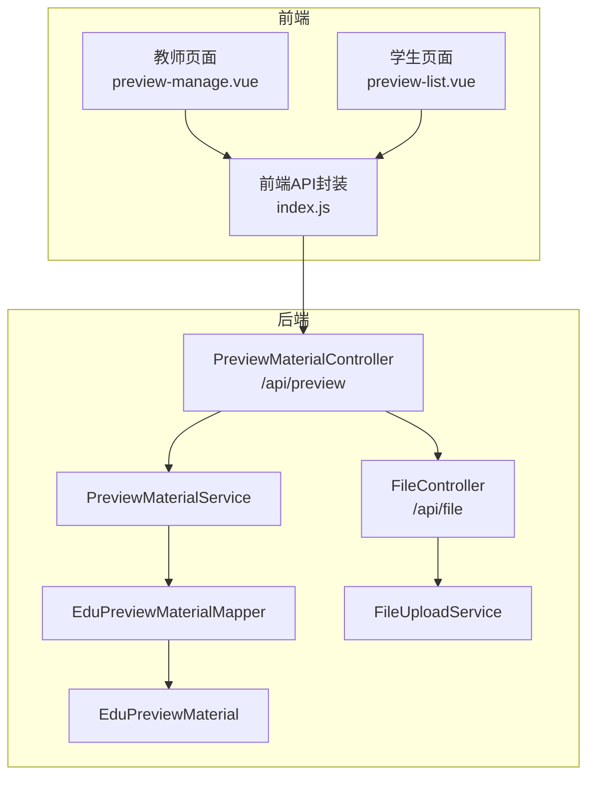
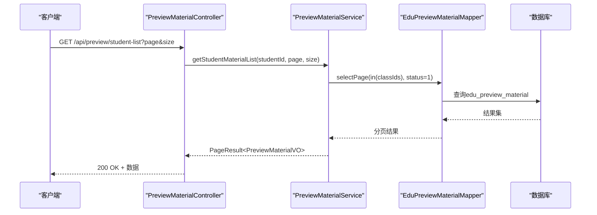
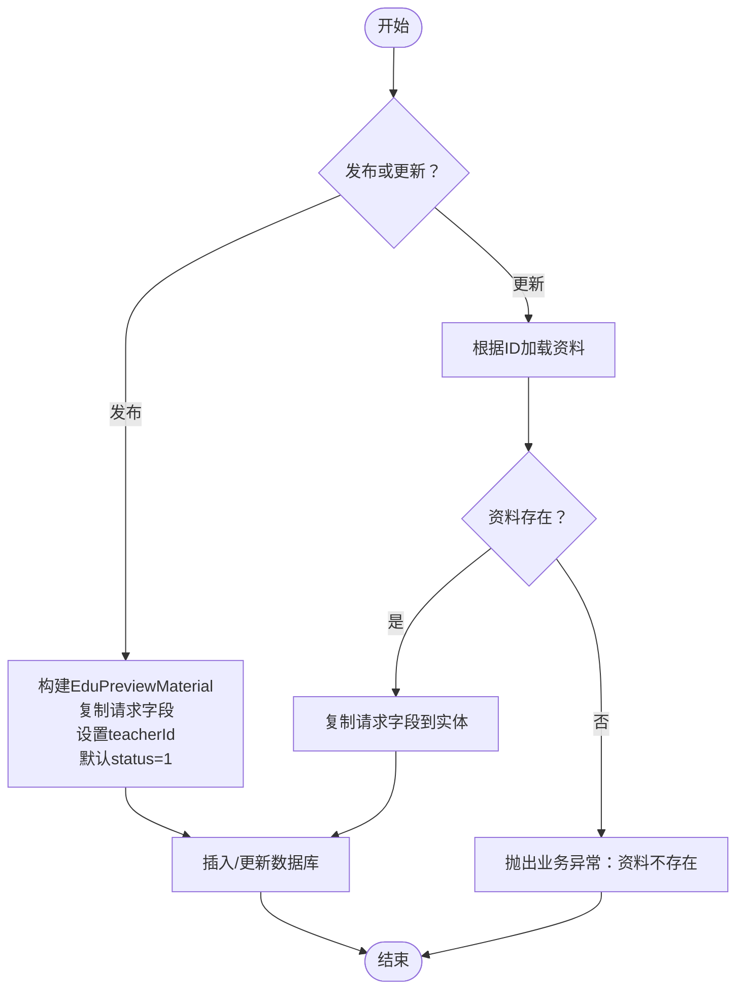
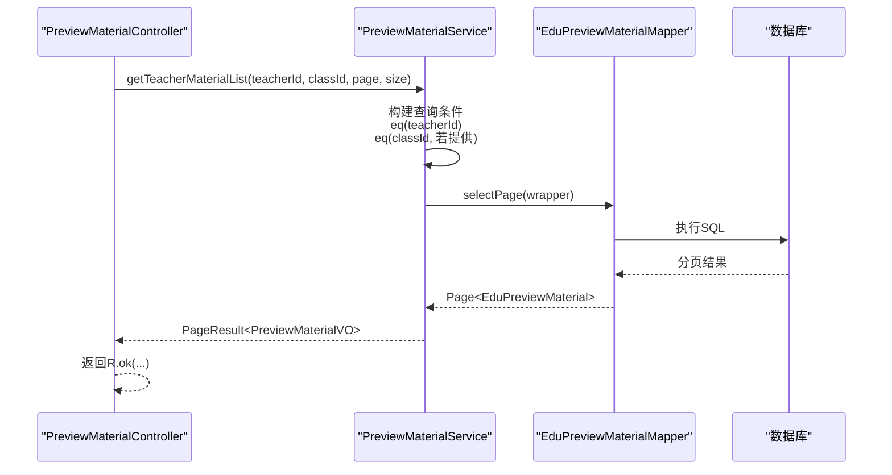
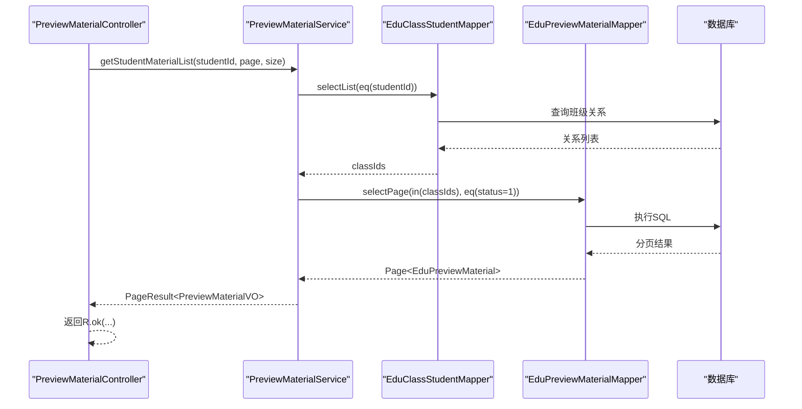
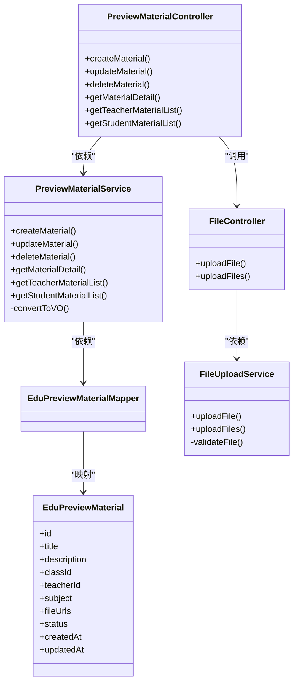

# 预习资料API

<cite>
**本文引用的文件**
- [PreviewMaterialController.java](file://helenedu-backend/src/main/java/com/helen/eduedu/controller/PreviewMaterialController.java)
- [PreviewMaterialRequest.java](file://helenedu-backend/src/main/java/com/helen/eduedu/dto/PreviewMaterialRequest.java)
- [EduPreviewMaterial.java](file://helenedu-backend/src/main/java/com/helen/eduedu/entity/EduPreviewMaterial.java)
- [PreviewMaterialVO.java](file://helenedu-backend/src/main/java/com/helen/eduedu/vo/PreviewMaterialVO.java)
- [PreviewMaterialService.java](file://helenedu-backend/src/main/java/com/helen/eduedu/service/PreviewMaterialService.java)
- [EduPreviewMaterialMapper.java](file://helenedu-backend/src/main/java/com/helen/eduedu/mapper/EduPreviewMaterialMapper.java)
- [FileController.java](file://helenedu-backend/src/main/java/com/helen/eduedu/controller/FileController.java)
- [FileUploadService.java](file://helenedu-backend/src/main/java/com/helen/eduedu/service/FileUploadService.java)
- [RequireRole.java](file://helenedu-backend/src/main/java/com/helen/eduedu/security/RequireRole.java)
- [RoleEnum.java](file://helenedu-backend/src/main/java/com/helen/eduedu/common/RoleEnum.java)
- [schema.sql](file://helenedu-backend/src/main/resources/db/schema.sql)
- [index.js](file://helenedu-frontend/src/api/index.js)
- [preview-manage.vue](file://helenedu-frontend/src/pages/teacher/preview-manage.vue)
- [preview-list.vue](file://helenedu-frontend/src/pages/student/preview-list.vue)
</cite>

## 目录
1. [简介](#简介)
2. [项目结构](#项目结构)
3. [核心组件](#核心组件)
4. [架构总览](#架构总览)
5. [详细组件分析](#详细组件分析)
6. [依赖关系分析](#依赖关系分析)
7. [性能与安全考虑](#性能与安全考虑)
8. [故障排查指南](#故障排查指南)
9. [结论](#结论)
10. [附录：接口清单与示例](#附录接口清单与示例)

## 简介
本文件为“预习资料”模块的完整API文档，覆盖资料的上传、管理、查询接口，说明请求参数、响应结构、权限控制、文件上传机制与最佳实践，并提供前后端对接示例与排错建议。该模块面向教师与学生两类角色，教师可发布/编辑/删除资料，学生可查看已发布资料并下载附件。

## 项目结构
后端采用Spring Boot + MyBatis-Plus架构，预习资料相关代码分布如下：
- 控制器层：提供REST接口，负责鉴权与参数校验
- DTO/VO层：定义请求与响应数据结构
- 实体层：映射数据库表edu_preview_material
- 服务层：封装业务逻辑，含分页查询、角色过滤、VO转换
- Mapper层：基于MyBatis-Plus的DAO接口
- 文件上传：独立的文件上传控制器与服务，支持单文件/批量上传

图表来源
- [PreviewMaterialController.java:19-79](file://helenedu-backend/src/main/java/com/helen/eduedu/controller/PreviewMaterialController.java#L19-L79)
- [PreviewMaterialService.java:28-151](file://helenedu-backend/src/main/java/com/helen/eduedu/service/PreviewMaterialService.java#L28-L151)
- [EduPreviewMaterialMapper.java:1-10](file://helenedu-backend/src/main/java/com/helen/eduedu/mapper/EduPreviewMaterialMapper.java#L1-L10)
- [EduPreviewMaterial.java:13-48](file://helenedu-backend/src/main/java/com/helen/eduedu/entity/EduPreviewMaterial.java#L13-L48)
- [FileController.java:16-35](file://helenedu-backend/src/main/java/com/helen/eduedu/controller/FileController.java#L16-L35)
- [FileUploadService.java:19-101](file://helenedu-backend/src/main/java/com/helen/eduedu/service/FileUploadService.java#L19-L101)

章节来源
- [PreviewMaterialController.java:19-79](file://helenedu-backend/src/main/java/com/helen/eduedu/controller/PreviewMaterialController.java#L19-L79)
- [FileController.java:16-35](file://helenedu-backend/src/main/java/com/helen/eduedu/controller/FileController.java#L16-L35)

## 核心组件
- 预习资料控制器：提供发布、更新、删除、详情、教师列表、学生列表接口
- 预习资料服务：实现业务逻辑，含分页、角色过滤、VO转换
- 请求DTO：定义发布/更新时的输入字段
- 响应VO：定义对外输出字段（含班级名、教师名）
- 文件上传控制器与服务：提供单文件/批量上传能力，含类型与大小校验

章节来源
- [PreviewMaterialController.java:23-79](file://helenedu-backend/src/main/java/com/helen/eduedu/controller/PreviewMaterialController.java#L23-L79)
- [PreviewMaterialService.java:30-151](file://helenedu-backend/src/main/java/com/helen/eduedu/service/PreviewMaterialService.java#L30-L151)
- [PreviewMaterialRequest.java:12-29](file://helenedu-backend/src/main/java/com/helen/eduedu/dto/PreviewMaterialRequest.java#L12-L29)
- [PreviewMaterialVO.java:11-24](file://helenedu-backend/src/main/java/com/helen/eduedu/vo/PreviewMaterialVO.java#L11-L24)
- [FileController.java:20-35](file://helenedu-backend/src/main/java/com/helen/eduedu/controller/FileController.java#L20-L35)
- [FileUploadService.java:24-101](file://helenedu-backend/src/main/java/com/helen/eduedu/service/FileUploadService.java#L24-L101)

## 架构总览
预习资料模块遵循典型的三层架构：
- 表现层：控制器接收HTTP请求，进行参数校验与权限拦截
- 业务层：服务实现复杂逻辑，如分页查询、角色过滤、VO转换
- 数据访问层：Mapper基于MyBatis-Plus执行SQL，实体映射JSON字段

图表来源
- [PreviewMaterialController.java:69-78](file://helenedu-backend/src/main/java/com/helen/eduedu/controller/PreviewMaterialController.java#L69-L78)
- [PreviewMaterialService.java:104-130](file://helenedu-backend/src/main/java/com/helen/eduedu/service/PreviewMaterialService.java#L104-L130)
- [EduPreviewMaterialMapper.java:1-10](file://helenedu-backend/src/main/java/com/helen/eduedu/mapper/EduPreviewMaterialMapper.java#L1-L10)

## 详细组件分析

### 接口定义与权限控制
- 发布预习资料
  - 方法：POST /api/preview
  - 权限：RequireRole({2})，仅教师
  - 参数：PreviewMaterialRequest
  - 响应：R<Long>，返回新创建资料的ID
- 更新预习资料
  - 方法：PUT /api/preview/{id}
  - 权限：RequireRole({2})，仅教师
  - 参数：PreviewMaterialRequest
  - 响应：R<Void>
- 删除预习资料
  - 方法：DELETE /api/preview/{id}
  - 权限：RequireRole({2})，仅教师
  - 响应：R<Void>
- 获取预习资料详情
  - 方法：GET /api/preview/{id}
  - 权限：公开
  - 响应：R<PreviewMaterialVO>
- 教师获取预习资料列表
  - 方法：GET /api/preview/list
  - 权限：RequireRole({2})，仅教师
  - 参数：classId(可选)、page、size
  - 响应：R<PageResult<PreviewMaterialVO>>
- 学生获取预习资料列表
  - 方法：GET /api/preview/student-list
  - 权限：RequireRole({1})，仅学生
  - 参数：page、size
  - 响应：R<PageResult<PreviewMaterialVO>>

章节来源
- [PreviewMaterialController.java:27-78](file://helenedu-backend/src/main/java/com/helen/eduedu/controller/PreviewMaterialController.java#L27-L78)
- [RequireRole.java:13-19](file://helenedu-backend/src/main/java/com/helen/eduedu/security/RequireRole.java#L13-L19)
- [RoleEnum.java:11-27](file://helenedu-backend/src/main/java/com/helen/eduedu/common/RoleEnum.java#L11-L27)

### 请求参数：PreviewMaterialRequest
- 字段说明
  - title：资料标题，必填
  - description：资料描述，可选
  - classId：所属班级ID，必填
  - subject：科目，可选
  - fileUrls：文件URL列表，可选
  - status：状态，0-下架，1-发布；未传入时默认发布
- 校验规则
  - 标题非空
  - 班级ID非空

章节来源
- [PreviewMaterialRequest.java:12-29](file://helenedu-backend/src/main/java/com/helen/eduedu/dto/PreviewMaterialRequest.java#L12-L29)

### 响应结构：PreviewMaterialVO
- 字段说明
  - id、title、description、classId、subject、fileUrls、status、createdAt
  - className：通过classId关联班级表获取
  - teacherName：通过teacherId关联用户表获取
- 注意
  - 该VO用于对外展示，不包含teacherId字段

章节来源
- [PreviewMaterialVO.java:11-24](file://helenedu-backend/src/main/java/com/helen/eduedu/vo/PreviewMaterialVO.java#L11-L24)
- [PreviewMaterialService.java:132-149](file://helenedu-backend/src/main/java/com/helen/eduedu/service/PreviewMaterialService.java#L132-L149)

### 业务流程图：教师发布/更新/删除

图表来源
- [PreviewMaterialService.java:37-71](file://helenedu-backend/src/main/java/com/helen/eduedu/service/PreviewMaterialService.java#L37-L71)

### 查询流程：教师按班级筛选

图表来源
- [PreviewMaterialController.java:57-67](file://helenedu-backend/src/main/java/com/helen/eduedu/controller/PreviewMaterialController.java#L57-L67)
- [PreviewMaterialService.java:84-102](file://helenedu-backend/src/main/java/com/helen/eduedu/service/PreviewMaterialService.java#L84-L102)

### 查询流程：学生查看已发布资料

图表来源
- [PreviewMaterialController.java:69-78](file://helenedu-backend/src/main/java/com/helen/eduedu/controller/PreviewMaterialController.java#L69-L78)
- [PreviewMaterialService.java:104-130](file://helenedu-backend/src/main/java/com/helen/eduedu/service/PreviewMaterialService.java#L104-L130)

### 文件上传机制
- 接口
  - 单文件上传：POST /api/file/upload
  - 批量上传：POST /api/file/upload-batch
- 服务端校验
  - 类型限制：支持图片与常见办公文档类型
  - 大小限制：最大50MB
  - 异常：空文件、超大、不支持类型均抛业务异常
- 存储策略
  - 按日期分目录存放（例如：uploads/yyyy/MM/dd）
  - 使用UUID生成唯一文件名
  - 返回可访问URL（基于配置的baseUrl）

章节来源
- [FileController.java:24-34](file://helenedu-backend/src/main/java/com/helen/eduedu/controller/FileController.java#L24-L34)
- [FileUploadService.java:26-101](file://helenedu-backend/src/main/java/com/helen/eduedu/service/FileUploadService.java#L26-L101)

## 依赖关系分析
- 控制器依赖服务层，服务层依赖Mapper与实体
- 服务层在转换VO时会查询班级与用户信息，形成跨表关联
- 文件上传独立于预习资料流程，但预习资料可引用文件URL列表

图表来源
- [PreviewMaterialController.java:23-79](file://helenedu-backend/src/main/java/com/helen/eduedu/controller/PreviewMaterialController.java#L23-L79)
- [PreviewMaterialService.java:30-151](file://helenedu-backend/src/main/java/com/helen/eduedu/service/PreviewMaterialService.java#L30-L151)
- [EduPreviewMaterialMapper.java:1-10](file://helenedu-backend/src/main/java/com/helen/eduedu/mapper/EduPreviewMaterialMapper.java#L1-L10)
- [EduPreviewMaterial.java:16-48](file://helenedu-backend/src/main/java/com/helen/eduedu/entity/EduPreviewMaterial.java#L16-L48)
- [FileController.java:20-35](file://helenedu-backend/src/main/java/com/helen/eduedu/controller/FileController.java#L20-L35)
- [FileUploadService.java:24-101](file://helenedu-backend/src/main/java/com/helen/eduedu/service/FileUploadService.java#L24-L101)

## 性能与安全考虑
- 性能
  - 列表查询使用分页，避免一次性加载大量数据
  - 学生端查询先查班级关系再分页查询，减少无关数据扫描
- 安全
  - 接口通过RequireRole注解限制角色访问
  - 文件上传进行类型与大小校验，防止恶意文件
  - 建议在生产环境开启HTTPS与CORS白名单
- 可扩展性
  - 支持按subject筛选（可在请求参数中扩展）
  - VO中可增加访问统计字段（需数据库与服务端配合）

[本节为通用指导，无需特定文件引用]

## 故障排查指南
- “资料不存在”
  - 触发场景：更新/删除/详情查询时ID无效
  - 处理建议：确认ID正确、检查软删除/权限问题
- “文件上传失败”
  - 触发场景：IO异常或磁盘空间不足
  - 处理建议：检查上传目录权限、磁盘空间、网络稳定性
- “不支持的文件类型”
  - 触发场景：文件MIME类型不在允许列表
  - 处理建议：确认文件格式是否在允许列表中
- “文件大小超过限制”
  - 触发场景：文件大于50MB
  - 处理建议：压缩文件或拆分为多个文件

章节来源
- [PreviewMaterialService.java:58-62](file://helenedu-backend/src/main/java/com/helen/eduedu/service/PreviewMaterialService.java#L58-L62)
- [FileUploadService.java:86-99](file://helenedu-backend/src/main/java/com/helen/eduedu/service/FileUploadService.java#L86-L99)

## 结论
预习资料模块提供了完善的发布、管理与查询能力，结合角色权限与文件上传机制，满足教师与学生的日常使用需求。建议在生产环境中进一步完善按学科筛选、访问统计、下载计数等功能，并加强日志与监控。

[本节为总结，无需特定文件引用]

## 附录：接口清单与示例

### 接口清单
- 教师
  - POST /api/preview：发布资料
  - PUT /api/preview/{id}：更新资料
  - DELETE /api/preview/{id}：删除资料
  - GET /api/preview/list?classId&page&size：教师资料列表（可按班级筛选）
- 学生
  - GET /api/preview/student-list?page&size：学生可查看的已发布资料列表
- 公开
  - GET /api/preview/{id}：资料详情

章节来源
- [PreviewMaterialController.java:27-78](file://helenedu-backend/src/main/java/com/helen/eduedu/controller/PreviewMaterialController.java#L27-L78)

### 前端调用示例
- 教师页面调用教师列表
  - 路径：/api/preview/list
  - 参数：page、size、classId(可选)
  - 参考：[index.js:16-17](file://helenedu-frontend/src/api/index.js#L16-L17)
- 学生页面调用学生列表
  - 路径：/api/preview/student-list
  - 参数：page、size
  - 参考：[index.js:16-17](file://helenedu-frontend/src/api/index.js#L16-L17)
- 详情页调用
  - 路径：/api/preview/{id}
  - 参考：[index.js](file://helenedu-frontend/src/api/index.js#L18)

章节来源
- [index.js:15-21](file://helenedu-frontend/src/api/index.js#L15-L21)

### 文件上传最佳实践
- 建议在前端先做本地校验（类型、大小），提升用户体验
- 批量上传时建议限制数量，避免单次请求过大
- 下载文件时根据类型选择合适打开方式（图片直接预览，文档在H5中打开或小程序中下载后打开）
- 建议在后端增加文件访问统计与过期清理策略

章节来源
- [FileUploadService.java:32-42](file://helenedu-backend/src/main/java/com/helen/eduedu/service/FileUploadService.java#L32-L42)
- [preview-list.vue:43-59](file://helenedu-frontend/src/pages/student/preview-list.vue#L43-L59)

### 数据模型与字段对照
- 预习资料表（edu_preview_material）
  - 字段：id、title、description、class_id、teacher_id、subject、file_urls(JSON)、status、created_at、updated_at
- 实体类字段映射
  - EduPreviewMaterial：与表字段一一对应，fileUrls使用JacksonTypeHandler映射JSON
- 响应VO字段
  - PreviewMaterialVO：包含基础字段及className、teacherName

章节来源
- [schema.sql:76-88](file://helenedu-backend/src/main/resources/db/schema.sql#L76-L88)
- [EduPreviewMaterial.java:16-48](file://helenedu-backend/src/main/java/com/helen/eduedu/entity/EduPreviewMaterial.java#L16-L48)
- [PreviewMaterialVO.java:11-24](file://helenedu-backend/src/main/java/com/helen/eduedu/vo/PreviewMaterialVO.java#L11-L24)