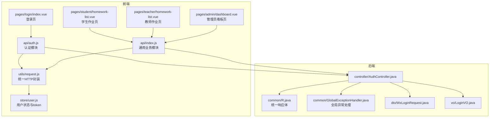
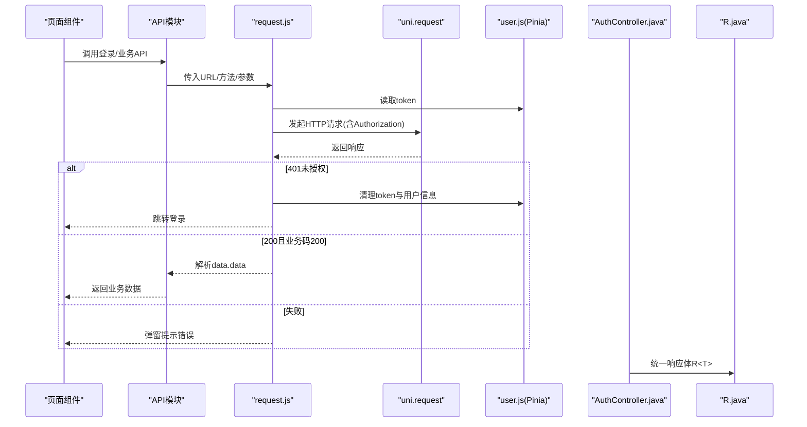
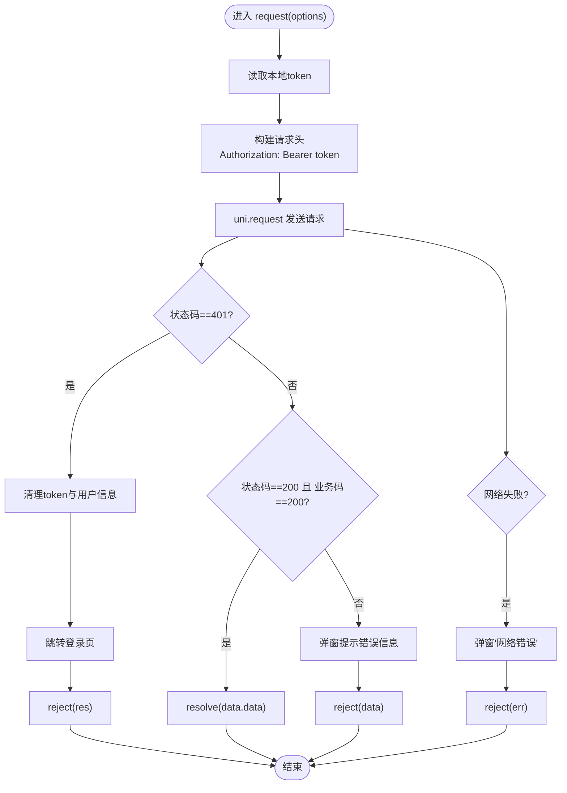
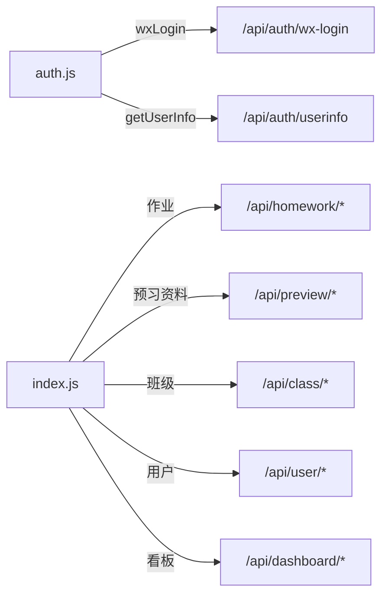
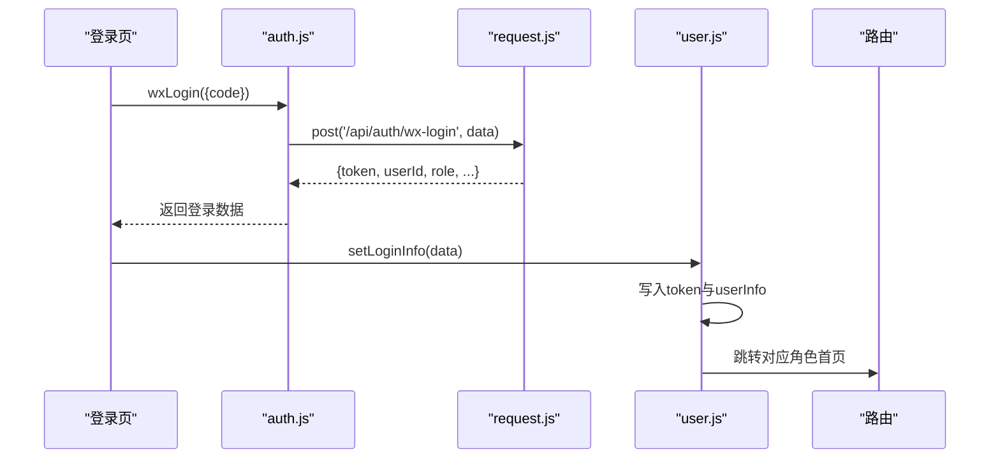
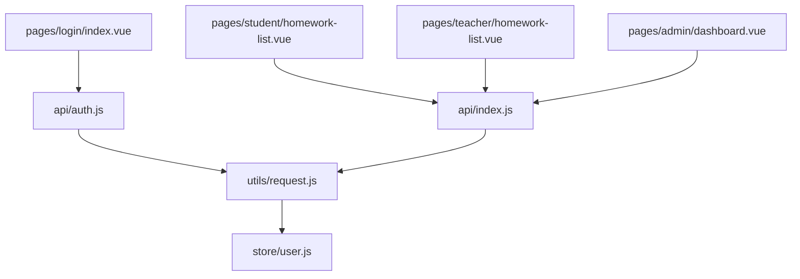

# API集成

<cite>
**本文引用的文件**
- [request.js](file://helenedu-frontend/src/utils/request.js)
- [auth.js](file://helenedu-frontend/src/api/auth.js)
- [index.js](file://helenedu-frontend/src/api/index.js)
- [user.js](file://helenedu-frontend/src/store/user.js)
- [index.vue（登录页）](file://helenedu-frontend/src/pages/login/index.vue)
- [homework-list.vue（学生）](file://helenedu-frontend/src/pages/student/homework-list.vue)
- [homework-list.vue（教师）](file://helenedu-frontend/src/pages/teacher/homework-list.vue)
- [dashboard.vue（管理员）](file://helenedu-frontend/src/pages/admin/dashboard.vue)
- [AuthController.java](file://helenedu-backend/src/main/java/com/helen/eduedu/controller/AuthController.java)
- [R.java](file://helenedu-backend/src/main/java/com/helen/eduedu/common/R.java)
- [GlobalExceptionHandler.java](file://helenedu-backend/src/main/java/com/helen/eduedu/common/GlobalExceptionHandler.java)
- [WxLoginRequest.java](file://helenedu-backend/src/main/java/com/helen/eduedu/dto/WxLoginRequest.java)
- [LoginVO.java](file://helenedu-backend/src/main/java/com/helen/eduedu/vo/LoginVO.java)
</cite>

## 目录
1. [简介](#简介)
2. [项目结构](#项目结构)
3. [核心组件](#核心组件)
4. [架构总览](#架构总览)
5. [详细组件分析](#详细组件分析)
6. [依赖关系分析](#依赖关系分析)
7. [性能考虑](#性能考虑)
8. [故障排查指南](#故障排查指南)
9. [结论](#结论)
10. [附录](#附录)

## 简介
本文件面向HelenEdu前端的API集成方案，围绕request.js中的HTTP请求封装展开，系统性解析：
- 请求基础封装与统一配置
- 请求/响应拦截与错误处理机制
- API模块组织结构与典型调用方式
- 认证token的管理策略（存储、刷新、过期处理）
- API调用最佳实践（参数传递、数据格式、错误处理、loading状态管理）
- 网络请求性能优化与重试机制建议
- 与后端接口的对接规范与调试技巧

## 项目结构
前端采用“工具层-模块层-页面层”的分层组织：
- 工具层：统一HTTP请求封装与上传能力
- 模块层：按业务域划分API模块（认证、通用业务等）
- 页面层：各角色页面通过API模块发起请求

图表来源
- [request.js:1-83](file://helenedu-frontend/src/utils/request.js#L1-L83)
- [auth.js:1-8](file://helenedu-frontend/src/api/auth.js#L1-L8)
- [index.js:1-50](file://helenedu-frontend/src/api/index.js#L1-L50)
- [user.js:1-62](file://helenedu-frontend/src/store/user.js#L1-L62)
- [index.vue（登录页）:1-194](file://helenedu-frontend/src/pages/login/index.vue#L1-L194)
- [homework-list.vue（学生）:1-197](file://helenedu-frontend/src/pages/student/homework-list.vue#L1-L197)
- [homework-list.vue（教师）:1-85](file://helenedu-frontend/src/pages/teacher/homework-list.vue#L1-L85)
- [dashboard.vue（管理员）:1-122](file://helenedu-frontend/src/pages/admin/dashboard.vue#L1-L122)
- [AuthController.java:1-39](file://helenedu-backend/src/main/java/com/helen/eduedu/controller/AuthController.java#L1-L39)
- [R.java:1-42](file://helenedu-backend/src/main/java/com/helen/eduedu/common/R.java#L1-L42)
- [GlobalExceptionHandler.java:1-58](file://helenedu-backend/src/main/java/com/helen/eduedu/common/GlobalExceptionHandler.java#L1-L58)
- [WxLoginRequest.java:1-19](file://helenedu-backend/src/main/java/com/helen/eduedu/dto/WxLoginRequest.java#L1-L19)
- [LoginVO.java:1-17](file://helenedu-backend/src/main/java/com/helen/eduedu/vo/LoginVO.java#L1-L17)

章节来源
- [request.js:1-83](file://helenedu-frontend/src/utils/request.js#L1-L83)
- [auth.js:1-8](file://helenedu-frontend/src/api/auth.js#L1-L8)
- [index.js:1-50](file://helenedu-frontend/src/api/index.js#L1-L50)
- [user.js:1-62](file://helenedu-frontend/src/store/user.js#L1-L62)
- [index.vue（登录页）:1-194](file://helenedu-frontend/src/pages/login/index.vue#L1-L194)
- [homework-list.vue（学生）:1-197](file://helenedu-frontend/src/pages/student/homework-list.vue#L1-L197)
- [homework-list.vue（教师）:1-85](file://helenedu-frontend/src/pages/teacher/homework-list.vue#L1-L85)
- [dashboard.vue（管理员）:1-122](file://helenedu-frontend/src/pages/admin/dashboard.vue#L1-L122)

## 核心组件
- 统一HTTP封装：基于uni.request实现，内置token注入、状态码与业务码判断、错误提示与跳转逻辑
- API模块：按业务域拆分，提供语义化方法，隐藏底层URL与参数细节
- 用户状态与token：Pinia Store集中管理token与用户信息，提供登录、更新、登出与角色导航

章节来源
- [request.js:1-83](file://helenedu-frontend/src/utils/request.js#L1-L83)
- [auth.js:1-8](file://helenedu-frontend/src/api/auth.js#L1-L8)
- [index.js:1-50](file://helenedu-frontend/src/api/index.js#L1-L50)
- [user.js:1-62](file://helenedu-frontend/src/store/user.js#L1-L62)

## 架构总览
前端通过API模块调用request.js，request.js负责：
- 注入Authorization头（Bearer token）
- 统一处理401未授权（清理本地token并跳转登录）
- 统一解析后端返回的业务码（code=200为成功），失败时弹窗提示
- 提供便捷方法（get/post/put/del）与文件上传能力

后端采用统一响应体R<T>，全局异常处理器统一转换错误码与消息。

图表来源
- [request.js:1-83](file://helenedu-frontend/src/utils/request.js#L1-L83)
- [auth.js:1-8](file://helenedu-frontend/src/api/auth.js#L1-L8)
- [index.js:1-50](file://helenedu-frontend/src/api/index.js#L1-L50)
- [user.js:1-62](file://helenedu-frontend/src/store/user.js#L1-L62)
- [AuthController.java:1-39](file://helenedu-backend/src/main/java/com/helen/eduedu/controller/AuthController.java#L1-L39)
- [R.java:1-42](file://helenedu-backend/src/main/java/com/helen/eduedu/common/R.java#L1-L42)

## 详细组件分析

### request.js：HTTP请求封装与拦截
- 基础配置
  - 基础URL常量，所有API拼接在该前缀下
  - 统一Content-Type为application/json
- 请求拦截
  - 从本地缓存读取token并注入到Authorization头
  - 支持自定义header合并
- 响应拦截
  - 401未授权：清理token与用户信息，跳转登录页
  - 200且业务码200：返回data.data
  - 其他情况：弹窗提示message或默认“请求失败”
- 错误处理
  - 网络失败：弹窗“网络错误”
- 便捷方法
  - get/post/put/del：封装常用HTTP动词
- 文件上传
  - uploadFile：支持带token的文件上传，解析后端JSON字符串

图表来源
- [request.js:1-83](file://helenedu-frontend/src/utils/request.js#L1-L83)

章节来源
- [request.js:1-83](file://helenedu-frontend/src/utils/request.js#L1-L83)

### API模块组织：auth.js与index.js
- 认证模块（auth.js）
  - 微信登录：post('/api/auth/wx-login', data)
  - 获取用户信息：get('/api/auth/userinfo')
- 通用业务模块（index.js）
  - 作业：列表、详情、创建、更新、删除、提交、批改、统计等
  - 预习资料：列表、详情、创建、更新、删除
  - 班级：列表、成员管理、详情
  - 用户管理：列表、新增、更新、启用/禁用、删除
  - 数据看板：总览、班级排行

图表来源
- [auth.js:1-8](file://helenedu-frontend/src/api/auth.js#L1-L8)
- [index.js:1-50](file://helenedu-frontend/src/api/index.js#L1-L50)

章节来源
- [auth.js:1-8](file://helenedu-frontend/src/api/auth.js#L1-L8)
- [index.js:1-50](file://helenedu-frontend/src/api/index.js#L1-L50)

### 认证token管理策略
- 存储位置
  - 本地缓存：token与userInfo分别持久化
- 登录流程
  - 登录成功后写入token与userInfo，并根据角色跳转对应首页
- 过期处理
  - request.js在收到401时自动清理本地token与userInfo并跳转登录
- 角色导航
  - Store提供根据角色返回首页路径的方法，用于登录后跳转

图表来源
- [index.vue（登录页）:1-194](file://helenedu-frontend/src/pages/login/index.vue#L1-L194)
- [auth.js:1-8](file://helenedu-frontend/src/api/auth.js#L1-L8)
- [request.js:1-83](file://helenedu-frontend/src/utils/request.js#L1-L83)
- [user.js:1-62](file://helenedu-frontend/src/store/user.js#L1-L62)

章节来源
- [user.js:1-62](file://helenedu-frontend/src/store/user.js#L1-L62)
- [index.vue（登录页）:1-194](file://helenedu-frontend/src/pages/login/index.vue#L1-L194)
- [request.js:1-83](file://helenedu-frontend/src/utils/request.js#L1-L83)

### API调用最佳实践
- 参数传递
  - GET参数：通过第二个参数传入对象，由封装自动序列化
  - POST/PUT数据：通过第三个参数传入对象，作为请求体
- 数据格式
  - 统一application/json；后端返回统一响应体R<T>
- 错误处理
  - 在页面层捕获异常，避免未处理的Promise拒绝
  - 使用弹窗提示后端message或默认提示
- Loading状态管理
  - 使用布尔变量控制加载状态，避免重复请求
  - 列表场景支持分页与“加载更多”按钮

章节来源
- [homework-list.vue（学生）:1-197](file://helenedu-frontend/src/pages/student/homework-list.vue#L1-L197)
- [homework-list.vue（教师）:1-85](file://helenedu-frontend/src/pages/teacher/homework-list.vue#L1-L85)
- [dashboard.vue（管理员）:1-122](file://helenedu-frontend/src/pages/admin/dashboard.vue#L1-L122)
- [request.js:1-83](file://helenedu-frontend/src/utils/request.js#L1-L83)

### 后端对接规范与调试技巧
- 统一响应体
  - 成功：code=200，message="success"，data为业务数据
  - 失败：code非200，message为错误描述
- 异常处理
  - 业务异常：BusinessException映射为指定code/message
  - 参数校验异常：MethodArgumentNotValidException等映射为400
  - 其他异常：统一500
- 接口示例
  - 认证：POST /api/auth/wx-login，请求体包含code与可选用户信息；返回LoginVO
  - 用户信息：GET /api/auth/userinfo，需携带Authorization头

章节来源
- [R.java:1-42](file://helenedu-backend/src/main/java/com/helen/eduedu/common/R.java#L1-L42)
- [GlobalExceptionHandler.java:1-58](file://helenedu-backend/src/main/java/com/helen/eduedu/common/GlobalExceptionHandler.java#L1-L58)
- [AuthController.java:1-39](file://helenedu-backend/src/main/java/com/helen/eduedu/controller/AuthController.java#L1-L39)
- [WxLoginRequest.java:1-19](file://helenedu-backend/src/main/java/com/helen/eduedu/dto/WxLoginRequest.java#L1-L19)
- [LoginVO.java:1-17](file://helenedu-backend/src/main/java/com/helen/eduedu/vo/LoginVO.java#L1-L17)

## 依赖关系分析
- request.js依赖本地存储（token与userInfo），并通过Pinia Store进行读写
- API模块仅依赖request.js，不直接关心URL与认证细节
- 页面组件依赖API模块与Pinia Store，实现业务逻辑与状态管理

图表来源
- [request.js:1-83](file://helenedu-frontend/src/utils/request.js#L1-L83)
- [user.js:1-62](file://helenedu-frontend/src/store/user.js#L1-L62)
- [auth.js:1-8](file://helenedu-frontend/src/api/auth.js#L1-L8)
- [index.js:1-50](file://helenedu-frontend/src/api/index.js#L1-L50)
- [index.vue（登录页）:1-194](file://helenedu-frontend/src/pages/login/index.vue#L1-L194)
- [homework-list.vue（学生）:1-197](file://helenedu-frontend/src/pages/student/homework-list.vue#L1-L197)
- [homework-list.vue（教师）:1-85](file://helenedu-frontend/src/pages/teacher/homework-list.vue#L1-L85)
- [dashboard.vue（管理员）:1-122](file://helenedu-frontend/src/pages/admin/dashboard.vue#L1-L122)

章节来源
- [request.js:1-83](file://helenedu-frontend/src/utils/request.js#L1-L83)
- [user.js:1-62](file://helenedu-frontend/src/store/user.js#L1-L62)
- [auth.js:1-8](file://helenedu-frontend/src/api/auth.js#L1-L8)
- [index.js:1-50](file://helenedu-frontend/src/api/index.js#L1-L50)
- [index.vue（登录页）:1-194](file://helenedu-frontend/src/pages/login/index.vue#L1-L194)
- [homework-list.vue（学生）:1-197](file://helenedu-frontend/src/pages/student/homework-list.vue#L1-L197)
- [homework-list.vue（教师）:1-85](file://helenedu-frontend/src/pages/teacher/homework-list.vue#L1-L85)
- [dashboard.vue（管理员）:1-122](file://helenedu-frontend/src/pages/admin/dashboard.vue#L1-L122)

## 性能考虑
- 并发请求
  - 使用Promise.all并发拉取多个接口，减少总等待时间（如管理员看板）
- 分页与懒加载
  - 列表场景采用分页参数与“加载更多”，避免一次性拉取大量数据
- 重复请求控制
  - 通过loading布尔值防止重复触发请求
- 缓存策略
  - 对于静态或低频变更的数据，可在页面层做内存缓存，结合路由守卫与生命周期管理
- 重试机制
  - 当前封装未内置重试，可在上层业务中对关键请求增加简单重试（指数退避或固定次数），注意幂等性与用户体验

章节来源
- [dashboard.vue（管理员）:1-122](file://helenedu-frontend/src/pages/admin/dashboard.vue#L1-L122)
- [homework-list.vue（学生）:1-197](file://helenedu-frontend/src/pages/student/homework-list.vue#L1-L197)
- [homework-list.vue（教师）:1-85](file://helenedu-frontend/src/pages/teacher/homework-list.vue#L1-L85)

## 故障排查指南
- 登录后立即401
  - 检查本地token是否正确写入与读取
  - 确认后端Authorization中间件是否正确解析Bearer token
- 业务接口返回“请求失败”
  - 查看后端统一响应体message字段，确认业务异常类型
  - 检查参数校验是否通过（400类错误）
- 网络错误
  - 检查BASE_URL与网络连通性
  - 确认跨域配置（CORS）是否允许前端域名
- 文件上传失败
  - 确认uploadFile的header中Authorization是否正确
  - 检查后端文件上传接口与权限校验

章节来源
- [request.js:1-83](file://helenedu-frontend/src/utils/request.js#L1-L83)
- [R.java:1-42](file://helenedu-backend/src/main/java/com/helen/eduedu/common/R.java#L1-L42)
- [GlobalExceptionHandler.java:1-58](file://helenedu-backend/src/main/java/com/helen/eduedu/common/GlobalExceptionHandler.java#L1-L58)

## 结论
本方案通过request.js实现统一的HTTP请求封装，配合API模块与Pinia Store，形成清晰的认证与业务调用链路。后端采用统一响应体与全局异常处理，便于前端一致化处理。建议在现有基础上完善重试与缓存策略，并持续优化错误提示与用户体验。

## 附录
- 关键文件路径与职责
  - utils/request.js：统一HTTP封装、拦截与错误处理
  - api/auth.js：认证相关API（登录、用户信息）
  - api/index.js：通用业务API（作业、预习、班级、用户、看板）
  - store/user.js：用户状态与token管理
  - pages/*：页面组件通过API模块发起请求
  - backend/common/R.java：统一响应体
  - backend/common/GlobalExceptionHandler.java：全局异常处理
  - backend/controller/AuthController.java：认证接口控制器
  - backend/dto/WxLoginRequest.java：登录请求参数模型
  - backend/vo/LoginVO.java：登录响应模型