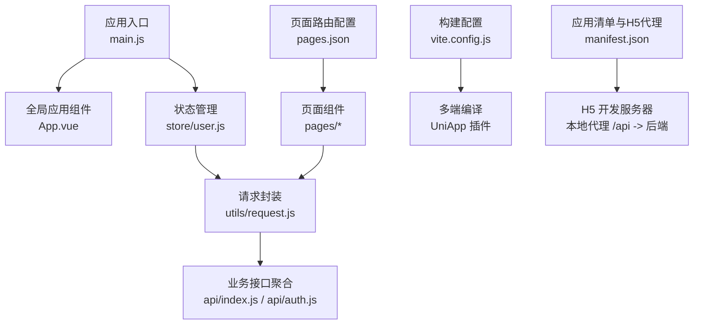
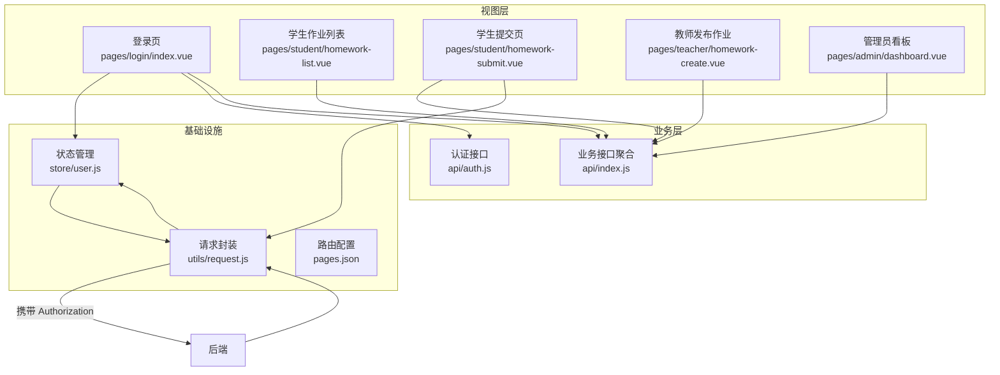
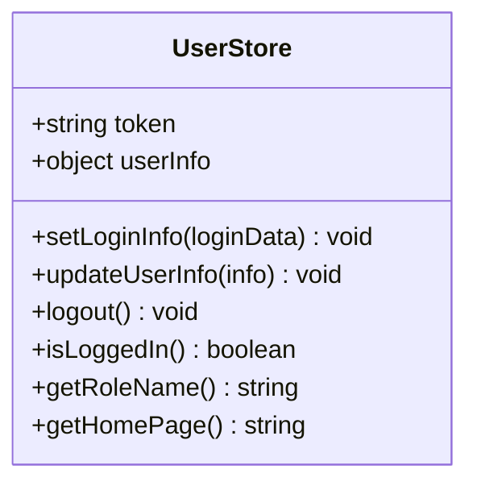
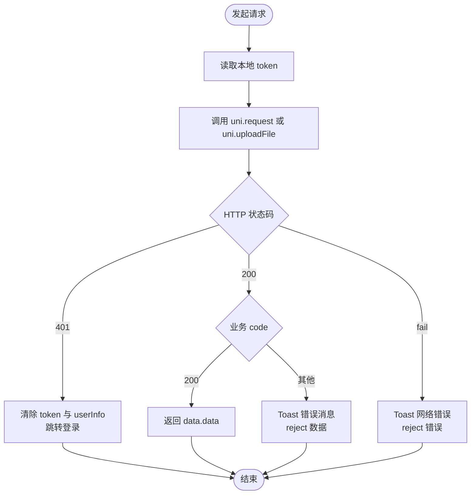
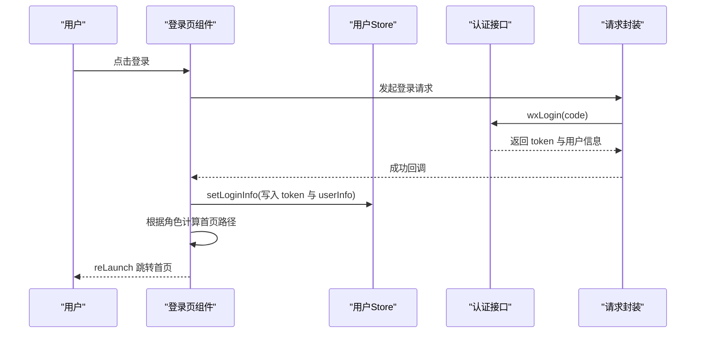
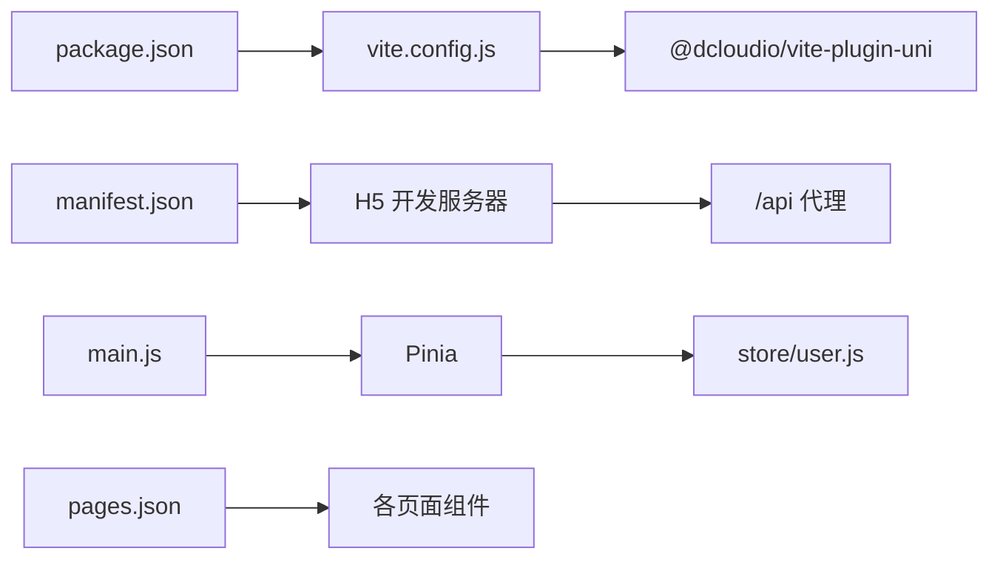

# 前端系统设计

<cite>
**本文引用的文件**
- [main.js](file://helenedu-frontend/src/main.js)
- [App.vue](file://helenedu-frontend/src/App.vue)
- [pages.json](file://helenedu-frontend/src/pages.json)
- [package.json](file://helenedu-frontend/package.json)
- [vite.config.js](file://helenedu-frontend/vite.config.js)
- [manifest.json](file://helenedu-frontend/src/manifest.json)
- [user.js](file://helenedu-frontend/src/store/user.js)
- [request.js](file://helenedu-frontend/src/utils/request.js)
- [index.js](file://helenedu-frontend/src/api/index.js)
- [auth.js](file://helenedu-frontend/src/api/auth.js)
- [login/index.vue](file://helenedu-frontend/src/pages/login/index.vue)
- [student/homework-list.vue](file://helenedu-frontend/src/pages/student/homework-list.vue)
- [student/homework-submit.vue](file://helenedu-frontend/src/pages/student/homework-submit.vue)
- [teacher/homework-create.vue](file://helenedu-frontend/src/pages/teacher/homework-create.vue)
- [admin/dashboard.vue](file://helenedu-frontend/src/pages/admin/dashboard.vue)
</cite>

## 目录
1. [简介](#简介)
2. [项目结构](#项目结构)
3. [核心组件](#核心组件)
4. [架构总览](#架构总览)
5. [详细组件分析](#详细组件分析)
6. [依赖关系分析](#依赖关系分析)
7. [性能考虑](#性能考虑)
8. [故障排查指南](#故障排查指南)
9. [结论](#结论)
10. [附录](#附录)

## 简介
本设计文档面向 HelenEdu 前端系统，基于 Vue 3 + UniApp 的多端开发架构，统一支持微信小程序与 H5 网页端。文档从系统架构、目录结构、页面路由、状态管理、API 集成、组件化开发、样式与主题、页面适配与兼容、开发调试与性能优化等方面进行系统化说明，帮助开发者快速理解与扩展系统。

## 项目结构
前端工程位于 helenedu-frontend 目录，采用典型的 UniApp 工程组织方式：
- 应用入口与全局配置：main.js、App.vue、pages.json、manifest.json、vite.config.js
- 页面与功能模块：按角色划分的 pages 子目录（admin、teacher、student），以及登录页
- 状态管理：store/user.js 使用 Pinia
- API 封装：utils/request.js 提供统一请求与上传能力；api/index.js、api/auth.js 提供业务接口聚合
- 构建与运行：package.json 中定义了多端构建脚本

图表来源
- [main.js:1-11](file://helenedu-frontend/src/main.js#L1-L11)
- [App.vue:1-104](file://helenedu-frontend/src/App.vue#L1-L104)
- [pages.json:1-112](file://helenedu-frontend/src/pages.json#L1-L112)
- [manifest.json:1-34](file://helenedu-frontend/src/manifest.json#L1-L34)
- [vite.config.js:1-7](file://helenedu-frontend/vite.config.js#L1-L7)
- [user.js:1-62](file://helenedu-frontend/src/store/user.js#L1-L62)
- [request.js:1-83](file://helenedu-frontend/src/utils/request.js#L1-L83)
- [index.js:1-50](file://helenedu-frontend/src/api/index.js#L1-L50)
- [auth.js:1-8](file://helenedu-frontend/src/api/auth.js#L1-L8)

章节来源
- [package.json:1-28](file://helenedu-frontend/package.json#L1-L28)
- [main.js:1-11](file://helenedu-frontend/src/main.js#L1-L11)
- [App.vue:1-104](file://helenedu-frontend/src/App.vue#L1-L104)
- [pages.json:1-112](file://helenedu-frontend/src/pages.json#L1-L112)
- [manifest.json:1-34](file://helenedu-frontend/src/manifest.json#L1-L34)
- [vite.config.js:1-7](file://helenedu-frontend/vite.config.js#L1-L7)

## 核心组件
- 应用启动与状态注入：在应用入口创建 SSR App 实例并挂载 Pinia，确保全局状态可用
- 全局样式与通用组件样式：App.vue 定义全局样式与通用卡片、按钮、标签、列表等基础样式
- 页面路由与 TabBar：pages.json 统一声明页面与导航栏、TabBar 配置
- 用户状态管理：Pinia Store 管理 token、用户信息、角色与首页跳转逻辑，并持久化到本地存储
- 请求封装与上传：utils/request.js 统一封装 uni.request 与 uni.uploadFile，内置鉴权头、错误提示与 401 处理
- 业务接口聚合：api/index.js、api/auth.js 对后端接口进行语义化封装，便于页面调用

章节来源
- [main.js:1-11](file://helenedu-frontend/src/main.js#L1-L11)
- [App.vue:15-103](file://helenedu-frontend/src/App.vue#L15-L103)
- [pages.json:79-111](file://helenedu-frontend/src/pages.json#L79-L111)
- [user.js:1-62](file://helenedu-frontend/src/store/user.js#L1-L62)
- [request.js:1-83](file://helenedu-frontend/src/utils/request.js#L1-L83)
- [index.js:1-50](file://helenedu-frontend/src/api/index.js#L1-L50)
- [auth.js:1-8](file://helenedu-frontend/src/api/auth.js#L1-L8)

## 架构总览
系统采用“页面组件 + 业务接口 + 请求封装 + 状态管理”的分层架构，页面通过 API 调用请求封装，请求封装负责鉴权与错误处理，状态管理负责用户态与全局状态，pages.json 统一路由与 TabBar。

图表来源
- [login/index.vue:1-194](file://helenedu-frontend/src/pages/login/index.vue#L1-L194)
- [student/homework-list.vue:1-197](file://helenedu-frontend/src/pages/student/homework-list.vue#L1-L197)
- [student/homework-submit.vue:1-195](file://helenedu-frontend/src/pages/student/homework-submit.vue#L1-L195)
- [teacher/homework-create.vue:1-89](file://helenedu-frontend/src/pages/teacher/homework-create.vue#L1-L89)
- [admin/dashboard.vue:1-122](file://helenedu-frontend/src/pages/admin/dashboard.vue#L1-L122)
- [index.js:1-50](file://helenedu-frontend/src/api/index.js#L1-L50)
- [auth.js:1-8](file://helenedu-frontend/src/api/auth.js#L1-L8)
- [request.js:1-83](file://helenedu-frontend/src/utils/request.js#L1-L83)
- [user.js:1-62](file://helenedu-frontend/src/store/user.js#L1-L62)
- [pages.json:1-112](file://helenedu-frontend/src/pages.json#L1-L112)

## 详细组件分析

### 页面路由与 TabBar 配置（pages.json）
- 页面声明：集中声明所有页面路径与导航栏标题、自定义导航样式
- 全局样式：设置导航栏文字颜色、背景色与整体背景色
- TabBar：定义三类用户角色的 Tab 列表，含图标与选中态图标路径
- 配置规则：路径以 pages 子目录为根，导航栏样式与 TabBar 字段遵循 UniApp 规范

章节来源
- [pages.json:1-112](file://helenedu-frontend/src/pages.json#L1-L112)

### 应用入口与全局样式（main.js、App.vue）
- 应用入口：创建 SSR App 并挂载 Pinia，导出 createApp 工厂函数
- 全局样式：定义 page 背景色、字体、容器内边距、卡片、按钮、标签、列表、空状态等通用样式

章节来源
- [main.js:1-11](file://helenedu-frontend/src/main.js#L1-L11)
- [App.vue:1-104](file://helenedu-frontend/src/App.vue#L1-L104)

### 用户状态管理（Pinia Store）
- 状态字段：token、userInfo（含 id、name、role、avatarUrl）
- 方法：setLoginInfo、updateUserInfo、logout、isLoggedIn、getRoleName、getHomePage
- 持久化：使用 uni 存储同步读写 token 与 userInfo
- 角色首页：根据角色返回对应首页路径，用于登录后跳转

图表来源
- [user.js:1-62](file://helenedu-frontend/src/store/user.js#L1-L62)

章节来源
- [user.js:1-62](file://helenedu-frontend/src/store/user.js#L1-L62)

### 请求封装与上传（utils/request.js）
- 基础配置：BASE_URL、统一 header（Content-Type、Authorization）
- 统一处理：success/fail 分支处理 401、业务 code 与消息提示
- 便捷方法：get/post/put/del 包装
- 文件上传：uploadFile 支持图片上传并解析后端返回数据

图表来源
- [request.js:1-83](file://helenedu-frontend/src/utils/request.js#L1-L83)

章节来源
- [request.js:1-83](file://helenedu-frontend/src/utils/request.js#L1-L83)

### 业务接口聚合（api/index.js、api/auth.js）
- 认证接口：wxLogin、getUserInfo
- 作业相关：列表、详情、创建、更新、删除、提交、批改、查看提交记录、提交详情
- 预习资料：列表、详情、创建、更新、删除
- 班级相关：列表、我的班级、详情、成员管理、增删改查
- 用户管理：列表、教师/学生查询、增删改、启用禁用
- 数据看板：总览、班级排行

章节来源
- [index.js:1-50](file://helenedu-frontend/src/api/index.js#L1-L50)
- [auth.js:1-8](file://helenedu-frontend/src/api/auth.js#L1-L8)

### 页面组件示例

#### 登录页（多端适配）
- 功能点：微信一键登录（小程序端）、H5 手机号开发登录
- 逻辑：调用 wxLogin，成功后写入用户状态并按角色跳转首页
- 条件编译：通过条件编译指令区分小程序与 H5 端展示

图表来源
- [login/index.vue:38-92](file://helenedu-frontend/src/pages/login/index.vue#L38-L92)
- [auth.js:1-8](file://helenedu-frontend/src/api/auth.js#L1-L8)
- [user.js:8-31](file://helenedu-frontend/src/store/user.js#L8-L31)
- [request.js:7-44](file://helenedu-frontend/src/utils/request.js#L7-L44)

章节来源
- [login/index.vue:1-194](file://helenedu-frontend/src/pages/login/index.vue#L1-L194)

#### 学生作业列表页
- 功能点：Tab 切换、分页加载、状态标签、格式化时间、跳转详情
- 逻辑：根据状态筛选、分页追加、计算是否还有更多

章节来源
- [student/homework-list.vue:1-197](file://helenedu-frontend/src/pages/student/homework-list.vue#L1-L197)

#### 学生提交页（图片上传）
- 功能点：文本内容、图片选择/预览/移除、批量上传、提交作业
- 逻辑：逐张上传图片并收集 URL，最终提交作业

章节来源
- [student/homework-submit.vue:1-195](file://helenedu-frontend/src/pages/student/homework-submit.vue#L1-L195)

#### 教师发布作业页
- 功能点：表单填写、日期选择、发布作业
- 逻辑：组装参数并调用创建接口

章节来源
- [teacher/homework-create.vue:1-89](file://helenedu-frontend/src/pages/teacher/homework-create.vue#L1-L89)

#### 管理员看板页
- 功能点：数据总览、快捷入口、班级排行
- 逻辑：并行拉取总览与排行数据

章节来源
- [admin/dashboard.vue:1-122](file://helenedu-frontend/src/pages/admin/dashboard.vue#L1-L122)

## 依赖关系分析
- 构建与多端：package.json 中定义 dev/build 脚本，vite.config.js 集成 @dcloudio/vite-plugin-uni 插件
- H5 开发：manifest.json 配置 h5 路由模式为 hash，开发服务器端口与 /api 代理到后端
- 运行时：main.js 创建应用并挂载 Pinia，pages.json 统一页面与 TabBar

图表来源
- [package.json:6-11](file://helenedu-frontend/package.json#L6-L11)
- [vite.config.js:1-7](file://helenedu-frontend/vite.config.js#L1-L7)
- [manifest.json:19-32](file://helenedu-frontend/src/manifest.json#L19-L32)
- [main.js:5-10](file://helenedu-frontend/src/main.js#L5-L10)
- [user.js:1-62](file://helenedu-frontend/src/store/user.js#L1-L62)
- [pages.json:1-112](file://helenedu-frontend/src/pages.json#L1-L112)

章节来源
- [package.json:1-28](file://helenedu-frontend/package.json#L1-L28)
- [vite.config.js:1-7](file://helenedu-frontend/vite.config.js#L1-L7)
- [manifest.json:1-34](file://helenedu-frontend/src/manifest.json#L1-L34)
- [main.js:1-11](file://helenedu-frontend/src/main.js#L1-L11)

## 性能考虑
- 图片上传优化：逐张上传并在本地缓存已上传 URL，避免重复上传
- 列表分页：按需加载、去重拼接，减少一次性渲染压力
- 并行请求：看板页使用 Promise.all 并行获取多个指标，缩短首屏等待
- 本地存储：用户信息与 token 使用本地缓存，减少重复登录与网络请求
- 样式复用：通用卡片、按钮、标签样式集中定义，降低样式体积与维护成本

## 故障排查指南
- 登录失败/无权限：检查请求封装对 401 的处理与用户状态清理逻辑
- 网络错误：确认 H5 代理配置与后端服务连通性
- 图片上传失败：检查 uploadFile 的返回解析与后端上传接口
- 页面跳转异常：核对 pages.json 中页面路径与 reLaunch/redirectTo 参数

章节来源
- [request.js:20-44](file://helenedu-frontend/src/utils/request.js#L20-L44)
- [login/index.vue:47-92](file://helenedu-frontend/src/pages/login/index.vue#L47-L92)
- [manifest.json:25-30](file://helenedu-frontend/src/manifest.json#L25-L30)

## 结论
本系统以 Vue 3 + UniApp 为基础，结合 Pinia 状态管理与统一请求封装，实现了跨小程序与 H5 的一致体验。通过 pages.json 统一路由与 TabBar，配合条件编译与本地存储策略，满足多端开发需求。后续可在接口幂等、错误重试、缓存策略与主题变量化方面进一步优化。

## 附录

### 页面与角色映射
- 学生端：作业列表、作业详情、作业提交、预习资料、个人中心
- 教师端：班级列表、作业管理、布置作业、批改作业、预习资料管理、个人中心
- 管理端：数据看板、班级管理、人员管理、个人中心

章节来源
- [pages.json:2-78](file://helenedu-frontend/src/pages.json#L2-L78)