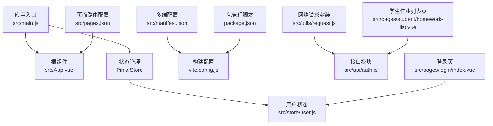
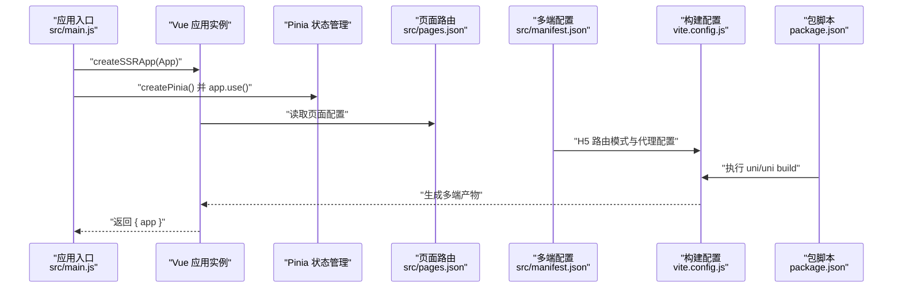
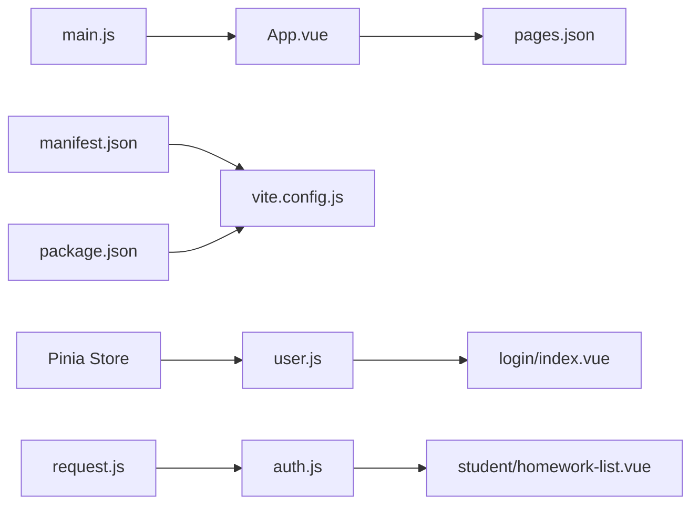
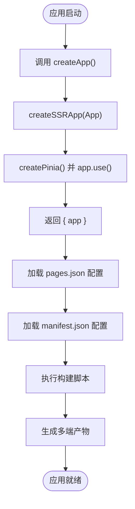

# 应用入口

<cite>
**本文引用的文件**
- [main.js](file://helenedu-frontend/src/main.js)
- [App.vue](file://helenedu-frontend/src/App.vue)
- [manifest.json](file://helenedu-frontend/src/manifest.json)
- [pages.json](file://helenedu-frontend/src/pages.json)
- [vite.config.js](file://helenedu-frontend/vite.config.js)
- [package.json](file://helenedu-frontend/package.json)
- [request.js](file://helenedu-frontend/src/utils/request.js)
- [user.js](file://helenedu-frontend/src/store/user.js)
- [auth.js](file://helenedu-frontend/src/api/auth.js)
- [index.vue](file://helenedu-frontend/src/pages/login/index.vue)
- [homework-list.vue](file://helenedu-frontend/src/pages/student/homework-list.vue)
</cite>

## 目录
1. [简介](#简介)
2. [项目结构](#项目结构)
3. [核心组件](#核心组件)
4. [架构总览](#架构总览)
5. [详细组件分析](#详细组件分析)
6. [依赖关系分析](#依赖关系分析)
7. [性能与可维护性](#性能与可维护性)
8. [故障排查指南](#故障排查指南)
9. [结论](#结论)
10. [附录](#附录)

## 简介
本文件聚焦 HelenEdu 前端应用的“应用入口”设计与实现，围绕以下目标展开：
- 解析 main.js 中 createApp 函数的实现，说明 Vue 应用实例创建、Pinia 状态管理集成与 SSR 支持配置
- 详解 App.vue 根组件的全局样式、主题与交互生命周期
- 阐述 UniApp 多端编译特性，说明如何在同一代码库中同时支持微信小程序与 H5 网页
- 提供应用启动流程图与关键配置项说明
- 给出开发与生产环境的差异化配置策略建议

## 项目结构
前端工程位于 helenedu-frontend 目录，采用 UniApp + Vue 3 + Pinia 的技术栈，并通过 Vite 插件统一构建。关键入口与配置如下：
- 应用入口：src/main.js
- 根组件：src/App.vue
- 页面路由与 Tab 配置：src/pages.json
- 多端配置：src/manifest.json
- 构建配置：vite.config.js
- 包管理与脚本：package.json
- 状态管理：src/store/user.js
- 网络请求封装：src/utils/request.js
- API 接口：src/api/auth.js
- 示例页面：src/pages/login/index.vue、src/pages/student/homework-list.vue

图表来源
- [main.js:1-11](file://helenedu-frontend/src/main.js#L1-L11)
- [App.vue:1-104](file://helenedu-frontend/src/App.vue#L1-L104)
- [pages.json:1-112](file://helenedu-frontend/src/pages.json#L1-L112)
- [manifest.json:1-34](file://helenedu-frontend/src/manifest.json#L1-L34)
- [vite.config.js:1-7](file://helenedu-frontend/vite.config.js#L1-L7)
- [package.json:1-28](file://helenedu-frontend/package.json#L1-L28)
- [user.js:1-62](file://helenedu-frontend/src/store/user.js#L1-L62)
- [request.js:1-83](file://helenedu-frontend/src/utils/request.js#L1-L83)
- [auth.js:1-8](file://helenedu-frontend/src/api/auth.js#L1-L8)
- [index.vue:1-194](file://helenedu-frontend/src/pages/login/index.vue#L1-L194)
- [homework-list.vue:1-197](file://helenedu-frontend/src/pages/student/homework-list.vue#L1-L197)

章节来源
- [main.js:1-11](file://helenedu-frontend/src/main.js#L1-L11)
- [App.vue:1-104](file://helenedu-frontend/src/App.vue#L1-L104)
- [pages.json:1-112](file://helenedu-frontend/src/pages.json#L1-L112)
- [manifest.json:1-34](file://helenedu-frontend/src/manifest.json#L1-L34)
- [vite.config.js:1-7](file://helenedu-frontend/vite.config.js#L1-L7)
- [package.json:1-28](file://helenedu-frontend/package.json#L1-L28)

## 核心组件
- 应用入口与状态管理集成
  - main.js 使用 createSSRApp 创建应用实例，并通过 createPinia 安装 Pinia，导出 { app } 对象，满足 UniApp 多端渲染要求
  - 关键实现参考：[main.js:5-10](file://helenedu-frontend/src/main.js#L5-L10)
- 根组件 App.vue
  - 提供应用生命周期钩子 onLaunch/onShow/onHide
  - 定义全局样式与通用组件样式（page、.container、.card、按钮、标签、列表、空状态等）
  - 关键实现参考：[App.vue:1-12](file://helenedu-frontend/src/App.vue#L1-L12)、[App.vue:15-103](file://helenedu-frontend/src/App.vue#L15-L103)
- 页面路由与 Tab 配置 pages.json
  - 定义所有页面路径、导航栏标题、Tab 列表及图标
  - 关键实现参考：[pages.json:1-112](file://helenedu-frontend/src/pages.json#L1-L112)
- 多端配置 manifest.json
  - 定义应用名称、版本、微信小程序与 H5 平台设置（如路由模式、开发服务器代理）
  - 关键实现参考：[manifest.json:1-34](file://helenedu-frontend/src/manifest.json#L1-L34)
- 构建配置 vite.config.js
  - 通过 @dcloudio/vite-plugin-uni 插件启用 UniApp 多端编译
  - 关键实现参考：[vite.config.js:1-7](file://helenedu-frontend/vite.config.js#L1-L7)
- 包管理与脚本 package.json
  - 定义开发与构建脚本，分别支持微信小程序与 H5
  - 关键实现参考：[package.json:6-11](file://helenedu-frontend/package.json#L6-L11)

章节来源
- [main.js:1-11](file://helenedu-frontend/src/main.js#L1-L11)
- [App.vue:1-104](file://helenedu-frontend/src/App.vue#L1-L104)
- [pages.json:1-112](file://helenedu-frontend/src/pages.json#L1-L112)
- [manifest.json:1-34](file://helenedu-frontend/src/manifest.json#L1-L34)
- [vite.config.js:1-7](file://helenedu-frontend/vite.config.js#L1-L7)
- [package.json:1-28](file://helenedu-frontend/package.json#L1-L28)

## 架构总览
下图展示从应用入口到页面渲染的关键流程，涵盖 Vue 实例创建、状态注入、页面路由与多端编译。

图表来源
- [main.js:5-10](file://helenedu-frontend/src/main.js#L5-L10)
- [pages.json:1-112](file://helenedu-frontend/src/pages.json#L1-L112)
- [manifest.json:19-32](file://helenedu-frontend/src/manifest.json#L19-L32)
- [vite.config.js:4-6](file://helenedu-frontend/vite.config.js#L4-L6)
- [package.json:6-11](file://helenedu-frontend/package.json#L6-L11)

## 详细组件分析

### 应用入口与状态管理集成（main.js）
- createApp 函数职责
  - 使用 createSSRApp 创建可 SSR 的 Vue 应用实例
  - 通过 createPinia 创建状态管理实例并安装到应用上
  - 返回 { app }，满足 UniApp 多端渲染约定
- 关键点
  - SSR 支持：createSSRApp 保证服务端与客户端一致的渲染能力
  - Pinia 集成：app.use(pinia) 将状态管理注入到应用上下文
  - 导出规范：返回对象便于多端框架统一处理
- 参考实现位置
  - [main.js:5-10](file://helenedu-frontend/src/main.js#L5-L10)

章节来源
- [main.js:1-11](file://helenedu-frontend/src/main.js#L1-L11)

### 根组件设计（App.vue）
- 生命周期钩子
  - onLaunch/onShow/onHide：用于应用启动、显示与隐藏时的日志输出或初始化逻辑
  - 参考实现：[App.vue:3-11](file://helenedu-frontend/src/App.vue#L3-L11)
- 全局样式与主题
  - page 样式：背景色、字体族、字号、文字颜色
  - 通用布局与组件样式：容器、卡片、按钮、标签、列表、空状态
  - 参考实现：[App.vue:15-103](file://helenedu-frontend/src/App.vue#L15-L103)
- 设计要点
  - 使用 rpx 单位适配多端屏幕密度
  - 通过类名复用提升样式一致性
- 参考实现位置
  - [App.vue:1-104](file://helenedu-frontend/src/App.vue#L1-L104)

章节来源
- [App.vue:1-104](file://helenedu-frontend/src/App.vue#L1-L104)

### 页面路由与 Tab 配置（pages.json）
- 页面定义
  - pages 数组列出所有页面路径与导航栏样式
  - 参考实现：[pages.json:2-78](file://helenedu-frontend/src/pages.json#L2-L78)
- 全局样式
  - 导航栏文字颜色、标题、背景色、页面背景色
  - 参考实现：[pages.json:79-84](file://helenedu-frontend/src/pages.json#L79-L84)
- Tab 配置
  - Tab 文案、图标路径、选中态颜色与页面路径
  - 参考实现：[pages.json:85-111](file://helenedu-frontend/src/pages.json#L85-L111)

章节来源
- [pages.json:1-112](file://helenedu-frontend/src/pages.json#L1-L112)

### 多端编译与 H5/小程序配置（manifest.json）
- 基本信息与平台设置
  - 应用名称、版本、微信小程序 appid、H5 路由模式
  - 参考实现：[manifest.json:1-34](file://helenedu-frontend/src/manifest.json#L1-L34)
- H5 开发服务器
  - 端口与后端代理，将 /api 请求转发至本地后端
  - 参考实现：[manifest.json:23-31](file://helenedu-frontend/src/manifest.json#L23-L31)

章节来源
- [manifest.json:1-34](file://helenedu-frontend/src/manifest.json#L1-L34)

### 构建与脚本（vite.config.js、package.json）
- 构建插件
  - @dcloudio/vite-plugin-uni 启用 UniApp 多端编译
  - 参考实现：[vite.config.js:4-6](file://helenedu-frontend/vite.config.js#L4-L6)
- 开发与构建脚本
  - dev:mp-weixin/build:mp-weixin 支持微信小程序
  - dev:h5/build:h5 支持 H5 网页
  - 参考实现：[package.json:6-11](file://helenedu-frontend/package.json#L6-L11)

章节来源
- [vite.config.js:1-7](file://helenedu-frontend/vite.config.js#L1-L7)
- [package.json:1-28](file://helenedu-frontend/package.json#L1-L28)

### 状态管理（Pinia Store）
- 用户状态模块
  - token 与 userInfo 的持久化存储与更新
  - 登录、登出、角色判断与首页跳转
  - 参考实现：[user.js:1-62](file://helenedu-frontend/src/store/user.js#L1-L62)
- 与页面联动
  - 登录页使用 useUserStore 写入登录信息并跳转首页
  - 参考实现：[index.vue:44-92](file://helenedu-frontend/src/pages/login/index.vue#L44-L92)

章节来源
- [user.js:1-62](file://helenedu-frontend/src/store/user.js#L1-L62)
- [index.vue:1-194](file://helenedu-frontend/src/pages/login/index.vue#L1-L194)

### 网络请求与接口（request.js、auth.js）
- 请求封装
  - 统一添加 Authorization 头、Token 过期处理、Toast 错误提示
  - 参考实现：[request.js:7-44](file://helenedu-frontend/src/utils/request.js#L7-L44)
- 接口模块
  - 微信登录与用户信息获取
  - 参考实现：[auth.js:1-8](file://helenedu-frontend/src/api/auth.js#L1-L8)

章节来源
- [request.js:1-83](file://helenedu-frontend/src/utils/request.js#L1-L83)
- [auth.js:1-8](file://helenedu-frontend/src/api/auth.js#L1-L8)

### 示例页面（登录页与作业列表页）
- 登录页
  - 条件编译：微信小程序端显示“微信一键登录”，H5 端显示手机号登录
  - 登录成功后根据角色跳转不同首页
  - 参考实现：[index.vue:14-30](file://helenedu-frontend/src/pages/login/index.vue#L14-L30)、[index.vue:84-92](file://helenedu-frontend/src/pages/login/index.vue#L84-L92)
- 学生作业列表页
  - Tab 切换、分页加载、状态标签与格式化时间
  - 参考实现：[homework-list.vue:53-128](file://helenedu-frontend/src/pages/student/homework-list.vue#L53-L128)

章节来源
- [index.vue:1-194](file://helenedu-frontend/src/pages/login/index.vue#L1-L194)
- [homework-list.vue:1-197](file://helenedu-frontend/src/pages/student/homework-list.vue#L1-L197)

## 依赖关系分析
- 组件耦合与内聚
  - main.js 仅负责应用与状态管理的装配，低耦合、高内聚
  - App.vue 作为全局样式与生命周期载体，被所有页面共享
  - pages.json 与 manifest.json 分别承担页面路由与多端配置职责，避免业务逻辑侵入
- 外部依赖
  - @dcloudio/vite-plugin-uni 提供多端编译能力
  - Vue 3 与 Pinia 提供响应式与状态管理
- 关键依赖链
  - main.js -> App.vue -> pages.json -> manifest.json -> vite.config.js -> package.json

图表来源
- [main.js:1-11](file://helenedu-frontend/src/main.js#L1-L11)
- [App.vue:1-104](file://helenedu-frontend/src/App.vue#L1-L104)
- [pages.json:1-112](file://helenedu-frontend/src/pages.json#L1-L112)
- [manifest.json:1-34](file://helenedu-frontend/src/manifest.json#L1-L34)
- [vite.config.js:1-7](file://helenedu-frontend/vite.config.js#L1-L7)
- [package.json:1-28](file://helenedu-frontend/package.json#L1-L28)
- [user.js:1-62](file://helenedu-frontend/src/store/user.js#L1-L62)
- [request.js:1-83](file://helenedu-frontend/src/utils/request.js#L1-L83)
- [auth.js:1-8](file://helenedu-frontend/src/api/auth.js#L1-L8)
- [index.vue:1-194](file://helenedu-frontend/src/pages/login/index.vue#L1-L194)
- [homework-list.vue:1-197](file://helenedu-frontend/src/pages/student/homework-list.vue#L1-L197)

章节来源
- [main.js:1-11](file://helenedu-frontend/src/main.js#L1-L11)
- [App.vue:1-104](file://helenedu-frontend/src/App.vue#L1-L104)
- [pages.json:1-112](file://helenedu-frontend/src/pages.json#L1-L112)
- [manifest.json:1-34](file://helenedu-frontend/src/manifest.json#L1-L34)
- [vite.config.js:1-7](file://helenedu-frontend/vite.config.js#L1-L7)
- [package.json:1-28](file://helenedu-frontend/package.json#L1-L28)
- [user.js:1-62](file://helenedu-frontend/src/store/user.js#L1-L62)
- [request.js:1-83](file://helenedu-frontend/src/utils/request.js#L1-L83)
- [auth.js:1-8](file://helenedu-frontend/src/api/auth.js#L1-L8)
- [index.vue:1-194](file://helenedu-frontend/src/pages/login/index.vue#L1-L194)
- [homework-list.vue:1-197](file://helenedu-frontend/src/pages/student/homework-list.vue#L1-L197)

## 性能与可维护性
- 性能优化建议
  - 图标与静态资源使用相对路径，确保多端一致加载
  - 在 pages.json 中合理配置 Tab 图标与页面懒加载，减少首屏压力
  - 在 manifest.json 中为 H5 设置合适的代理与缓存策略
- 可维护性建议
  - 将全局样式集中于 App.vue，避免重复定义
  - 将网络请求封装与接口模块分离，便于测试与替换
  - 使用 Pinia 管理跨页面共享的状态，避免 props/emit 层层传递

## 故障排查指南
- 常见问题定位
  - 登录失败或 Token 过期：检查 request.js 的 401 处理与用户状态写入逻辑
    - 参考实现：[request.js:21-28](file://helenedu-frontend/src/utils/request.js#L21-L28)、[user.js:8-18](file://helenedu-frontend/src/store/user.js#L8-L18)
  - H5 无法访问后端接口：检查 manifest.json 的代理配置与端口占用
    - 参考实现：[manifest.json:23-31](file://helenedu-frontend/src/manifest.json#L23-L31)
  - 多端样式不一致：确认 rpx 单位使用与页面容器类名
    - 参考实现：[App.vue:17-22](file://helenedu-frontend/src/App.vue#L17-L22)、[App.vue:24-35](file://helenedu-frontend/src/App.vue#L24-L35)
- 调试建议
  - 使用 uni.showToast 输出关键状态与错误信息
  - 在 pages.json 中为页面设置自定义导航栏以提升调试体验

章节来源
- [request.js:1-83](file://helenedu-frontend/src/utils/request.js#L1-L83)
- [user.js:1-62](file://helenedu-frontend/src/store/user.js#L1-L62)
- [manifest.json:1-34](file://helenedu-frontend/src/manifest.json#L1-L34)
- [App.vue:1-104](file://helenedu-frontend/src/App.vue#L1-L104)

## 结论
本应用入口以简洁清晰的方式完成了 Vue 应用实例创建、Pinia 状态管理集成与多端编译配置。通过 App.vue 的全局样式与生命周期、pages.json 的页面路由与 Tab 配置、manifest.json 的多端设置以及 vite.config.js 的构建插件，实现了对微信小程序与 H5 的统一支持。配合 request.js 与 Pinia Store 的封装，应用具备良好的可维护性与扩展性。

## 附录

### 应用启动流程图（代码级映射）

图表来源
- [main.js:5-10](file://helenedu-frontend/src/main.js#L5-L10)
- [pages.json:1-112](file://helenedu-frontend/src/pages.json#L1-L112)
- [manifest.json:1-34](file://helenedu-frontend/src/manifest.json#L1-L34)
- [vite.config.js:4-6](file://helenedu-frontend/vite.config.js#L4-L6)
- [package.json:6-11](file://helenedu-frontend/package.json#L6-L11)

### 关键配置项说明
- 应用入口与状态管理
  - createSSRApp：支持 SSR 的应用实例创建
  - createPinia：状态管理初始化
  - 返回 { app }：满足多端渲染约定
  - 参考实现：[main.js:5-10](file://helenedu-frontend/src/main.js#L5-L10)
- 页面路由与 Tab
  - pages.json：页面路径、导航栏标题、Tab 列表与图标
  - 参考实现：[pages.json:1-112](file://helenedu-frontend/src/pages.json#L1-L112)
- 多端配置
  - manifest.json：应用名称、版本、微信小程序与 H5 设置
  - H5 路由模式与开发服务器代理
  - 参考实现：[manifest.json:1-34](file://helenedu-frontend/src/manifest.json#L1-L34)
- 构建与脚本
  - vite.config.js：@dcloudio/vite-plugin-uni 插件启用多端编译
  - package.json：dev:mp-weixin/build:mp-weixin/dev:h5/build:h5 脚本
  - 参考实现：[vite.config.js:4-6](file://helenedu-frontend/vite.config.js#L4-L6)、[package.json:6-11](file://helenedu-frontend/package.json#L6-L11)

章节来源
- [main.js:1-11](file://helenedu-frontend/src/main.js#L1-L11)
- [pages.json:1-112](file://helenedu-frontend/src/pages.json#L1-L112)
- [manifest.json:1-34](file://helenedu-frontend/src/manifest.json#L1-L34)
- [vite.config.js:1-7](file://helenedu-frontend/vite.config.js#L1-L7)
- [package.json:1-28](file://helenedu-frontend/package.json#L1-L28)