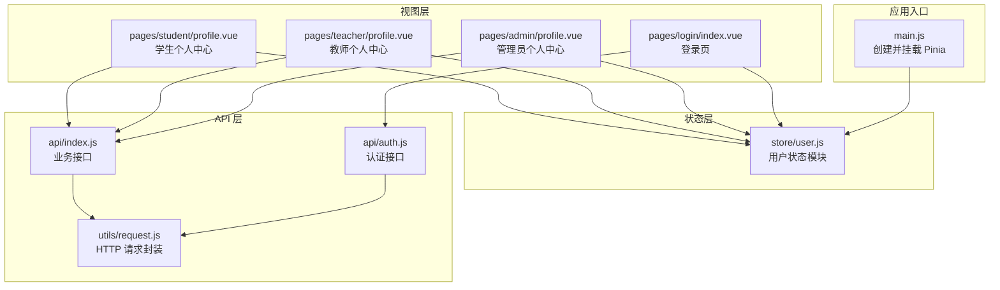
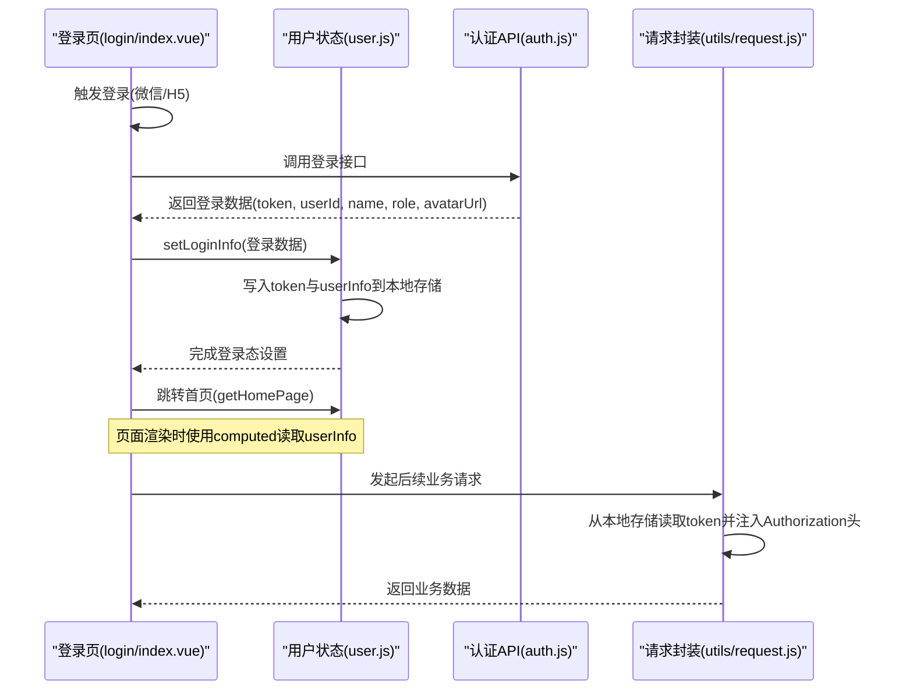
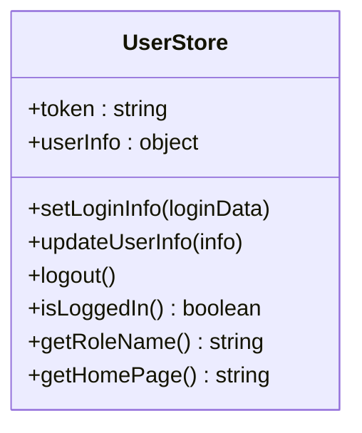
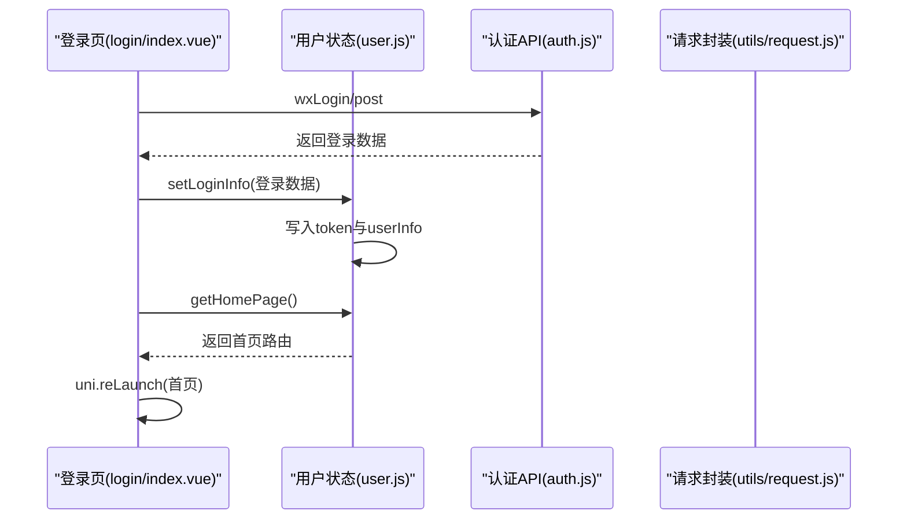
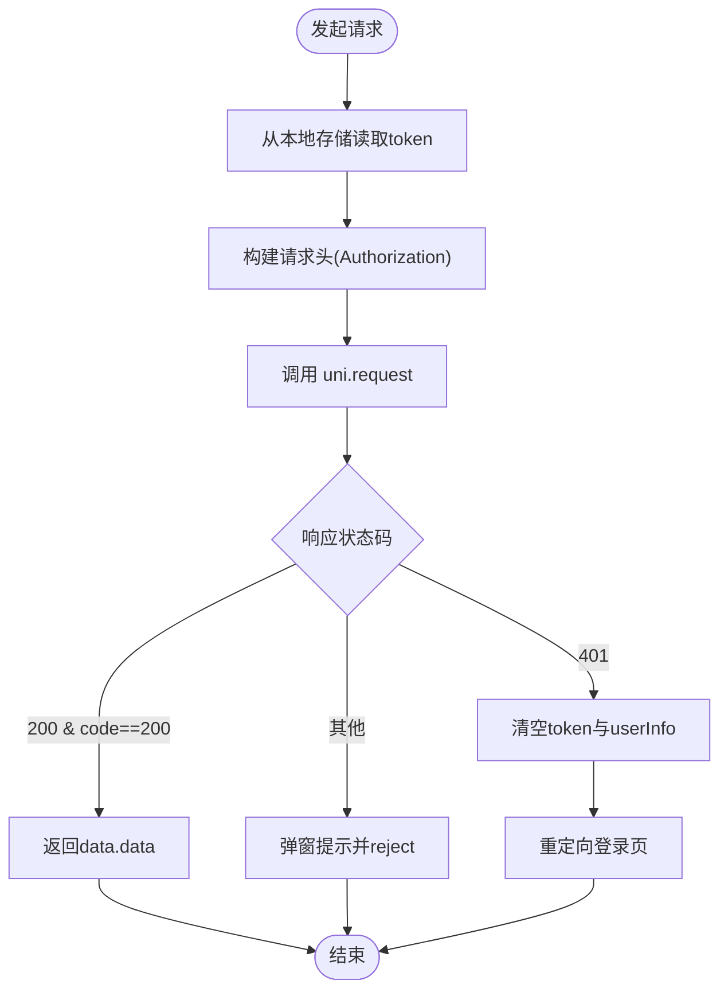
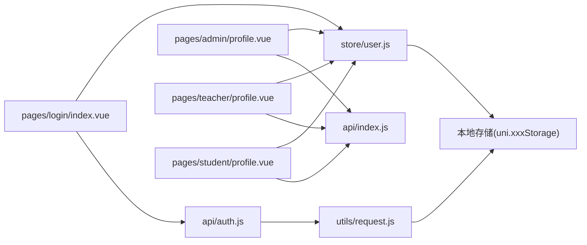

# 状态管理

<cite>
**本文引用的文件列表**
- [user.js](file://helenedu-frontend/src/store/user.js)
- [main.js](file://helenedu-frontend/src/main.js)
- [auth.js](file://helenedu-frontend/src/api/auth.js)
- [request.js](file://helenedu-frontend/src/utils/request.js)
- [index.js](file://helenedu-frontend/src/api/index.js)
- [login/index.vue](file://helenedu-frontend/src/pages/login/index.vue)
- [admin/profile.vue](file://helenedu-frontend/src/pages/admin/profile.vue)
- [student/profile.vue](file://helenedu-frontend/src/pages/student/profile.vue)
- [teacher/profile.vue](file://helenedu-frontend/src/pages/teacher/profile.vue)
- [package.json](file://helenedu-frontend/package.json)
</cite>

## 目录
1. [简介](#简介)
2. [项目结构](#项目结构)
3. [核心组件](#核心组件)
4. [架构总览](#架构总览)
5. [详细组件分析](#详细组件分析)
6. [依赖关系分析](#依赖关系分析)
7. [性能考量](#性能考量)
8. [故障排查指南](#故障排查指南)
9. [结论](#结论)
10. [附录](#附录)

## 简介
本文件围绕 HelenEdu 的前端状态管理系统进行系统性梳理与说明，重点以 Pinia Store 中的用户状态模块（user.js）为核心，阐述其在登录态、权限信息与个人信息方面的管理策略；同时覆盖状态持久化（本地存储）、数据流与更新策略、最佳实践、调试技巧以及与其他组件的交互方式。文档力求兼顾技术细节与可读性，帮助开发者快速理解并高效维护状态层。

## 项目结构
前端采用 UniApp + Vue 3 + Pinia 架构，状态管理集中在 store 目录，用户状态通过独立的 user.js 管理，配合统一的请求封装与 API 调用，形成清晰的数据流闭环。

图表来源
- [main.js:1-11](file://helenedu-frontend/src/main.js#L1-L11)
- [user.js:1-62](file://helenedu-frontend/src/store/user.js#L1-L62)
- [login/index.vue:1-194](file://helenedu-frontend/src/pages/login/index.vue#L1-L194)
- [admin/profile.vue:1-52](file://helenedu-frontend/src/pages/admin/profile.vue#L1-L52)
- [teacher/profile.vue:1-45](file://helenedu-frontend/src/pages/teacher/profile.vue#L1-L45)
- [student/profile.vue:1-145](file://helenedu-frontend/src/pages/student/profile.vue#L1-L145)
- [auth.js:1-8](file://helenedu-frontend/src/api/auth.js#L1-L8)
- [index.js:1-50](file://helenedu-frontend/src/api/index.js#L1-L50)
- [request.js:1-83](file://helenedu-frontend/src/utils/request.js#L1-L83)

章节来源
- [main.js:1-11](file://helenedu-frontend/src/main.js#L1-L11)
- [package.json:1-28](file://helenedu-frontend/package.json#L1-L28)

## 核心组件
本节聚焦用户状态模块 user.js 的设计与实现，涵盖 state、getters、actions 的职责划分与协作方式，并结合登录、权限与个人信息管理的实际场景。

- 状态定义（state）
  - token：当前用户的访问令牌，来源于本地存储初始化，用于后续请求鉴权。
  - userInfo：当前用户信息对象，来源于本地存储初始化，包含用户标识、名称、角色、头像等字段。
- 行为方法（actions）
  - setLoginInfo：设置登录态，写入 token 与 userInfo，并同步到本地存储；随后根据角色跳转首页。
  - updateUserInfo：更新用户信息，合并新字段并持久化。
  - logout：清除登录态与本地存储，重定向至登录页。
  - isLoggedIn：判断是否已登录（基于 token 是否存在）。
  - getRoleName：将角色编码映射为中文角色名。
  - getHomePage：根据角色返回对应首页路由。
- 计算属性（getters）
  - 通过计算属性组合 userInfo，派生出角色名、头像首字母等展示信息，供各页面使用。

章节来源
- [user.js:1-62](file://helenedu-frontend/src/store/user.js#L1-L62)

## 架构总览
下图展示了从登录到状态持久化、再到页面渲染与请求鉴权的整体流程，体现 Pinia 在状态管理中的核心地位。

图表来源
- [login/index.vue:1-194](file://helenedu-frontend/src/pages/login/index.vue#L1-L194)
- [user.js:1-62](file://helenedu-frontend/src/store/user.js#L1-L62)
- [auth.js:1-8](file://helenedu-frontend/src/api/auth.js#L1-L8)
- [request.js:1-83](file://helenedu-frontend/src/utils/request.js#L1-L83)

## 详细组件分析

### 用户状态模块（user.js）
- 设计要点
  - 使用组合式 Store（defineStore + setup 语法糖），将状态、计算与行为集中在一个模块中，便于维护与测试。
  - 本地存储键值：
    - token：保存访问令牌，用于请求鉴权。
    - userInfo：保存用户信息对象，包含 id、name、role、avatarUrl 等。
  - 行为方法职责清晰：
    - setLoginInfo：一次性完成登录态设置与持久化。
    - updateUserInfo：按需增量更新用户信息并持久化。
    - logout：清理本地存储并重定向。
  - 计算属性派生：
    - getRoleName：将角色编码映射为中文角色名，便于 UI 展示。
    - getHomePage：根据角色返回首页路由，简化页面跳转逻辑。
- 复杂度与性能
  - 所有状态均为简单标量或对象，读写复杂度 O(1)，本地存储读写开销极低。
  - 通过 computed 读取 userInfo，避免重复序列化/反序列化。
- 错误处理与边界
  - 初始化时对本地存储为空的情况做了兜底处理（空字符串/空对象）。
  - 登录态变更后立即同步到本地存储，确保刷新后仍保持一致。

图表来源
- [user.js:1-62](file://helenedu-frontend/src/store/user.js#L1-L62)

章节来源
- [user.js:1-62](file://helenedu-frontend/src/store/user.js#L1-L62)

### 应用入口与状态挂载（main.js）
- 创建并挂载 Pinia 实例，使全局组件可使用 useUserStore。
- 作为状态管理的根节点，确保所有页面与组件共享同一份状态树。

章节来源
- [main.js:1-11](file://helenedu-frontend/src/main.js#L1-L11)

### 登录流程与状态联动（login/index.vue）
- 登录触发
  - 支持微信一键登录与 H5 开发模式登录两种路径。
  - 登录成功后调用 userStore.setLoginInfo，完成状态设置与本地存储。
- 跳转逻辑
  - 通过 userStore.getHomePage 或自定义映射函数，根据角色跳转到对应首页。
- 与 API 的协作
  - 登录接口由 api/auth.js 提供，请求封装由 utils/request.js 统一处理。

图表来源
- [login/index.vue:1-194](file://helenedu-frontend/src/pages/login/index.vue#L1-L194)
- [user.js:1-62](file://helenedu-frontend/src/store/user.js#L1-L62)
- [auth.js:1-8](file://helenedu-frontend/src/api/auth.js#L1-L8)
- [request.js:1-83](file://helenedu-frontend/src/utils/request.js#L1-L83)

章节来源
- [login/index.vue:1-194](file://helenedu-frontend/src/pages/login/index.vue#L1-L194)

### 个人中心与状态消费（admin/profile.vue、teacher/profile.vue、student/profile.vue）
- 状态消费
  - 各角色个人中心均通过 useUserStore 读取 userInfo 并计算头像首字母、角色名等展示信息。
- 退出登录
  - 通过 uni.showModal 确认后调用 userStore.logout，清理本地存储并重定向登录页。
- 路由跳转
  - 个人中心内提供快捷入口，点击后通过 uni.navigateTo 跳转到对应功能页。

章节来源
- [admin/profile.vue:1-52](file://helenedu-frontend/src/pages/admin/profile.vue#L1-L52)
- [teacher/profile.vue:1-45](file://helenedu-frontend/src/pages/teacher/profile.vue#L1-L45)
- [student/profile.vue:1-145](file://helenedu-frontend/src/pages/student/profile.vue#L1-L145)
- [user.js:1-62](file://helenedu-frontend/src/store/user.js#L1-L62)

### 请求封装与鉴权（utils/request.js）
- 统一拦截器
  - 在请求头中注入 Authorization: Bearer token，token 来源于本地存储。
  - 对 401 响应进行统一处理：清空本地存储并重定向登录页。
- 成功/失败处理
  - 对业务响应码进行校验，成功时返回 data.data，失败时弹窗提示并 reject。
- 文件上传
  - 提供 uploadFile 方法，支持带 token 的文件上传。

图表来源
- [request.js:1-83](file://helenedu-frontend/src/utils/request.js#L1-L83)

章节来源
- [request.js:1-83](file://helenedu-frontend/src/utils/request.js#L1-L83)

### API 接口与业务数据（api/auth.js、api/index.js）
- 认证接口
  - wxLogin：微信登录。
  - getUserInfo：获取用户信息。
- 业务接口
  - 作业、预习资料、班级、用户管理、数据看板等接口，均由 api/index.js 导出，供页面按需调用。

章节来源
- [auth.js:1-8](file://helenedu-frontend/src/api/auth.js#L1-L8)
- [index.js:1-50](file://helenedu-frontend/src/api/index.js#L1-L50)

## 依赖关系分析
- 模块耦合
  - user.js 仅依赖本地存储 API（uni.xxxStorage），不直接依赖后端接口，降低耦合度。
  - login/index.vue 依赖 user.js 与 auth.js，形成“视图-状态-接口”的清晰分层。
  - 各角色个人中心依赖 user.js 的计算属性，实现 UI 与状态的解耦。
- 外部依赖
  - Pinia 版本：^2.1.7。
  - Vue 版本：^3.4.21。
- 可能的循环依赖
  - 当前结构未发现循环依赖，user.js 不依赖页面，页面只依赖 user.js。

图表来源
- [user.js:1-62](file://helenedu-frontend/src/store/user.js#L1-L62)
- [login/index.vue:1-194](file://helenedu-frontend/src/pages/login/index.vue#L1-L194)
- [admin/profile.vue:1-52](file://helenedu-frontend/src/pages/admin/profile.vue#L1-L52)
- [teacher/profile.vue:1-45](file://helenedu-frontend/src/pages/teacher/profile.vue#L1-L45)
- [student/profile.vue:1-145](file://helenedu-frontend/src/pages/student/profile.vue#L1-L145)
- [auth.js:1-8](file://helenedu-frontend/src/api/auth.js#L1-L8)
- [index.js:1-50](file://helenedu-frontend/src/api/index.js#L1-L50)
- [request.js:1-83](file://helenedu-frontend/src/utils/request.js#L1-L83)

章节来源
- [package.json:1-28](file://helenedu-frontend/package.json#L1-L28)

## 性能考量
- 状态读写成本
  - userInfo 为轻量对象，频繁读取不会造成明显性能负担；通过 computed 缓存派生结果，减少重复计算。
- 本地存储策略
  - token 与 userInfo 同步写入本地存储，保证刷新后状态一致；但频繁写入可能带来 I/O 影响，建议在批量更新时合并写入（如 updateUserInfo 已实现）。
- 请求鉴权
  - 每次请求自动注入 Authorization，避免手动拼接，减少出错与重复代码。
- 路由跳转
  - getHomePage 与页面映射逻辑简单，切换角色时无需额外计算成本。

## 故障排查指南
- 登录后无法进入首页
  - 检查 setLoginInfo 是否被调用且 token 与 userInfo 已写入本地存储。
  - 检查 getHomePage 的角色映射是否正确。
- 退出登录后仍显示登录态
  - 确认 logout 是否执行了移除本地存储与重定向。
- 请求 401
  - 检查 utils/request.js 是否正确从本地存储读取 token 并注入 Authorization。
  - 确认后端 JWT 有效时间与刷新策略。
- 页面未更新
  - 确认页面使用 computed 读取 userStore.userInfo，而非直接读取响应式对象。
- 开发模式登录异常
  - 检查 H5 登录逻辑与后端 /api/auth/wx-login 的参数格式。

章节来源
- [user.js:1-62](file://helenedu-frontend/src/store/user.js#L1-L62)
- [request.js:1-83](file://helenedu-frontend/src/utils/request.js#L1-L83)
- [login/index.vue:1-194](file://helenedu-frontend/src/pages/login/index.vue#L1-L194)

## 结论
HelenEdu 的状态管理以 Pinia 为核心，用户状态模块通过明确的 state、actions 与 getters，实现了登录态、权限与个人信息的统一管理。配合本地存储与请求封装，形成了从登录到鉴权、从状态持久化到页面渲染的完整闭环。该设计具备良好的可维护性与扩展性，适合在多角色场景下持续演进。

## 附录

### 状态持久化方案与选择
- 存储介质
  - 本地存储：token 与 userInfo 通过 uni.xxxStorage 写入本地，实现跨会话持久化。
- 选择依据
  - token：需要跨页面、跨刷新保持登录态，适合本地存储。
  - userInfo：包含用户基本信息，适合本地存储以便快速渲染。
- 注意事项
  - 避免在 userInfo 中存放敏感字段。
  - 更新 userInfo 时建议合并写入，减少多次 I/O。

章节来源
- [user.js:1-62](file://helenedu-frontend/src/store/user.js#L1-L62)

### 最佳实践清单
- 状态设计
  - 将用户信息拆分为 token 与 userInfo，职责清晰。
  - 使用 computed 派生展示信息，避免在模板中做复杂计算。
- 数据流
  - 登录成功后统一调用 setLoginInfo，避免分散写入。
  - 退出登录统一调用 logout，确保清理彻底。
- 更新策略
  - updateUserInfo 采用浅合并策略，避免覆盖已有字段。
  - 批量更新时尽量一次写入本地存储。
- 鉴权与安全
  - 所有请求自动注入 Authorization，避免遗漏。
  - 401 统一处理，防止静默失败。
- 调试与监控
  - 在关键节点打印日志（如 setLoginInfo、logout）。
  - 使用浏览器/小程序调试工具观察本地存储变化。

### 与其他组件的交互方式
- 登录页与用户状态
  - 登录成功后直接调用 userStore.setLoginInfo 并跳转首页。
- 个人中心与用户状态
  - 通过 computed 读取 userInfo，实现头像、角色名等动态展示。
  - 退出登录时统一调用 userStore.logout。
- 业务页面与用户状态
  - 通过 userStore.getRoleName 与 getHomePage 简化权限判断与路由跳转。

章节来源
- [login/index.vue:1-194](file://helenedu-frontend/src/pages/login/index.vue#L1-L194)
- [admin/profile.vue:1-52](file://helenedu-frontend/src/pages/admin/profile.vue#L1-L52)
- [teacher/profile.vue:1-45](file://helenedu-frontend/src/pages/teacher/profile.vue#L1-L45)
- [student/profile.vue:1-145](file://helenedu-frontend/src/pages/student/profile.vue#L1-L145)
- [user.js:1-62](file://helenedu-frontend/src/store/user.js#L1-L62)