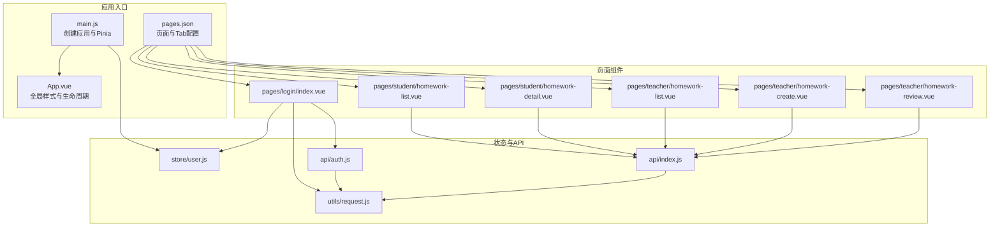
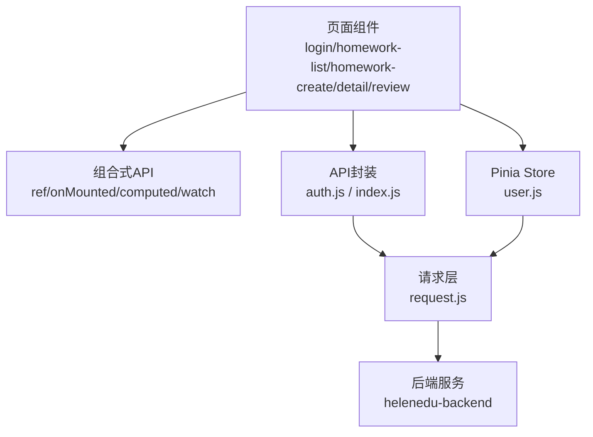
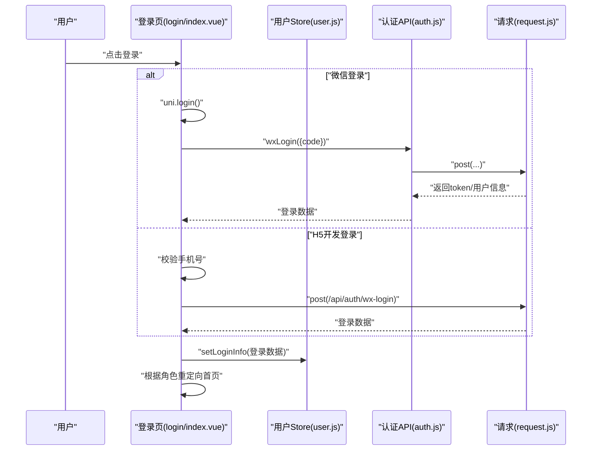
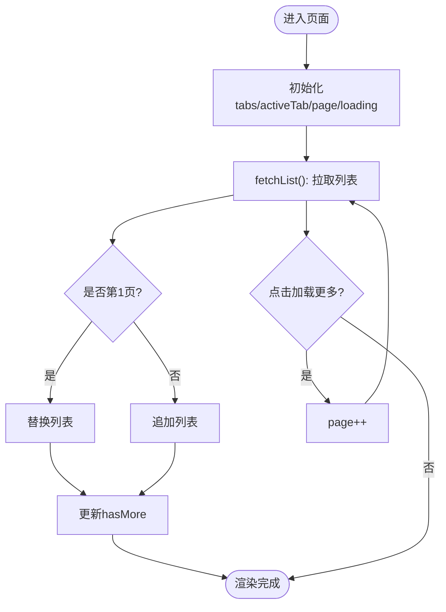
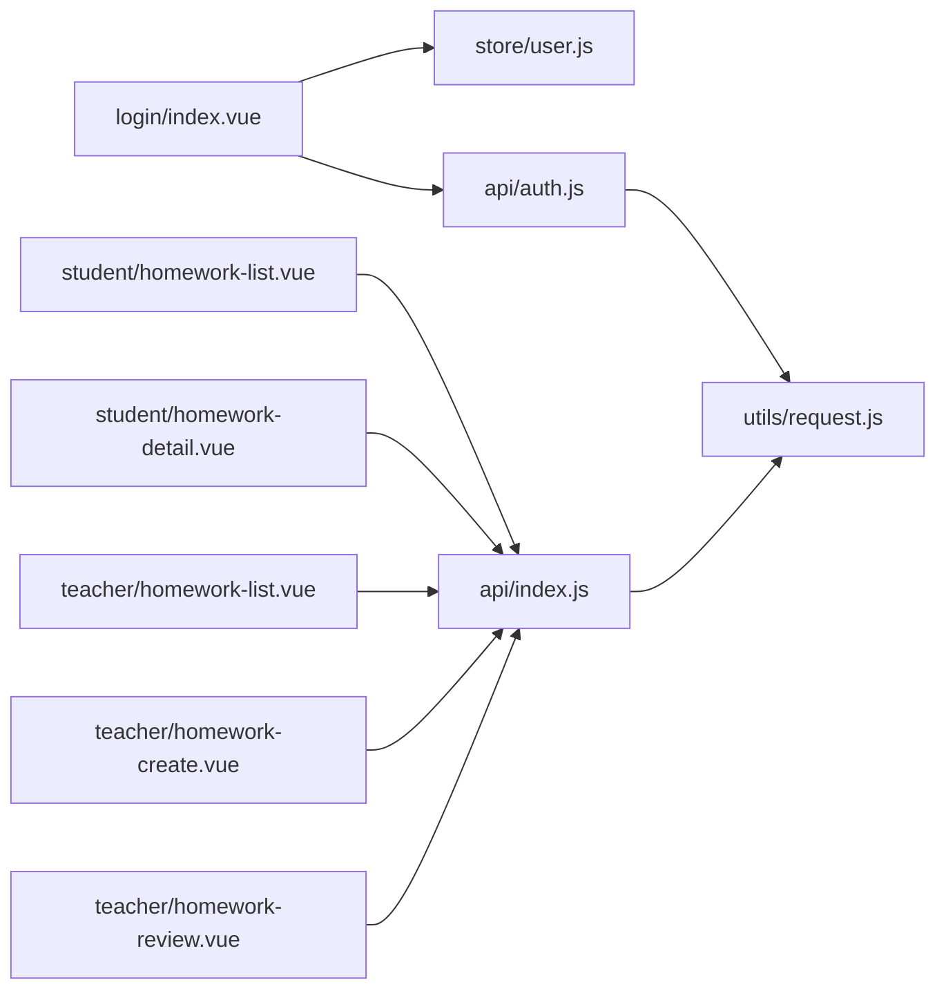

# 组件架构

<cite>
**本文引用的文件**
- [App.vue](file://helenedu-frontend/src/App.vue)
- [main.js](file://helenedu-frontend/src/main.js)
- [pages.json](file://helenedu-frontend/src/pages.json)
- [package.json](file://helenedu-frontend/package.json)
- [login/index.vue](file://helenedu-frontend/src/pages/login/index.vue)
- [student/homework-list.vue](file://helenedu-frontend/src/pages/student/homework-list.vue)
- [teacher/homework-create.vue](file://helenedu-frontend/src/pages/teacher/homework-create.vue)
- [student/homework-detail.vue](file://helenedu-frontend/src/pages/student/homework-detail.vue)
- [teacher/homework-list.vue](file://helenedu-frontend/src/pages/teacher/homework-list.vue)
- [teacher/homework-review.vue](file://helenedu-frontend/src/pages/teacher/homework-review.vue)
- [user.js](file://helenedu-frontend/src/store/user.js)
- [auth.js](file://helenedu-frontend/src/api/auth.js)
- [index.js](file://helenedu-frontend/src/api/index.js)
- [request.js](file://helenedu-frontend/src/utils/request.js)
- [vite.config.js](file://helenedu-frontend/vite.config.js)
</cite>

## 目录
1. [简介](#简介)
2. [项目结构](#项目结构)
3. [核心组件](#核心组件)
4. [架构总览](#架构总览)
5. [组件详解](#组件详解)
6. [依赖关系分析](#依赖关系分析)
7. [性能与优化](#性能与优化)
8. [测试与调试](#测试与调试)
9. [结论](#结论)
10. [附录](#附录)

## 简介
本文件系统性梳理 HelenEdu 的前端组件架构，围绕 Vue 3 + UniApp 的技术栈，结合脚手架提供的页面组件，深入解析组件化设计与实现要点，涵盖组件定义、响应式数据、事件处理、条件渲染、样式组织、页面路由与导航、状态管理、API 调用与错误处理、以及性能优化与测试调试建议。文档以登录页、作业列表、作业创建等典型页面为例，总结页面组件的设计模式，并给出组件间通信、复用策略与最佳实践。

## 项目结构
前端采用 UniApp 多端统一框架，页面在 pages 目录下按角色分层组织，全局样式与应用生命周期在 App.vue 中集中管理，状态通过 Pinia Store 管理，API 请求封装在 utils/request.js 中，页面路由与 TabBar 在 pages.json 中声明。

图示来源
- [main.js:1-11](file://helenedu-frontend/src/main.js#L1-L11)
- [App.vue:1-104](file://helenedu-frontend/src/App.vue#L1-L104)
- [pages.json:1-112](file://helenedu-frontend/src/pages.json#L1-L112)
- [login/index.vue:1-194](file://helenedu-frontend/src/pages/login/index.vue#L1-L194)
- [student/homework-list.vue:1-197](file://helenedu-frontend/src/pages/student/homework-list.vue#L1-L197)
- [teacher/homework-list.vue:1-85](file://helenedu-frontend/src/pages/teacher/homework-list.vue#L1-L85)
- [teacher/homework-create.vue:1-89](file://helenedu-frontend/src/pages/teacher/homework-create.vue#L1-L89)
- [student/homework-detail.vue:1-241](file://helenedu-frontend/src/pages/student/homework-detail.vue#L1-L241)
- [teacher/homework-review.vue:1-158](file://helenedu-frontend/src/pages/teacher/homework-review.vue#L1-L158)
- [user.js:1-62](file://helenedu-frontend/src/store/user.js#L1-L62)
- [auth.js:1-8](file://helenedu-frontend/src/api/auth.js#L1-L8)
- [index.js:1-50](file://helenedu-frontend/src/api/index.js#L1-L50)
- [request.js:1-83](file://helenedu-frontend/src/utils/request.js#L1-L83)

章节来源
- [main.js:1-11](file://helenedu-frontend/src/main.js#L1-L11)
- [App.vue:1-104](file://helenedu-frontend/src/App.vue#L1-L104)
- [pages.json:1-112](file://helenedu-frontend/src/pages.json#L1-L112)

## 核心组件
- 应用入口与状态
  - 应用创建与插件安装：在入口文件中创建应用实例并挂载 Pinia。
  - 全局样式与通用类：App.vue 提供全局样式与通用卡片、按钮、标签、列表、空状态等样式。
  - 页面路由与 TabBar：pages.json 声明所有页面与导航栏、TabBar 配置。
- 页面组件
  - 登录页：集成微信登录与 H5 开发模式登录，根据角色重定向到不同首页。
  - 学生作业列表：支持多 Tab 筛选、分页加载、状态标签映射与格式化显示。
  - 教师作业列表：展示作业状态、统计与跳转到批改页。
  - 作业创建：收集表单数据、日期选择、提交并返回上一页。
  - 作业详情：展示作业信息、附件预览、根据状态显示批改结果。
  - 作业批改：按状态筛选、弹窗批改、评分与评语、通过/退回操作。
- 状态管理
  - 用户 Store：存储 token、用户信息、登录态判断、角色名与首页路径计算、登出。
- API 与请求
  - API 汇总：按业务模块导出接口方法。
  - 请求封装：统一封装 uni.request，处理鉴权头、401 跳转、业务状态码与错误提示、文件上传。

章节来源
- [main.js:1-11](file://helenedu-frontend/src/main.js#L1-L11)
- [App.vue:1-104](file://helenedu-frontend/src/App.vue#L1-L104)
- [pages.json:1-112](file://helenedu-frontend/src/pages.json#L1-L112)
- [user.js:1-62](file://helenedu-frontend/src/store/user.js#L1-L62)
- [auth.js:1-8](file://helenedu-frontend/src/api/auth.js#L1-L8)
- [index.js:1-50](file://helenedu-frontend/src/api/index.js#L1-L50)
- [request.js:1-83](file://helenedu-frontend/src/utils/request.js#L1-L83)

## 架构总览
整体采用“页面组件 + 组合式 API + Pinia + 统一请求”的分层架构。页面组件负责视图与交互；组合式 API 管理本地状态；Pinia 管理用户会话与全局状态；API 层对后端接口进行薄封装；请求层统一处理鉴权与错误。

图示来源
- [login/index.vue:1-194](file://helenedu-frontend/src/pages/login/index.vue#L1-L194)
- [student/homework-list.vue:1-197](file://helenedu-frontend/src/pages/student/homework-list.vue#L1-L197)
- [teacher/homework-create.vue:1-89](file://helenedu-frontend/src/pages/teacher/homework-create.vue#L1-L89)
- [student/homework-detail.vue:1-241](file://helenedu-frontend/src/pages/student/homework-detail.vue#L1-L241)
- [teacher/homework-list.vue:1-85](file://helenedu-frontend/src/pages/teacher/homework-list.vue#L1-L85)
- [teacher/homework-review.vue:1-158](file://helenedu-frontend/src/pages/teacher/homework-review.vue#L1-L158)
- [user.js:1-62](file://helenedu-frontend/src/store/user.js#L1-L62)
- [auth.js:1-8](file://helenedu-frontend/src/api/auth.js#L1-L8)
- [index.js:1-50](file://helenedu-frontend/src/api/index.js#L1-L50)
- [request.js:1-83](file://helenedu-frontend/src/utils/request.js#L1-L83)

## 组件详解

### 登录页组件（登录流程）
- 设计要点
  - 条件编译：区分小程序与 H5 的登录入口。
  - 双登录路径：微信登录与 H5 开发模式登录。
  - 角色重定向：根据登录返回的角色值跳转至不同首页。
- 关键流程
  - 微信登录：调用 uni.login 获取 code，再调用后端接口换取 token 与用户信息，写入 Store 并跳转。
  - H5 登录：校验手机号长度，构造开发用参数调用后端接口，写入 Store 并跳转。
- 错误处理
  - 登录失败时提示 Toast。
  - 请求失败时统一 Toast 提示。

图示来源
- [login/index.vue:38-92](file://helenedu-frontend/src/pages/login/index.vue#L38-L92)
- [user.js:8-31](file://helenedu-frontend/src/store/user.js#L8-L31)
- [auth.js:4](file://helenedu-frontend/src/api/auth.js#L4)
- [request.js:7-44](file://helenedu-frontend/src/utils/request.js#L7-L44)

章节来源
- [login/index.vue:1-194](file://helenedu-frontend/src/pages/login/index.vue#L1-L194)
- [user.js:1-62](file://helenedu-frontend/src/store/user.js#L1-L62)
- [auth.js:1-8](file://helenedu-frontend/src/api/auth.js#L1-L8)
- [request.js:1-83](file://helenedu-frontend/src/utils/request.js#L1-L83)

### 学生作业列表组件（分页与筛选）
- 设计要点
  - Tab 切换：全部/待完成/已提交/已批改。
  - 分页加载：滚动触底触发下一页，避免重复请求。
  - 状态映射：根据 mySubmitStatus 显示不同标签文本与样式。
  - 时间格式化：本地格式化截止时间。
- 关键逻辑
  - 切换 Tab 重置页码与列表，重新拉取。
  - 加载更多时页码自增并追加数据。
  - 点击条目跳转详情页。

图示来源
- [student/homework-list.vue:53-127](file://helenedu-frontend/src/pages/student/homework-list.vue#L53-L127)

章节来源
- [student/homework-list.vue:1-197](file://helenedu-frontend/src/pages/student/homework-list.vue#L1-L197)

### 教师作业列表组件（展示与跳转）
- 设计要点
  - 从路由参数读取班级信息，动态设置导航标题。
  - 展示作业状态、提交统计与创建时间。
  - 提供“布置作业”入口，跳转到创建页并携带 classId。
- 关键逻辑
  - onMounted 读取 classId/className，拉取作业列表。
  - 跳转到批改页时携带 homeworkId。

章节来源
- [teacher/homework-list.vue:1-85](file://helenedu-frontend/src/pages/teacher/homework-list.vue#L1-L85)

### 作业创建组件（表单与提交）
- 设计要点
  - 表单字段：标题、内容、科目、截止日期。
  - 日期选择器：picker 绑定日期字符串。
  - 参数组装：从路由参数读取 classId，拼装 deadline 字符串。
  - 提交保护：防止重复提交，成功后 Toast 并返回上一页。
- 关键逻辑
  - onMounted 读取 classId。
  - 提交前校验标题必填。
  - 成功后 navigateBack。

章节来源
- [teacher/homework-create.vue:1-89](file://helenedu-frontend/src/pages/teacher/homework-create.vue#L1-L89)

### 作业详情组件（附件与批改结果）
- 设计要点
  - 详情展示：标题、班级、科目、教师、截止时间、内容、附件。
  - 批改结果：当状态为已批改时，额外拉取提交详情并展示分数与评语。
  - 操作区：根据状态显示“提交/重新提交”或“已提交”提示。
  - 附件预览：点击缩略图全屏预览。
- 关键逻辑
  - onMounted 从路由参数读取 homeworkId。
  - 拉取详情，若已批改则拉取提交详情。
  - 跳转提交页或预览附件。

章节来源
- [student/homework-detail.vue:1-241](file://helenedu-frontend/src/pages/student/homework-detail.vue#L1-L241)

### 作业批改组件（弹窗与批量操作）
- 设计要点
  - Tab 筛选：全部/待批改/已批改/已退回。
  - 弹窗批改：打开当前提交详情，输入分数与评语，执行通过/退回。
  - 评分校验：通过前必须填写分数。
  - 刷新：操作成功后关闭弹窗并刷新列表。
- 关键逻辑
  - onMounted 读取 homeworkId。
  - 按状态过滤提交列表。
  - 审核通过/退回分别调用 review 接口。

章节来源
- [teacher/homework-review.vue:1-158](file://helenedu-frontend/src/pages/teacher/homework-review.vue#L1-L158)

## 依赖关系分析
- 组件与状态
  - 登录页依赖用户 Store 写入登录信息，并根据角色重定向。
  - 作业详情与批改页依赖 API 层获取详情与提交记录。
- 组件与 API
  - 所有页面组件通过 API 汇总文件调用后端接口。
  - API 文件基于请求封装统一处理 Header 与错误。
- 请求层
  - request.js 统一注入 Authorization 头，处理 401 自动登出，业务状态码与 Toast 提示。

图示来源
- [login/index.vue:40-42](file://helenedu-frontend/src/pages/login/index.vue#L40-L42)
- [user.js:1-62](file://helenedu-frontend/src/store/user.js#L1-L62)
- [auth.js:1-8](file://helenedu-frontend/src/api/auth.js#L1-L8)
- [index.js:1-50](file://helenedu-frontend/src/api/index.js#L1-L50)
- [request.js:1-83](file://helenedu-frontend/src/utils/request.js#L1-L83)

章节来源
- [index.js:1-50](file://helenedu-frontend/src/api/index.js#L1-L50)
- [request.js:1-83](file://helenedu-frontend/src/utils/request.js#L1-L83)

## 性能与优化
- 渲染优化
  - 列表渲染使用 v-for + key，避免不必要的重排。
  - 条件渲染与 v-if 控制复杂区域（如批改弹窗），减少初始渲染负担。
- 分页与懒加载
  - 学生作业列表采用分页加载，避免一次性渲染大量数据。
  - 触底加载时设置 loading 标志，防止重复请求。
- 缓存策略
  - 使用本地存储缓存 token 与用户信息，减少重复登录成本。
  - 对于静态资源与图片，建议在后端开启缓存策略（由后端配置决定）。
- 请求优化
  - 统一注入 Authorization 头，避免每个接口重复处理。
  - 401 自动清空缓存并跳转登录，避免无效请求堆积。
- 构建与运行
  - 使用 Vite 插件构建，提升开发体验与打包效率。
  - 通过 pages.json 配置 TabBar，减少重复导航代码。

章节来源
- [student/homework-list.vue:78-103](file://helenedu-frontend/src/pages/student/homework-list.vue#L78-L103)
- [request.js:9-28](file://helenedu-frontend/src/utils/request.js#L9-L28)
- [user.js:5-31](file://helenedu-frontend/src/store/user.js#L5-L31)
- [vite.config.js:1-7](file://helenedu-frontend/vite.config.js#L1-L7)

## 测试与调试
- 单元测试与组件测试
  - 建议为组合式函数（如状态映射、格式化函数）编写单元测试，验证输入输出。
  - 对页面组件的关键流程（如登录、提交、分页）编写端到端测试，覆盖主要分支。
- 调试技巧
  - 使用浏览器/开发者工具检查网络请求与响应，关注 401 与业务错误码。
  - 在 request.js 中断点观察 Header 注入与错误处理分支。
  - 对复杂交互（如批改弹窗）使用日志辅助定位问题。
- 常见问题排查
  - 登录后无法跳转：检查角色映射与重定向逻辑。
  - 列表不刷新：确认分页逻辑与 hasMore 更新。
  - 附件无法预览：检查 attachmentUrls 与 uni.previewImage 调用。

章节来源
- [request.js:7-44](file://helenedu-frontend/src/utils/request.js#L7-L44)
- [teacher/homework-review.vue:94-122](file://helenedu-frontend/src/pages/teacher/homework-review.vue#L94-L122)

## 结论
HelenEdu 前端采用清晰的分层架构：页面组件 + 组合式 API + Pinia + 统一请求，配合 pages.json 的路由与 Tab 配置，实现了登录、作业管理、批改等核心场景的组件化落地。通过合理的状态管理、API 封装与错误处理，保证了用户体验与可维护性。后续可在组件复用、测试体系与性能监控方面进一步完善。

## 附录
- 技术栈
  - Vue 3 + 组合式 API
  - Pinia 状态管理
  - UniApp 多端统一
  - Vite 构建
- 相关文件
  - [package.json:1-28](file://helenedu-frontend/package.json#L1-L28)
  - [vite.config.js:1-7](file://helenedu-frontend/vite.config.js#L1-L7)