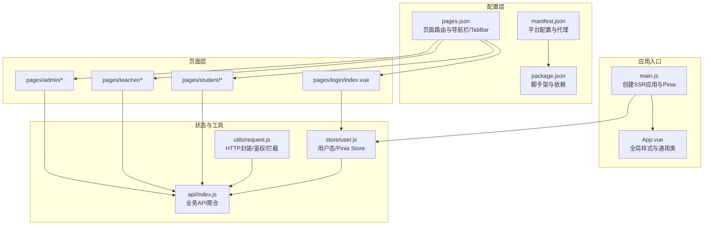
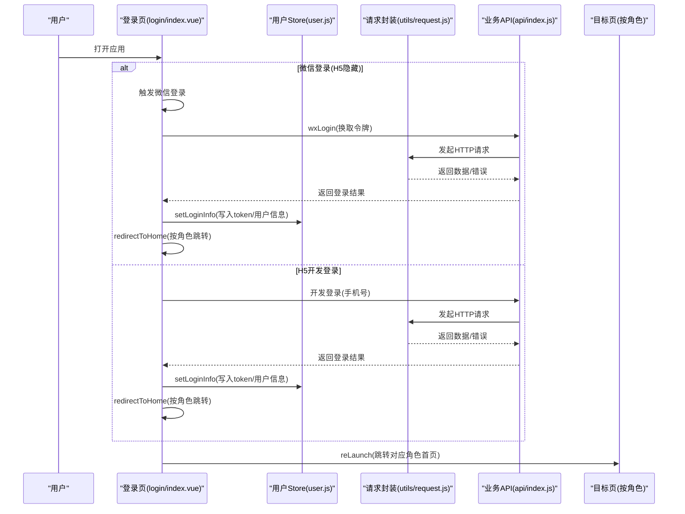
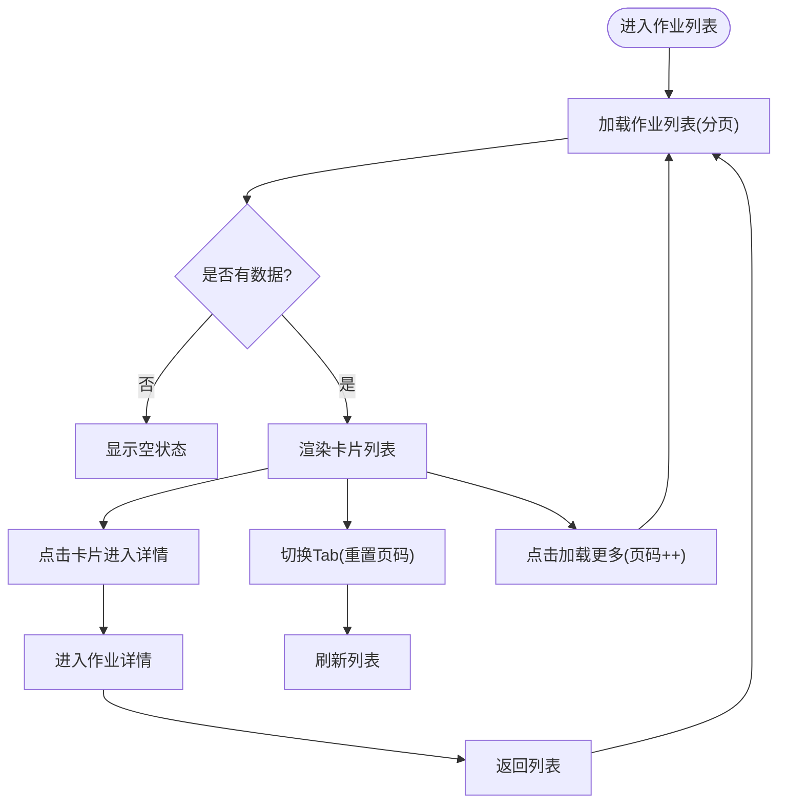
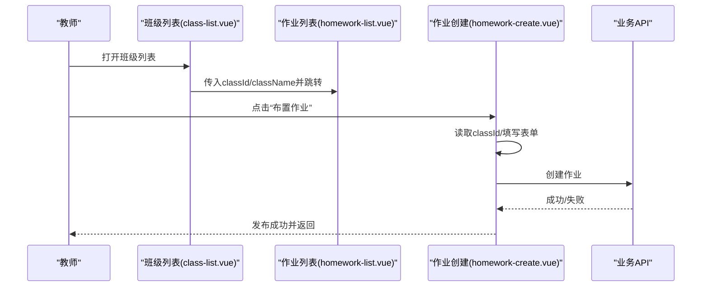
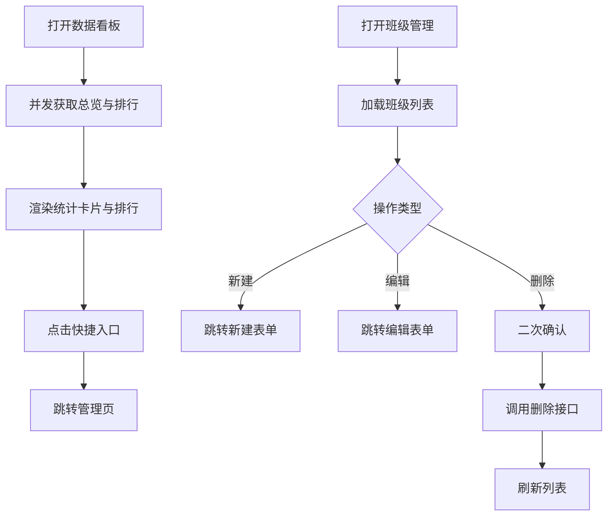
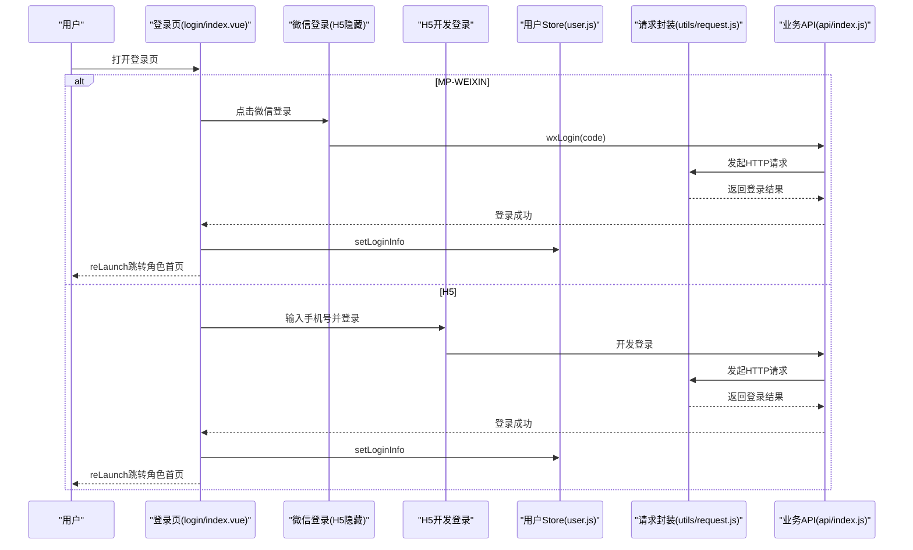
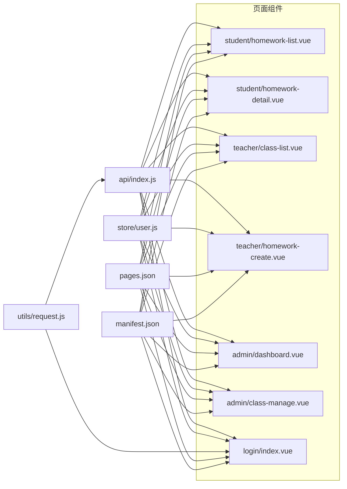

# 页面设计

<cite>
**本文引用的文件**
- [main.js](file://helenedu-frontend/src/main.js)
- [App.vue](file://helenedu-frontend/src/App.vue)
- [pages.json](file://helenedu-frontend/src/pages.json)
- [manifest.json](file://helenedu-frontend/src/manifest.json)
- [package.json](file://helenedu-frontend/src/package.json)
- [user.js](file://helenedu-frontend/src/store/user.js)
- [request.js](file://helenedu-frontend/src/utils/request.js)
- [index.js](file://helenedu-frontend/src/api/index.js)
- [login/index.vue](file://helenedu-frontend/src/pages/login/index.vue)
- [student/homework-list.vue](file://helenedu-frontend/src/pages/student/homework-list.vue)
- [student/homework-detail.vue](file://helenedu-frontend/src/pages/student/homework-detail.vue)
- [teacher/class-list.vue](file://helenedu-frontend/src/pages/teacher/class-list.vue)
- [teacher/homework-create.vue](file://helenedu-frontend/src/pages/teacher/homework-create.vue)
- [admin/dashboard.vue](file://helenedu-frontend/src/pages/admin/dashboard.vue)
- [admin/class-manage.vue](file://helenedu-frontend/src/pages/admin/class-manage.vue)
</cite>

## 目录
1. [引言](#引言)
2. [项目结构](#项目结构)
3. [核心组件](#核心组件)
4. [架构总览](#架构总览)
5. [详细组件分析](#详细组件分析)
6. [依赖关系分析](#依赖关系分析)
7. [性能考虑](#性能考虑)
8. [故障排查指南](#故障排查指南)
9. [结论](#结论)
10. [附录](#附录)

## 引言
本文件面向HelenEdu页面设计与实现，围绕基于Vue 3 + UniApp的多端应用，系统梳理单文件组件(.vue)的结构与编写规范，深入解析三类角色页面的设计思路与交互流程：学生端(作业列表、作业详情、预习资料等)、教师端(班级列表、布置作业、作业批改等)、管理员端(数据看板、班级管理、人员管理等)。同时说明页面布局设计、组件复用策略、样式管理方案，并解释UniApp多端适配的实现方式与注意事项，最后提供性能优化技巧与用户体验设计原则。

## 项目结构
前端采用UniApp 3 + Vue 3 + Pinia架构，通过manifest.json与pages.json统一声明应用元信息、路由与tabBar配置；页面按角色分目录组织，使用全局App.vue统一注入基础样式与通用类名，通过store/user.js集中管理用户态与角色跳转逻辑，通过utils/request.js封装HTTP请求与鉴权头，通过api/index.js聚合业务API。

**图表来源**
- [main.js:1-11](file://helenedu-frontend/src/main.js#L1-L11)
- [App.vue:1-104](file://helenedu-frontend/src/App.vue#L1-L104)
- [pages.json:1-112](file://helenedu-frontend/src/pages.json#L1-L112)
- [manifest.json:1-34](file://helenedu-frontend/src/manifest.json#L1-L34)
- [package.json:1-28](file://helenedu-frontend/src/package.json#L1-L28)
- [user.js:1-62](file://helenedu-frontend/src/store/user.js#L1-L62)
- [request.js:1-83](file://helenedu-frontend/src/utils/request.js#L1-L83)
- [index.js:1-50](file://helenedu-frontend/src/api/index.js#L1-L50)

**章节来源**
- [main.js:1-11](file://helenedu-frontend/src/main.js#L1-L11)
- [App.vue:1-104](file://helenedu-frontend/src/App.vue#L1-L104)
- [pages.json:1-112](file://helenedu-frontend/src/pages.json#L1-L112)
- [manifest.json:1-34](file://helenedu-frontend/src/manifest.json#L1-L34)
- [package.json:1-28](file://helenedu-frontend/src/package.json#L1-L28)

## 核心组件
- 应用入口与状态
  - main.js负责创建SSR应用实例与Pinia插件，确保全局状态可用。
  - App.vue提供全局样式与通用类名(card、btn-primary、tag、empty等)，统一视觉基线。
- 路由与TabBar
  - pages.json集中声明所有页面、导航栏标题、全局样式以及TabBar配置，支持按角色展示不同Tab。
- 平台与构建
  - manifest.json声明H5代理、微信小程序参数、组件化开关等；package.json提供多端开发与构建脚本。
- 用户态与权限
  - store/user.js维护token、用户信息、角色名与首页跳转逻辑，提供登录信息持久化与登出重定向。
- 请求与鉴权
  - utils/request.js统一封装uni.request，自动附加Authorization头，处理401跳转登录，统一错误提示。
- 业务API
  - api/index.js对后端接口进行聚合，按模块划分，便于页面直接调用。

**章节来源**
- [main.js:1-11](file://helenedu-frontend/src/main.js#L1-L11)
- [App.vue:15-103](file://helenedu-frontend/src/App.vue#L15-L103)
- [pages.json:79-111](file://helenedu-frontend/src/pages.json#L79-L111)
- [manifest.json:8-32](file://helenedu-frontend/src/manifest.json#L8-L32)
- [package.json:6-26](file://helenedu-frontend/src/package.json#L6-L26)
- [user.js:4-61](file://helenedu-frontend/src/store/user.js#L4-L61)
- [request.js:7-44](file://helenedu-frontend/src/utils/request.js#L7-L44)
- [index.js:3-50](file://helenedu-frontend/src/api/index.js#L3-L50)

## 架构总览
下图展示了从登录到各角色首页的典型流程，以及页面间的数据流与鉴权链路。

**图表来源**
- [login/index.vue:48-92](file://helenedu-frontend/src/pages/login/index.vue#L48-L92)
- [user.js:8-31](file://helenedu-frontend/src/store/user.js#L8-L31)
- [request.js:7-44](file://helenedu-frontend/src/utils/request.js#L7-L44)
- [index.js:4-13](file://helenedu-frontend/src/api/index.js#L4-L13)

## 详细组件分析

### 学生端页面设计
- 作业列表(student/homework-list.vue)
  - 设计要点：顶部Tab切换(全部/待完成/已提交/已批改)，列表卡片展示作业标题、班级、科目、截止时间、教师、状态标签；支持分页加载更多；空状态提示。
  - 关键交互：点击卡片进入详情；Tab切换重置页码并刷新列表；格式化截止时间显示。
  - 复用策略：使用全局card、tag、empty类，减少重复样式。
- 作业详情(student/homework-detail.vue)
  - 设计要点：详情头部(标题+状态标签)、元信息(班级/科目/教师/截止时间)、作业内容、附件缩略图、批改结果(分数与评语)、提交/重新提交按钮。
  - 关键交互：点击附件预览图片；根据状态控制操作按钮；已批改时拉取提交详情。
  - 复用策略：使用全局card、tag、btn-primary类；详情区域采用统一的section-title与内容排版。
- 预习资料与个人中心
  - 预习列表(student/preview-list.vue)：以列表形式展示预习资料，支持查看与下载。
  - 个人中心(student/profile.vue)：展示用户信息与退出登录。

**图表来源**
- [student/homework-list.vue:78-127](file://helenedu-frontend/src/pages/student/homework-list.vue#L78-L127)
- [student/homework-detail.vue:96-110](file://helenedu-frontend/src/pages/student/homework-detail.vue#L96-L110)

**章节来源**
- [student/homework-list.vue:1-197](file://helenedu-frontend/src/pages/student/homework-list.vue#L1-L197)
- [student/homework-detail.vue:1-241](file://helenedu-frontend/src/pages/student/homework-detail.vue#L1-L241)

### 教师端页面设计
- 班级列表(teacher/class-list.vue)
  - 设计要点：展示教师所带班级，包含班级名称、年级、学生/教师人数；点击进入作业管理。
  - 关键交互：拉取“我的班级”，跳转至作业列表并传递班级参数。
- 作业创建(teacher/homework-create.vue)
  - 设计要点：表单字段(标题、内容、科目、截止日期)；日期选择器；提交按钮禁用状态；发布成功后返回上一页。
  - 关键交互：从页面栈读取classId；校验必填；构造请求体并调用创建接口。
- 作业管理与批改
  - 作业列表(teacher/homework-list.vue)：按班级筛选作业，查看提交情况。
  - 作业批改(teacher/homework-review.vue)：查看提交详情，打分与评语，完成批改。

**图表来源**
- [teacher/class-list.vue:35-37](file://helenedu-frontend/src/pages/teacher/class-list.vue#L35-L37)
- [teacher/homework-create.vue:54-78](file://helenedu-frontend/src/pages/teacher/homework-create.vue#L54-L78)
- [index.js:7-12](file://helenedu-frontend/src/api/index.js#L7-L12)

**章节来源**
- [teacher/class-list.vue:1-48](file://helenedu-frontend/src/pages/teacher/class-list.vue#L1-L48)
- [teacher/homework-create.vue:1-89](file://helenedu-frontend/src/pages/teacher/homework-create.vue#L1-L89)

### 管理员端页面设计
- 数据看板(admin/dashboard.vue)
  - 设计要点：数据总览(班级数/学生数/教师数/本周作业/提交率/平均分)、快捷入口(班级管理/人员管理)、班级提交率排行(进度条)。
  - 关键交互：并发拉取总览与排行；点击快捷入口跳转管理页。
- 班级管理(admin/class-manage.vue)
  - 设计要点：新建/编辑/删除班级；列表展示班级信息与人数；删除前二次确认。
  - 关键交互：分页加载列表；删除成功后刷新。
- 人员管理与个人中心
  - 人员管理(admin/user-manage.vue)：分页查询用户、启用/禁用、编辑。
  - 编辑人员(admin/user-form.vue)：新增/修改用户信息。
  - 个人中心(admin/profile.vue)：展示与更新管理员信息。

**图表来源**
- [admin/dashboard.vue:79-95](file://helenedu-frontend/src/pages/admin/dashboard.vue#L79-L95)
- [admin/class-manage.vue:37-54](file://helenedu-frontend/src/pages/admin/class-manage.vue#L37-L54)
- [index.js:24-36](file://helenedu-frontend/src/api/index.js#L24-L36)

**章节来源**
- [admin/dashboard.vue:1-122](file://helenedu-frontend/src/pages/admin/dashboard.vue#L1-L122)
- [admin/class-manage.vue:1-66](file://helenedu-frontend/src/pages/admin/class-manage.vue#L1-L66)

### 登录页与多端适配
- 登录页(login/index.vue)
  - 设计要点：顶部品牌信息、中间登录区、底部协议提示；支持微信一键登录(H5隐藏)与H5开发登录(手机号)。
  - 多端适配：通过条件编译指令区分MP-WEIXIN与H5端，分别渲染对应登录入口；H5端提供手机号开发登录。
  - 流程：微信登录成功或H5开发登录成功后，写入用户信息，按角色reLaunch跳转首页。
- 多端配置
  - manifest.json中配置H5路由模式为hash、本地代理到后端8080端口；微信小程序开启组件化与必要设置。
  - pages.json统一声明导航栏与TabBar，确保不同端一致的导航体验。

**图表来源**
- [login/index.vue:48-92](file://helenedu-frontend/src/pages/login/index.vue#L48-L92)
- [manifest.json:19-31](file://helenedu-frontend/src/manifest.json#L19-L31)
- [pages.json:5-8](file://helenedu-frontend/src/pages.json#L5-L8)

**章节来源**
- [login/index.vue:1-194](file://helenedu-frontend/src/pages/login/index.vue#L1-L194)
- [manifest.json:8-32](file://helenedu-frontend/src/manifest.json#L8-L32)
- [pages.json:5-8](file://helenedu-frontend/src/pages.json#L5-L8)

## 依赖关系分析
- 组件耦合与职责
  - 页面组件仅负责UI与交互，数据通过api/index.js调用，避免直接依赖具体后端地址。
  - store/user.js集中管理用户态，避免在多个页面重复读写Storage。
  - utils/request.js统一处理鉴权头与错误提示，降低页面复杂度。
- 外部依赖
  - @dcloudio/uni-app、@dcloudio/uni-components、vue、pinia等作为核心运行时与状态库。
  - Vite作为构建工具，配合uni-vite插件实现多端编译。

**图表来源**
- [index.js:3-50](file://helenedu-frontend/src/api/index.js#L3-L50)
- [user.js:4-61](file://helenedu-frontend/src/store/user.js#L4-L61)
- [request.js:7-44](file://helenedu-frontend/src/utils/request.js#L7-L44)
- [pages.json:2-78](file://helenedu-frontend/src/pages.json#L2-L78)
- [manifest.json:8-32](file://helenedu-frontend/src/manifest.json#L8-L32)

**章节来源**
- [index.js:3-50](file://helenedu-frontend/src/api/index.js#L3-L50)
- [user.js:4-61](file://helenedu-frontend/src/store/user.js#L4-L61)
- [request.js:7-44](file://helenedu-frontend/src/utils/request.js#L7-L44)
- [pages.json:2-78](file://helenedu-frontend/src/pages.json#L2-L78)
- [manifest.json:8-32](file://helenedu-frontend/src/manifest.json#L8-L32)

## 性能考虑
- 列表渲染与懒加载
  - 使用分页加载与“加载更多”按钮，避免一次性渲染大量数据；在切换Tab时重置页码并清空列表，防止重复拼接。
- 图片与附件
  - 详情页附件采用缩略图展示，点击预览大图；建议对图片资源进行压缩与CDN加速。
- 网络请求
  - 统一在utils/request.js中处理鉴权头与错误提示，避免重复代码；对并发请求使用Promise.all提升首屏性能。
- 样式与体积
  - 全局样式集中在App.vue，减少重复CSS；scoped样式仅用于页面内样式隔离，避免过度使用深层选择器。
- 多端差异
  - 使用条件编译(H5/MP-WEIXIN)屏蔽平台差异；H5端使用hash路由与本地代理，减少跨域问题。

[本节为通用指导，无需列出章节来源]

## 故障排查指南
- 登录失败/401未授权
  - 现象：登录后立即被重定向至登录页。
  - 排查：检查后端返回code是否为200；确认utils/request.js中401分支是否触发清理Storage并跳转登录。
- 网络错误/Toast提示
  - 现象：请求失败弹出“网络错误”提示。
  - 排查：检查manifest.json中的H5代理是否指向正确后端地址；确认utils/request.js中fail分支是否触发提示。
- 页面空白/样式异常
  - 现象：页面无内容或样式错乱。
  - 排查：确认pages.json中页面路径与导航栏配置；检查App.vue全局样式是否覆盖了页面scoped样式；确认manifest.json transformPx配置与rpx单位使用一致性。
- 条件编译导致的功能缺失
  - 现象：H5端看不到微信登录入口。
  - 排查：确认login/index.vue中条件编译指令与H5端配置；确保H5端开发登录入口可用。

**章节来源**
- [request.js:21-44](file://helenedu-frontend/src/utils/request.js#L21-L44)
- [manifest.json:25-31](file://helenedu-frontend/src/manifest.json#L25-L31)
- [login/index.vue:14-29](file://helenedu-frontend/src/pages/login/index.vue#L14-L29)

## 结论
HelenEdu前端以UniApp 3 + Vue 3为基础，结合Pinia实现清晰的状态管理，通过统一的请求封装与API聚合，实现了跨端一致的页面体验。页面按角色分层设计，利用全局样式与通用组件类提升复用性与一致性。通过条件编译与多端配置，有效处理平台差异。建议后续进一步完善权限拦截、图片懒加载与缓存策略，持续优化首屏性能与交互流畅度。

[本节为总结性内容，无需列出章节来源]

## 附录
- 单文件组件(.vue)编写规范
  - 模板层：优先使用语义化标签与class命名，避免内联样式；合理拆分子组件，保持模板简洁。
  - 脚本层：使用Composition API与<script setup>；将副作用逻辑集中在onMounted等生命周期钩子；避免在组件外直接调用API。
  - 样式层：优先使用全局通用类(card、btn-primary、tag等)；页面内样式使用scoped并限定作用范围；避免深度选择器与!important。
- 页面布局与组件复用
  - 采用卡片(card)与标签(tag)等通用容器，统一间距与字体大小；TabBar按角色定制，减少跨角色切换成本。
- 多端适配清单
  - H5：hash路由、本地代理、条件编译隐藏微信登录；提供手机号开发登录。
  - 微信小程序：开启组件化、设置必要权限；注意平台组件差异与事件处理。
- 性能优化清单
  - 列表分页与虚拟滚动；图片懒加载与压缩；并发请求合并；缓存策略与Storage持久化。

[本节为通用指导，无需列出章节来源]