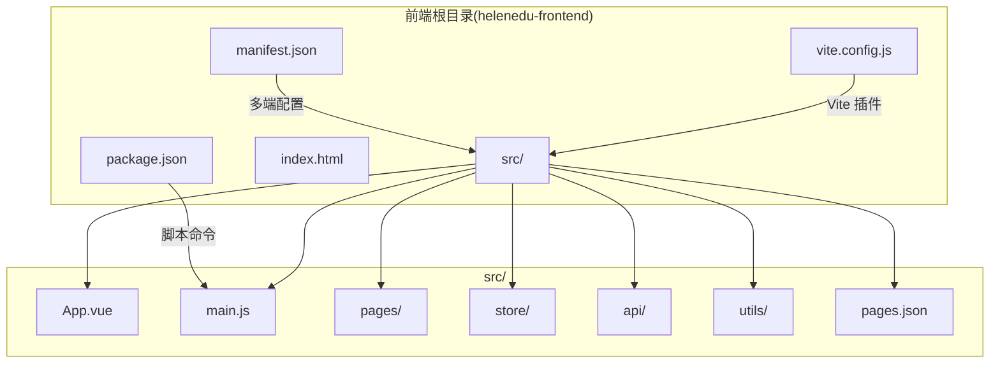
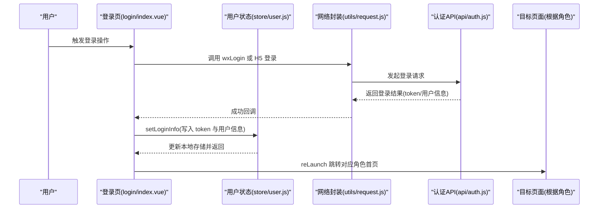
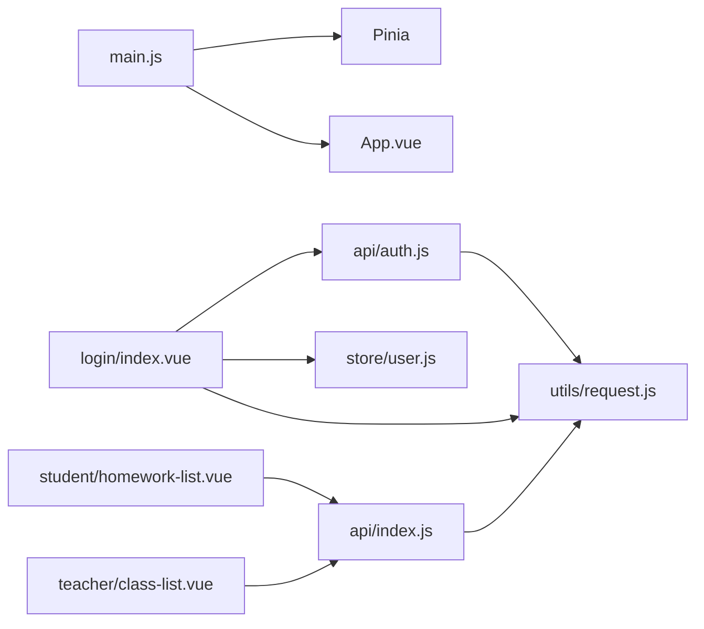

# 项目结构

<cite>
**本文引用的文件**
- [pages.json](file://helenedu-frontend/src/pages.json)
- [main.js](file://helenedu-frontend/src/main.js)
- [App.vue](file://helenedu-frontend/src/App.vue)
- [manifest.json](file://helenedu-frontend/src/manifest.json)
- [package.json](file://helenedu-frontend/package.json)
- [vite.config.js](file://helenedu-frontend/vite.config.js)
- [user.js](file://helenedu-frontend/src/store/user.js)
- [request.js](file://helenedu-frontend/src/utils/request.js)
- [api/index.js](file://helenedu-frontend/src/api/index.js)
- [api/auth.js](file://helenedu-frontend/src/api/auth.js)
- [login/index.vue](file://helenedu-frontend/src/pages/login/index.vue)
- [student/homework-list.vue](file://helenedu-frontend/src/pages/student/homework-list.vue)
- [teacher/class-list.vue](file://helenedu-frontend/src/pages/teacher/class-list.vue)
</cite>

## 目录

1. [简介](#简介)
2. [项目结构](#项目结构)
3. [核心组件](#核心组件)
4. [架构总览](#架构总览)
5. [详细组件分析](#详细组件分析)
6. [依赖关系分析](#依赖关系分析)
7. [性能考虑](#性能考虑)
8. [故障排查指南](#故障排查指南)
9. [结论](#结论)
10. [附录](#附录)

## 简介

本文件面向 HelenEdu 前端项目，系统性梳理基于 Vue 3 + UniApp 的项目目录组织与工程化配置，重点覆盖以下方面：
- src 目录下 pages 页面目录、store 状态管理目录、api 接口目录、utils 工具函数目录的职责与组织方式
- pages.json 路由配置文件的作用与配置规则（页面路由、tabBar、分包策略等）
- main.js 应用入口文件的初始化流程（Vue 实例创建、Pinia 集成、插件配置）
- package.json 中的依赖管理与脚本命令
- vite.config.js 构建配置
- 目录命名规范与文件组织最佳实践

## 项目结构

HelenEdu 前端采用 UniApp 多端统一框架，使用 Vue 3 Composition API 与 Pinia 状态管理，通过 pages.json 统一声明页面路由与 tabBar，构建工具采用 Vite + @dcloudio/vite-plugin-uni。

图表来源
- [main.js:1-11](file://helenedu-frontend/src/main.js#L1-L11)
- [pages.json:1-112](file://helenedu-frontend/src/pages.json#L1-L112)
- [package.json:1-28](file://helenedu-frontend/package.json#L1-L28)
- [vite.config.js:1-7](file://helenedu-frontend/vite.config.js#L1-L7)
- [manifest.json:1-34](file://helenedu-frontend/src/manifest.json#L1-L34)

章节来源
- [main.js:1-11](file://helenedu-frontend/src/main.js#L1-L11)
- [pages.json:1-112](file://helenedu-frontend/src/pages.json#L1-L112)
- [package.json:1-28](file://helenedu-frontend/package.json#L1-L28)
- [vite.config.js:1-7](file://helenedu-frontend/vite.config.js#L1-L7)
- [manifest.json:1-34](file://helenedu-frontend/src/manifest.json#L1-L34)

## 核心组件

- 应用入口与初始化
  - main.js 负责创建 SSR 应用实例并挂载 Pinia；导出 createApp 工厂函数供 UniApp 平台调用。
  - App.vue 提供全局生命周期钩子与通用样式定义。
- 路由与页面
  - pages.json 统一声明页面路由、导航栏样式、全局样式与 tabBar。
- 状态管理
  - store/user.js 使用 Composition Store 定义用户登录态、角色信息与登出逻辑，并持久化到本地存储。
- API 与网络层
  - utils/request.js 封装 uni.request，统一处理鉴权头、响应状态码、错误提示与文件上传。
  - api/index.js 与 api/auth.js 对后端接口进行模块化封装，按业务域拆分。
- 页面实现
  - pages/login/index.vue 实现登录页，支持微信登录与 H5 开发模式登录。
  - pages/student/homework-list.vue 展示学生作业列表，含筛选与分页。
  - pages/teacher/class-list.vue 展示教师所带班级列表。

章节来源
- [main.js:1-11](file://helenedu-frontend/src/main.js#L1-L11)
- [App.vue:1-104](file://helenedu-frontend/src/App.vue#L1-L104)
- [user.js:1-62](file://helenedu-frontend/src/store/user.js#L1-L62)
- [request.js:1-83](file://helenedu-frontend/src/utils/request.js#L1-L83)
- [api/index.js:1-50](file://helenedu-frontend/src/api/index.js#L1-L50)
- [api/auth.js:1-8](file://helenedu-frontend/src/api/auth.js#L1-L8)
- [login/index.vue:1-194](file://helenedu-frontend/src/pages/login/index.vue#L1-L194)
- [student/homework-list.vue:1-197](file://helenedu-frontend/src/pages/student/homework-list.vue#L1-L197)
- [teacher/class-list.vue:1-48](file://helenedu-frontend/src/pages/teacher/class-list.vue#L1-L48)

## 架构总览

下面以“登录流程”为例，展示从页面到状态管理、API 封装与后端交互的完整链路。

图表来源
- [login/index.vue:47-92](file://helenedu-frontend/src/pages/login/index.vue#L47-L92)
- [user.js:8-31](file://helenedu-frontend/src/store/user.js#L8-L31)
- [request.js:7-44](file://helenedu-frontend/src/utils/request.js#L7-L44)
- [api/auth.js:4-7](file://helenedu-frontend/src/api/auth.js#L4-L7)

## 详细组件分析

### pages.json 路由与 tabBar 配置

- 页面声明
  - pages 数组中每个对象包含 path 与 style，用于声明页面路径与导航栏标题、自定义导航样式等。
- 全局样式
  - globalStyle 控制导航栏文字颜色、背景色、整体背景色等。
- tabBar
  - tabBar.list 定义底部导航项，包含 pagePath、text、图标路径与选中态图标路径。
  - tabBar 颜色、背景色、边框样式等统一配置。
- 分包策略
  - 当前 pages.json 未显式声明 subPackages/subDemands，因此默认为单包模式。如需优化首屏加载，可按角色或功能域拆分子包并在 manifest.json 中配置。

章节来源
- [pages.json:1-112](file://helenedu-frontend/src/pages.json#L1-L112)

### main.js 应用入口初始化

- 创建应用实例
  - 使用 createSSRApp(App) 创建应用根组件实例。
- Pinia 集成
  - 通过 createPinia() 创建状态管理实例，并调用 app.use(pinia) 完成注册。
- 导出工厂函数
  - 导出 createApp，供 UniApp 平台在不同运行时调用。

章节来源
- [main.js:1-11](file://helenedu-frontend/src/main.js#L1-L11)

### App.vue 全局样式与生命周期

- 生命周期钩子
  - onLaunch/onShow/onHide 提供应用生命周期日志输出，便于调试。
- 全局样式
  - 定义基础字体、字号、颜色与常用组件样式（容器、卡片、按钮、标签、列表、空状态等），确保跨页面一致性。

章节来源
- [App.vue:1-104](file://helenedu-frontend/src/App.vue#L1-L104)

### store/user.js 用户状态管理

- 数据模型
  - token：登录令牌
  - userInfo：用户基本信息（id、name、role、avatarUrl）
- 方法
  - setLoginInfo：写入 token 与 userInfo，并同步到本地存储
  - updateUserInfo：更新用户信息并持久化
  - logout：清除 token 与 userInfo，reLaunch 回到登录页
  - isLoggedIn/getRoleName/getHomePage：辅助判断登录态、角色名与首页路由
- 本地存储
  - 使用 uni.getStorageSync/uni.setStorageSync/uni.removeStorageSync 进行持久化

章节来源
- [user.js:1-62](file://helenedu-frontend/src/store/user.js#L1-L62)

### utils/request.js 网络请求封装

- 基础配置
  - BASE_URL：后端服务地址
- 请求拦截
  - 自动读取本地 token 并注入 Authorization 头
- 响应处理
  - 401：自动清理本地 token 与 userInfo，并 reLaunch 到登录页
  - 200 且 data.code==200：解析 data.data 返回
  - 其他：Toast 提示错误消息并 reject
  - fail：Toast 提示网络错误
- 便捷方法
  - get/post/put/del：对不同 HTTP 方法的封装
  - uploadFile：文件上传封装

章节来源
- [request.js:1-83](file://helenedu-frontend/src/utils/request.js#L1-L83)

### api/index.js 与 api/auth.js 接口模块

- api/index.js
  - 按业务域导出接口：作业、预习资料、班级、用户、数据看板等
  - 统一基于 utils/request 的 get/post/put/del
- api/auth.js
  - 认证相关：wxLogin、getUserInfo

章节来源
- [api/index.js:1-50](file://helenedu-frontend/src/api/index.js#L1-L50)
- [api/auth.js:1-8](file://helenedu-frontend/src/api/auth.js#L1-L8)

### 页面实现示例

- 登录页(login/index.vue)
  - 支持微信登录与 H5 开发模式登录
  - 登录成功后写入用户状态并跳转对应角色首页
- 学生作业列表(student/homework-list.vue)
  - 支持按状态筛选、分页加载、点击进入详情
- 教师班级列表(teacher/class-list.vue)
  - 展示教师所带班级，点击进入作业管理

章节来源
- [login/index.vue:1-194](file://helenedu-frontend/src/pages/login/index.vue#L1-L194)
- [student/homework-list.vue:1-197](file://helenedu-frontend/src/pages/student/homework-list.vue#L1-L197)
- [teacher/class-list.vue:1-48](file://helenedu-frontend/src/pages/teacher/class-list.vue#L1-L48)

## 依赖关系分析

图表来源
- [main.js:1-11](file://helenedu-frontend/src/main.js#L1-L11)
- [login/index.vue:38-92](file://helenedu-frontend/src/pages/login/index.vue#L38-L92)
- [student/homework-list.vue:53-127](file://helenedu-frontend/src/pages/student/homework-list.vue#L53-L127)
- [teacher/class-list.vue:21-39](file://helenedu-frontend/src/pages/teacher/class-list.vue#L21-L39)
- [api/index.js:1-50](file://helenedu-frontend/src/api/index.js#L1-L50)
- [api/auth.js:1-8](file://helenedu-frontend/src/api/auth.js#L1-L8)
- [request.js:1-83](file://helenedu-frontend/src/utils/request.js#L1-L83)
- [user.js:1-62](file://helenedu-frontend/src/store/user.js#L1-L62)

章节来源
- [main.js:1-11](file://helenedu-frontend/src/main.js#L1-L11)
- [login/index.vue:38-92](file://helenedu-frontend/src/pages/login/index.vue#L38-L92)
- [student/homework-list.vue:53-127](file://helenedu-frontend/src/pages/student/homework-list.vue#L53-L127)
- [teacher/class-list.vue:21-39](file://helenedu-frontend/src/pages/teacher/class-list.vue#L21-L39)
- [api/index.js:1-50](file://helenedu-frontend/src/api/index.js#L1-L50)
- [api/auth.js:1-8](file://helenedu-frontend/src/api/auth.js#L1-L8)
- [request.js:1-83](file://helenedu-frontend/src/utils/request.js#L1-L83)
- [user.js:1-62](file://helenedu-frontend/src/store/user.js#L1-L62)

## 性能考虑

- 页面懒加载与分包
  - 当前 pages.json 未启用分包，建议按角色或功能域拆分子包，减少首屏体积。
- 网络请求优化
  - 在 utils/request.js 中统一处理缓存与重试策略，避免重复请求。
- 图标与静态资源
  - tabBar 图标建议使用矢量或压缩后的 PNG，减小体积。
- 构建优化
  - 使用 Vite 的 @dcloudio/vite-plugin-uni 插件，结合生产环境构建参数提升打包效率。

## 故障排查指南

- 登录后无法跳转首页
  - 检查 store/user.js 的 getHomePage 与 pages.json 的 tabBar.pagePath 是否一致
  - 确认 login/index.vue 的 redirectToHome 逻辑与角色映射
- 401 未授权
  - utils/request.js 在 401 时会清理本地 token 并跳转登录页，确认后端 JWT 有效时间与刷新机制
- H5 开发代理
  - manifest.json.h5.devServer.proxy 将 /api 代理到后端 8080 端口，确认本地后端服务已启动
- 构建失败
  - 检查 package.json 脚本与依赖版本是否匹配，确保 @dcloudio/vite-plugin-uni 与 uni-app 版本兼容

章节来源
- [user.js:40-49](file://helenedu-frontend/src/store/user.js#L40-L49)
- [login/index.vue:84-92](file://helenedu-frontend/src/pages/login/index.vue#L84-L92)
- [request.js:20-28](file://helenedu-frontend/src/utils/request.js#L20-L28)
- [manifest.json:19-32](file://helenedu-frontend/src/manifest.json#L19-L32)
- [package.json:6-11](file://helenedu-frontend/package.json#L6-L11)

## 结论

本项目采用清晰的目录划分与模块化设计，pages.json 统一路由与 tabBar，main.js 与 App.vue 提供稳定的初始化与全局样式，Pinia 与 utils/request 形成简洁的状态与网络层。建议后续引入分包策略与更完善的错误处理与缓存机制，进一步提升性能与可维护性。

## 附录

### 目录命名规范与文件组织最佳实践

- 目录命名
  - pages：按角色/功能域分层，如 pages/student、pages/teacher、pages/admin
  - store：单一职责，如 store/user.js
  - api：按业务域拆分，如 api/index.js、api/auth.js
  - utils：通用工具，如 utils/request.js
- 文件命名
  - 页面文件使用语义化名称，如 homework-list.vue
  - 组件文件复用性强时可单独抽取为 .vue 单文件组件
- 路由与页面
  - 所有页面在 pages.json 中集中声明，避免遗漏
  - tabBar 项与页面路径保持一致，避免跳转异常
- 状态管理
  - Pinia 使用 Composition Store，将状态与方法聚合在一个文件内
  - 本地存储键名统一，避免冲突
- 网络层
  - 统一在 utils/request.js 中处理鉴权与错误提示
  - API 封装按业务域拆分，便于维护与测试
- 构建与脚本
  - package.json 脚本明确区分小程序与 H5 环境
  - vite.config.js 仅保留必要插件，避免冗余配置