# 业务服务层设计

<cite>
**本文档引用的文件**
- [AuthService.java](file://helenedu-backend/src/main/java/com/helen/eduedu/service/AuthService.java)
- [ClassService.java](file://helenedu-backend/src/main/java/com/helen/eduedu/service/ClassService.java)
- [UserService.java](file://helenedu-backend/src/main/java/com/helen/eduedu/service/UserService.java)
- [HomeworkService.java](file://helenedu-backend/src/main/java/com/helen/eduedu/service/HomeworkService.java)
- [PreviewMaterialService.java](file://helenedu-backend/src/main/java/com/helen/eduedu/service/PreviewMaterialService.java)
- [DashboardService.java](file://helenedu-backend/src/main/java/com/helen/eduedu/service/DashboardService.java)
- [FileUploadService.java](file://helenedu-backend/src/main/java/com/helen/eduedu/service/FileUploadService.java)
- [SysUserMapper.java](file://helenedu-backend/src/main/java/com/helen/eduedu/mapper/SysUserMapper.java)
- [SysUser.java](file://helenedu-backend/src/main/java/com/helen/eduedu/entity/SysUser.java)
- [LoginVO.java](file://helenedu-backend/src/main/java/com/helen/eduedu/vo/LoginVO.java)
- [RoleEnum.java](file://helenedu-backend/src/main/java/com/helen/eduedu/common/RoleEnum.java)
- [WxLoginRequest.java](file://helenedu-backend/src/main/java/com/helen/eduedu/dto/WxLoginRequest.java)
- [JwtUtil.java](file://helenedu-backend/src/main/java/com/helen/eduedu/security/JwtUtil.java)
- [ClassRequest.java](file://helenedu-backend/src/main/java/com/helen/eduedu/dto/ClassRequest.java)
- [ClassVO.java](file://helenedu-backend/src/main/java/com/helen/eduedu/vo/ClassVO.java)
- [application.yml](file://helenedu-backend/src/main/resources/application.yml)
</cite>

## 目录
1. [简介](#简介)
2. [项目结构](#项目结构)
3. [核心组件](#核心组件)
4. [架构概览](#架构概览)
5. [详细组件分析](#详细组件分析)
6. [依赖分析](#依赖分析)
7. [性能考虑](#性能考虑)
8. [故障排除指南](#故障排除指南)
9. [结论](#结论)
10. [附录](#附录)

## 简介
本文件为 HelenEdu 业务服务层的全面功能文档，重点阐述以下 Service 类的业务逻辑实现：
- AuthService：用户认证逻辑（含微信小程序登录、Token 生成、用户信息查询）
- ClassService：班级管理功能（创建、更新、删除、成员管理、查询）
- UserService：用户信息管理（创建、更新、状态切换、删除、查询）
- HomeworkService：作业管理（发布、提交、批改、统计）
- PreviewMaterialService：预习资料管理（发布、查询、分发）
- DashboardService：数据统计功能（总览、班级排行）
- FileUploadService：文件处理逻辑（上传、批量上传、校验）

同时说明 Service 层与 Mapper 层的协作关系、事务管理、异常处理、数据转换，以及业务规则（如作业提交时间限制、权限验证、数据完整性检查）。最后提供单元测试策略与 Mock 测试方法，并通过流程图和数据流转图展示服务间的调用关系。

## 项目结构
后端采用标准 Spring Boot 分层架构，Service 层位于 controller 与 mapper 之间，负责业务编排与规则执行。核心文件组织如下：
- service：业务服务层，包含各领域服务类
- mapper：MyBatis-Plus 映射层，定义数据库操作接口
- entity：实体类，映射数据库表结构
- vo/dto：视图对象与数据传输对象
- common：通用工具与异常处理
- security：安全组件（JWT 工具类）
- config：Spring 配置（MyBatis Plus、跨域、Web MVC）

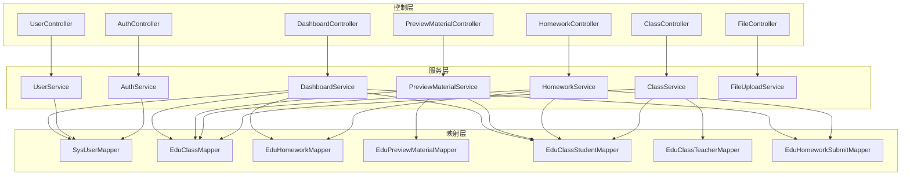

图表来源
- [AuthService.java:24-82](file://helenedu-backend/src/main/java/com/helen/eduedu/service/AuthService.java#L24-L82)
- [ClassService.java:25-261](file://helenedu-backend/src/main/java/com/helen/eduedu/service/ClassService.java#L25-L261)
- [UserService.java:23-129](file://helenedu-backend/src/main/java/com/helen/eduedu/service/UserService.java#L23-L129)
- [HomeworkService.java:26-306](file://helenedu-backend/src/main/java/com/helen/eduedu/service/HomeworkService.java#L26-L306)
- [PreviewMaterialService.java:28-149](file://helenedu-backend/src/main/java/com/helen/eduedu/service/PreviewMaterialService.java#L28-L149)
- [DashboardService.java:25-155](file://helenedu-backend/src/main/java/com/helen/eduedu/service/DashboardService.java#L25-L155)
- [FileUploadService.java:22-99](file://helenedu-backend/src/main/java/com/helen/eduedu/service/FileUploadService.java#L22-L99)

章节来源
- [application.yml:1-59](file://helenedu-backend/src/main/resources/application.yml#L1-L59)

## 核心组件
本节概述各 Service 的职责边界与关键能力：
- AuthService：负责用户身份认证与授权，集成微信登录、用户状态校验、JWT Token 生成与返回用户信息。
- ClassService：负责班级生命周期管理与成员关系维护，提供分页查询、成员增删、教师/学生班级列表查询。
- UserService：负责用户全生命周期管理，提供分页查询、角色过滤、状态切换、教师/学生列表导出。
- HomeworkService：负责作业全生命周期管理，包含发布、提交、批改、统计与状态转换；严格遵守截止时间限制。
- PreviewMaterialService：负责预习资料的发布与分发，按班级维度进行可见性控制。
- DashboardService：负责数据看板，提供总览指标与班级提交率排行。
- FileUploadService：负责文件上传与批量上传，包含类型校验、大小限制与路径生成。

章节来源
- [AuthService.java:21-82](file://helenedu-backend/src/main/java/com/helen/eduedu/service/AuthService.java#L21-L82)
- [ClassService.java:22-261](file://helenedu-backend/src/main/java/com/helen/eduedu/service/ClassService.java#L22-L261)
- [UserService.java:20-129](file://helenedu-backend/src/main/java/com/helen/eduedu/service/UserService.java#L20-L129)
- [HomeworkService.java:23-306](file://helenedu-backend/src/main/java/com/helen/eduedu/service/HomeworkService.java#L23-L306)
- [PreviewMaterialService.java:25-149](file://helenedu-backend/src/main/java/com/helen/eduedu/service/PreviewMaterialService.java#L25-L149)
- [DashboardService.java:22-155](file://helenedu-backend/src/main/java/com/helen/eduedu/service/DashboardService.java#L22-L155)
- [FileUploadService.java:19-99](file://helenedu-backend/src/main/java/com/helen/eduedu/service/FileUploadService.java#L19-L99)

## 架构概览
Service 层与 Mapper 层协作遵循以下原则：
- 事务管理：关键写操作使用 @Transactional，确保原子性与一致性。
- 异常处理：统一抛出 BusinessException，由全局异常处理器转换为标准响应。
- 数据转换：通过 BeanUtils 进行实体与 VO/DTO 的属性拷贝，必要时进行业务计算与状态映射。
- 权限与状态：在 Service 层进行角色与状态校验，避免越权与非法状态变更。

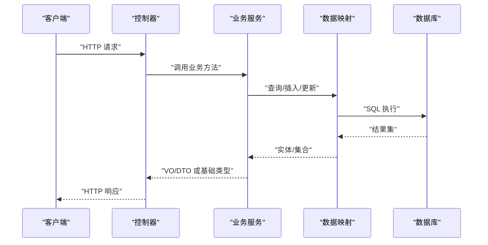

图表来源
- [AuthService.java:42-82](file://helenedu-backend/src/main/java/com/helen/eduedu/service/AuthService.java#L42-L82)
- [ClassService.java:37-71](file://helenedu-backend/src/main/java/com/helen/eduedu/service/ClassService.java#L37-L71)
- [UserService.java:32-73](file://helenedu-backend/src/main/java/com/helen/eduedu/service/UserService.java#L32-L73)
- [HomeworkService.java:39-70](file://helenedu-backend/src/main/java/com/helen/eduedu/service/HomeworkService.java#L39-L70)
- [PreviewMaterialService.java:39-71](file://helenedu-backend/src/main/java/com/helen/eduedu/service/PreviewMaterialService.java#L39-L71)
- [DashboardService.java:38-96](file://helenedu-backend/src/main/java/com/helen/eduedu/service/DashboardService.java#L38-L96)
- [FileUploadService.java:46-73](file://helenedu-backend/src/main/java/com/helen/eduedu/service/FileUploadService.java#L46-L73)

## 详细组件分析

### 认证服务（AuthService）
AuthService 实现微信小程序登录、用户状态校验与 JWT Token 生成。核心流程：
- 使用微信 code 调用官方接口换取 openid
- 查询用户是否存在，不存在则自动注册（默认学生角色、启用状态）
- 校验用户状态，禁用用户抛出业务异常
- 生成 JWT Token 并封装 LoginVO 响应

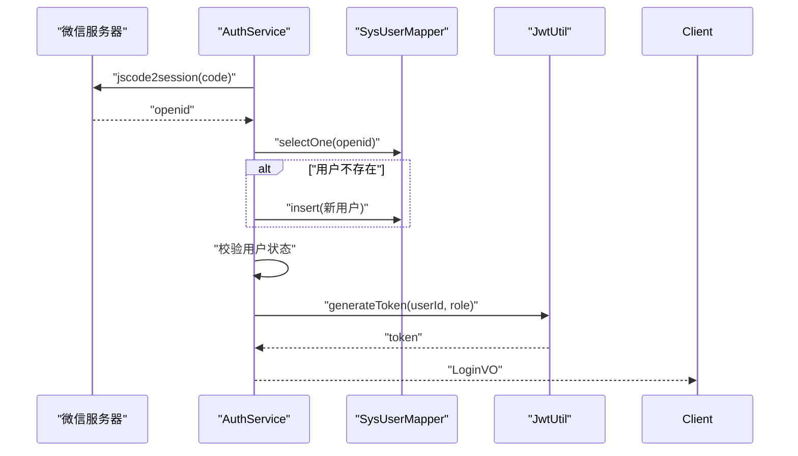

图表来源
- [AuthService.java:42-82](file://helenedu-backend/src/main/java/com/helen/eduedu/service/AuthService.java#L42-L82)
- [SysUserMapper.java:1-10](file://helenedu-backend/src/main/java/com/helen/eduedu/mapper/SysUserMapper.java#L1-L10)
- [JwtUtil.java:34-46](file://helenedu-backend/src/main/java/com/helen/eduedu/security/JwtUtil.java#L34-L46)

章节来源
- [AuthService.java:21-128](file://helenedu-backend/src/main/java/com/helen/eduedu/service/AuthService.java#L21-L128)
- [WxLoginRequest.java:1-19](file://helenedu-backend/src/main/java/com/helen/eduedu/dto/WxLoginRequest.java#L1-L19)
- [LoginVO.java:1-17](file://helenedu-backend/src/main/java/com/helen/eduedu/vo/LoginVO.java#L1-L17)
- [RoleEnum.java:1-28](file://helenedu-backend/src/main/java/com/helen/eduedu/common/RoleEnum.java#L1-L28)
- [JwtUtil.java:1-87](file://helenedu-backend/src/main/java/com/helen/eduedu/security/JwtUtil.java#L1-L87)

### 班级服务（ClassService）
ClassService 提供完整的班级管理能力：
- 创建/更新/删除（软删除：设置状态为 0）
- 分页查询与关键字搜索
- 成员管理：添加/移除学生、添加/移除教师
- 查询教师/学生所在班级列表
- 统计学生数与教师数并填充班主任姓名

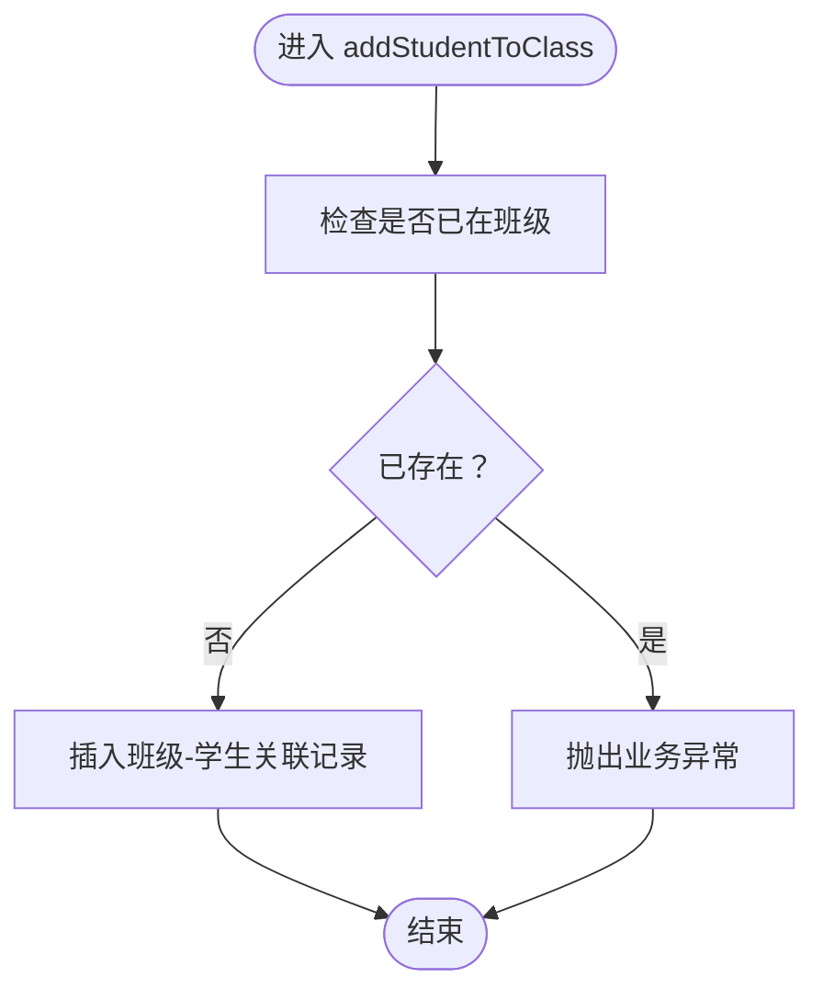

图表来源
- [ClassService.java:126-142](file://helenedu-backend/src/main/java/com/helen/eduedu/service/ClassService.java#L126-L142)

章节来源
- [ClassService.java:22-261](file://helenedu-backend/src/main/java/com/helen/eduedu/service/ClassService.java#L22-L261)
- [ClassRequest.java:1-19](file://helenedu-backend/src/main/java/com/helen/eduedu/dto/ClassRequest.java#L1-L19)
- [ClassVO.java:1-22](file://helenedu-backend/src/main/java/com/helen/eduedu/vo/ClassVO.java#L1-L22)

### 用户服务（UserService）
UserService 负责用户全生命周期管理：
- 创建用户（默认启用状态）
- 更新用户信息
- 切换用户状态（启用/禁用）
- 删除用户
- 分页查询用户，支持角色过滤与关键字模糊匹配
- 导出教师/学生列表（仅启用状态）

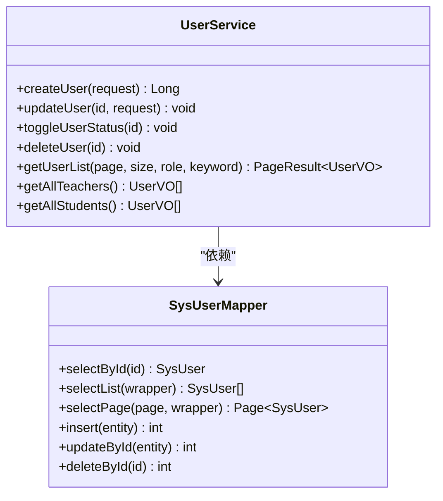

图表来源
- [UserService.java:23-129](file://helenedu-backend/src/main/java/com/helen/eduedu/service/UserService.java#L23-L129)
- [SysUserMapper.java:1-10](file://helenedu-backend/src/main/java/com/helen/eduedu/mapper/SysUserMapper.java#L1-L10)

章节来源
- [UserService.java:1-130](file://helenedu-backend/src/main/java/com/helen/eduedu/service/UserService.java#L1-L130)

### 作业服务（HomeworkService）
HomeworkService 实现作业全生命周期与提交批改流程：
- 教师发布作业（默认发布状态）
- 更新/删除作业
- 学生提交作业（严格校验截止时间、重复提交限制、退回后重新提交）
- 教师批改作业（评分、评语、状态更新）
- 统计提交情况与学生个人提交状态映射

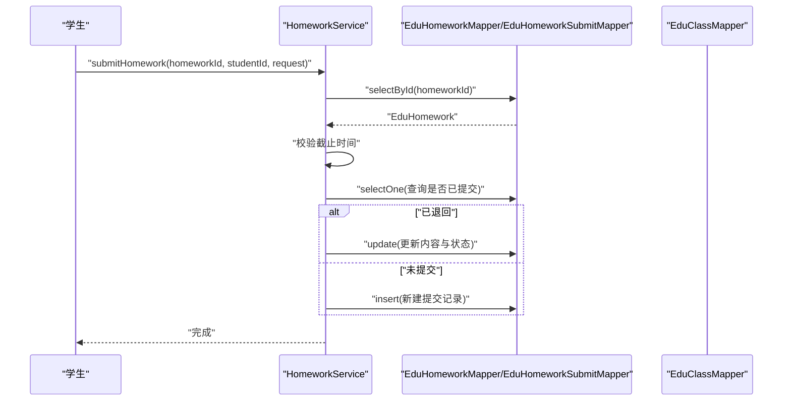

图表来源
- [HomeworkService.java:141-182](file://helenedu-backend/src/main/java/com/helen/eduedu/service/HomeworkService.java#L141-L182)

章节来源
- [HomeworkService.java:1-307](file://helenedu-backend/src/main/java/com/helen/eduedu/service/HomeworkService.java#L1-L307)

### 预习资料服务（PreviewMaterialService）
PreviewMaterialService 负责预习资料的发布与分发：
- 教师发布/更新/删除资料（默认发布状态）
- 教师视角：按教师与班级过滤资料列表
- 学生视角：根据所在班级获取已发布资料列表

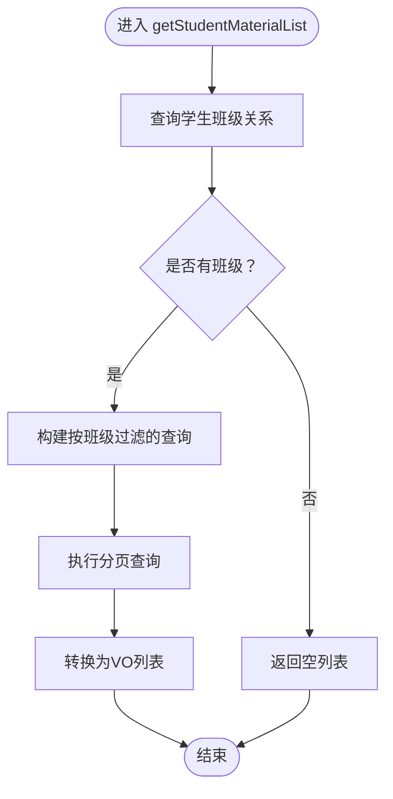

图表来源
- [PreviewMaterialService.java:107-129](file://helenedu-backend/src/main/java/com/helen/eduedu/service/PreviewMaterialService.java#L107-L129)

章节来源
- [PreviewMaterialService.java:1-151](file://helenedu-backend/src/main/java/com/helen/eduedu/service/PreviewMaterialService.java#L1-L151)

### 数据看板服务（DashboardService）
DashboardService 提供系统总览与班级排行：
- 总览：班级数、学生数、教师数、本周作业数、提交率、平均分
- 班级排行：按提交率降序排列

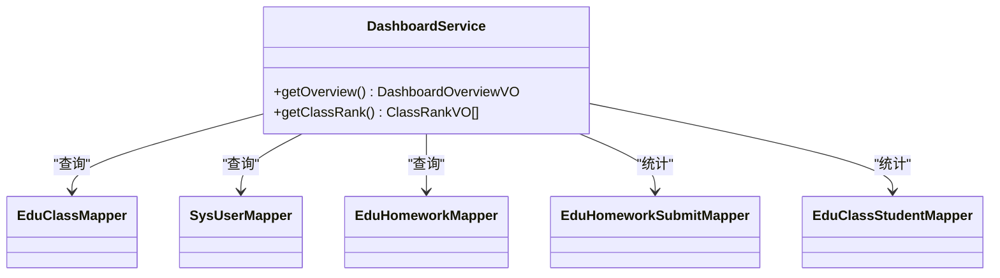

图表来源
- [DashboardService.java:25-155](file://helenedu-backend/src/main/java/com/helen/eduedu/service/DashboardService.java#L25-L155)

章节来源
- [DashboardService.java:1-157](file://helenedu-backend/src/main/java/com/helen/eduedu/service/DashboardService.java#L1-L157)

### 文件上传服务（FileUploadService）
FileUploadService 提供文件上传能力：
- 单文件上传：类型校验、大小限制、UUID 命名、按日期目录存储、返回访问 URL
- 批量上传：循环调用单文件上传
- 支持的类型：图片（jpeg/png/gif/webp）、PDF、Word、Excel
- 最大文件大小：50MB

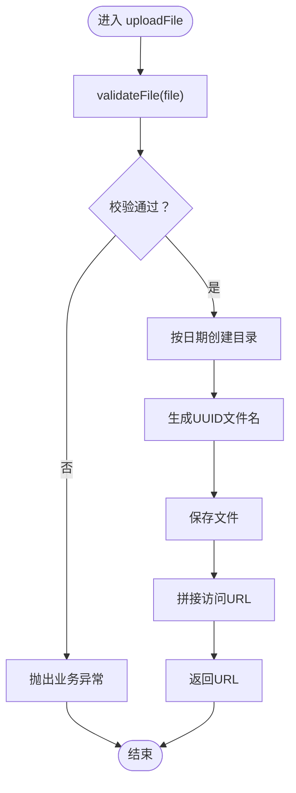

图表来源
- [FileUploadService.java:46-73](file://helenedu-backend/src/main/java/com/helen/eduedu/service/FileUploadService.java#L46-L73)

章节来源
- [FileUploadService.java:1-101](file://helenedu-backend/src/main/java/com/helen/eduedu/service/FileUploadService.java#L1-L101)

## 依赖分析
Service 层与 Mapper 层的耦合关系清晰，遵循单一职责与依赖倒置原则：
- Service 依赖 Mapper 接口，不直接依赖具体实现
- Mapper 通过 MyBatis-Plus 自动实现，简化 CRUD
- 事务边界明确，写操作集中在 Service 层
- 异常统一向上抛出，便于集中处理

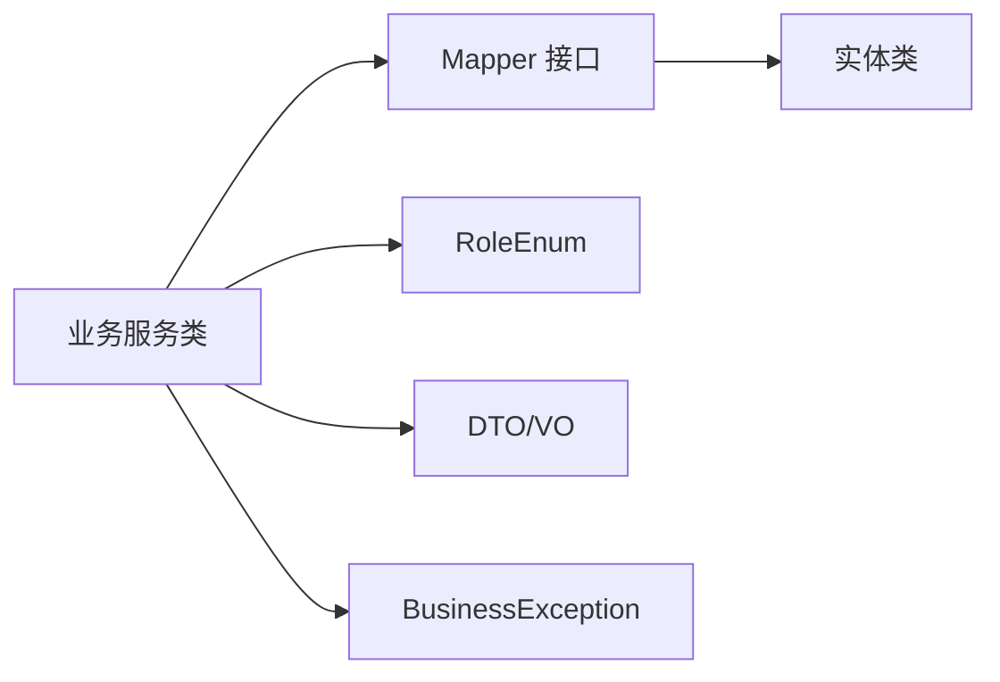

图表来源
- [SysUser.java:1-42](file://helenedu-backend/src/main/java/com/helen/eduedu/entity/SysUser.java#L1-L42)
- [RoleEnum.java:1-28](file://helenedu-backend/src/main/java/com/helen/eduedu/common/RoleEnum.java#L1-L28)

章节来源
- [SysUser.java:1-42](file://helenedu-backend/src/main/java/com/helen/eduedu/entity/SysUser.java#L1-L42)
- [RoleEnum.java:1-28](file://helenedu-backend/src/main/java/com/helen/eduedu/common/RoleEnum.java#L1-L28)

## 性能考虑
- 分页查询：所有列表查询均使用 Page 分页，避免一次性加载大量数据
- 条件查询：使用 LambdaQueryWrapper 构建精确条件，减少不必要的扫描
- 统计聚合：DashboardService 使用聚合查询与流式处理，注意大数据量场景下的索引优化
- 文件上传：单文件大小限制与类型白名单，防止恶意文件与资源滥用
- 缓存建议：对于高频读取的静态数据（如字典、枚举），可在 Service 层增加缓存以降低数据库压力

## 故障排除指南
常见问题与定位要点：
- 业务异常：统一抛出 BusinessException，需检查 Service 层的参数校验与状态判断
- 微信登录失败：检查微信 appid/secret 配置与网络连通性，关注 getWxOpenid 的异常日志
- 作业提交失败：确认截止时间、重复提交限制与退回状态逻辑
- 文件上传失败：检查 upload-dir 目录权限、磁盘空间与文件类型/大小限制
- 权限相关：确保 Controller 层的鉴权注解与 Service 层的状态校验配合正确

章节来源
- [AuthService.java:108-126](file://helenedu-backend/src/main/java/com/helen/eduedu/service/AuthService.java#L108-L126)
- [HomeworkService.java:148-151](file://helenedu-backend/src/main/java/com/helen/eduedu/service/HomeworkService.java#L148-L151)
- [FileUploadService.java:86-99](file://helenedu-backend/src/main/java/com/helen/eduedu/service/FileUploadService.java#L86-L99)

## 结论
HelenEdu 业务服务层通过清晰的分层设计与严格的业务规则实现了完整的教学管理能力。Service 层承担了事务控制、异常处理、数据转换与业务编排的核心职责，与 Mapper 层形成稳定的协作关系。建议在后续迭代中进一步完善缓存策略、监控埋点与单元测试覆盖率，持续提升系统的稳定性与可维护性。

## 附录

### 单元测试策略与 Mock 方法
- 测试框架：推荐使用 JUnit 5 + Mockito
- Mock 对象：
  - 使用 Mockito.mock(SysUserMapper.class) 等对 Mapper 进行 Mock
  - 使用 @MockBean 注入到 Spring 上下文中
- 测试覆盖：
  - 正向场景：验证成功路径与返回值
  - 异常场景：模拟不存在、禁用、超时、重复提交等边界条件
  - 事务场景：验证 @Transactional 的回滚与提交行为
- 示例思路（不包含具体代码）：
  - AuthService：Mock RestTemplate 返回 openid，验证用户注册与 Token 生成
  - ClassService：Mock 关联表查询，验证成员重复添加的异常
  - HomeworkService：Mock 当前时间与截止时间比较，验证提交限制
  - FileUploadService：Mock MultipartFile 与文件系统，验证类型与大小校验

### 业务流程图与数据流转图
- 作业提交流程（概念示意）
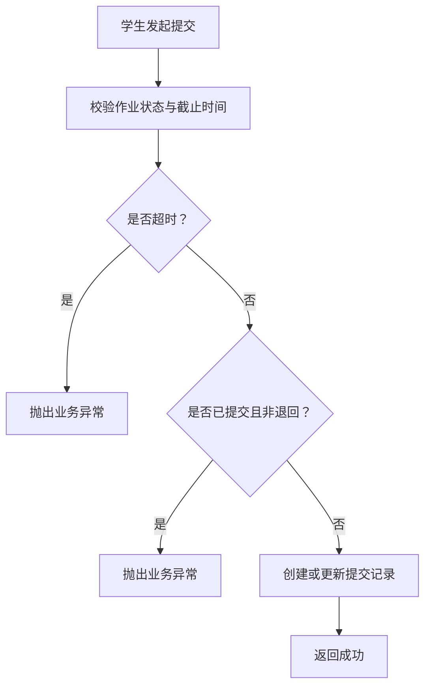

- 数据看板统计流程（概念示意）
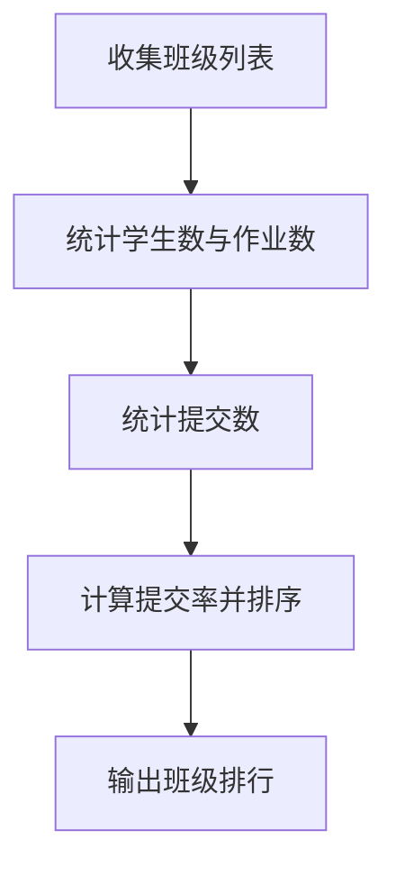