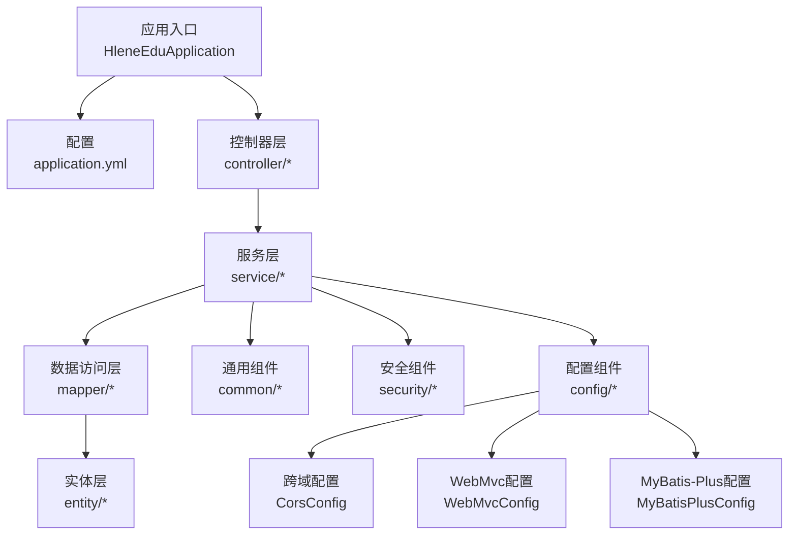
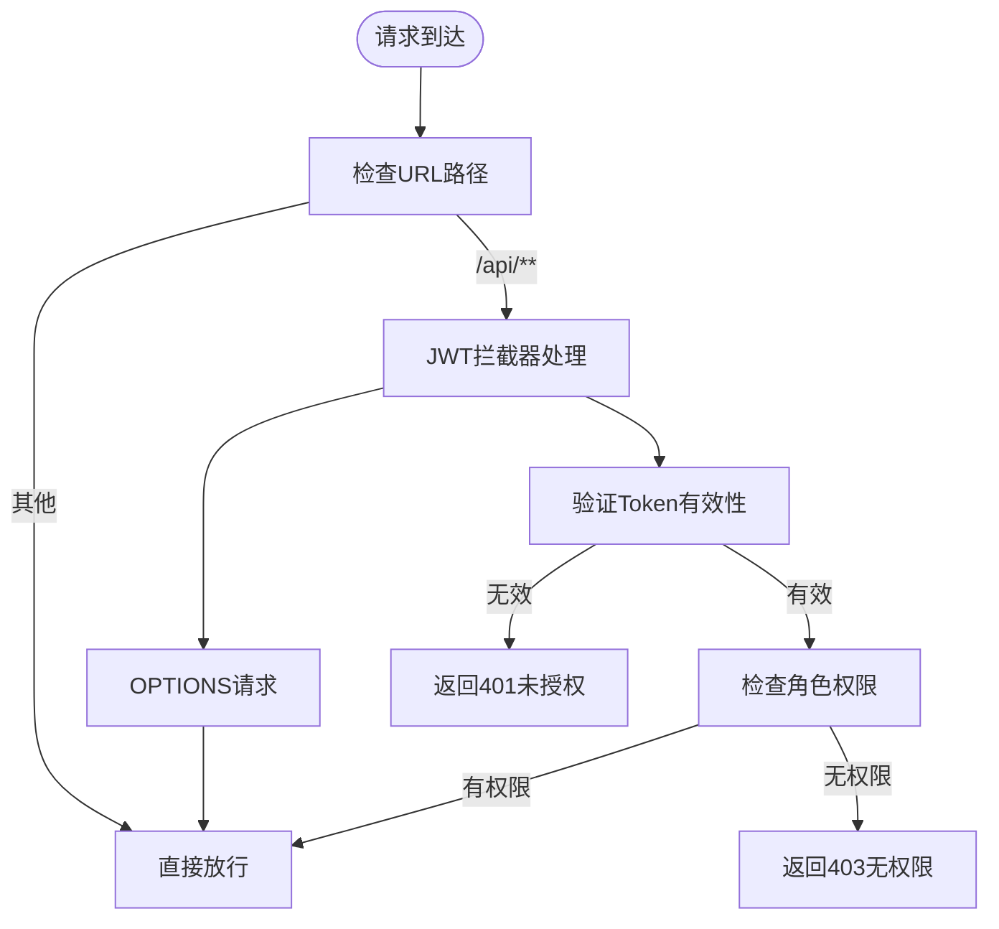
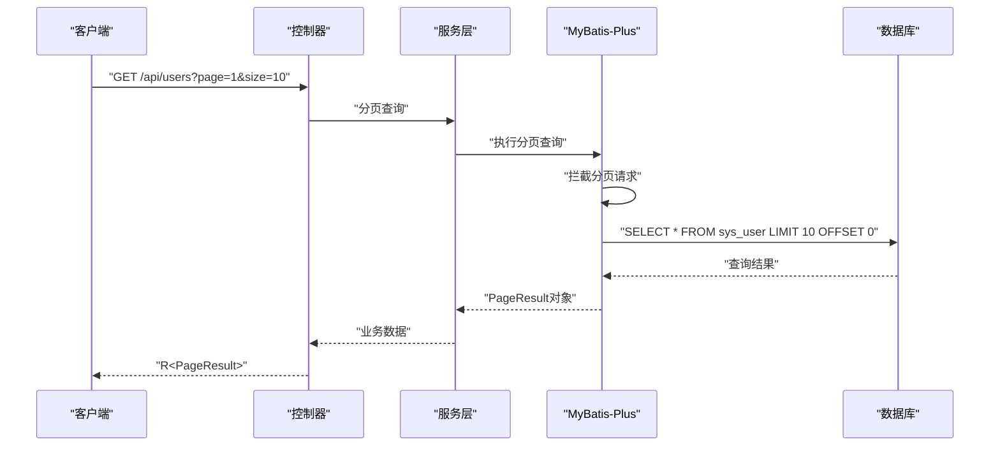
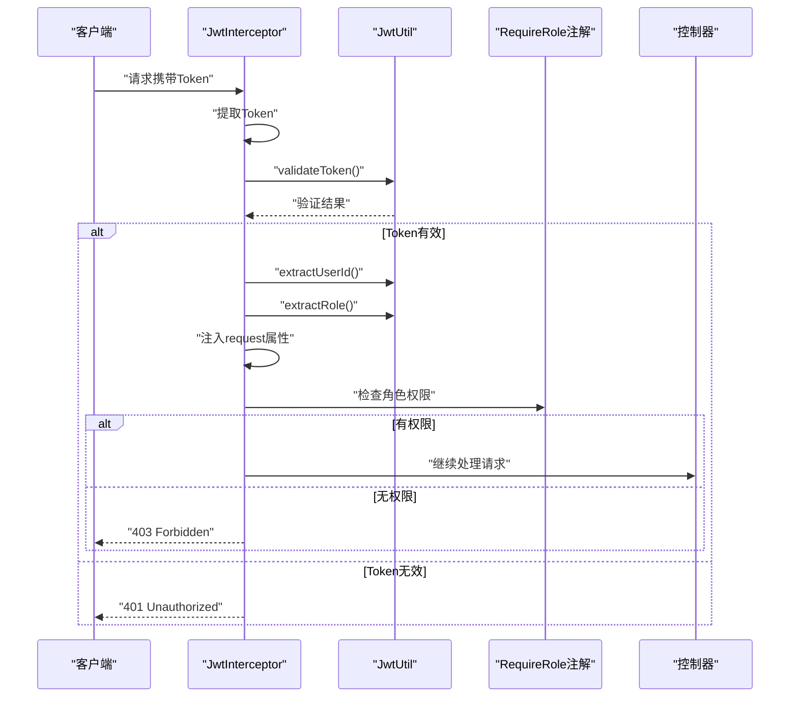
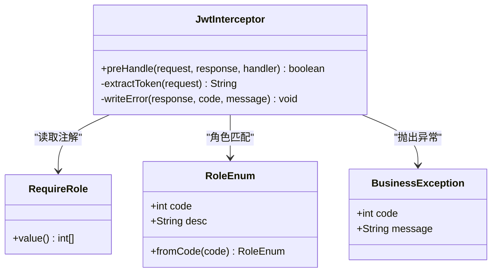
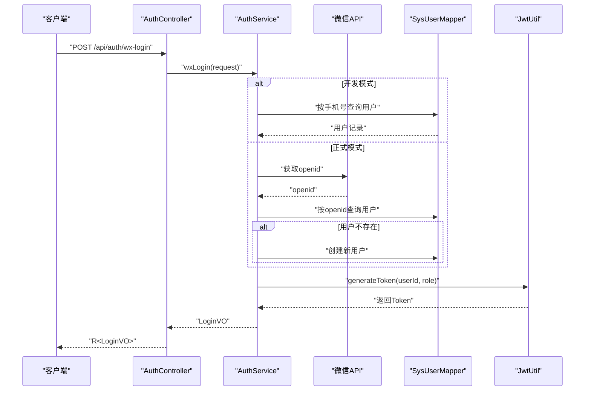
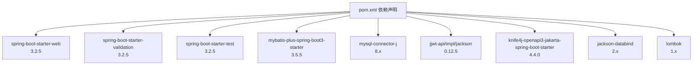

# 后端系统设计

<cite>
**本文引用的文件**
- [HleneEduApplication.java](file://helenedu-backend/src/main/java/com/helen/eduedu/HleneEduApplication.java)
- [application.yml](file://helenedu-backend/src/main/resources/application.yml)
- [pom.xml](file://helenedu-backend/pom.xml)
- [R.java](file://helenedu-backend/src/main/java/com/helen/eduedu/common/R.java)
- [PageResult.java](file://helenedu-backend/src/main/java/com/helen/eduedu/common/PageResult.java)
- [GlobalExceptionHandler.java](file://helenedu-backend/src/main/java/com/helen/eduedu/common/GlobalExceptionHandler.java)
- [BusinessException.java](file://helenedu-backend/src/main/java/com/helen/eduedu/common/BusinessException.java)
- [RoleEnum.java](file://helenedu-backend/src/main/java/com/helen/eduedu/common/RoleEnum.java)
- [MyBatisPlusConfig.java](file://helenedu-backend/src/main/java/com/helen/eduedu/config/MyBatisPlusConfig.java)
- [CorsConfig.java](file://helenedu-backend/src/main/java/com/helen/eduedu/config/CorsConfig.java)
- [WebMvcConfig.java](file://helenedu-backend/src/main/java/com/helen/eduedu/config/WebMvcConfig.java)
- [JwtUtil.java](file://helenedu-backend/src/main/java/com/helen/eduedu/security/JwtUtil.java)
- [JwtInterceptor.java](file://helenedu-backend/src/main/java/com/helen/eduedu/security/JwtInterceptor.java)
- [RequireRole.java](file://helenedu-backend/src/main/java/com/helen/eduedu/security/RequireRole.java)
- [SysUser.java](file://helenedu-backend/src/main/java/com/helen/eduedu/entity/SysUser.java)
- [SysUserMapper.java](file://helenedu-backend/src/main/java/com/helen/eduedu/mapper/SysUserMapper.java)
- [AuthService.java](file://helenedu-backend/src/main/java/com/helen/eduedu/service/AuthService.java)
- [AuthController.java](file://helenedu-backend/src/main/java/com/helen/eduedu/controller/AuthController.java)
</cite>

## 更新摘要
**所做更改**
- 新增跨域配置(CorsConfig)和WebMvc配置(WebMvcConfig)章节
- 更新MyBatis-Plus配置章节，补充分页插件和逻辑删除配置
- 完善JWT认证与权限控制章节，包含拦截器和注解的详细实现
- 新增全局异常处理章节，涵盖业务异常和参数校验异常处理
- 补充配置文件详解，包含JWT、微信小程序、文件上传等完整配置项
- 更新依赖分析，反映完整的Spring Boot生态系统配置

## 目录
1. [引言](#引言)
2. [项目结构](#项目结构)
3. [核心组件](#核心组件)
4. [架构总览](#架构总览)
5. [详细组件分析](#详细组件分析)
6. [依赖分析](#依赖分析)
7. [性能考虑](#性能考虑)
8. [故障排查指南](#故障排查指南)
9. [结论](#结论)
10. [附录](#附录)

## 引言
本设计文档面向HelenEdu后端系统，基于Spring Boot 3.2.5与MyBatis-Plus 3.5.5构建，采用清晰的分层架构（Controller、Service、Mapper、Entity），结合JWT认证与RBAC权限控制，提供统一响应体与全局异常处理机制，并对配置文件进行逐项解析。系统已完整实现基础设施配置，包括应用入口、MyBatis-Plus配置、跨域配置、全局异常处理等核心组件，为后续功能开发奠定坚实基础。

## 项目结构
后端工程位于helenedu-backend目录，采用标准Maven结构，核心包结构如下：
- common：通用工具与统一响应、分页结果、全局异常处理、业务异常、角色枚举
- config：MyBatis-Plus分页插件配置、跨域配置、WebMvc扩展配置
- security：JWT工具、拦截器、权限注解
- entity：数据模型（如用户）
- mapper：MyBatis-Plus映射接口
- service：业务逻辑
- controller：REST接口
- resources：配置文件与数据库初始化脚本
- HleneEduApplication：应用入口，开启Mapper扫描



**图表来源**
- [HleneEduApplication.java:1-15](file://helenedu-backend/src/main/java/com/helen/eduedu/HleneEduApplication.java#L1-L15)
- [application.yml:1-59](file://helenedu-backend/src/main/resources/application.yml#L1-L59)
- [CorsConfig.java:1-28](file://helenedu-backend/src/main/java/com/helen/eduedu/config/CorsConfig.java#L1-L28)
- [WebMvcConfig.java:1-40](file://helenedu-backend/src/main/java/com/helen/eduedu/config/WebMvcConfig.java#L1-L40)
- [MyBatisPlusConfig.java:1-22](file://helenedu-backend/src/main/java/com/helen/eduedu/config/MyBatisPlusConfig.java#L1-L22)

**章节来源**
- [HleneEduApplication.java:1-15](file://helenedu-backend/src/main/java/com/helen/eduedu/HleneEduApplication.java#L1-L15)
- [application.yml:1-59](file://helenedu-backend/src/main/resources/application.yml#L1-L59)

## 核心组件
- 统一响应体R：提供成功/失败响应模板，约定code/message/data字段，简化控制器返回
- 分页结果PageResult：封装分页总数、页码、大小与记录列表
- 全局异常处理GlobalExceptionHandler：集中处理业务异常、参数校验异常与系统异常，统一输出R格式
- 业务异常BusinessException：自定义业务异常类，支持指定错误码
- 角色枚举RoleEnum：定义学生、教师、管理员角色代码与描述
- MyBatis-Plus配置：启用分页插件与下划线转驼峰映射，配置逻辑删除字段
- 跨域配置CorsConfig：配置CORS策略，支持通配符域名和凭证
- WebMvc配置WebMvcConfig：注册拦截器和资源处理器，排除特定路径
- JWT工具JwtUtil：生成、解析、校验Token，提取用户ID与角色
- 权限注解RequireRole：在方法或类型上声明允许访问的角色集合
- 拦截器JwtInterceptor：拦截请求，校验Token与角色，注入用户上下文属性

**章节来源**
- [R.java:1-42](file://helenedu-backend/src/main/java/com/helen/eduedu/common/R.java#L1-L42)
- [PageResult.java:1-25](file://helenedu-backend/src/main/java/com/helen/eduedu/common/PageResult.java#L1-L25)
- [GlobalExceptionHandler.java:1-58](file://helenedu-backend/src/main/java/com/helen/eduedu/common/GlobalExceptionHandler.java#L1-L58)
- [BusinessException.java:1-22](file://helenedu-backend/src/main/java/com/helen/eduedu/common/BusinessException.java#L1-L22)
- [RoleEnum.java:1-28](file://helenedu-backend/src/main/java/com/helen/eduedu/common/RoleEnum.java#L1-L28)
- [MyBatisPlusConfig.java:1-22](file://helenedu-backend/src/main/java/com/helen/eduedu/config/MyBatisPlusConfig.java#L1-L22)
- [CorsConfig.java:1-28](file://helenedu-backend/src/main/java/com/helen/eduedu/config/CorsConfig.java#L1-L28)
- [WebMvcConfig.java:1-40](file://helenedu-backend/src/main/java/com/helen/eduedu/config/WebMvcConfig.java#L1-L40)
- [JwtUtil.java:1-87](file://helenedu-backend/src/main/java/com/helen/eduedu/security/JwtUtil.java#L1-L87)
- [RequireRole.java:1-20](file://helenedu-backend/src/main/java/com/helen/eduedu/security/RequireRole.java#L1-L20)
- [JwtInterceptor.java:1-85](file://helenedu-backend/src/main/java/com/helen/eduedu/security/JwtInterceptor.java#L1-L85)

## 架构总览
系统采用经典的分层架构，职责清晰：
- 控制器层：接收HTTP请求，参数校验，调用服务层，返回统一响应
- 服务层：编排业务流程，调用Mapper执行持久化，处理领域逻辑
- 数据访问层：基于MyBatis-Plus的BaseMapper接口，自动实现CRUD与分页
- 实体层：POJO映射数据库表，配合注解实现主键策略与逻辑删除
- 安全层：通过拦截器统一校验Token与角色，注解实现细粒度权限控制
- 配置层：MyBatis-Plus、跨域、WebMvc扩展、Knife4j文档等

```mermaid
graph TB
subgraph "表现层"
CTRL["控制器层<br/>controller/*"]
end
subgraph "业务层"
SVC["服务层<br/>service/*"]
end
subgraph "数据访问层"
MAPPER["映射层<br/>mapper/*"]
ENTITY["实体层<br/>entity/*"]
end
subgraph "基础设施"
CONF["配置层<br/>config/*"]
SEC["安全层<br/>security/*"]
COMMON["通用层<br/>common/*"]
ENDPOINT["端点层<br/>WebMvcConfig"]
CORS["跨域层<br/>CorsConfig"]
MP["MyBatis-Plus<br/>MyBatisPlusConfig"]
ENDPOINT --> CORS
ENDPOINT --> MP
CONF --> MAPPER
CONF --> ENDPOINT
```

**图表来源**
- [AuthController.java:1-39](file://helenedu-backend/src/main/java/com/helen/eduedu/controller/AuthController.java#L1-L39)
- [AuthService.java:1-153](file://helenedu-backend/src/main/java/com/helen/eduedu/service/AuthService.java#L1-L153)
- [SysUserMapper.java:1-10](file://helenedu-backend/src/main/java/com/helen/eduedu/mapper/SysUserMapper.java#L1-L10)
- [SysUser.java:1-54](file://helenedu-backend/src/main/java/com/helen/eduedu/entity/SysUser.java#L1-L54)
- [WebMvcConfig.java:1-40](file://helenedu-backend/src/main/java/com/helen/eduedu/config/WebMvcConfig.java#L1-L40)
- [CorsConfig.java:1-28](file://helenedu-backend/src/main/java/com/helen/eduedu/config/CorsConfig.java#L1-L28)
- [MyBatisPlusConfig.java:1-22](file://helenedu-backend/src/main/java/com/helen/eduedu/config/MyBatisPlusConfig.java#L1-L22)
- [JwtInterceptor.java:1-85](file://helenedu-backend/src/main/java/com/helen/eduedu/security/JwtInterceptor.java#L1-L85)
- [R.java:1-42](file://helenedu-backend/src/main/java/com/helen/eduedu/common/R.java#L1-L42)

## 详细组件分析

### 应用入口与配置管理
应用入口HleneEduApplication作为Spring Boot应用启动类，通过@MapperScan注解扫描所有Mapper接口，确保MyBatis-Plus能够正确识别数据访问层组件。

配置文件application.yml提供完整的系统配置，包括：
- 服务器配置：端口、上下文路径
- 数据源配置：MySQL连接参数、文件上传大小限制
- Jackson配置：日期格式、时区、属性过滤策略
- MyBatis-Plus配置：Mapper位置、命名策略、逻辑删除
- JWT配置：密钥与过期时间
- 微信小程序配置：AppId与Secret
- 文件上传配置：本地存储目录与访问URL
- API文档配置：Knife4j与Swagger UI路径

**章节来源**
- [HleneEduApplication.java:1-15](file://helenedu-backend/src/main/java/com/helen/eduedu/HleneEduApplication.java#L1-L15)
- [application.yml:1-59](file://helenedu-backend/src/main/resources/application.yml#L1-L59)

### 跨域与WebMvc配置
跨域配置CorsConfig提供宽松的CORS策略，支持通配符域名、凭证传递和所有HTTP方法，适用于开发环境的API调试需求。

WebMvc配置WebMvcConfig负责：
- 注册JWT拦截器，拦截/api/**路径下的请求
- 排除不需要认证的路径：/api/auth/wx-login和/api/auth/refresh-token
- 配置静态资源映射，将/uploaded/**路径映射到本地文件系统



**图表来源**
- [WebMvcConfig.java:24-31](file://helenedu-backend/src/main/java/com/helen/eduedu/config/WebMvcConfig.java#L24-L31)
- [CorsConfig.java:15-26](file://helenedu-backend/src/main/java/com/helen/eduedu/config/CorsConfig.java#L15-L26)

**章节来源**
- [CorsConfig.java:1-28](file://helenedu-backend/src/main/java/com/helen/eduedu/config/CorsConfig.java#L1-L28)
- [WebMvcConfig.java:1-40](file://helenedu-backend/src/main/java/com/helen/eduedu/config/WebMvcConfig.java#L1-L40)

### MyBatis-Plus配置与最佳实践
MyBatisPlusConfig配置分页插件，支持MySQL数据库的分页查询，自动拦截分页请求并添加LIMIT子句。配置包含：
- PaginationInnerInterceptor：MySQL数据库类型的分页拦截器
- 下划线转驼峰映射：application.yml中启用map-underscore-to-camel-case
- 逻辑删除配置：deleted字段配置为逻辑删除标识，值为1表示已删除



**图表来源**
- [MyBatisPlusConfig.java:15-20](file://helenedu-backend/src/main/java/com/helen/eduedu/config/MyBatisPlusConfig.java#L15-L20)
- [application.yml:21-31](file://helenedu-backend/src/main/resources/application.yml#L21-L31)

**章节来源**
- [MyBatisPlusConfig.java:1-22](file://helenedu-backend/src/main/java/com/helen/eduedu/config/MyBatisPlusConfig.java#L1-L22)
- [application.yml:21-31](file://helenedu-backend/src/main/resources/application.yml#L21-L31)

### JWT认证与权限控制
JWT工具JwtUtil提供完整的Token管理功能：
- Token生成：包含userId和role声明，设置签发时间和过期时间
- Token解析：验证签名并解析Claims内容
- 角色提取：从Token中获取用户角色信息
- 有效期验证：检查Token是否过期

拦截器JwtInterceptor实现请求拦截和权限验证：
- 支持Authorization头和URL参数两种Token传递方式
- 自动处理OPTIONS预检请求
- 集成RequireRole注解进行角色权限校验
- 将用户信息注入到请求属性中供后续处理使用



**图表来源**
- [JwtInterceptor.java:27-68](file://helenedu-backend/src/main/java/com/helen/eduedu/security/JwtInterceptor.java#L27-L68)
- [JwtUtil.java:34-85](file://helenedu-backend/src/main/java/com/helen/eduedu/security/JwtUtil.java#L34-L85)
- [RequireRole.java:11-19](file://helenedu-backend/src/main/java/com/helen/eduedu/security/RequireRole.java#L11-L19)

**章节来源**
- [JwtUtil.java:1-87](file://helenedu-backend/src/main/java/com/helen/eduedu/security/JwtUtil.java#L1-L87)
- [JwtInterceptor.java:1-85](file://helenedu-backend/src/main/java/com/helen/eduedu/security/JwtInterceptor.java#L1-L85)
- [RequireRole.java:1-20](file://helenedu-backend/src/main/java/com/helen/eduedu/security/RequireRole.java#L1-L20)

### RBAC权限模型与自定义注解
角色枚举RoleEnum定义了完整的角色体系：
- STUDENT(1, "学生")：基础用户角色
- TEACHER(2, "教师")：教学人员角色
- ADMIN(3, "管理员")：系统管理角色

RequireRole注解提供细粒度的权限控制：
- 支持方法级别和类型级别的权限声明
- 允许指定多个角色代码，使用OR逻辑组合
- 在拦截器中进行权限匹配验证



**图表来源**
- [RoleEnum.java:11-27](file://helenedu-backend/src/main/java/com/helen/eduedu/common/RoleEnum.java#L11-L27)
- [RequireRole.java:11-19](file://helenedu-backend/src/main/java/com/helen/eduedu/security/RequireRole.java#L11-L19)
- [JwtInterceptor.java:52-65](file://helenedu-backend/src/main/java/com/helen/eduedu/security/JwtInterceptor.java#L52-L65)

**章节来源**
- [RoleEnum.java:1-28](file://helenedu-backend/src/main/java/com/helen/eduedu/common/RoleEnum.java#L1-L28)
- [RequireRole.java:1-20](file://helenedu-backend/src/main/java/com/helen/eduedu/security/RequireRole.java#L1-L20)
- [JwtInterceptor.java:1-85](file://helenedu-backend/src/main/java/com/helen/eduedu/security/JwtInterceptor.java#L1-L85)

### 全局异常处理
GlobalExceptionHandler提供统一的异常处理机制：
- BusinessException：业务异常处理，支持自定义错误码
- MethodArgumentNotValidException：参数校验异常，提取字段错误信息
- BindException：参数绑定异常，处理表单绑定问题
- ConstraintViolationException：Bean验证约束异常
- Exception：通用异常处理，记录错误日志

异常处理策略：
- 返回统一的R响应格式
- 设置适当的HTTP状态码
- 记录详细的错误日志便于调试

**章节来源**
- [GlobalExceptionHandler.java:1-58](file://helenedu-backend/src/main/java/com/helen/eduedu/common/GlobalExceptionHandler.java#L1-L58)
- [BusinessException.java:1-22](file://helenedu-backend/src/main/java/com/helen/eduedu/common/BusinessException.java#L1-L22)

### 认证与用户服务
AuthService实现完整的用户认证流程：
- 微信登录：支持正式微信小程序登录和开发模式登录
- 用户信息：根据Token中的用户ID查询用户详情
- 参数校验：使用@Valid与DTO对象，结合全局异常处理统一返回错误信息

认证流程特点：
- 开发模式：使用"dev_"前缀的特殊code，直接按手机号查找用户
- 正式模式：调用微信API获取openid，查询或创建用户记录
- 角色分配：新用户默认分配学生角色
- 状态检查：验证用户账户状态是否启用



**图表来源**
- [AuthService.java:42-107](file://helenedu-backend/src/main/java/com/helen/eduedu/service/AuthService.java#L42-L107)
- [AuthController.java:26-30](file://helenedu-backend/src/main/java/com/helen/eduedu/controller/AuthController.java#L26-L30)

**章节来源**
- [AuthService.java:1-153](file://helenedu-backend/src/main/java/com/helen/eduedu/service/AuthService.java#L1-L153)
- [AuthController.java:1-39](file://helenedu-backend/src/main/java/com/helen/eduedu/controller/AuthController.java#L1-L39)

## 依赖分析
系统基于Spring Boot 3.2.5构建，完整依赖栈包括：

**核心框架依赖**
- spring-boot-starter-web：Web应用基础
- spring-boot-starter-validation：参数校验支持
- spring-boot-starter-test：测试框架

**数据访问依赖**
- mybatis-plus-spring-boot3-starter：MyBatis-Plus集成
- mysql-connector-j：MySQL驱动程序

**安全与认证依赖**
- jjwt-api/impl/jackson：JWT令牌处理
- lombok：代码简化工具

**API文档依赖**
- knife4j-openapi3-jakarta-spring-boot-starter：增强Swagger文档



**图表来源**
- [pom.xml:27-98](file://helenedu-backend/pom.xml#L27-L98)

**章节来源**
- [pom.xml:1-118](file://helenedu-backend/pom.xml#L1-L118)

## 性能考虑
- 分页查询：优先使用MyBatis-Plus分页插件，避免一次性加载大量数据
- SQL日志：开发环境启用日志实现，生产环境建议关闭或降级
- 缓存策略：对热点数据与只读数据引入缓存（如Redis），降低数据库压力
- 连接池：合理配置数据库连接池参数，避免连接泄漏
- 接口幂等：对写操作引入幂等控制（如Token去重、业务唯一键）
- 并发控制：对高并发场景增加限流与熔断策略
- 跨域配置：生产环境建议限制具体的域名而非使用通配符

## 故障排查指南
- 参数校验失败：全局异常处理会将字段错误拼接为消息返回，检查DTO与@Valid使用
- 业务异常：抛出BusinessException，统一由全局异常处理器返回，查看日志定位具体原因
- 认证失败：检查Token是否过期或签名不正确，确认JWT密钥与过期时间配置
- 权限不足：确认控制器方法是否标注RequireRole及允许的角色集合
- 数据库连接：核对application.yml中的数据库URL、用户名、密码与驱动类名
- 跨域问题：检查CorsConfig配置，确认允许的域名和方法
- 文件上传：验证upload-dir路径存在性和访问权限，检查max-file-size配置

**章节来源**
- [GlobalExceptionHandler.java:1-58](file://helenedu-backend/src/main/java/com/helen/eduedu/common/GlobalExceptionHandler.java#L1-L58)
- [JwtInterceptor.java:1-85](file://helenedu-backend/src/main/java/com/helen/eduedu/security/JwtInterceptor.java#L1-L85)
- [application.yml:1-59](file://helenedu-backend/src/main/resources/application.yml#L1-L59)

## 结论
本系统已完整实现基于Spring Boot的后端基础设施，包括应用入口、MyBatis-Plus配置、跨域配置、全局异常处理等核心组件。系统采用清晰的分层架构，结合JWT认证与RBAC权限控制，提供了统一响应格式和完整的异常处理机制。配置文件涵盖了数据库连接、JWT密钥、文件上传、API文档等关键配置项。建议在生产环境中进一步完善缓存、限流与监控体系，持续优化性能与安全性。

## 附录

### 配置文件详解
**服务器配置**
- server.port：应用监听端口，默认8888
- server.servlet.context-path：应用上下文路径，默认/

**数据源配置**
- spring.datasource.url：MySQL连接URL，包含字符集和时区设置
- spring.datasource.username：数据库用户名
- spring.datasource.password：数据库密码
- spring.datasource.driver-class-name：MySQL驱动类名

**文件上传配置**
- spring.servlet.multipart.max-file-size：单个文件最大大小，默认50MB
- spring.servlet.multipart.max-request-size：请求最大大小，默认100MB

**Jackson配置**
- spring.jackson.date-format：日期格式，默认yyyy-MM-dd HH:mm:ss
- spring.jackson.time-zone：时区，默认Asia/Shanghai
- spring.jackson.default-property-inclusion：属性过滤策略，默认non_null

**MyBatis-Plus配置**
- mybatis-plus.mapper-locations：Mapper XML文件位置，默认classpath:mapper/*.xml
- mybatis-plus.configuration.map-underscore-to-camel-case：下划线转驼峰，默认true
- mybatis-plus.configuration.log-impl：SQL日志实现，默认StdOutImpl
- mybatis-plus.global-config.db-config.id-type：主键策略，默认auto
- mybatis-plus.global-config.db-config.logic-delete-field：逻辑删除字段，默认deleted
- mybatis-plus.global-config.db-config.logic-delete-value：逻辑删除值，默认1
- mybatis-plus.global-config.db-config.logic-not-delete-value：逻辑未删除值，默认0

**JWT配置**
- jwt.secret：JWT密钥，必须足够长以确保安全性
- jwt.expiration：Token过期时间（毫秒），默认7天（604800000）

**微信小程序配置**
- wechat.appid：微信小程序AppId
- wechat.secret：微信小程序Secret

**文件上传配置**
- file.upload-dir：本地文件上传目录，默认./uploads
- file.base-url：文件访问基础URL，默认http://localhost:8080/uploads

**API文档配置**
- springdoc.swagger-ui.path：Swagger UI访问路径，默认/swagger-ui.html
- springdoc.api-docs.path：API文档路径，默认/v3/api-docs
- knife4j.enable：Knife4j开关，默认true
- knife4j.setting.language：文档语言，默认zh_cn

**章节来源**
- [application.yml:1-59](file://helenedu-backend/src/main/resources/application.yml#L1-L59)