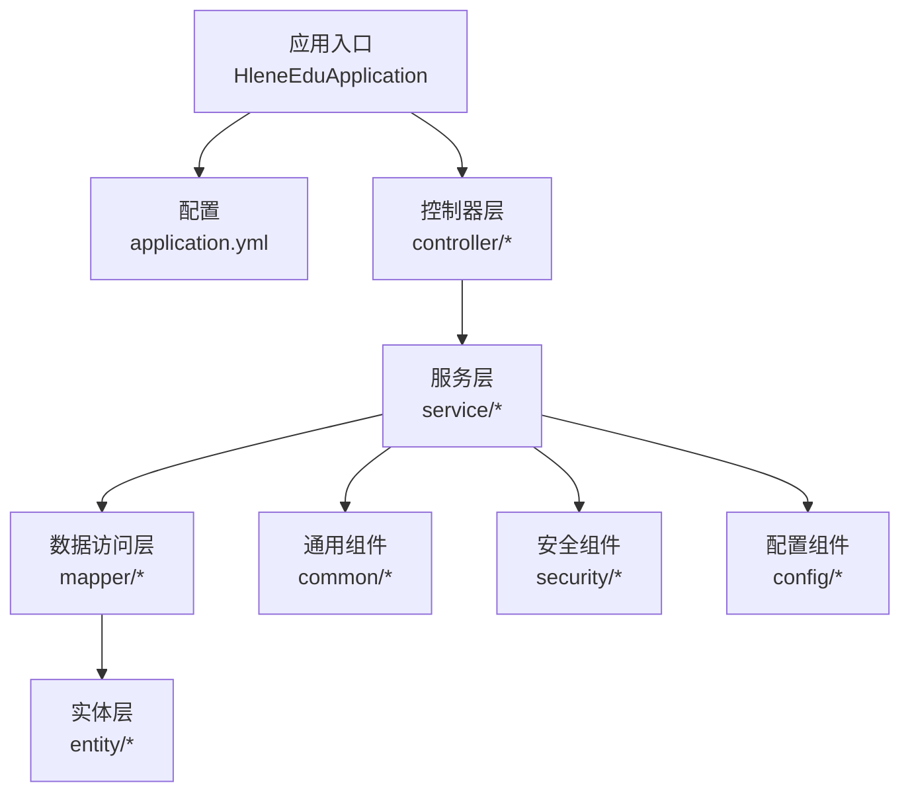
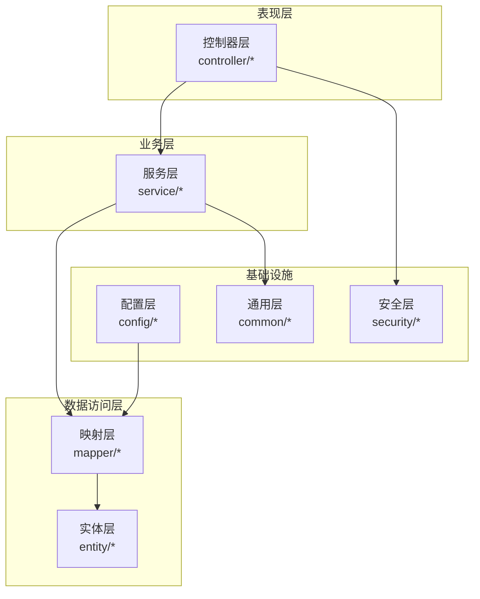
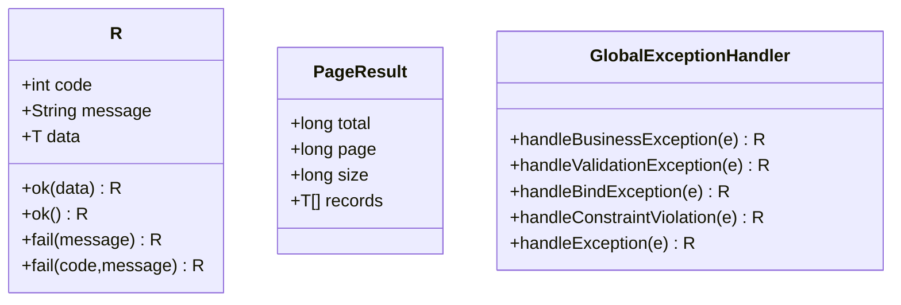
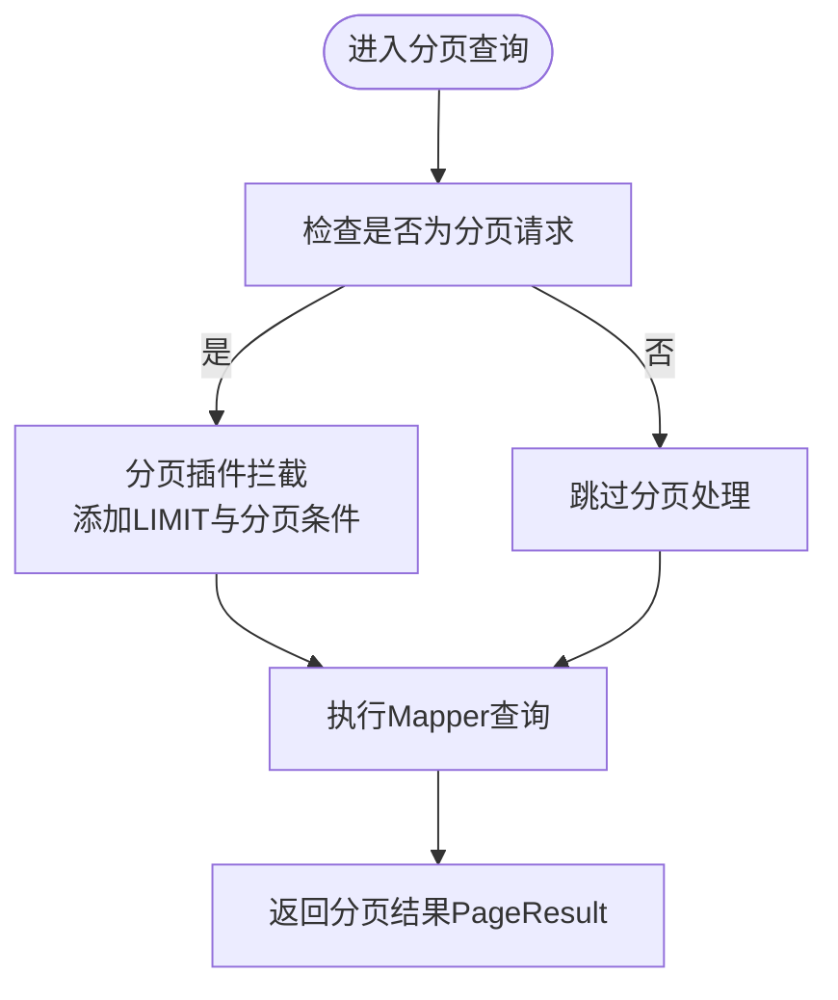
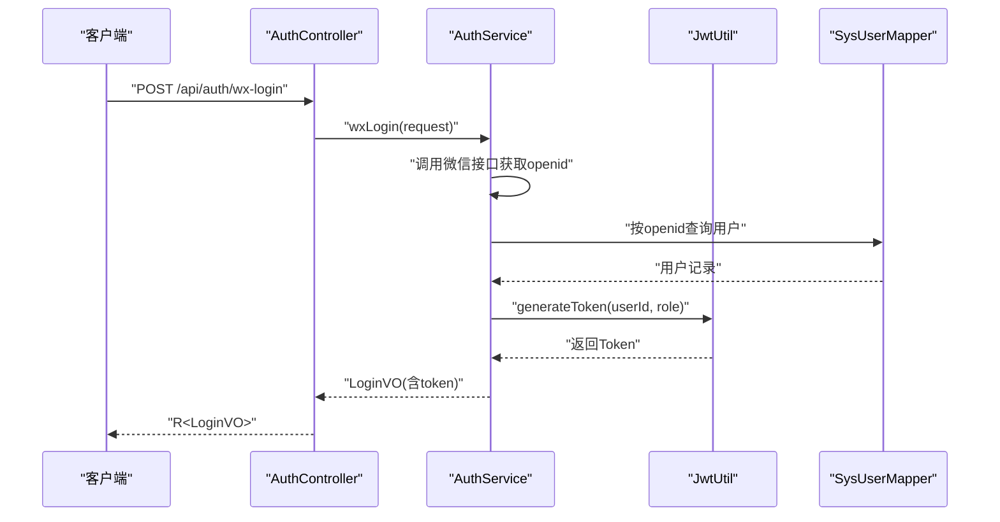
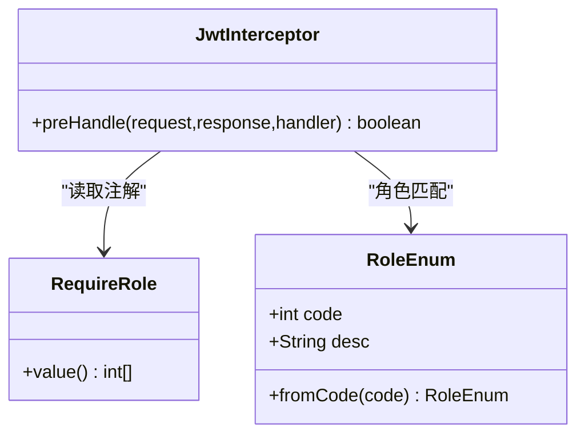
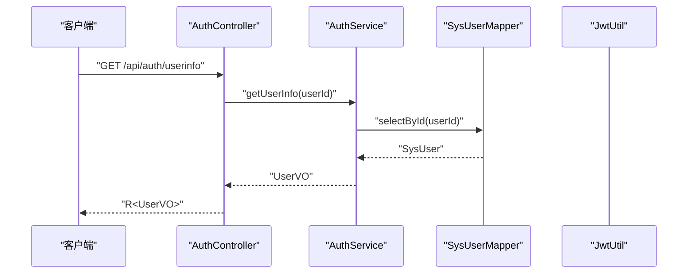
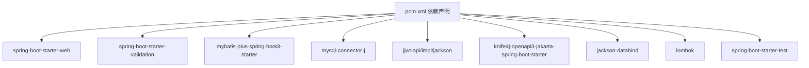

# 后端系统设计

<cite>
**本文引用的文件**
- [HleneEduApplication.java](file://helenedu-backend/src/main/java/com/helen/eduedu/HleneEduApplication.java)
- [application.yml](file://helenedu-backend/src/main/resources/application.yml)
- [pom.xml](file://helenedu-backend/pom.xml)
- [R.java](file://helenedu-backend/src/main/java/com/helen/eduedu/common/R.java)
- [PageResult.java](file://helenedu-backend/src/main/java/com/helen/eduedu/common/PageResult.java)
- [GlobalExceptionHandler.java](file://helenedu-backend/src/main/java/com/helen/eduedu/common/GlobalExceptionHandler.java)
- [RoleEnum.java](file://helenedu-backend/src/main/java/com/helen/eduedu/common/RoleEnum.java)
- [MyBatisPlusConfig.java](file://helenedu-backend/src/main/java/com/helen/eduedu/config/MyBatisPlusConfig.java)
- [JwtUtil.java](file://helenedu-backend/src/main/java/com/helen/eduedu/security/JwtUtil.java)
- [JwtInterceptor.java](file://helenedu-backend/src/main/java/com/helen/eduedu/security/JwtInterceptor.java)
- [RequireRole.java](file://helenedu-backend/src/main/java/com/helen/eduedu/security/RequireRole.java)
- [SysUser.java](file://helenedu-backend/src/main/java/com/helen/eduedu/entity/SysUser.java)
- [SysUserMapper.java](file://helenedu-backend/src/main/java/com/helen/eduedu/mapper/SysUserMapper.java)
- [AuthService.java](file://helenedu-backend/src/main/java/com/helen/eduedu/service/AuthService.java)
- [AuthController.java](file://helenedu-backend/src/main/java/com/helen/eduedu/controller/AuthController.java)
</cite>

## 目录
1. [引言](#引言)
2. [项目结构](#项目结构)
3. [核心组件](#核心组件)
4. [架构总览](#架构总览)
5. [详细组件分析](#详细组件分析)
6. [依赖分析](#依赖分析)
7. [性能考虑](#性能考虑)
8. [故障排查指南](#故障排查指南)
9. [结论](#结论)
10. [附录](#附录)

## 引言
本设计文档面向HelenEdu后端系统，基于Spring Boot与MyBatis-Plus构建，采用清晰的分层架构（Controller、Service、Mapper、Entity），结合JWT认证与RBAC权限控制，提供统一响应体与全局异常处理机制，并对配置文件进行逐项解析。文档旨在帮助开发者快速理解系统设计与实现细节，指导日常开发与维护。

## 项目结构
后端工程位于helenedu-backend目录，采用标准Maven结构，核心包结构如下：
- common：通用工具与统一响应、分页结果、全局异常处理、角色枚举
- config：MyBatis-Plus分页插件配置
- security：JWT工具、拦截器、权限注解
- entity：数据模型（如用户）
- mapper：MyBatis-Plus映射接口
- service：业务逻辑
- controller：REST接口
- resources：配置文件与数据库初始化脚本
- HleneEduApplication：应用入口，开启Mapper扫描

图表来源
- [HleneEduApplication.java:1-15](file://helenedu-backend/src/main/java/com/helen/eduedu/HleneEduApplication.java#L1-L15)
- [application.yml:1-59](file://helenedu-backend/src/main/resources/application.yml#L1-L59)

章节来源
- [HleneEduApplication.java:1-15](file://helenedu-backend/src/main/java/com/helen/eduedu/HleneEduApplication.java#L1-L15)
- [application.yml:1-59](file://helenedu-backend/src/main/resources/application.yml#L1-L59)

## 核心组件
- 统一响应体R：提供成功/失败响应模板，约定code/message/data字段，简化控制器返回
- 分页结果PageResult：封装分页总数、页码、大小与记录列表
- 全局异常处理GlobalExceptionHandler：集中处理业务异常、参数校验异常与系统异常，统一输出R格式
- 角色枚举RoleEnum：定义学生、教师、管理员角色代码与描述
- MyBatis-Plus配置：启用分页插件与下划线转驼峰映射，配置逻辑删除字段
- JWT工具JwtUtil：生成、解析、校验Token，提取用户ID与角色
- 权限注解RequireRole：在方法或类型上声明允许访问的角色集合
- 拦截器JwtInterceptor：拦截请求，校验Token与角色，注入用户上下文属性

章节来源
- [R.java:1-42](file://helenedu-backend/src/main/java/com/helen/eduedu/common/R.java#L1-L42)
- [PageResult.java:1-25](file://helenedu-backend/src/main/java/com/helen/eduedu/common/PageResult.java#L1-L25)
- [GlobalExceptionHandler.java:1-58](file://helenedu-backend/src/main/java/com/helen/eduedu/common/GlobalExceptionHandler.java#L1-L58)
- [RoleEnum.java:1-28](file://helenedu-backend/src/main/java/com/helen/eduedu/common/RoleEnum.java#L1-L28)
- [MyBatisPlusConfig.java:1-22](file://helenedu-backend/src/main/java/com/helen/eduedu/config/MyBatisPlusConfig.java#L1-L22)
- [JwtUtil.java:1-87](file://helenedu-backend/src/main/java/com/helen/eduedu/security/JwtUtil.java#L1-L87)
- [RequireRole.java:1-20](file://helenedu-backend/src/main/java/com/helen/eduedu/security/RequireRole.java#L1-L20)
- [JwtInterceptor.java:1-85](file://helenedu-backend/src/main/java/com/helen/eduedu/security/JwtInterceptor.java#L1-L85)

## 架构总览
系统采用经典的分层架构，职责清晰：
- 控制器层：接收HTTP请求，参数校验，调用服务层，返回统一响应
- 服务层：编排业务流程，调用Mapper执行持久化，处理领域逻辑
- 数据访问层：基于MyBatis-Plus的BaseMapper接口，自动实现CRUD与分页
- 实体层：POJO映射数据库表，配合注解实现主键策略与逻辑删除
- 安全层：通过拦截器统一校验Token与角色，注解实现细粒度权限控制
- 配置层：MyBatis-Plus、跨域、WebMvc扩展、Knife4j文档等

图表来源
- [AuthController.java:1-39](file://helenedu-backend/src/main/java/com/helen/eduedu/controller/AuthController.java#L1-L39)
- [AuthService.java:1-128](file://helenedu-backend/src/main/java/com/helen/eduedu/service/AuthService.java#L1-L128)
- [SysUserMapper.java:1-10](file://helenedu-backend/src/main/java/com/helen/eduedu/mapper/SysUserMapper.java#L1-L10)
- [SysUser.java:1-42](file://helenedu-backend/src/main/java/com/helen/eduedu/entity/SysUser.java#L1-L42)
- [MyBatisPlusConfig.java:1-22](file://helenedu-backend/src/main/java/com/helen/eduedu/config/MyBatisPlusConfig.java#L1-L22)
- [JwtInterceptor.java:1-85](file://helenedu-backend/src/main/java/com/helen/eduedu/security/JwtInterceptor.java#L1-L85)
- [R.java:1-42](file://helenedu-backend/src/main/java/com/helen/eduedu/common/R.java#L1-L42)

## 详细组件分析

### 统一响应与异常处理
- 统一响应体R：提供静态工厂方法，成功默认code=200，失败默认code=500；支持泛型数据封装
- 分页结果PageResult：封装total/page/size/records，便于前端分页展示
- 全局异常处理：捕获业务异常、参数校验异常、绑定异常、约束异常与通用异常，统一返回R格式，保证接口一致性

图表来源
- [R.java:1-42](file://helenedu-backend/src/main/java/com/helen/eduedu/common/R.java#L1-L42)
- [PageResult.java:1-25](file://helenedu-backend/src/main/java/com/helen/eduedu/common/PageResult.java#L1-L25)
- [GlobalExceptionHandler.java:1-58](file://helenedu-backend/src/main/java/com/helen/eduedu/common/GlobalExceptionHandler.java#L1-L58)

章节来源
- [R.java:1-42](file://helenedu-backend/src/main/java/com/helen/eduedu/common/R.java#L1-L42)
- [PageResult.java:1-25](file://helenedu-backend/src/main/java/com/helen/eduedu/common/PageResult.java#L1-L25)
- [GlobalExceptionHandler.java:1-58](file://helenedu-backend/src/main/java/com/helen/eduedu/common/GlobalExceptionHandler.java#L1-L58)

### MyBatis-Plus配置与最佳实践
- 分页插件：在MyBatisPlusConfig中注册PaginationInnerInterceptor，自动拦截分页查询，支持MySQL
- 命名策略：application.yml开启下划线转驼峰映射，提升SQL可读性
- 逻辑删除：配置deleted字段与逻辑值，避免物理删除，保障审计与恢复能力
- CRUD最佳实践：使用BaseMapper提供的通用方法，复杂查询通过XML或LambdaQueryWrapper实现

图表来源
- [MyBatisPlusConfig.java:1-22](file://helenedu-backend/src/main/java/com/helen/eduedu/config/MyBatisPlusConfig.java#L1-L22)
- [application.yml:21-32](file://helenedu-backend/src/main/resources/application.yml#L21-L32)

章节来源
- [MyBatisPlusConfig.java:1-22](file://helenedu-backend/src/main/java/com/helen/eduedu/config/MyBatisPlusConfig.java#L1-L22)
- [application.yml:21-32](file://helenedu-backend/src/main/resources/application.yml#L21-L32)

### JWT认证与权限控制
- Token生成：JwtUtil根据用户ID与角色生成签名Token，包含签发时间与过期时间
- Token解析与校验：解析时验证签名与过期时间，失败则拒绝访问
- 拦截器：JwtInterceptor从Header或参数中提取Token，校验有效性并将用户ID与角色注入请求属性；同时读取RequireRole注解进行角色校验
- 注解：RequireRole用于声明允许访问的角色数组，支持方法与类型级别

图表来源
- [AuthController.java:1-39](file://helenedu-backend/src/main/java/com/helen/eduedu/controller/AuthController.java#L1-L39)
- [AuthService.java:1-128](file://helenedu-backend/src/main/java/com/helen/eduedu/service/AuthService.java#L1-L128)
- [JwtUtil.java:1-87](file://helenedu-backend/src/main/java/com/helen/eduedu/security/JwtUtil.java#L1-L87)
- [SysUserMapper.java:1-10](file://helenedu-backend/src/main/java/com/helen/eduedu/mapper/SysUserMapper.java#L1-L10)

章节来源
- [JwtUtil.java:1-87](file://helenedu-backend/src/main/java/com/helen/eduedu/security/JwtUtil.java#L1-L87)
- [JwtInterceptor.java:1-85](file://helenedu-backend/src/main/java/com/helen/eduedu/security/JwtInterceptor.java#L1-L85)
- [RequireRole.java:1-20](file://helenedu-backend/src/main/java/com/helen/eduedu/security/RequireRole.java#L1-L20)
- [AuthService.java:1-128](file://helenedu-backend/src/main/java/com/helen/eduedu/service/AuthService.java#L1-L128)

### RBAC权限模型与自定义注解
- 角色枚举：RoleEnum定义学生、教师、管理员三种角色，提供fromCode方法用于反向查找
- 注解RequireRole：标注于Controller方法或类，声明允许访问的角色集合
- 拦截器集成：JwtInterceptor在preHandle阶段读取注解，若请求角色不在允许集合内则返回403

图表来源
- [RoleEnum.java:1-28](file://helenedu-backend/src/main/java/com/helen/eduedu/common/RoleEnum.java#L1-L28)
- [RequireRole.java:1-20](file://helenedu-backend/src/main/java/com/helen/eduedu/security/RequireRole.java#L1-L20)
- [JwtInterceptor.java:1-85](file://helenedu-backend/src/main/java/com/helen/eduedu/security/JwtInterceptor.java#L1-L85)

章节来源
- [RoleEnum.java:1-28](file://helenedu-backend/src/main/java/com/helen/eduedu/common/RoleEnum.java#L1-L28)
- [RequireRole.java:1-20](file://helenedu-backend/src/main/java/com/helen/eduedu/security/RequireRole.java#L1-L20)
- [JwtInterceptor.java:1-85](file://helenedu-backend/src/main/java/com/helen/eduedu/security/JwtInterceptor.java#L1-L85)

### 认证与用户服务
- 认证流程：微信登录获取openid，查询或创建用户，校验状态，生成Token并返回登录信息
- 用户信息：根据Token中的用户ID查询用户详情，转换为VO返回
- 参数校验：使用@Valid与DTO对象，结合全局异常处理统一返回错误信息

图表来源
- [AuthController.java:1-39](file://helenedu-backend/src/main/java/com/helen/eduedu/controller/AuthController.java#L1-L39)
- [AuthService.java:1-128](file://helenedu-backend/src/main/java/com/helen/eduedu/service/AuthService.java#L1-L128)
- [SysUserMapper.java:1-10](file://helenedu-backend/src/main/java/com/helen/eduedu/mapper/SysUserMapper.java#L1-L10)

章节来源
- [AuthController.java:1-39](file://helenedu-backend/src/main/java/com/helen/eduedu/controller/AuthController.java#L1-L39)
- [AuthService.java:1-128](file://helenedu-backend/src/main/java/com/helen/eduedu/service/AuthService.java#L1-L128)

## 依赖分析
- Spring Boot Starter：Web、Validation、Test
- MyBatis-Plus：提供分页、逻辑删除、代码生成等能力
- MySQL驱动：连接MySQL数据库
- JWT：jjwt-api/impl/jackson实现Token生成与解析
- Knife4j：OpenAPI/Swagger增强文档
- Lombok：减少样板代码
- Jackson：JSON序列化

图表来源
- [pom.xml:1-118](file://helenedu-backend/pom.xml#L1-L118)

章节来源
- [pom.xml:1-118](file://helenedu-backend/pom.xml#L1-L118)

## 性能考虑
- 分页查询：优先使用MyBatis-Plus分页插件，避免一次性加载大量数据
- SQL日志：开发环境开启日志实现，生产环境建议关闭或降级
- 缓存策略：对热点数据与只读数据引入缓存（如Redis），降低数据库压力
- 连接池：合理配置数据库连接池参数，避免连接泄漏
- 接口幂等：对写操作引入幂等控制（如Token去重、业务唯一键）
- 并发控制：对高并发场景增加限流与熔断策略

## 故障排查指南
- 参数校验失败：全局异常处理会将字段错误拼接为消息返回，检查DTO与@Valid使用
- 业务异常：抛出BusinessException，统一由全局异常处理器返回，查看日志定位具体原因
- 认证失败：检查Token是否过期或签名不正确，确认JWT密钥与过期时间配置
- 权限不足：确认控制器方法是否标注RequireRole及允许的角色集合
- 数据库连接：核对application.yml中的数据库URL、用户名、密码与驱动类名

章节来源
- [GlobalExceptionHandler.java:1-58](file://helenedu-backend/src/main/java/com/helen/eduedu/common/GlobalExceptionHandler.java#L1-L58)
- [JwtInterceptor.java:1-85](file://helenedu-backend/src/main/java/com/helen/eduedu/security/JwtInterceptor.java#L1-L85)
- [application.yml:1-59](file://helenedu-backend/src/main/resources/application.yml#L1-L59)

## 结论
本系统以Spring Boot为基础，结合MyBatis-Plus实现高效的数据访问，通过JWT与RBAC构建了完善的认证与授权体系，配合统一响应与全局异常处理，提升了接口的一致性与可维护性。建议在生产环境中进一步完善缓存、限流与监控体系，持续优化性能与安全性。

## 附录

### 配置文件详解
- 服务器与Web：端口、上下文路径、文件上传大小限制、日期格式与时区、Jackson属性过滤
- 数据源：MySQL连接URL、用户名、密码、驱动类名
- MyBatis-Plus：Mapper XML位置、命名策略、日志实现、主键策略、逻辑删除字段与值
- JWT：密钥与过期时间（毫秒）
- 微信小程序：AppId与Secret
- 文件上传：本地存储目录与对外访问基础URL
- API文档：Knife4j与Swagger UI路径

章节来源
- [application.yml:1-59](file://helenedu-backend/src/main/resources/application.yml#L1-L59)