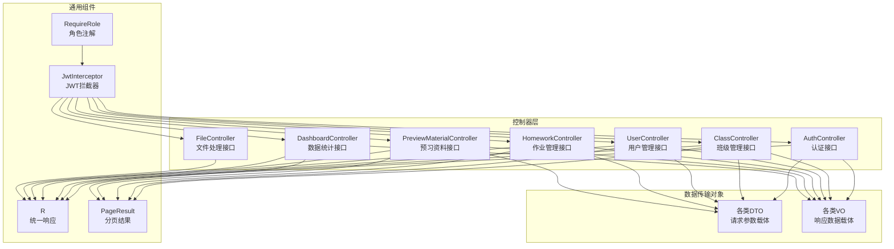
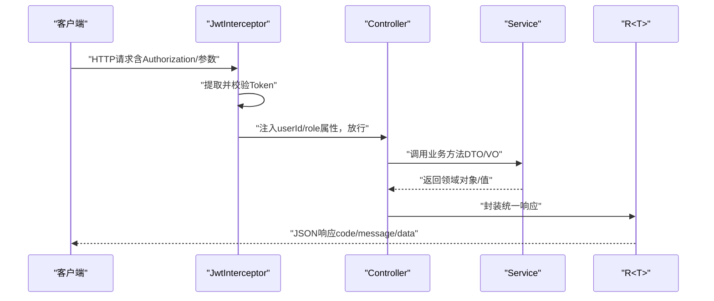
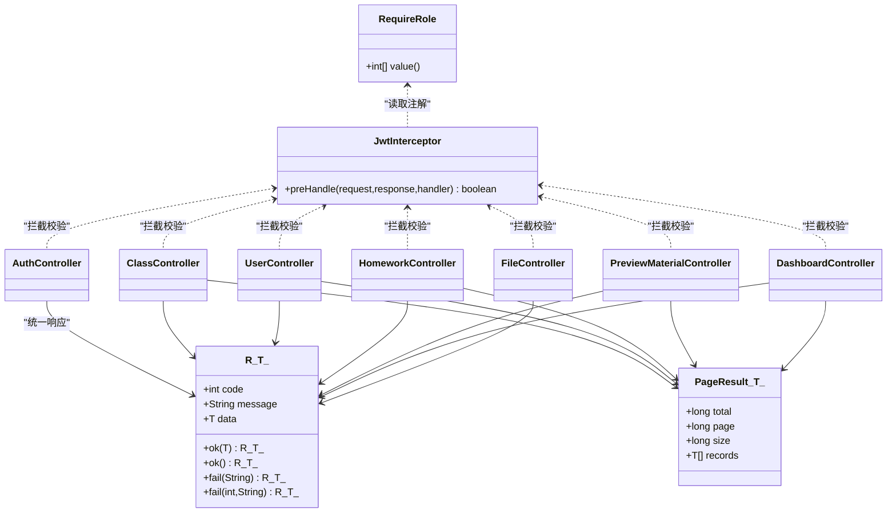

# 控制器层设计

<cite>
**本文引用的文件**
- [AuthController.java](file://helenedu-backend/src/main/java/com/helen/eduedu/controller/AuthController.java)
- [ClassController.java](file://helenedu-backend/src/main/java/com/helen/eduedu/controller/ClassController.java)
- [UserController.java](file://helenedu-backend/src/main/java/com/helen/eduedu/controller/UserController.java)
- [HomeworkController.java](file://helenedu-backend/src/main/java/com/helen/eduedu/controller/HomeworkController.java)
- [PreviewMaterialController.java](file://helenedu-backend/src/main/java/com/helen/eduedu/controller/PreviewMaterialController.java)
- [DashboardController.java](file://helenedu-backend/src/main/java/com/helen/eduedu/controller/DashboardController.java)
- [FileController.java](file://helenedu-backend/src/main/java/com/helen/eduedu/controller/FileController.java)
- [WxLoginRequest.java](file://helenedu-backend/src/main/java/com/helen/eduedu/dto/WxLoginRequest.java)
- [ClassRequest.java](file://helenedu-backend/src/main/java/com/helen/eduedu/dto/ClassRequest.java)
- [UserRequest.java](file://helenedu-backend/src/main/java/com/helen/eduedu/dto/UserRequest.java)
- [HomeworkRequest.java](file://helenedu-backend/src/main/java/com/helen/eduedu/dto/HomeworkRequest.java)
- [PreviewMaterialRequest.java](file://helenedu-backend/src/main/java/com/helen/eduedu/dto/PreviewMaterialRequest.java)
- [R.java](file://helenedu-backend/src/main/java/com/helen/eduedu/common/R.java)
- [PageResult.java](file://helenedu-backend/src/main/java/com/helen/eduedu/common/PageResult.java)
- [RequireRole.java](file://helenedu-backend/src/main/java/com/helen/eduedu/security/RequireRole.java)
- [JwtInterceptor.java](file://helenedu-backend/src/main/java/com/helen/eduedu/security/JwtInterceptor.java)
- [LoginVO.java](file://helenedu-backend/src/main/java/com/helen/eduedu/vo/LoginVO.java)
- [UserVO.java](file://helenedu-backend/src/main/java/com/helen/eduedu/vo/UserVO.java)
- [ClassVO.java](file://helenedu-backend/src/main/java/com/helen/eduedu/vo/ClassVO.java)
</cite>

## 目录
1. [简介](#简介)
2. [项目结构](#项目结构)
3. [核心组件](#核心组件)
4. [架构总览](#架构总览)
5. [详细组件分析](#详细组件分析)
6. [依赖分析](#依赖分析)
7. [性能考虑](#性能考虑)
8. [故障排查指南](#故障排查指南)
9. [结论](#结论)
10. [附录](#附录)

## 简介
本文件面向HelenEdu后端控制器层，系统化梳理各Controller类的RESTful API设计与实现要点，覆盖认证、班级管理、用户管理、作业管理、预习资料、数据看板、文件处理等模块。重点阐述：
- 控制器层职责边界：请求参数验证、HTTP状态码策略、响应封装
- 统一响应格式R类的使用规范：成功、失败、分页响应
- 参数绑定与DTO/VO模式：请求参数校验、数据传输载体
- 完整API接口清单：路径、方法、参数、示例、错误码
- 测试策略与调试技巧

## 项目结构
控制器层位于后端工程的controller包中，采用按功能域划分的目录组织，每个模块对应一个Controller类，并通过统一的R响应包装与分页容器PageResult进行输出。

图表来源
- [AuthController.java:1-39](file://helenedu-backend/src/main/java/com/helen/eduedu/controller/AuthController.java#L1-L39)
- [ClassController.java:1-129](file://helenedu-backend/src/main/java/com/helen/eduedu/controller/ClassController.java#L1-L129)
- [UserController.java:1-78](file://helenedu-backend/src/main/java/com/helen/eduedu/controller/UserController.java#L1-L78)
- [HomeworkController.java:1-123](file://helenedu-backend/src/main/java/com/helen/eduedu/controller/HomeworkController.java#L1-L123)
- [PreviewMaterialController.java:1-80](file://helenedu-backend/src/main/java/com/helen/eduedu/controller/PreviewMaterialController.java#L1-L80)
- [DashboardController.java:1-41](file://helenedu-backend/src/main/java/com/helen/eduedu/controller/DashboardController.java#L1-L41)
- [FileController.java:1-36](file://helenedu-backend/src/main/java/com/helen/eduedu/controller/FileController.java#L1-L36)
- [R.java:1-42](file://helenedu-backend/src/main/java/com/helen/eduedu/common/R.java#L1-L42)
- [PageResult.java:1-25](file://helenedu-backend/src/main/java/com/helen/eduedu/common/PageResult.java#L1-L25)
- [RequireRole.java:1-20](file://helenedu-backend/src/main/java/com/helen/eduedu/security/RequireRole.java#L1-L20)
- [JwtInterceptor.java:1-85](file://helenedu-backend/src/main/java/com/helen/eduedu/security/JwtInterceptor.java#L1-L85)

章节来源
- [AuthController.java:1-39](file://helenedu-backend/src/main/java/com/helen/eduedu/controller/AuthController.java#L1-L39)
- [ClassController.java:1-129](file://helenedu-backend/src/main/java/com/helen/eduedu/controller/ClassController.java#L1-L129)
- [UserController.java:1-78](file://helenedu-backend/src/main/java/com/helen/eduedu/controller/UserController.java#L1-L78)
- [HomeworkController.java:1-123](file://helenedu-backend/src/main/java/com/helen/eduedu/controller/HomeworkController.java#L1-L123)
- [PreviewMaterialController.java:1-80](file://helenedu-backend/src/main/java/com/helen/eduedu/controller/PreviewMaterialController.java#L1-L80)
- [DashboardController.java:1-41](file://helenedu-backend/src/main/java/com/helen/eduedu/controller/DashboardController.java#L1-L41)
- [FileController.java:1-36](file://helenedu-backend/src/main/java/com/helen/eduedu/controller/FileController.java#L1-L36)

## 核心组件
- 统一响应R<T>：提供成功、失败两种静态工厂方法，约定code/message/data三段式响应结构；部分接口返回空data时使用ok()重载。
- 分页容器PageResult<T>：封装total/page/size/records字段，用于列表型接口的分页输出。
- 角色注解@RequireRole：标注在Controller方法或类上，限定访问角色集合；与Jwt拦截器配合完成权限控制。
- JWT拦截器JwtInterceptor：负责提取与校验Token、解析用户身份、注入request属性、执行角色校验并输出标准化错误响应。

章节来源
- [R.java:1-42](file://helenedu-backend/src/main/java/com/helen/eduedu/common/R.java#L1-L42)
- [PageResult.java:1-25](file://helenedu-backend/src/main/java/com/helen/eduedu/common/PageResult.java#L1-L25)
- [RequireRole.java:1-20](file://helenedu-backend/src/main/java/com/helen/eduedu/security/RequireRole.java#L1-L20)
- [JwtInterceptor.java:1-85](file://helenedu-backend/src/main/java/com/helen/eduedu/security/JwtInterceptor.java#L1-L85)

## 架构总览
控制器层遵循“请求进入—参数校验—权限校验—业务调用—统一响应”的标准流程。拦截器在前置阶段完成认证与授权，控制器仅关注业务逻辑与响应封装。

图表来源
- [JwtInterceptor.java:27-68](file://helenedu-backend/src/main/java/com/helen/eduedu/security/JwtInterceptor.java#L27-L68)
- [R.java:16-40](file://helenedu-backend/src/main/java/com/helen/eduedu/common/R.java#L16-L40)

## 详细组件分析

### 认证控制器 AuthController
- 路由前缀：/api/auth
- 主要接口
  - POST /wx-login：微信登录，接收WxLoginRequest，返回LoginVO
  - GET /userinfo：获取当前用户信息，从请求属性中读取userId，返回UserVO
- 参数绑定与校验
  - 使用@Valid对请求体进行参数校验
  - 通过拦截器注入userId/role到请求属性
- 响应封装
  - 成功统一返回R.ok(data)，失败使用R.fail(message/code)
- 权限控制
  - 当前接口未显式标注@RequireRole，但依赖拦截器完成认证

章节来源
- [AuthController.java:1-39](file://helenedu-backend/src/main/java/com/helen/eduedu/controller/AuthController.java#L1-L39)
- [WxLoginRequest.java:1-19](file://helenedu-backend/src/main/java/com/helen/eduedu/dto/WxLoginRequest.java#L1-L19)
- [LoginVO.java:1-17](file://helenedu-backend/src/main/java/com/helen/eduedu/vo/LoginVO.java#L1-L17)
- [UserVO.java:1-18](file://helenedu-backend/src/main/java/com/helen/eduedu/vo/UserVO.java#L1-L18)

### 班级管理控制器 ClassController
- 路由前缀：/api/class
- 主要接口
  - POST /：创建班级，需管理员角色，返回新建ID
  - PUT /{id}：更新班级
  - DELETE /{id}：删除/解散班级
  - GET /list?page=&size=&keyword=：分页查询班级列表
  - GET /{id}：获取班级详情
  - GET /{id}/students：获取班级学生列表
  - POST /{id}/students：添加学生（管理员）
  - DELETE /{id}/students/{studentId}：移除学生（管理员）
  - GET /{id}/teachers：获取班级教师列表
  - POST /{id}/teachers：添加教师（管理员）
  - DELETE /{id}/teachers/{teacherId}：移除教师（管理员）
  - GET /my-classes：教师获取本人班级列表
  - GET /my-student-classes：学生获取本人班级列表
- 参数绑定与校验
  - @Valid + ClassRequest/ClassMemberRequest
  - 分页参数page/size默认值与可选keyword
- 响应封装
  - 列表/详情统一返回R.ok(data)，分页使用PageResult
- 权限控制
  - 多数写操作标注@RequireRole({3})管理员
  - 教师/学生专属接口分别标注@RequireRole({2})与@RequireRole({1})

章节来源
- [ClassController.java:1-129](file://helenedu-backend/src/main/java/com/helen/eduedu/controller/ClassController.java#L1-L129)
- [ClassRequest.java:1-19](file://helenedu-backend/src/main/java/com/helen/eduedu/dto/ClassRequest.java#L1-L19)
- [ClassVO.java:1-22](file://helenedu-backend/src/main/java/com/helen/eduedu/vo/ClassVO.java#L1-L22)

### 用户管理控制器 UserController
- 路由前缀：/api/user
- 主要接口
  - POST /：创建用户，返回新建ID
  - PUT /{id}：更新用户
  - PUT /{id}/toggle-status：禁用/启用用户
  - DELETE /{id}：删除用户
  - GET /list?page=&size=&role=&keyword=：分页查询用户列表
  - GET /teachers：获取所有教师
  - GET /students：获取所有学生
- 参数绑定与校验
  - @Valid + UserRequest
  - 分页参数page/size与可选role/keyword
- 响应封装
  - 列表使用PageResult，详情使用R.ok(data)
- 权限控制
  - 类级别标注@RequireRole({3})管理员

章节来源
- [UserController.java:1-78](file://helenedu-backend/src/main/java/com/helen/eduedu/controller/UserController.java#L1-L78)
- [UserRequest.java:1-23](file://helenedu-backend/src/main/java/com/helen/eduedu/dto/UserRequest.java#L1-L23)
- [UserVO.java:1-18](file://helenedu-backend/src/main/java/com/helen/eduedu/vo/UserVO.java#L1-L18)

### 作业管理控制器 HomeworkController
- 路由前缀：/api/homework
- 主要接口
  - POST /：布置作业（教师），返回作业ID
  - PUT /{id}：更新作业（教师）
  - DELETE /{id}：删除作业（教师）
  - GET /{id}：获取作业详情（支持教师/学生）
  - GET /list?classId=&page=&size=：教师获取作业列表（教师）
  - GET /student-list?status=&page=&size=：学生获取作业列表（学生）
  - POST /{id}/submit：提交作业（学生）
  - GET /{id}/submits?status=：获取作业提交列表（教师）
  - PUT /submit/{id}/review：批改作业（教师）
  - GET /submit/{id}：获取提交详情
- 参数绑定与校验
  - @Valid + HomeworkRequest/HomeworkSubmitRequest/HomeworkReviewRequest
  - 通过请求属性读取userId/role
- 响应封装
  - 列表使用PageResult，详情使用R.ok(data)
- 权限控制
  - 教师专属接口标注@RequireRole({2})
  - 学生专属接口标注@RequireRole({1})

章节来源
- [HomeworkController.java:1-123](file://helenedu-backend/src/main/java/com/helen/eduedu/controller/HomeworkController.java#L1-L123)
- [HomeworkRequest.java:1-33](file://helenedu-backend/src/main/java/com/helen/eduedu/dto/HomeworkRequest.java#L1-L33)

### 预习资料控制器 PreviewMaterialController
- 路由前缀：/api/preview
- 主要接口
  - POST /：发布预习资料（教师），返回资料ID
  - PUT /{id}：更新资料（教师）
  - DELETE /{id}：删除资料（教师）
  - GET /{id}：获取资料详情
  - GET /list?classId=&page=&size=：教师获取资料列表（教师）
  - GET /student-list?page=&size=：学生获取资料列表（学生）
- 参数绑定与校验
  - @Valid + PreviewMaterialRequest
  - 通过请求属性读取userId/role
- 响应封装
  - 列表使用PageResult，详情使用R.ok(data)
- 权限控制
  - 教师专属接口标注@RequireRole({2})
  - 学生专属接口标注@RequireRole({1})

章节来源
- [PreviewMaterialController.java:1-80](file://helenedu-backend/src/main/java/com/helen/eduedu/controller/PreviewMaterialController.java#L1-L80)
- [PreviewMaterialRequest.java:1-30](file://helenedu-backend/src/main/java/com/helen/eduedu/dto/PreviewMaterialRequest.java#L1-L30)

### 数据看板控制器 DashboardController
- 路由前缀：/api/dashboard
- 主要接口
  - GET /overview：总览数据，返回DashboardOverviewVO
  - GET /class-rank：班级排行，返回List<ClassRankVO>
- 参数绑定与校验
  - 无请求体参数
- 响应封装
  - 返回R.ok(data)
- 权限控制
  - 类级别标注@RequireRole({3})管理员

章节来源
- [DashboardController.java:1-41](file://helenedu-backend/src/main/java/com/helen/eduedu/controller/DashboardController.java#L1-L41)

### 文件上传控制器 FileController
- 路由前缀：/api/file
- 主要接口
  - POST /upload：上传单个文件，返回文件URL字符串
  - POST /upload-batch：批量上传文件，返回文件URL列表
- 参数绑定与校验
  - @RequestParam("file"/"files") + MultipartFile
- 响应封装
  - 返回R.ok(data)
- 权限控制
  - 无显式角色限制

章节来源
- [FileController.java:1-36](file://helenedu-backend/src/main/java/com/helen/eduedu/controller/FileController.java#L1-L36)

## 依赖分析
- 控制器与通用组件
  - 所有控制器依赖R<T>进行响应封装，列表接口依赖PageResult进行分页输出
- 控制器与权限控制
  - @RequireRole注解与JwtInterceptor协作，拦截器在preHandle中解析Token、注入用户信息、执行角色校验
- 控制器与DTO/VO
  - 接口通过@Valid对接收DTO进行参数校验，返回VO作为对外数据载体

图表来源
- [R.java:1-42](file://helenedu-backend/src/main/java/com/helen/eduedu/common/R.java#L1-L42)
- [PageResult.java:1-25](file://helenedu-backend/src/main/java/com/helen/eduedu/common/PageResult.java#L1-L25)
- [RequireRole.java:1-20](file://helenedu-backend/src/main/java/com/helen/eduedu/security/RequireRole.java#L1-L20)
- [JwtInterceptor.java:1-85](file://helenedu-backend/src/main/java/com/helen/eduedu/security/JwtInterceptor.java#L1-L85)
- [AuthController.java:1-39](file://helenedu-backend/src/main/java/com/helen/eduedu/controller/AuthController.java#L1-L39)
- [ClassController.java:1-129](file://helenedu-backend/src/main/java/com/helen/eduedu/controller/ClassController.java#L1-L129)
- [UserController.java:1-78](file://helenedu-backend/src/main/java/com/helen/eduedu/controller/UserController.java#L1-L78)
- [HomeworkController.java:1-123](file://helenedu-backend/src/main/java/com/helen/eduedu/controller/HomeworkController.java#L1-L123)
- [PreviewMaterialController.java:1-80](file://helenedu-backend/src/main/java/com/helen/eduedu/controller/PreviewMaterialController.java#L1-L80)
- [DashboardController.java:1-41](file://helenedu-backend/src/main/java/com/helen/eduedu/controller/DashboardController.java#L1-L41)
- [FileController.java:1-36](file://helenedu-backend/src/main/java/com/helen/eduedu/controller/FileController.java#L1-L36)

## 性能考虑
- 响应封装成本低：R<T>与PageResult<T>均为轻量POJO，序列化开销小
- 分页策略：列表接口统一使用page/size参数，建议结合数据库索引与LIMIT/OFFSET优化
- 拦截器短路：未登录/权限不足时立即返回错误，避免无效业务调用
- 文件上传：批量上传接口建议限制文件数量与大小，结合流式处理降低内存占用

## 故障排查指南
- 认证失败（401）
  - 现象：拦截器返回未登录或Token已过期
  - 排查：确认Authorization头或token参数是否正确传递，检查Token有效期
- 权限不足（403）
  - 现象：拦截器返回无权限访问
  - 排查：确认用户角色与接口要求角色集合是否匹配
- 参数校验失败
  - 现象：请求被拒绝，返回字段级校验错误
  - 排查：对照DTO定义检查必填字段与格式
- 业务异常
  - 现象：服务层抛出业务异常导致统一异常处理器生效
  - 排查：查看全局异常处理器映射的错误码与消息

章节来源
- [JwtInterceptor.java:79-83](file://helenedu-backend/src/main/java/com/helen/eduedu/security/JwtInterceptor.java#L79-L83)

## 结论
控制器层通过统一的R<T>响应与分页容器PageResult<T>实现了清晰、一致的接口契约；结合@RequireRole与JwtInterceptor构建了完善的认证与授权体系。各模块接口职责明确、参数校验严格、响应格式统一，便于前端消费与测试。

## 附录

### 统一响应与分页规范
- 成功响应
  - R.ok(data)：code=200，message="success"
  - R.ok()：无data时使用
- 失败响应
  - R.fail(message)：默认code=500
  - R.fail(code,message)：自定义code
- 分页响应
  - PageResult<T>：包含total/page/size/records

章节来源
- [R.java:16-40](file://helenedu-backend/src/main/java/com/helen/eduedu/common/R.java#L16-L40)
- [PageResult.java:18-23](file://helenedu-backend/src/main/java/com/helen/eduedu/common/PageResult.java#L18-L23)

### 参数绑定与DTO/VO使用
- 参数绑定
  - 路径变量：@PathVariable
  - 查询参数：@RequestParam（含默认值与可选）
  - 请求体：@RequestBody + @Valid
  - 文件上传：@RequestParam("file"/"files") + MultipartFile
- DTO/VO
  - 请求参数使用DTO进行校验与传输
  - 响应数据使用VO进行对外暴露

章节来源
- [ClassRequest.java:1-19](file://helenedu-backend/src/main/java/com/helen/eduedu/dto/ClassRequest.java#L1-L19)
- [UserRequest.java:1-23](file://helenedu-backend/src/main/java/com/helen/eduedu/dto/UserRequest.java#L1-L23)
- [HomeworkRequest.java:1-33](file://helenedu-backend/src/main/java/com/helen/eduedu/dto/HomeworkRequest.java#L1-L33)
- [PreviewMaterialRequest.java:1-30](file://helenedu-backend/src/main/java/com/helen/eduedu/dto/PreviewMaterialRequest.java#L1-L30)
- [WxLoginRequest.java:1-19](file://helenedu-backend/src/main/java/com/helen/eduedu/dto/WxLoginRequest.java#L1-L19)

### API接口清单与示例

- 认证模块 /api/auth
  - POST /wx-login
    - 请求体：WxLoginRequest（code必填，昵称/头像可选）
    - 响应：R<LoginVO>
    - 示例请求：{"code":"<小程序临时登录凭证>","nickName":"张三","avatarUrl":"<头像URL>"}
    - 示例响应：{"code":200,"message":"success","data":{"token":"<JWT>","userId":1,"name":"张三","role":1,"avatarUrl":"","isNewUser":false}}
  - GET /userinfo
    - 响应：R<UserVO>
    - 示例响应：{"code":200,"message":"success","data":{"id":1,"name":"张三","phone":"","role":1,"roleName":"学生","avatarUrl":"","status":1}}

- 班级管理 /api/class
  - POST /
    - 请求体：ClassRequest（name必填，grade可选，teacherId可选）
    - 响应：R<Long>
    - 示例请求：{"name":"高三1班","grade":"高三","teacherId":2}
    - 示例响应：{"code":200,"message":"success","data":101}
  - GET /list?page=1&size=10&keyword=
    - 响应：R<PageResult<ClassVO>>
  - GET /{id}
    - 响应：R<ClassVO>
  - GET /{id}/students
    - 响应：R<List<UserVO>>
  - POST /{id}/students
    - 请求体：ClassMemberRequest（用于添加成员）
    - 响应：R<Void>
  - DELETE /{id}/students/{studentId}
    - 响应：R<Void>
  - GET /{id}/teachers
    - 响应：R<List<UserVO>>
  - POST /{id}/teachers
    - 请求体：ClassMemberRequest（用于添加教师）
    - 响应：R<Void>
  - DELETE /{id}/teachers/{teacherId}
    - 响应：R<Void>
  - GET /my-classes（教师）
    - 响应：R<List<ClassVO>>
  - GET /my-student-classes（学生）
    - 响应：R<List<ClassVO>>

- 用户管理 /api/user
  - POST /
    - 请求体：UserRequest（name必填，phone/role/roleName/avatarUrl可选）
    - 响应：R<Long>
  - PUT /{id}
    - 请求体：UserRequest
    - 响应：R<Void>
  - PUT /{id}/toggle-status
    - 响应：R<Void>
  - DELETE /{id}
    - 响应：R<Void>
  - GET /list?page=1&size=10&role=&keyword=
    - 响应：R<PageResult<UserVO>>
  - GET /teachers
    - 响应：R<List<UserVO>>
  - GET /students
    - 响应：R<List<UserVO>>

- 作业管理 /api/homework
  - POST /
    - 请求体：HomeworkRequest（title/classId必填，content/subject/deadline/attachmentUrls/status可选）
    - 响应：R<Long>
  - PUT /{id}
    - 请求体：HomeworkRequest
    - 响应：R<Void>
  - DELETE /{id}
    - 响应：R<Void>
  - GET /{id}
    - 响应：R<HomeworkVO>
  - GET /list?classId=&page=1&size=10（教师）
    - 响应：R<PageResult<HomeworkVO>>
  - GET /student-list?status=&page=1&size=10（学生）
    - 响应：R<PageResult<HomeworkVO>>
  - POST /{id}/submit
    - 请求体：HomeworkSubmitRequest（提交内容）
    - 响应：R<Void>
  - GET /{id}/submits?status=
    - 响应：R<List<HomeworkSubmitVO>>
  - PUT /submit/{id}/review
    - 请求体：HomeworkReviewRequest（批改内容）
    - 响应：R<Void>
  - GET /submit/{id}
    - 响应：R<HomeworkSubmitVO>

- 预习资料 /api/preview
  - POST /
    - 请求体：PreviewMaterialRequest（title/classId必填，description/subject/fileUrls/status可选）
    - 响应：R<Long>
  - PUT /{id}
    - 请求体：PreviewMaterialRequest
    - 响应：R<Void>
  - DELETE /{id}
    - 响应：R<Void>
  - GET /{id}
    - 响应：R<PreviewMaterialVO>
  - GET /list?classId=&page=1&size=10（教师）
    - 响应：R<PageResult<PreviewMaterialVO>>
  - GET /student-list?page=1&size=10（学生）
    - 响应：R<PageResult<PreviewMaterialVO>>

- 数据看板 /api/dashboard
  - GET /overview
    - 响应：R<DashboardOverviewVO>
  - GET /class-rank
    - 响应：R<List<ClassRankVO>>

- 文件管理 /api/file
  - POST /upload
    - 表单字段：file（MultipartFile）
    - 响应：R<String>
  - POST /upload-batch
    - 表单字段：files（List<MultipartFile>）
    - 响应：R<List<String>>

### 错误码说明
- 200：成功
- 401：未登录或Token已过期
- 403：无权限访问
- 500：服务器内部错误（默认）

章节来源
- [R.java:35-40](file://helenedu-backend/src/main/java/com/helen/eduedu/common/R.java#L35-L40)
- [JwtInterceptor.java:79-83](file://helenedu-backend/src/main/java/com/helen/eduedu/security/JwtInterceptor.java#L79-L83)

### 测试策略与调试技巧
- 单元测试
  - 针对控制器：Mock Service与Jwt拦截器，验证参数校验、权限注解、R响应封装
  - 针对DTO：构造边界值与非法值，验证@NotBlank/@NotNull等约束
- 集成测试
  - 使用测试数据库与Mock令牌，覆盖完整请求链路
  - 关注分页参数与排序字段的正确性
- 调试技巧
  - 启用拦截器日志，观察Token解析与角色校验过程
  - 使用Swagger/OpenAPI文档快速验证接口行为
  - 对批量上传与大列表接口进行压力测试，评估分页与限流策略