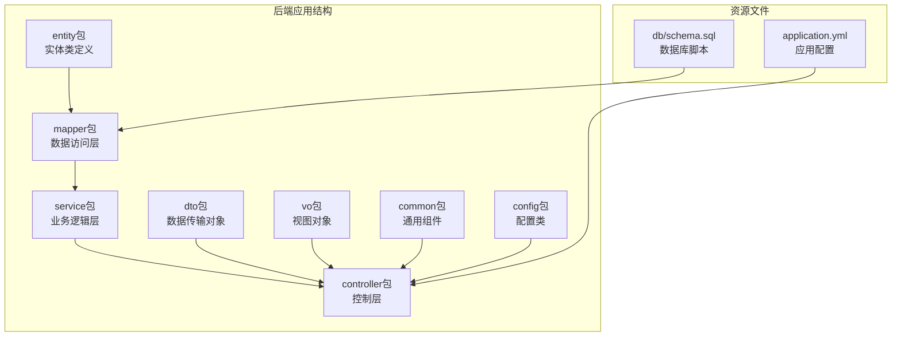
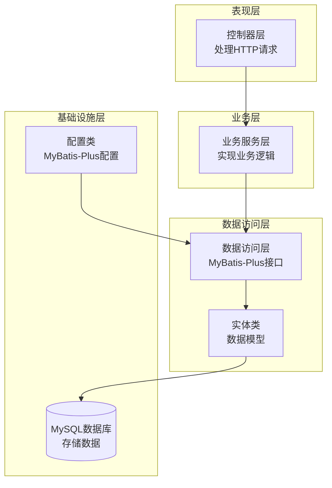
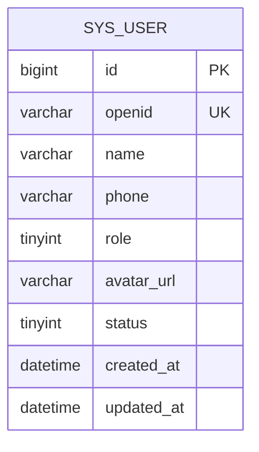
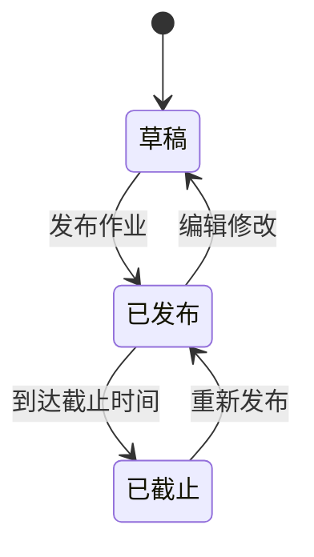
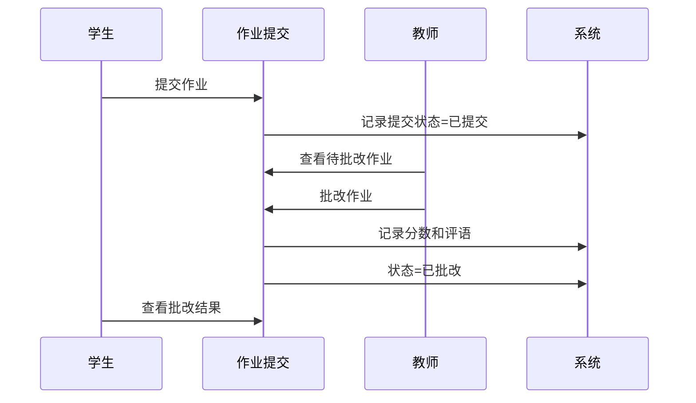
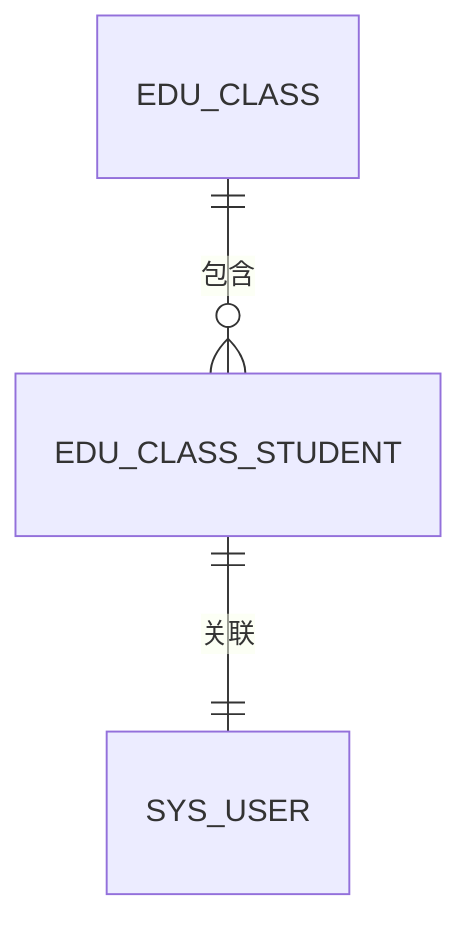
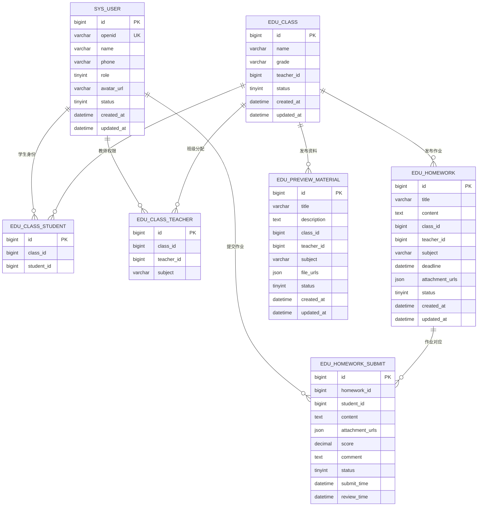

# 数据模型设计

<cite>
**本文引用的文件**
- [SysUser.java](file://helenedu-backend/src/main/java/com/helen/eduedu/entity/SysUser.java)
- [EduClass.java](file://helenedu-backend/src/main/java/com/helen/eduedu/entity/EduClass.java)
- [EduHomework.java](file://helenedu-backend/src/main/java/com/helen/eduedu/entity/EduHomework.java)
- [EduHomeworkSubmit.java](file://helenedu-backend/src/main/java/com/helen/eduedu/entity/EduHomeworkSubmit.java)
- [EduPreviewMaterial.java](file://helenedu-backend/src/main/java/com/helen/eduedu/entity/EduPreviewMaterial.java)
- [EduClassStudent.java](file://helenedu-backend/src/main/java/com/helen/eduedu/entity/EduClassStudent.java)
- [EduClassTeacher.java](file://helenedu-backend/src/main/java/com/helen/eduedu/entity/EduClassTeacher.java)
- [schema.sql](file://helenedu-backend/src/main/resources/db/schema.sql)
- [application.yml](file://helenedu-backend/src/main/resources/application.yml)
- [MyBatisPlusConfig.java](file://helenedu-backend/src/main/java/com/helen/eduedu/config/MyBatisPlusConfig.java)
- [UserRequest.java](file://helenedu-backend/src/main/java/com/helen/eduedu/dto/UserRequest.java)
- [UserVO.java](file://helenedu-backend/src/main/java/com/helen/eduedu/vo/UserVO.java)
- [RoleEnum.java](file://helenedu-backend/src/main/java/com/helen/eduedu/common/RoleEnum.java)
</cite>

## 目录
1. [引言](#引言)
2. [项目结构](#项目结构)
3. [核心组件](#核心组件)
4. [架构概览](#架构概览)
5. [详细组件分析](#详细组件分析)
6. [依赖分析](#依赖分析)
7. [性能考虑](#性能考虑)
8. [故障排除指南](#故障排除指南)
9. [结论](#结论)

## 引言

HelenEdu是一个基于Spring Boot和MyBatis-Plus开发的轻量级作业管理小程序后端系统。本文件专注于系统的数据模型设计，详细解释各个Entity类的字段定义、数据类型、约束条件，以及实体间的复杂关系设计。该系统采用现代化的企业级开发模式，集成了Lombok注解简化代码编写，使用MyBatis-Plus进行数据库操作，并通过Jackson进行JSON序列化和反序列化处理。

## 项目结构

HelenEdu项目采用标准的Maven分层架构，主要包含以下层次：

**图表来源**
- [SysUser.java:1-42](file://helenedu-backend/src/main/java/com/helen/eduedu/entity/SysUser.java#L1-L42)
- [schema.sql:1-94](file://helenedu-backend/src/main/resources/db/schema.sql#L1-L94)

**章节来源**
- [SysUser.java:1-42](file://helenedu-backend/src/main/java/com/helen/eduedu/entity/SysUser.java#L1-L42)
- [EduClass.java:1-36](file://helenedu-backend/src/main/java/com/helen/eduedu/entity/EduClass.java#L1-L36)
- [EduHomework.java:1-52](file://helenedu-backend/src/main/java/com/helen/eduedu/entity/EduHomework.java#L1-L52)
- [EduHomeworkSubmit.java:1-52](file://helenedu-backend/src/main/java/com/helen/eduedu/entity/EduHomeworkSubmit.java#L1-L52)
- [EduPreviewMaterial.java:1-49](file://helenedu-backend/src/main/java/com/helen/eduedu/entity/EduPreviewMaterial.java#L1-L49)
- [EduClassStudent.java:1-24](file://helenedu-backend/src/main/java/com/helen/eduedu/entity/EduClassStudent.java#L1-L24)
- [EduClassTeacher.java:1-27](file://helenedu-backend/src/main/java/com/helen/eduedu/entity/EduClassTeacher.java#L1-L27)

## 核心组件

### 实体类概述

系统包含7个核心实体类，每个都通过Lombok注解简化了代码编写，并通过MyBatis-Plus注解实现数据库映射：

| 实体类 | 数据库表 | 主要用途 |
|--------|----------|----------|
| SysUser | sys_user | 系统用户管理，支持学生、教师、管理员三种角色 |
| EduClass | edu_class | 班级信息管理，包含班级名称、年级、班主任等信息 |
| EduHomework | edu_homework | 作业发布和管理，支持附件上传和截止时间设置 |
| EduHomeworkSubmit | edu_homework_submit | 作业提交和批改，支持评分和评语功能 |
| EduPreviewMaterial | edu_preview_material | 预习资料管理，支持多学科资料发布 |
| EduClassStudent | edu_class_student | 班级-学生关联关系，实现多对多关系 |
| EduClassTeacher | edu_class_teacher | 班级-教师关联关系，支持学科分配 |

**章节来源**
- [SysUser.java:10-42](file://helenedu-backend/src/main/java/com/helen/eduedu/entity/SysUser.java#L10-L42)
- [EduClass.java:10-36](file://helenedu-backend/src/main/java/com/helen/eduedu/entity/EduClass.java#L10-L36)
- [EduHomework.java:13-52](file://helenedu-backend/src/main/java/com/helen/eduedu/entity/EduHomework.java#L13-L52)
- [EduHomeworkSubmit.java:14-52](file://helenedu-backend/src/main/java/com/helen/eduedu/entity/EduHomeworkSubmit.java#L14-L52)
- [EduPreviewMaterial.java:13-49](file://helenedu-backend/src/main/java/com/helen/eduedu/entity/EduPreviewMaterial.java#L13-L49)
- [EduClassStudent.java:8-24](file://helenedu-backend/src/main/java/com/helen/eduedu/entity/EduClassStudent.java#L8-L24)
- [EduClassTeacher.java:8-27](file://helenedu-backend/src/main/java/com/helen/eduedu/entity/EduClassTeacher.java#L8-L27)

## 架构概览

系统采用分层架构设计，实现了清晰的关注点分离：

**图表来源**
- [MyBatisPlusConfig.java:9-22](file://helenedu-backend/src/main/java/com/helen/eduedu/config/MyBatisPlusConfig.java#L9-L22)
- [SysUser.java:3-6](file://helenedu-backend/src/main/java/com/helen/eduedu/entity/SysUser.java#L3-L6)

## 详细组件分析

### SysUser用户实体

SysUser是系统的核心用户实体，支持三种角色：学生、教师、管理员。

#### 字段定义与约束

| 字段名 | 数据类型 | 约束条件 | 描述 |
|--------|----------|----------|------|
| id | Long | 主键，自增 | 用户唯一标识 |
| openid | String | 唯一，可空 | 微信OpenID，用于第三方登录 |
| name | String | 非空 | 用户姓名 |
| phone | String | 可空 | 手机号码 |
| role | Integer | 非空 | 用户角色：1-学生，2-教师，3-管理员 |
| avatarUrl | String | 可空 | 头像URL地址 |
| status | Integer | 默认1，非空 | 用户状态：0-禁用，1-启用 |
| createdAt | LocalDateTime | 默认当前时间 | 创建时间 |
| updatedAt | LocalDateTime | 默认当前时间，自动更新 | 更新时间 |

#### Lombok注解使用

- **@Data**: 自动生成getter、setter、toString、equals和hashCode方法
- **@TableName**: 指定数据库表名为"sys_user"
- **@TableId**: 指定主键字段和自增策略

#### 数据库映射关系

**图表来源**
- [SysUser.java:17-40](file://helenedu-backend/src/main/java/com/helen/eduedu/entity/SysUser.java#L17-L40)
- [schema.sql:6-16](file://helenedu-backend/src/main/resources/db/schema.sql#L6-L16)

**章节来源**
- [SysUser.java:10-42](file://helenedu-backend/src/main/java/com/helen/eduedu/entity/SysUser.java#L10-L42)
- [schema.sql:6-16](file://helenedu-backend/src/main/resources/db/schema.sql#L6-L16)

### EduClass班级实体

EduClass管理班级基本信息和状态。

#### 字段定义与约束

| 字段名 | 数据类型 | 约束条件 | 描述 |
|--------|----------|----------|------|
| id | Long | 主键，自增 | 班级唯一标识 |
| name | String | 非空 | 班级名称 |
| grade | String | 可空 | 年级信息 |
| teacherId | Long | 可空 | 班主任用户ID |
| status | Integer | 默认1，非空 | 班级状态：0-解散，1-正常 |
| createdAt | LocalDateTime | 默认当前时间 | 创建时间 |
| updatedAt | LocalDateTime | 默认当前时间，自动更新 | 更新时间 |

#### 关系设计

班级实体与用户实体存在一对多关系：
- 一个教师可以担任多个班级的班主任
- 一个班级只能有一个班主任

**章节来源**
- [EduClass.java:10-36](file://helenedu-backend/src/main/java/com/helen/eduedu/entity/EduClass.java#L10-L36)
- [schema.sql:18-27](file://helenedu-backend/src/main/resources/db/schema.sql#L18-L27)

### EduHomework作业实体

EduHomework负责作业的发布和管理，支持复杂的多媒体内容。

#### 字段定义与约束

| 字段名 | 数据类型 | 约束条件 | 描述 |
|--------|----------|----------|------|
| id | Long | 主键，自增 | 作业唯一标识 |
| title | String | 非空 | 作业标题 |
| content | String | 可空 | 作业内容或要求 |
| classId | Long | 非空 | 所属班级ID |
| teacherId | Long | 非空 | 布置教师ID |
| subject | String | 可空 | 学科名称 |
| deadline | LocalDateTime | 可空 | 截止时间 |
| attachmentUrls | List<String> | JSON类型 | 附件URL列表 |
| status | Integer | 默认1，非空 | 状态：0-草稿，1-已发布，2-已截止 |
| createdAt | LocalDateTime | 默认当前时间 | 创建时间 |
| updatedAt | LocalDateTime | 默认当前时间，自动更新 | 更新时间 |

#### JSON序列化处理

使用**@TableField(typeHandler = JacksonTypeHandler.class)**注解实现List<String>到JSON的自动转换。

#### 状态流程

**图表来源**
- [EduHomework.java:42-46](file://helenedu-backend/src/main/java/com/helen/eduedu/entity/EduHomework.java#L42-L46)

**章节来源**
- [EduHomework.java:13-52](file://helenedu-backend/src/main/java/com/helen/eduedu/entity/EduHomework.java#L13-L52)
- [schema.sql:46-59](file://helenedu-backend/src/main/resources/db/schema.sql#L46-L59)

### EduHomeworkSubmit作业提交实体

EduHomeworkSubmit管理学生的作业提交和教师的批改过程。

#### 字段定义与约束

| 字段名 | 数据类型 | 约束条件 | 描述 |
|--------|----------|----------|------|
| id | Long | 主键，自增 | 提交记录唯一标识 |
| homeworkId | Long | 非空 | 作业ID |
| studentId | Long | 非空 | 学生ID |
| content | String | 可空 | 提交内容 |
| attachmentUrls | List<String> | JSON类型 | 附件URL列表 |
| score | BigDecimal | 可空 | 分数，最多5位数字，2位小数 |
| comment | String | 可空 | 教师评语 |
| status | Integer | 默认0，非空 | 状态：0-已提交，1-已批改，2-已退回 |
| submitTime | LocalDateTime | 默认当前时间 | 提交时间 |
| reviewTime | LocalDateTime | 可空 | 批改时间 |

#### 唯一性约束

通过**UNIQUE KEY uk_hw_student (homework_id, student_id)**确保每个学生对同一作业只能提交一次。

#### 提交流程

**图表来源**
- [EduHomeworkSubmit.java:43-44](file://helenedu-backend/src/main/java/com/helen/eduedu/entity/EduHomeworkSubmit.java#L43-L44)

**章节来源**
- [EduHomeworkSubmit.java:14-52](file://helenedu-backend/src/main/java/com/helen/eduedu/entity/EduHomeworkSubmit.java#L14-L52)
- [schema.sql:61-74](file://helenedu-backend/src/main/resources/db/schema.sql#L61-L74)

### EduPreviewMaterial预习资料实体

EduPreviewMaterial管理各学科的预习资料发布。

#### 字段定义与约束

| 字段名 | 数据类型 | 约束条件 | 描述 |
|--------|----------|----------|------|
| id | Long | 主键，自增 | 资料唯一标识 |
| title | String | 非空 | 资料标题 |
| description | String | 可空 | 资料描述 |
| classId | Long | 非空 | 所属班级ID |
| teacherId | Long | 非空 | 发布教师ID |
| subject | String | 可空 | 学科名称 |
| fileUrls | List<String> | JSON类型 | 文件URL列表 |
| status | Integer | 默认1，非空 | 状态：0-下架，1-发布 |
| createdAt | LocalDateTime | 默认当前时间 | 创建时间 |
| updatedAt | LocalDateTime | 默认当前时间，自动更新 | 更新时间 |

#### 状态管理

预习资料采用发布-下架的状态管理模式，支持教师随时调整资料的可见性。

**章节来源**
- [EduPreviewMaterial.java:13-49](file://helenedu-backend/src/main/java/com/helen/eduedu/entity/EduPreviewMaterial.java#L13-L49)
- [schema.sql:76-88](file://helenedu-backend/src/main/resources/db/schema.sql#L76-L88)

### EduClassStudent班级学生关联实体

EduClassStudent实现班级与学生之间的多对多关系。

#### 字段定义与约束

| 字段名 | 数据类型 | 约束条件 | 描述 |
|--------|----------|----------|------|
| id | Long | 主键，自增 | 关联记录唯一标识 |
| classId | Long | 非空 | 班级ID |
| studentId | Long | 非空 | 学生ID |

#### 唯一性约束

通过**UNIQUE KEY uk_class_student (class_id, student_id)**确保一个学生只能加入同一个班级一次。

#### 关系映射

**图表来源**
- [EduClassStudent.java:18-22](file://helenedu-backend/src/main/java/com/helen/eduedu/entity/EduClassStudent.java#L18-L22)
- [schema.sql:29-35](file://helenedu-backend/src/main/resources/db/schema.sql#L29-L35)

**章节来源**
- [EduClassStudent.java:8-24](file://helenedu-backend/src/main/java/com/helen/eduedu/entity/EduClassStudent.java#L8-L24)
- [schema.sql:29-35](file://helenedu-backend/src/main/resources/db/schema.sql#L29-L35)

### EduClassTeacher班级教师关联实体

EduClassTeacher管理班级与教师的多对多关系，支持学科分配。

#### 字段定义与约束

| 字段名 | 数据类型 | 约束条件 | 描述 |
|--------|----------|----------|------|
| id | Long | 主键，自增 | 关联记录唯一标识 |
| classId | Long | 非空 | 班级ID |
| teacherId | Long | 非空 | 教师ID |
| subject | String | 可空 | 授课学科 |

#### 唯一性约束

通过**UNIQUE KEY uk_class_teacher (class_id, teacher_id)**确保一个教师在同一班级只能教授一次。

#### 学科管理

支持为不同学科分配专门的教师，实现精细化的教学管理。

**章节来源**
- [EduClassTeacher.java:8-27](file://helenedu-backend/src/main/java/com/helen/eduedu/entity/EduClassTeacher.java#L8-L27)
- [schema.sql:37-44](file://helenedu-backend/src/main/resources/db/schema.sql#L37-L44)

## 依赖分析

### 数据库表关系图

**图表来源**
- [schema.sql:5-88](file://helenedu-backend/src/main/resources/db/schema.sql#L5-L88)

### 实体间关系设计

系统实现了多种关系模式：

#### 一对一关系
- SysUser与EduClassTeacher：一个教师可以有多个教学班级，但每个班级只有一个班主任

#### 一对多关系
- EduClass → EduClassStudent：一个班级包含多个学生
- EduClass → EduClassTeacher：一个班级分配给多个教师
- EduClass → EduHomework：一个班级发布多份作业
- EduClass → EduPreviewMaterial：一个班级发布多份预习资料
- SysUser → EduHomeworkSubmit：一个学生提交多份作业

#### 多对多关系
- EduClass ↔ EduClassStudent：通过中间表实现
- EduClass ↔ EduClassTeacher：通过中间表实现

**章节来源**
- [schema.sql:29-44](file://helenedu-backend/src/main/resources/db/schema.sql#L29-L44)

## 性能考虑

### 数据库优化策略

1. **索引设计**
   - 主键索引：所有表的主键自动创建
   - 唯一索引：用户OpenID、班级-学生组合、班级-教师组合
   - 时间索引：createdAt、deadline等常用查询字段

2. **JSON字段优化**
   - 使用MySQL 5.7+的JSON类型存储数组数据
   - 通过JacksonTypeHandler实现高效的序列化/反序列化

3. **分页查询**
   - 集成MyBatis-Plus分页插件，支持大数据量场景
   - 配置MySQL分页内核，优化查询性能

### 序列化性能

系统采用以下策略优化JSON处理：

- **Jackson配置**：统一的时间格式、时区设置、空值过滤
- **类型处理器**：针对List类型的专用JacksonTypeHandler
- **懒加载策略**：避免不必要的关联数据加载

## 故障排除指南

### 常见问题及解决方案

#### 1. 数据库连接问题
**症状**：启动时报数据库连接失败
**原因**：数据库配置错误或MySQL服务未启动
**解决**：检查application.yml中的数据库连接参数

#### 2. JSON序列化异常
**症状**：List字段无法正确序列化为JSON
**原因**：缺少JacksonTypeHandler配置
**解决**：确保@Entity类中正确使用@TableField注解

#### 3. 唯一约束冲突
**症状**：插入数据时报唯一约束错误
**原因**：重复的班级-学生或班级-教师组合
**解决**：在业务层添加去重逻辑

#### 4. Lombok注解失效
**症状**：编译时报找不到getter/setter方法
**原因**：IDE未启用注解处理器
**解决**：在IDE设置中启用Lombok支持

**章节来源**
- [application.yml:6-11](file://helenedu-backend/src/main/resources/application.yml#L6-L11)
- [MyBatisPlusConfig.java:15-20](file://helenedu-backend/src/main/java/com/helen/eduedu/config/MyBatisPlusConfig.java#L15-L20)

## 结论

HelenEdu的数据模型设计体现了现代企业级应用的最佳实践：

1. **清晰的分层架构**：通过实体类、数据访问层、业务层的明确分工，实现了高内聚低耦合的设计

2. **完善的约束机制**：通过数据库层面的约束和业务逻辑的验证，确保了数据的完整性和一致性

3. **灵活的关系设计**：支持复杂的多对多关系，满足教育管理的多样化需求

4. **高效的性能优化**：通过合理的索引设计、JSON字段优化和分页查询，提升了系统的整体性能

5. **良好的扩展性**：模块化的架构设计为未来的功能扩展奠定了坚实基础

该数据模型为HelenEdu系统的稳定运行提供了可靠的数据支撑，为后续的功能开发和维护提供了清晰的指导框架。