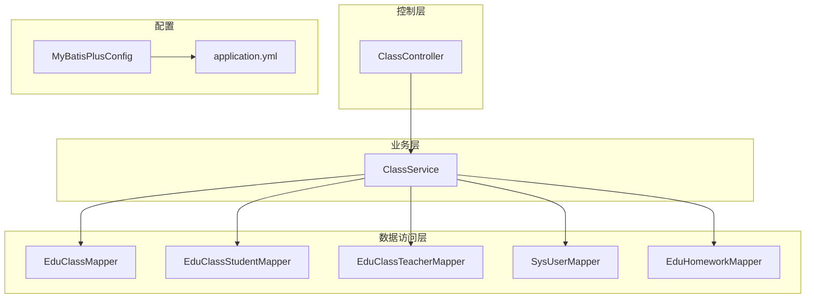
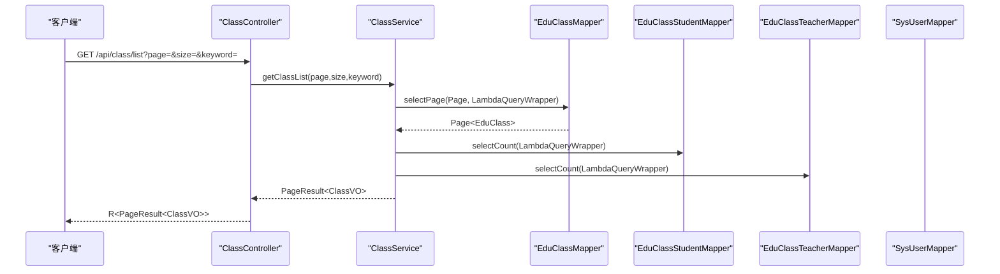
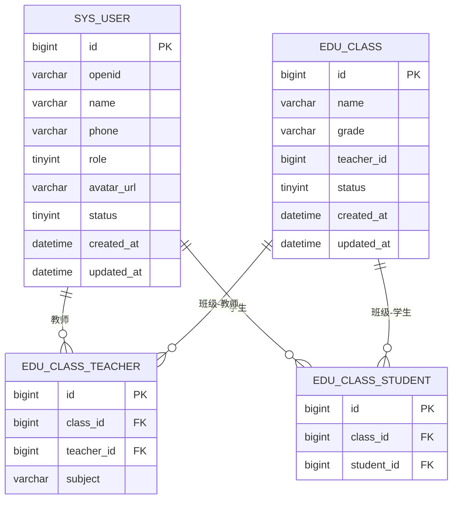
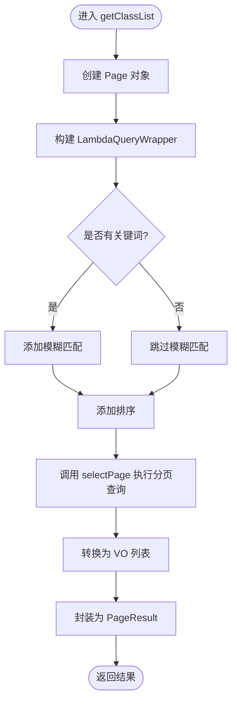
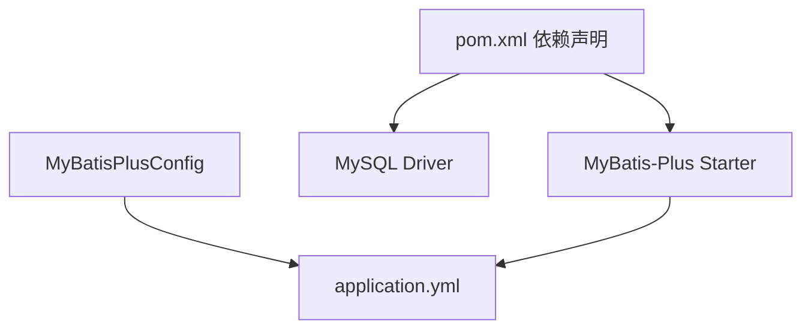

# 数据访问层设计

<cite>
**本文引用的文件**
- [EduClassMapper.java](file://helenedu-backend/src/main/java/com/helen/eduedu/mapper/EduClassMapper.java)
- [EduClassStudentMapper.java](file://helenedu-backend/src/main/java/com/helen/eduedu/mapper/EduClassStudentMapper.java)
- [EduClassTeacherMapper.java](file://helenedu-backend/src/main/java/com/helen/eduedu/mapper/EduClassTeacherMapper.java)
- [SysUserMapper.java](file://helenedu-backend/src/main/java/com/helen/eduedu/mapper/SysUserMapper.java)
- [EduHomeworkMapper.java](file://helenedu-backend/src/main/java/com/helen/eduedu/mapper/EduHomeworkMapper.java)
- [MyBatisPlusConfig.java](file://helenedu-backend/src/main/java/com/helen/eduedu/config/MyBatisPlusConfig.java)
- [PageResult.java](file://helenedu-backend/src/main/java/com/helen/eduedu/common/PageResult.java)
- [application.yml](file://helenedu-backend/src/main/resources/application.yml)
- [schema.sql](file://helenedu-backend/src/main/resources/db/schema.sql)
- [ClassService.java](file://helenedu-backend/src/main/java/com/helen/eduedu/service/ClassService.java)
- [ClassController.java](file://helenedu-backend/src/main/java/com/helen/eduedu/controller/ClassController.java)
- [pom.xml](file://helenedu-backend/pom.xml)
</cite>

## 目录
1. [简介](#简介)
2. [项目结构](#项目结构)
3. [核心组件](#核心组件)
4. [架构总览](#架构总览)
5. [详细组件分析](#详细组件分析)
6. [依赖分析](#依赖分析)
7. [性能考虑](#性能考虑)
8. [故障排查指南](#故障排查指南)
9. [结论](#结论)
10. [附录](#附录)

## 简介
本设计文档聚焦于 HelenEdu 的数据访问层（DAO 层），系统性阐述 MyBatis-Plus 在项目中的应用方式，包括通用 Mapper 接口的继承、基础 CRUD 的实现、条件构造器的使用；明确各 Mapper 的设计原则（命名规范、方法定义、SQL 映射关系）；解析多对多关联表 Mapper 的设计思路（如 EduClassStudentMapper、EduClassTeacherMapper）；说明分页查询的实现流程（Page 对象、分页参数传递、结果集处理）；给出 SQL 优化与索引设计建议；最后总结数据访问层与业务层的交互模式及事务管理最佳实践。

## 项目结构
后端采用 Spring Boot + MyBatis-Plus 架构，数据访问层位于 mapper 包，实体类位于 entity 包，业务层位于 service 包，控制层位于 controller 包。MyBatis-Plus 通过全局配置启用分页插件，并在 application.yml 中统一配置数据源、驼峰映射与逻辑删除字段等。

图表来源
- [MyBatisPlusConfig.java:12-21](file://helenedu-backend/src/main/java/com/helen/eduedu/config/MyBatisPlusConfig.java#L12-L21)
- [application.yml:21-31](file://helenedu-backend/src/main/resources/application.yml#L21-L31)
- [ClassController.java:27-128](file://helenedu-backend/src/main/java/com/helen/eduedu/controller/ClassController.java#L27-L128)
- [ClassService.java:27-261](file://helenedu-backend/src/main/java/com/helen/eduedu/service/ClassService.java#L27-L261)

章节来源
- [MyBatisPlusConfig.java:12-21](file://helenedu-backend/src/main/java/com/helen/eduedu/config/MyBatisPlusConfig.java#L12-L21)
- [application.yml:21-31](file://helenedu-backend/src/main/resources/application.yml#L21-L31)
- [ClassController.java:27-128](file://helenedu-backend/src/main/java/com/helen/eduedu/controller/ClassController.java#L27-L128)
- [ClassService.java:27-261](file://helenedu-backend/src/main/java/com/helen/eduedu/service/ClassService.java#L27-L261)

## 核心组件
- 通用 Mapper 接口：所有实体对应的 Mapper 均继承自 MyBatis-Plus 的 BaseMapper，自动获得基础 CRUD 能力，无需编写 XML。
- 条件构造器：广泛使用 LambdaQueryWrapper 进行类型安全的动态查询构建。
- 分页插件：通过 MyBatisPlusInterceptor 注入 PaginationInnerInterceptor，支持 MySQL。
- 分页结果封装：PageResult 封装 total、page、size、records 字段，便于前端分页展示。
- 实体与表映射：实体类使用注解标注表名与主键策略，实现自动驼峰映射与逻辑删除字段识别。

章节来源
- [EduClassMapper.java:7-9](file://helenedu-backend/src/main/java/com/helen/eduedu/mapper/EduClassMapper.java#L7-L9)
- [EduClassStudentMapper.java:7-9](file://helenedu-backend/src/main/java/com/helen/eduedu/mapper/EduClassStudentMapper.java#L7-L9)
- [EduClassTeacherMapper.java:7-9](file://helenedu-backend/src/main/java/com/helen/eduedu/mapper/EduClassTeacherMapper.java#L7-L9)
- [MyBatisPlusConfig.java:15-20](file://helenedu-backend/src/main/java/com/helen/eduedu/config/MyBatisPlusConfig.java#L15-L20)
- [PageResult.java:10-24](file://helenedu-backend/src/main/java/com/helen/eduedu/common/PageResult.java#L10-L24)
- [application.yml:21-31](file://helenedu-backend/src/main/resources/application.yml#L21-L31)

## 架构总览
数据访问层围绕 MyBatis-Plus 的通用 Mapper 与条件构造器展开，业务层通过组合多个 Mapper 完成复杂查询与事务控制，控制层负责参数接收与响应封装。

图表来源
- [ClassController.java:54-61](file://helenedu-backend/src/main/java/com/helen/eduedu/controller/ClassController.java#L54-L61)
- [ClassService.java:75-92](file://helenedu-backend/src/main/java/com/helen/eduedu/service/ClassService.java#L75-L92)
- [EduClassMapper.java:7-9](file://helenedu-backend/src/main/java/com/helen/eduedu/mapper/EduClassMapper.java#L7-L9)
- [EduClassStudentMapper.java:7-9](file://helenedu-backend/src/main/java/com/helen/eduedu/mapper/EduClassStudentMapper.java#L7-L9)
- [EduClassTeacherMapper.java:7-9](file://helenedu-backend/src/main/java/com/helen/eduedu/mapper/EduClassTeacherMapper.java#L7-L9)

## 详细组件分析

### 通用 Mapper 设计原则
- 命名规范：Mapper 接口以实体名 + Mapper 结尾，例如 EduClassMapper、EduClassStudentMapper。
- 继承 BaseMapper：所有 Mapper 直接继承 BaseMapper<Entity>，即可获得 insert、deleteById、updateById、selectById、selectList、selectPage 等通用方法。
- 注解与扫描：使用 @Mapper 注解标识 Mapper 接口；结合 application.yml 的 mapper-locations 自动扫描 XML（若使用 XML）。
- 实体映射：实体类使用 @TableName、@TableId 等注解，确保表名与主键策略正确映射；application.yml 开启下划线转驼峰映射。

章节来源
- [EduClassMapper.java:7-9](file://helenedu-backend/src/main/java/com/helen/eduedu/mapper/EduClassMapper.java#L7-L9)
- [EduClassStudentMapper.java:7-9](file://helenedu-backend/src/main/java/com/helen/eduedu/mapper/EduClassStudentMapper.java#L7-L9)
- [EduClassTeacherMapper.java:7-9](file://helenedu-backend/src/main/java/com/helen/eduedu/mapper/EduClassTeacherMapper.java#L7-L9)
- [application.yml:21-25](file://helenedu-backend/src/main/resources/application.yml#L21-L25)

### 条件构造器与查询实现
- 类型安全：使用 LambdaQueryWrapper 构建查询条件，避免硬编码字符串，降低出错概率。
- 动态过滤：根据 keyword 参数进行模糊匹配；默认按创建时间倒序排列。
- 复合查询：在业务层组合多个 Mapper 的查询结果，如统计学生数、教师数，或关联用户表获取教师姓名。

章节来源
- [ClassService.java:76-85](file://helenedu-backend/src/main/java/com/helen/eduedu/service/ClassService.java#L76-L85)
- [ClassService.java:108-121](file://helenedu-backend/src/main/java/com/helen/eduedu/service/ClassService.java#L108-L121)
- [ClassService.java:159-172](file://helenedu-backend/src/main/java/com/helen/eduedu/service/ClassService.java#L159-L172)

### 关联表 Mapper 设计（多对多）
- EduClassStudentMapper：用于维护班级与学生的多对多关系，提供按 classId 或 studentId 的查询、插入与删除能力。
- EduClassTeacherMapper：用于维护班级与教师的多对多关系，提供按 classId 或 teacherId 的查询、插入与删除能力。
- 唯一约束：数据库层面在关联表上建立唯一索引（class_id, student_id）与（class_id, teacher_id），防止重复添加成员。
- 业务层校验：在添加成员前先查询是否存在，避免重复添加。

图表来源
- [schema.sql:29-44](file://helenedu-backend/src/main/resources/db/schema.sql#L29-L44)
- [EduClassStudentMapper.java:7-9](file://helenedu-backend/src/main/java/com/helen/eduedu/mapper/EduClassStudentMapper.java#L7-L9)
- [EduClassTeacherMapper.java:7-9](file://helenedu-backend/src/main/java/com/helen/eduedu/mapper/EduClassTeacherMapper.java#L7-L9)

章节来源
- [schema.sql:29-44](file://helenedu-backend/src/main/resources/db/schema.sql#L29-L44)
- [ClassService.java:127-142](file://helenedu-backend/src/main/java/com/helen/eduedu/service/ClassService.java#L127-L142)
- [ClassService.java:177-193](file://helenedu-backend/src/main/java/com/helen/eduedu/service/ClassService.java#L177-L193)

### 分页查询实现
- Page 对象：在业务层构造 Page<EduClass>(page, size)，作为分页参数传入 Mapper 的 selectPage。
- 条件构造：配合 LambdaQueryWrapper 设置过滤条件与排序规则。
- 结果封装：将实体记录转换为 VO 列表，再封装为 PageResult，包含 total、page、size、records。

图表来源
- [ClassService.java:75-92](file://helenedu-backend/src/main/java/com/helen/eduedu/service/ClassService.java#L75-L92)
- [PageResult.java:10-24](file://helenedu-backend/src/main/java/com/helen/eduedu/common/PageResult.java#L10-L24)

章节来源
- [ClassService.java:75-92](file://helenedu-backend/src/main/java/com/helen/eduedu/service/ClassService.java#L75-L92)
- [PageResult.java:10-24](file://helenedu-backend/src/main/java/com/helen/eduedu/common/PageResult.java#L10-L24)

### 数据访问层与业务逻辑层交互模式
- 控制器接收请求参数，调用业务层方法。
- 业务层组合多个 Mapper 完成复杂查询与写操作，必要时开启事务。
- 业务层负责数据转换（实体到 VO）、统计计算与异常处理。
- 控制器将业务层返回的结果封装为统一响应格式。

章节来源
- [ClassController.java:54-61](file://helenedu-backend/src/main/java/com/helen/eduedu/controller/ClassController.java#L54-L61)
- [ClassService.java:27-261](file://helenedu-backend/src/main/java/com/helen/eduedu/service/ClassService.java#L27-L261)

### 事务管理最佳实践
- 使用 @Transactional 标注需要保证一致性的方法，如创建/更新/删除班级、添加/移除成员等。
- 将多个 Mapper 的读写操作放在同一事务内，避免部分成功导致的数据不一致。
- 对外暴露的业务方法应尽量保持幂等性与可回滚性。

章节来源
- [ClassService.java:37-44](file://helenedu-backend/src/main/java/com/helen/eduedu/service/ClassService.java#L37-L44)
- [ClassService.java:49-57](file://helenedu-backend/src/main/java/com/helen/eduedu/service/ClassService.java#L49-L57)
- [ClassService.java:62-71](file://helenedu-backend/src/main/java/com/helen/eduedu/service/ClassService.java#L62-L71)
- [ClassService.java:126-142](file://helenedu-backend/src/main/java/com/helen/eduedu/service/ClassService.java#L126-L142)
- [ClassService.java:147-154](file://helenedu-backend/src/main/java/com/helen/eduedu/service/ClassService.java#L147-L154)
- [ClassService.java:177-193](file://helenedu-backend/src/main/java/com/helen/eduedu/service/ClassService.java#L177-L193)
- [ClassService.java:198-205](file://helenedu-backend/src/main/java/com/helen/eduedu/service/ClassService.java#L198-L205)

## 依赖分析
- MyBatis-Plus 版本：3.5.5；Spring Boot 3.x Starter。
- 数据库驱动：MySQL Connector/J。
- 逻辑删除：通过全局配置指定逻辑删除字段与值。
- 分页插件：PaginationInnerInterceptor（MySQL）。

图表来源
- [pom.xml:40-52](file://helenedu-backend/pom.xml#L40-L52)
- [MyBatisPlusConfig.java:15-20](file://helenedu-backend/src/main/java/com/helen/eduedu/config/MyBatisPlusConfig.java#L15-L20)
- [application.yml:21-31](file://helenedu-backend/src/main/resources/application.yml#L21-L31)

章节来源
- [pom.xml:20-25](file://helenedu-backend/pom.xml#L20-L25)
- [pom.xml:40-52](file://helenedu-backend/pom.xml#L40-L52)
- [MyBatisPlusConfig.java:15-20](file://helenedu-backend/src/main/java/com/helen/eduedu/config/MyBatisPlusConfig.java#L15-L20)
- [application.yml:21-31](file://helenedu-backend/src/main/resources/application.yml#L21-L31)

## 性能考虑
- 索引设计
  - 关联表唯一索引：edu_class_student(class_id, student_id)、edu_class_teacher(class_id, teacher_id)，用于去重与快速查找。
  - 建议在常用过滤字段（如 class_id、student_id、teacher_id）上建立单列索引，提升查询效率。
- SQL 优化
  - 使用 selectCount 与 selectList 替代全表扫描，减少不必要的数据传输。
  - 合理使用分页，避免一次性加载大量数据。
  - 在业务层进行必要的聚合统计（如统计人数），减少 N+1 查询风险。
- 逻辑删除
  - 全局配置逻辑删除字段与值，避免物理删除带来的维护成本与数据丢失风险。
- 日志与监控
  - application.yml 中开启日志输出，便于定位慢查询与异常。

章节来源
- [schema.sql:34](file://helenedu-backend/src/main/resources/db/schema.sql#L34)
- [schema.sql:43](file://helenedu-backend/src/main/resources/db/schema.sql#L43)
- [application.yml:29-31](file://helenedu-backend/src/main/resources/application.yml#L29-L31)

## 故障排查指南
- 分页无效
  - 检查 MyBatisPlusInterceptor 是否正确注入 PaginationInnerInterceptor（MySQL）。
  - 确认 Page 对象参数是否正确传入 selectPage。
- 查询结果为空
  - 检查 LambdaQueryWrapper 条件是否合理，特别是状态字段与关键字过滤。
  - 确认实体注解与表名映射是否一致。
- 事务未生效
  - 确认方法被 @Transactional 标注且为 public。
  - 检查异常是否被捕获导致事务未回滚。
- 逻辑删除误删
  - 确认 application.yml 中逻辑删除字段与值配置正确，避免误删真实数据。

章节来源
- [MyBatisPlusConfig.java:15-20](file://helenedu-backend/src/main/java/com/helen/eduedu/config/MyBatisPlusConfig.java#L15-L20)
- [ClassService.java:75-92](file://helenedu-backend/src/main/java/com/helen/eduedu/service/ClassService.java#L75-L92)
- [application.yml:21-31](file://helenedu-backend/src/main/resources/application.yml#L21-L31)

## 结论
本项目的数据访问层基于 MyBatis-Plus 的通用 Mapper 与条件构造器，实现了简洁高效的 CRUD 与分页查询；通过合理的实体映射、唯一索引与逻辑删除配置，保障了数据一致性与可维护性；业务层通过组合多个 Mapper 完成复杂场景，并以事务管理确保数据完整性。遵循本文的命名规范、查询设计与性能优化建议，可进一步提升系统的稳定性与扩展性。

## 附录
- Mapper 接口一览
  - EduClassMapper：班级实体的通用 CRUD。
  - EduClassStudentMapper：班级-学生关联的通用 CRUD。
  - EduClassTeacherMapper：班级-教师关联的通用 CRUD。
  - SysUserMapper：用户实体的通用 CRUD。
  - EduHomeworkMapper：作业实体的通用 CRUD。
- 实体与表映射
  - EduClass → edu_class
  - EduClassStudent → edu_class_student
  - EduClassTeacher → edu_class_teacher
  - SysUser → sys_user
  - EduHomework → edu_homework

章节来源
- [EduClassMapper.java:7-9](file://helenedu-backend/src/main/java/com/helen/eduedu/mapper/EduClassMapper.java#L7-L9)
- [EduClassStudentMapper.java:7-9](file://helenedu-backend/src/main/java/com/helen/eduedu/mapper/EduClassStudentMapper.java#L7-L9)
- [EduClassTeacherMapper.java:7-9](file://helenedu-backend/src/main/java/com/helen/eduedu/mapper/EduClassTeacherMapper.java#L7-L9)
- [SysUserMapper.java:7-9](file://helenedu-backend/src/main/java/com/helen/eduedu/mapper/SysUserMapper.java#L7-L9)
- [EduHomeworkMapper.java:7-9](file://helenedu-backend/src/main/java/com/helen/eduedu/mapper/EduHomeworkMapper.java#L7-L9)
- [schema.sql:18-88](file://helenedu-backend/src/main/resources/db/schema.sql#L18-L88)