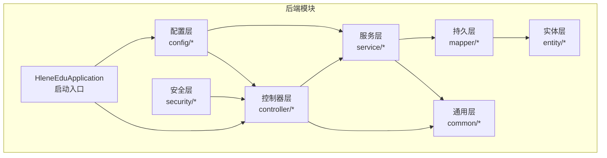
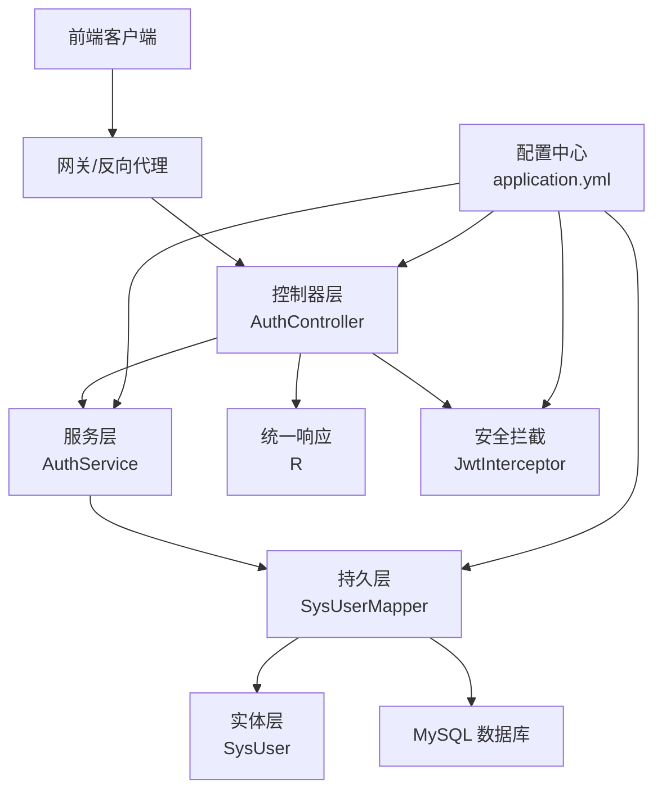
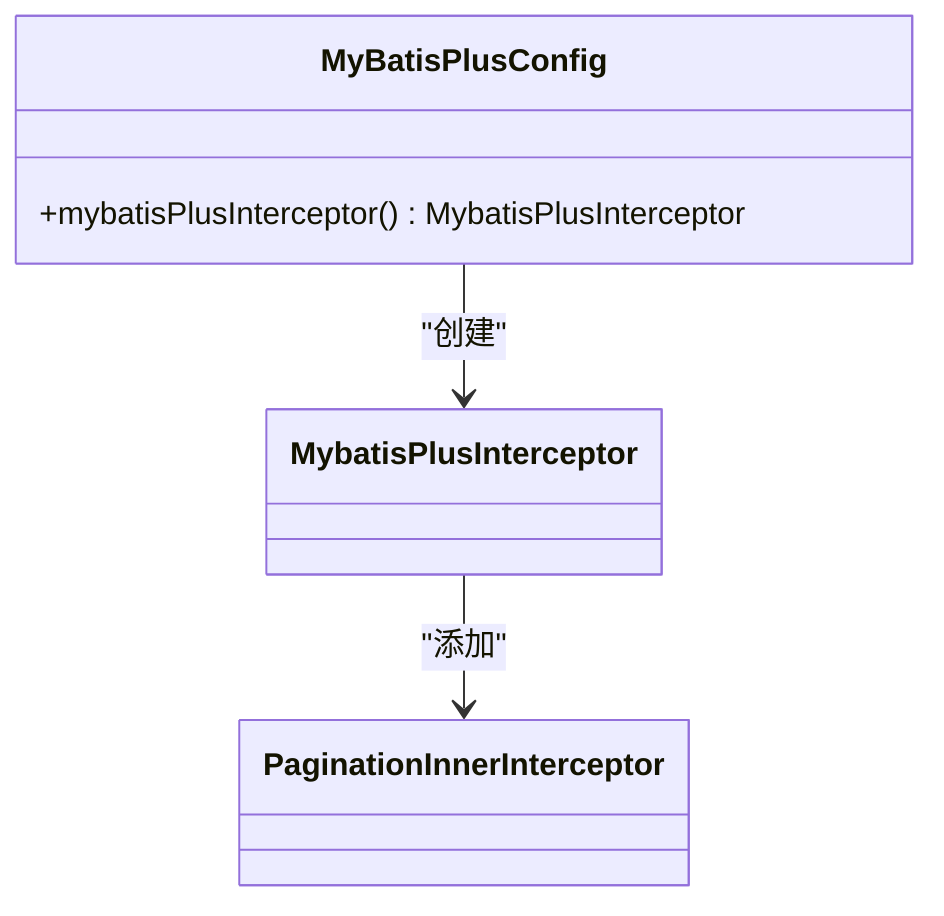
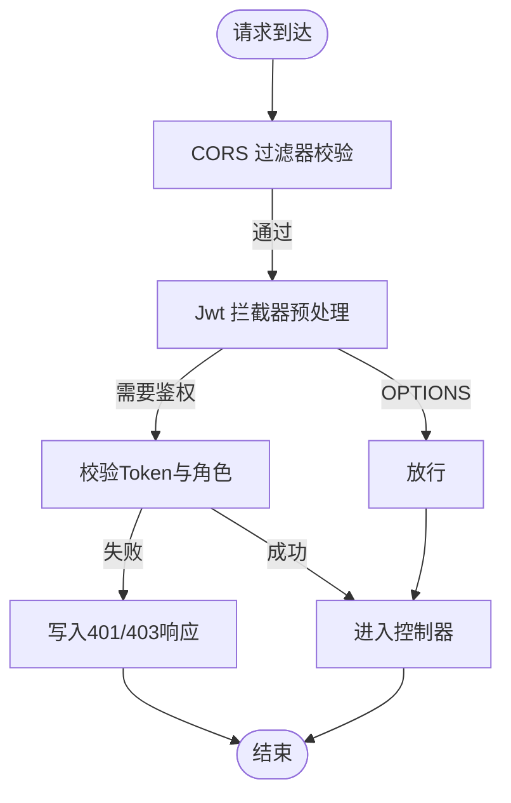
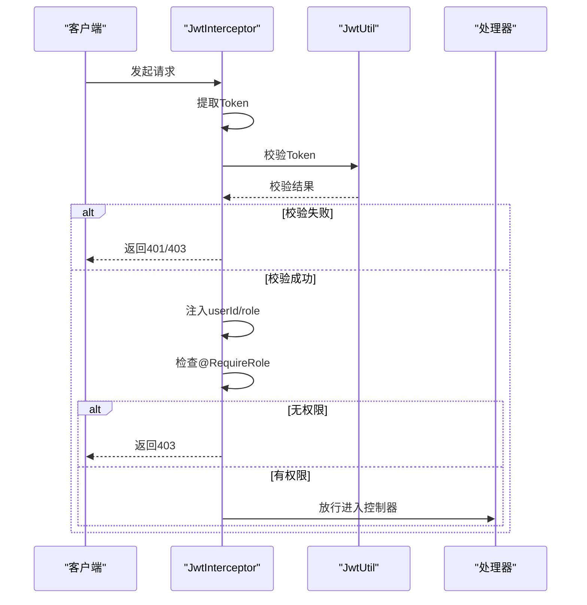
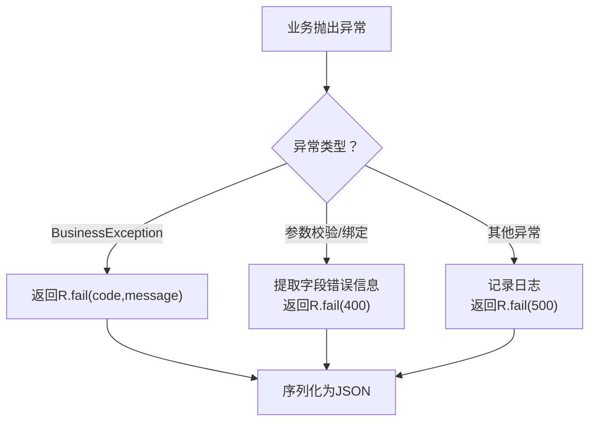
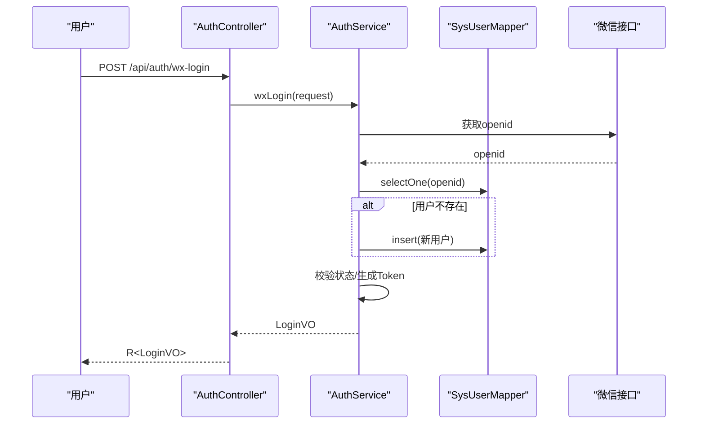
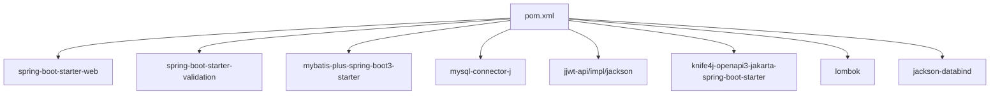

# 核心架构设计

<cite>
**本文引用的文件**
- [HleneEduApplication.java](file://helenedu-backend/src/main/java/com/helen/eduedu/HleneEduApplication.java)
- [application.yml](file://helenedu-backend/src/main/resources/application.yml)
- [MyBatisPlusConfig.java](file://helenedu-backend/src/main/java/com/helen/eduedu/config/MyBatisPlusConfig.java)
- [CorsConfig.java](file://helenedu-backend/src/main/java/com/helen/eduedu/config/CorsConfig.java)
- [WebMvcConfig.java](file://helenedu-backend/src/main/java/com/helen/eduedu/config/WebMvcConfig.java)
- [JwtInterceptor.java](file://helenedu-backend/src/main/java/com/helen/eduedu/security/JwtInterceptor.java)
- [RequireRole.java](file://helenedu-backend/src/main/java/com/helen/eduedu/security/RequireRole.java)
- [GlobalExceptionHandler.java](file://helenedu-backend/src/main/java/com/helen/eduedu/common/GlobalExceptionHandler.java)
- [R.java](file://helenedu-backend/src/main/java/com/helen/eduedu/common/R.java)
- [RoleEnum.java](file://helenedu-backend/src/main/java/com/helen/eduedu/common/RoleEnum.java)
- [SysUser.java](file://helenedu-backend/src/main/java/com/helen/eduedu/entity/SysUser.java)
- [SysUserMapper.java](file://helenedu-backend/src/main/java/com/helen/eduedu/mapper/SysUserMapper.java)
- [AuthService.java](file://helenedu-backend/src/main/java/com/helen/eduedu/service/AuthService.java)
- [AuthController.java](file://helenedu-backend/src/main/java/com/helen/eduedu/controller/AuthController.java)
- [pom.xml](file://helenedu-backend/pom.xml)
</cite>

## 目录
1. [引言](#引言)
2. [项目结构](#项目结构)
3. [核心组件](#核心组件)
4. [架构总览](#架构总览)
5. [详细组件分析](#详细组件分析)
6. [依赖分析](#依赖分析)
7. [性能考虑](#性能考虑)
8. [故障排查指南](#故障排查指南)
9. [结论](#结论)
10. [附录](#附录)

## 引言
本文件面向HelenEdu后端核心架构，围绕Spring Boot启动与主程序入口、MyBatis-Plus配置、CORS与WebMvc配置、整体架构模式（MVC三层、依赖注入、AOP）、统一响应与全局异常处理、以及配置文件详解展开。文档通过架构图与组件关系图帮助读者快速理解系统设计思路，并提供可操作的排障建议。

## 项目结构
后端采用标准Spring Boot工程布局，按功能域划分包：common（通用工具与异常）、config（配置类）、controller（控制器）、dto/vo（数据传输对象与视图对象）、entity/mapper（领域模型与持久层）、service（业务服务）、security（安全与拦截）。

图表来源
- [HleneEduApplication.java:1-15](file://helenedu-backend/src/main/java/com/helen/eduedu/HleneEduApplication.java#L1-L15)
- [WebMvcConfig.java:1-40](file://helenedu-backend/src/main/java/com/helen/eduedu/config/WebMvcConfig.java#L1-L40)
- [JwtInterceptor.java:1-85](file://helenedu-backend/src/main/java/com/helen/eduedu/security/JwtInterceptor.java#L1-L85)

章节来源
- [HleneEduApplication.java:1-15](file://helenedu-backend/src/main/java/com/helen/eduedu/HleneEduApplication.java#L1-L15)
- [application.yml:1-59](file://helenedu-backend/src/main/resources/application.yml#L1-L59)

## 核心组件
- 启动入口与组件扫描
  - 使用@SpringBootApplication启用自动装配与组件扫描；通过@MapperScan指定Mapper扫描路径，确保MyBatis-Plus能发现Mapper接口。
- 配置中心
  - application.yml集中管理服务器端口、数据库连接、文件上传、JWT密钥与过期时间、微信小程序配置、Knife4j文档路径等。
- ORM与分页
  - MyBatis-Plus配置注入分页拦截器，支持MySQL方言的物理分页。
- 跨域与静态资源
  - CORS过滤器允许任意来源、头与方法，配合WebMvc配置映射上传目录为静态资源。
- 安全拦截
  - 自定义JwtInterceptor在预处理阶段校验Token与角色权限，支持OPTIONS放行与特定开放接口白名单。
- 统一响应与异常处理
  - R<T>作为统一响应载体；GlobalExceptionHandler对业务异常、参数校验异常进行分类处理并返回标准化结果。

章节来源
- [HleneEduApplication.java:7-8](file://helenedu-backend/src/main/java/com/helen/eduedu/HleneEduApplication.java#L7-L8)
- [MyBatisPlusConfig.java:15-20](file://helenedu-backend/src/main/java/com/helen/eduedu/config/MyBatisPlusConfig.java#L15-L20)
- [CorsConfig.java:15-26](file://helenedu-backend/src/main/java/com/helen/eduedu/config/CorsConfig.java#L15-L26)
- [WebMvcConfig.java:23-38](file://helenedu-backend/src/main/java/com/helen/eduedu/config/WebMvcConfig.java#L23-L38)
- [JwtInterceptor.java:27-68](file://helenedu-backend/src/main/java/com/helen/eduedu/security/JwtInterceptor.java#L27-L68)
- [R.java:9-41](file://helenedu-backend/src/main/java/com/helen/eduedu/common/R.java#L9-L41)
- [GlobalExceptionHandler.java:17-56](file://helenedu-backend/src/main/java/com/helen/eduedu/common/GlobalExceptionHandler.java#L17-L56)

## 架构总览
系统遵循经典的MVC三层架构：前端请求经由控制器（Controller）进入，服务层（Service）编排业务逻辑，持久层（Mapper/Entity）完成数据存取；安全层通过拦截器统一鉴权与权限控制；配置层贯穿于各层以提供运行时参数。

图表来源
- [AuthController.java:22-38](file://helenedu-backend/src/main/java/com/helen/eduedu/controller/AuthController.java#L22-L38)
- [AuthService.java:27-97](file://helenedu-backend/src/main/java/com/helen/eduedu/service/AuthService.java#L27-L97)
- [SysUserMapper.java:7-9](file://helenedu-backend/src/main/java/com/helen/eduedu/mapper/SysUserMapper.java#L7-L9)
- [SysUser.java:14-41](file://helenedu-backend/src/main/java/com/helen/eduedu/entity/SysUser.java#L14-L41)
- [application.yml:1-59](file://helenedu-backend/src/main/resources/application.yml#L1-L59)

## 详细组件分析

### 启动与主程序入口
- @SpringBootApplication组合注解启用自动装配与组件扫描，简化启动配置。
- @MapperScan("com.helen.eduedu.mapper")显式声明Mapper扫描包，避免遗漏。
- main方法通过SpringApplication.run启动内嵌Web容器，默认监听端口由配置文件提供。

章节来源
- [HleneEduApplication.java:7-13](file://helenedu-backend/src/main/java/com/helen/eduedu/HleneEduApplication.java#L7-L13)

### MyBatis-Plus配置
- 分页插件
  - 注入MybatisPlusInterceptor并添加PaginationInnerInterceptor，针对MySQL进行物理分页。
- 全局配置
  - mapper-locations指向XML映射文件位置；map-underscore-to-camel-case开启下划线转驼峰；log-impl输出SQL日志。
  - 全局逻辑删除字段deleted，逻辑已删除值为1，未删除值为0；ID策略为自增。

图表来源
- [MyBatisPlusConfig.java:15-20](file://helenedu-backend/src/main/java/com/helen/eduedu/config/MyBatisPlusConfig.java#L15-L20)

章节来源
- [application.yml:21-31](file://helenedu-backend/src/main/resources/application.yml#L21-L31)
- [MyBatisPlusConfig.java:12-21](file://helenedu-backend/src/main/java/com/helen/eduedu/config/MyBatisPlusConfig.java#L12-L21)

### CORS跨域与WebMvc配置
- CORS过滤器
  - 允许任意来源模式、凭证、头与方法；对所有路径生效。
- 静态资源映射
  - 将/uploaded/**映射到本地文件系统目录，便于文件访问。
- 拦截器注册
  - 注册JwtInterceptor，对/api/**路径生效，排除微信登录与刷新Token接口。

图表来源
- [CorsConfig.java:15-26](file://helenedu-backend/src/main/java/com/helen/eduedu/config/CorsConfig.java#L15-L26)
- [WebMvcConfig.java:23-38](file://helenedu-backend/src/main/java/com/helen/eduedu/config/WebMvcConfig.java#L23-L38)
- [JwtInterceptor.java:27-68](file://helenedu-backend/src/main/java/com/helen/eduedu/security/JwtInterceptor.java#L27-L68)

章节来源
- [CorsConfig.java:12-27](file://helenedu-backend/src/main/java/com/helen/eduedu/config/CorsConfig.java#L12-L27)
- [WebMvcConfig.java:14-39](file://helenedu-backend/src/main/java/com/helen/eduedu/config/WebMvcConfig.java#L14-L39)

### 安全拦截与权限控制
- Token提取与校验
  - 支持Authorization头Bearer与小程序兼容参数token；校验失败返回统一错误。
- 用户信息注入
  - 成功解析后将userId与role注入request属性，供后续业务使用。
- 角色注解
  - RequireRole注解用于方法或类型级别，限定可访问角色集合。

图表来源
- [JwtInterceptor.java:27-68](file://helenedu-backend/src/main/java/com/helen/eduedu/security/JwtInterceptor.java#L27-L68)
- [RequireRole.java:13-19](file://helenedu-backend/src/main/java/com/helen/eduedu/security/RequireRole.java#L13-L19)

章节来源
- [JwtInterceptor.java:19-85](file://helenedu-backend/src/main/java/com/helen/eduedu/security/JwtInterceptor.java#L19-L85)
- [RequireRole.java:8-20](file://helenedu-backend/src/main/java/com/helen/eduedu/security/RequireRole.java#L8-L20)

### 统一响应与全局异常处理
- 统一响应体
  - R<T>提供ok/fail静态工厂方法，规范前后端交互格式。
- 全局异常处理
  - 对业务异常、参数校验异常、绑定异常、约束异常与通用异常进行分类处理，统一返回R<T>。

图表来源
- [GlobalExceptionHandler.java:19-56](file://helenedu-backend/src/main/java/com/helen/eduedu/common/GlobalExceptionHandler.java#L19-L56)
- [R.java:16-40](file://helenedu-backend/src/main/java/com/helen/eduedu/common/R.java#L16-L40)

章节来源
- [R.java:8-42](file://helenedu-backend/src/main/java/com/helen/eduedu/common/R.java#L8-L42)
- [GlobalExceptionHandler.java:15-57](file://helenedu-backend/src/main/java/com/helen/eduedu/common/GlobalExceptionHandler.java#L15-L57)

### 控制器与服务层示例（认证）
- 控制器
  - AuthController提供微信登录与获取用户信息接口，使用Swagger注解标注接口信息。
- 服务层
  - AuthService封装微信登录流程：调用微信接口获取openid、查询或注册用户、生成JWT、构建响应VO。
- 实体与Mapper
  - SysUser定义用户表结构；SysUserMapper继承BaseMapper，提供基础CRUD能力。

图表来源
- [AuthController.java:26-30](file://helenedu-backend/src/main/java/com/helen/eduedu/controller/AuthController.java#L26-L30)
- [AuthService.java:42-82](file://helenedu-backend/src/main/java/com/helen/eduedu/service/AuthService.java#L42-L82)
- [SysUserMapper.java:7-9](file://helenedu-backend/src/main/java/com/helen/eduedu/mapper/SysUserMapper.java#L7-L9)
- [SysUser.java:14-41](file://helenedu-backend/src/main/java/com/helen/eduedu/entity/SysUser.java#L14-L41)

章节来源
- [AuthController.java:18-38](file://helenedu-backend/src/main/java/com/helen/eduedu/controller/AuthController.java#L18-L38)
- [AuthService.java:27-127](file://helenedu-backend/src/main/java/com/helen/eduedu/service/AuthService.java#L27-127)
- [SysUser.java:10-41](file://helenedu-backend/src/main/java/com/helen/eduedu/entity/SysUser.java#L10-L41)
- [SysUserMapper.java:7-9](file://helenedu-backend/src/main/java/com/helen/eduedu/mapper/SysUserMapper.java#L7-L9)

## 依赖分析
- 核心框架
  - Spring Boot Starter Web、Validation、Test。
- ORM与数据库
  - MyBatis-Plus Spring Boot Starter、MySQL Connector/J。
- 安全与文档
  - jjwt API/IMPL/JACKSON、Knife4j OpenAPI3 Starter。
- 工具
  - Lombok、Jackson。

图表来源
- [pom.xml:27-98](file://helenedu-backend/pom.xml#L27-L98)

章节来源
- [pom.xml:20-98](file://helenedu-backend/pom.xml#L20-L98)

## 性能考虑
- SQL日志
  - 开发环境开启StdOutImpl便于调试，生产建议关闭或改为低开销日志实现。
- 分页策略
  - 使用MyBatis-Plus物理分页，避免一次性加载大结果集；建议结合索引优化查询条件。
- 文件上传
  - 合理设置最大文件大小与请求大小，避免内存溢出；上传目录映射到本地磁盘，建议迁移到对象存储以提升扩展性。
- 缓存与限流
  - 可在服务层引入缓存与限流策略，降低数据库压力与抖动风险。

## 故障排查指南
- 登录失败
  - 检查微信小程序配置（appid/secret）与网络连通性；查看AuthService中异常分支与日志。
- Token无效或过期
  - 确认前端携带正确的Authorization头或参数token；检查JWT密钥与过期时间配置。
- 参数校验失败
  - 查看全局异常处理对MethodArgumentNotValidException/BindException的映射，定位具体字段错误。
- 数据库连接问题
  - 核对application.yml中的数据库URL、用户名、密码与驱动类名；确认MySQL服务可用。

章节来源
- [AuthService.java:102-126](file://helenedu-backend/src/main/java/com/helen/eduedu/service/AuthService.java#L102-L126)
- [JwtInterceptor.java:79-83](file://helenedu-backend/src/main/java/com/helen/eduedu/security/JwtInterceptor.java#L79-L83)
- [GlobalExceptionHandler.java:25-49](file://helenedu-backend/src/main/java/com/helen/eduedu/common/GlobalExceptionHandler.java#L25-L49)
- [application.yml:6-11](file://helenedu-backend/src/main/resources/application.yml#L6-L11)

## 结论
HelenEdu后端以Spring Boot为基础，采用清晰的MVC分层与约定优于配置的设计理念。通过MyBatis-Plus实现高效的数据访问，借助JWT与自定义拦截器保障安全，配合统一响应与全局异常处理提升开发效率与用户体验。建议在生产环境中进一步完善缓存、限流与监控体系，并将静态资源迁移至对象存储以增强可扩展性。

## 附录

### 配置文件详解（application.yml）
- server
  - port：服务监听端口。
  - servlet.context-path：上下文路径。
- spring.datasource
  - url、username、password、driver-class-name：数据库连接参数。
- spring.servlet.multipart
  - max-file-size、max-request-size：上传文件大小限制。
- spring.jackson
  - date-format、time-zone、default-property-inclusion：JSON序列化配置。
- mybatis-plus
  - mapper-locations：XML映射文件路径。
  - configuration.map-underscore-to-camel-case：命名策略。
  - configuration.log-impl：日志实现。
  - global-config.db-config.id-type：主键策略。
  - global-config.db-config.logic-delete-field/value/not-delete-value：逻辑删除配置。
- jwt
  - secret、expiration：JWT密钥与过期时间（毫秒）。
- wechat
  - appid、secret：微信小程序配置。
- file
  - upload-dir、base-url：本地上传目录与访问地址。
- springdoc/knife4j
  - swagger-ui与api-docs路径：Knife4j文档访问路径。

章节来源
- [application.yml:1-59](file://helenedu-backend/src/main/resources/application.yml#L1-L59)