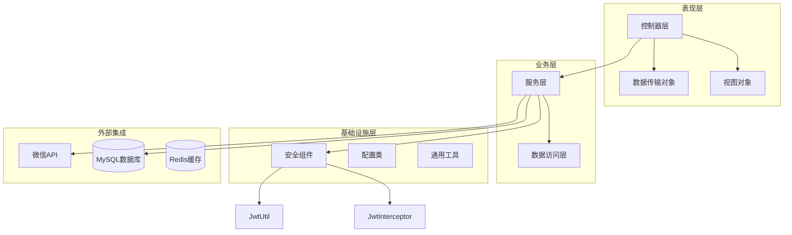
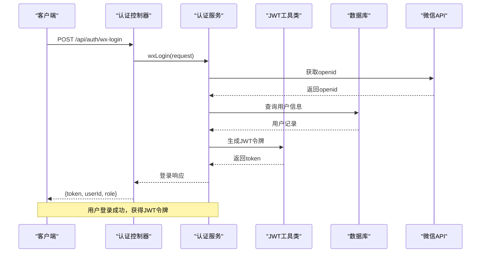
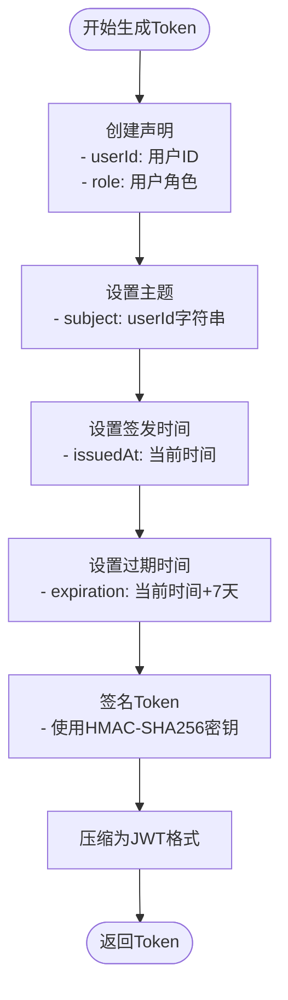
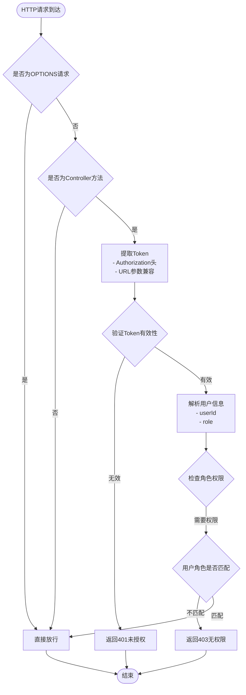
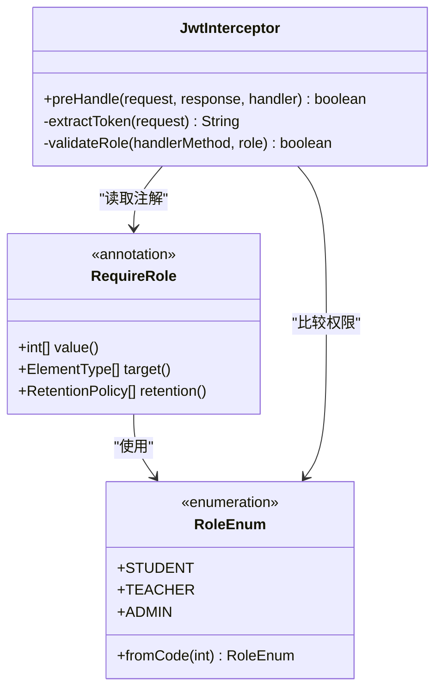
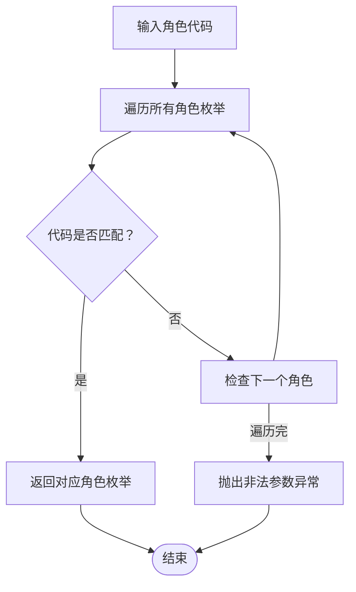
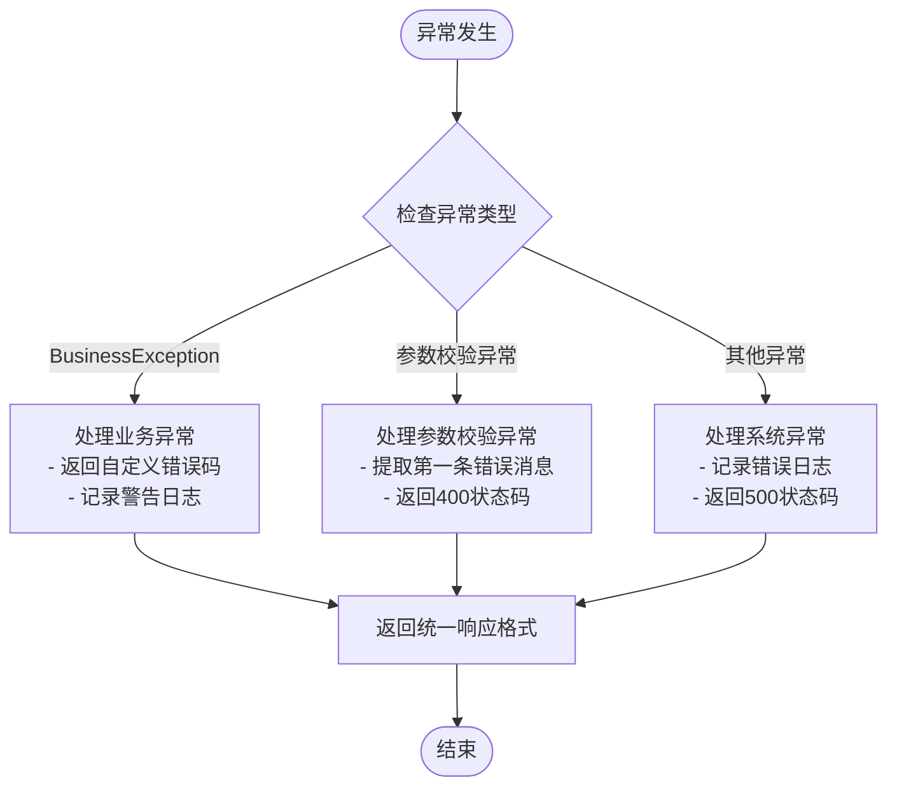
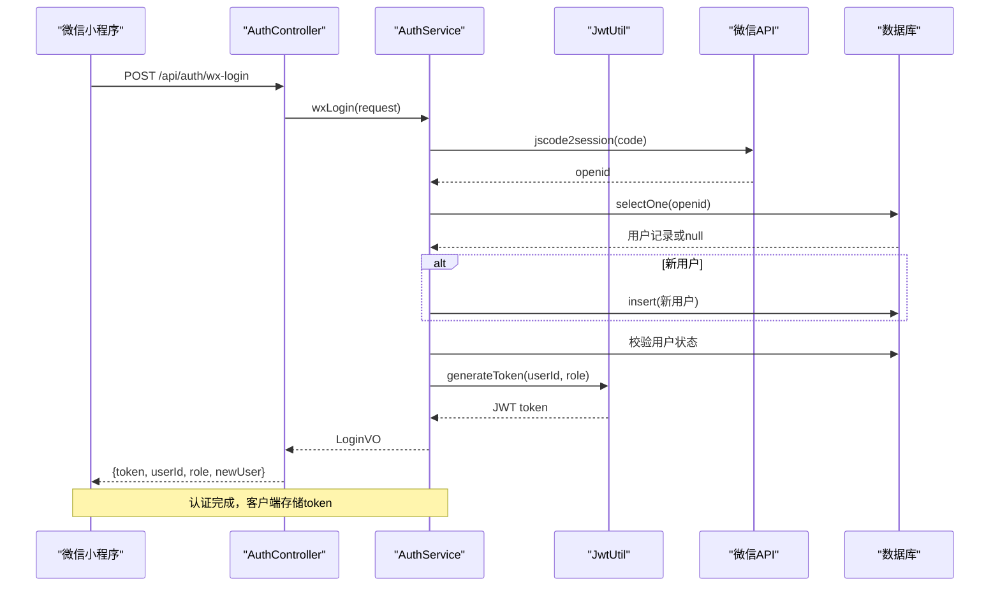
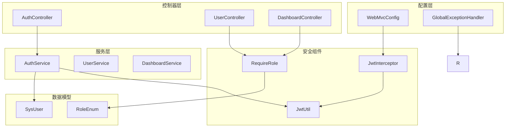

# 认证授权系统

<cite>
**本文档引用的文件**
- [JwtUtil.java](file://helenedu-backend/src/main/java/com/helen/eduedu/security/JwtUtil.java)
- [JwtInterceptor.java](file://helenedu-backend/src/main/java/com/helen/eduedu/security/JwtInterceptor.java)
- [RequireRole.java](file://helenedu-backend/src/main/java/com/helen/eduedu/security/RequireRole.java)
- [RoleEnum.java](file://helenedu-backend/src/main/java/com/helen/eduedu/common/RoleEnum.java)
- [GlobalExceptionHandler.java](file://helenedu-backend/src/main/java/com/helen/eduedu/common/GlobalExceptionHandler.java)
- [WebMvcConfig.java](file://helenedu-backend/src/main/java/com/helen/eduedu/config/WebMvcConfig.java)
- [AuthController.java](file://helenedu-backend/src/main/java/com/helen/eduedu/controller/AuthController.java)
- [AuthService.java](file://helenedu-backend/src/main/java/com/helen/eduedu/service/AuthService.java)
- [UserController.java](file://helenedu-backend/src/main/java/com/helen/eduedu/controller/UserController.java)
- [DashboardController.java](file://helenedu-backend/src/main/java/com/helen/eduedu/controller/DashboardController.java)
- [R.java](file://helenedu-backend/src/main/java/com/helen/eduedu/common/R.java)
- [SysUser.java](file://helenedu-backend/src/main/java/com/helen/eduedu/entity/SysUser.java)
- [WxLoginRequest.java](file://helenedu-backend/src/main/java/com/helen/eduedu/dto/WxLoginRequest.java)
- [application.yml](file://helenedu-backend/src/main/resources/application.yml)
</cite>

## 目录
1. [简介](#简介)
2. [项目结构](#项目结构)
3. [核心组件](#核心组件)
4. [架构概览](#架构概览)
5. [详细组件分析](#详细组件分析)
6. [依赖关系分析](#依赖关系分析)
7. [性能考虑](#性能考虑)
8. [故障排除指南](#故障排除指南)
9. [结论](#结论)
10. [附录](#附录)

## 简介
HelenEdu认证授权系统是一个基于Spring Boot构建的现代化教育管理系统，采用JWT（JSON Web Token）认证机制实现用户身份验证和权限控制。该系统支持微信小程序登录、多角色权限管理和统一异常处理，为教育平台提供了完整的安全解决方案。

## 项目结构
系统采用标准的Spring Boot分层架构，主要分为以下层次：

**图表来源**
- [WebMvcConfig.java:14-39](file://helenedu-backend/src/main/java/com/helen/eduedu/config/WebMvcConfig.java#L14-L39)
- [JwtInterceptor.java:19-22](file://helenedu-backend/src/main/java/com/helen/eduedu/security/JwtInterceptor.java#L19-L22)

**章节来源**
- [WebMvcConfig.java:14-39](file://helenedu-backend/src/main/java/com/helen/eduedu/config/WebMvcConfig.java#L14-L39)
- [application.yml:1-59](file://helenedu-backend/src/main/resources/application.yml#L1-L59)

## 核心组件
系统的核心安全组件包括JWT工具类、自定义拦截器、权限注解和全局异常处理器，这些组件协同工作实现完整的认证授权机制。

**章节来源**
- [JwtUtil.java:15-86](file://helenedu-backend/src/main/java/com/helen/eduedu/security/JwtUtil.java#L15-L86)
- [JwtInterceptor.java:16-84](file://helenedu-backend/src/main/java/com/helen/eduedu/security/JwtInterceptor.java#L16-L84)
- [RequireRole.java:8-19](file://helenedu-backend/src/main/java/com/helen/eduedu/security/RequireRole.java#L8-L19)
- [GlobalExceptionHandler.java:12-57](file://helenedu-backend/src/main/java/com/helen/eduedu/common/GlobalExceptionHandler.java#L12-L57)

## 架构概览
系统采用前后端分离架构，后端通过RESTful API提供服务，前端通过HTTP请求与后端交互。

**图表来源**
- [AuthController.java:26-30](file://helenedu-backend/src/main/java/com/helen/eduedu/controller/AuthController.java#L26-L30)
- [AuthService.java:42-82](file://helenedu-backend/src/main/java/com/helen/eduedu/service/AuthService.java#L42-L82)
- [JwtUtil.java:34-46](file://helenedu-backend/src/main/java/com/helen/eduedu/security/JwtUtil.java#L34-L46)

## 详细组件分析

### JWT工具类JwtUtil
JwtUtil是系统的核心安全组件，负责JWT令牌的生成、解析和验证。

#### Token生成机制

**图表来源**
- [JwtUtil.java:34-46](file://helenedu-backend/src/main/java/com/helen/eduedu/security/JwtUtil.java#L34-L46)

#### Token解析与验证
系统采用HMAC-SHA256算法进行令牌验证，确保令牌的完整性和真实性。

**章节来源**
- [JwtUtil.java:15-86](file://helenedu-backend/src/main/java/com/helen/eduedu/security/JwtUtil.java#L15-L86)
- [application.yml:33-36](file://helenedu-backend/src/main/resources/application.yml#L33-L36)

### 自定义拦截器JwtInterceptor
JwtInterceptor实现了Spring MVC的HandlerInterceptor接口，负责在请求到达控制器之前进行身份验证和权限检查。

#### 拦截器工作流程

**图表来源**
- [JwtInterceptor.java:27-68](file://helenedu-backend/src/main/java/com/helen/eduedu/security/JwtInterceptor.java#L27-L68)

#### Token提取策略
拦截器支持多种Token传递方式以兼容不同客户端：
- HTTP头部：Authorization: Bearer {token}
- URL参数：token={token}

**章节来源**
- [JwtInterceptor.java:70-77](file://helenedu-backend/src/main/java/com/helen/eduedu/security/JwtInterceptor.java#L70-L77)
- [WebMvcConfig.java:24-31](file://helenedu-backend/src/main/java/com/helen/eduedu/config/WebMvcConfig.java#L24-L31)

### 权限注解RequireRole
RequireRole注解提供了声明式的权限控制机制，可以应用于控制器类或方法级别。

#### 注解设计原理

**图表来源**
- [RequireRole.java:11-18](file://helenedu-backend/src/main/java/com/helen/eduedu/security/RequireRole.java#L11-L18)
- [RoleEnum.java:11-26](file://helenedu-backend/src/main/java/com/helen/eduedu/common/RoleEnum.java#L11-L26)
- [JwtInterceptor.java:53-65](file://helenedu-backend/src/main/java/com/helen/eduedu/security/JwtInterceptor.java#L53-L65)

#### 使用示例
在UserController中，@RequireRole({3})注解确保只有管理员角色才能访问用户管理功能。

**章节来源**
- [RequireRole.java:8-19](file://helenedu-backend/src/main/java/com/helen/eduedu/security/RequireRole.java#L8-L19)
- [UserController.java:23](file://helenedu-backend/src/main/java/com/helen/eduedu/controller/UserController.java#L23)

### 角色枚举类RoleEnum
RoleEnum定义了系统的角色体系，为权限控制提供标准化的数据结构。

#### 角色定义
| 角色代码 | 角色名称 | 描述 |
|---------|---------|------|
| 1 | STUDENT | 学生 |
| 2 | TEACHER | 教师 |
| 3 | ADMIN | 管理员 |

#### 角色转换机制

**图表来源**
- [RoleEnum.java:19-26](file://helenedu-backend/src/main/java/com/helen/eduedu/common/RoleEnum.java#L19-L26)

**章节来源**
- [RoleEnum.java:1-28](file://helenedu-backend/src/main/java/com/helen/eduedu/common/RoleEnum.java#L1-L28)

### 全局异常处理器GlobalExceptionHandler
GlobalExceptionHandler提供了统一的异常处理机制，确保系统异常以一致的格式返回给客户端。

#### 异常处理流程

**图表来源**
- [GlobalExceptionHandler.java:19-56](file://helenedu-backend/src/main/java/com/helen/eduedu/common/GlobalExceptionHandler.java#L19-L56)

**章节来源**
- [GlobalExceptionHandler.java:12-57](file://helenedu-backend/src/main/java/com/helen/eduedu/common/GlobalExceptionHandler.java#L12-L57)

### 认证流程详解
系统支持微信小程序登录，完整的认证流程如下：

**图表来源**
- [AuthService.java:42-82](file://helenedu-backend/src/main/java/com/helen/eduedu/service/AuthService.java#L42-L82)
- [AuthController.java:26-30](file://helenedu-backend/src/main/java/com/helen/eduedu/controller/AuthController.java#L26-L30)

**章节来源**
- [AuthService.java:21-128](file://helenedu-backend/src/main/java/com/helen/eduedu/service/AuthService.java#L21-L128)
- [AuthController.java:15-39](file://helenedu-backend/src/main/java/com/helen/eduedu/controller/AuthController.java#L15-L39)

## 依赖关系分析

**图表来源**
- [WebMvcConfig.java:18](file://helenedu-backend/src/main/java/com/helen/eduedu/config/WebMvcConfig.java#L18)
- [JwtInterceptor.java:24](file://helenedu-backend/src/main/java/com/helen/eduedu/security/JwtInterceptor.java#L24)
- [AuthController.java:24](file://helenedu-backend/src/main/java/com/helen/eduedu/controller/AuthController.java#L24)

**章节来源**
- [WebMvcConfig.java:14-39](file://helenedu-backend/src/main/java/com/helen/eduedu/config/WebMvcConfig.java#L14-L39)
- [JwtInterceptor.java:19-22](file://helenedu-backend/src/main/java/com/helen/eduedu/security/JwtInterceptor.java#L19-L22)

## 性能考虑
系统在设计时充分考虑了性能优化：

1. **Token缓存策略**：建议在Redis中缓存活跃Token，支持快速验证和黑名单管理
2. **连接池优化**：配置合理的数据库连接池大小，避免连接争用
3. **异步处理**：对于耗时的微信API调用，考虑使用异步处理机制
4. **缓存策略**：对频繁访问的用户信息和权限数据建立缓存层

## 故障排除指南

### 常见问题及解决方案

#### 1. Token验证失败
**症状**：返回401未授权错误
**可能原因**：
- Token已过期（默认7天）
- 密钥不匹配
- Token被篡改

**解决方法**：
- 检查JWT密钥配置
- 验证Token生成和解析过程
- 实现Token刷新机制

#### 2. 权限拒绝访问
**症状**：返回403无权限错误
**可能原因**：
- 用户角色不满足要求
- 注解配置错误
- 权限边界设置不当

**解决方法**：
- 检查RequireRole注解配置
- 验证用户实际角色
- 审核权限边界设计

#### 3. 微信登录失败
**症状**：微信登录接口报错
**可能原因**：
- AppID或Secret配置错误
- 网络连接问题
- 微信API接口变更

**解决方法**：
- 验证微信小程序配置
- 检查网络连通性
- 查看微信官方API文档

**章节来源**
- [GlobalExceptionHandler.java:19-56](file://helenedu-backend/src/main/java/com/helen/eduedu/common/GlobalExceptionHandler.java#L19-L56)
- [JwtUtil.java:78-85](file://helenedu-backend/src/main/java/com/helen/eduedu/security/JwtUtil.java#L78-L85)

## 结论
HelenEdu认证授权系统通过JWT技术实现了安全可靠的用户身份验证和权限控制机制。系统采用声明式权限注解、统一异常处理和拦截器机制，提供了清晰的安全架构和良好的扩展性。通过微信小程序登录集成，系统能够满足现代教育应用的多样化需求。

## 附录

### 配置参数说明

| 配置项 | 默认值 | 说明 |
|-------|--------|------|
| jwt.secret | HelenEduSecretKey2024ForJwtTokenGenerationMustBeLongEnough | JWT密钥，必须足够长 |
| jwt.expiration | 604800000 | Token过期时间（毫秒），默认7天 |
| wechat.appid | your-appid | 微信小程序AppID |
| wechat.secret | your-secret | 微信小程序Secret |
| file.upload-dir | ./uploads | 文件上传目录 |

### 角色权限矩阵

| 功能模块 | 必需角色 | 说明 |
|---------|---------|------|
| 用户管理 | 管理员 | 创建、修改、删除用户 |
| 数据看板 | 管理员 | 查看系统统计数据 |
| 作业管理 | 教师 | 发布、批改作业 |
| 学习资源 | 学生 | 查看学习资料 |
| 系统配置 | 管理员 | 系统参数配置 |

**章节来源**
- [application.yml:33-46](file://helenedu-backend/src/main/resources/application.yml#L33-L46)
- [UserController.java:23](file://helenedu-backend/src/main/java/com/helen/eduedu/controller/UserController.java#L23)
- [DashboardController.java:23](file://helenedu-backend/src/main/java/com/helen/eduedu/controller/DashboardController.java#L23)