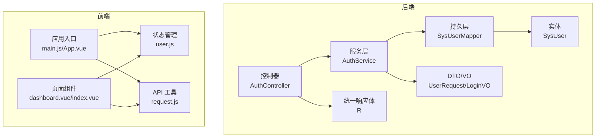
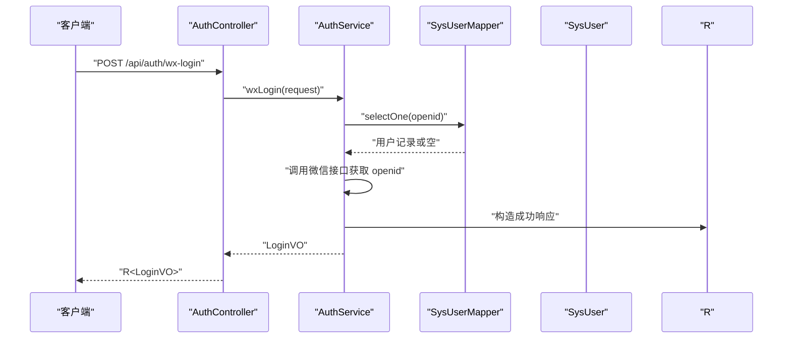
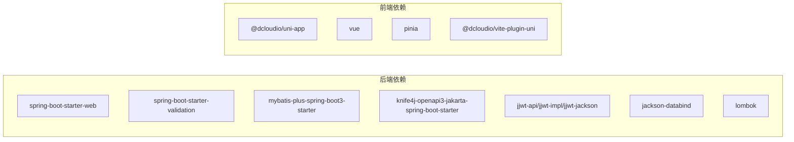

# 代码规范

<cite>
**本文引用的文件**
- [HleneEduApplication.java](file://helenedu-backend/src/main/java/com/helen/eduedu/HleneEduApplication.java)
- [R.java](file://helenedu-backend/src/main/java/com/helen/eduedu/common/R.java)
- [AuthController.java](file://helenedu-backend/src/main/java/com/helen/eduedu/controller/AuthController.java)
- [AuthService.java](file://helenedu-backend/src/main/java/com/helen/eduedu/service/AuthService.java)
- [SysUser.java](file://helenedu-backend/src/main/java/com/helen/eduedu/entity/SysUser.java)
- [UserRequest.java](file://helenedu-backend/src/main/java/com/helen/eduedu/dto/UserRequest.java)
- [LoginVO.java](file://helenedu-backend/src/main/java/com/helen/eduedu/vo/LoginVO.java)
- [pom.xml](file://helenedu-backend/pom.xml)
- [package.json](file://helenedu-frontend/package.json)
- [vite.config.js](file://helenedu-frontend/vite.config.js)
- [main.js](file://helenedu-frontend/src/main.js)
- [App.vue](file://helenedu-frontend/src/App.vue)
- [user.js](file://helenedu-frontend/src/store/user.js)
- [request.js](file://helenedu-frontend/src/utils/request.js)
- [dashboard.vue](file://helenedu-frontend/src/pages/admin/dashboard.vue)
- [index.vue](file://helenedu-frontend/src/pages/login/index.vue)
</cite>

## 目录
1. [引言](#引言)
2. [项目结构](#项目结构)
3. [核心组件](#核心组件)
4. [架构总览](#架构总览)
5. [详细组件分析](#详细组件分析)
6. [依赖分析](#依赖分析)
7. [性能考虑](#性能考虑)
8. [故障排查指南](#故障排查指南)
9. [结论](#结论)
10. [附录](#附录)

## 引言
本文件为 HelenEdu 项目的代码规范文档，覆盖 Java 后端与 Vue.js 前端的命名约定、注释规范、代码格式化、接口设计原则；同时给出 Git 提交规范、分支命名规范、代码审查标准，以及 IDE 配置与代码质量检查工具建议。文档以仓库现有实现为依据，结合最佳实践，帮助团队统一风格、提升可维护性与协作效率。

## 项目结构
- 后端采用 Spring Boot + MyBatis-Plus 的分层架构：controller -> service -> mapper -> entity/dto/vo，配合统一响应体与全局异常处理。
- 前端基于 uni-app + Vue 3 + Pinia，页面按角色划分目录，API 请求封装在统一工具中，状态通过 Pinia store 管理。

图表来源
- [AuthController.java:1-39](file://helenedu-backend/src/main/java/com/helen/eduedu/controller/AuthController.java#L1-L39)
- [AuthService.java:1-128](file://helenedu-backend/src/main/java/com/helen/eduedu/service/AuthService.java#L1-L128)
- [SysUser.java:1-42](file://helenedu-backend/src/main/java/com/helen/eduedu/entity/SysUser.java#L1-L42)
- [UserRequest.java:1-23](file://helenedu-backend/src/main/java/com/helen/eduedu/dto/UserRequest.java#L1-L23)
- [LoginVO.java:1-17](file://helenedu-backend/src/main/java/com/helen/eduedu/vo/LoginVO.java#L1-L17)
- [R.java:1-42](file://helenedu-backend/src/main/java/com/helen/eduedu/common/R.java#L1-L42)
- [main.js:1-11](file://helenedu-frontend/src/main.js#L1-L11)
- [user.js:1-62](file://helenedu-frontend/src/store/user.js#L1-L62)
- [request.js:1-83](file://helenedu-frontend/src/utils/request.js#L1-L83)
- [dashboard.vue:1-122](file://helenedu-frontend/src/pages/admin/dashboard.vue#L1-L122)
- [index.vue:1-194](file://helenedu-frontend/src/pages/login/index.vue#L1-L194)

章节来源
- [HleneEduApplication.java:1-15](file://helenedu-backend/src/main/java/com/helen/eduedu/HleneEduApplication.java#L1-L15)
- [pom.xml:1-118](file://helenedu-backend/pom.xml#L1-L118)
- [package.json:1-28](file://helenedu-frontend/package.json#L1-L28)
- [vite.config.js:1-7](file://helenedu-frontend/vite.config.js#L1-L7)

## 核心组件
- 统一响应体 R：定义成功/失败响应结构，便于前后端一致的数据交互。
- 控制器注解：使用 Swagger 注解标注接口摘要与分组，提升 API 文档质量。
- DTO/VO：清晰区分请求参数与响应数据结构，避免实体暴露给前端。
- 前端状态管理：Pinia store 封装 token 与用户信息的本地存储与同步。
- 请求封装：统一封装 uni.request，自动注入 Authorization 头与错误提示。

章节来源
- [R.java:1-42](file://helenedu-backend/src/main/java/com/helen/eduedu/common/R.java#L1-L42)
- [AuthController.java:1-39](file://helenedu-backend/src/main/java/com/helen/eduedu/controller/AuthController.java#L1-L39)
- [UserRequest.java:1-23](file://helenedu-backend/src/main/java/com/helen/eduedu/dto/UserRequest.java#L1-L23)
- [LoginVO.java:1-17](file://helenedu-backend/src/main/java/com/helen/eduedu/vo/LoginVO.java#L1-L17)
- [user.js:1-62](file://helenedu-frontend/src/store/user.js#L1-L62)
- [request.js:1-83](file://helenedu-frontend/src/utils/request.js#L1-L83)

## 架构总览
后端采用分层架构，前端采用组件化与状态管理分离的设计。控制器负责接口暴露与参数校验，服务层处理业务逻辑与第三方调用，持久层通过 MyBatis-Plus 访问数据库。前端通过 API 工具与后端交互，状态通过 Pinia 统一管理。

图表来源
- [AuthController.java:26-30](file://helenedu-backend/src/main/java/com/helen/eduedu/controller/AuthController.java#L26-L30)
- [AuthService.java:42-82](file://helenedu-backend/src/main/java/com/helen/eduedu/service/AuthService.java#L42-L82)
- [R.java:16-26](file://helenedu-backend/src/main/java/com/helen/eduedu/common/R.java#L16-L26)

## 详细组件分析

### Java 后端代码规范

- 命名约定
  - 类名：采用 PascalCase，如 HleneEduApplication、AuthService。
  - 变量与方法：采用 camelCase，如 wxLogin、sysUserMapper。
  - 常量：采用 UPPER_SNAKE_CASE，如 WECHAT_APPID、WECHAT_SECRET（建议在代码中体现）。
  - 包名：采用全小写，如 com.helen.eduedu。

- 注释规范
  - 类注释：每个类应有简要描述，如 R、SysUser、AuthService。
  - 方法注释：对关键方法进行行为说明，如 wxLogin、getUserInfo。
  - 字段注释：对实体字段添加中文说明，如“微信 openid”、“角色”。

- 代码格式化规则
  - 使用 Lombok 简化 getter/setter/toString 等，保持简洁。
  - 控制器方法使用 Swagger 注解标注摘要与分组，提升可读性。
  - DTO/VO 明确职责边界，避免跨层直接使用实体。

- 接口设计原则
  - 统一响应体：所有接口返回 R<T>，包含 code、message、data。
  - 参数校验：使用 Jakarta Validation 注解，如 NotBlank、NotNull。
  - 错误处理：自定义 BusinessException 并由全局异常处理器统一处理。

- 实际示例路径
  - 统一响应体类：[R.java:1-42](file://helenedu-backend/src/main/java/com/helen/eduedu/common/R.java#L1-L42)
  - 控制器注解与接口：[AuthController.java:15-39](file://helenedu-backend/src/main/java/com/helen/eduedu/controller/AuthController.java#L15-L39)
  - DTO/VO 定义：[UserRequest.java:1-23](file://helenedu-backend/src/main/java/com/helen/eduedu/dto/UserRequest.java#L1-L23)、[LoginVO.java:1-17](file://helenedu-backend/src/main/java/com/helen/eduedu/vo/LoginVO.java#L1-L17)
  - 实体字段注释：[SysUser.java:20-36](file://helenedu-backend/src/main/java/com/helen/eduedu/entity/SysUser.java#L20-L36)

章节来源
- [HleneEduApplication.java:1-15](file://helenedu-backend/src/main/java/com/helen/eduedu/HleneEduApplication.java#L1-L15)
- [R.java:1-42](file://helenedu-backend/src/main/java/com/helen/eduedu/common/R.java#L1-L42)
- [AuthController.java:1-39](file://helenedu-backend/src/main/java/com/helen/eduedu/controller/AuthController.java#L1-L39)
- [AuthService.java:1-128](file://helenedu-backend/src/main/java/com/helen/eduedu/service/AuthService.java#L1-L128)
- [SysUser.java:1-42](file://helenedu-backend/src/main/java/com/helen/eduedu/entity/SysUser.java#L1-L42)
- [UserRequest.java:1-23](file://helenedu-backend/src/main/java/com/helen/eduedu/dto/UserRequest.java#L1-L23)
- [LoginVO.java:1-17](file://helenedu-backend/src/main/java/com/helen/eduedu/vo/LoginVO.java#L1-L17)

### Vue.js 前端代码规范

- 组件命名规范
  - 页面组件采用 PascalCase，如 Dashboard.vue、Index.vue。
  - 文件命名采用 kebab-case，如 dashboard.vue、index.vue。

- 文件组织结构
  - 页面按角色划分目录：admin、teacher、student。
  - API 请求集中于 utils/request.js，统一注入 Authorization 头。
  - 状态管理集中于 store/user.js，使用 Pinia。

- 样式编写规范
  - 全局样式集中在 App.vue 中定义，页面内样式使用 scoped。
  - 使用语义化类名，如 card、btn-primary、tag-*。
  - 尺寸单位优先使用 rpx，保证多端适配。

- 状态管理规范
  - 使用 Pinia defineStore 定义用户状态，封装 setLoginInfo、logout、getRoleName 等方法。
  - 本地存储键名统一，如 token、userInfo。

- 实际示例路径
  - 应用入口与插件：[main.js:1-11](file://helenedu-frontend/src/main.js#L1-L11)、[App.vue:1-104](file://helenedu-frontend/src/App.vue#L1-L104)
  - 状态管理：[user.js:1-62](file://helenedu-frontend/src/store/user.js#L1-L62)
  - 请求封装：[request.js:1-83](file://helenedu-frontend/src/utils/request.js#L1-L83)
  - 页面组件示例：[dashboard.vue:1-122](file://helenedu-frontend/src/pages/admin/dashboard.vue#L1-L122)、[index.vue:1-194](file://helenedu-frontend/src/pages/login/index.vue#L1-L194)

章节来源
- [main.js:1-11](file://helenedu-frontend/src/main.js#L1-L11)
- [App.vue:1-104](file://helenedu-frontend/src/App.vue#L1-L104)
- [user.js:1-62](file://helenedu-frontend/src/store/user.js#L1-L62)
- [request.js:1-83](file://helenedu-frontend/src/utils/request.js#L1-L83)
- [dashboard.vue:1-122](file://helenedu-frontend/src/pages/admin/dashboard.vue#L1-L122)
- [index.vue:1-194](file://helenedu-frontend/src/pages/login/index.vue#L1-L194)

### Git 提交规范与代码审查标准

- 提交信息格式
  - 类型: 功能/修复/文档/重构/样式/测试/其他
  - 范围: 模块或文件范围，如 backend: controller/auth
  - 描述: 简洁明了的变更说明，不超过 50 字
  - 示例: feat(backend): 添加用户登录接口

- 分支命名规范
  - 功能分支: feature/模块-功能描述
  - 修复分支: fix/模块-问题描述
  - 热修复分支: hotfix/版本-紧急修复
  - 支持分支: support/版本-支持任务

- 代码审查标准
  - 通过 CI/CD 前必须通过静态检查与单元测试
  - 代码需具备可读性与可维护性，避免重复逻辑
  - 接口设计需考虑扩展性与兼容性
  - 前后端联调需确保统一响应体与错误码

### IDE 配置与代码质量检查工具

- Java 后端
  - 使用 Lombok 简化代码，开启注解处理器
  - 使用 SpotBugs/Checkstyle/PMD 进行静态检查
  - Maven 插件：jacoco 进行覆盖率统计

- Vue.js 前端
  - 使用 ESLint + Prettier 统一代码风格
  - 使用 uni-app CLI 进行构建与调试
  - 使用 Vitest/Jest 进行单元测试

章节来源
- [pom.xml:101-116](file://helenedu-backend/pom.xml#L101-L116)
- [package.json:1-28](file://helenedu-frontend/package.json#L1-L28)
- [vite.config.js:1-7](file://helenedu-frontend/vite.config.js#L1-L7)

## 依赖分析
后端依赖 Spring Boot Web、Validation、MyBatis-Plus、Knife4j、JWT、Jackson、Lombok；前端依赖 uni-app、Vue 3、Pinia、Vite 插件。

图表来源
- [pom.xml:27-98](file://helenedu-backend/pom.xml#L27-L98)
- [package.json:12-26](file://helenedu-frontend/package.json#L12-L26)

章节来源
- [pom.xml:1-118](file://helenedu-backend/pom.xml#L1-L118)
- [package.json:1-28](file://helenedu-frontend/package.json#L1-L28)

## 性能考虑
- 后端
  - 控制器层尽量薄，复杂逻辑下沉至服务层
  - 使用分页查询与索引优化，避免 N+1 查询
  - 缓存热点数据，减少数据库压力
- 前端
  - 合理拆分组件，避免不必要的重渲染
  - 使用虚拟列表渲染长列表
  - 图片与资源按需加载，减少首屏体积

## 故障排查指南
- 统一响应体与错误码
  - 成功：code=200，message="success"
  - 失败：code=500，message=错误信息
- 前端鉴权
  - 401 自动清除本地 token 与 userInfo，并跳转登录页
  - 请求失败时弹出 toast 提示具体错误
- 常见问题定位
  - 控制器：确认 Swagger 注解与请求路径匹配
  - 服务层：关注第三方接口调用异常与日志输出
  - 前端：检查 Authorization 头是否正确注入与本地存储状态

章节来源
- [R.java:16-40](file://helenedu-backend/src/main/java/com/helen/eduedu/common/R.java#L16-L40)
- [request.js:20-44](file://helenedu-frontend/src/utils/request.js#L20-L44)
- [AuthService.java:108-126](file://helenedu-backend/src/main/java/com/helen/eduedu/service/AuthService.java#L108-L126)

## 结论
本规范以 HelenEdu 项目现有实现为基础，结合前后端最佳实践，形成统一的命名、注释、格式与接口设计标准。建议团队在日常开发中严格遵循，持续通过工具与流程保障代码质量与可维护性。

## 附录

### 正确与错误示例（仅提供路径，不展示具体代码）
- 正确：使用统一响应体与 DTO/VO
  - [R.java:16-26](file://helenedu-backend/src/main/java/com/helen/eduedu/common/R.java#L16-L26)
  - [UserRequest.java:13-19](file://helenedu-backend/src/main/java/com/helen/eduedu/dto/UserRequest.java#L13-L19)
  - [LoginVO.java:10-15](file://helenedu-backend/src/main/java/com/helen/eduedu/vo/LoginVO.java#L10-L15)
- 错误：直接返回实体对象
  - [SysUser.java:17-40](file://helenedu-backend/src/main/java/com/helen/eduedu/entity/SysUser.java#L17-L40)
- 正确：前端统一请求封装
  - [request.js:7-44](file://helenedu-frontend/src/utils/request.js#L7-L44)
- 错误：未注入 Authorization 头
  - [index.vue:73-76](file://helenedu-frontend/src/pages/login/index.vue#L73-L76)