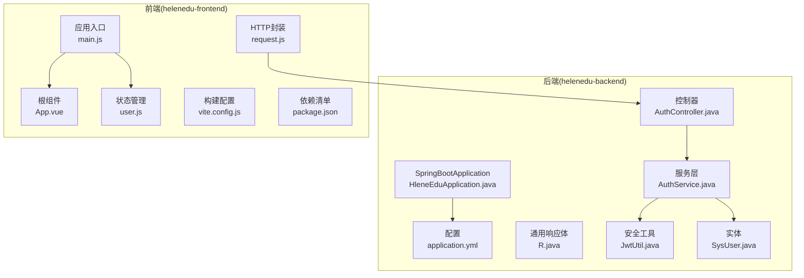
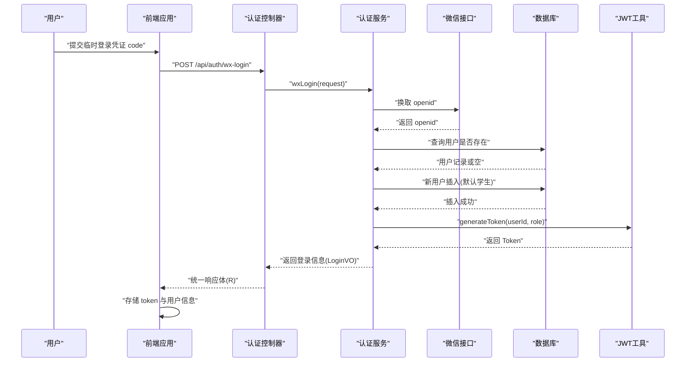
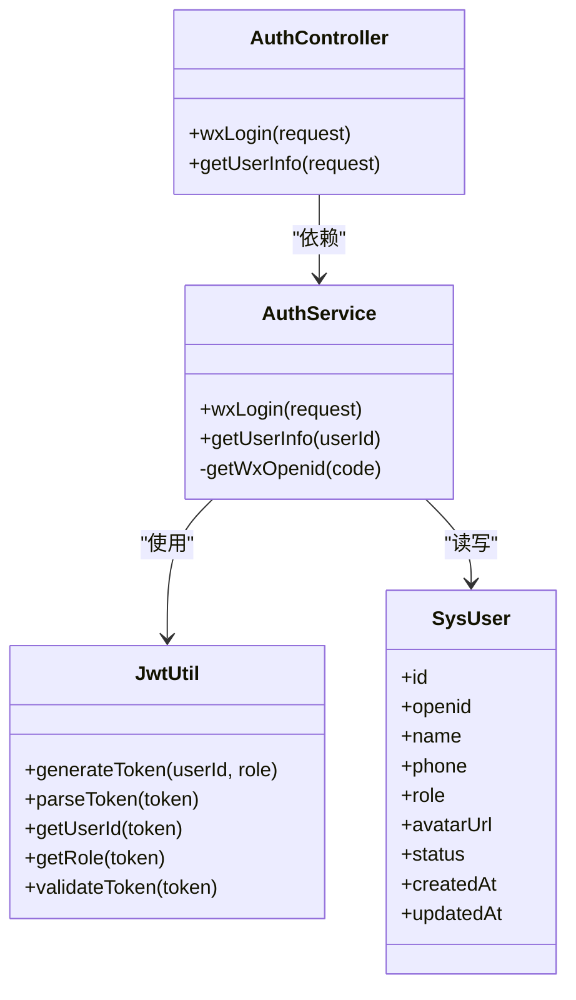
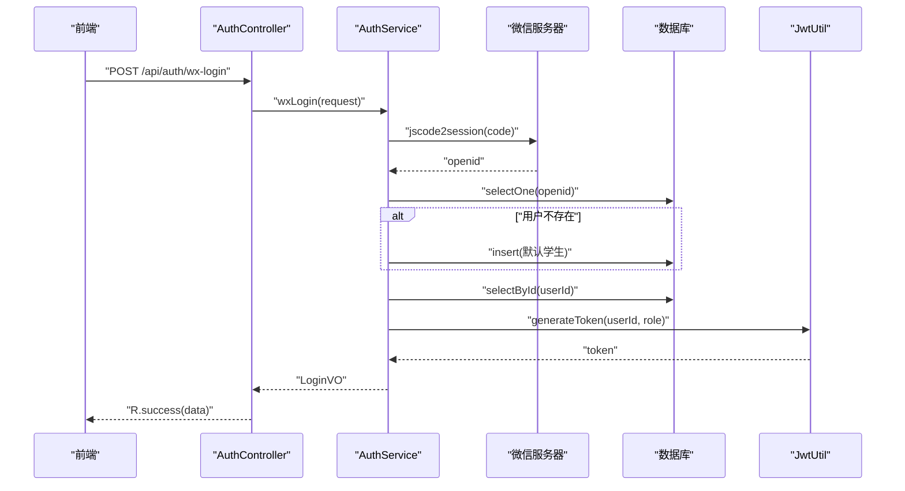
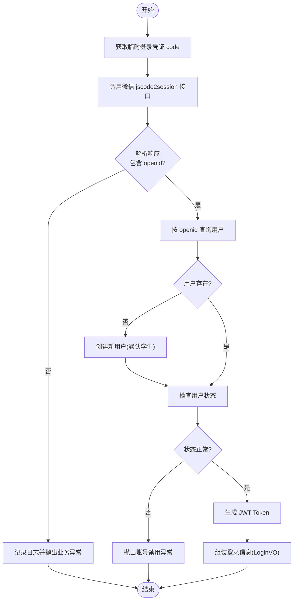
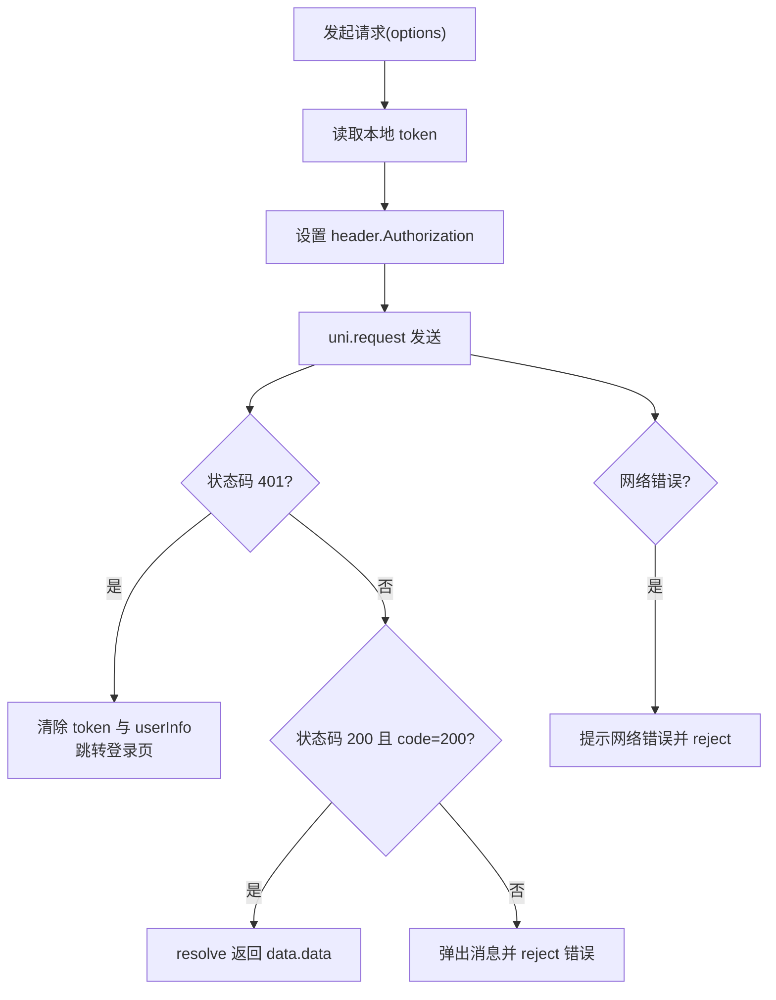
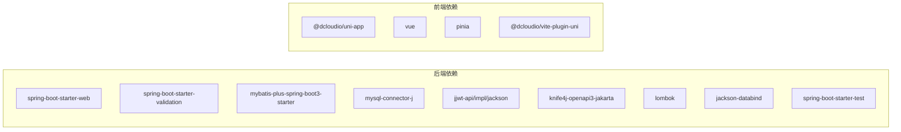

# 开发指南

<cite>
**本文引用的文件**
- [README.md](file://README.md)
- [HleneEduApplication.java](file://helenedu-backend/src/main/java/com/helen/eduedu/HleneEduApplication.java)
- [pom.xml](file://helenedu-backend/pom.xml)
- [application.yml](file://helenedu-backend/src/main/resources/application.yml)
- [R.java](file://helenedu-backend/src/main/java/com/helen/eduedu/common/R.java)
- [JwtUtil.java](file://helenedu-backend/src/main/java/com/helen/eduedu/security/JwtUtil.java)
- [AuthController.java](file://helenedu-backend/src/main/java/com/helen/eduedu/controller/AuthController.java)
- [AuthService.java](file://helenedu-backend/src/main/java/com/helen/eduedu/service/AuthService.java)
- [SysUser.java](file://helenedu-backend/src/main/java/com/helen/eduedu/entity/SysUser.java)
- [main.js](file://helenedu-frontend/src/main.js)
- [App.vue](file://helenedu-frontend/src/App.vue)
- [package.json](file://helenedu-frontend/package.json)
- [vite.config.js](file://helenedu-frontend/vite.config.js)
- [request.js](file://helenedu-frontend/src/utils/request.js)
- [user.js](file://helenedu-frontend/src/store/user.js)
</cite>

## 目录
1. [简介](#简介)
2. [项目结构](#项目结构)
3. [核心组件](#核心组件)
4. [架构总览](#架构总览)
5. [详细组件分析](#详细组件分析)
6. [依赖分析](#依赖分析)
7. [性能考虑](#性能考虑)
8. [故障排查指南](#故障排查指南)
9. [结论](#结论)
10. [附录](#附录)

## 简介
本指南面向 HelenEdu 项目的开发者，提供统一的代码规范与最佳实践，涵盖 Java 后端与 Vue.js 前端的命名约定、注释规范、开发流程与协作规范、测试要求、调试与问题排查、功能扩展与模块化开发建议，以及开发工具推荐与常见问题解决方案。项目采用 Spring Boot + MyBatis-Plus + Vue 3 + UniApp 技术栈，支持微信小程序与 H5 双端运行。

## 项目结构
后端采用标准 Spring Boot 结构，按包划分：common（通用）、config（配置）、controller（接口）、dto（请求参数）、entity（实体）、mapper（持久层）、security（安全）、service（业务）、vo（视图对象）。前端基于 UniApp，采用 Pinia 状态管理，通过 Vite 构建，支持多端编译。

图表来源
- [HleneEduApplication.java:1-15](file://helenedu-backend/src/main/java/com/helen/eduedu/HleneEduApplication.java#L1-L15)
- [application.yml:1-59](file://helenedu-backend/src/main/resources/application.yml#L1-L59)
- [R.java:1-42](file://helenedu-backend/src/main/java/com/helen/eduedu/common/R.java#L1-L42)
- [JwtUtil.java:1-87](file://helenedu-backend/src/main/java/com/helen/eduedu/security/JwtUtil.java#L1-L87)
- [AuthController.java:1-39](file://helenedu-backend/src/main/java/com/helen/eduedu/controller/AuthController.java#L1-L39)
- [AuthService.java:1-128](file://helenedu-backend/src/main/java/com/helen/eduedu/service/AuthService.java#L1-L128)
- [SysUser.java:1-42](file://helenedu-backend/src/main/java/com/helen/eduedu/entity/SysUser.java#L1-L42)
- [main.js:1-11](file://helenedu-frontend/src/main.js#L1-L11)
- [App.vue:1-104](file://helenedu-frontend/src/App.vue#L1-L104)
- [request.js:1-83](file://helenedu-frontend/src/utils/request.js#L1-L83)
- [user.js:1-62](file://helenedu-frontend/src/store/user.js#L1-L62)
- [vite.config.js:1-7](file://helenedu-frontend/vite.config.js#L1-L7)
- [package.json:1-28](file://helenedu-frontend/package.json#L1-L28)

章节来源
- [README.md:1-3](file://README.md#L1-L3)
- [HleneEduApplication.java:1-15](file://helenedu-backend/src/main/java/com/helen/eduedu/HleneEduApplication.java#L1-L15)
- [application.yml:1-59](file://helenedu-backend/src/main/resources/application.yml#L1-L59)
- [main.js:1-11](file://helenedu-frontend/src/main.js#L1-L11)
- [App.vue:1-104](file://helenedu-frontend/src/App.vue#L1-L104)
- [vite.config.js:1-7](file://helenedu-frontend/vite.config.js#L1-L7)
- [package.json:1-28](file://helenedu-frontend/package.json#L1-L28)

## 核心组件
- 统一响应体 R：封装统一的响应结构，简化控制器返回值处理，便于前端统一解析。
- 安全工具 JwtUtil：负责 Token 生成、解析、校验与载荷提取，配合拦截器完成鉴权。
- 认证控制器与服务：提供微信登录、用户信息查询等能力，集成微信接口获取 openid 并生成本地用户。
- 实体 SysUser：定义用户字段及默认值，支撑权限与状态管理。
- 前端请求封装与状态管理：统一封装 uni.request，自动注入 Authorization 头；Pinia 管理 token 与用户信息。

章节来源
- [R.java:1-42](file://helenedu-backend/src/main/java/com/helen/eduedu/common/R.java#L1-L42)
- [JwtUtil.java:1-87](file://helenedu-backend/src/main/java/com/helen/eduedu/security/JwtUtil.java#L1-L87)
- [AuthController.java:1-39](file://helenedu-backend/src/main/java/com/helen/eduedu/controller/AuthController.java#L1-L39)
- [AuthService.java:1-128](file://helenedu-backend/src/main/java/com/helen/eduedu/service/AuthService.java#L1-L128)
- [SysUser.java:1-42](file://helenedu-backend/src/main/java/com/helen/eduedu/entity/SysUser.java#L1-L42)
- [request.js:1-83](file://helenedu-frontend/src/utils/request.js#L1-L83)
- [user.js:1-62](file://helenedu-frontend/src/store/user.js#L1-L62)

## 架构总览
系统采用前后端分离架构，后端提供 REST 接口与 Swagger 文档，前端通过 uni.request 发起请求并携带 Token。认证流程通过微信授权码换取 openid，若用户不存在则自动注册为学生角色，并签发 JWT Token。

图表来源
- [AuthController.java:1-39](file://helenedu-backend/src/main/java/com/helen/eduedu/controller/AuthController.java#L1-L39)
- [AuthService.java:1-128](file://helenedu-backend/src/main/java/com/helen/eduedu/service/AuthService.java#L1-L128)
- [JwtUtil.java:1-87](file://helenedu-backend/src/main/java/com/helen/eduedu/security/JwtUtil.java#L1-L87)
- [SysUser.java:1-42](file://helenedu-backend/src/main/java/com/helen/eduedu/entity/SysUser.java#L1-L42)
- [request.js:1-83](file://helenedu-frontend/src/utils/request.js#L1-L83)

## 详细组件分析

### 后端组件分析

#### 类关系图（认证相关）

图表来源
- [AuthController.java:1-39](file://helenedu-backend/src/main/java/com/helen/eduedu/controller/AuthController.java#L1-L39)
- [AuthService.java:1-128](file://helenedu-backend/src/main/java/com/helen/eduedu/service/AuthService.java#L1-L128)
- [JwtUtil.java:1-87](file://helenedu-backend/src/main/java/com/helen/eduedu/security/JwtUtil.java#L1-L87)
- [SysUser.java:1-42](file://helenedu-backend/src/main/java/com/helen/eduedu/entity/SysUser.java#L1-L42)

章节来源
- [AuthController.java:1-39](file://helenedu-backend/src/main/java/com/helen/eduedu/controller/AuthController.java#L1-L39)
- [AuthService.java:1-128](file://helenedu-backend/src/main/java/com/helen/eduedu/service/AuthService.java#L1-L128)
- [JwtUtil.java:1-87](file://helenedu-backend/src/main/java/com/helen/eduedu/security/JwtUtil.java#L1-L87)
- [SysUser.java:1-42](file://helenedu-backend/src/main/java/com/helen/eduedu/entity/SysUser.java#L1-L42)

#### 认证流程时序图

图表来源
- [AuthController.java:1-39](file://helenedu-backend/src/main/java/com/helen/eduedu/controller/AuthController.java#L1-L39)
- [AuthService.java:1-128](file://helenedu-backend/src/main/java/com/helen/eduedu/service/AuthService.java#L1-L128)
- [JwtUtil.java:1-87](file://helenedu-backend/src/main/java/com/helen/eduedu/security/JwtUtil.java#L1-L87)

#### 微信登录算法流程图

图表来源
- [AuthService.java:1-128](file://helenedu-backend/src/main/java/com/helen/eduedu/service/AuthService.java#L1-L128)

### 前端组件分析

#### 请求封装与状态管理
- 请求封装 request.js：统一封装 uni.request，自动注入 Authorization 头，处理 401、业务错误与网络错误，提供 GET/POST/PUT/DELETE 与上传文件方法。
- 状态管理 user.js：基于 Pinia 的组合式 Store，维护 token 与 userInfo，提供登录、更新、登出与角色首页路由映射。

图表来源
- [request.js:1-83](file://helenedu-frontend/src/utils/request.js#L1-L83)
- [user.js:1-62](file://helenedu-frontend/src/store/user.js#L1-L62)

章节来源
- [request.js:1-83](file://helenedu-frontend/src/utils/request.js#L1-L83)
- [user.js:1-62](file://helenedu-frontend/src/store/user.js#L1-L62)

## 依赖分析
- 后端依赖：Spring Boot Web、Validation、MyBatis-Plus、MySQL 驱动、JWT、Knife4j、Lombok、Jackson、JUnit 测试。
- 前端依赖：@dcloudio/uni-app、vue、pinia、vite 插件等。

图表来源
- [pom.xml:27-98](file://helenedu-backend/pom.xml#L27-L98)
- [package.json:12-26](file://helenedu-frontend/package.json#L12-L26)

章节来源
- [pom.xml:1-118](file://helenedu-backend/pom.xml#L1-L118)
- [package.json:1-28](file://helenedu-frontend/package.json#L1-L28)

## 性能考虑
- 数据库连接与 SQL 日志：MyBatis-Plus 在开发环境开启 SQL 输出，便于定位慢查询与重复查询，生产可关闭。
- 序列化与时间格式：Jackson 统一日期格式与时区，减少跨端解析差异。
- 文件上传限制：合理设置最大文件大小与请求大小，避免内存压力过大。
- Token 有效期：根据业务场景调整过期时间，平衡安全性与用户体验。
- 前端缓存与懒加载：对列表与详情页面进行分页与按需加载，减少首屏压力。

章节来源
- [application.yml:16-31](file://helenedu-backend/src/main/resources/application.yml#L16-L31)
- [JwtUtil.java:21-25](file://helenedu-backend/src/main/java/com/helen/eduedu/security/JwtUtil.java#L21-L25)

## 故障排查指南
- 登录失败
  - 检查微信 appid/secret 配置是否正确。
  - 查看 AuthService 中对微信接口的调用与异常日志。
  - 确认数据库中是否成功创建用户。
- Token 无效或 401
  - 核对前端是否正确存储与发送 Authorization 头。
  - 检查后端 JwtUtil 的密钥与过期时间配置。
- 响应不一致
  - 统一使用 R 响应体，确保前端按 code 字段判断成功与否。
- 文件上传失败
  - 检查上传目录与基础 URL 配置，确认权限与路径正确。

章节来源
- [AuthService.java:102-126](file://helenedu-backend/src/main/java/com/helen/eduedu/service/AuthService.java#L102-L126)
- [request.js:15-44](file://helenedu-frontend/src/utils/request.js#L15-L44)
- [JwtUtil.java:21-25](file://helenedu-backend/src/main/java/com/helen/eduedu/security/JwtUtil.java#L21-L25)
- [R.java:16-40](file://helenedu-backend/src/main/java/com/helen/eduedu/common/R.java#L16-L40)
- [application.yml:44-46](file://helenedu-backend/src/main/resources/application.yml#L44-L46)

## 结论
本指南提供了 HelenEdu 项目的开发规范、架构理解、组件交互、测试与调试建议。建议在团队内统一遵循命名与注释规范，严格执行分支与评审流程，完善单元与集成测试覆盖，持续优化性能与稳定性。

## 附录

### 代码规范与最佳实践

- Java 后端
  - 包名与类名：采用小驼峰与名词，如 controller、service、entity、dto、vo。
  - 注释：公共接口与复杂逻辑添加方法级注释，说明入参、返回与异常。
  - 响应：统一使用 R<T>，保证前后端契约一致。
  - 异常：业务异常使用 BusinessException，避免泄露内部错误。
  - 配置：敏感信息放入 application.yml，避免硬编码。
  - 日志：使用 SLF4J，区分 error/warn/info/debug 级别。
  - 安全：JWT 密钥长度足够，过期时间合理；拦截器校验角色。
  - ORM：MyBatis-Plus 使用 LambdaQueryWrapper，逻辑删除字段统一配置。
  - DTO/VO：参数与返回值清晰分离，避免直接暴露实体。

- Vue.js 前端
  - 目录：按页面与功能模块组织，store 与 utils 单独拆分。
  - 命名：组件文件使用 PascalCase，页面路由与文件名对应。
  - 状态：Pinia 组合式 Store，集中管理 token 与用户信息。
  - 请求：统一 request 封装，自动处理 401 与业务错误。
  - 样式：全局样式集中于 App.vue，组件样式局部化。
  - 构建：Vite 插件按平台配置，脚本命令统一在 package.json。

- 分支管理与协作
  - 主干：main 作为稳定发布线，hotfix 修复紧急问题。
  - 功能：feature/xxx 开发，完成后合并到 develop 再合并 main。
  - 评审：Pull Request 必须有至少一名 reviewer 通过。
  - 提交：遵循 Conventional Commits，描述清晰、简短。

- 测试要求
  - 单元测试：使用 JUnit 5，Mock 外部依赖（如微信接口），覆盖核心业务分支。
  - 集成测试：使用 Spring Boot Test，启动容器，验证接口与数据库交互。
  - Mock 数据：使用固定 appid/secret 与测试用户，避免真实第三方调用。
  - 覆盖率：关键业务逻辑覆盖率不低于 80%，接口层不低于 60%。

- 调试与问题排查
  - 日志：开启后端 SQL 日志与业务日志，前端控制台输出关键信息。
  - 性能：使用 Profiler 分析 CPU 与内存，关注热点方法与循环。
  - 内存：排查大对象持有与未释放的集合，避免内存泄漏。
  - 网络：抓包观察请求头与响应体，确认 Token 与业务字段。

- 功能扩展与模块化
  - 控制器：按领域拆分，每个接口职责单一。
  - 服务：业务聚合层，避免在控制器中直接操作数据库。
  - 实体：字段与注解清晰，逻辑删除与自动填充统一配置。
  - 前端：页面组件化，共享组件抽离，路由与权限结合。

- 开发工具推荐
  - IDE：IntelliJ IDEA（后端），WebStorm/VS Code（前端）。
  - 数据库：Navicat 或 DBeaver，配合 MySQL Connector。
  - API：Postman 或 Knife4j，自动生成文档与示例。
  - 版本：Git，配合 GitHub/GitLab。
  - 性能：JProfiler 或 VisualVM（后端），Chrome DevTools（前端）。