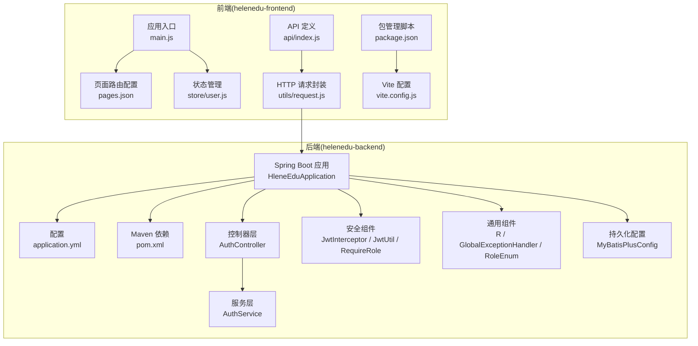
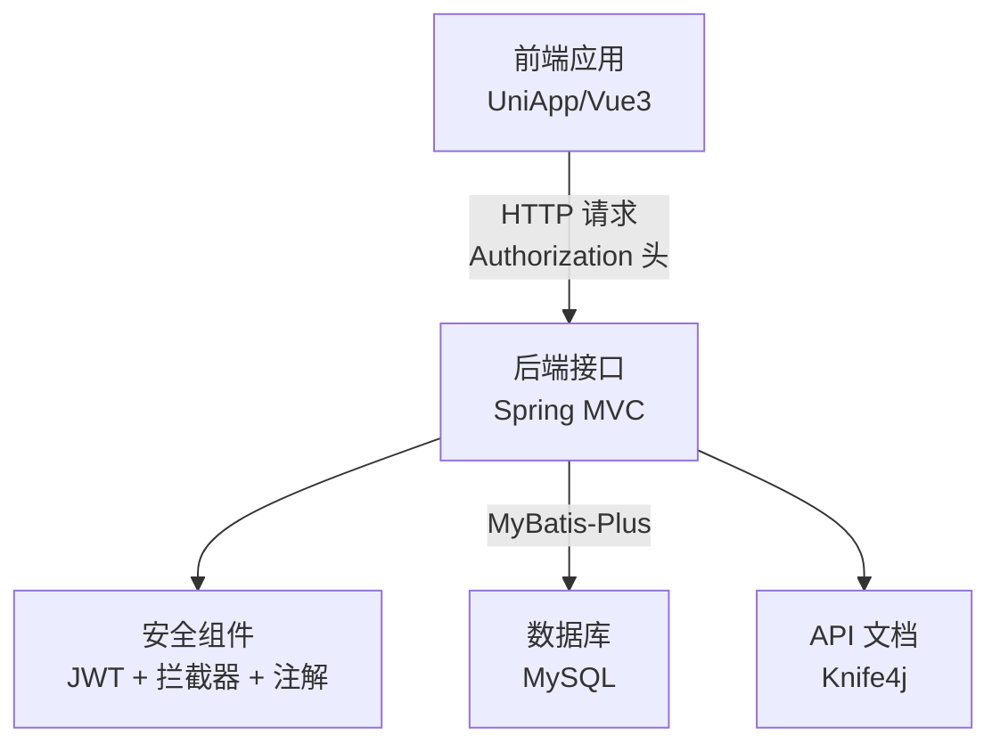
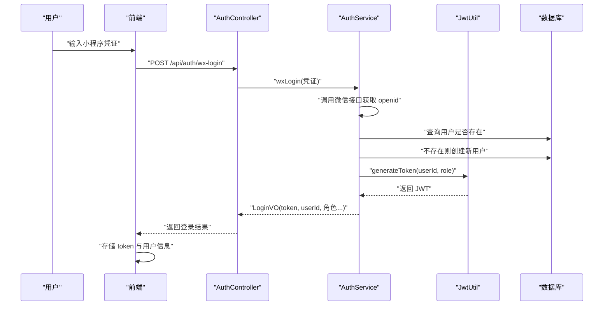
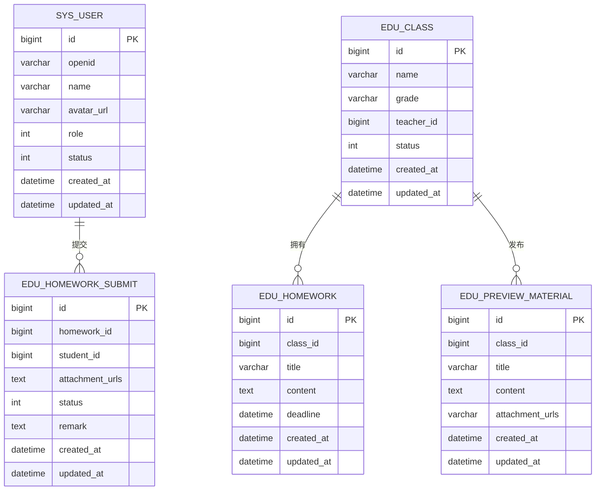
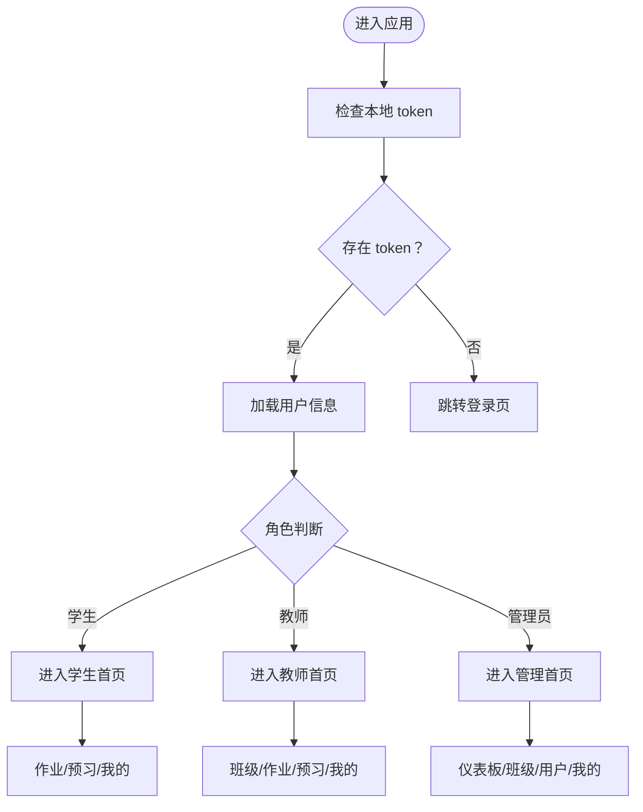
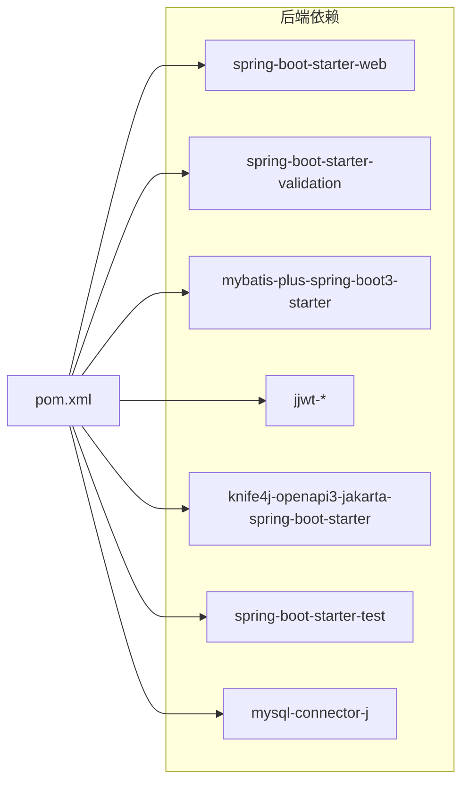

# 开发流程

<cite>
**本文引用的文件**
- [README.md](file://README.md)
- [HleneEduApplication.java](file://helenedu-backend/src/main/java/com/helen/eduedu/HleneEduApplication.java)
- [application.yml](file://helenedu-backend/src/main/resources/application.yml)
- [pom.xml](file://helenedu-backend/pom.xml)
- [AuthController.java](file://helenedu-backend/src/main/java/com/helen/eduedu/controller/AuthController.java)
- [AuthService.java](file://helenedu-backend/src/main/java/com/helen/eduedu/service/AuthService.java)
- [EduClass.java](file://helenedu-backend/src/main/java/com/helen/eduedu/entity/EduClass.java)
- [UserRequest.java](file://helenedu-backend/src/main/java/com/helen/eduedu/dto/UserRequest.java)
- [JwtInterceptor.java](file://helenedu-backend/src/main/java/com/helen/eduedu/security/JwtInterceptor.java)
- [JwtUtil.java](file://helenedu-backend/src/main/java/com/helen/eduedu/security/JwtUtil.java)
- [RequireRole.java](file://helenedu-backend/src/main/java/com/helen/eduedu/security/RequireRole.java)
- [GlobalExceptionHandler.java](file://helenedu-backend/src/main/java/com/helen/eduedu/common/GlobalExceptionHandler.java)
- [R.java](file://helenedu-backend/src/main/java/com/helen/eduedu/common/R.java)
- [RoleEnum.java](file://helenedu-backend/src/main/java/com/helen/eduedu/common/RoleEnum.java)
- [MyBatisPlusConfig.java](file://helenedu-backend/src/main/java/com/helen/eduedu/config/MyBatisPlusConfig.java)
- [WebMvcConfig.java](file://helenedu-backend/src/main/java/com/helen/eduedu/config/WebMvcConfig.java)
- [vite.config.js](file://helenedu-frontend/vite.config.js)
- [package.json](file://helenedu-frontend/package.json)
- [main.js](file://helenedu-frontend/src/main.js)
- [pages.json](file://helenedu-frontend/src/pages.json)
- [index.js](file://helenedu-frontend/src/api/index.js)
- [request.js](file://helenedu-frontend/src/utils/request.js)
- [user.js](file://helenedu-frontend/src/store/user.js)
</cite>

## 目录
1. [引言](#引言)
2. [项目结构](#项目结构)
3. [核心组件](#核心组件)
4. [架构总览](#架构总览)
5. [详细组件分析](#详细组件分析)
6. [依赖分析](#依赖分析)
7. [性能考虑](#性能考虑)
8. [故障排查指南](#故障排查指南)
9. [结论](#结论)
10. [附录](#附录)

## 引言
本文件面向 HelenEdu 项目的开发团队，提供从需求到上线的完整开发流程说明，涵盖版本控制策略、代码审查流程、CI/CD 配置建议、开发环境搭建与数据库配置、API 接口测试方法，以及团队协作与沟通机制。内容基于仓库现有代码结构与配置进行提炼，确保可操作性与一致性。

## 项目结构
HelenEdu 采用前后端分离架构：后端使用 Spring Boot + MyBatis-Plus，前端使用 Vue 3 + UniApp（支持 H5 与小程序）。后端通过 Knife4j 提供 OpenAPI 文档，前端通过统一请求封装对接后端接口。

图表来源
- [HleneEduApplication.java:1-15](file://helenedu-backend/src/main/java/com/helen/eduedu/HleneEduApplication.java#L1-L15)
- [application.yml:1-59](file://helenedu-backend/src/main/resources/application.yml#L1-L59)
- [pom.xml:1-118](file://helenedu-backend/pom.xml#L1-L118)
- [AuthController.java:1-39](file://helenedu-backend/src/main/java/com/helen/eduedu/controller/AuthController.java#L1-L39)
- [AuthService.java:1-128](file://helenedu-backend/src/main/java/com/helen/eduedu/service/AuthService.java#L1-L128)
- [JwtInterceptor.java](file://helenedu-backend/src/main/java/com/helen/eduedu/security/JwtInterceptor.java)
- [JwtUtil.java](file://helenedu-backend/src/main/java/com/helen/eduedu/security/JwtUtil.java)
- [RequireRole.java](file://helenedu-backend/src/main/java/com/helen/eduedu/security/RequireRole.java)
- [R.java](file://helenedu-backend/src/main/java/com/helen/eduedu/common/R.java)
- [GlobalExceptionHandler.java](file://helenedu-backend/src/main/java/com/helen/eduedu/common/GlobalExceptionHandler.java)
- [RoleEnum.java](file://helenedu-backend/src/main/java/com/helen/eduedu/common/RoleEnum.java)
- [MyBatisPlusConfig.java](file://helenedu-backend/src/main/java/com/helen/eduedu/config/MyBatisPlusConfig.java)
- [main.js:1-11](file://helenedu-frontend/src/main.js#L1-L11)
- [pages.json:1-112](file://helenedu-frontend/src/pages.json#L1-L112)
- [index.js:1-50](file://helenedu-frontend/src/api/index.js#L1-L50)
- [request.js:1-83](file://helenedu-frontend/src/utils/request.js#L1-L83)
- [user.js:1-62](file://helenedu-frontend/src/store/user.js#L1-L62)
- [vite.config.js:1-7](file://helenedu-frontend/vite.config.js#L1-L7)
- [package.json:1-28](file://helenedu-frontend/package.json#L1-L28)

章节来源
- [README.md:1-3](file://README.md#L1-L3)
- [HleneEduApplication.java:1-15](file://helenedu-backend/src/main/java/com/helen/eduedu/HleneEduApplication.java#L1-L15)
- [application.yml:1-59](file://helenedu-backend/src/main/resources/application.yml#L1-L59)
- [pom.xml:1-118](file://helenedu-backend/pom.xml#L1-L118)
- [main.js:1-11](file://helenedu-frontend/src/main.js#L1-L11)
- [pages.json:1-112](file://helenedu-frontend/src/pages.json#L1-L112)
- [index.js:1-50](file://helenedu-frontend/src/api/index.js#L1-L50)
- [request.js:1-83](file://helenedu-frontend/src/utils/request.js#L1-L83)
- [user.js:1-62](file://helenedu-frontend/src/store/user.js#L1-L62)
- [vite.config.js:1-7](file://helenedu-frontend/vite.config.js#L1-L7)
- [package.json:1-28](file://helenedu-frontend/package.json#L1-L28)

## 核心组件
- 后端应用启动器负责扫描 Mapper 与启动 Spring Boot 应用。
- 控制器层提供认证、班级、作业、预习资料、用户、仪表盘等接口。
- 服务层实现业务逻辑，如微信登录、用户信息查询、JWT 生成与校验。
- 安全层通过拦截器与注解实现权限控制与 Token 校验。
- 通用层提供统一响应体、全局异常处理与角色枚举。
- 前端通过 Pinia 管理用户态，封装请求并对接后端 API。

章节来源
- [HleneEduApplication.java:1-15](file://helenedu-backend/src/main/java/com/helen/eduedu/HleneEduApplication.java#L1-L15)
- [AuthController.java:1-39](file://helenedu-backend/src/main/java/com/helen/eduedu/controller/AuthController.java#L1-L39)
- [AuthService.java:1-128](file://helenedu-backend/src/main/java/com/helen/eduedu/service/AuthService.java#L1-L128)
- [JwtInterceptor.java](file://helenedu-backend/src/main/java/com/helen/eduedu/security/JwtInterceptor.java)
- [JwtUtil.java](file://helenedu-backend/src/main/java/com/helen/eduedu/security/JwtUtil.java)
- [RequireRole.java](file://helenedu-backend/src/main/java/com/helen/eduedu/security/RequireRole.java)
- [R.java](file://helenedu-backend/src/main/java/com/helen/eduedu/common/R.java)
- [GlobalExceptionHandler.java](file://helenedu-backend/src/main/java/com/helen/eduedu/common/GlobalExceptionHandler.java)
- [RoleEnum.java](file://helenedu-backend/src/main/java/com/helen/eduedu/common/RoleEnum.java)
- [main.js:1-11](file://helenedu-frontend/src/main.js#L1-L11)
- [user.js:1-62](file://helenedu-frontend/src/store/user.js#L1-L62)
- [index.js:1-50](file://helenedu-frontend/src/api/index.js#L1-L50)
- [request.js:1-83](file://helenedu-frontend/src/utils/request.js#L1-L83)

## 架构总览
后端通过 Spring MVC 对外暴露 REST 接口，Knife4j 提供在线文档；前端通过 uni-app 统一请求封装，携带 Authorization 头访问受保护接口；JWT 实现无状态鉴权，配合拦截器与注解完成权限控制。

图表来源
- [AuthController.java:1-39](file://helenedu-backend/src/main/java/com/helen/eduedu/controller/AuthController.java#L1-L39)
- [AuthService.java:1-128](file://helenedu-backend/src/main/java/com/helen/eduedu/service/AuthService.java#L1-L128)
- [JwtInterceptor.java](file://helenedu-backend/src/main/java/com/helen/eduedu/security/JwtInterceptor.java)
- [JwtUtil.java](file://helenedu-backend/src/main/java/com/helen/eduedu/security/JwtUtil.java)
- [RequireRole.java](file://helenedu-backend/src/main/java/com/helen/eduedu/security/RequireRole.java)
- [application.yml:33-59](file://helenedu-backend/src/main/resources/application.yml#L33-L59)
- [pom.xml:73-78](file://helenedu-backend/pom.xml#L73-L78)

## 详细组件分析

### 认证与授权流程
- 前端登录成功后存储 token 与用户信息，后续请求自动附加 Authorization 头。
- 后端拦截器解析 Token，注入用户标识；控制器通过注解声明所需角色。
- 服务层实现微信登录，调用微信接口获取 openid，按需创建用户并签发 JWT。

图表来源
- [AuthController.java:26-30](file://helenedu-backend/src/main/java/com/helen/eduedu/controller/AuthController.java#L26-L30)
- [AuthService.java:42-82](file://helenedu-backend/src/main/java/com/helen/eduedu/service/AuthService.java#L42-L82)
- [JwtUtil.java](file://helenedu-backend/src/main/java/com/helen/eduedu/security/JwtUtil.java)
- [request.js:9-19](file://helenedu-frontend/src/utils/request.js#L9-L19)
- [user.js:8-18](file://helenedu-frontend/src/store/user.js#L8-L18)

章节来源
- [AuthController.java:1-39](file://helenedu-backend/src/main/java/com/helen/eduedu/controller/AuthController.java#L1-L39)
- [AuthService.java:1-128](file://helenedu-backend/src/main/java/com/helen/eduedu/service/AuthService.java#L1-L128)
- [JwtInterceptor.java](file://helenedu-backend/src/main/java/com/helen/eduedu/security/JwtInterceptor.java)
- [JwtUtil.java](file://helenedu-backend/src/main/java/com/helen/eduedu/security/JwtUtil.java)
- [RequireRole.java](file://helenedu-backend/src/main/java/com/helen/eduedu/security/RequireRole.java)
- [request.js:1-83](file://helenedu-frontend/src/utils/request.js#L1-L83)
- [user.js:1-62](file://helenedu-frontend/src/store/user.js#L1-L62)

### 数据模型与实体关系
系统围绕用户、班级、作业、提交、预习资料等实体展开，采用逻辑删除字段与驼峰映射提升可维护性。

图表来源
- [EduClass.java:1-36](file://helenedu-backend/src/main/java/com/helen/eduedu/entity/EduClass.java#L1-L36)
- [SysUser.java](file://helenedu-backend/src/main/java/com/helen/eduedu/entity/SysUser.java)
- [EduHomework.java](file://helenedu-backend/src/main/java/com/helen/eduedu/entity/EduHomework.java)
- [EduHomeworkSubmit.java](file://helenedu-backend/src/main/java/com/helen/eduedu/entity/EduHomeworkSubmit.java)
- [EduPreviewMaterial.java](file://helenedu-backend/src/main/java/com/helen/eduedu/entity/EduPreviewMaterial.java)

章节来源
- [EduClass.java:1-36](file://helenedu-backend/src/main/java/com/helen/eduedu/entity/EduClass.java#L1-L36)

### 前端页面与路由
- pages.json 定义页面与 Tab 栏，不同角色进入不同首页。
- store/user.js 统一管理登录态与角色转换。
- api/index.js 汇总各模块 API 方法，便于页面调用。

图表来源
- [pages.json:85-110](file://helenedu-frontend/src/pages.json#L85-L110)
- [user.js:40-49](file://helenedu-frontend/src/store/user.js#L40-L49)
- [index.js:1-50](file://helenedu-frontend/src/api/index.js#L1-L50)

章节来源
- [pages.json:1-112](file://helenedu-frontend/src/pages.json#L1-L112)
- [user.js:1-62](file://helenedu-frontend/src/store/user.js#L1-L62)
- [index.js:1-50](file://helenedu-frontend/src/api/index.js#L1-L50)

## 依赖分析
- 后端依赖 Spring Boot、MyBatis-Plus、JWT、Knife4j、Jackson、MySQL 驱动与测试 Starter。
- 前端依赖 uni-app 生态、Vue 3、Pinia 与 Vite 插件。

图表来源
- [pom.xml:27-99](file://helenedu-backend/pom.xml#L27-L99)

章节来源
- [pom.xml:1-118](file://helenedu-backend/pom.xml#L1-L118)
- [package.json:12-26](file://helenedu-frontend/package.json#L12-L26)

## 性能考虑
- 后端启用 MyBatis-Plus 日志输出与驼峰映射，便于调试与一致性。
- 前端请求封装统一处理 401 与业务错误码，减少重复逻辑。
- 建议在 CI 中增加单元测试覆盖率与接口压测，结合数据库连接池参数优化吞吐。

## 故障排查指南
- 登录失败：检查微信 appid/secret 配置与网络连通性；查看服务端日志与异常处理返回。
- 401 未授权：确认前端是否正确携带 Authorization 头；核对后端拦截器与 Token 有效期。
- 数据库连接失败：核对 application.yml 中的数据库 URL、用户名与密码。
- API 文档不可用：确认 Knife4j 开关与路径配置。

章节来源
- [AuthService.java:102-126](file://helenedu-backend/src/main/java/com/helen/eduedu/service/AuthService.java#L102-L126)
- [request.js:20-44](file://helenedu-frontend/src/utils/request.js#L20-L44)
- [application.yml:33-59](file://helenedu-backend/src/main/resources/application.yml#L33-L59)
- [GlobalExceptionHandler.java](file://helenedu-backend/src/main/java/com/helen/eduedu/common/GlobalExceptionHandler.java)

## 结论
本开发流程文档基于现有代码与配置，给出了从需求到上线的实践路径。建议团队在实际落地时补充版本控制分支模型、PR 模板与 CI/CD 流水线，并完善测试与监控体系，以保障交付质量与迭代效率。

## 附录

### 版本控制与分支管理策略（建议）
- 分支模型
  - 主分支(main): 仅接收稳定版本合并，打标签发布。
  - 开发分支(dev): 集成日常开发，定期同步主分支。
  - 功能分支(feature/*): 每个功能独立分支，完成后合并至 dev。
  - 热修复分支(hotfix/*): 紧急修复线上问题，同时合并回 main 与 dev。
- 合并策略
  - 使用 Rebase 保持线性历史；或使用 Squash Merge 减少分支噪音。
  - 合并前必须通过 CI 自动检查与代码审查。
- 冲突解决
  - 明确冲突责任人；优先通过 rebase/merge 解决；必要时召开短会协同。

### 代码审查流程（建议）
- PR 模板
  - 摘要：变更目的与影响范围
  - 变更点：逐项列出改动
  - 测试要点：自测步骤与边界条件
  - 风险与回滚：潜在风险与回滚预案
- 审查清单
  - 代码风格与命名规范
  - 安全与权限校验
  - 错误处理与异常捕获
  - 性能与资源占用
  - 文档与注释更新
- 反馈处理
  - 明确回复与修改计划；必要时安排同步评审

### 持续集成/持续部署（CI/CD）配置（建议）
- 自动化测试
  - 后端：单元测试与集成测试（含数据库初始化）
  - 前端：单元测试与端到端测试（小程序/浏览器）
- 构建与打包
  - 后端：Maven 打包为可执行 JAR
  - 前端：根据平台选择构建命令（H5/小程序）
- 部署
  - 容器化部署（Docker）+ 反向代理（Nginx）
  - 数据库迁移脚本纳入流水线
  - 灰度发布与回滚策略

### 开发环境配置
- 后端
  - JDK 17、MySQL 5.7+/8.0、IDE（推荐 IntelliJ IDEA）
  - application.yml 中数据库与 JWT 参数按本地环境调整
  - 启动类 HleneEduApplication 作为入口
- 前端
  - Node.js LTS、HBuilderX 或 VS Code
  - package.json 中脚本用于启动与构建
  - vite.config.js 已启用 uni 插件

章节来源
- [application.yml:1-59](file://helenedu-backend/src/main/resources/application.yml#L1-L59)
- [HleneEduApplication.java:1-15](file://helenedu-backend/src/main/java/com/helen/eduedu/HleneEduApplication.java#L1-L15)
- [package.json:6-11](file://helenedu-frontend/package.json#L6-L11)
- [vite.config.js:1-7](file://helenedu-frontend/vite.config.js#L1-L7)

### 团队协作规范与沟通机制（建议）
- 规范
  - 统一代码风格与提交信息格式
  - 每日站会与迭代回顾
- 沟通
  - 使用即时通讯工具与任务看板
  - 重大决策形成文档记录与共识