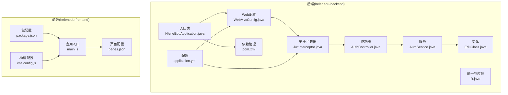
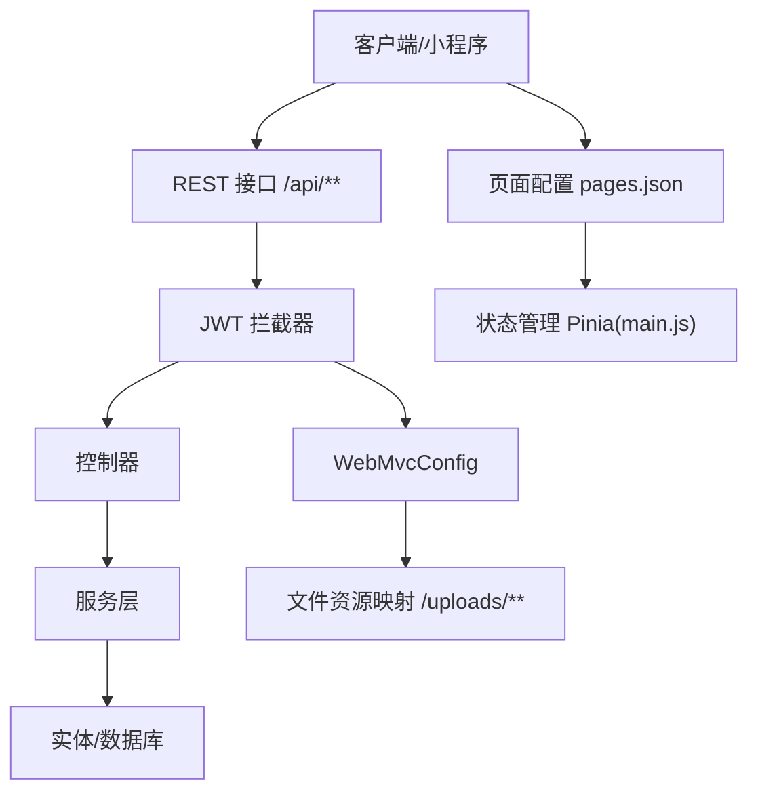
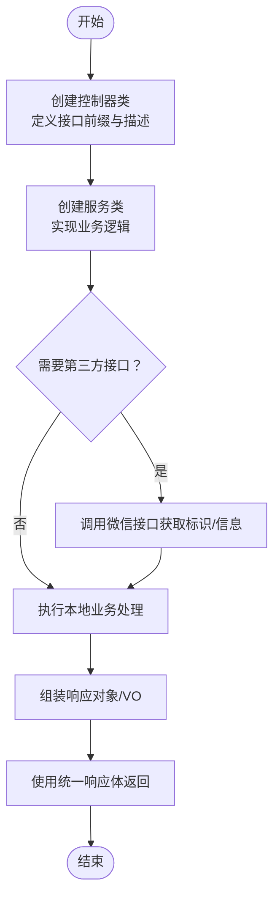
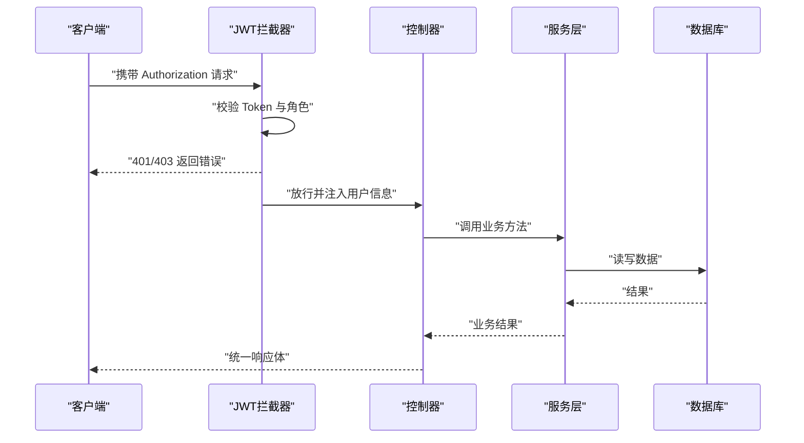
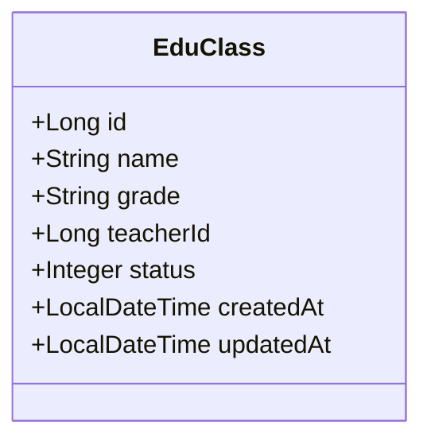
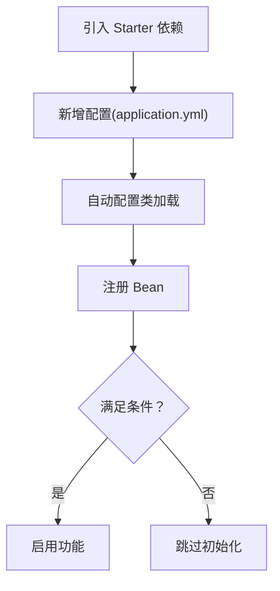
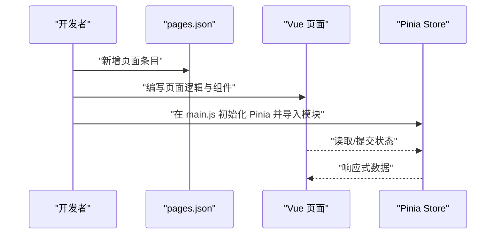
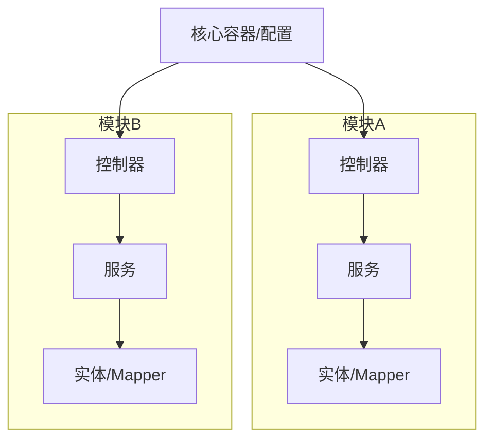
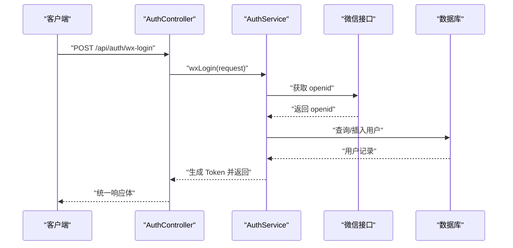
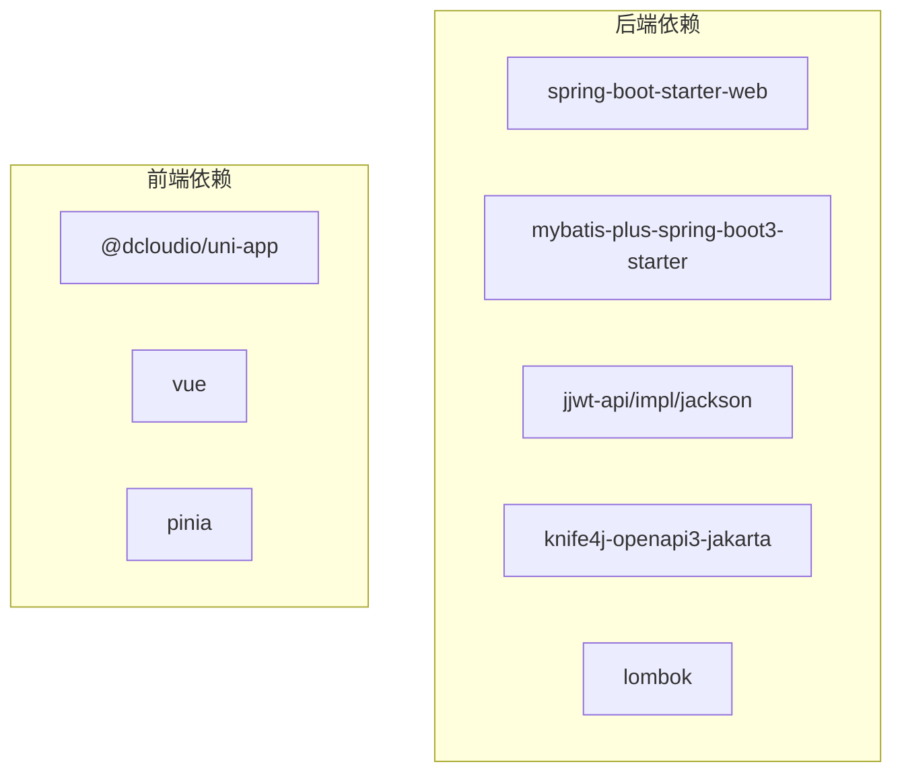

# 扩展开发

<cite>
**本文引用的文件**
- [HleneEduApplication.java](file://helenedu-backend/src/main/java/com/helen/eduedu/HleneEduApplication.java)
- [pom.xml](file://helenedu-backend/pom.xml)
- [application.yml](file://helenedu-backend/src/main/resources/application.yml)
- [WebMvcConfig.java](file://helenedu-backend/src/main/java/com/helen/eduedu/config/WebMvcConfig.java)
- [JwtInterceptor.java](file://helenedu-backend/src/main/java/com/helen/eduedu/security/JwtInterceptor.java)
- [R.java](file://helenedu-backend/src/main/java/com/helen/eduedu/common/R.java)
- [EduClass.java](file://helenedu-backend/src/main/java/com/helen/eduedu/entity/EduClass.java)
- [AuthController.java](file://helenedu-backend/src/main/java/com/helen/eduedu/controller/AuthController.java)
- [AuthService.java](file://helenedu-backend/src/main/java/com/helen/eduedu/service/AuthService.java)
- [WxLoginRequest.java](file://helenedu-backend/src/main/java/com/helen/eduedu/dto/WxLoginRequest.java)
- [LoginVO.java](file://helenedu-backend/src/main/java/com/helen/eduedu/vo/LoginVO.java)
- [main.js](file://helenedu-frontend/src/main.js)
- [pages.json](file://helenedu-frontend/src/pages.json)
- [package.json](file://helenedu-frontend/package.json)
- [vite.config.js](file://helenedu-frontend/vite.config.js)
</cite>

## 目录
1. [引言](#引言)
2. [项目结构](#项目结构)
3. [核心组件](#核心组件)
4. [架构总览](#架构总览)
5. [详细组件分析](#详细组件分析)
6. [依赖分析](#依赖分析)
7. [性能考虑](#性能考虑)
8. [故障排查指南](#故障排查指南)
9. [结论](#结论)
10. [附录](#附录)

## 引言
本指南面向在现有 HelenEdu 项目上进行扩展开发的工程师，目标是帮助你在不破坏既有架构的前提下，快速、规范地完成新模块开发与集成。内容覆盖：
- 后端 Spring Boot 扩展机制：自定义 Starter 开发思路、配置类编写、Bean 注册、条件注解使用
- 前端 Vue.js 扩展方法：新页面开发、组件封装、状态管理扩展、路由配置
- 插件化开发模式：功能模块化设计、接口抽象、依赖注入
- 第三方集成：微信接口、文件存储、消息推送等
- 性能优化与安全加固最佳实践
- 可直接复用的扩展模板与示例路径

## 项目结构
后端采用 Spring Boot 单体架构，分层清晰：入口类、配置、控制器、服务、持久层、实体、DTO/VO、通用工具与安全拦截器；前端基于 uni-app/Vue 3 + Pinia，通过 pages.json 进行页面与 Tab 配置。

**图示来源**
- [HleneEduApplication.java:1-15](file://helenedu-backend/src/main/java/com/helen/eduedu/HleneEduApplication.java#L1-L15)
- [application.yml:1-59](file://helenedu-backend/src/main/resources/application.yml#L1-L59)
- [WebMvcConfig.java:1-40](file://helenedu-backend/src/main/java/com/helen/eduedu/config/WebMvcConfig.java#L1-L40)
- [JwtInterceptor.java:1-85](file://helenedu-backend/src/main/java/com/helen/eduedu/security/JwtInterceptor.java#L1-L85)
- [R.java:1-42](file://helenedu-backend/src/main/java/com/helen/eduedu/common/R.java#L1-L42)
- [AuthController.java:1-39](file://helenedu-backend/src/main/java/com/helen/eduedu/controller/AuthController.java#L1-L39)
- [AuthService.java:1-128](file://helenedu-backend/src/main/java/com/helen/eduedu/service/AuthService.java#L1-L128)
- [EduClass.java:1-36](file://helenedu-backend/src/main/java/com/helen/eduedu/entity/EduClass.java#L1-L36)
- [main.js:1-11](file://helenedu-frontend/src/main.js#L1-L11)
- [pages.json:1-112](file://helenedu-frontend/src/pages.json#L1-L112)
- [package.json:1-28](file://helenedu-frontend/package.json#L1-L28)
- [vite.config.js:1-7](file://helenedu-frontend/vite.config.js#L1-L7)

**章节来源**
- [HleneEduApplication.java:1-15](file://helenedu-backend/src/main/java/com/helen/eduedu/HleneEduApplication.java#L1-L15)
- [pom.xml:1-118](file://helenedu-backend/pom.xml#L1-L118)
- [application.yml:1-59](file://helenedu-backend/src/main/resources/application.yml#L1-L59)
- [main.js:1-11](file://helenedu-frontend/src/main.js#L1-L11)
- [pages.json:1-112](file://helenedu-frontend/src/pages.json#L1-L112)

## 核心组件
- 入口类与扫描：启动类启用自动扫描 Mapper 包，确保 MyBatis-Plus 能发现映射器。
- Web 配置：注册拦截器与静态资源映射，支持文件上传访问。
- 安全拦截：JWT 拦截器统一校验 Token 与角色权限，非 Controller 方法与预检请求放行。
- 统一响应：R<T> 提供统一的响应结构，便于前后端约定。
- 认证模块：微信登录、用户信息查询，集成微信接口获取 openid 并发放 JWT。
- 前端应用：Pinia 状态管理、页面路由配置、构建脚本。

**章节来源**
- [HleneEduApplication.java:1-15](file://helenedu-backend/src/main/java/com/helen/eduedu/HleneEduApplication.java#L1-L15)
- [WebMvcConfig.java:1-40](file://helenedu-backend/src/main/java/com/helen/eduedu/config/WebMvcConfig.java#L1-L40)
- [JwtInterceptor.java:1-85](file://helenedu-backend/src/main/java/com/helen/eduedu/security/JwtInterceptor.java#L1-L85)
- [R.java:1-42](file://helenedu-backend/src/main/java/com/helen/eduedu/common/R.java#L1-L42)
- [AuthController.java:1-39](file://helenedu-backend/src/main/java/com/helen/eduedu/controller/AuthController.java#L1-L39)
- [AuthService.java:1-128](file://helenedu-backend/src/main/java/com/helen/eduedu/service/AuthService.java#L1-L128)
- [main.js:1-11](file://helenedu-frontend/src/main.js#L1-L11)

## 架构总览
后端采用“控制器-服务-持久层”三层架构，配合拦截器链实现鉴权与权限控制；前端通过 uni-app 的页面配置与 Pinia 管理状态，构建多角色页面体系。

**图示来源**
- [WebMvcConfig.java:24-38](file://helenedu-backend/src/main/java/com/helen/eduedu/config/WebMvcConfig.java#L24-L38)
- [JwtInterceptor.java:27-68](file://helenedu-backend/src/main/java/com/helen/eduedu/security/JwtInterceptor.java#L27-L68)
- [AuthController.java:20-38](file://helenedu-backend/src/main/java/com/helen/eduedu/controller/AuthController.java#L20-L38)
- [main.js:5-10](file://helenedu-frontend/src/main.js#L5-L10)
- [pages.json:1-112](file://helenedu-frontend/src/pages.json#L1-L112)

## 详细组件分析

### 后端扩展：新模块开发流程
- 控制器层：新增控制器类，使用注解声明接口前缀与操作描述，返回统一响应体。
- 服务层：实现业务逻辑，必要时调用第三方接口（如微信），处理异常并抛出业务异常。
- 实体与映射：新增实体类与 Mapper，遵循命名规范，配置 MyBatis-Plus。
- 配置与拦截：如需鉴权，可在 WebMvcConfig 中添加路径规则；如需角色限制，在控制器或方法上标注角色注解。
- 测试与文档：使用 Knife4j/Swagger 生成接口文档，补充单元测试。

**图示来源**
- [AuthController.java:20-38](file://helenedu-backend/src/main/java/com/helen/eduedu/controller/AuthController.java#L20-L38)
- [AuthService.java:42-82](file://helenedu-backend/src/main/java/com/helen/eduedu/service/AuthService.java#L42-L82)
- [R.java:16-26](file://helenedu-backend/src/main/java/com/helen/eduedu/common/R.java#L16-L26)

**章节来源**
- [AuthController.java:1-39](file://helenedu-backend/src/main/java/com/helen/eduedu/controller/AuthController.java#L1-L39)
- [AuthService.java:1-128](file://helenedu-backend/src/main/java/com/helen/eduedu/service/AuthService.java#L1-L128)
- [R.java:1-42](file://helenedu-backend/src/main/java/com/helen/eduedu/common/R.java#L1-L42)

### 后端扩展：接口设计原则
- 统一响应：所有接口返回统一响应体，便于前端处理与错误提示。
- 参数校验：使用校验注解保证输入参数合法性，减少脏数据进入业务层。
- 权限控制：通过拦截器与角色注解组合，实现细粒度权限控制。
- 错误处理：集中异常处理与业务异常抛出，避免泄露内部细节。

**图示来源**
- [JwtInterceptor.java:27-68](file://helenedu-backend/src/main/java/com/helen/eduedu/security/JwtInterceptor.java#L27-L68)
- [AuthController.java:32-37](file://helenedu-backend/src/main/java/com/helen/eduedu/controller/AuthController.java#L32-L37)
- [R.java:16-26](file://helenedu-backend/src/main/java/com/helen/eduedu/common/R.java#L16-L26)

**章节来源**
- [JwtInterceptor.java:1-85](file://helenedu-backend/src/main/java/com/helen/eduedu/security/JwtInterceptor.java#L1-L85)
- [R.java:1-42](file://helenedu-backend/src/main/java/com/helen/eduedu/common/R.java#L1-L42)

### 后端扩展：数据模型扩展方法
- 新增实体：定义字段与注解，映射到数据库表；如需逻辑删除，参考全局配置。
- Mapper 与 XML：按约定命名 Mapper 接口与 XML 文件，使用 MyBatis-Plus 提供的方法或自定义 SQL。
- DTO/VO：分离请求与响应模型，避免直接暴露实体。
- 配置同步：更新 application.yml 中的 MyBatis-Plus 配置（如需）。

**图示来源**
- [EduClass.java:14-35](file://helenedu-backend/src/main/java/com/helen/eduedu/entity/EduClass.java#L14-L35)

**章节来源**
- [EduClass.java:1-36](file://helenedu-backend/src/main/java/com/helen/eduedu/entity/EduClass.java#L1-L36)

### 后端扩展：Spring Boot 扩展机制
- 自定义 Starter：建议以模块化方式拆分功能，提供自动配置类与条件注解，按需启用。
- 配置类：在 application.yml 中新增配置项，通过 @Value 或 @ConfigurationProperties 绑定。
- Bean 注册：在配置类中定义 Bean，确保生命周期与作用域正确。
- 条件注解：使用 @ConditionalOnProperty/@ConditionalOnMissingBean 等，实现按环境启用。

**图示来源**
- [pom.xml:27-98](file://helenedu-backend/pom.xml#L27-L98)
- [application.yml:33-46](file://helenedu-backend/src/main/resources/application.yml#L33-L46)

**章节来源**
- [pom.xml:1-118](file://helenedu-backend/pom.xml#L1-L118)
- [application.yml:1-59](file://helenedu-backend/src/main/resources/application.yml#L1-L59)

### 前端扩展：Vue.js 组件扩展方法
- 新页面开发：在 pages.json 中新增页面路径与导航样式，编写对应 Vue 页面。
- 组件封装：将通用 UI 抽象为可复用组件，通过 props 与事件与父组件通信。
- 状态管理：在 main.js 中初始化 Pinia，按模块划分 Store，避免全局污染。
- 路由配置：pages.json 作为 uni-app 的页面路由，无需额外配置。

**图示来源**
- [pages.json:2-78](file://helenedu-frontend/src/pages.json#L2-L78)
- [main.js:5-10](file://helenedu-frontend/src/main.js#L5-L10)
- [package.json:12-26](file://helenedu-frontend/package.json#L12-L26)
- [vite.config.js:1-7](file://helenedu-frontend/vite.config.js#L1-L7)

**章节来源**
- [pages.json:1-112](file://helenedu-frontend/src/pages.json#L1-L112)
- [main.js:1-11](file://helenedu-frontend/src/main.js#L1-L11)
- [package.json:1-28](file://helenedu-frontend/package.json#L1-L28)
- [vite.config.js:1-7](file://helenedu-frontend/vite.config.js#L1-L7)

### 插件化开发模式
- 功能模块化：将业务拆分为独立模块，每个模块包含控制器、服务、实体、Mapper、配置。
- 接口抽象：定义清晰的接口契约，便于替换实现与扩展第三方能力。
- 依赖注入：通过 Spring 容器管理 Bean 生命周期，避免硬编码耦合。
- 条件装配：根据配置开关启用/禁用模块，降低部署复杂度。

[此图为概念性示意，无需图示来源]

### 第三方集成方法
- 微信接口集成：参考认证模块中的微信登录流程，封装调用与错误处理。
- 文件存储服务集成：在 application.yml 中配置上传目录与访问地址，映射静态资源。
- 消息推送服务集成：建议通过异步任务或消息队列解耦，避免阻塞主流程。

**图示来源**
- [AuthController.java:26-30](file://helenedu-backend/src/main/java/com/helen/eduedu/controller/AuthController.java#L26-L30)
- [AuthService.java:42-82](file://helenedu-backend/src/main/java/com/helen/eduedu/service/AuthService.java#L42-L82)
- [WxLoginRequest.java:10-18](file://helenedu-backend/src/main/java/com/helen/eduedu/dto/WxLoginRequest.java#L10-L18)
- [LoginVO.java:9-16](file://helenedu-backend/src/main/java/com/helen/eduedu/vo/LoginVO.java#L9-L16)

**章节来源**
- [application.yml:38-46](file://helenedu-backend/src/main/resources/application.yml#L38-L46)
- [WebMvcConfig.java:33-38](file://helenedu-backend/src/main/java/com/helen/eduedu/config/WebMvcConfig.java#L33-L38)
- [AuthService.java:102-126](file://helenedu-backend/src/main/java/com/helen/eduedu/service/AuthService.java#L102-L126)

## 依赖分析
后端依赖以 Spring Boot 3、MyBatis-Plus、JWT、Knife4j 为主；前端依赖 uni-app 3 与 Vue 3、Pinia。

**图示来源**
- [pom.xml:27-98](file://helenedu-backend/pom.xml#L27-L98)
- [package.json:12-26](file://helenedu-frontend/package.json#L12-L26)

**章节来源**
- [pom.xml:1-118](file://helenedu-backend/pom.xml#L1-L118)
- [package.json:1-28](file://helenedu-frontend/package.json#L1-L28)

## 性能考虑
- 数据访问：合理使用分页查询与索引，避免 N+1 查询；利用 MyBatis-Plus 的条件构造器与逻辑删除。
- 缓存策略：对热点数据使用缓存（如用户信息、字典数据），结合失效策略。
- 异步处理：耗时操作（如文件上传、消息推送）放入异步任务，避免阻塞请求线程。
- 网络与 IO：限制文件大小、开启压缩、合理配置连接池与超时时间。
- 监控与日志：接入指标监控与日志追踪，定位性能瓶颈。

[本节为通用指导，无需章节来源]

## 故障排查指南
- 认证失败：检查 Authorization 头是否携带 Bearer Token，确认 Token 是否过期；查看拦截器返回的统一错误响应。
- 权限不足：确认控制器或方法上的角色注解与用户角色匹配。
- 文件访问异常：确认 application.yml 中的上传目录与访问路径配置一致，静态资源映射是否生效。
- 微信登录异常：核对 appid/secret 配置，关注微信接口返回的错误码与日志。

**章节来源**
- [JwtInterceptor.java:79-83](file://helenedu-backend/src/main/java/com/helen/eduedu/security/JwtInterceptor.java#L79-L83)
- [WebMvcConfig.java:33-38](file://helenedu-backend/src/main/java/com/helen/eduedu/config/WebMvcConfig.java#L33-L38)
- [application.yml:38-46](file://helenedu-backend/src/main/resources/application.yml#L38-L46)

## 结论
通过遵循统一响应、参数校验、拦截器鉴权与模块化设计的原则，可以在 HelenEdu 基础上高效扩展新功能。后端可借助 Spring Boot 的自动配置与条件注解实现灵活扩展，前端通过 pages.json 与 Pinia 快速构建页面与状态管理。第三方集成应注重健壮性与可维护性，并配套完善的监控与日志。

[本节为总结，无需章节来源]

## 附录
- 扩展模板与示例路径（仅提供路径，不展示具体代码）
  - 控制器模板：[AuthController.java:20-38](file://helenedu-backend/src/main/java/com/helen/eduedu/controller/AuthController.java#L20-L38)
  - 服务模板：[AuthService.java:24-82](file://helenedu-backend/src/main/java/com/helen/eduedu/service/AuthService.java#L24-L82)
  - 实体模板：[EduClass.java:14-35](file://helenedu-backend/src/main/java/com/helen/eduedu/entity/EduClass.java#L14-L35)
  - 统一响应模板：[R.java:9-41](file://helenedu-backend/src/main/java/com/helen/eduedu/common/R.java#L9-L41)
  - 前端页面模板：[pages.json:2-78](file://helenedu-frontend/src/pages.json#L2-L78)
  - 前端状态模板：[main.js:5-10](file://helenedu-frontend/src/main.js#L5-L10)
  - 配置模板：[application.yml:33-59](file://helenedu-backend/src/main/resources/application.yml#L33-L59)
  - 依赖模板：[pom.xml:27-98](file://helenedu-backend/pom.xml#L27-L98)

[本节为附录，无需章节来源]