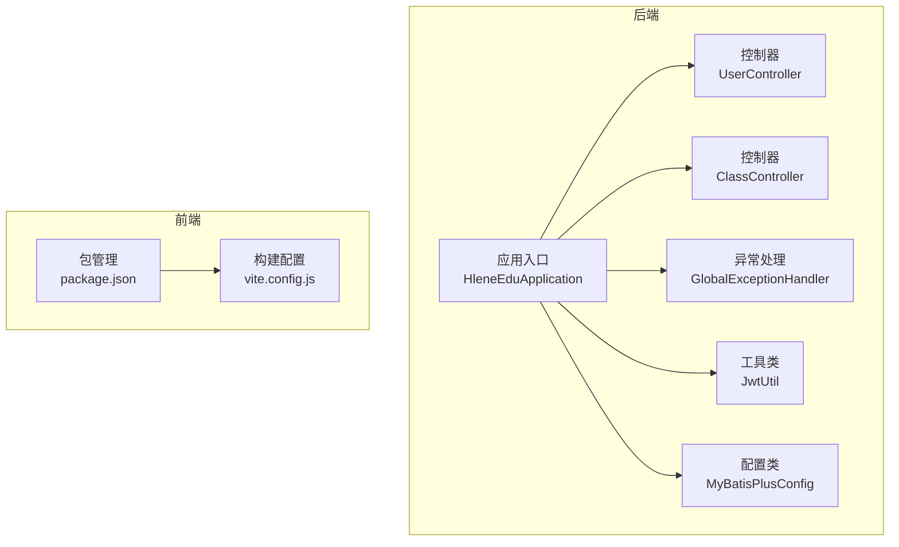
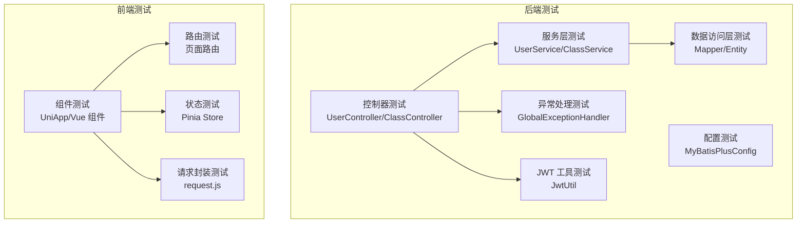
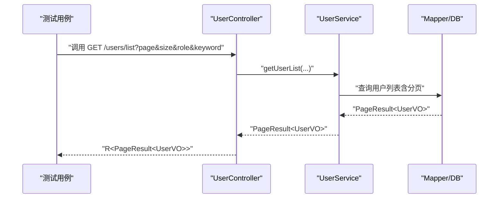
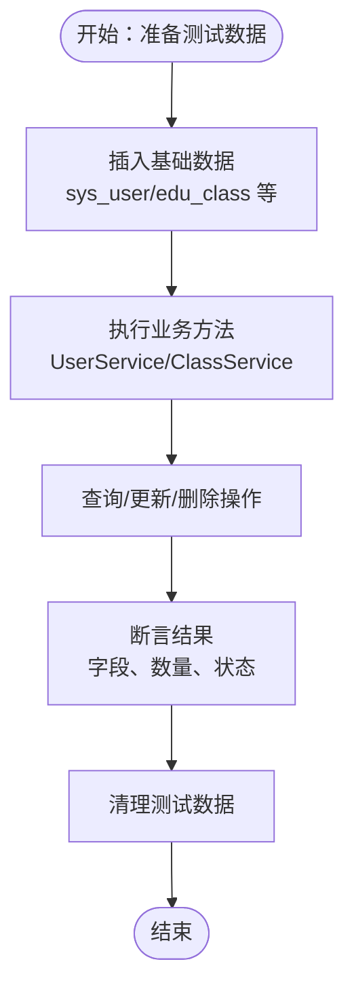
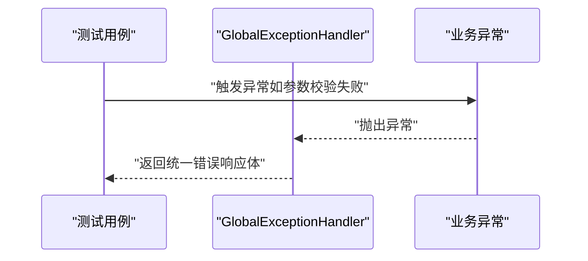
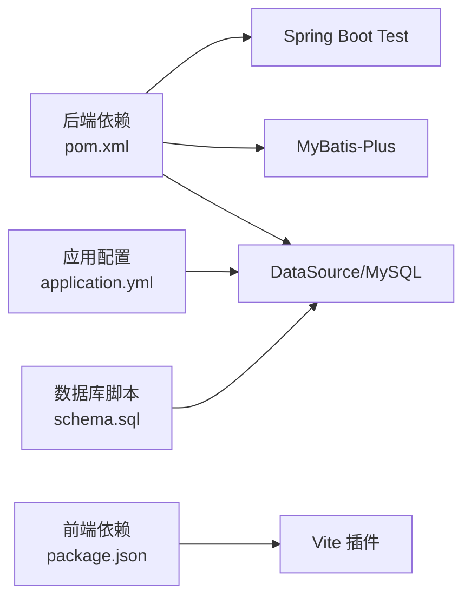

# 测试策略

<cite>
**本文引用的文件**
- [helenedu-backend/pom.xml](file://helenedu-backend/pom.xml)
- [helenedu-backend/src/main/resources/application.yml](file://helenedu-backend/src/main/resources/application.yml)
- [helenedu-backend/src/main/resources/db/schema.sql](file://helenedu-backend/src/main/resources/db/schema.sql)
- [helenedu-backend/src/main/java/com/helen/eduedu/HleneEduApplication.java](file://helenedu-backend/src/main/java/com/helen/eduedu/HleneEduApplication.java)
- [helenedu-backend/src/main/java/com/helen/eduedu/common/GlobalExceptionHandler.java](file://helenedu-backend/src/main/java/com/helen/eduedu/common/GlobalExceptionHandler.java)
- [helenedu-backend/src/main/java/com/helen/eduedu/security/JwtUtil.java](file://helenedu-backend/src/main/java/com/helen/eduedu/security/JwtUtil.java)
- [helenedu-backend/src/main/java/com/helen/eduedu/controller/UserController.java](file://helenedu-backend/src/main/java/com/helen/eduedu/controller/UserController.java)
- [helenedu-backend/src/main/java/com/helen/eduedu/controller/ClassController.java](file://helenedu-backend/src/main/java/com/helen/eduedu/controller/ClassController.java)
- [helenedu-backend/src/main/java/com/helen/eduedu/config/MyBatisPlusConfig.java](file://helenedu-backend/src/main/java/com/helen/eduedu/config/MyBatisPlusConfig.java)
- [helenedu-frontend/package.json](file://helenedu-frontend/package.json)
- [helenedu-frontend/vite.config.js](file://helenedu-frontend/vite.config.js)
</cite>

## 目录
1. 引言
2. 项目结构
3. 核心组件
4. 架构总览
5. 详细组件分析
6. 依赖关系分析
7. 性能考量
8. 故障排查指南
9. 结论
10. 附录

## 引言
本测试策略文档面向 HelenEdu 项目，覆盖后端与前端的测试方法论与实施建议，包括：
- 后端单元测试：基于 Spring Boot 的 JUnit 5 与 Mockito 使用、控制器与服务层断言、异常处理与边界条件。
- 集成测试：Spring Boot Test 注解、数据库初始化与事务回滚、API 端到端验证。
- 前端测试：基于 Vite 与 UniApp 的组件测试、路由与状态测试思路。
- 覆盖率目标与持续集成：覆盖率门槛、CI 自动化配置建议。
- 测试数据准备与清理：数据库脚本、测试环境隔离、事务回滚策略。
- 最佳实践与常见陷阱：命名规范、断言策略、并发与异步场景。

## 项目结构
后端采用 Spring Boot 3 + MyBatis-Plus，前端采用 Vite + UniApp。测试应围绕以下关键点展开：
- 后端：控制器层（HTTP 接口）、服务层（业务逻辑）、数据访问层（Mapper/Entity）、安全与全局异常处理。
- 前端：页面组件、路由、状态管理（Pinia）、API 请求封装。

图示来源
- [helenedu-backend/src/main/java/com/helen/eduedu/HleneEduApplication.java:1-15](file://helenedu-backend/src/main/java/com/helen/eduedu/HleneEduApplication.java#L1-L15)
- [helenedu-backend/src/main/java/com/helen/eduedu/config/MyBatisPlusConfig.java:1-21](file://helenedu-backend/src/main/java/com/helen/eduedu/config/MyBatisPlusConfig.java#L1-L21)
- [helenedu-backend/src/main/java/com/helen/eduedu/controller/UserController.java:43-77](file://helenedu-backend/src/main/java/com/helen/eduedu/controller/UserController.java#L43-L77)
- [helenedu-backend/src/main/java/com/helen/eduedu/controller/ClassController.java:79-115](file://helenedu-backend/src/main/java/com/helen/eduedu/controller/ClassController.java#L79-L115)
- [helenedu-backend/src/main/java/com/helen/eduedu/common/GlobalExceptionHandler.java:32-57](file://helenedu-backend/src/main/java/com/helen/eduedu/common/GlobalExceptionHandler.java#L32-L57)
- [helenedu-backend/src/main/java/com/helen/eduedu/security/JwtUtil.java:45-86](file://helenedu-backend/src/main/java/com/helen/eduedu/security/JwtUtil.java#L45-L86)
- [helenedu-frontend/package.json:1-28](file://helenedu-frontend/package.json#L1-L28)
- [helenedu-frontend/vite.config.js:1-7](file://helenedu-frontend/vite.config.js#L1-L7)

章节来源
- [helenedu-backend/src/main/java/com/helen/eduedu/HleneEduApplication.java:1-15](file://helenedu-backend/src/main/java/com/helen/eduedu/HleneEduApplication.java#L1-L15)
- [helenedu-backend/src/main/java/com/helen/eduedu/config/MyBatisPlusConfig.java:1-21](file://helenedu-backend/src/main/java/com/helen/eduedu/config/MyBatisPlusConfig.java#L1-L21)
- [helenedu-backend/src/main/java/com/helen/eduedu/common/GlobalExceptionHandler.java:32-57](file://helenedu-backend/src/main/java/com/helen/eduedu/common/GlobalExceptionHandler.java#L32-L57)
- [helenedu-backend/src/main/java/com/helen/eduedu/security/JwtUtil.java:45-86](file://helenedu-backend/src/main/java/com/helen/eduedu/security/JwtUtil.java#L45-L86)
- [helenedu-backend/src/main/java/com/helen/eduedu/controller/UserController.java:43-77](file://helenedu-backend/src/main/java/com/helen/eduedu/controller/UserController.java#L43-L77)
- [helenedu-backend/src/main/java/com/helen/eduedu/controller/ClassController.java:79-115](file://helenedu-backend/src/main/java/com/helen/eduedu/controller/ClassController.java#L79-L115)
- [helenedu-frontend/package.json:1-28](file://helenedu-frontend/package.json#L1-L28)
- [helenedu-frontend/vite.config.js:1-7](file://helenedu-frontend/vite.config.js#L1-L7)

## 核心组件
- 应用入口与扫描：应用启动类负责包扫描与 Mapper 扫描，确保测试时可加载完整上下文。
- 配置类：MyBatis-Plus 分页插件配置，影响分页查询的测试行为。
- 控制器层：暴露 REST 接口，包含鉴权注解与参数校验，是测试的主要目标。
- 全局异常处理：统一返回体与错误码，测试需覆盖异常分支。
- 安全工具：JWT 工具类用于解析与校验 Token，测试中可通过模拟注入或构造请求头进行验证。

章节来源
- [helenedu-backend/src/main/java/com/helen/eduedu/HleneEduApplication.java:1-15](file://helenedu-backend/src/main/java/com/helen/eduedu/HleneEduApplication.java#L1-L15)
- [helenedu-backend/src/main/java/com/helen/eduedu/config/MyBatisPlusConfig.java:1-21](file://helenedu-backend/src/main/java/com/helen/eduedu/config/MyBatisPlusConfig.java#L1-L21)
- [helenedu-backend/src/main/java/com/helen/eduedu/common/GlobalExceptionHandler.java:32-57](file://helenedu-backend/src/main/java/com/helen/eduedu/common/GlobalExceptionHandler.java#L32-L57)
- [helenedu-backend/src/main/java/com/helen/eduedu/security/JwtUtil.java:45-86](file://helenedu-backend/src/main/java/com/helen/eduedu/security/JwtUtil.java#L45-L86)

## 架构总览
后端测试架构围绕“控制器层 + 服务层 + 数据访问层 + 配置 + 异常处理”展开；前端测试围绕“组件 + 路由 + 状态 + 请求封装”。

图示来源
- [helenedu-backend/src/main/java/com/helen/eduedu/controller/UserController.java:43-77](file://helenedu-backend/src/main/java/com/helen/eduedu/controller/UserController.java#L43-L77)
- [helenedu-backend/src/main/java/com/helen/eduedu/controller/ClassController.java:79-115](file://helenedu-backend/src/main/java/com/helen/eduedu/controller/ClassController.java#L79-L115)
- [helenedu-backend/src/main/java/com/helen/eduedu/common/GlobalExceptionHandler.java:32-57](file://helenedu-backend/src/main/java/com/helen/eduedu/common/GlobalExceptionHandler.java#L32-L57)
- [helenedu-backend/src/main/java/com/helen/eduedu/security/JwtUtil.java:45-86](file://helenedu-backend/src/main/java/com/helen/eduedu/security/JwtUtil.java#L45-L86)
- [helenedu-frontend/package.json:1-28](file://helenedu-frontend/package.json#L1-L28)

## 详细组件分析

### 后端：控制器层测试策略
- 目标：验证接口行为、参数校验、鉴权注解、返回体格式与状态码。
- 方法：
  - 使用 Spring Boot Test 与 MockMvc 或 @WebMvcTest 进行控制器测试。
  - 使用 Mockito 模拟服务层，隔离外部依赖。
  - 断言要点：状态码、响应体字段、分页信息、角色权限控制。
- 关键接口参考路径：
  - 用户列表与状态切换：[UserController.java:43-77](file://helenedu-backend/src/main/java/com/helen/eduedu/controller/UserController.java#L43-L77)
  - 班级成员管理与教师列表：[ClassController.java:79-115](file://helenedu-backend/src/main/java/com/helen/eduedu/controller/ClassController.java#L79-L115)

图示来源
- [helenedu-backend/src/main/java/com/helen/eduedu/controller/UserController.java:43-77](file://helenedu-backend/src/main/java/com/helen/eduedu/controller/UserController.java#L43-L77)
- [helenedu-backend/src/main/java/com/helen/eduedu/config/MyBatisPlusConfig.java:1-21](file://helenedu-backend/src/main/java/com/helen/eduedu/config/MyBatisPlusConfig.java#L1-L21)

章节来源
- [helenedu-backend/src/main/java/com/helen/eduedu/controller/UserController.java:43-77](file://helenedu-backend/src/main/java/com/helen/eduedu/controller/UserController.java#L43-L77)
- [helenedu-backend/src/main/java/com/helen/eduedu/controller/ClassController.java:79-115](file://helenedu-backend/src/main/java/com/helen/eduedu/controller/ClassController.java#L79-L115)
- [helenedu-backend/src/main/java/com/helen/eduedu/config/MyBatisPlusConfig.java:1-21](file://helenedu-backend/src/main/java/com/helen/eduedu/config/MyBatisPlusConfig.java#L1-L21)

### 后端：服务层与数据访问层测试策略
- 目标：验证业务规则、分页与排序、逻辑删除、关联关系。
- 方法：
  - 使用 @DataJpaTest 或 @MybatisTest（结合 Spring Boot Test）进行数据层测试。
  - 使用 @AutoConfigureTestDatabase 与嵌入式数据库（如 H2）提升速度与隔离性。
  - 使用 @Commit/@Rollback 控制事务，确保测试间无副作用。
- 关键实体与映射参考路径：
  - 用户、班级、作业、提交、预习资料等实体与映射关系见数据库脚本与实体定义。

图示来源
- [helenedu-backend/src/main/resources/db/schema.sql:1-94](file://helenedu-backend/src/main/resources/db/schema.sql#L1-L94)

章节来源
- [helenedu-backend/src/main/resources/db/schema.sql:1-94](file://helenedu-backend/src/main/resources/db/schema.sql#L1-L94)

### 后端：全局异常处理与安全工具测试
- 全局异常处理：
  - 覆盖参数绑定异常、约束校验异常、通用异常，断言返回体状态码与消息。
- JWT 工具：
  - 验证签名生成、解析、过期判断、角色提取等，必要时构造无效 Token 场景。

图示来源
- [helenedu-backend/src/main/java/com/helen/eduedu/common/GlobalExceptionHandler.java:32-57](file://helenedu-backend/src/main/java/com/helen/eduedu/common/GlobalExceptionHandler.java#L32-L57)

章节来源
- [helenedu-backend/src/main/java/com/helen/eduedu/common/GlobalExceptionHandler.java:32-57](file://helenedu-backend/src/main/java/com/helen/eduedu/common/GlobalExceptionHandler.java#L32-L57)
- [helenedu-backend/src/main/java/com/helen/eduedu/security/JwtUtil.java:45-86](file://helenedu-backend/src/main/java/com/helen/eduedu/security/JwtUtil.java#L45-L86)

### 前端：组件测试、路由与状态测试
- 组件测试：
  - 基于 Vite 与 UniApp 生态，使用 Vue Test Utils 进行渲染与交互测试。
  - 对页面组件（如用户管理、班级管理、作业列表）进行快照与交互断言。
- 路由测试：
  - 验证页面跳转、参数传递、权限拦截（结合登录状态与角色）。
- 状态测试（Pinia）：
  - 验证用户状态、当前班级、选课列表等在组件中的正确使用。
- 请求封装测试：
  - 对 API 封装（如请求拦截、错误处理）进行单元测试。

章节来源
- [helenedu-frontend/package.json:1-28](file://helenedu-frontend/package.json#L1-L28)
- [helenedu-frontend/vite.config.js:1-7](file://helenedu-frontend/vite.config.js#L1-L7)

## 依赖关系分析
- 后端测试依赖：
  - Spring Boot Starter Test 提供测试运行时与断言库。
  - MyBatis-Plus 配置影响分页查询测试。
  - 数据源配置与数据库脚本决定测试数据准备方式。
- 前端测试依赖：
  - Vite 插件与 UniApp 生态支持组件与页面测试。
  - 包管理脚本提供开发与构建命令，便于 CI 集成。

图示来源
- [helenedu-backend/pom.xml:93-98](file://helenedu-backend/pom.xml#L93-L98)
- [helenedu-backend/src/main/resources/application.yml:6-11](file://helenedu-backend/src/main/resources/application.yml#L6-L11)
- [helenedu-backend/src/main/resources/db/schema.sql:1-94](file://helenedu-backend/src/main/resources/db/schema.sql#L1-L94)
- [helenedu-frontend/package.json:1-28](file://helenedu-frontend/package.json#L1-L28)

章节来源
- [helenedu-backend/pom.xml:93-98](file://helenedu-backend/pom.xml#L93-L98)
- [helenedu-backend/src/main/resources/application.yml:6-11](file://helenedu-backend/src/main/resources/application.yml#L6-L11)
- [helenedu-backend/src/main/resources/db/schema.sql:1-94](file://helenedu-backend/src/main/resources/db/schema.sql#L1-L94)
- [helenedu-frontend/package.json:1-28](file://helenedu-frontend/package.json#L1-L28)

## 性能考量
- 单元测试优先：以 Mock 与内存数据库为主，减少 IO 开销。
- 集成测试限域：仅对关键流程（如鉴权、分页、文件上传）进行集成验证。
- 并发与异步：对异步任务与锁竞争场景进行压力与竞态测试，避免死锁与超时。
- 前端测试：组件渲染与事件触发尽量在虚拟 DOM 上完成，避免真实网络请求。

## 故障排查指南
- 控制器测试常见问题：
  - 参数校验失败导致 400，需检查 DTO 字段与校验注解。
  - 权限注解导致 403，需构造带角色的 Token 或模拟用户上下文。
- 数据层测试常见问题：
  - 分页不生效：确认 MyBatis-Plus 分页插件是否启用。
  - 逻辑删除未生效：确认实体字段与全局配置一致。
- 前端测试常见问题：
  - 页面跳转失败：检查路由守卫与状态管理。
  - 请求拦截异常：检查请求封装与错误处理分支。

## 结论
本测试策略以“后端控制器 + 服务 + 数据层 + 安全与异常处理”为核心，配合“前端组件 + 路由 + 状态 + 请求封装”的测试体系，形成完整的质量保障闭环。建议在 CI 中引入覆盖率统计与自动化执行，持续提升代码稳定性与交付效率。

## 附录

### 测试覆盖率目标与持续集成
- 覆盖率目标（建议）：
  - 行覆盖率：≥ 80%
  - 分支覆盖率：≥ 70%
  - 指标采集：使用 JaCoCo（后端）与相应前端覆盖率工具。
- 持续集成：
  - Maven 目标：mvn test（后端），前端使用 npm scripts（如 dev:h5/build:h5）。
  - 建议在 CI 中增加覆盖率报告与阈值校验，失败即阻断合并。

章节来源
- [helenedu-backend/pom.xml:93-98](file://helenedu-backend/pom.xml#L93-L98)
- [helenedu-frontend/package.json:6-11](file://helenedu-frontend/package.json#L6-L11)

### 测试数据准备与清理策略
- 数据库脚本：使用 schema.sql 初始化基础表与初始数据，测试前先清空或回滚。
- 测试环境隔离：使用独立数据库或容器化数据库，避免多团队并发污染。
- 清理策略：每个测试用例结束后回滚事务，或在 @AfterEach 中删除新增记录。

章节来源
- [helenedu-backend/src/main/resources/db/schema.sql:1-94](file://helenedu-backend/src/main/resources/db/schema.sql#L1-L94)

### 测试最佳实践与常见陷阱
- 最佳实践：
  - 命名清晰：测试方法描述具体输入、行为与期望输出。
  - 断言精准：优先断言关键字段与状态码，避免冗余断言。
  - 隔离性强：使用 Mock 与内存数据库，避免真实外部依赖。
  - 失败可定位：异常信息明确，日志充分。
- 常见陷阱：
  - 忽视异常分支：未覆盖参数校验、鉴权失败、数据库异常。
  - 依赖真实数据库：导致测试不稳定与性能瓶颈。
  - 前端测试绕过网络：未模拟拦截器与错误处理，导致测试结果不可靠。