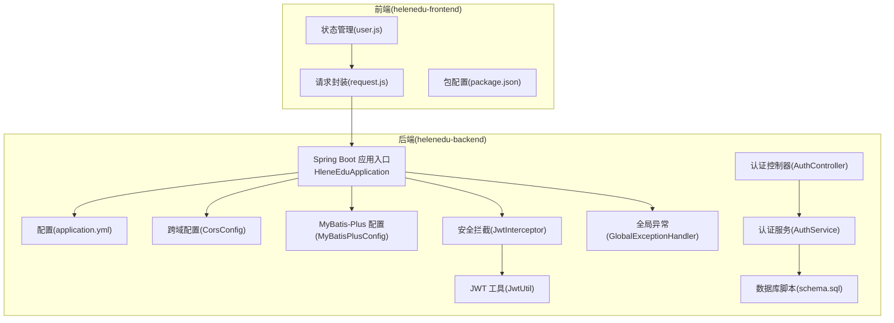
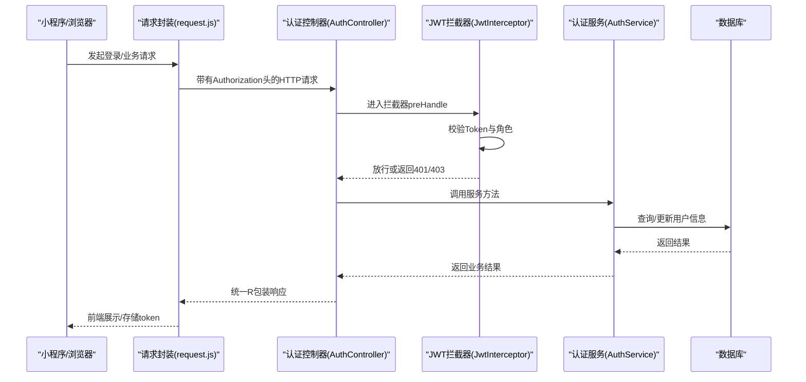
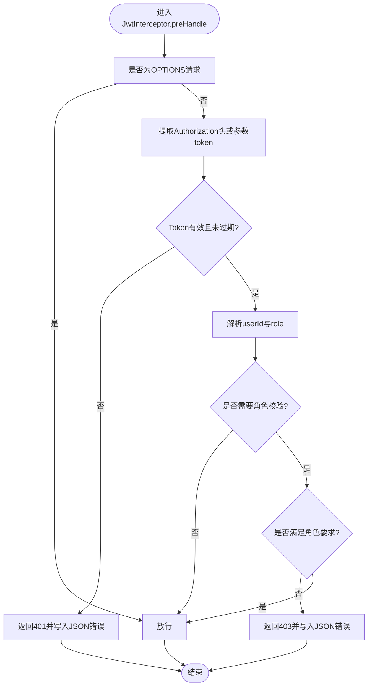
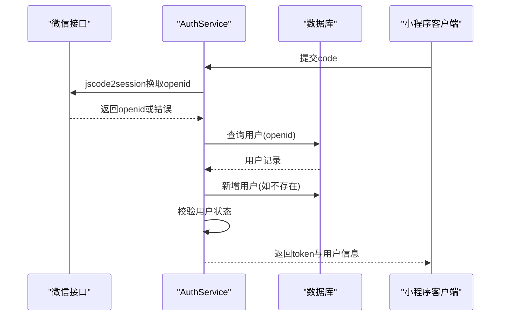
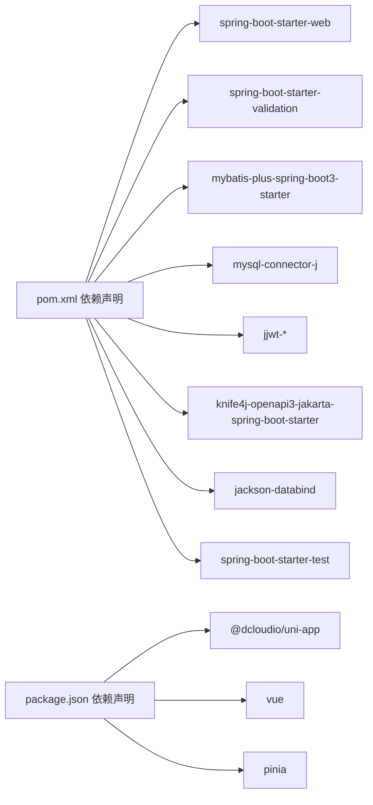

# 调试与故障排除

<cite>
**本文引用的文件**
- [HleneEduApplication.java](file://helenedu-backend/src/main/java/com/helen/eduedu/HleneEduApplication.java)
- [application.yml](file://helenedu-backend/src/main/resources/application.yml)
- [CorsConfig.java](file://helenedu-backend/src/main/java/com/helen/eduedu/config/CorsConfig.java)
- [MyBatisPlusConfig.java](file://helenedu-backend/src/main/java/com/helen/eduedu/config/MyBatisPlusConfig.java)
- [JwtInterceptor.java](file://helenedu-backend/src/main/java/com/helen/eduedu/security/JwtInterceptor.java)
- [JwtUtil.java](file://helenedu-backend/src/main/java/com/helen/eduedu/security/JwtUtil.java)
- [GlobalExceptionHandler.java](file://helenedu-backend/src/main/java/com/helen/eduedu/common/GlobalExceptionHandler.java)
- [AuthService.java](file://helenedu-backend/src/main/java/com/helen/eduedu/service/AuthService.java)
- [AuthController.java](file://helenedu-backend/src/main/java/com/helen/eduedu/controller/AuthController.java)
- [schema.sql](file://helenedu-backend/src/main/resources/db/schema.sql)
- [pom.xml](file://helenedu-backend/pom.xml)
- [request.js](file://helenedu-frontend/src/utils/request.js)
- [user.js](file://helenedu-frontend/src/store/user.js)
- [package.json](file://helenedu-frontend/package.json)
</cite>

## 目录
1. [简介](#简介)
2. [项目结构](#项目结构)
3. [核心组件](#核心组件)
4. [架构总览](#架构总览)
5. [详细组件分析](#详细组件分析)
6. [依赖分析](#依赖分析)
7. [性能考虑](#性能考虑)
8. [故障排除指南](#故障排除指南)
9. [结论](#结论)
10. [附录](#附录)

## 简介
本指南面向HelenEdu项目的开发者与运维人员，提供后端与前端的调试与故障排除方法，涵盖Spring Boot应用启动调试、数据库连接问题排查、JWT认证问题诊断、MyBatis-Plus查询问题分析；前端Vue.js与小程序调试技巧；日志分析方法；常见问题解决方案（跨域、文件上传、微信登录、权限验证）；性能分析工具与内存泄漏检测建议；以及生产环境问题排查流程与应急处理方案。

## 项目结构
后端采用Spring Boot + MyBatis-Plus + Knife4j，前端基于UniApp（支持H5与小程序），通过统一的HTTP封装与Pinia状态管理进行交互。

图表来源
- [HleneEduApplication.java:1-15](file://helenedu-backend/src/main/java/com/helen/eduedu/HleneEduApplication.java#L1-L15)
- [application.yml:1-59](file://helenedu-backend/src/main/resources/application.yml#L1-L59)
- [CorsConfig.java:1-28](file://helenedu-backend/src/main/java/com/helen/eduedu/config/CorsConfig.java#L1-L28)
- [MyBatisPlusConfig.java:1-22](file://helenedu-backend/src/main/java/com/helen/eduedu/config/MyBatisPlusConfig.java#L1-L22)
- [JwtInterceptor.java:1-85](file://helenedu-backend/src/main/java/com/helen/eduedu/security/JwtInterceptor.java#L1-L85)
- [JwtUtil.java:1-87](file://helenedu-backend/src/main/java/com/helen/eduedu/security/JwtUtil.java#L1-L87)
- [GlobalExceptionHandler.java:1-58](file://helenedu-backend/src/main/java/com/helen/eduedu/common/GlobalExceptionHandler.java#L1-L58)
- [AuthService.java:1-128](file://helenedu-backend/src/main/java/com/helen/eduedu/service/AuthService.java#L1-L128)
- [AuthController.java:1-39](file://helenedu-backend/src/main/java/com/helen/eduedu/controller/AuthController.java#L1-L39)
- [schema.sql:1-94](file://helenedu-backend/src/main/resources/db/schema.sql#L1-L94)
- [request.js:1-83](file://helenedu-frontend/src/utils/request.js#L1-L83)
- [user.js:1-62](file://helenedu-frontend/src/store/user.js#L1-L62)
- [package.json:1-28](file://helenedu-frontend/package.json#L1-L28)

章节来源
- [HleneEduApplication.java:1-15](file://helenedu-backend/src/main/java/com/helen/eduedu/HleneEduApplication.java#L1-L15)
- [application.yml:1-59](file://helenedu-backend/src/main/resources/application.yml#L1-L59)
- [request.js:1-83](file://helenedu-frontend/src/utils/request.js#L1-L83)
- [user.js:1-62](file://helenedu-frontend/src/store/user.js#L1-L62)
- [package.json:1-28](file://helenedu-frontend/package.json#L1-L28)

## 核心组件
- 后端启动与扫描：应用入口负责启动Spring Boot并扫描Mapper包，确保MyBatis-Plus能正确发现映射器。
- 配置中心：application.yml集中管理数据库、文件上传、JWT、微信小程序、Knife4j等配置项。
- 安全层：JwtInterceptor在进入Controller前统一校验Token与角色权限；JwtUtil负责签发与解析JWT。
- 数据访问：MyBatis-Plus配置启用分页插件；schema.sql定义了完整的数据模型。
- 异常处理：GlobalExceptionHandler对业务异常、参数校验异常、通用异常进行统一返回。
- 前端通信：request.js统一封装HTTP请求与鉴权头注入；user.js通过Pinia持久化用户态。

章节来源
- [HleneEduApplication.java:1-15](file://helenedu-backend/src/main/java/com/helen/eduedu/HleneEduApplication.java#L1-L15)
- [application.yml:1-59](file://helenedu-backend/src/main/resources/application.yml#L1-L59)
- [JwtInterceptor.java:1-85](file://helenedu-backend/src/main/java/com/helen/eduedu/security/JwtInterceptor.java#L1-L85)
- [JwtUtil.java:1-87](file://helenedu-backend/src/main/java/com/helen/eduedu/security/JwtUtil.java#L1-L87)
- [MyBatisPlusConfig.java:1-22](file://helenedu-backend/src/main/java/com/helen/eduedu/config/MyBatisPlusConfig.java#L1-L22)
- [GlobalExceptionHandler.java:1-58](file://helenedu-backend/src/main/java/com/helen/eduedu/common/GlobalExceptionHandler.java#L1-L58)
- [schema.sql:1-94](file://helenedu-backend/src/main/resources/db/schema.sql#L1-L94)
- [request.js:1-83](file://helenedu-frontend/src/utils/request.js#L1-L83)
- [user.js:1-62](file://helenedu-frontend/src/store/user.js#L1-L62)

## 架构总览
后端通过Web层接收请求，经安全拦截器校验后交由服务层处理，服务层通过Mapper访问数据库；前端通过封装的请求库与后端交互，并通过状态管理维护登录态与角色信息。

图表来源
- [request.js:1-83](file://helenedu-frontend/src/utils/request.js#L1-L83)
- [AuthController.java:1-39](file://helenedu-backend/src/main/java/com/helen/eduedu/controller/AuthController.java#L1-L39)
- [JwtInterceptor.java:1-85](file://helenedu-backend/src/main/java/com/helen/eduedu/security/JwtInterceptor.java#L1-L85)
- [AuthService.java:1-128](file://helenedu-backend/src/main/java/com/helen/eduedu/service/AuthService.java#L1-L128)

## 详细组件分析

### 后端启动与配置调试
- 启动调试要点
  - 使用IDE断点在应用入口处，确认Spring容器加载顺序与组件扫描范围。
  - 检查配置文件加载顺序与覆盖规则，确保开发环境变量正确生效。
- 关键配置定位
  - 数据源与MyBatis-Plus：检查数据库连接串、驱动、Mapper XML位置与驼峰映射。
  - 文件上传：确认最大文件大小与请求大小限制。
  - JWT与微信：核对密钥、过期时间、小程序AppID与Secret。
  - Knife4j：确认Swagger UI与API文档路径。

章节来源
- [HleneEduApplication.java:1-15](file://helenedu-backend/src/main/java/com/helen/eduedu/HleneEduApplication.java#L1-L15)
- [application.yml:1-59](file://helenedu-backend/src/main/resources/application.yml#L1-L59)

### 跨域问题排查（CORS）
- 症状：前端发起预检请求失败或跨域报错。
- 排查步骤
  - 检查CORS配置是否生效（允许的Origin、Header、Method）。
  - 确认拦截器对OPTIONS请求的放行逻辑。
  - 在网关或反向代理层补充CORS头时避免重复。
- 快速验证
  - 使用curl发送OPTIONS请求，观察响应头是否包含允许的来源与方法。

章节来源
- [CorsConfig.java:1-28](file://helenedu-backend/src/main/java/com/helen/eduedu/config/CorsConfig.java#L1-L28)

### JWT认证问题诊断
- 认证拦截链路
  - 请求进入拦截器，提取Authorization头或兼容参数中的token。
  - 校验Token有效性与过期时间，解析用户ID与角色。
  - 对标注@RequireRole的方法进行角色权限校验。
- 常见问题
  - Token格式不正确或缺少Bearer前缀。
  - 密钥不一致导致签名验证失败。
  - 过期时间设置过短或服务器时间不同步。
  - 小程序端未正确传递token参数。
- 诊断方法
  - 打印拦截器中提取的token与解析结果。
  - 使用在线JWT解码工具验证签名与载荷。
  - 检查全局异常处理器对认证异常的返回。

图表来源
- [JwtInterceptor.java:1-85](file://helenedu-backend/src/main/java/com/helen/eduedu/security/JwtInterceptor.java#L1-L85)
- [JwtUtil.java:1-87](file://helenedu-backend/src/main/java/com/helen/eduedu/security/JwtUtil.java#L1-L87)
- [GlobalExceptionHandler.java:1-58](file://helenedu-backend/src/main/java/com/helen/eduedu/common/GlobalExceptionHandler.java#L1-L58)

章节来源
- [JwtInterceptor.java:1-85](file://helenedu-backend/src/main/java/com/helen/eduedu/security/JwtInterceptor.java#L1-L85)
- [JwtUtil.java:1-87](file://helenedu-backend/src/main/java/com/helen/eduedu/security/JwtUtil.java#L1-L87)
- [GlobalExceptionHandler.java:1-58](file://helenedu-backend/src/main/java/com/helen/eduedu/common/GlobalExceptionHandler.java#L1-L58)

### MyBatis-Plus查询问题分析
- 分页与SQL输出
  - 启用MyBatis-Plus日志实现以查看生成的SQL与参数。
  - 检查分页插件是否正确配置，避免N+1问题。
- 常见问题
  - 字段命名与实体属性不匹配导致映射失败。
  - 逻辑删除字段未正确配置或误用。
  - XML映射文件路径或命名空间不正确。
- 排查步骤
  - 在application.yml中开启StdOut日志实现，观察控制台SQL。
  - 使用Knife4j接口文档验证请求参数与返回结构。
  - 单元测试或集成测试验证Mapper方法行为。

章节来源
- [MyBatisPlusConfig.java:1-22](file://helenedu-backend/src/main/java/com/helen/eduedu/config/MyBatisPlusConfig.java#L1-L22)
- [application.yml:21-32](file://helenedu-backend/src/main/resources/application.yml#L21-L32)

### 微信登录问题诊断
- 登录流程
  - 前端传入code，后端调用微信接口换取openid。
  - 查询用户是否存在，不存在则自动注册默认角色。
  - 校验用户状态，生成JWT返回给前端。
- 常见问题
  - 小程序AppID/Secret未配置或错误。
  - 微信接口调用失败或返回错误码。
  - 用户被禁用导致登录失败。
- 诊断方法
  - 检查微信配置项是否从配置中心正确读取。
  - 观察服务层对外部接口调用的日志与异常分支。
  - 使用Postman或Knife4j模拟登录请求，逐步定位问题。

图表来源
- [AuthService.java:1-128](file://helenedu-backend/src/main/java/com/helen/eduedu/service/AuthService.java#L1-L128)
- [AuthController.java:1-39](file://helenedu-backend/src/main/java/com/helen/eduedu/controller/AuthController.java#L1-L39)
- [application.yml:38-46](file://helenedu-backend/src/main/resources/application.yml#L38-L46)

章节来源
- [AuthService.java:1-128](file://helenedu-backend/src/main/java/com/helen/eduedu/service/AuthService.java#L1-L128)
- [AuthController.java:1-39](file://helenedu-backend/src/main/java/com/helen/eduedu/controller/AuthController.java#L1-L39)
- [application.yml:38-46](file://helenedu-backend/src/main/resources/application.yml#L38-L46)

### 前端调试技巧（Vue.js/UniApp）
- 开发工具
  - 使用浏览器开发者工具Network面板观察请求头、响应体与状态码。
  - 使用Vue DevTools（若H5运行）查看组件层级与状态变化。
- 网络请求调试
  - 检查请求封装是否正确添加Authorization头。
  - 处理401时主动清理本地token并跳转登录。
- 状态管理调试
  - 使用Pinia Devtools（如可用）观察token与userInfo的变更。
  - 校验本地存储的同步与持久化策略。
- 小程序调试
  - 使用开发者工具的Network与Storage面板。
  - 关注上传接口的文件名、大小与权限。

章节来源
- [request.js:1-83](file://helenedu-frontend/src/utils/request.js#L1-L83)
- [user.js:1-62](file://helenedu-frontend/src/store/user.js#L1-L62)
- [package.json:1-28](file://helenedu-frontend/package.json#L1-L28)

### 日志分析方法
- Spring Boot日志配置
  - application.yml中可调整日期格式、时区与Jackson序列化策略。
  - 全局异常处理器对业务异常与系统异常进行日志记录。
- 错误日志定位
  - 关注拦截器与服务层的关键异常分支，结合业务异常码快速定位。
- 性能日志分析
  - 结合MyBatis-Plus日志输出SQL执行情况，识别慢查询。
  - 使用Knife4j统计接口耗时与调用量，定位热点接口。

章节来源
- [application.yml:16-19](file://helenedu-backend/src/main/resources/application.yml#L16-L19)
- [GlobalExceptionHandler.java:1-58](file://helenedu-backend/src/main/java/com/helen/eduedu/common/GlobalExceptionHandler.java#L1-L58)

## 依赖分析
后端依赖包括Spring Web、Validation、MyBatis-Plus、MySQL驱动、JWT、Knife4j、Lombok与Jackson；前端依赖UniApp生态与Vue3/Pinia。

图表来源
- [pom.xml:1-118](file://helenedu-backend/pom.xml#L1-L118)
- [package.json:1-28](file://helenedu-frontend/package.json#L1-L28)

章节来源
- [pom.xml:1-118](file://helenedu-backend/pom.xml#L1-L118)
- [package.json:1-28](file://helenedu-frontend/package.json#L1-L28)

## 性能考虑
- SQL与缓存
  - 使用MyBatis-Plus分页插件避免一次性加载大结果集。
  - 对热点数据与接口增加缓存（如Redis），减少数据库压力。
- 并发与限流
  - 对登录与微信接口增加限流策略，防止刷量。
- 监控与追踪
  - 使用分布式追踪（如SkyWalking/OpenTelemetry）定位慢调用链。
- 内存与GC
  - 生产环境开启GC日志，关注Full GC频率与停顿时间。
  - 使用内存分析工具（如VisualVM/JProfiler）定位内存泄漏。

## 故障排除指南

### 跨域问题
- 现象：前端请求被CORS拦截，出现预检失败或Access-Control-Allow-Origin缺失。
- 处理：
  - 确认CORS配置允许的来源、头与方法。
  - 拦截器对OPTIONS请求放行。
  - 若使用Nginx或网关，确保转发时保留并正确设置CORS头。

章节来源
- [CorsConfig.java:1-28](file://helenedu-backend/src/main/java/com/helen/eduedu/config/CorsConfig.java#L1-L28)

### 文件上传问题
- 现象：上传失败、文件过大或后端未接收到文件。
- 处理：
  - 检查application.yml中的文件大小限制与上传目录。
  - 前端上传接口需携带Authorization头。
  - 后端FileController需正确接收multipart/form-data。

章节来源
- [application.yml:13-15](file://helenedu-backend/src/main/resources/application.yml#L13-L15)
- [request.js:55-80](file://helenedu-frontend/src/utils/request.js#L55-L80)

### 微信登录问题
- 现象：登录失败、提示“微信登录失败”或“服务异常”。
- 处理：
  - 核对微信小程序AppID与Secret配置。
  - 检查jscode2session接口返回的错误码并记录日志。
  - 校验用户状态与默认角色分配逻辑。

章节来源
- [AuthService.java:102-126](file://helenedu-backend/src/main/java/com/helen/eduedu/service/AuthService.java#L102-L126)
- [application.yml:38-46](file://helenedu-backend/src/main/resources/application.yml#L38-L46)

### 权限验证问题
- 现象：401未登录/403无权限。
- 处理：
  - 确认前端请求头中携带正确的Authorization。
  - 检查拦截器的角色注解与用户角色是否匹配。
  - 校验JWT签名密钥与过期时间。

章节来源
- [JwtInterceptor.java:27-68](file://helenedu-backend/src/main/java/com/helen/eduedu/security/JwtInterceptor.java#L27-L68)
- [JwtUtil.java:78-85](file://helenedu-backend/src/main/java/com/helen/eduedu/security/JwtUtil.java#L78-L85)

### 数据库连接问题
- 现象：应用启动失败或数据库操作异常。
- 处理：
  - 核对application.yml中的数据库URL、用户名、密码与驱动。
  - 确认数据库服务可用、网络连通与防火墙策略。
  - 使用schema.sql初始化数据库结构与基础数据。

章节来源
- [application.yml:7-11](file://helenedu-backend/src/main/resources/application.yml#L7-L11)
- [schema.sql:1-94](file://helenedu-backend/src/main/resources/db/schema.sql#L1-L94)

### MyBatis-Plus查询异常
- 现象：SQL映射失败、分页无效或逻辑删除异常。
- 处理：
  - 启用StdOut日志查看实际SQL与参数。
  - 检查驼峰映射与XML映射文件路径。
  - 确认分页插件DbType与逻辑删除字段配置。

章节来源
- [application.yml:21-32](file://helenedu-backend/src/main/resources/application.yml#L21-L32)
- [MyBatisPlusConfig.java:15-20](file://helenedu-backend/src/main/java/com/helen/eduedu/config/MyBatisPlusConfig.java#L15-L20)

### 前端网络与状态问题
- 现象：接口401自动跳转登录、Toast提示失败。
- 处理：
  - 检查请求封装对401的处理与本地存储清理。
  - 校验Pinia状态与本地存储的同步一致性。
  - 使用开发者工具Network面板对比请求与响应。

章节来源
- [request.js:8-44](file://helenedu-frontend/src/utils/request.js#L8-L44)
- [user.js:5-31](file://helenedu-frontend/src/store/user.js#L5-L31)

## 结论
通过统一的配置中心、完善的异常处理与安全拦截机制，HelenEdu具备良好的可调试性与可观测性。结合前后端调试工具与日志分析，能够快速定位并解决跨域、认证、数据库与上传等常见问题。建议在生产环境引入监控与追踪体系，持续优化性能与稳定性。

## 附录

### 生产环境问题排查流程
- 快速定位
  - 查看应用日志与错误日志，定位异常堆栈与业务异常码。
  - 使用Knife4j核对接口状态与参数。
- 降级与回滚
  - 对热点接口限流与熔断，必要时临时关闭非关键功能。
  - 回滚到上一个稳定版本，修复后再灰度发布。
- 应急处理
  - 重启应用以恢复部分异常状态。
  - 检查数据库连接池与外部依赖（微信接口）可用性。

### 常见问题清单与建议
- 跨域：确认CORS配置与预检放行。
- 文件上传：核对大小限制与Authorization头。
- 微信登录：校对AppID/Secret与错误码日志。
- 权限验证：检查JWT签名与角色注解。
- 数据库：核对连接串与初始化脚本。
- 前端：检查401处理与状态同步。