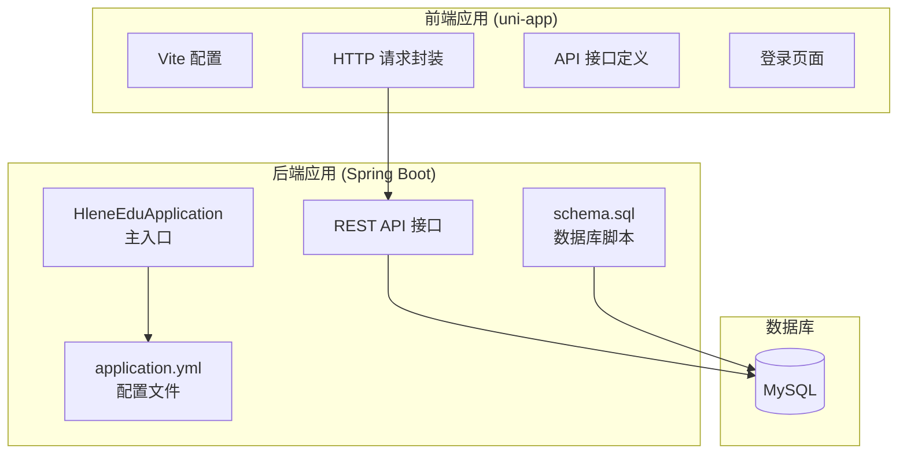
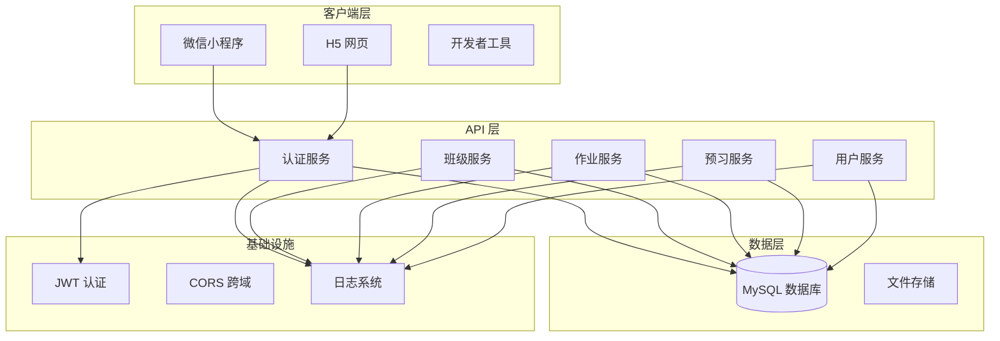
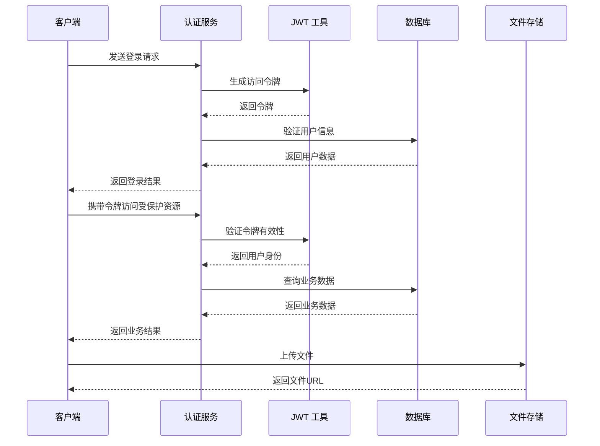

# 快速开始

<cite>
**本文引用的文件**
- [README.md](file://README.md)
- [pom.xml](file://helenedu-backend/pom.xml)
- [application.yml](file://helenedu-backend/src/main/resources/application.yml)
- [schema.sql](file://helenedu-backend/src/main/resources/db/schema.sql)
- [HleneEduApplication.java](file://helenedu-backend/src/main/java/com/helen/eduedu/HleneEduApplication.java)
- [JwtUtil.java](file://helenedu-backend/src/main/java/com/helen/eduedu/security/JwtUtil.java)
- [AuthController.java](file://helenedu-backend/src/main/java/com/helen/eduedu/controller/AuthController.java)
- [package.json](file://helenedu-frontend/package.json)
- [vite.config.js](file://helenedu-frontend/vite.config.js)
- [request.js](file://helenedu-frontend/src/utils/request.js)
- [index.js](file://helenedu-frontend/src/api/index.js)
- [index.vue](file://helenedu-frontend/src/pages/login/index.vue)
</cite>

## 目录
1. [简介](#简介)
2. [项目结构](#项目结构)
3. [环境要求](#环境要求)
4. [开发环境搭建](#开发环境搭建)
5. [数据库初始化](#数据库初始化)
6. [启动与验证](#启动与验证)
7. [常见问题与调试](#常见问题与调试)
8. [架构概览](#架构概览)
9. [结论](#结论)

## 简介
HelenEdu 是一个基于 Spring Boot 后端与 Vue.js 前端的小程序作业管理系统，支持微信小程序与 H5 端访问。项目采用前后端分离架构，后端提供 RESTful API，前端通过 uni-app 框架实现多端适配。

## 项目结构
项目采用标准的前后端分离架构，包含独立的后端 Spring Boot 应用和前端 uni-app 应用。



**图表来源**
- [HleneEduApplication.java:1-15](file://helenedu-backend/src/main/java/com/helen/eduedu/HleneEduApplication.java#L1-L15)
- [application.yml:1-59](file://helenedu-backend/src/main/resources/application.yml#L1-L59)
- [schema.sql:1-94](file://helenedu-backend/src/main/resources/db/schema.sql#L1-L94)

**章节来源**
- [README.md:1-3](file://README.md#L1-L3)
- [pom.xml:1-118](file://helenedu-backend/pom.xml#L1-L118)
- [package.json:1-28](file://helenedu-frontend/package.json#L1-L28)

## 环境要求
为确保在30分钟内成功运行项目，请准备以下环境：

### 后端环境要求
- **JDK 版本**: Java 17 或更高版本
- **Maven**: Maven 3.6+（用于构建后端项目）
- **MySQL**: MySQL 5.7+ 或 8.0+（用于存储数据）

### 前端环境要求
- **Node.js**: Node.js 16+ 或 18+
- **包管理器**: npm 8+ 或 yarn 1.22+
- **开发工具**: VS Code 或其他支持 uni-app 的 IDE

### 开发工具
- **IDE**: IntelliJ IDEA 或 VS Code
- **数据库工具**: MySQL Workbench 或 Navicat
- **API 测试工具**: Postman 或浏览器

**章节来源**
- [pom.xml:20-25](file://helenedu-backend/pom.xml#L20-L25)
- [application.yml:8-11](file://helenedu-backend/src/main/resources/application.yml#L8-L11)
- [package.json:12-26](file://helenedu-frontend/package.json#L12-L26)

## 开发环境搭建

### 后端 Spring Boot 项目配置

#### 1. 克隆项目并导入
```bash
git clone <repository-url>
cd helenedu-backend
```

#### 2. 配置数据库连接
编辑 `application.yml` 文件，修改数据库连接参数：
- 数据库地址: `jdbc:mysql://localhost:3306/helen_edu`
- 用户名: `root`
- 密码: `root`

#### 3. 配置 JWT 密钥
在 `application.yml` 中设置 JWT 密钥和过期时间：
- 密钥: `HelenEduSecretKey2024ForJwtTokenGenerationMustBeLongEnough`
- 过期时间: 7天（604800000 毫秒）

#### 4. 配置微信小程序参数
设置微信小程序的 appid 和 secret：
- appid: `your-appid`
- secret: `your-secret`

#### 5. 构建项目
```bash
mvn clean install
```

### 前端 Vue.js 项目配置

#### 1. 克隆项目并安装依赖
```bash
cd ../helenedu-frontend
npm install
```

#### 2. 配置 API 基础地址
编辑 `src/utils/request.js` 文件：
- 修改 `BASE_URL` 为后端服务地址
- 默认使用 `http://localhost:8080`

#### 3. 配置 uni-app 平台
编辑 `package.json` 脚本：
- 开发微信小程序: `npm run dev:mp-weixin`
- 开发 H5: `npm run dev:h5`
- 生产构建: `npm run build:mp-weixin` 或 `npm run build:h5`

#### 4. 配置 Vite 插件
检查 `vite.config.js` 是否正确配置了 uni-app 插件。

**章节来源**
- [application.yml:1-59](file://helenedu-backend/src/main/resources/application.yml#L1-L59)
- [request.js:1-83](file://helenedu-frontend/src/utils/request.js#L1-L83)
- [package.json:6-11](file://helenedu-frontend/package.json#L6-L11)
- [vite.config.js:1-7](file://helenedu-frontend/vite.config.js#L1-L7)

## 数据库初始化

### 1. 创建数据库
执行 `schema.sql` 文件中的 SQL 语句：
- 创建数据库 `helen_edu`
- 设置字符集为 `utf8mb4`
- 设置排序规则为 `utf8mb4_unicode_ci`

### 2. 初始化数据表
执行以下核心表结构：
- 用户表 (`sys_user`)
- 班级表 (`edu_class`)
- 作业表 (`edu_homework`)
- 作业提交表 (`edu_homework_submit`)
- 预习资料表 (`edu_preview_material`)

### 3. 插入初始用户
数据库脚本包含三个初始用户：
- 系统管理员: 角色 3
- 张老师: 角色 2  
- 李同学: 角色 1

### 4. 验证数据库连接
在 `application.yml` 中配置的数据库连接信息应能正常连接到 MySQL 服务器。

**章节来源**
- [schema.sql:1-94](file://helenedu-backend/src/main/resources/db/schema.sql#L1-L94)
- [application.yml:6-11](file://helenedu-backend/src/main/resources/application.yml#L6-L11)

## 启动与验证

### 后端服务启动

#### 1. 启动 Spring Boot 应用
```bash
# 方法一：使用 Maven
mvn spring-boot:run

# 方法二：直接运行
java -jar target/helenedu-backend-1.0.0.jar
```

#### 2. 验证后端服务
- 访问 Swagger UI: `http://localhost:8080/swagger-ui.html`
- 访问 API 文档: `http://localhost:8080/v3/api-docs`
- 检查服务健康状态: `http://localhost:8080/actuator/health`

### 前端应用启动

#### 1. 启动开发服务器
```bash
# 开发微信小程序
npm run dev:mp-weixin

# 开发 H5
npm run dev:h5
```

#### 2. 配置微信开发者工具
- 打开微信开发者工具
- 选择项目目录为 `helenedu-frontend`
- 配置正确的 AppID（测试号）

### 基本功能测试

#### 1. 登录测试
- 使用默认管理员账号登录
- 验证 JWT Token 生成和验证
- 测试不同角色的权限访问

#### 2. API 接口测试
- 测试认证接口 `/api/auth/wx-login`
- 测试用户信息接口 `/api/auth/userinfo`
- 测试基础 CRUD 操作

#### 3. 文件上传测试
- 测试文件上传功能
- 验证文件存储路径配置
- 检查文件大小限制

**章节来源**
- [HleneEduApplication.java:11-13](file://helenedu-backend/src/main/java/com/helen/eduedu/HleneEduApplication.java#L11-L13)
- [AuthController.java:26-37](file://helenedu-backend/src/main/java/com/helen/eduedu/controller/AuthController.java#L26-L37)
- [index.vue:48-92](file://helenedu-frontend/src/pages/login/index.vue#L48-L92)

## 常见问题与调试

### 数据库连接问题

#### 1. 连接超时
**症状**: 启动时出现数据库连接超时错误
**解决方法**:
- 检查 MySQL 服务是否启动
- 验证数据库连接字符串格式
- 确认防火墙设置允许本地连接

#### 2. 用户名密码错误
**症状**: 出现认证失败错误
**解决方法**:
- 在 `application.yml` 中修改正确的用户名和密码
- 确认 MySQL 用户权限配置

### JWT 令牌问题

#### 1. 令牌过期
**症状**: API 返回 401 未授权错误
**解决方法**:
- 检查 JWT 密钥配置
- 验证令牌过期时间设置
- 重新登录获取新令牌

#### 2. 令牌验证失败
**症状**: 令牌解析异常
**解决方法**:
- 确认密钥长度符合要求
- 检查令牌签名算法配置
- 验证令牌格式正确性

### 前端通信问题

#### 1. CORS 跨域问题
**症状**: 前端请求被浏览器阻止
**解决方法**:
- 检查后端 CORS 配置
- 验证请求头设置
- 确认域名白名单配置

#### 2. API 地址错误
**症状**: 前端无法连接到后端 API
**解决方法**:
- 检查 `request.js` 中的 BASE_URL 配置
- 确认后端服务端口配置
- 验证网络连通性

### 微信登录问题

#### 1. 微信授权失败
**症状**: 微信登录按钮点击无响应
**解决方法**:
- 配置正确的微信 AppID 和 Secret
- 检查微信开发者工具配置
- 验证回调地址设置

#### 2. 开发模式登录异常
**症状**: H5 开发模式无法登录
**解决方法**:
- 确认手机号格式验证
- 检查后端开发模式处理逻辑
- 验证用户数据存在性

### 性能优化建议

#### 1. 数据库性能
- 为常用查询字段添加索引
- 优化复杂查询语句
- 配置合适的连接池参数

#### 2. 缓存策略
- 实现必要的缓存机制
- 配置合理的缓存过期时间
- 监控缓存命中率

#### 3. 日志监控
- 配置适当的日志级别
- 添加关键业务日志
- 设置日志轮转策略

**章节来源**
- [application.yml:33-46](file://helenedu-backend/src/main/resources/application.yml#L33-L46)
- [request.js:20-44](file://helenedu-frontend/src/utils/request.js#L20-L44)
- [index.vue:48-82](file://helenedu-frontend/src/pages/login/index.vue#L48-L82)

## 架构概览

### 系统架构图



**图表来源**
- [AuthController.java:18-38](file://helenedu-backend/src/main/java/com/helen/eduedu/controller/AuthController.java#L18-L38)
- [JwtUtil.java:15-87](file://helenedu-backend/src/main/java/com/helen/eduedu/security/JwtUtil.java#L15-L87)
- [index.js:1-50](file://helenedu-frontend/src/api/index.js#L1-L50)

### 数据流图



**图表来源**
- [AuthController.java:26-37](file://helenedu-backend/src/main/java/com/helen/eduedu/controller/AuthController.java#L26-L37)
- [JwtUtil.java:34-46](file://helenedu-backend/src/main/java/com/helen/eduedu/security/JwtUtil.java#L34-L46)
- [request.js:55-80](file://helenedu-frontend/src/utils/request.js#L55-L80)

## 结论
通过以上步骤，您应该能够在30分钟内成功运行 HelenEdu 项目。项目采用现代化的技术栈，具有良好的可扩展性和维护性。建议在开发过程中重点关注以下方面：

1. **环境一致性**: 确保前后端环境版本匹配
2. **配置管理**: 统一管理各环境的配置文件
3. **安全性**: 重视 JWT 认证和数据安全
4. **性能优化**: 关注数据库查询和缓存策略
5. **监控告警**: 建立完善的日志和监控体系

如遇技术问题，可以参考本文档的故障排除部分或查阅相关源码文件以获得更详细的信息。