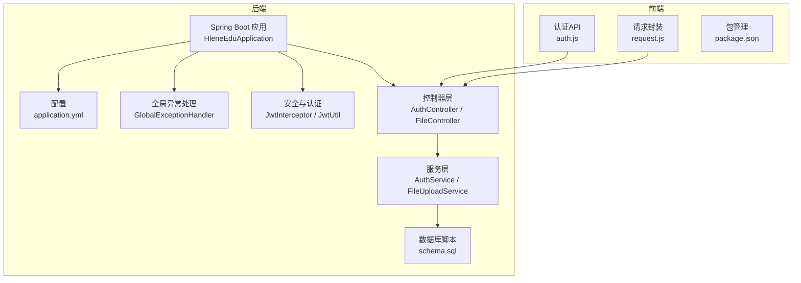
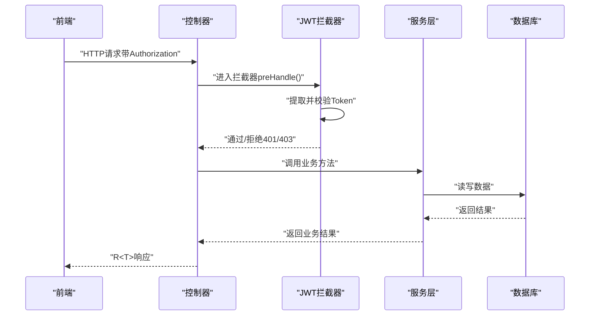
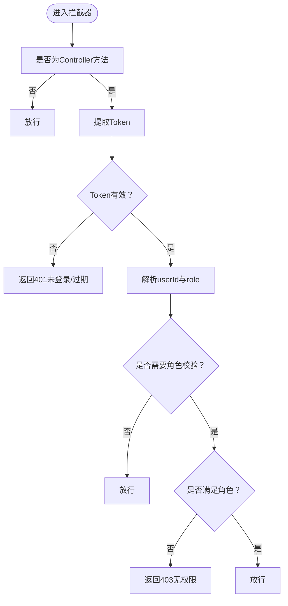
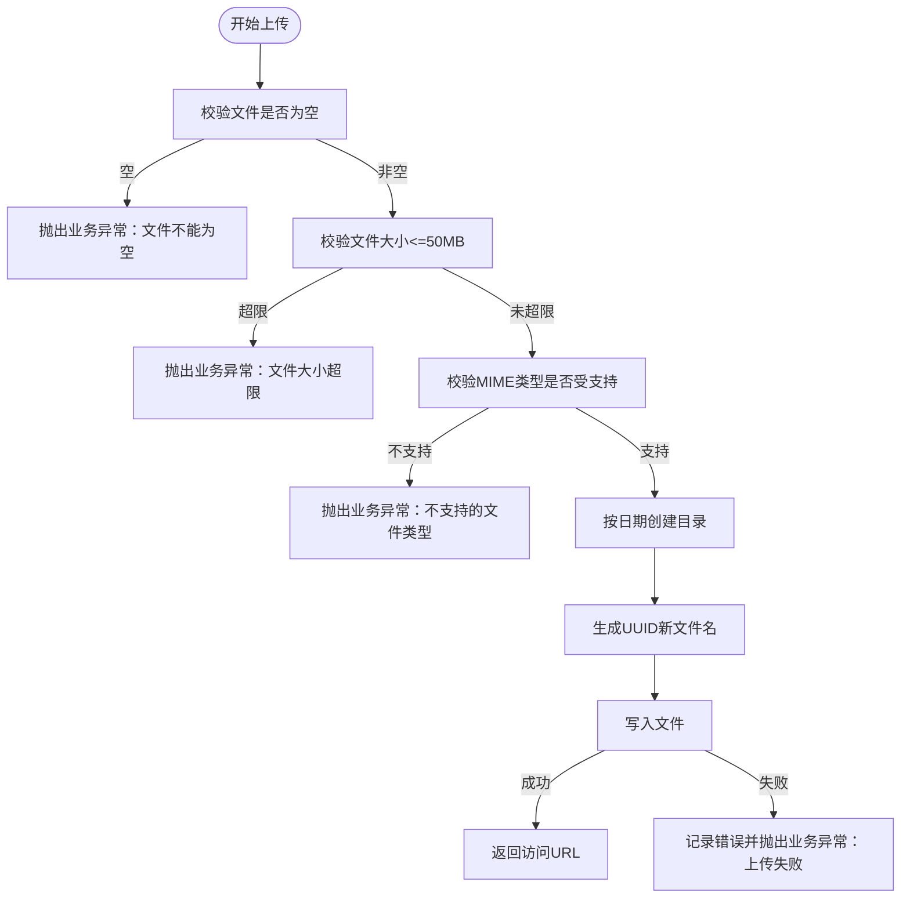
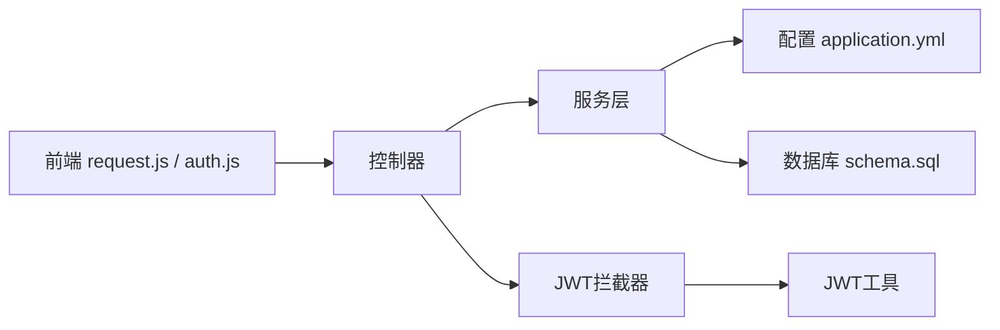

# 故障排除

<cite>
**本文引用的文件**
- [HleneEduApplication.java](file://helenedu-backend/src/main/java/com/helen/eduedu/HleneEduApplication.java)
- [application.yml](file://helenedu-backend/src/main/resources/application.yml)
- [GlobalExceptionHandler.java](file://helenedu-backend/src/main/java/com/helen/eduedu/common/GlobalExceptionHandler.java)
- [BusinessException.java](file://helenedu-backend/src/main/java/com/helen/eduedu/common/BusinessException.java)
- [JwtUtil.java](file://helenedu-backend/src/main/java/com/helen/eduedu/security/JwtUtil.java)
- [JwtInterceptor.java](file://helenedu-backend/src/main/java/com/helen/eduedu/security/JwtInterceptor.java)
- [AuthController.java](file://helenedu-backend/src/main/java/com/helen/eduedu/controller/AuthController.java)
- [FileUploadService.java](file://helenedu-backend/src/main/java/com/helen/eduedu/service/FileUploadService.java)
- [FileController.java](file://helenedu-backend/src/main/java/com/helen/eduedu/controller/FileController.java)
- [schema.sql](file://helenedu-backend/src/main/resources/db/schema.sql)
- [request.js](file://helenedu-frontend/src/utils/request.js)
- [auth.js](file://helenedu-frontend/src/api/auth.js)
- [package.json](file://helenedu-frontend/package.json)
- [README.md](file://README.md)
</cite>

## 目录
1. [简介](#简介)
2. [项目结构](#项目结构)
3. [核心组件](#核心组件)
4. [架构总览](#架构总览)
5. [详细组件分析](#详细组件分析)
6. [依赖分析](#依赖分析)
7. [性能考虑](#性能考虑)
8. [故障排除指南](#故障排除指南)
9. [结论](#结论)
10. [附录](#附录)

## 简介
本指南面向HelenEdu项目的运维与开发人员，提供系统化、可操作的故障排除方法。覆盖启动失败、数据库连接问题、JWT认证错误、文件上传失败等常见问题；提供日志分析、网络检查、权限验证、配置验证等诊断步骤；解释错误码含义与对应解决步骤；给出性能问题排查方法（数据库慢查询、内存泄漏、并发问题）及监控指标异常判断标准；明确紧急情况处理流程与应急预案；区分开发与生产环境排查策略，并提供社区支持与问题反馈渠道。

## 项目结构
后端采用Spring Boot + MyBatis-Plus，前端基于uni-app（支持H5与小程序）。后端负责认证、文件上传、业务接口与数据持久化；前端负责调用后端API并展示结果。关键配置集中在后端配置文件中，包含数据库、文件上传、JWT、微信小程序、Knife4j文档等。

图表来源
- [HleneEduApplication.java:1-15](file://helenedu-backend/src/main/java/com/helen/eduedu/HleneEduApplication.java#L1-L15)
- [application.yml:1-59](file://helenedu-backend/src/main/resources/application.yml#L1-L59)
- [GlobalExceptionHandler.java:1-58](file://helenedu-backend/src/main/java/com/helen/eduedu/common/GlobalExceptionHandler.java#L1-L58)
- [JwtInterceptor.java:1-85](file://helenedu-backend/src/main/java/com/helen/eduedu/security/JwtInterceptor.java#L1-L85)
- [JwtUtil.java:1-87](file://helenedu-backend/src/main/java/com/helen/eduedu/security/JwtUtil.java#L1-L87)
- [AuthController.java:1-39](file://helenedu-backend/src/main/java/com/helen/eduedu/controller/AuthController.java#L1-L39)
- [FileUploadService.java:1-101](file://helenedu-backend/src/main/java/com/helen/eduedu/service/FileUploadService.java#L1-L101)
- [FileController.java:1-36](file://helenedu-backend/src/main/java/com/helen/eduedu/controller/FileController.java#L1-L36)
- [schema.sql:1-94](file://helenedu-backend/src/main/resources/db/schema.sql#L1-L94)
- [request.js:1-83](file://helenedu-frontend/src/utils/request.js#L1-L83)
- [auth.js:1-8](file://helenedu-frontend/src/api/auth.js#L1-L8)
- [package.json:1-28](file://helenedu-frontend/package.json#L1-L28)

章节来源
- [HleneEduApplication.java:1-15](file://helenedu-backend/src/main/java/com/helen/eduedu/HleneEduApplication.java#L1-L15)
- [application.yml:1-59](file://helenedu-backend/src/main/resources/application.yml#L1-L59)
- [README.md:1-3](file://README.md#L1-L3)

## 核心组件
- 启动入口：应用主类负责启动Spring Boot容器。
- 配置中心：application.yml集中管理数据库、文件上传、JWT、微信小程序、Knife4j等配置。
- 全局异常处理：统一捕获业务异常与参数校验异常，返回标准化响应。
- 安全与认证：拦截器负责Token解析与权限校验，工具类负责Token生成与校验。
- 控制器：对外暴露认证与文件上传接口。
- 服务层：实现业务逻辑，如文件上传校验与存储。
- 数据库：初始化脚本定义核心表结构与默认数据。
- 前端请求封装：统一封装HTTP请求与文件上传，自动携带Authorization头。

章节来源
- [HleneEduApplication.java:1-15](file://helenedu-backend/src/main/java/com/helen/eduedu/HleneEduApplication.java#L1-L15)
- [application.yml:1-59](file://helenedu-backend/src/main/resources/application.yml#L1-L59)
- [GlobalExceptionHandler.java:1-58](file://helenedu-backend/src/main/java/com/helen/eduedu/common/GlobalExceptionHandler.java#L1-L58)
- [JwtInterceptor.java:1-85](file://helenedu-backend/src/main/java/com/helen/eduedu/security/JwtInterceptor.java#L1-L85)
- [JwtUtil.java:1-87](file://helenedu-backend/src/main/java/com/helen/eduedu/security/JwtUtil.java#L1-L87)
- [AuthController.java:1-39](file://helenedu-backend/src/main/java/com/helen/eduedu/controller/AuthController.java#L1-L39)
- [FileUploadService.java:1-101](file://helenedu-backend/src/main/java/com/helen/eduedu/service/FileUploadService.java#L1-L101)
- [FileController.java:1-36](file://helenedu-backend/src/main/java/com/helen/eduedu/controller/FileController.java#L1-L36)
- [schema.sql:1-94](file://helenedu-backend/src/main/resources/db/schema.sql#L1-L94)
- [request.js:1-83](file://helenedu-frontend/src/utils/request.js#L1-L83)
- [auth.js:1-8](file://helenedu-frontend/src/api/auth.js#L1-L8)

## 架构总览
后端通过拦截器在进入控制器前完成Token校验与角色权限检查；控制器调用服务层执行具体业务；服务层访问数据库或文件系统；前端通过封装的请求函数调用后端接口并处理返回结果。

图表来源
- [JwtInterceptor.java:27-68](file://helenedu-backend/src/main/java/com/helen/eduedu/security/JwtInterceptor.java#L27-L68)
- [AuthController.java:24-37](file://helenedu-backend/src/main/java/com/helen/eduedu/controller/AuthController.java#L24-L37)
- [FileController.java:24-34](file://helenedu-backend/src/main/java/com/helen/eduedu/controller/FileController.java#L24-L34)
- [FileUploadService.java:46-84](file://helenedu-backend/src/main/java/com/helen/eduedu/service/FileUploadService.java#L46-L84)
- [schema.sql:5-94](file://helenedu-backend/src/main/resources/db/schema.sql#L5-L94)

## 详细组件分析

### 组件A：认证与拦截链路
- 拦截器职责：放行OPTIONS请求；非Controller方法直接放行；从Header或参数提取Token；校验Token有效性；解析用户ID与角色；根据注解进行角色校验；校验失败返回JSON错误。
- Token工具：生成Token时包含用户ID与角色；解析与校验异常均视为无效。
- 控制器：提供微信登录与获取当前用户信息接口；后者从请求属性中读取userId。

图表来源
- [JwtInterceptor.java:27-68](file://helenedu-backend/src/main/java/com/helen/eduedu/security/JwtInterceptor.java#L27-L68)
- [JwtUtil.java:51-85](file://helenedu-backend/src/main/java/com/helen/eduedu/security/JwtUtil.java#L51-L85)
- [AuthController.java:32-37](file://helenedu-backend/src/main/java/com/helen/eduedu/controller/AuthController.java#L32-L37)

章节来源
- [JwtInterceptor.java:1-85](file://helenedu-backend/src/main/java/com/helen/eduedu/security/JwtInterceptor.java#L1-L85)
- [JwtUtil.java:1-87](file://helenedu-backend/src/main/java/com/helen/eduedu/security/JwtUtil.java#L1-L87)
- [AuthController.java:1-39](file://helenedu-backend/src/main/java/com/helen/eduedu/controller/AuthController.java#L1-L39)

### 组件B：文件上传服务
- 支持类型：图片（jpeg/png/gif/webp）与部分办公文档。
- 大小限制：单文件最大50MB。
- 存储策略：按日期分目录，文件名使用UUID去横线。
- 错误处理：空文件、超限、类型不支持、IO异常均抛出业务异常并记录日志。

图表来源
- [FileUploadService.java:46-99](file://helenedu-backend/src/main/java/com/helen/eduedu/service/FileUploadService.java#L46-L99)
- [FileController.java:24-34](file://helenedu-backend/src/main/java/com/helen/eduedu/controller/FileController.java#L24-L34)

章节来源
- [FileUploadService.java:1-101](file://helenedu-backend/src/main/java/com/helen/eduedu/service/FileUploadService.java#L1-L101)
- [FileController.java:1-36](file://helenedu-backend/src/main/java/com/helen/eduedu/controller/FileController.java#L1-L36)

### 组件C：全局异常处理与错误码
- 业务异常：继承自运行时异常，携带code与message；全局处理器将其转换为统一响应并返回。
- 参数校验异常：将首个字段错误拼接为消息返回。
- 通用异常：记录错误日志并返回“系统内部错误”。

章节来源
- [BusinessException.java:1-22](file://helenedu-backend/src/main/java/com/helen/eduedu/common/BusinessException.java#L1-L22)
- [GlobalExceptionHandler.java:1-58](file://helenedu-backend/src/main/java/com/helen/eduedu/common/GlobalExceptionHandler.java#L1-L58)

## 依赖分析
- 后端应用依赖Spring Boot、MyBatis-Plus、MySQL驱动、JWT库、Swagger/Knife4j文档。
- 前端依赖uni-app生态与Vue 3、Pinia等。
- 关键耦合点：拦截器依赖JWT工具；控制器依赖服务层；服务层依赖配置（文件上传目录、基础URL）；前端依赖后端接口路径与响应格式。

图表来源
- [request.js:1-83](file://helenedu-frontend/src/utils/request.js#L1-L83)
- [auth.js:1-8](file://helenedu-frontend/src/api/auth.js#L1-L8)
- [AuthController.java:1-39](file://helenedu-backend/src/main/java/com/helen/eduedu/controller/AuthController.java#L1-L39)
- [FileController.java:1-36](file://helenedu-backend/src/main/java/com/helen/eduedu/controller/FileController.java#L1-L36)
- [JwtInterceptor.java:1-85](file://helenedu-backend/src/main/java/com/helen/eduedu/security/JwtInterceptor.java#L1-L85)
- [JwtUtil.java:1-87](file://helenedu-backend/src/main/java/com/helen/eduedu/security/JwtUtil.java#L1-L87)
- [application.yml:1-59](file://helenedu-backend/src/main/resources/application.yml#L1-L59)
- [schema.sql:1-94](file://helenedu-backend/src/main/resources/db/schema.sql#L1-L94)

章节来源
- [package.json:1-28](file://helenedu-frontend/package.json#L1-L28)

## 性能考虑
- 数据库慢查询
  - 使用MyBatis-Plus日志输出定位SQL；结合数据库慢查询日志与索引分析。
  - 建议：为常用查询字段建立合适索引；避免N+1查询；对大结果集分页。
- 内存泄漏
  - 检查长生命周期对象持有短生命周期对象引用；确认文件流正确关闭；避免静态集合无限增长。
- 并发问题
  - 接口幂等设计；分布式锁或数据库唯一约束防止重复提交；合理设置线程池与连接池。
- 监控指标
  - QPS/响应时间/错误率：用于识别异常波动。
  - 数据库连接数/等待时间：用于发现连接池瓶颈。
  - GC频率与停顿：用于发现内存问题。
  - 磁盘空间与IO：用于发现文件上传/日志写满风险。

[本节为通用指导，无需特定文件来源]

## 故障排除指南

### 启动失败
- 症状：应用无法启动或启动后立即退出。
- 诊断步骤
  - 检查JDK版本与Spring Boot兼容性。
  - 查看控制台日志，定位启动异常堆栈。
  - 校验application.yml语法与关键配置项（server.port、datasource.url、jwt.secret、file.upload-dir）。
  - 确认数据库服务可用且账号密码正确。
- 解决方案
  - 修复YAML缩进与特殊字符；确保数据库端口可达；调整端口避免冲突；补齐缺失配置项。

章节来源
- [HleneEduApplication.java:1-15](file://helenedu-backend/src/main/java/com/helen/eduedu/HleneEduApplication.java#L1-L15)
- [application.yml:1-59](file://helenedu-backend/src/main/resources/application.yml#L1-L59)

### 数据库连接问题
- 症状：启动时报错提示无法连接数据库或SQL异常。
- 诊断步骤
  - 使用配置中的URL、用户名、密码尝试本地连接验证。
  - 检查MySQL服务状态与防火墙策略。
  - 校验数据库字符集与时区设置是否与配置一致。
  - 确认schema.sql已执行，表结构存在。
- 解决方案
  - 修正连接参数；开放端口；导入初始化脚本；确保时区与字符集匹配。

章节来源
- [application.yml:6-11](file://helenedu-backend/src/main/resources/application.yml#L6-L11)
- [schema.sql:1-94](file://helenedu-backend/src/main/resources/db/schema.sql#L1-L94)

### JWT认证错误
- 症状：401未登录/Token已过期；403无权限访问。
- 诊断步骤
  - 检查前端是否正确携带Authorization头（Bearer Token）。
  - 校验后端jwt.secret与jwt.expiration配置是否一致。
  - 在拦截器中确认Token提取逻辑（Header与小程序参数兼容）。
  - 使用JWT工具验证Token是否过期或签名异常。
- 解决方案
  - 前端重新登录获取新Token；核对后端JWT配置；确保前后端密钥一致；检查客户端时间与时区。

章节来源
- [JwtInterceptor.java:27-68](file://helenedu-backend/src/main/java/com/helen/eduedu/security/JwtInterceptor.java#L27-L68)
- [JwtUtil.java:51-85](file://helenedu-backend/src/main/java/com/helen/eduedu/security/JwtUtil.java#L51-L85)
- [application.yml:33-36](file://helenedu-backend/src/main/resources/application.yml#L33-L36)
- [request.js:9-19](file://helenedu-frontend/src/utils/request.js#L9-L19)

### 文件上传失败
- 症状：返回“文件上传失败”或“文件大小超限/类型不支持”。
- 诊断步骤
  - 检查前端上传参数是否包含file字段，且文件未被裁剪为空。
  - 核对后端允许的MIME类型与大小限制。
  - 确认file.upload-dir目录存在且具备写权限；baseUrl与实际访问路径一致。
  - 查看服务层异常日志定位IO异常原因。
- 解决方案
  - 选择受支持的文件类型与合理大小；确保上传目录存在且可写；修正访问URL；优化磁盘空间与IO性能。

章节来源
- [FileUploadService.java:32-41](file://helenedu-backend/src/main/java/com/helen/eduedu/service/FileUploadService.java#L32-L41)
- [FileUploadService.java:86-99](file://helenedu-backend/src/main/java/com/helen/eduedu/service/FileUploadService.java#L86-L99)
- [application.yml:43-46](file://helenedu-backend/src/main/resources/application.yml#L43-L46)
- [FileController.java:24-34](file://helenedu-backend/src/main/java/com/helen/eduedu/controller/FileController.java#L24-L34)
- [request.js:55-80](file://helenedu-frontend/src/utils/request.js#L55-L80)

### 参数校验与业务异常
- 症状：返回400参数错误或业务异常（如“参数校验失败”、“系统内部错误”）。
- 诊断步骤
  - 查看全局异常处理器对不同异常类型的映射。
  - 检查前端请求体与后端DTO字段是否匹配。
  - 核对后端业务逻辑中的前置校验条件。
- 解决方案
  - 修正请求参数；完善前端校验提示；补充后端校验规则；记录并修复系统异常。

章节来源
- [GlobalExceptionHandler.java:25-49](file://helenedu-backend/src/main/java/com/helen/eduedu/common/GlobalExceptionHandler.java#L25-L49)
- [BusinessException.java:1-22](file://helenedu-backend/src/main/java/com/helen/eduedu/common/BusinessException.java#L1-L22)

### 日志分析
- 后端日志
  - 全局异常处理器会记录系统异常堆栈；业务异常会记录警告信息。
  - MyBatis-Plus配置启用了SQL日志输出，便于定位慢查询与异常SQL。
- 前端日志
  - 请求封装会在401时清理本地Token并跳转登录；对非200与非200 code进行Toast提示。
- 建议
  - 开启后端日志级别DEBUG以辅助排查；结合业务日志定位问题根因。

章节来源
- [GlobalExceptionHandler.java:21-55](file://helenedu-backend/src/main/java/com/helen/eduedu/common/GlobalExceptionHandler.java#L21-L55)
- [application.yml:23-25](file://helenedu-backend/src/main/resources/application.yml#L23-L25)
- [request.js:20-42](file://helenedu-frontend/src/utils/request.js#L20-L42)

### 网络检查
- 端口连通性：确认后端8080端口可访问。
- 跨域：后端已配置跨域，若出现跨域问题需检查浏览器控制台与CORS配置。
- 前后端地址一致性：前端BASE_URL与后端server.port/base-url保持一致。

章节来源
- [application.yml:1-5](file://helenedu-backend/src/main/resources/application.yml#L1-L5)
- [request.js](file://helenedu-frontend/src/utils/request.js#L2)

### 权限验证
- 角色注解：控制器方法上使用角色注解时，拦截器会校验当前用户角色是否满足。
- 建议：为敏感接口添加角色注解；确保用户角色与业务场景一致。

章节来源
- [JwtInterceptor.java:52-65](file://helenedu-backend/src/main/java/com/helen/eduedu/security/JwtInterceptor.java#L52-L65)

### 配置验证
- 数据库：检查URL、用户名、密码、时区、字符集。
- 文件上传：检查上传目录与访问URL。
- JWT：检查密钥与过期时间。
- 文档：确认Knife4j/Swagger UI路径可用。

章节来源
- [application.yml:6-59](file://helenedu-backend/src/main/resources/application.yml#L6-L59)

### 性能问题排查
- 数据库慢查询
  - 启用并分析慢查询日志；为热点查询加索引；拆分复杂SQL。
- 内存泄漏
  - 分析GC日志；检查文件流与缓存；避免静态集合泄漏。
- 并发问题
  - 接口幂等；数据库唯一约束；分布式锁；线程池与连接池调优。
- 监控指标
  - QPS/响应时间/错误率；数据库连接数/等待；GC；磁盘空间。

[本节为通用指导，无需特定文件来源]

### 紧急情况处理流程与应急预案
- 紧急流程
  - 快速隔离：停止对外发布，回滚最近变更。
  - 降级策略：关闭非关键功能，保留核心认证与文件上传。
  - 通知机制：通过即时通讯工具通知团队与用户。
  - 复盘总结：记录根因与改进措施。
- 应急预案
  - 数据库不可用：切换备用实例或只读副本；恢复数据备份。
  - 文件上传失败：扩容磁盘与IO；临时迁移至对象存储。
  - 认证风暴：临时放宽令牌校验或增加缓存。

[本节为通用指导，无需特定文件来源]

### 开发环境与生产环境不同排查策略
- 开发环境
  - 使用本地MySQL与本地文件上传目录；开启详细日志与SQL日志。
  - 通过Swagger/Knife4j快速验证接口。
- 生产环境
  - 使用远程数据库与对象存储；严格控制日志级别；关注慢查询与资源占用。
  - 通过监控平台观察QPS、错误率、数据库连接数等指标。

章节来源
- [application.yml:23-25](file://helenedu-backend/src/main/resources/application.yml#L23-L25)
- [application.yml:49-59](file://helenedu-backend/src/main/resources/application.yml#L49-L59)

### 社区支持与问题反馈渠道
- 仓库与文档：参考项目根目录README与配置文件。
- 前端构建：通过package.json中的脚本进行开发与构建。
- 反馈渠道：建议在仓库Issue区提交问题，附带环境信息、日志片段与复现步骤。

章节来源
- [README.md:1-3](file://README.md#L1-L3)
- [package.json:6-10](file://helenedu-frontend/package.json#L6-L10)

## 结论
本指南提供了HelenEdu项目从启动、认证、文件上传到数据库与性能问题的系统化故障排除方法。建议在日常运维中结合日志与监控指标，建立标准化的应急响应流程，并针对开发与生产环境采取差异化策略，以保障系统稳定运行。

## 附录

### 错误码与含义对照
- 400：参数校验失败/参数绑定失败/约束校验失败
- 401：未登录或Token已过期
- 403：无权限访问
- 500：业务异常（默认）
- 500：系统内部错误（通用异常）

章节来源
- [GlobalExceptionHandler.java:25-56](file://helenedu-backend/src/main/java/com/helen/eduedu/common/GlobalExceptionHandler.java#L25-L56)
- [BusinessException.java:10-20](file://helenedu-backend/src/main/java/com/helen/eduedu/common/BusinessException.java#L10-L20)
- [JwtInterceptor.java:79-83](file://helenedu-backend/src/main/java/com/helen/eduedu/security/JwtInterceptor.java#L79-L83)