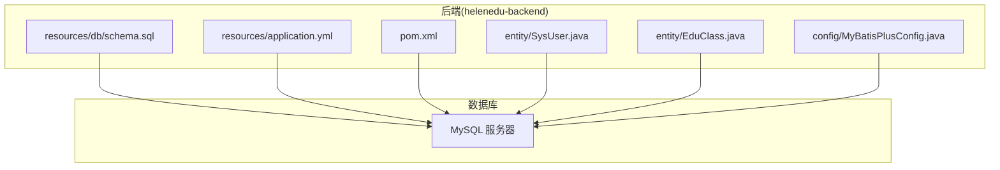
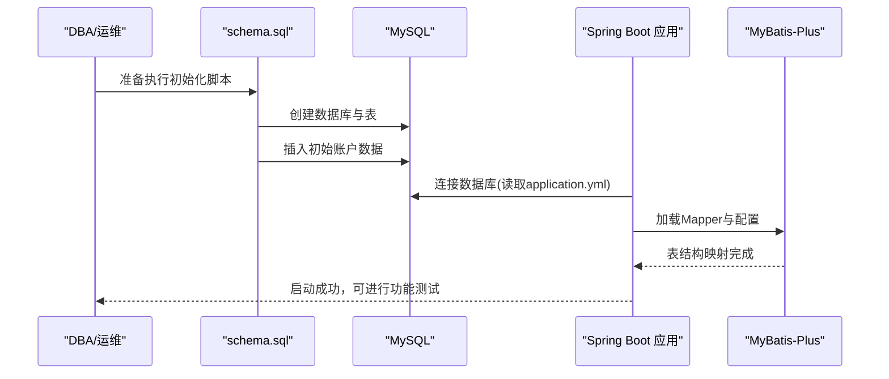
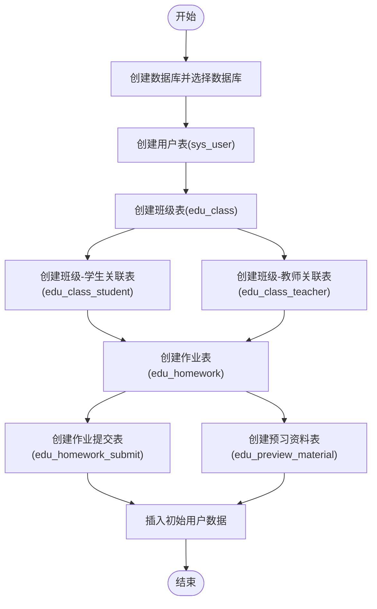
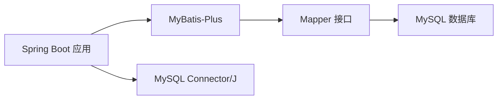

# 初始化脚本

<cite>
**本文引用的文件**
- [schema.sql](file://helenedu-backend/src/main/resources/db/schema.sql)
- [application.yml](file://helenedu-backend/src/main/resources/application.yml)
- [pom.xml](file://helenedu-backend/pom.xml)
- [SysUser.java](file://helenedu-backend/src/main/java/com/helen/eduedu/entity/SysUser.java)
- [EduClass.java](file://helenedu-backend/src/main/java/com/helen/eduedu/entity/EduClass.java)
- [MyBatisPlusConfig.java](file://helenedu-backend/src/main/java/com/helen/eduedu/config/MyBatisPlusConfig.java)
- [README.md](file://README.md)
</cite>

## 目录
1. [简介](#简介)
2. [项目结构](#项目结构)
3. [核心组件](#核心组件)
4. [架构总览](#架构总览)
5. [详细组件分析](#详细组件分析)
6. [依赖分析](#依赖分析)
7. [性能考虑](#性能考虑)
8. [故障排除指南](#故障排除指南)
9. [结论](#结论)
10. [附录](#附录)

## 简介
本文件面向HelenEdu项目的数据库初始化与部署，围绕后端资源目录中的初始化脚本进行系统化说明。目标是帮助运维与开发人员理解：
- schema.sql 的执行顺序与依赖关系（表创建顺序、外键/唯一索引依赖处理）
- 数据库初始化的完整流程（从数据库创建到数据导入）
- 执行环境要求与前置条件（MySQL版本、字符集、时区等）
- 初始数据设计思路（系统管理员、教师、学生的账户设计）
- 错误处理与故障排除方法
- 生产环境部署的最佳实践与安全注意事项

## 项目结构
HelenEdu后端采用Spring Boot 3.2.5 + MyBatis-Plus，数据库初始化脚本位于后端资源目录中，应用配置文件定义了数据库连接参数与MyBatis-Plus相关设置。前端为Vue生态，不直接影响数据库初始化流程。

图表来源
- [schema.sql:1-94](file://helenedu-backend/src/main/resources/db/schema.sql#L1-L94)
- [application.yml:6-11](file://helenedu-backend/src/main/resources/application.yml#L6-L11)
- [pom.xml:40-52](file://helenedu-backend/pom.xml#L40-L52)
- [SysUser.java:14-41](file://helenedu-backend/src/main/java/com/helen/eduedu/entity/SysUser.java#L14-L41)
- [EduClass.java:14-35](file://helenedu-backend/src/main/java/com/helen/eduedu/entity/EduClass.java#L14-L35)
- [MyBatisPlusConfig.java:12-21](file://helenedu-backend/src/main/java/com/helen/eduedu/config/MyBatisPlusConfig.java#L12-L21)

章节来源
- [README.md:1-3](file://README.md#L1-L3)
- [schema.sql:1-94](file://helenedu-backend/src/main/resources/db/schema.sql#L1-L94)
- [application.yml:6-11](file://helenedu-backend/src/main/resources/application.yml#L6-L11)
- [pom.xml:40-52](file://helenedu-backend/pom.xml#L40-L52)

## 核心组件
- 初始化脚本：负责创建数据库与所有业务表，并插入初始系统管理员、教师、学生账户。
- 应用配置：定义数据库连接URL、用户名、密码、驱动、时区与MyBatis-Plus分页插件。
- 实体映射：Java实体类与数据库表名及字段映射，确保ORM层正确识别表结构。
- 依赖声明：MySQL Connector/J与MyBatis-Plus Starter用于数据库访问与分页能力。

章节来源
- [schema.sql:1-94](file://helenedu-backend/src/main/resources/db/schema.sql#L1-L94)
- [application.yml:6-11](file://helenedu-backend/src/main/resources/application.yml#L6-L11)
- [SysUser.java:14-41](file://helenedu-backend/src/main/java/com/helen/eduedu/entity/SysUser.java#L14-L41)
- [EduClass.java:14-35](file://helenedu-backend/src/main/java/com/helen/eduedu/entity/EduClass.java#L14-L35)
- [MyBatisPlusConfig.java:12-21](file://helenedu-backend/src/main/java/com/helen/eduedu/config/MyBatisPlusConfig.java#L12-L21)
- [pom.xml:40-52](file://helenedu-backend/pom.xml#L40-L52)

## 架构总览
数据库初始化流程由“脚本执行”和“应用启动”两部分组成：
- 脚本执行阶段：创建数据库与表，插入初始数据。
- 应用启动阶段：Spring Boot加载配置，连接数据库，MyBatis-Plus扫描Mapper并执行业务查询。

图表来源
- [schema.sql:1-94](file://helenedu-backend/src/main/resources/db/schema.sql#L1-L94)
- [application.yml:6-11](file://helenedu-backend/src/main/resources/application.yml#L6-L11)
- [MyBatisPlusConfig.java:12-21](file://helenedu-backend/src/main/java/com/helen/eduedu/config/MyBatisPlusConfig.java#L12-L21)

## 详细组件分析

### 初始化脚本执行顺序与依赖关系
- 执行顺序
  1) 创建数据库并选择数据库上下文
  2) 依次创建用户表、班级表、班级-学生关联表、班级-教师关联表、作业表、作业提交表、预习资料表
  3) 插入初始管理员、教师、学生账户
- 依赖关系
  - 班级-学生关联表与班级-教师关联表依赖于“班级表”的主键存在
  - 作业表依赖“班级表”和“教师表”（通过外键字段指向）
  - 作业提交表依赖“作业表”和“学生表”
  - 预习资料表依赖“班级表”和“教师表”
  - 唯一索引uk_class_student、uk_class_teacher、uk_hw_student用于保证关联关系的唯一性
- 约束与索引
  - 用户表对openid建立唯一索引
  - 关联表均建立复合唯一索引以避免重复记录
  - 时间戳字段默认值与更新行为统一，便于审计与排序

图表来源
- [schema.sql:1-94](file://helenedu-backend/src/main/resources/db/schema.sql#L1-L94)

章节来源
- [schema.sql:1-94](file://helenedu-backend/src/main/resources/db/schema.sql#L1-L94)

### 初始化数据设计思路
- 初始账户类型
  - 系统管理员：具备最高权限，用于平台级配置与维护
  - 教师：用于布置作业、批改作业、发布预习资料
  - 学生：用于查看作业、提交作业、下载预习资料
- 账户字段要点
  - 用户表包含角色字段，支持区分不同用户类型
  - 状态字段用于启用/禁用控制
  - 时间戳字段便于审计与排序
- 设计建议
  - 建议在生产环境中为初始管理员设置强口令或通过管理界面重置
  - 初始数据仅作为演示用途，实际部署应替换为真实用户信息

章节来源
- [schema.sql:90-94](file://helenedu-backend/src/main/resources/db/schema.sql#L90-L94)
- [SysUser.java:29-36](file://helenedu-backend/src/main/java/com/helen/eduedu/entity/SysUser.java#L29-L36)

### 应用配置与数据库连接
- 数据源配置
  - JDBC URL包含时区与时序参数，确保日期时间一致性
  - 使用MySQL Connector/J驱动
  - 默认用户名与密码需在部署前修改
- MyBatis-Plus配置
  - 分页插件启用MySQL方言
  - 下划线转驼峰映射开启
  - 日志输出开启，便于调试

章节来源
- [application.yml:6-11](file://helenedu-backend/src/main/resources/application.yml#L6-L11)
- [application.yml:21-31](file://helenedu-backend/src/main/resources/application.yml#L21-L31)
- [MyBatisPlusConfig.java:12-21](file://helenedu-backend/src/main/java/com/helen/eduedu/config/MyBatisPlusConfig.java#L12-L21)

### 实体类与表结构映射
- 实体类注解
  - @TableName指定表名，确保ORM层正确识别
  - @TableId(type = IdType.AUTO)与自增主键对应
- 字段命名
  - Java字段遵循驼峰命名，与数据库字段映射由MyBatis-Plus自动处理
- 适用范围
  - 用户实体与班级实体用于用户管理与班级管理模块

章节来源
- [SysUser.java:14-41](file://helenedu-backend/src/main/java/com/helen/eduedu/entity/SysUser.java#L14-L41)
- [EduClass.java:14-35](file://helenedu-backend/src/main/java/com/helen/eduedu/entity/EduClass.java#L14-L35)

## 依赖分析
- 数据库驱动与ORM
  - MySQL Connector/J用于JDBC连接
  - MyBatis-Plus提供分页、逻辑删除等增强能力
- 版本与兼容性
  - Spring Boot 3.2.5 + Java 17
  - MyBatis-Plus Starter与MySQL Connector/J版本需匹配

图表来源
- [pom.xml:40-52](file://helenedu-backend/pom.xml#L40-L52)
- [MyBatisPlusConfig.java:12-21](file://helenedu-backend/src/main/java/com/helen/eduedu/config/MyBatisPlusConfig.java#L12-L21)

章节来源
- [pom.xml:40-52](file://helenedu-backend/pom.xml#L40-L52)

## 性能考虑
- 字符集与排序规则
  - 使用utf8mb4与unicode_ci，支持完整表情符号与多语言排序
- 索引策略
  - 唯一索引uk_class_student、uk_class_teacher、uk_hw_student避免重复关联
  - 建议在高频查询列上增加合适索引（如班级ID、教师ID、学生ID）
- 时间字段
  - 统一使用DATETIME并设置默认值与更新行为，减少应用层处理开销
- 分页与日志
  - 开启分页插件与日志输出，便于开发调试；生产环境可根据需要调整日志级别

[本节为通用指导，无需列出具体文件来源]

## 故障排除指南
- 常见问题与解决
  - 数据库连接失败
    - 检查JDBC URL、用户名、密码是否正确
    - 确认MySQL服务运行且网络可达
  - 字符集不一致导致乱码
    - 确保数据库、表、字段字符集均为utf8mb4
    - 客户端连接参数需与服务端一致
  - 时区差异导致时间显示异常
    - 在JDBC URL中设置serverTimezone参数
    - 保持客户端与服务端时区一致
  - 权限不足
    - 确保数据库用户具有创建数据库、表与插入数据的权限
  - 唯一索引冲突
    - 若重复执行初始化脚本，需先清理或回滚
  - MyBatis-Plus分页失效
    - 确认分页插件已注册且Mapper扫描路径正确
- 建议排查步骤
  - 先单独执行schema.sql验证建表与初始数据插入
  - 再启动Spring Boot应用，观察日志输出
  - 使用数据库客户端工具验证表结构与数据

章节来源
- [application.yml:6-11](file://helenedu-backend/src/main/resources/application.yml#L6-L11)
- [schema.sql:1-94](file://helenedu-backend/src/main/resources/db/schema.sql#L1-L94)
- [MyBatisPlusConfig.java:12-21](file://helenedu-backend/src/main/java/com/helen/eduedu/config/MyBatisPlusConfig.java#L12-L21)

## 结论
HelenEdu的数据库初始化脚本设计清晰，执行顺序合理，满足业务表与初始数据的完整落地。结合Spring Boot与MyBatis-Plus的配置，能够快速完成本地与生产环境的数据库初始化与应用启动。建议在生产部署前完善安全配置、权限控制与监控告警，确保系统稳定运行。

[本节为总结性内容，无需列出具体文件来源]

## 附录

### 环境要求与前置条件
- MySQL版本
  - 建议使用MySQL 8.0及以上版本，以获得更好的字符集与JSON字段支持
- 字符集与排序规则
  - 数据库与表字符集：utf8mb4
  - 排序规则：utf8mb4_unicode_ci
- 时区与时序
  - JDBC URL中设置serverTimezone，确保与应用时区一致
- Java与框架
  - Java 17+，Spring Boot 3.2.5，MyBatis-Plus 3.5.5
- 数据库驱动
  - MySQL Connector/J（与pom中声明版本匹配）

章节来源
- [schema.sql:2-2](file://helenedu-backend/src/main/resources/db/schema.sql#L2-L2)
- [application.yml:8-8](file://helenedu-backend/src/main/resources/application.yml#L8-L8)
- [pom.xml:48-52](file://helenedu-backend/pom.xml#L48-L52)

### 执行流程与最佳实践
- 执行流程
  1) 准备MySQL环境，确保字符集与时区配置正确
  2) 使用管理员账号登录MySQL，执行schema.sql
  3) 修改application.yml中的数据库连接参数
  4) 启动Spring Boot应用，验证初始化结果
- 最佳实践
  - 生产环境使用专用数据库账号与最小权限原则
  - 对初始管理员密码进行强制修改与定期轮换
  - 在CI/CD中加入数据库迁移脚本的自动化校验
  - 对敏感配置（如JWT密钥）进行加密存储与环境隔离
  - 建立数据库备份与恢复预案

章节来源
- [schema.sql:1-94](file://helenedu-backend/src/main/resources/db/schema.sql#L1-L94)
- [application.yml:6-11](file://helenedu-backend/src/main/resources/application.yml#L6-L11)