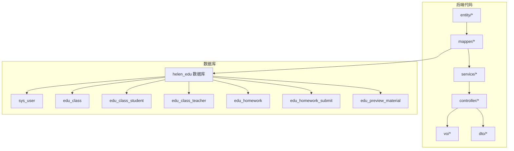
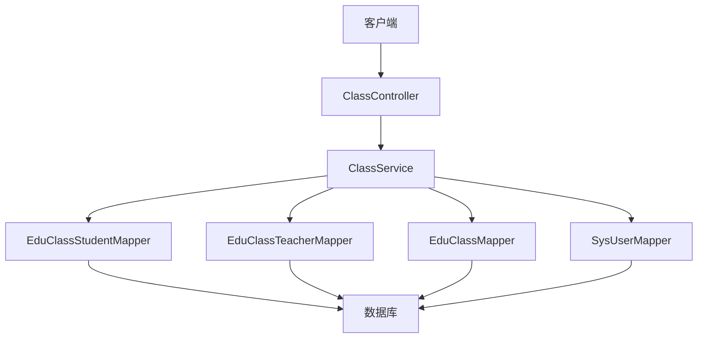
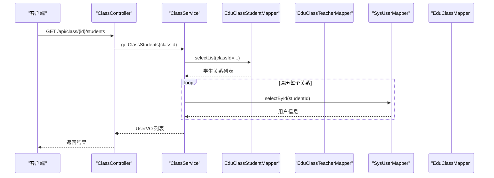
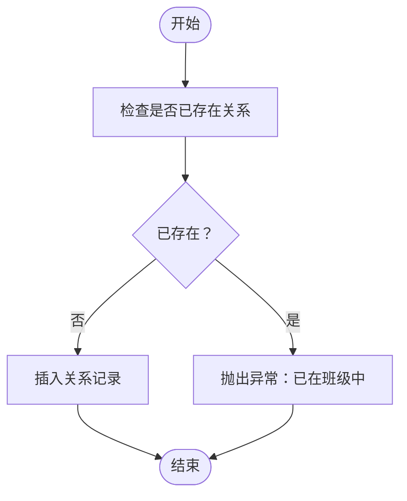
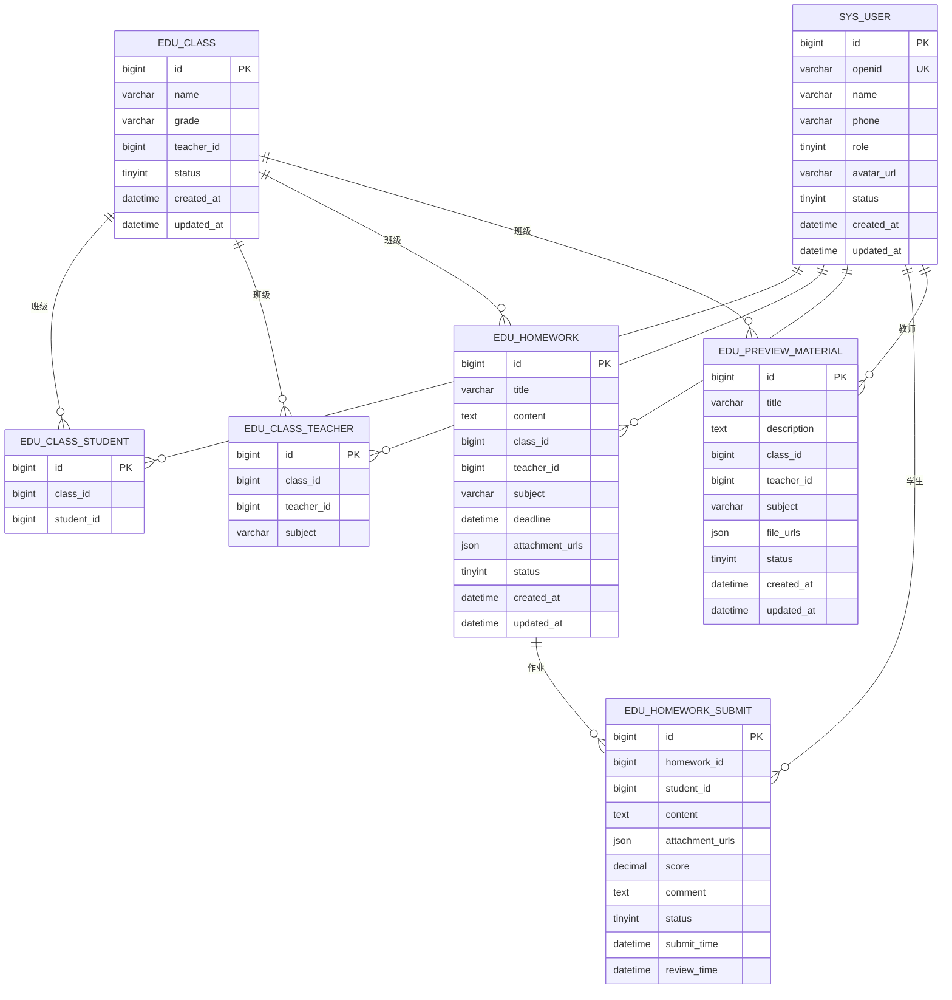
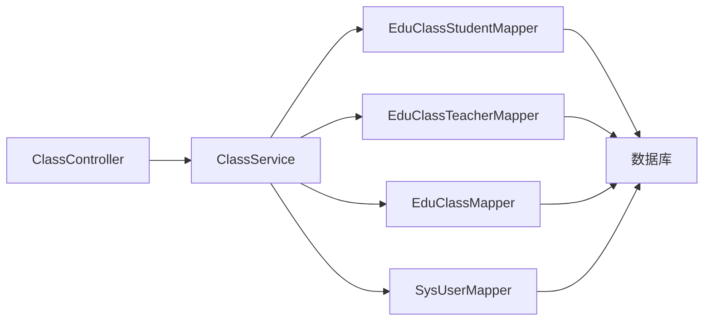

# 实体关系设计

<cite>
**本文引用的文件**
- [EduClass.java](file://helenedu-backend/src/main/java/com/helen/eduedu/entity/EduClass.java)
- [SysUser.java](file://helenedu-backend/src/main/java/com/helen/eduedu/entity/SysUser.java)
- [EduClassStudent.java](file://helenedu-backend/src/main/java/com/helen/eduedu/entity/EduClassStudent.java)
- [EduClassTeacher.java](file://helenedu-backend/src/main/java/com/helen/eduedu/entity/EduClassTeacher.java)
- [EduHomework.java](file://helenedu-backend/src/main/java/com/helen/eduedu/entity/EduHomework.java)
- [EduPreviewMaterial.java](file://helenedu-backend/src/main/java/com/helen/eduedu/entity/EduPreviewMaterial.java)
- [schema.sql](file://helenedu-backend/src/main/resources/db/schema.sql)
- [ClassController.java](file://helenedu-backend/src/main/java/com/helen/eduedu/controller/ClassController.java)
- [ClassService.java](file://helenedu-backend/src/main/java/com/helen/eduedu/service/ClassService.java)
- [EduClassStudentMapper.java](file://helenedu-backend/src/main/java/com/helen/eduedu/mapper/EduClassStudentMapper.java)
- [EduClassTeacherMapper.java](file://helenedu-backend/src/main/java/com/helen/eduedu/mapper/EduClassTeacherMapper.java)
- [ClassVO.java](file://helenedu-backend/src/main/java/com/helen/eduedu/vo/ClassVO.java)
- [ClassMemberRequest.java](file://helenedu-backend/src/main/java/com/helen/eduedu/dto/ClassMemberRequest.java)
</cite>

## 目录
1. [引言](#引言)
2. [项目结构](#项目结构)
3. [核心组件](#核心组件)
4. [架构总览](#架构总览)
5. [详细组件分析](#详细组件分析)
6. [依赖分析](#依赖分析)
7. [性能考虑](#性能考虑)
8. [故障排查指南](#故障排查指南)
9. [结论](#结论)
10. [附录](#附录)

## 引言
本设计文档围绕 HelenEdu 的实体关系模型展开，重点阐述用户、班级、作业、预习资料之间的关联关系，明确一对一、一对多、多对多关系的实现方式；深入解析 edu_class_student 班级学生关联表与 edu_class_teacher 班级教师关联表的设计目的与使用场景；说明外键约束与级联策略（当前数据库脚本未显式声明外键约束，但通过业务层保证一致性）；解释反向关联在业务层的实现路径，以支持便捷的数据查询；最后提供 ER 图与实体关系图，帮助理解复杂多对多关系及关系表的业务逻辑与数据一致性保障机制。

## 项目结构
后端采用 Spring Boot + MyBatis-Plus 架构，实体类位于 entity 包，映射器位于 mapper 包，服务层位于 service 包，控制器位于 controller 包，视图对象 VO 位于 vo 包，DTO 位于 dto 包。数据库结构定义于 schema.sql 中，包含用户、班级、班级成员（学生/教师）、作业、作业提交、预习资料等表。

图表来源
- [ClassController.java:1-129](file://helenedu-backend/src/main/java/com/helen/eduedu/controller/ClassController.java#L1-L129)
- [ClassService.java:1-262](file://helenedu-backend/src/main/java/com/helen/eduedu/service/ClassService.java#L1-L262)
- [schema.sql:1-94](file://helenedu-backend/src/main/resources/db/schema.sql#L1-L94)

章节来源
- [ClassController.java:1-129](file://helenedu-backend/src/main/java/com/helen/eduedu/controller/ClassController.java#L1-L129)
- [ClassService.java:1-262](file://helenedu-backend/src/main/java/com/helen/eduedu/service/ClassService.java#L1-L262)
- [schema.sql:1-94](file://helenedu-backend/src/main/resources/db/schema.sql#L1-L94)

## 核心组件
- 用户实体：sys_user，承载用户基本信息与角色标识，用于区分学生、教师、管理员。
- 班级实体：edu_class，记录班级名称、年级、班主任、状态等字段。
- 关系实体：
  - edu_class_student：班级-学生多对多关系表，唯一约束确保同一班级不可重复添加同一名学生。
  - edu_class_teacher：班级-教师多对多关系表，唯一约束确保同一班级不可重复添加同一教师。
- 作业实体：edu_homework，记录作业标题、内容、所属班级、布置教师、科目、截止时间、附件、状态等。
- 作业提交实体：edu_homework_submit，记录学生提交内容、附件、分数、评语、状态、提交/批改时间等。
- 预习资料实体：edu_preview_material，记录资料标题、描述、所属班级、发布教师、科目、文件列表、状态等。

章节来源
- [SysUser.java:1-42](file://helenedu-backend/src/main/java/com/helen/eduedu/entity/SysUser.java#L1-L42)
- [EduClass.java:1-36](file://helenedu-backend/src/main/java/com/helen/eduedu/entity/EduClass.java#L1-L36)
- [EduClassStudent.java:1-24](file://helenedu-backend/src/main/java/com/helen/eduedu/entity/EduClassStudent.java#L1-L24)
- [EduClassTeacher.java:1-27](file://helenedu-backend/src/main/java/com/helen/eduedu/entity/EduClassTeacher.java#L1-L27)
- [EduHomework.java:1-52](file://helenedu-backend/src/main/java/com/helen/eduedu/entity/EduHomework.java#L1-L52)
- [EduPreviewMaterial.java:1-49](file://helenedu-backend/src/main/java/com/helen/eduedu/entity/EduPreviewMaterial.java#L1-L49)

## 架构总览
系统采用分层架构：控制器负责接收请求与返回响应，服务层封装业务逻辑与事务控制，映射器负责与数据库交互，实体类映射表结构，VO/DTO 用于接口数据传输。多对多关系通过独立的关系表进行解耦，并在业务层提供便捷查询。

图表来源
- [ClassController.java:1-129](file://helenedu-backend/src/main/java/com/helen/eduedu/controller/ClassController.java#L1-L129)
- [ClassService.java:1-262](file://helenedu-backend/src/main/java/com/helen/eduedu/service/ClassService.java#L1-L262)
- [EduClassStudentMapper.java:1-10](file://helenedu-backend/src/main/java/com/helen/eduedu/mapper/EduClassStudentMapper.java#L1-L10)
- [EduClassTeacherMapper.java:1-10](file://helenedu-backend/src/main/java/com/helen/eduedu/mapper/EduClassTeacherMapper.java#L1-L10)

## 详细组件分析

### 实体关系与外键约束策略
- 用户与班级：一对一（班主任）与一对多（一个教师可任多个班级的班主任，但此处仅在班级表维护 teacher_id 字段，不强制外键约束）。实际业务上，若需严格约束，可在数据库层面增加外键约束。
- 班级与学生：多对多，通过 edu_class_student 关系表实现，唯一约束 uk_class_student(class_id, student_id) 防止重复添加。
- 班级与教师：多对多，通过 edu_class_teacher 关系表实现，唯一约束 uk_class_teacher(class_id, teacher_id) 防止重复添加。
- 作业与班级/教师：一对多（一个班级可有多个作业，一个教师可布置多个作业），作业表包含 class_id 与 teacher_id 字段。
- 作业与提交：一对多（一次作业可被多名学生提交），提交表包含 homework_id 与 student_id 字段，唯一约束 uk_hw_student(homework_id, student_id) 防止重复提交。
- 预习资料与班级/教师：一对多（一个班级可有多份资料，一个教师可发布多份资料），资料表包含 class_id 与 teacher_id 字段。

当前数据库脚本未显式声明外键约束，但通过业务层校验与唯一约束保障数据一致性。建议在生产环境补充外键约束与级联策略，以增强数据完整性。

章节来源
- [schema.sql:1-94](file://helenedu-backend/src/main/resources/db/schema.sql#L1-L94)
- [EduClass.java:1-36](file://helenedu-backend/src/main/java/com/helen/eduedu/entity/EduClass.java#L1-L36)
- [EduClassStudent.java:1-24](file://helenedu-backend/src/main/java/com/helen/eduedu/entity/EduClassStudent.java#L1-L24)
- [EduClassTeacher.java:1-27](file://helenedu-backend/src/main/java/com/helen/eduedu/entity/EduClassTeacher.java#L1-L27)
- [EduHomework.java:1-52](file://helenedu-backend/src/main/java/com/helen/eduedu/entity/EduHomework.java#L1-L52)
- [EduPreviewMaterial.java:1-49](file://helenedu-backend/src/main/java/com/helen/eduedu/entity/EduPreviewMaterial.java#L1-L49)

### 关系表设计目的与使用场景
- edu_class_student 设计目的：
  - 解耦“班级-学生”多对多关系，支持一个学生加入多个班级，一个班级容纳多个学生。
  - 唯一约束防止重复添加，便于去重与统计。
  - 业务层提供添加/移除学生、查询某班学生列表、查询某生所在班级列表等能力。
- edu_class_teacher 设计目的：
  - 解耦“班级-教师”多对多关系，支持一个教师可教授多个班级，一个班级可有多个任课教师。
  - 唯一约束防止重复添加，便于去重与统计。
  - 业务层提供添加/移除教师、查询某班教师列表、查询某师任教班级列表等能力。

章节来源
- [EduClassStudent.java:1-24](file://helenedu-backend/src/main/java/com/helen/eduedu/entity/EduClassStudent.java#L1-L24)
- [EduClassTeacher.java:1-27](file://helenedu-backend/src/main/java/com/helen/eduedu/entity/EduClassTeacher.java#L1-L27)
- [ClassService.java:108-205](file://helenedu-backend/src/main/java/com/helen/eduedu/service/ClassService.java#L108-L205)

### 反向关联与业务层查询实现
- 通过 ClassService 提供的查询方法实现反向关联：
  - 获取某班学生列表：基于 edu_class_student 查询 class_id 对应的所有 student_id，再回查 sys_user 获取用户信息。
  - 获取某生所在班级列表：基于 edu_class_student 查询 student_id 对应的所有 class_id，再回查 edu_class 获取班级信息。
  - 获取某班教师列表：基于 edu_class_teacher 查询 class_id 对应的所有 teacher_id，再回查 sys_user 获取教师信息。
  - 获取某师任教班级列表：基于 edu_class_teacher 查询 teacher_id 对应的所有 class_id，再回查 edu_class 获取班级信息。
- 控制器 ClassController 提供 REST 接口，调用服务层完成上述查询与操作。

图表来源
- [ClassController.java:69-73](file://helenedu-backend/src/main/java/com/helen/eduedu/controller/ClassController.java#L69-L73)
- [ClassService.java:108-121](file://helenedu-backend/src/main/java/com/helen/eduedu/service/ClassService.java#L108-L121)
- [EduClassStudentMapper.java:1-10](file://helenedu-backend/src/main/java/com/helen/eduedu/mapper/EduClassStudentMapper.java#L1-L10)
- [SysUser.java:1-42](file://helenedu-backend/src/main/java/com/helen/eduedu/entity/SysUser.java#L1-L42)

章节来源
- [ClassController.java:69-127](file://helenedu-backend/src/main/java/com/helen/eduedu/controller/ClassController.java#L69-L127)
- [ClassService.java:108-233](file://helenedu-backend/src/main/java/com/helen/eduedu/service/ClassService.java#L108-L233)

### 业务逻辑与数据一致性保障
- 添加/移除学生/教师：
  - 在添加前检查是否存在相同关系，避免重复；添加成功后写入关系表。
  - 移除时按 class_id 与 member_id 条件删除对应关系。
- 统计信息：
  - 在转换 ClassVO 时，通过关系表统计学生数与教师数，确保展示准确。
- 状态管理：
  - 班级删除采用软删除（设置 status=0），不影响历史关系数据。
- 事务控制：
  - 添加/移除成员操作使用 @Transactional，确保关系表与业务状态的一致性。

图表来源
- [ClassService.java:126-142](file://helenedu-backend/src/main/java/com/helen/eduedu/service/ClassService.java#L126-L142)
- [ClassService.java:177-193](file://helenedu-backend/src/main/java/com/helen/eduedu/service/ClassService.java#L177-L193)

章节来源
- [ClassService.java:126-205](file://helenedu-backend/src/main/java/com/helen/eduedu/service/ClassService.java#L126-L205)
- [ClassVO.java:1-22](file://helenedu-backend/src/main/java/com/helen/eduedu/vo/ClassVO.java#L1-L22)

### 实体关系图（ER）

图表来源
- [schema.sql:5-88](file://helenedu-backend/src/main/resources/db/schema.sql#L5-L88)
- [SysUser.java:1-42](file://helenedu-backend/src/main/java/com/helen/eduedu/entity/SysUser.java#L1-L42)
- [EduClass.java:1-36](file://helenedu-backend/src/main/java/com/helen/eduedu/entity/EduClass.java#L1-L36)
- [EduClassStudent.java:1-24](file://helenedu-backend/src/main/java/com/helen/eduedu/entity/EduClassStudent.java#L1-L24)
- [EduClassTeacher.java:1-27](file://helenedu-backend/src/main/java/com/helen/eduedu/entity/EduClassTeacher.java#L1-L27)
- [EduHomework.java:1-52](file://helenedu-backend/src/main/java/com/helen/eduedu/entity/EduHomework.java#L1-L52)
- [EduPreviewMaterial.java:1-49](file://helenedu-backend/src/main/java/com/helen/eduedu/entity/EduPreviewMaterial.java#L1-L49)

## 依赖分析
- 控制器依赖服务层，服务层依赖映射器与实体类，映射器依赖数据库。
- 关系表映射器（EduClassStudentMapper、EduClassTeacherMapper）直接参与多对多查询与维护。
- ClassService 将关系表与用户表、班级表进行组合查询，形成完整的业务视图。

图表来源
- [ClassController.java:1-129](file://helenedu-backend/src/main/java/com/helen/eduedu/controller/ClassController.java#L1-L129)
- [ClassService.java:1-262](file://helenedu-backend/src/main/java/com/helen/eduedu/service/ClassService.java#L1-L262)
- [EduClassStudentMapper.java:1-10](file://helenedu-backend/src/main/java/com/helen/eduedu/mapper/EduClassStudentMapper.java#L1-L10)
- [EduClassTeacherMapper.java:1-10](file://helenedu-backend/src/main/java/com/helen/eduedu/mapper/EduClassTeacherMapper.java#L1-L10)

章节来源
- [ClassController.java:1-129](file://helenedu-backend/src/main/java/com/helen/eduedu/controller/ClassController.java#L1-L129)
- [ClassService.java:1-262](file://helenedu-backend/src/main/java/com/helen/eduedu/service/ClassService.java#L1-L262)

## 性能考虑
- 查询优化：
  - 在关系表上建立复合唯一索引 uk_class_student 与 uk_class_teacher，避免重复添加并提升去重效率。
  - 在作业提交表上建立唯一索引 uk_hw_student，避免重复提交。
- 分页与过滤：
  - 班级列表查询使用分页与状态过滤，减少一次性加载大量数据。
- 缓存与批量查询：
  - 对常用统计（如班级学生数、教师数）可在服务层缓存或批量查询，降低多次往返数据库的成本。
- 事务边界：
  - 添加/移除成员操作置于事务内，确保关系表与业务状态一致，避免部分更新导致的数据不一致。

章节来源
- [schema.sql:34-35](file://helenedu-backend/src/main/resources/db/schema.sql#L34-L35)
- [schema.sql:43-44](file://helenedu-backend/src/main/resources/db/schema.sql#L43-L44)
- [schema.sql:73-74](file://helenedu-backend/src/main/resources/db/schema.sql#L73-L74)
- [ClassService.java:76-92](file://helenedu-backend/src/main/java/com/helen/eduedu/service/ClassService.java#L76-L92)

## 故障排查指南
- “已在班级中”异常：
  - 触发原因：尝试添加已存在的学生/教师关系。
  - 排查步骤：确认关系表中是否已存在相同 class_id 与 student_id 或 teacher_id 的记录。
  - 处理建议：先查询再添加，或在前端提示用户。
- “班级不存在”异常：
  - 触发原因：更新/删除/查询不存在的班级。
  - 排查步骤：确认传入的班级 ID 是否正确，是否已被软删除（status=0）。
  - 处理建议：在控制器层捕获异常并返回友好提示。
- 数据不一致问题：
  - 触发原因：业务层未遵循唯一约束或事务未生效。
  - 排查步骤：检查关系表唯一索引是否生效，事务注解是否正确配置。
  - 处理建议：补充数据库外键约束与级联策略，确保强一致。

章节来源
- [ClassService.java:52-56](file://helenedu-backend/src/main/java/com/helen/eduedu/service/ClassService.java#L52-L56)
- [ClassService.java:128-136](file://helenedu-backend/src/main/java/com/helen/eduedu/service/ClassService.java#L128-L136)
- [ClassService.java:179-186](file://helenedu-backend/src/main/java/com/helen/eduedu/service/ClassService.java#L179-L186)

## 结论
本设计通过独立的关系表实现班级与学生、教师的多对多关系，结合业务层的统一查询与事务控制，提供了清晰、可扩展的实体关系模型。当前数据库脚本未显式声明外键约束，建议在生产环境中补充外键与级联策略，以进一步强化数据一致性与完整性。通过合理的索引与分页策略，系统能够在大数据量场景下保持良好的查询性能。

## 附录
- 关键实体字段与用途概览：
  - sys_user：用户身份与角色标识，支撑多角色业务。
  - edu_class：班级基础信息与状态，维护班主任关联。
  - edu_class_student：班级-学生关系，唯一约束防止重复。
  - edu_class_teacher：班级-教师关系，唯一约束防止重复。
  - edu_homework：作业信息与状态，关联班级与教师。
  - edu_homework_submit：作业提交与评分，唯一约束防止重复提交。
  - edu_preview_material：预习资料信息与状态，关联班级与教师。

章节来源
- [schema.sql:5-88](file://helenedu-backend/src/main/resources/db/schema.sql#L5-L88)
- [SysUser.java:1-42](file://helenedu-backend/src/main/java/com/helen/eduedu/entity/SysUser.java#L1-L42)
- [EduClass.java:1-36](file://helenedu-backend/src/main/java/com/helen/eduedu/entity/EduClass.java#L1-L36)
- [EduClassStudent.java:1-24](file://helenedu-backend/src/main/java/com/helen/eduedu/entity/EduClassStudent.java#L1-L24)
- [EduClassTeacher.java:1-27](file://helenedu-backend/src/main/java/com/helen/eduedu/entity/EduClassTeacher.java#L1-L27)
- [EduHomework.java:1-52](file://helenedu-backend/src/main/java/com/helen/eduedu/entity/EduHomework.java#L1-L52)
- [EduPreviewMaterial.java:1-49](file://helenedu-backend/src/main/java/com/helen/eduedu/entity/EduPreviewMaterial.java#L1-L49)