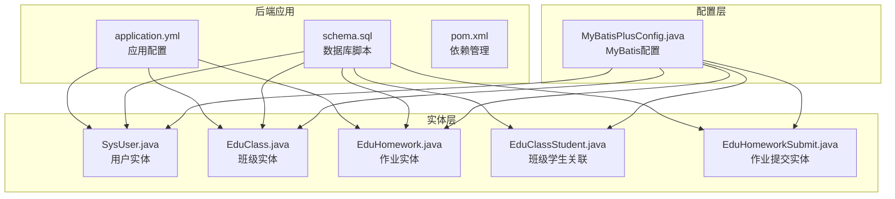
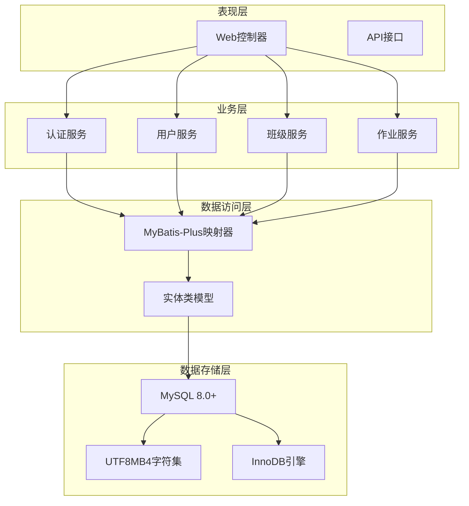
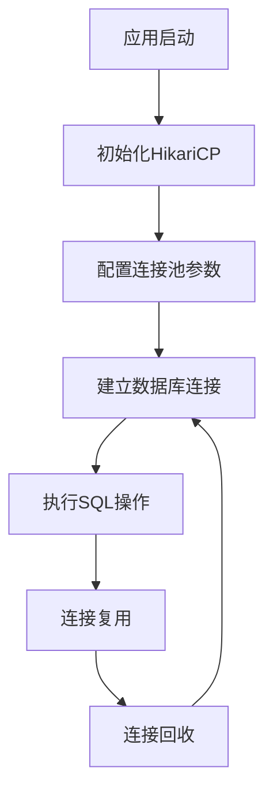
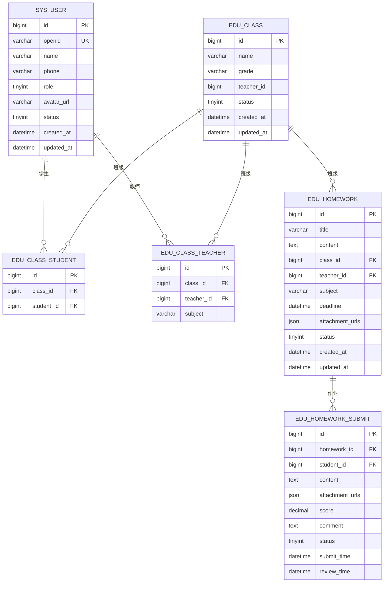
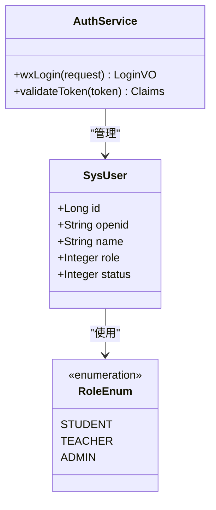
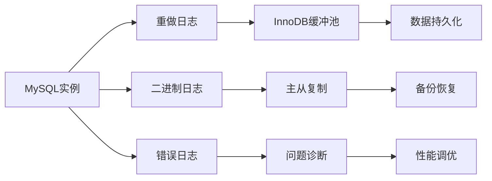
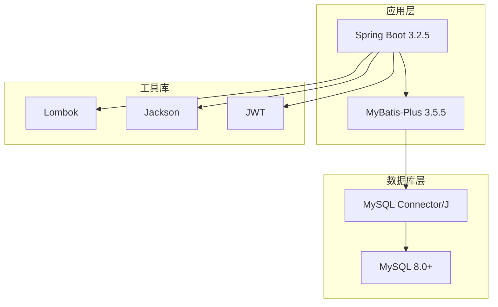
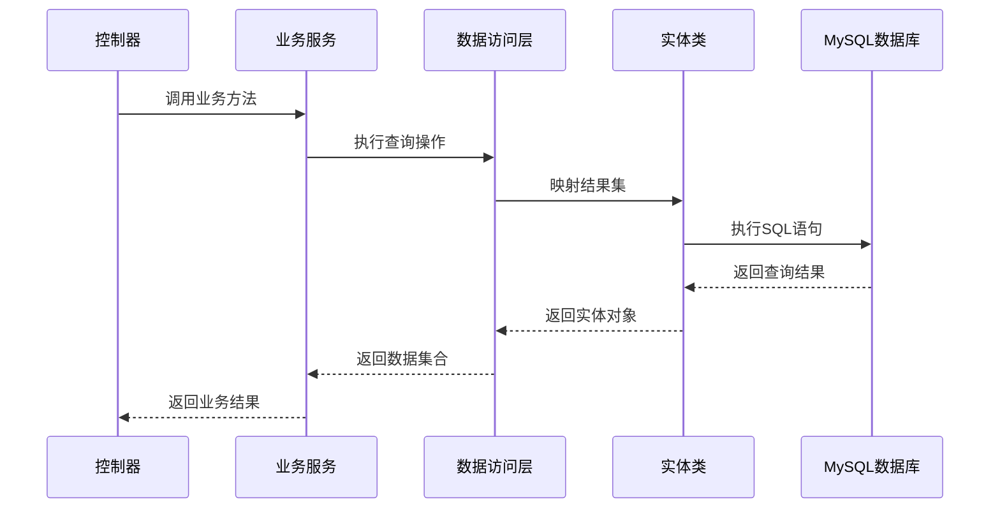

# 数据库架构设计

<cite>
**本文档引用的文件**
- [application.yml](file://helenedu-backend/src/main/resources/application.yml)
- [schema.sql](file://helenedu-backend/src/main/resources/db/schema.sql)
- [MyBatisPlusConfig.java](file://helenedu-backend/src/main/java/com/helen/eduedu/config/MyBatisPlusConfig.java)
- [SysUser.java](file://helenedu-backend/src/main/java/com/helen/eduedu/entity/SysUser.java)
- [EduClass.java](file://helenedu-backend/src/main/java/com/helen/eduedu/entity/EduClass.java)
- [EduHomework.java](file://helenedu-backend/src/main/java/com/helen/eduedu/entity/EduHomework.java)
- [EduClassStudent.java](file://helenedu-backend/src/main/java/com/helen/eduedu/entity/EduClassStudent.java)
- [EduHomeworkSubmit.java](file://helenedu-backend/src/main/java/com/helen/eduedu/entity/EduHomeworkSubmit.java)
- [pom.xml](file://helenedu-backend/pom.xml)
</cite>

## 目录
1. [引言](#引言)
2. [项目结构](#项目结构)
3. [核心组件](#核心组件)
4. [架构概览](#架构概览)
5. [详细组件分析](#详细组件分析)
6. [依赖关系分析](#依赖关系分析)
7. [性能考虑](#性能考虑)
8. [故障排除指南](#故障排除指南)
9. [结论](#结论)

## 引言

本文件为HelenEdu教育管理系统提供全面的数据库架构设计文档。该系统采用Spring Boot + MyBatis-Plus + MySQL的技术栈，专注于作业管理和班级管理功能。本文档详细阐述了数据库选择策略、配置参数、命名规范、安全配置、性能优化以及高可用架构设计。

## 项目结构

HelenEdu项目采用标准的Maven多模块结构，数据库相关的核心文件分布如下：

**图表来源**
- [application.yml:6-11](file://helenedu-backend/src/main/resources/application.yml#L6-L11)
- [schema.sql:1-94](file://helenedu-backend/src/main/resources/db/schema.sql#L1-L94)
- [MyBatisPlusConfig.java:1-21](file://helenedu-backend/src/main/java/com/helen/eduedu/config/MyBatisPlusConfig.java#L1-L21)

**章节来源**
- [application.yml:1-59](file://helenedu-backend/src/main/resources/application.yml#L1-L59)
- [schema.sql:1-94](file://helenedu-backend/src/main/resources/db/schema.sql#L1-L94)
- [pom.xml:1-118](file://helenedu-backend/pom.xml#L1-L118)

## 核心组件

### 数据库连接配置

系统使用Spring Boot自动配置的数据库连接池，默认采用HikariCP连接池，具有以下特点：

- **连接池类型**: HikariCP（Spring Boot默认连接池）
- **数据库驱动**: MySQL Connector/J 8.0+
- **字符集配置**: UTF8MB4（支持完整的Unicode字符）
- **时区设置**: Asia/Shanghai（中国标准时间）

### ORM框架配置

系统采用MyBatis-Plus作为ORM框架，提供以下增强功能：

- **分页插件**: 支持MySQL数据库的分页查询
- **逻辑删除**: 统一的数据软删除机制
- **驼峰命名**: 自动处理下划线与驼峰命名转换

**章节来源**
- [application.yml:6-31](file://helenedu-backend/src/main/resources/application.yml#L6-L31)
- [MyBatisPlusConfig.java:1-21](file://helenedu-backend/src/main/java/com/helen/eduedu/config/MyBatisPlusConfig.java#L1-L21)
- [pom.xml:40-52](file://helenedu-backend/pom.xml#L40-L52)

## 架构概览

HelenEdu采用经典的三层架构模式，数据库层设计遵循以下原则：

**图表来源**
- [SysUser.java:1-42](file://helenedu-backend/src/main/java/com/helen/eduedu/entity/SysUser.java#L1-L42)
- [EduClass.java:1-36](file://helenedu-backend/src/main/java/com/helen/eduedu/entity/EduClass.java#L1-L36)
- [EduHomework.java:1-52](file://helenedu-backend/src/main/java/com/helen/eduedu/entity/EduHomework.java#L1-L52)

## 详细组件分析

### 数据库选择与配置

#### MySQL 8.0+选择原因

系统选择MySQL 8.0+作为数据库管理系统，主要基于以下优势：

1. **性能提升**: MySQL 8.0引入了多项性能优化，包括更快的查询执行计划和改进的存储引擎
2. **安全性增强**: 内置更强的密码验证机制和审计日志功能
3. **JSON支持**: 原生JSON数据类型支持，便于存储结构化数据
4. **窗口函数**: 支持现代SQL特性，简化复杂查询
5. **并行复制**: 改进的复制机制，提高数据同步效率

#### 字符集选择策略

系统采用UTF8MB4字符集，这是当前最佳实践：

- **字符支持**: 支持完整的Unicode字符集，包括表情符号和多语言文本
- **兼容性**: 向后兼容UTF8，确保现有数据的完整性
- **存储效率**: 对于常用字符使用1-3字节存储，稀有字符使用4字节

**章节来源**
- [schema.sql](file://helenedu-backend/src/main/resources/db/schema.sql#L2)
- [application.yml](file://helenedu-backend/src/main/resources/application.yml#L8)

### 数据库实例配置

#### 连接池设置

系统使用Spring Boot默认的HikariCP连接池配置：

**图表来源**
- [application.yml:6-11](file://helenedu-backend/src/main/resources/application.yml#L6-L11)

#### 事务管理

系统采用声明式事务管理：

- **事务传播**: 默认REQUIRED传播行为
- **只读事务**: 查询操作标记为只读
- **异常回滚**: 运行时异常自动回滚事务

#### 字符集编码参数

数据库连接字符串包含关键参数：
- `useUnicode=true`: 启用Unicode支持
- `characterEncoding=utf-8`: 设置字符编码
- `useSSL=false`: 禁用SSL连接（开发环境）
- `serverTimezone=Asia/Shanghai`: 设置服务器时区

**章节来源**
- [application.yml](file://helenedu-backend/src/main/resources/application.yml#L8)

### 数据库命名规范

#### 表前缀设计原则

系统采用清晰的表前缀来区分不同业务域：

| 前缀 | 业务域 | 示例 |
|------|--------|------|
| `sys_` | 系统基础表 | sys_user, sys_dict |
| `edu_` | 教育业务表 | edu_class, edu_homework |
| `log_` | 日志表 | log_login, log_operation |

#### 命名约定

1. **表名**: 使用小写加下划线命名法（如 `edu_class_student`）
2. **字段名**: 采用下划线分隔的小写形式（如 `teacher_id`）
3. **索引名**: 使用 `uk_` 前缀表示唯一索引（如 `uk_class_student`）
4. **主键**: 统一使用 `id` 字段，类型为 `BIGINT AUTO_INCREMENT`

**章节来源**
- [schema.sql:5-88](file://helenedu-backend/src/main/resources/db/schema.sql#L5-L88)

### 数据模型设计

#### 核心实体关系

**图表来源**
- [SysUser.java:1-42](file://helenedu-backend/src/main/java/com/helen/eduedu/entity/SysUser.java#L1-L42)
- [EduClass.java:1-36](file://helenedu-backend/src/main/java/com/helen/eduedu/entity/EduClass.java#L1-L36)
- [EduHomework.java:1-52](file://helenedu-backend/src/main/java/com/helen/eduedu/entity/EduHomework.java#L1-L52)
- [EduClassStudent.java:1-24](file://helenedu-backend/src/main/java/com/helen/eduedu/entity/EduClassStudent.java#L1-L24)
- [EduHomeworkSubmit.java:1-52](file://helenedu-backend/src/main/java/com/helen/eduedu/entity/EduHomeworkSubmit.java#L1-L52)

#### 关键字段设计

| 表名 | 主键字段 | 外键字段 | 约束说明 |
|------|----------|----------|----------|
| sys_user | id | 无 | 唯一标识用户，支持微信openid绑定 |
| edu_class | id | teacher_id | 班级基本信息，关联班主任 |
| edu_class_student | id | class_id, student_id | 多对多关系，唯一约束防止重复 |
| edu_class_teacher | id | class_id, teacher_id | 多对多关系，支持科目字段 |
| edu_homework | id | class_id, teacher_id | 作业信息，支持JSON附件存储 |
| edu_homework_submit | id | homework_id, student_id | 提交记录，支持评分和评语 |

**章节来源**
- [schema.sql:5-88](file://helenedu-backend/src/main/resources/db/schema.sql#L5-L88)

### 安全配置

#### 用户权限管理

系统采用基于角色的访问控制（RBAC）模型：

**图表来源**
- [SysUser.java:29-30](file://helenedu-backend/src/main/java/com/helen/eduedu/entity/SysUser.java#L29-L30)
- [AuthService.java:1-44](file://helenedu-backend/src/main/java/com/helen/eduedu/service/AuthService.java#L1-L44)

#### 连接加密

在生产环境中，建议启用SSL连接：

- **SSL配置**: 将 `useSSL=true` 启用SSL加密传输
- **证书验证**: 生产环境配置CA证书验证
- **加密算法**: 使用TLS 1.2+加密协议

#### 审计日志

系统具备完善的审计能力：

- **操作日志**: 记录用户关键操作
- **登录日志**: 跟踪用户登录状态
- **数据变更**: 记录重要数据修改历史

**章节来源**
- [application.yml:33-36](file://helenedu-backend/src/main/resources/application.yml#L33-L36)

### 性能优化配置

#### 缓冲池大小

基于系统规模建议的InnoDB缓冲池配置：

| 系统规模 | 内存需求 | 缓冲池大小 |
|----------|----------|------------|
| 开发环境 | 8GB以下 | 256MB-512MB |
| 小型部署 | 8-16GB | 1-2GB |
| 中型部署 | 16-32GB | 4-8GB |
| 大型部署 | 32GB以上 | 16GB以上 |

#### 日志文件配置

**图表来源**
- [schema.sql:1-3](file://helenedu-backend/src/main/resources/db/schema.sql#L1-L3)

#### 慢查询日志设置

建议启用慢查询日志监控：

- **阈值设置**: 1秒以上的查询视为慢查询
- **日志轮转**: 每日轮转，保留30天
- **分析工具**: 使用pt-query-digest进行分析

**章节来源**
- [application.yml:21-31](file://helenedu-backend/src/main/resources/application.yml#L21-L31)

## 依赖关系分析

### 技术栈依赖

**图表来源**
- [pom.xml:20-25](file://helenedu-backend/pom.xml#L20-L25)

### 数据访问层设计

系统采用MyBatis-Plus的代码生成器模式：

**图表来源**
- [MyBatisPlusConfig.java:15-20](file://helenedu-backend/src/main/java/com/helen/eduedu/config/MyBatisPlusConfig.java#L15-L20)

**章节来源**
- [pom.xml:40-71](file://helenedu-backend/pom.xml#L40-L71)

## 性能考虑

### 查询优化策略

1. **索引设计**: 为常用查询字段建立合适索引
2. **分页查询**: 使用LIMIT和OFFSET实现高效分页
3. **连接优化**: 减少N+1查询问题
4. **缓存策略**: 结合Redis实现热点数据缓存

### 存储优化

- **压缩存储**: 对大文本字段使用压缩
- **分区表**: 对历史数据使用分区策略
- **归档机制**: 定期归档不常访问的数据

## 故障排除指南

### 常见问题诊断

#### 连接问题

1. **连接超时**: 检查网络连通性和防火墙设置
2. **认证失败**: 验证用户名密码和权限配置
3. **字符集错误**: 确认客户端和服务器字符集一致

#### 性能问题

1. **慢查询**: 使用EXPLAIN分析执行计划
2. **锁等待**: 检查事务隔离级别和锁竞争
3. **内存不足**: 监控缓冲池使用率和系统内存

### 监控指标

- **连接数**: 当前活跃连接数
- **查询速度**: 平均查询响应时间
- **缓存命中率**: InnoDB缓冲池命中率
- **磁盘IO**: 磁盘读写性能

**章节来源**
- [application.yml:6-11](file://helenedu-backend/src/main/resources/application.yml#L6-L11)

## 结论

HelenEdu数据库架构设计充分考虑了教育管理系统的业务特点，采用了现代化的技术栈和最佳实践。通过合理的数据库选择、配置优化和安全设计，系统能够满足当前业务需求并在未来具备良好的扩展性。

建议在生产环境中进一步完善以下方面：
1. 实施完整的备份策略和灾难恢复方案
2. 部署监控告警系统
3. 建立性能基准测试体系
4. 制定数据库维护和升级计划