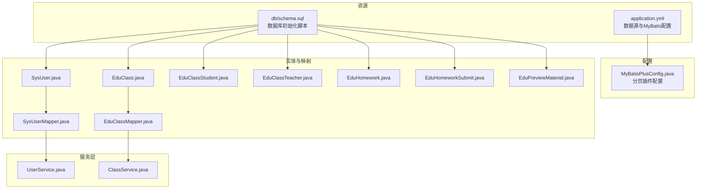
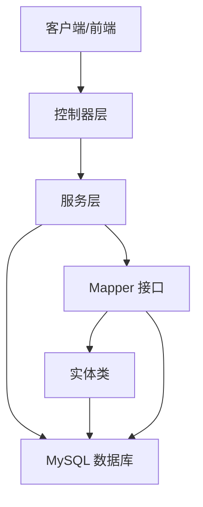
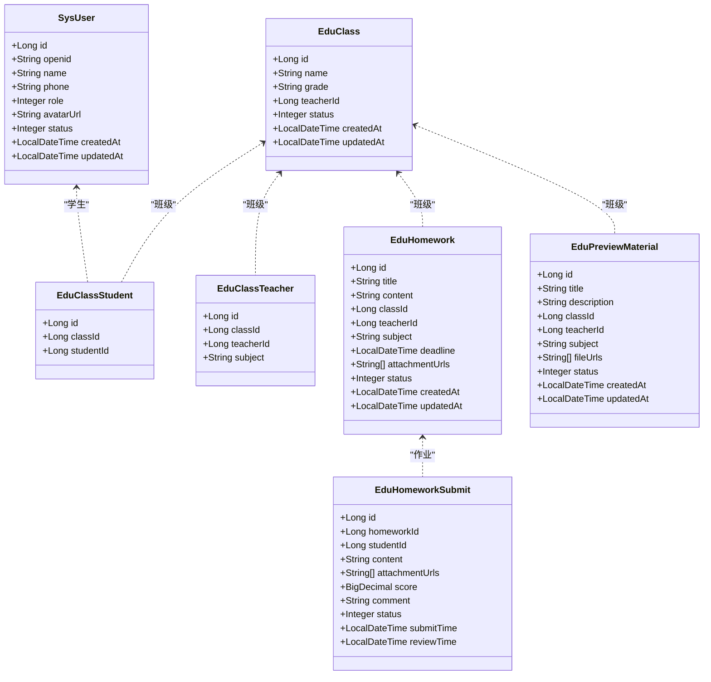
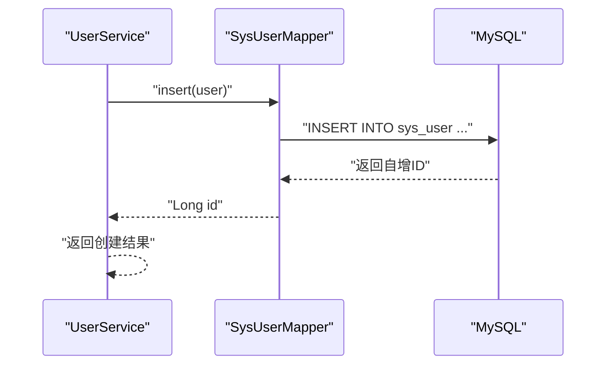
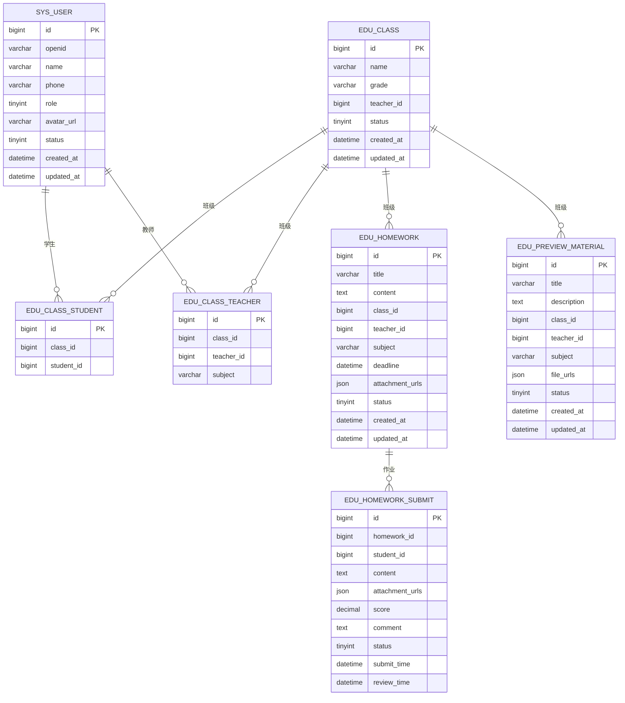
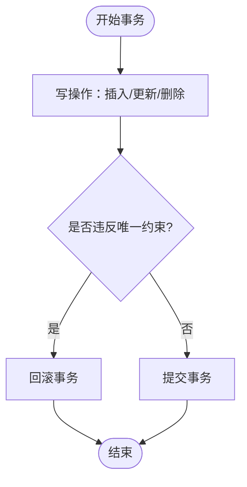
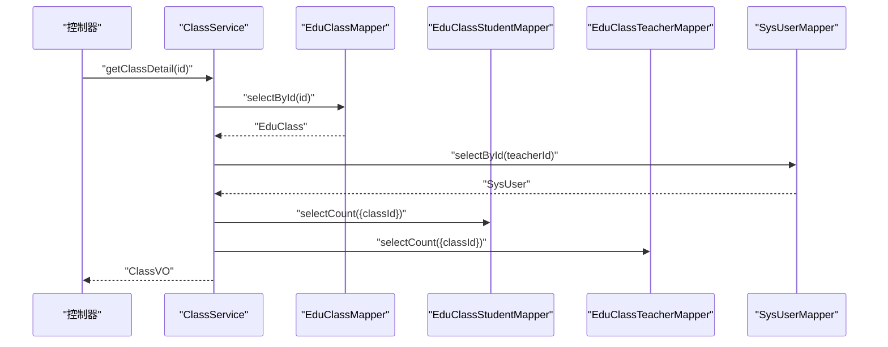
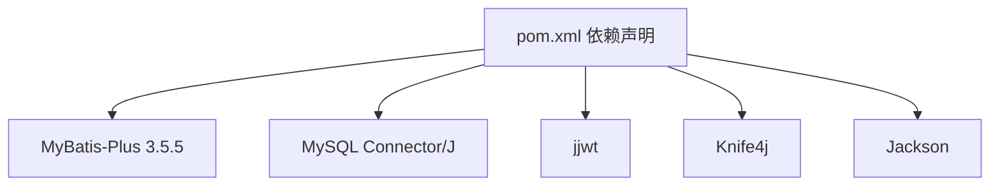

# 数据库设计

<cite>
**本文引用的文件**
- [schema.sql](file://helenedu-backend/src/main/resources/db/schema.sql)
- [SysUser.java](file://helenedu-backend/src/main/java/com/helen/eduedu/entity/SysUser.java)
- [EduClass.java](file://helenedu-backend/src/main/java/com/helen/eduedu/entity/EduClass.java)
- [EduClassStudent.java](file://helenedu-backend/src/main/java/com/helen/eduedu/entity/EduClassStudent.java)
- [EduClassTeacher.java](file://helenedu-backend/src/main/java/com/helen/eduedu/entity/EduClassTeacher.java)
- [EduHomework.java](file://helenedu-backend/src/main/java/com/helen/eduedu/entity/EduHomework.java)
- [EduHomeworkSubmit.java](file://helenedu-backend/src/main/java/com/helen/eduedu/entity/EduHomeworkSubmit.java)
- [EduPreviewMaterial.java](file://helenedu-backend/src/main/java/com/helen/eduedu/entity/EduPreviewMaterial.java)
- [SysUserMapper.java](file://helenedu-backend/src/main/java/com/helen/eduedu/mapper/SysUserMapper.java)
- [EduClassMapper.java](file://helenedu-backend/src/main/java/com/helen/eduedu/mapper/EduClassMapper.java)
- [MyBatisPlusConfig.java](file://helenedu-backend/src/main/java/com/helen/eduedu/config/MyBatisPlusConfig.java)
- [application.yml](file://helenedu-backend/src/main/resources/application.yml)
- [UserService.java](file://helenedu-backend/src/main/java/com/helen/eduedu/service/UserService.java)
- [ClassService.java](file://helenedu-backend/src/main/java/com/helen/eduedu/service/ClassService.java)
- [pom.xml](file://helenedu-backend/pom.xml)
</cite>

## 目录
1. [简介](#简介)
2. [项目结构](#项目结构)
3. [核心组件](#核心组件)
4. [架构总览](#架构总览)
5. [详细组件分析](#详细组件分析)
6. [依赖分析](#依赖分析)
7. [性能考虑](#性能考虑)
8. [故障排查指南](#故障排查指南)
9. [结论](#结论)
10. [附录](#附录)

## 简介
本设计文档面向 HelenEdu 数据库系统，围绕后端 Java 工程中的数据库架构与数据访问层进行系统化梳理。重点涵盖：
- 表结构设计与字段定义、数据类型选择
- 核心实体关系模型与关联关系
- 索引设计策略（主键、外键、唯一、复合索引）
- 完整 SQL 初始化脚本与数据字典
- 数据访问层设计（MyBatis-Plus 实体映射与查询优化）
- 数据一致性与事务处理策略
- 备份恢复方案与性能调优建议
- 监控与维护最佳实践

## 项目结构
后端工程采用 Spring Boot + MyBatis-Plus 架构，数据库初始化脚本位于资源目录，实体类与 Mapper 接口分别对应业务表，Service 层负责事务与组合查询。

**图表来源**
- [schema.sql:1-94](file://helenedu-backend/src/main/resources/db/schema.sql#L1-L94)
- [application.yml:6-32](file://helenedu-backend/src/main/resources/application.yml#L6-L32)
- [MyBatisPlusConfig.java:12-21](file://helenedu-backend/src/main/java/com/helen/eduedu/config/MyBatisPlusConfig.java#L12-L21)
- [SysUser.java:14-41](file://helenedu-backend/src/main/java/com/helen/eduedu/entity/SysUser.java#L14-L41)
- [EduClass.java:14-35](file://helenedu-backend/src/main/java/com/helen/eduedu/entity/EduClass.java#L14-L35)
- [EduClassStudent.java:12-23](file://helenedu-backend/src/main/java/com/helen/eduedu/entity/EduClassStudent.java#L12-L23)
- [EduClassTeacher.java:12-26](file://helenedu-backend/src/main/java/com/helen/eduedu/entity/EduClassTeacher.java#L12-L26)
- [EduHomework.java:17-51](file://helenedu-backend/src/main/java/com/helen/eduedu/entity/EduHomework.java#L17-L51)
- [EduHomeworkSubmit.java:18-51](file://helenedu-backend/src/main/java/com/helen/eduedu/entity/EduHomeworkSubmit.java#L18-L51)
- [EduPreviewMaterial.java:17-48](file://helenedu-backend/src/main/java/com/helen/eduedu/entity/EduPreviewMaterial.java#L17-L48)
- [SysUserMapper.java:7-9](file://helenedu-backend/src/main/java/com/helen/eduedu/mapper/SysUserMapper.java#L7-L9)
- [EduClassMapper.java:7-9](file://helenedu-backend/src/main/java/com/helen/eduedu/mapper/EduClassMapper.java#L7-L9)
- [UserService.java:23-129](file://helenedu-backend/src/main/java/com/helen/eduedu/service/UserService.java#L23-L129)
- [ClassService.java:25-261](file://helenedu-backend/src/main/java/com/helen/eduedu/service/ClassService.java#L25-L261)

**章节来源**
- [schema.sql:1-94](file://helenedu-backend/src/main/resources/db/schema.sql#L1-L94)
- [application.yml:6-32](file://helenedu-backend/src/main/resources/application.yml#L6-L32)

## 核心组件
- 数据库初始化脚本：定义数据库、字符集、各业务表及初始数据。
- 实体类：与数据库表一一映射，标注主键类型与表名。
- Mapper 接口：继承 MyBatis-Plus 的 BaseMapper，自动获得 CRUD 能力。
- 服务层：封装业务逻辑与事务控制，组合多表查询。
- MyBatis-Plus 配置：开启分页插件与全局配置（驼峰映射、逻辑删除等）。

**章节来源**
- [SysUser.java:14-41](file://helenedu-backend/src/main/java/com/helen/eduedu/entity/SysUser.java#L14-L41)
- [EduClass.java:14-35](file://helenedu-backend/src/main/java/com/helen/eduedu/entity/EduClass.java#L14-L35)
- [EduClassStudent.java:12-23](file://helenedu-backend/src/main/java/com/helen/eduedu/entity/EduClassStudent.java#L12-L23)
- [EduClassTeacher.java:12-26](file://helenedu-backend/src/main/java/com/helen/eduedu/entity/EduClassTeacher.java#L12-L26)
- [EduHomework.java:17-51](file://helenedu-backend/src/main/java/com/helen/eduedu/entity/EduHomework.java#L17-L51)
- [EduHomeworkSubmit.java:18-51](file://helenedu-backend/src/main/java/com/helen/eduedu/entity/EduHomeworkSubmit.java#L18-L51)
- [EduPreviewMaterial.java:17-48](file://helenedu-backend/src/main/java/com/helen/eduedu/entity/EduPreviewMaterial.java#L17-L48)
- [SysUserMapper.java:7-9](file://helenedu-backend/src/main/java/com/helen/eduedu/mapper/SysUserMapper.java#L7-L9)
- [EduClassMapper.java:7-9](file://helenedu-backend/src/main/java/com/helen/eduedu/mapper/EduClassMapper.java#L7-L9)
- [MyBatisPlusConfig.java:12-21](file://helenedu-backend/src/main/java/com/helen/eduedu/config/MyBatisPlusConfig.java#L12-L21)
- [UserService.java:23-129](file://helenedu-backend/src/main/java/com/helen/eduedu/service/UserService.java#L23-L129)
- [ClassService.java:25-261](file://helenedu-backend/src/main/java/com/helen/eduedu/service/ClassService.java#L25-L261)

## 架构总览
系统采用“实体-映射-服务”三层结构，MyBatis-Plus 提供通用 CRUD 与分页能力；应用通过配置文件指定数据源与 MyBatis 全局行为。

[此图为概念性架构示意，不直接映射具体源码文件，故不提供图表来源]

## 详细组件分析

### 表结构与数据字典
- 数据库与字符集：统一使用 UTF8MB4，支持表情与多语言。
- 用户表（sys_user）：存储用户基本信息、角色、状态与时间戳。
- 班级表（edu_class）：记录班级名称、年级、班主任与状态。
- 关联表：
  - 班级-学生（edu_class_student）：唯一约束确保一个学生仅一次加入同一班级。
  - 班级-教师（edu_class_teacher）：记录任教学科。
- 作业表（edu_homework）：包含标题、内容、截止时间、附件列表与状态。
- 作业提交表（edu_homework_submit）：记录提交内容、附件、评分、评语与状态。
- 预习资料表（edu_preview_material）：资料标题、描述、附件列表与状态。

字段与类型选择要点：
- 主键统一使用 BIGINT 自增，满足高并发与大体量扩展需求。
- JSON 字段用于存储附件 URL 列表，便于灵活扩展。
- 时间戳字段使用 DATETIME，配合默认值与更新触发策略。
- 角色与状态使用 TINYINT，占用空间小且便于枚举映射。

**章节来源**
- [schema.sql:6-16](file://helenedu-backend/src/main/resources/db/schema.sql#L6-L16)
- [schema.sql:18-27](file://helenedu-backend/src/main/resources/db/schema.sql#L18-L27)
- [schema.sql:29-35](file://helenedu-backend/src/main/resources/db/schema.sql#L29-L35)
- [schema.sql:37-44](file://helenedu-backend/src/main/resources/db/schema.sql#L37-L44)
- [schema.sql:46-59](file://helenedu-backend/src/main/resources/db/schema.sql#L46-L59)
- [schema.sql:61-74](file://helenedu-backend/src/main/resources/db/schema.sql#L61-L74)
- [schema.sql:76-88](file://helenedu-backend/src/main/resources/db/schema.sql#L76-L88)

### 实体类与 MyBatis-Plus 映射
- 实体类通过注解声明表名与主键类型，自动映射数据库字段。
- JSON 字段使用 JacksonTypeHandler 进行序列化/反序列化。
- 服务层通过 LambdaQueryWrapper 组合查询条件，实现分页与排序。

**图表来源**
- [SysUser.java:14-41](file://helenedu-backend/src/main/java/com/helen/eduedu/entity/SysUser.java#L14-L41)
- [EduClass.java:14-35](file://helenedu-backend/src/main/java/com/helen/eduedu/entity/EduClass.java#L14-L35)
- [EduClassStudent.java:12-23](file://helenedu-backend/src/main/java/com/helen/eduedu/entity/EduClassStudent.java#L12-L23)
- [EduClassTeacher.java:12-26](file://helenedu-backend/src/main/java/com/helen/eduedu/entity/EduClassTeacher.java#L12-L26)
- [EduHomework.java:17-51](file://helenedu-backend/src/main/java/com/helen/eduedu/entity/EduHomework.java#L17-L51)
- [EduHomeworkSubmit.java:18-51](file://helenedu-backend/src/main/java/com/helen/eduedu/entity/EduHomeworkSubmit.java#L18-L51)
- [EduPreviewMaterial.java:17-48](file://helenedu-backend/src/main/java/com/helen/eduedu/entity/EduPreviewMaterial.java#L17-L48)

**章节来源**
- [SysUser.java:14-41](file://helenedu-backend/src/main/java/com/helen/eduedu/entity/SysUser.java#L14-L41)
- [EduClass.java:14-35](file://helenedu-backend/src/main/java/com/helen/eduedu/entity/EduClass.java#L14-L35)
- [EduClassStudent.java:12-23](file://helenedu-backend/src/main/java/com/helen/eduedu/entity/EduClassStudent.java#L12-L23)
- [EduClassTeacher.java:12-26](file://helenedu-backend/src/main/java/com/helen/eduedu/entity/EduClassTeacher.java#L12-L26)
- [EduHomework.java:17-51](file://helenedu-backend/src/main/java/com/helen/eduedu/entity/EduHomework.java#L17-L51)
- [EduHomeworkSubmit.java:18-51](file://helenedu-backend/src/main/java/com/helen/eduedu/entity/EduHomeworkSubmit.java#L18-L51)
- [EduPreviewMaterial.java:17-48](file://helenedu-backend/src/main/java/com/helen/eduedu/entity/EduPreviewMaterial.java#L17-L48)

### 数据访问层设计（MyBatis-Plus）
- Mapper 接口：继承 BaseMapper，自动获得通用 CRUD 与分页查询能力。
- 配置项：
  - 分页插件：PaginationInnerInterceptor（MySQL）。
  - 全局配置：驼峰映射、日志输出、逻辑删除字段与值。
- 服务层：
  - 使用 LambdaQueryWrapper 构建查询条件，支持分页、排序与模糊匹配。
  - 事务注解：@Transactional 包裹写操作，保障一致性。

**图表来源**
- [UserService.java:32-39](file://helenedu-backend/src/main/java/com/helen/eduedu/service/UserService.java#L32-L39)
- [SysUserMapper.java:7-9](file://helenedu-backend/src/main/java/com/helen/eduedu/mapper/SysUserMapper.java#L7-L9)

**章节来源**
- [SysUserMapper.java:7-9](file://helenedu-backend/src/main/java/com/helen/eduedu/mapper/SysUserMapper.java#L7-L9)
- [MyBatisPlusConfig.java:12-21](file://helenedu-backend/src/main/java/com/helen/eduedu/config/MyBatisPlusConfig.java#L12-L21)
- [application.yml:21-31](file://helenedu-backend/src/main/resources/application.yml#L21-L31)
- [UserService.java:78-98](file://helenedu-backend/src/main/java/com/helen/eduedu/service/UserService.java#L78-L98)

### 关系模型与索引设计策略
- 主键索引：所有表主键均为自增 BIGINT，天然唯一且有序，适合高并发插入。
- 外键索引：当前脚本未显式创建外键约束，但通过业务层与唯一约束保证数据完整性。
- 唯一索引：
  - 班级-学生唯一索引：uk_class_student(class_id, student_id)
  - 班级-教师唯一索引：uk_class_teacher(class_id, teacher_id)
  - 作业-学生唯一索引：uk_hw_student(homework_id, student_id)
- 复合索引建议：
  - 用户表：按角色+状态+创建时间建立复合索引，提升用户列表分页查询效率。
  - 班级表：按状态+创建时间，支持正常班级的快速筛选与排序。
  - 作业表：按班级+状态+截止时间，支持按班推送与截止提醒。
  - 作业提交表：按作业+状态+提交时间，支持作业统计与批阅流程。
  - 预习资料表：按班级+状态+创建时间，支持资料展示与排序。
- JSON 字段：附件列表字段无需额外索引，查询时按完整 JSON 结构读取即可。

**图表来源**
- [schema.sql:6-16](file://helenedu-backend/src/main/resources/db/schema.sql#L6-L16)
- [schema.sql:18-27](file://helenedu-backend/src/main/resources/db/schema.sql#L18-L27)
- [schema.sql:29-35](file://helenedu-backend/src/main/resources/db/schema.sql#L29-L35)
- [schema.sql:37-44](file://helenedu-backend/src/main/resources/db/schema.sql#L37-L44)
- [schema.sql:46-59](file://helenedu-backend/src/main/resources/db/schema.sql#L46-L59)
- [schema.sql:61-74](file://helenedu-backend/src/main/resources/db/schema.sql#L61-L74)
- [schema.sql:76-88](file://helenedu-backend/src/main/resources/db/schema.sql#L76-L88)

**章节来源**
- [schema.sql:29-35](file://helenedu-backend/src/main/resources/db/schema.sql#L29-L35)
- [schema.sql:37-44](file://helenedu-backend/src/main/resources/db/schema.sql#L37-L44)
- [schema.sql:71-74](file://helenedu-backend/src/main/resources/db/schema.sql#L71-L74)

### 事务与一致性保障
- 事务边界：服务层方法使用 @Transactional，覆盖新增、更新、删除与批量成员变更等操作。
- 业务一致性：
  - 班级解散采用软删除（状态置为 0），避免级联删除破坏历史数据。
  - 成员添加前检查唯一性，防止重复加入。
  - 通过唯一索引约束保证作业提交与班级成员的唯一性。
- 并发控制：主键自增与唯一索引降低锁竞争；分页查询避免全表扫描。

**图表来源**
- [ClassService.java:126-142](file://helenedu-backend/src/main/java/com/helen/eduedu/service/ClassService.java#L126-L142)
- [ClassService.java:177-193](file://helenedu-backend/src/main/java/com/helen/eduedu/service/ClassService.java#L177-L193)

**章节来源**
- [ClassService.java:37-71](file://helenedu-backend/src/main/java/com/helen/eduedu/service/ClassService.java#L37-L71)
- [ClassService.java:126-142](file://helenedu-backend/src/main/java/com/helen/eduedu/service/ClassService.java#L126-L142)
- [ClassService.java:177-193](file://helenedu-backend/src/main/java/com/helen/eduedu/service/ClassService.java#L177-L193)

### 查询流程与优化
- 分页查询：通过 Page 对象与 LambdaQueryWrapper 组合条件，避免一次性加载大量数据。
- 条件过滤：支持角色筛选、关键词模糊匹配、状态过滤与时间排序。
- 多表聚合：在服务层通过多次查询与流式转换完成聚合统计（如班级人数、教师数）。

**图表来源**
- [ClassService.java:97-103](file://helenedu-backend/src/main/java/com/helen/eduedu/service/ClassService.java#L97-L103)
- [ClassService.java:235-260](file://helenedu-backend/src/main/java/com/helen/eduedu/service/ClassService.java#L235-L260)

**章节来源**
- [UserService.java:78-98](file://helenedu-backend/src/main/java/com/helen/eduedu/service/UserService.java#L78-L98)
- [ClassService.java:76-92](file://helenedu-backend/src/main/java/com/helen/eduedu/service/ClassService.java#L76-L92)
- [ClassService.java:235-260](file://helenedu-backend/src/main/java/com/helen/eduedu/service/ClassService.java#L235-L260)

## 依赖分析
- MyBatis-Plus 版本：3.5.5，提供增强的分页、逻辑删除与类型处理器。
- 数据库驱动：MySQL Connector/J。
- JWT 依赖：用于鉴权。
- Knife4j：在线 API 文档工具。

**图表来源**
- [pom.xml:40-71](file://helenedu-backend/pom.xml#L40-L71)

**章节来源**
- [pom.xml:20-25](file://helenedu-backend/pom.xml#L20-L25)
- [pom.xml:40-71](file://helenedu-backend/pom.xml#L40-L71)

## 性能考虑
- 索引优化：
  - 用户表：角色+状态+创建时间复合索引，加速分页与筛选。
  - 班级表：状态+创建时间，支持正常班级的快速检索。
  - 作业表：班级+状态+截止时间，支撑作业推送与到期提醒。
  - 作业提交表：作业+状态+提交时间，支撑统计与批阅流程。
  - 预习资料表：班级+状态+创建时间，支撑资料展示。
- 查询优化：
  - 使用分页插件限制单页数量，避免全表扫描。
  - 仅查询必要字段，减少网络与内存开销。
  - JSON 字段按需读取，避免不必要的解析。
- 缓存策略：
  - 对热点数据（如用户角色、班级基础信息）引入 Redis 缓存。
- 连接池与参数：
  - 合理配置连接池大小与超时时间，避免连接泄漏。
- 监控与日志：
  - 开启慢查询日志与执行计划分析，定期审查热点 SQL。

[本节为通用性能建议，不直接分析具体源码文件，故不提供章节来源]

## 故障排查指南
- 常见问题与定位：
  - 唯一约束冲突：检查唯一索引（班级-学生、班级-教师、作业-学生）是否被违反。
  - 事务回滚：确认 @Transactional 是否正确包裹写操作，异常是否被捕获导致未回滚。
  - JSON 字段解析失败：确认 JSON 内容格式与字段类型一致。
  - 分页查询性能差：检查是否缺少必要的复合索引或查询条件过于宽泛。
- 日志与诊断：
  - 启用 MyBatis 日志输出，查看生成的 SQL 与参数。
  - 使用数据库慢查询日志定位热点 SQL。
- 业务异常：
  - 用户/班级不存在：服务层抛出业务异常，需在上层提示用户。

**章节来源**
- [UserService.java:47-48](file://helenedu-backend/src/main/java/com/helen/eduedu/service/UserService.java#L47-L48)
- [ClassService.java:51-53](file://helenedu-backend/src/main/java/com/helen/eduedu/service/ClassService.java#L51-L53)
- [application.yml:23-25](file://helenedu-backend/src/main/resources/application.yml#L23-L25)

## 结论
本设计以清晰的表结构与实体映射为基础，结合 MyBatis-Plus 的通用能力与服务层的事务控制，构建了可扩展、易维护的数据层。通过合理的索引策略与查询优化，能够满足日常作业管理与班级管理的性能需求。建议在生产环境中进一步完善索引、引入缓存与监控体系，并制定完善的备份与恢复策略。

[本节为总结性内容，不直接分析具体源码文件，故不提供章节来源]

## 附录

### 完整 SQL 初始化脚本
- 脚本位置：[schema.sql:1-94](file://helenedu-backend/src/main/resources/db/schema.sql#L1-L94)
- 脚本内容概要：
  - 创建数据库与字符集设置
  - 创建用户表、班级表、班级-学生关联表、班级-教师关联表、作业表、作业提交表、预习资料表
  - 插入初始管理员、教师与学生数据

**章节来源**
- [schema.sql:1-94](file://helenedu-backend/src/main/resources/db/schema.sql#L1-L94)

### 数据字典（字段说明）
- sys_user
  - id：BIGINT，主键
  - openid：VARCHAR(64)，唯一
  - name：VARCHAR(50)，姓名
  - phone：VARCHAR(20)，手机号
  - role：TINYINT，角色：1-学生 2-教师 3-管理员
  - avatar_url：VARCHAR(255)，头像
  - status：TINYINT，默认1，0-禁用 1-启用
  - created_at/updated_at：DATETIME
- edu_class
  - id/name/grade/status/created_at/updated_at：同上
  - teacher_id：BIGINT，班主任
- edu_class_student
  - id/class_id/student_id：联合唯一索引
- edu_class_teacher
  - id/class_id/teacher_id/subject：联合唯一索引
- edu_homework
  - id/title/content/class_id/teacher_id/subject/deadline/attachment_urls/status/created_at/updated_at
- edu_homework_submit
  - id/homework_id/student_id/content/attachment_urls/score/comment/status/submit_time/review_time
- edu_preview_material
  - id/title/description/class_id/teacher_id/subject/file_urls/status/created_at/updated_at

**章节来源**
- [schema.sql:6-16](file://helenedu-backend/src/main/resources/db/schema.sql#L6-L16)
- [schema.sql:18-27](file://helenedu-backend/src/main/resources/db/schema.sql#L18-L27)
- [schema.sql:29-35](file://helenedu-backend/src/main/resources/db/schema.sql#L29-L35)
- [schema.sql:37-44](file://helenedu-backend/src/main/resources/db/schema.sql#L37-L44)
- [schema.sql:46-59](file://helenedu-backend/src/main/resources/db/schema.sql#L46-L59)
- [schema.sql:61-74](file://helenedu-backend/src/main/resources/db/schema.sql#L61-L74)
- [schema.sql:76-88](file://helenedu-backend/src/main/resources/db/schema.sql#L76-L88)

### 数据访问层配置
- 数据源：application.yml 中配置 JDBC URL、用户名、密码与驱动。
- MyBatis-Plus：开启分页插件、驼峰映射、日志输出、逻辑删除字段。
- Mapper 扫描：classpath:mapper/*.xml。

**章节来源**
- [application.yml:6-11](file://helenedu-backend/src/main/resources/application.yml#L6-L11)
- [application.yml:21-31](file://helenedu-backend/src/main/resources/application.yml#L21-L31)
- [MyBatisPlusConfig.java:12-21](file://helenedu-backend/src/main/java/com/helen/eduedu/config/MyBatisPlusConfig.java#L12-L21)