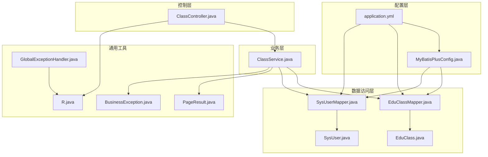
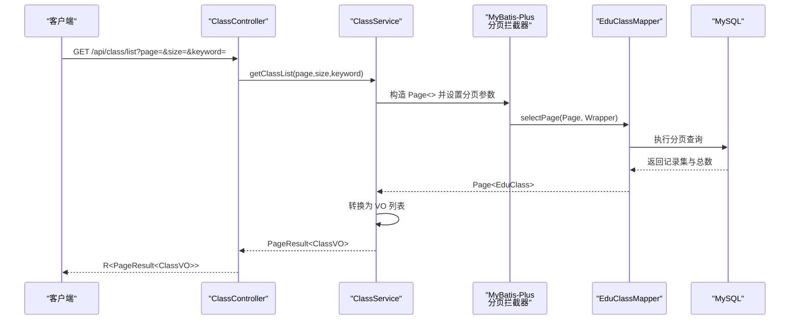
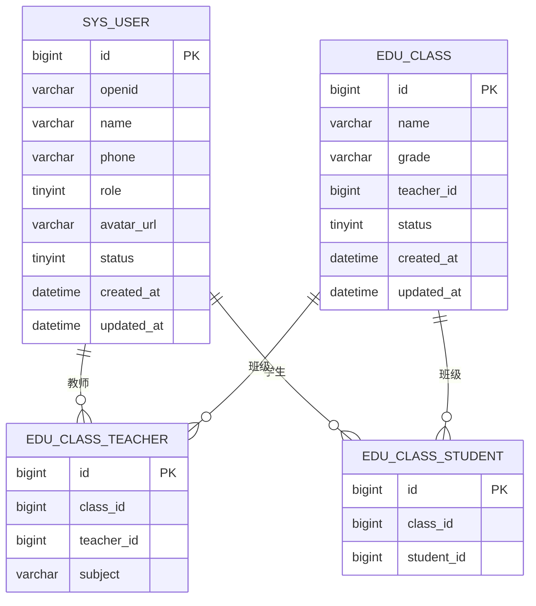
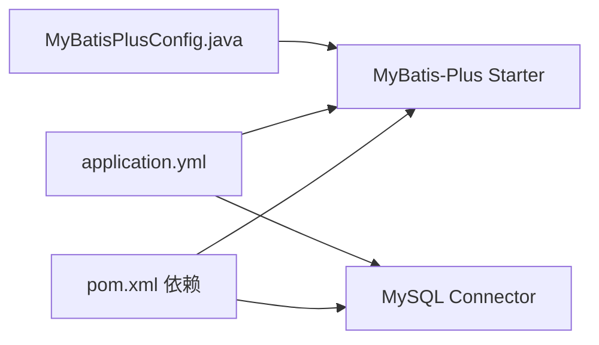

# 数据访问层设计

<cite>
**本文引用的文件**
- [MyBatisPlusConfig.java](file://helenedu-backend/src/main/java/com/helen/eduedu/config/MyBatisPlusConfig.java)
- [application.yml](file://helenedu-backend/src/main/resources/application.yml)
- [pom.xml](file://helenedu-backend/pom.xml)
- [EduClass.java](file://helenedu-backend/src/main/java/com/helen/eduedu/entity/EduClass.java)
- [SysUser.java](file://helenedu-backend/src/main/java/com/helen/eduedu/entity/SysUser.java)
- [EduClassMapper.java](file://helenedu-backend/src/main/java/com/helen/eduedu/mapper/EduClassMapper.java)
- [SysUserMapper.java](file://helenedu-backend/src/main/java/com/helen/eduedu/mapper/SysUserMapper.java)
- [ClassService.java](file://helenedu-backend/src/main/java/com/helen/eduedu/service/ClassService.java)
- [ClassController.java](file://helenedu-backend/src/main/java/com/helen/eduedu/controller/ClassController.java)
- [PageResult.java](file://helenedu-backend/src/main/java/com/helen/eduedu/common/PageResult.java)
- [R.java](file://helenedu-backend/src/main/java/com/helen/eduedu/common/R.java)
- [BusinessException.java](file://helenedu-backend/src/main/java/com/helen/eduedu/common/BusinessException.java)
- [GlobalExceptionHandler.java](file://helenedu-backend/src/main/java/com/helen/eduedu/common/GlobalExceptionHandler.java)
- [schema.sql](file://helenedu-backend/src/main/resources/db/schema.sql)
</cite>

## 目录
1. [引言](#引言)
2. [项目结构](#项目结构)
3. [核心组件](#核心组件)
4. [架构总览](#架构总览)
5. [详细组件分析](#详细组件分析)
6. [依赖分析](#依赖分析)
7. [性能考虑](#性能考虑)
8. [故障排查指南](#故障排查指南)
9. [结论](#结论)
10. [附录](#附录)

## 引言
本设计文档聚焦于 HelenEdu 后端的数据访问层，系统性阐述 MyBatis-Plus 的配置与使用策略，包括自动代码生成、分页插件配置、性能优化设置；明确 Mapper 接口的设计原则与 CRUD 标准实现、自定义查询方法的编写规范；解释实体类与数据库表的映射关系及注解使用、字段命名策略；说明分页查询的实现方式与 Page 对象使用；给出批量操作（批量插入、更新、删除）的优化建议；并总结数据访问层的异常处理机制与事务管理策略。

## 项目结构
数据访问层位于后端模块中，采用“实体-映射器-服务-控制器”的分层组织方式，配合 Spring Boot 自动装配与 MyBatis-Plus 提供的通用 CRUD 能力，形成简洁高效的持久化方案。

图表来源
- [MyBatisPlusConfig.java:12-21](file://helenedu-backend/src/main/java/com/helen/eduedu/config/MyBatisPlusConfig.java#L12-L21)
- [application.yml:21-31](file://helenedu-backend/src/main/resources/application.yml#L21-L31)
- [EduClass.java:14-35](file://helenedu-backend/src/main/java/com/helen/eduedu/entity/EduClass.java#L14-L35)
- [SysUser.java:14-41](file://helenedu-backend/src/main/java/com/helen/eduedu/entity/SysUser.java#L14-L41)
- [EduClassMapper.java:7-9](file://helenedu-backend/src/main/java/com/helen/eduedu/mapper/EduClassMapper.java#L7-L9)
- [SysUserMapper.java:7-9](file://helenedu-backend/src/main/java/com/helen/eduedu/mapper/SysUserMapper.java#L7-L9)
- [ClassService.java:27-32](file://helenedu-backend/src/main/java/com/helen/eduedu/service/ClassService.java#L27-L32)
- [ClassController.java:27-29](file://helenedu-backend/src/main/java/com/helen/eduedu/controller/ClassController.java#L27-L29)
- [PageResult.java:10-24](file://helenedu-backend/src/main/java/com/helen/eduedu/common/PageResult.java#L10-L24)
- [R.java:9-41](file://helenedu-backend/src/main/java/com/helen/eduedu/common/R.java#L9-L41)
- [BusinessException.java:9-21](file://helenedu-backend/src/main/java/com/helen/eduedu/common/BusinessException.java#L9-L21)
- [GlobalExceptionHandler.java:17-56](file://helenedu-backend/src/main/java/com/helen/eduedu/common/GlobalExceptionHandler.java#L17-L56)

章节来源
- [MyBatisPlusConfig.java:12-21](file://helenedu-backend/src/main/java/com/helen/eduedu/config/MyBatisPlusConfig.java#L12-L21)
- [application.yml:21-31](file://helenedu-backend/src/main/resources/application.yml#L21-L31)

## 核心组件
- MyBatis-Plus 配置：在配置类中注册分页拦截器，支持多数据库类型识别与分页 SQL 改写。
- 实体类与映射：使用注解标注表名、主键类型与驼峰映射，确保字段命名与数据库一致。
- Mapper 接口：基于 BaseMapper 提供标准 CRUD，必要时扩展自定义 XML 或方法。
- 服务层：组合多个 Mapper 完成复杂业务，统一处理分页、条件查询与事务。
- 控制器层：接收请求参数，调用服务层，返回统一封装响应体。
- 通用工具：统一响应体、分页结果封装、业务异常与全局异常处理。

章节来源
- [MyBatisPlusConfig.java:12-21](file://helenedu-backend/src/main/java/com/helen/eduedu/config/MyBatisPlusConfig.java#L12-L21)
- [EduClass.java:14-35](file://helenedu-backend/src/main/java/com/helen/eduedu/entity/EduClass.java#L14-L35)
- [SysUser.java:14-41](file://helenedu-backend/src/main/java/com/helen/eduedu/entity/SysUser.java#L14-L41)
- [EduClassMapper.java:7-9](file://helenedu-backend/src/main/java/com/helen/eduedu/mapper/EduClassMapper.java#L7-L9)
- [SysUserMapper.java:7-9](file://helenedu-backend/src/main/java/com/helen/eduedu/mapper/SysUserMapper.java#L7-L9)
- [ClassService.java:27-32](file://helenedu-backend/src/main/java/com/helen/eduedu/service/ClassService.java#L27-L32)
- [ClassController.java:27-29](file://helenedu-backend/src/main/java/com/helen/eduedu/controller/ClassController.java#L27-L29)
- [PageResult.java:10-24](file://helenedu-backend/src/main/java/com/helen/eduedu/common/PageResult.java#L10-L24)
- [R.java:9-41](file://helenedu-backend/src/main/java/com/helen/eduedu/common/R.java#L9-L41)
- [BusinessException.java:9-21](file://helenedu-backend/src/main/java/com/helen/eduedu/common/BusinessException.java#L9-L21)
- [GlobalExceptionHandler.java:17-56](file://helenedu-backend/src/main/java/com/helen/eduedu/common/GlobalExceptionHandler.java#L17-L56)

## 架构总览
数据访问层遵循“配置-实体-映射-服务-控制-响应”的链路，MyBatis-Plus 在配置阶段注入分页能力，运行期由服务层发起查询与分页，最终由控制器返回统一响应体。

图表来源
- [ClassController.java:56-61](file://helenedu-backend/src/main/java/com/helen/eduedu/controller/ClassController.java#L56-L61)
- [ClassService.java:76-92](file://helenedu-backend/src/main/java/com/helen/eduedu/service/ClassService.java#L76-L92)
- [MyBatisPlusConfig.java:15-20](file://helenedu-backend/src/main/java/com/helen/eduedu/config/MyBatisPlusConfig.java#L15-L20)
- [EduClassMapper.java:7-9](file://helenedu-backend/src/main/java/com/helen/eduedu/mapper/EduClassMapper.java#L7-L9)
- [R.java:16-26](file://helenedu-backend/src/main/java/com/helen/eduedu/common/R.java#L16-L26)
- [PageResult.java:18-23](file://helenedu-backend/src/main/java/com/helen/eduedu/common/PageResult.java#L18-L23)

## 详细组件分析

### MyBatis-Plus 配置与使用策略
- 分页插件配置：在配置类中注册 MybatisPlusInterceptor，并添加 PaginationInnerInterceptor，指定数据库类型为 MySQL，以启用分页 SQL 改写与安全边界检查。
- 全局配置：在 application.yml 中开启下划线转驼峰映射、日志输出、逻辑删除字段与值等，提升开发体验与一致性。
- 依赖版本：pom.xml 中引入 MyBatis-Plus Spring Boot Starter 与 MySQL Connector，确保运行环境兼容。

章节来源
- [MyBatisPlusConfig.java:15-20](file://helenedu-backend/src/main/java/com/helen/eduedu/config/MyBatisPlusConfig.java#L15-L20)
- [application.yml:21-31](file://helenedu-backend/src/main/resources/application.yml#L21-L31)
- [pom.xml:40-45](file://helenedu-backend/pom.xml#L40-L45)

### Mapper 接口设计原则
- 基础 CRUD：所有 Mapper 继承 BaseMapper，即可获得 insert、deleteById、updateById、selectById、selectList、selectPage 等通用能力。
- 自定义查询：如需复杂条件或联表查询，可在 Mapper 中声明方法或通过 XML 编写 SQL；对于简单条件可优先使用 LambdaQueryWrapper。
- 注解与扫描：Mapper 类上使用 @Mapper 注解，确保被 Spring 扫描并注入到服务层。

章节来源
- [EduClassMapper.java:7-9](file://helenedu-backend/src/main/java/com/helen/eduedu/mapper/EduClassMapper.java#L7-L9)
- [SysUserMapper.java:7-9](file://helenedu-backend/src/main/java/com/helen/eduedu/mapper/SysUserMapper.java#L7-L9)
- [ClassService.java:29-32](file://helenedu-backend/src/main/java/com/helen/eduedu/service/ClassService.java#L29-L32)

### 实体类与数据库表映射
- 表名映射：实体类使用 @TableName 指定数据库表名，确保 ORM 与物理表一致。
- 主键策略：@TableId(type = IdType.AUTO) 映射自增主键，结合全局配置 id-type: auto，保证插入时主键生成策略一致。
- 字段命名：实体字段采用驼峰命名，配合 application.yml 的 map-underscore-to-camel-case: true，自动完成下划线字段与驼峰属性的映射。
- 时间字段：createdAt、updatedAt 使用 LocalDateTime，配合数据库默认值与时区配置，避免时区与格式问题。

章节来源
- [EduClass.java:14-35](file://helenedu-backend/src/main/java/com/helen/eduedu/entity/EduClass.java#L14-L35)
- [SysUser.java:14-41](file://helenedu-backend/src/main/java/com/helen/eduedu/entity/SysUser.java#L14-L41)
- [application.yml:24](file://helenedu-backend/src/main/resources/application.yml#L24)

### 分页查询实现
- Page 对象：服务层构造 Page<EduClass>(page, size)，作为分页参数传入 Mapper 的 selectPage。
- 条件构建：使用 LambdaQueryWrapper 组合 eq、like、orderByDesc 等条件，实现关键词搜索与排序。
- 结果封装：将 Page<EduClass> 的 records 转换为 VO 列表，结合 PageResult 封装 total、page、size、records 返回给控制器。

章节来源
- [ClassService.java:76-92](file://helenedu-backend/src/main/java/com/helen/eduedu/service/ClassService.java#L76-L92)
- [PageResult.java:18-23](file://helenedu-backend/src/main/java/com/helen/eduedu/common/PageResult.java#L18-L23)

### 批量操作设计方案
- 批量插入：使用 BaseMapper 的 insertBatchSomeRecords 或自定义 XML 批处理 SQL，减少网络往返与事务开销。
- 批量更新/删除：使用 updateBatchById/deleteBatchIds，或通过 XML 批处理语句，注意控制批次大小与事务边界。
- 性能建议：合理设置批次大小、关闭自动提交、在事务中执行、避免 N+1 查询；对大表操作使用分页游标或分批处理。

（本节为通用实践指导，不直接分析具体文件）

### 事务管理策略
- 声明式事务：在 ClassService 中对创建、更新、删除、成员管理等业务方法使用 @Transactional，确保原子性与一致性。
- 异常回滚：业务异常 BusinessException 默认抛出运行时异常，触发事务回滚；全局异常处理器统一返回 R.fail。

章节来源
- [ClassService.java:37-71](file://helenedu-backend/src/main/java/com/helen/eduedu/service/ClassService.java#L37-L71)
- [ClassService.java:126-205](file://helenedu-backend/src/main/java/com/helen/eduedu/service/ClassService.java#L126-L205)
- [BusinessException.java:9-21](file://helenedu-backend/src/main/java/com/helen/eduedu/common/BusinessException.java#L9-L21)

### 异常处理机制
- 业务异常：自定义 BusinessException，携带业务码与消息；服务层捕获并抛出，控制器无需重复处理。
- 全局异常：GlobalExceptionHandler 统一拦截业务异常、参数校验异常与系统异常，返回 R.fail，保持响应格式一致。
- 统一响应体：R<T> 提供 ok/fail 工厂方法，控制器直接返回 R.ok(data) 或 R.ok()。

章节来源
- [BusinessException.java:9-21](file://helenedu-backend/src/main/java/com/helen/eduedu/common/BusinessException.java#L9-L21)
- [GlobalExceptionHandler.java:19-56](file://helenedu-backend/src/main/java/com/helen/eduedu/common/GlobalExceptionHandler.java#L19-L56)
- [R.java:16-40](file://helenedu-backend/src/main/java/com/helen/eduedu/common/R.java#L16-L40)

### 数据模型与表结构

图表来源
- [schema.sql:6-16](file://helenedu-backend/src/main/resources/db/schema.sql#L6-L16)
- [schema.sql:18-27](file://helenedu-backend/src/main/resources/db/schema.sql#L18-L27)
- [schema.sql:29-44](file://helenedu-backend/src/main/resources/db/schema.sql#L29-L44)

## 依赖分析
- MyBatis-Plus 版本：pom.xml 中固定版本，确保与 Spring Boot 3 兼容。
- 数据源与驱动：application.yml 配置 MySQL 连接、时区与 Jackson 格式化。
- 逻辑删除：全局配置逻辑删除字段与值，实体类未显式字段，避免误删风险。

图表来源
- [pom.xml:40-52](file://helenedu-backend/pom.xml#L40-L52)
- [application.yml:7-11](file://helenedu-backend/src/main/resources/application.yml#L7-L11)
- [MyBatisPlusConfig.java:15-20](file://helenedu-backend/src/main/java/com/helen/eduedu/config/MyBatisPlusConfig.java#L15-L20)

章节来源
- [pom.xml:20-25](file://helenedu-backend/pom.xml#L20-L25)
- [application.yml:7-11](file://helenedu-backend/src/main/resources/application.yml#L7-L11)
- [application.yml:26-31](file://helenedu-backend/src/main/resources/application.yml#L26-L31)

## 性能考虑
- 分页优化：仅查询必要字段，避免 select *；对高频查询建立合适索引（如 status、class_id、student_id、teacher_id）。
- 条件查询：使用 eq/like 等精确匹配与前缀匹配，避免全表扫描；对 keyword 搜索使用模糊匹配并限制长度。
- 批处理：大批量写入使用批处理接口或 XML 批处理语句，控制批次大小与事务粒度。
- 缓存策略：热点数据可引入 Redis 缓存，降低数据库压力；注意缓存与数据库的一致性。
- 日志与监控：开启 SQL 日志便于定位慢查询，结合数据库慢查询日志与 APM 工具进行性能分析。

（本节为通用性能指导，不直接分析具体文件）

## 故障排查指南
- 参数校验失败：MethodArgumentNotValidException/BindException/ConstraintViolationException 统一返回 400 与错误信息。
- 业务异常：BusinessException 抛出后由 GlobalExceptionHandler 捕获，返回 R.fail(code,message)。
- 数据库连接：确认 application.yml 中的数据库 URL、用户名、密码与时区配置正确。
- 分页不生效：检查 MyBatisPlusConfig 是否注册了 PaginationInnerInterceptor，以及 Page 对象是否正确传入 Mapper。

章节来源
- [GlobalExceptionHandler.java:25-49](file://helenedu-backend/src/main/java/com/helen/eduedu/common/GlobalExceptionHandler.java#L25-L49)
- [BusinessException.java:9-21](file://helenedu-backend/src/main/java/com/helen/eduedu/common/BusinessException.java#L9-L21)
- [application.yml:7-11](file://helenedu-backend/src/main/resources/application.yml#L7-L11)
- [MyBatisPlusConfig.java:15-20](file://helenedu-backend/src/main/java/com/helen/eduedu/config/MyBatisPlusConfig.java#L15-L20)

## 结论
本数据访问层以 MyBatis-Plus 为核心，结合 Spring Boot 自动装配与统一响应体设计，实现了清晰的分层职责与良好的扩展性。通过合理的实体映射、Mapper 设计、分页与事务策略，以及完善的异常处理机制，能够支撑业务的稳定演进。建议在生产环境中进一步完善索引策略、缓存与监控体系，持续优化查询性能与系统稳定性。

## 附录
- 自动代码生成：可基于 MyBatis-Plus Generator 或 Maven 插件，结合 application.yml 的数据源配置与实体注解约定，快速生成 Entity、Mapper、Service、Controller 代码骨架。
- 字段命名规范：推荐使用下划线命名数据库字段，实体使用驼峰命名，借助 map-underscore-to-camel-case 自动映射。
- 逻辑删除：全局配置逻辑删除字段与值，实体类无需重复定义逻辑删除字段，避免误删风险。

（本节为通用实践建议，不直接分析具体文件）