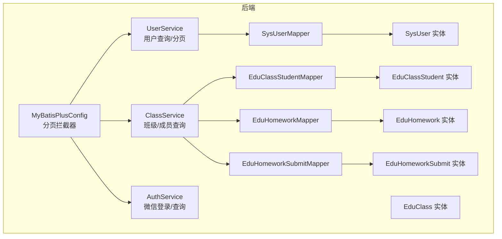
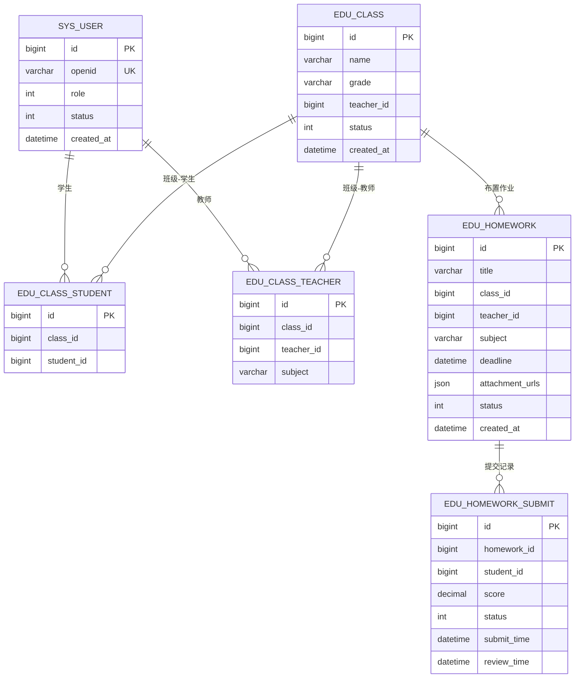
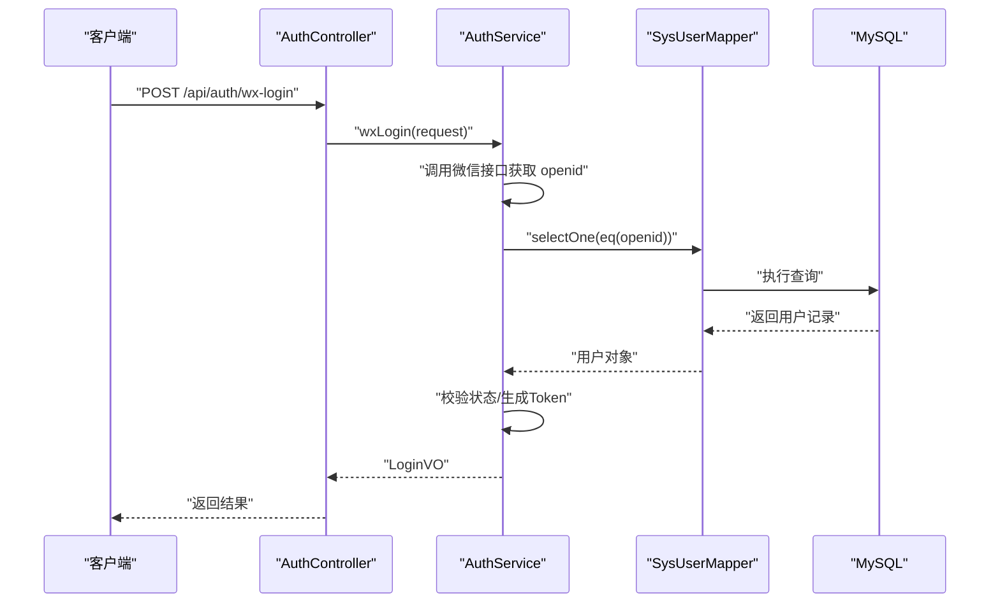
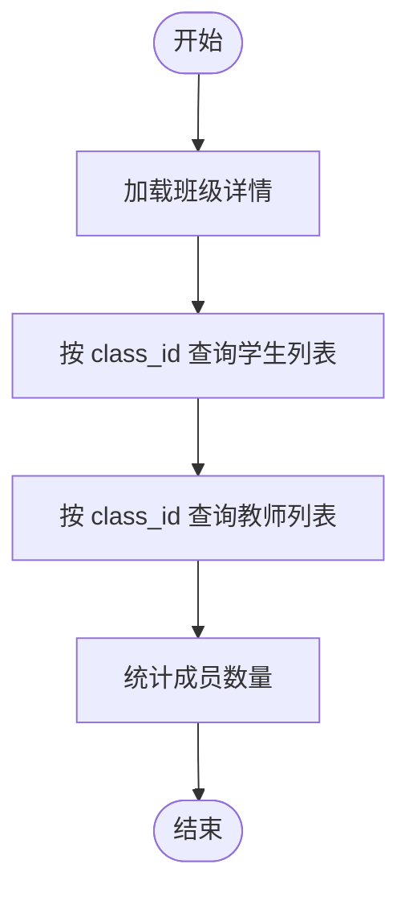
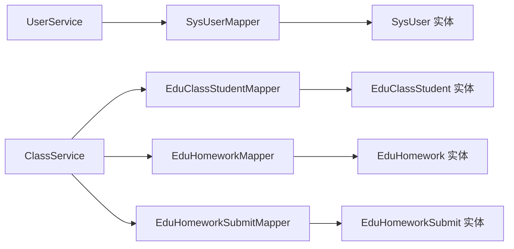

# 索引策略设计

<cite>
**本文引用的文件**
- [schema.sql](file://helenedu-backend/src/main/resources/db/schema.sql)
- [SysUser.java](file://helenedu-backend/src/main/java/com/helen/eduedu/entity/SysUser.java)
- [EduClass.java](file://helenedu-backend/src/main/java/com/helen/eduedu/entity/EduClass.java)
- [EduClassStudent.java](file://helenedu-backend/src/main/java/com/helen/eduedu/entity/EduClassStudent.java)
- [EduHomework.java](file://helenedu-backend/src/main/java/com/helen/eduedu/entity/EduHomework.java)
- [EduHomeworkSubmit.java](file://helenedu-backend/src/main/java/com/helen/eduedu/entity/EduHomeworkSubmit.java)
- [SysUserMapper.java](file://helenedu-backend/src/main/java/com/helen/eduedu/mapper/SysUserMapper.java)
- [EduClassStudentMapper.java](file://helenedu-backend/src/main/java/com/helen/eduedu/mapper/EduClassStudentMapper.java)
- [EduHomeworkMapper.java](file://helenedu-backend/src/main/java/com/helen/eduedu/mapper/EduHomeworkMapper.java)
- [EduHomeworkSubmitMapper.java](file://helenedu-backend/src/main/java/com/helen/eduedu/mapper/EduHomeworkSubmitMapper.java)
- [UserService.java](file://helenedu-backend/src/main/java/com/helen/eduedu/service/UserService.java)
- [ClassService.java](file://helenedu-backend/src/main/java/com/helen/eduedu/service/ClassService.java)
- [AuthService.java](file://helenedu-backend/src/main/java/com/helen/eduedu/service/AuthService.java)
- [MyBatisPlusConfig.java](file://helenedu-backend/src/main/java/com/helen/eduedu/config/MyBatisPlusConfig.java)
</cite>

## 目录
1. [简介](#简介)
2. [项目结构](#项目结构)
3. [核心组件](#核心组件)
4. [架构总览](#架构总览)
5. [详细组件分析](#详细组件分析)
6. [依赖关系分析](#依赖关系分析)
7. [性能考量](#性能考量)
8. [故障排查指南](#故障排查指南)
9. [结论](#结论)
10. [附录](#附录)

## 简介
本策略文档面向 HelenEdu 教育管理系统的数据库索引设计，目标是基于现有表结构与业务查询模式，制定主键索引、唯一索引、复合索引、全文索引与 JSON 字段索引的使用策略，并提供性能评估与维护建议。文档同时结合后端实体类与服务层查询逻辑，确保索引设计与实际业务访问路径高度契合。

## 项目结构
后端采用 Spring Boot + MyBatis-Plus 架构，数据库脚本集中于 schema.sql，实体类位于 entity 包，数据访问层位于 mapper 包，业务服务位于 service 包，配置位于 config 包。整体呈现“按领域分层”的组织方式，便于在各层识别查询热点与索引需求。

图表来源
- [MyBatisPlusConfig.java:1-22](file://helenedu-backend/src/main/java/com/helen/eduedu/config/MyBatisPlusConfig.java#L1-L22)
- [UserService.java:1-130](file://helenedu-backend/src/main/java/com/helen/eduedu/service/UserService.java#L1-L130)
- [ClassService.java:1-262](file://helenedu-backend/src/main/java/com/helen/eduedu/service/ClassService.java#L1-L262)
- [AuthService.java:1-128](file://helenedu-backend/src/main/java/com/helen/eduedu/service/AuthService.java#L1-L128)
- [SysUserMapper.java:1-10](file://helenedu-backend/src/main/java/com/helen/eduedu/mapper/SysUserMapper.java#L1-L10)
- [EduClassStudentMapper.java:1-10](file://helenedu-backend/src/main/java/com/helen/eduedu/mapper/EduClassStudentMapper.java#L1-L10)
- [EduHomeworkMapper.java:1-10](file://helenedu-backend/src/main/java/com/helen/eduedu/mapper/EduHomeworkMapper.java#L1-L10)
- [EduHomeworkSubmitMapper.java:1-10](file://helenedu-backend/src/main/java/com/helen/eduedu/mapper/EduHomeworkSubmitMapper.java#L1-L10)
- [SysUser.java:1-42](file://helenedu-backend/src/main/java/com/helen/eduedu/entity/SysUser.java#L1-L42)
- [EduClass.java:1-36](file://helenedu-backend/src/main/java/com/helen/eduedu/entity/EduClass.java#L1-L36)
- [EduClassStudent.java:1-24](file://helenedu-backend/src/main/java/com/helen/eduedu/entity/EduClassStudent.java#L1-L24)
- [EduHomework.java:1-52](file://helenedu-backend/src/main/java/com/helen/eduedu/entity/EduHomework.java#L1-L52)
- [EduHomeworkSubmit.java:1-52](file://helenedu-backend/src/main/java/com/helen/eduedu/entity/EduHomeworkSubmit.java#L1-L52)

章节来源
- [MyBatisPlusConfig.java:1-22](file://helenedu-backend/src/main/java/com/helen/eduedu/config/MyBatisPlusConfig.java#L1-L22)
- [schema.sql:1-94](file://helenedu-backend/src/main/resources/db/schema.sql#L1-L94)

## 核心组件
- 用户表 sys_user：包含 openid 唯一性约束、角色与状态过滤、关键词检索（姓名/手机）等典型查询。
- 班级表 edu_class：按状态与名称检索、创建时间倒序分页。
- 关联表 edu_class_student 与 edu_class_teacher：分别对 (class_id, student_id)、(class_id, teacher_id) 建立唯一组合索引。
- 作业表 edu_homework：按班级、教师、状态、截止时间等维度查询；JSON 字段存储附件 URL 列表。
- 作业提交表 edu_homework_submit：按作业与学生维度去重，支持评分、状态、时间等查询。
- 预习资料表 edu_preview_material：按班级、教师、状态等维度查询；JSON 字段存储文件 URL 列表。

章节来源
- [schema.sql:5-94](file://helenedu-backend/src/main/resources/db/schema.sql#L5-L94)
- [SysUser.java:1-42](file://helenedu-backend/src/main/java/com/helen/eduedu/entity/SysUser.java#L1-L42)
- [EduClass.java:1-36](file://helenedu-backend/src/main/java/com/helen/eduedu/entity/EduClass.java#L1-L36)
- [EduClassStudent.java:1-24](file://helenedu-backend/src/main/java/com/helen/eduedu/entity/EduClassStudent.java#L1-L24)
- [EduHomework.java:1-52](file://helenedu-backend/src/main/java/com/helen/eduedu/entity/EduHomework.java#L1-L52)
- [EduHomeworkSubmit.java:1-52](file://helenedu-backend/src/main/java/com/helen/eduedu/entity/EduHomeworkSubmit.java#L1-L52)

## 架构总览
下图展示数据库表之间的关系以及与服务层查询的对应关系，有助于确定索引覆盖点与复合索引设计方向。

图表来源
- [schema.sql:5-94](file://helenedu-backend/src/main/resources/db/schema.sql#L5-L94)
- [SysUser.java:1-42](file://helenedu-backend/src/main/java/com/helen/eduedu/entity/SysUser.java#L1-L42)
- [EduClass.java:1-36](file://helenedu-backend/src/main/java/com/helen/eduedu/entity/EduClass.java#L1-L36)
- [EduClassStudent.java:1-24](file://helenedu-backend/src/main/java/com/helen/eduedu/entity/EduClassStudent.java#L1-L24)
- [EduHomework.java:1-52](file://helenedu-backend/src/main/java/com/helen/eduedu/entity/EduHomework.java#L1-L52)
- [EduHomeworkSubmit.java:1-52](file://helenedu-backend/src/main/java/com/helen/eduedu/entity/EduHomeworkSubmit.java#L1-L52)

## 详细组件分析

### 主键索引设计原则与性能影响
- 设计原则
  - 主键必须唯一且非空，保证每行数据可稳定定位。
  - 优先使用自增主键（BIGINT AUTO_INCREMENT），减少页分裂与插入开销。
  - 避免跨表共享同一主键值空间，防止未来扩展时产生冲突。
- 性能影响
  - 主键索引即聚簇索引，读取主键或等值查询具备最佳局部性。
  - 插入成本低，更新主键代价高，应避免频繁变更主键。
  - 复合索引的前导列若为主键，则可显著提升等值/范围查询效率。

章节来源
- [schema.sql:6-94](file://helenedu-backend/src/main/resources/db/schema.sql#L6-L94)

### 唯一索引应用场景
- 用户 openid 唯一性
  - 场景：微信登录绑定 openid，需保证全局唯一。
  - 建议：在 sys_user.openid 上建立唯一索引，保障幂等注册与登录。
- 班级成员组合唯一性
  - 场景：一个学生只能加入一个班级一次，避免重复添加。
  - 建议：edu_class_student(class_id, student_id) 唯一索引；同理 edu_class_teacher(class_id, teacher_id)。
- 作业提交唯一性
  - 场景：同一作业仅允许学生提交一次。
  - 建议：edu_homework_submit(homework_id, student_id) 唯一索引。

章节来源
- [schema.sql:8-8](file://helenedu-backend/src/main/resources/db/schema.sql#L8-L8)
- [schema.sql:34-34](file://helenedu-backend/src/main/resources/db/schema.sql#L34-L34)
- [schema.sql:43-43](file://helenedu-backend/src/main/resources/db/schema.sql#L43-L43)
- [schema.sql:73-73](file://helenedu-backend/src/main/resources/db/schema.sql#L73-L73)

### 复合索引设计策略
- 基于查询频率与选择性的字段组合
  - 用户列表：按角色过滤 + 关键词检索（姓名/电话）+ 创建时间倒序分页。
    - 建议：(role, status) 组合索引，配合 (created_at, id) 辅助分页回表。
  - 班级列表：按状态过滤 + 名称模糊匹配 + 创建时间倒序分页。
    - 建议：(status, name) 组合索引，配合 (created_at, id) 辅助分页。
  - 成员查询：按班级查询学生/教师列表。
    - 建议：(class_id) 单列索引；若频繁按 class_id + 其他条件过滤，再考虑 (class_id, other) 复合索引。
  - 作业查询：按班级/教师/状态/截止时间等多维过滤。
    - 建议：(class_id, status)、(teacher_id, status)、(deadline) 等组合索引，视具体查询比例调整。
  - 作业提交：按作业/学生维度去重，支持评分/状态筛选。
    - 建议：(homework_id, student_id) 唯一索引；(homework_id, status)、(student_id, status) 等辅助索引。
- 范围查询优化
  - 对日期/时间字段（deadline、submit_time、review_time、created_at、updated_at）建立索引时，注意将等值/前缀过滤放在复合索引前列，范围条件尽量放在末尾。
  - 使用分页时，建议以 (created_at, id) 或 (status, created_at) 等作为联合排序键，减少回表与排序成本。

章节来源
- [UserService.java:78-98](file://helenedu-backend/src/main/java/com/helen/eduedu/service/UserService.java#L78-L98)
- [ClassService.java:76-92](file://helenedu-backend/src/main/java/com/helen/eduedu/service/ClassService.java#L76-L92)
- [ClassService.java:108-121](file://helenedu-backend/src/main/java/com/helen/eduedu/service/ClassService.java#L108-L121)
- [ClassService.java:158-172](file://helenedu-backend/src/main/java/com/helen/eduedu/service/ClassService.java#L158-L172)
- [ClassService.java:209-233](file://helenedu-backend/src/main/java/com/helen/eduedu/service/ClassService.java#L209-L233)
- [EduHomework.java:38-46](file://helenedu-backend/src/main/java/com/helen/eduedu/entity/EduHomework.java#L38-L46)
- [EduHomeworkSubmit.java:37-44](file://helenedu-backend/src/main/java/com/helen/eduedu/entity/EduHomeworkSubmit.java#L37-L44)

### 全文索引与 JSON 字段索引
- 全文索引
  - 适用：对文本内容进行自然语言检索（如作业内容、预习资料描述、用户备注等）。
  - 建议：在需要全文检索的文本字段上建立全文索引；若 MySQL 版本不支持或性能不佳，可考虑外部搜索引擎（如 Elasticsearch）。
- JSON 字段索引
  - 适用：对 JSON 数组/对象中的键进行查询（如附件 URL 列表）。
  - 建议：MySQL 8.0+ 支持虚拟列 + 函数索引，可将 JSON 中常用键提取为虚拟列并建立普通索引；或在应用层进行规范化存储以获得更佳查询性能。

章节来源
- [EduHomework.java:42-43](file://helenedu-backend/src/main/java/com/helen/eduedu/entity/EduHomework.java#L42-L43)
- [EduHomeworkSubmit.java:34-35](file://helenedu-backend/src/main/java/com/helen/eduedu/entity/EduHomeworkSubmit.java#L34-L35)
- [EduPreviewMaterial.java:84-84](file://helenedu-backend/src/main/java/com/helen/eduedu/entity/EduPreviewMaterial.java#L84-L84)

### 认证流程与索引关联
微信登录流程涉及 openid 等值查询，需确保 sys_user.openid 唯一索引命中，避免全表扫描。

图表来源
- [AuthService.java:42-82](file://helenedu-backend/src/main/java/com/helen/eduedu/service/AuthService.java#L42-L82)
- [SysUserMapper.java:1-10](file://helenedu-backend/src/main/java/com/helen/eduedu/mapper/SysUserMapper.java#L1-L10)
- [schema.sql:8-8](file://helenedu-backend/src/main/resources/db/schema.sql#L8-L8)

### 班级成员查询与索引
班级成员查询涉及多次等值/单表查询，建议在关联表上建立合适的单列/复合索引以降低 N+1 查询成本。

图表来源
- [ClassService.java:108-121](file://helenedu-backend/src/main/java/com/helen/eduedu/service/ClassService.java#L108-L121)
- [ClassService.java:158-172](file://helenedu-backend/src/main/java/com/helen/eduedu/service/ClassService.java#L158-L172)
- [ClassService.java:209-233](file://helenedu-backend/src/main/java/com/helen/eduedu/service/ClassService.java#L209-L233)

## 依赖关系分析
- 服务层依赖 Mapper 层，Mapper 层依赖实体类与数据库表结构。
- 查询条件主要来自服务层的 LambdaQueryWrapper，索引设计需围绕这些条件构建。
- MyBatis-Plus 的分页插件对排序与回表有直接影响，需配合合适的索引组合。

图表来源
- [UserService.java:1-130](file://helenedu-backend/src/main/java/com/helen/eduedu/service/UserService.java#L1-L130)
- [ClassService.java:1-262](file://helenedu-backend/src/main/java/com/helen/eduedu/service/ClassService.java#L1-L262)
- [SysUserMapper.java:1-10](file://helenedu-backend/src/main/java/com/helen/eduedu/mapper/SysUserMapper.java#L1-L10)
- [EduClassStudentMapper.java:1-10](file://helenedu-backend/src/main/java/com/helen/eduedu/mapper/EduClassStudentMapper.java#L1-L10)
- [EduHomeworkMapper.java:1-10](file://helenedu-backend/src/main/java/com/helen/eduedu/mapper/EduHomeworkMapper.java#L1-L10)
- [EduHomeworkSubmitMapper.java:1-10](file://helenedu-backend/src/main/java/com/helen/eduedu/mapper/EduHomeworkSubmitMapper.java#L1-L10)

章节来源
- [MyBatisPlusConfig.java:1-22](file://helenedu-backend/src/main/java/com/helen/eduedu/config/MyBatisPlusConfig.java#L1-L22)

## 性能考量
- 查询计划分析
  - 使用 EXPLAIN 分析关键 SQL 的执行计划，关注是否使用到预期索引、是否存在全表扫描、回表次数与排序成本。
  - 对于分页查询，优先使用覆盖索引或 (排序键, 主键) 组合，减少回表与额外排序。
- 索引选择性
  - 选择性越高（基数/唯一值越多）的索引收益越大；对低选择性的字段（如 status）建立复合索引时，需将高选择性字段置于前列。
- 统计信息与直方图
  - 定期更新表与索引统计信息，确保优化器能做出合理执行计划选择。
- 写入与读取权衡
  - 频繁写入的表不宜过多索引，应根据读写比例与热点查询进行精简与合并。

## 故障排查指南
- 登录缓慢
  - 检查 sys_user.openid 是否命中唯一索引；确认微信接口调用与用户状态校验未成为瓶颈。
- 班级/成员查询慢
  - 检查 edu_class_student 与 edu_class_teacher 的索引是否满足等值查询；必要时增加 (class_id) 或 (class_id, other) 复合索引。
- 作业/提交查询慢
  - 检查 (class_id, status)、(teacher_id, status)、(homework_id, student_id) 等索引是否覆盖常用过滤条件。
- 分页错乱或慢
  - 确认分页查询是否使用了合适的排序键与覆盖索引，避免大偏移量分页导致的性能问题。

章节来源
- [AuthService.java:42-82](file://helenedu-backend/src/main/java/com/helen/eduedu/service/AuthService.java#L42-L82)
- [ClassService.java:108-121](file://helenedu-backend/src/main/java/com/helen/eduedu/service/ClassService.java#L108-L121)
- [ClassService.java:158-172](file://helenedu-backend/src/main/java/com/helen/eduedu/service/ClassService.java#L158-L172)
- [ClassService.java:209-233](file://helenedu-backend/src/main/java/com/helen/eduedu/service/ClassService.java#L209-L233)
- [MyBatisPlusConfig.java:15-20](file://helenedu-backend/src/main/java/com/helen/eduedu/config/MyBatisPlusConfig.java#L15-L20)

## 结论
HelenEdu 的索引设计应围绕“主键稳定、唯一约束明确、复合索引覆盖高频查询、JSON/全文检索按需引入”展开。结合服务层查询模式与数据库脚本，优先保障登录、用户列表、班级列表与成员查询的性能，随后针对作业与提交场景细化复合索引组合，最终通过 EXPLAIN 与统计信息持续优化。

## 附录
- 最佳实践
  - 保持主键自增且稳定，避免跨表共享主键空间。
  - 唯一索引优先保障业务幂等，如 openid、成员组合、提交组合。
  - 复合索引遵循“高选择性前置、等值优先、范围靠后”的原则。
  - 分页查询使用“排序键+主键”的覆盖索引，避免大偏移量。
  - JSON 字段优先考虑虚拟列+函数索引或规范化存储。
- 常见陷阱
  - 过度索引导致写入性能下降。
  - 忽略统计信息更新，导致执行计划退化。
  - 将范围条件放在复合索引前列，导致前缀索引失效。
  - 在低选择性字段上建立过多索引，浪费存储与IO。