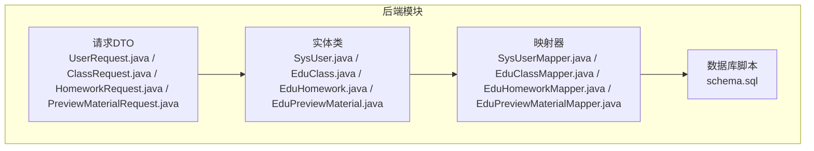
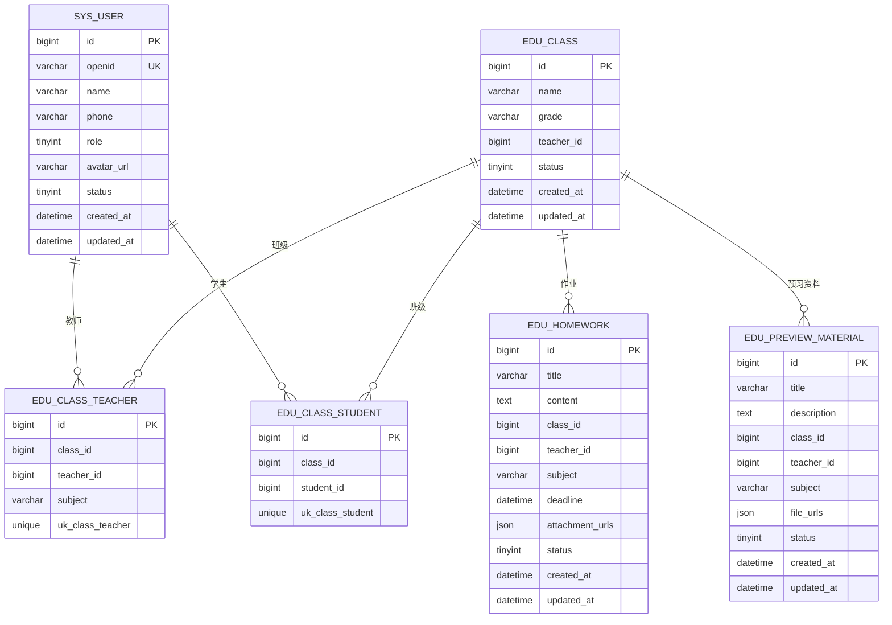
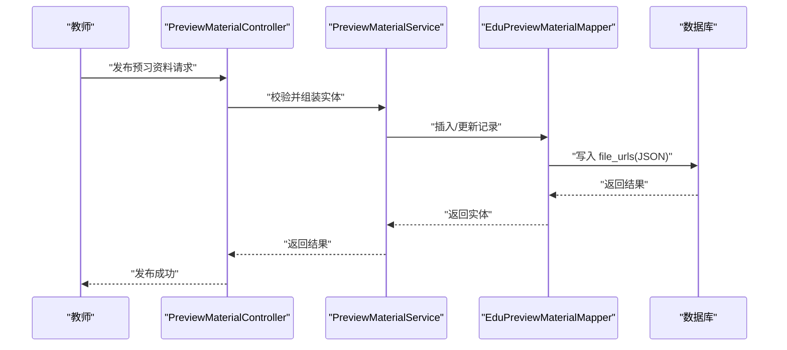
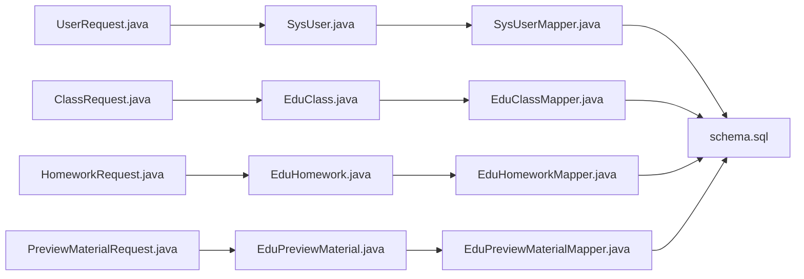

# 表结构设计

<cite>
**本文档引用的文件**
- [SysUser.java](file://helenedu-backend/src/main/java/com/helen/eduedu/entity/SysUser.java)
- [EduClass.java](file://helenedu-backend/src/main/java/com/helen/eduedu/entity/EduClass.java)
- [EduHomework.java](file://helenedu-backend/src/main/java/com/helen/eduedu/entity/EduHomework.java)
- [EduPreviewMaterial.java](file://helenedu-backend/src/main/java/com/helen/eduedu/entity/EduPreviewMaterial.java)
- [schema.sql](file://helenedu-backend/src/main/resources/db/schema.sql)
- [SysUserMapper.java](file://helenedu-backend/src/main/java/com/helen/eduedu/mapper/SysUserMapper.java)
- [EduClassMapper.java](file://helenedu-backend/src/main/java/com/helen/eduedu/mapper/EduClassMapper.java)
- [EduHomeworkMapper.java](file://helenedu-backend/src/main/java/com/helen/eduedu/mapper/EduHomeworkMapper.java)
- [EduPreviewMaterialMapper.java](file://helenedu-backend/src/main/java/com/helen/eduedu/mapper/EduPreviewMaterialMapper.java)
- [UserRequest.java](file://helenedu-backend/src/main/java/com/helen/eduedu/dto/UserRequest.java)
- [ClassRequest.java](file://helenedu-backend/src/main/java/com/helen/eduedu/dto/ClassRequest.java)
- [HomeworkRequest.java](file://helenedu-backend/src/main/java/com/helen/eduedu/dto/HomeworkRequest.java)
- [PreviewMaterialRequest.java](file://helenedu-backend/src/main/java/com/helen/eduedu/dto/PreviewMaterialRequest.java)
</cite>

## 目录
1. [简介](#简介)
2. [项目结构](#项目结构)
3. [核心组件](#核心组件)
4. [架构总览](#架构总览)
5. [详细组件分析](#详细组件分析)
6. [依赖分析](#依赖分析)
7. [性能考虑](#性能考虑)
8. [故障排除指南](#故障排除指南)
9. [结论](#结论)

## 简介
本文件针对 HelenEdu 核心业务表进行系统性的结构设计文档编制，重点覆盖以下四张表：
- sys_user 用户表：承载系统用户信息与角色权限
- edu_class 班级表：记录教学班级的基本信息与状态
- edu_homework 作业表：记录作业发布、截止时间与附件信息
- edu_preview_material 预习资料表：记录预习资料的标题、描述与文件列表

文档从字段定义、数据类型选择、约束条件、设计意图与业务含义、JSON 字段使用场景、状态字段与时间戳字段作用、字段长度与精度选择依据、以及未来扩展性等方面进行全面阐述，并结合实体类、映射器与请求 DTO 的实现进行交叉验证。

## 项目结构
后端采用 Spring Boot + MyBatis-Plus 架构，核心业务表位于数据库脚本中，实体类通过注解映射到对应表，Mapper 接口继承基础 Mapper 实现通用 CRUD 操作；请求 DTO 用于参数校验与传输。

图表来源
- [SysUser.java:1-42](file://helenedu-backend/src/main/java/com/helen/eduedu/entity/SysUser.java#L1-L42)
- [EduClass.java:1-36](file://helenedu-backend/src/main/java/com/helen/eduedu/entity/EduClass.java#L1-L36)
- [EduHomework.java:1-52](file://helenedu-backend/src/main/java/com/helen/eduedu/entity/EduHomework.java#L1-L52)
- [EduPreviewMaterial.java:1-49](file://helenedu-backend/src/main/java/com/helen/eduedu/entity/EduPreviewMaterial.java#L1-L49)
- [SysUserMapper.java:1-10](file://helenedu-backend/src/main/java/com/helen/eduedu/mapper/SysUserMapper.java#L1-L10)
- [EduClassMapper.java:1-10](file://helenedu-backend/src/main/java/com/helen/eduedu/mapper/EduClassMapper.java#L1-L10)
- [EduHomeworkMapper.java:1-10](file://helenedu-backend/src/main/java/com/helen/eduedu/mapper/EduHomeworkMapper.java#L1-L10)
- [EduPreviewMaterialMapper.java:1-10](file://helenedu-backend/src/main/java/com/helen/eduedu/mapper/EduPreviewMaterialMapper.java#L1-L10)
- [schema.sql:1-94](file://helenedu-backend/src/main/resources/db/schema.sql#L1-L94)

章节来源
- [schema.sql:1-94](file://helenedu-backend/src/main/resources/db/schema.sql#L1-L94)

## 核心组件
本节概述四张核心表的总体职责与关键字段，便于快速建立整体认知。

- sys_user 用户表：存储用户基本信息、角色与状态，支持微信 openid 绑定与统一的创建/更新时间戳。
- edu_class 班级表：记录班级名称、年级、班主任与状态，配合关联表实现多对多关系。
- edu_homework 作业表：记录作业标题、内容、所属班级与教师、科目、截止时间、附件列表与状态。
- edu_preview_material 预习资料表：记录资料标题、描述、所属班级与教师、科目、文件列表与状态。

章节来源
- [SysUser.java:10-41](file://helenedu-backend/src/main/java/com/helen/eduedu/entity/SysUser.java#L10-L41)
- [EduClass.java:10-35](file://helenedu-backend/src/main/java/com/helen/eduedu/entity/EduClass.java#L10-L35)
- [EduHomework.java:13-51](file://helenedu-backend/src/main/java/com/helen/eduedu/entity/EduHomework.java#L13-L51)
- [EduPreviewMaterial.java:13-48](file://helenedu-backend/src/main/java/com/helen/eduedu/entity/EduPreviewMaterial.java#L13-L48)

## 架构总览
下图展示四张核心表之间的关系与外键约束，以及与关联表的关系。

图表来源
- [schema.sql:5-94](file://helenedu-backend/src/main/resources/db/schema.sql#L5-L94)

章节来源
- [schema.sql:5-94](file://helenedu-backend/src/main/resources/db/schema.sql#L5-L94)

## 详细组件分析

### sys_user 用户表
- 主键设计：自增 BIGINT 主键 id，确保全局唯一性与高并发下的可扩展性。
- 字段定义与约束：
  - openid：VARCHAR(64)，UNIQUE，用于微信第三方登录绑定，避免重复绑定。
  - name：VARCHAR(50)，NOT NULL，存储用户真实姓名。
  - phone：VARCHAR(20)，可选，存储手机号码。
  - role：TINYINT，NOT NULL，枚举值 1-学生、2-教师、3-管理员。
  - avatar_url：VARCHAR(255)，可选，头像图片访问地址。
  - status：TINYINT，默认 1，枚举值 0-禁用、1-启用。
  - created_at、updated_at：DATETIME，默认 CURRENT_TIMESTAMP，自动维护创建与更新时间。
- 设计意图与业务含义：
  - openid 唯一性保证用户在系统中的唯一身份标识，便于后续微信授权与登录流程。
  - role 字段支撑基于角色的权限控制，配合安全拦截器使用。
  - status 字段支持用户生命周期管理，便于封禁或恢复操作。
- JSON 字段使用场景：当前用户表不包含 JSON 字段。
- 时间戳字段作用：created_at/updated_at 提供审计与排序能力，便于按时间维度查询与统计。
- 字段长度与精度选择依据：
  - openid 64 字符满足常见第三方平台标识长度。
  - name 50 字符覆盖中文姓名常见长度。
  - phone 20 字符兼容国际号码格式。
  - avatar_url 255 字符满足常见 URL 长度。
  - role 使用 TINYINT 存储枚举，节省空间且便于比较。
- 未来扩展考虑：
  - 可增加 last_login_at 记录最近登录时间，便于活跃度统计。
  - 可增加 deleted_at 支持软删除，配合 status 实现更灵活的状态管理。

章节来源
- [schema.sql:5-16](file://helenedu-backend/src/main/resources/db/schema.sql#L5-L16)
- [SysUser.java:10-41](file://helenedu-backend/src/main/java/com/helen/eduedu/entity/SysUser.java#L10-L41)

### edu_class 班级表
- 主键设计：自增 BIGINT 主键 id。
- 字段定义与约束：
  - name：VARCHAR(100)，NOT NULL，班级名称。
  - grade：VARCHAR(50)，可选，年级信息。
  - teacher_id：BIGINT，可选，班主任用户 ID，作为外键关联 sys_user。
  - status：TINYINT，默认 1，枚举值 0-解散、1-正常。
  - created_at、updated_at：DATETIME 默认值与自动更新。
- 设计意图与业务含义：
  - teacher_id 作为可选字段，允许在未分配班主任时保持数据完整性。
  - status 字段支持班级生命周期管理，解散后不再参与新业务流程。
- JSON 字段使用场景：当前班级表不包含 JSON 字段。
- 时间戳字段作用：同上，提供审计与排序能力。
- 字段长度与精度选择依据：
  - name 100 字符满足常见学校命名规范。
  - grade 50 字符支持多级年级描述。
- 未来扩展考虑：
  - 可增加 school_id 外键指向学校表，支持多校区管理。
  - 可增加 academic_year 字段记录学年信息。

章节来源
- [schema.sql:18-27](file://helenedu-backend/src/main/resources/db/schema.sql#L18-L27)
- [EduClass.java:10-35](file://helenedu-backend/src/main/java/com/helen/eduedu/entity/EduClass.java#L10-L35)

### edu_homework 作业表
- 主键设计：自增 BIGINT 主键 id。
- 字段定义与约束：
  - title：VARCHAR(200)，NOT NULL，作业标题。
  - content：TEXT，可选，作业内容或要求说明。
  - class_id：BIGINT，NOT NULL，所属班级，外键关联 edu_class。
  - teacher_id：BIGINT，NOT NULL，布置教师，外键关联 sys_user。
  - subject：VARCHAR(50)，可选，科目。
  - deadline：DATETIME，可选，截止时间。
  - attachment_urls：JSON，存储附件 URL 列表，使用 JacksonTypeHandler 进行序列化/反序列化。
  - status：TINYINT，默认 1，枚举值 0-草稿、1-已发布、2-已截止。
  - created_at、updated_at：DATETIME 默认值与自动更新。
- 设计意图与业务含义：
  - attachment_urls 以 JSON 存储多附件 URL，简化多文件管理，便于前端直接渲染。
  - status 字段支持作业生命周期管理，结合 deadline 自动推进状态。
- JSON 字段使用场景：
  - 通过 MyBatis-Plus 的 JacksonTypeHandler 将 List<String> 序列化为 JSON 存储，读取时反序列化为 Java 对象，避免额外的中间表。
- 时间戳字段作用：提供作业创建与更新时间，便于排序与统计。
- 字段长度与精度选择依据：
  - title 200 字符满足常见作业标题长度。
  - content 使用 TEXT 支持较长的作业描述。
  - subject 50 字符支持常见学科名称。
- 未来扩展考虑：
  - 可增加 publish_time 字段记录发布时间，区分创建与发布。
  - 可增加 repeat_type 字段支持重复性作业（如每日/每周）。

图表来源
- [EduHomework.java:13-51](file://helenedu-backend/src/main/java/com/helen/eduedu/entity/EduHomework.java#L13-L51)
- [schema.sql:46-59](file://helenedu-backend/src/main/resources/db/schema.sql#L46-L59)

章节来源
- [EduHomework.java:13-51](file://helenedu-backend/src/main/java/com/helen/eduedu/entity/EduHomework.java#L13-L51)
- [schema.sql:46-59](file://helenedu-backend/src/main/resources/db/schema.sql#L46-L59)

### edu_preview_material 预习资料表
- 主键设计：自增 BIGINT 主键 id。
- 字段定义与约束：
  - title：VARCHAR(200)，NOT NULL，资料标题。
  - description：TEXT，可选，资料描述。
  - class_id：BIGINT，NOT NULL，所属班级，外键关联 edu_class。
  - teacher_id：BIGINT，NOT NULL，发布教师，外键关联 sys_user。
  - subject：VARCHAR(50)，可选，科目。
  - file_urls：JSON，存储文件 URL 列表，使用 JacksonTypeHandler。
  - status：TINYINT，默认 1，枚举值 0-下架、1-发布。
  - created_at、updated_at：DATETIME 默认值与自动更新。
- 设计意图与业务含义：
  - file_urls 以 JSON 存储多文件 URL，便于资料的多附件管理与前端展示。
  - status 字段支持资料的上下线管理。
- JSON 字段使用场景：
  - 同作业表，通过 JacksonTypeHandler 实现 List<String> 与 JSON 的双向转换。
- 时间戳字段作用：提供资料创建与更新时间，便于排序与统计。
- 字段长度与精度选择依据：
  - title 200 字符满足常见资料标题长度。
  - description 使用 TEXT 支持较长的描述信息。
  - subject 50 字符支持常见学科名称。
- 未来扩展考虑：
  - 可增加 category 字段支持资料分类（如课件、视频、文档）。
  - 可增加 download_count 字段统计下载次数。

图表来源
- [EduPreviewMaterial.java:13-48](file://helenedu-backend/src/main/java/com/helen/eduedu/entity/EduPreviewMaterial.java#L13-L48)
- [schema.sql:76-88](file://helenedu-backend/src/main/resources/db/schema.sql#L76-L88)

章节来源
- [EduPreviewMaterial.java:13-48](file://helenedu-backend/src/main/java/com/helen/eduedu/entity/EduPreviewMaterial.java#L13-L48)
- [schema.sql:76-88](file://helenedu-backend/src/main/resources/db/schema.sql#L76-L88)

## 依赖分析
- 实体类与数据库表映射：
  - 实体类通过 @TableName 注解与数据库表名一一对应，主键通过 @TableId 定义。
  - JSON 字段通过 @TableField(typeHandler = JacksonTypeHandler.class) 映射。
- 映射器与通用 CRUD：
  - Mapper 接口继承 BaseMapper，自动获得标准 CRUD 能力，减少样板代码。
- 请求 DTO 与参数校验：
  - DTO 类使用 Jakarta Bean Validation 注解进行参数校验，确保输入数据的有效性。
- 关联关系与外键：
  - 班级表与用户表通过 teacher_id 建立一对多关系。
  - 作业表与预习资料表均通过 class_id 与 teacher_id 与班级和用户建立关联。
  - 关联表 edu_class_student 与 edu_class_teacher 实现班级与学生、教师的多对多关系。

图表来源
- [SysUser.java:1-42](file://helenedu-backend/src/main/java/com/helen/eduedu/entity/SysUser.java#L1-L42)
- [EduClass.java:1-36](file://helenedu-backend/src/main/java/com/helen/eduedu/entity/EduClass.java#L1-L36)
- [EduHomework.java:1-52](file://helenedu-backend/src/main/java/com/helen/eduedu/entity/EduHomework.java#L1-L52)
- [EduPreviewMaterial.java:1-49](file://helenedu-backend/src/main/java/com/helen/eduedu/entity/EduPreviewMaterial.java#L1-L49)
- [SysUserMapper.java:1-10](file://helenedu-backend/src/main/java/com/helen/eduedu/mapper/SysUserMapper.java#L1-L10)
- [EduClassMapper.java:1-10](file://helenedu-backend/src/main/java/com/helen/eduedu/mapper/EduClassMapper.java#L1-L10)
- [EduHomeworkMapper.java:1-10](file://helenedu-backend/src/main/java/com/helen/eduedu/mapper/EduHomeworkMapper.java#L1-L10)
- [EduPreviewMaterialMapper.java:1-10](file://helenedu-backend/src/main/java/com/helen/eduedu/mapper/EduPreviewMaterialMapper.java#L1-L10)
- [UserRequest.java:1-23](file://helenedu-backend/src/main/java/com/helen/eduedu/dto/UserRequest.java#L1-L23)
- [ClassRequest.java:1-19](file://helenedu-backend/src/main/java/com/helen/eduedu/dto/ClassRequest.java#L1-L19)
- [HomeworkRequest.java:1-33](file://helenedu-backend/src/main/java/com/helen/eduedu/dto/HomeworkRequest.java#L1-L33)
- [PreviewMaterialRequest.java:1-30](file://helenedu-backend/src/main/java/com/helen/eduedu/dto/PreviewMaterialRequest.java#L1-L30)
- [schema.sql:1-94](file://helenedu-backend/src/main/resources/db/schema.sql#L1-L94)

章节来源
- [SysUser.java:1-42](file://helenedu-backend/src/main/java/com/helen/eduedu/entity/SysUser.java#L1-L42)
- [EduClass.java:1-36](file://helenedu-backend/src/main/java/com/helen/eduedu/entity/EduClass.java#L1-L36)
- [EduHomework.java:1-52](file://helenedu-backend/src/main/java/com/helen/eduedu/entity/EduHomework.java#L1-L52)
- [EduPreviewMaterial.java:1-49](file://helenedu-backend/src/main/java/com/helen/eduedu/entity/EduPreviewMaterial.java#L1-L49)
- [SysUserMapper.java:1-10](file://helenedu-backend/src/main/java/com/helen/eduedu/mapper/SysUserMapper.java#L1-L10)
- [EduClassMapper.java:1-10](file://helenedu-backend/src/main/java/com/helen/eduedu/mapper/EduClassMapper.java#L1-L10)
- [EduHomeworkMapper.java:1-10](file://helenedu-backend/src/main/java/com/helen/eduedu/mapper/EduHomeworkMapper.java#L1-L10)
- [EduPreviewMaterialMapper.java:1-10](file://helenedu-backend/src/main/java/com/helen/eduedu/mapper/EduPreviewMaterialMapper.java#L1-L10)
- [UserRequest.java:1-23](file://helenedu-backend/src/main/java/com/helen/eduedu/dto/UserRequest.java#L1-L23)
- [ClassRequest.java:1-19](file://helenedu-backend/src/main/java/com/helen/eduedu/dto/ClassRequest.java#L1-L19)
- [HomeworkRequest.java:1-33](file://helenedu-backend/src/main/java/com/helen/eduedu/dto/HomeworkRequest.java#L1-L33)
- [PreviewMaterialRequest.java:1-30](file://helenedu-backend/src/main/java/com/helen/eduedu/dto/PreviewMaterialRequest.java#L1-L30)
- [schema.sql:1-94](file://helenedu-backend/src/main/resources/db/schema.sql#L1-L94)

## 性能考虑
- 索引与唯一性：
  - sys_user.openid 唯一索引，保障微信登录绑定的唯一性与查询效率。
  - edu_class_student 与 edu_class_teacher 的联合唯一索引，避免重复添加成员。
- JSON 字段的权衡：
  - JSON 字段简化了多附件管理，但不利于复杂查询与统计，建议仅用于简单列表存储与前端直读场景。
- 时间戳字段：
  - created_at/updated_at 的默认值与自动更新机制，减少应用层逻辑，提升一致性与可维护性。
- 字段长度与精度：
  - 采用适中的长度与精度，兼顾存储成本与业务需求，避免过度冗余。

## 故障排除指南
- JSON 字段序列化失败：
  - 确认实体类字段使用 @TableField(typeHandler = JacksonTypeHandler.class) 注解。
  - 确认数据库列类型为 JSON，避免使用 TEXT 或 LONGTEXT 导致序列化异常。
- 外键约束错误：
  - 班级/教师不存在时，插入作业或预习资料会触发外键约束错误，需先确保关联数据存在。
- 唯一性冲突：
  - openid 冲突会导致插入失败，需检查是否重复绑定。
  - 班级与成员/教师的唯一组合冲突，需检查重复添加问题。

章节来源
- [EduHomework.java:42-43](file://helenedu-backend/src/main/java/com/helen/eduedu/entity/EduHomework.java#L42-L43)
- [EduPreviewMaterial.java:39-40](file://helenedu-backend/src/main/java/com/helen/eduedu/entity/EduPreviewMaterial.java#L39-L40)
- [schema.sql:55-55](file://helenedu-backend/src/main/resources/db/schema.sql#L55-L55)
- [schema.sql:84-84](file://helenedu-backend/src/main/resources/db/schema.sql#L84-L84)

## 结论
本设计文档基于实体类、数据库脚本与请求 DTO 的实现，系统性梳理了 HelenEdu 核心业务表的结构与约束。通过合理的字段设计、数据类型选择与约束配置，实现了清晰的业务语义表达与良好的扩展性。JSON 字段的引入提升了多附件管理的灵活性，同时需要注意其在复杂查询方面的局限性。未来可在时间维度、状态机演进与多校区支持方面进一步完善。