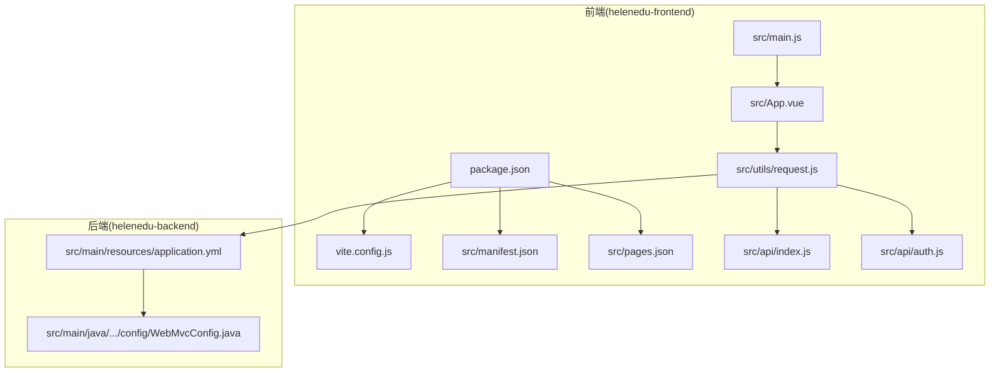
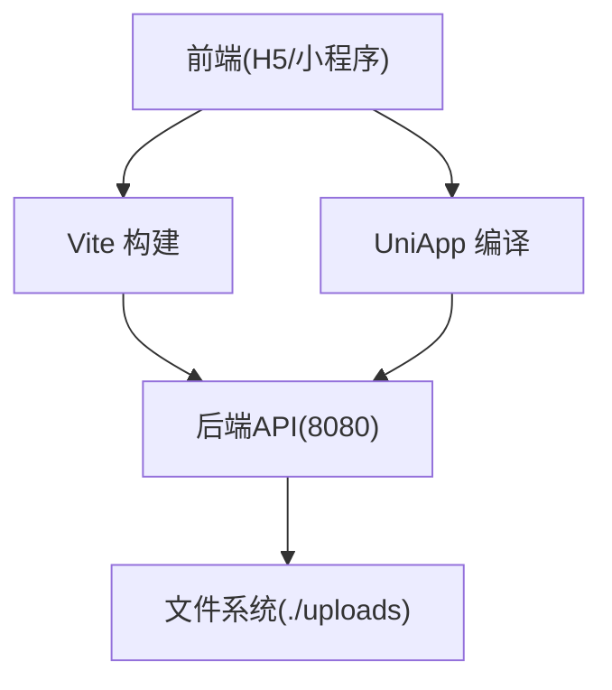
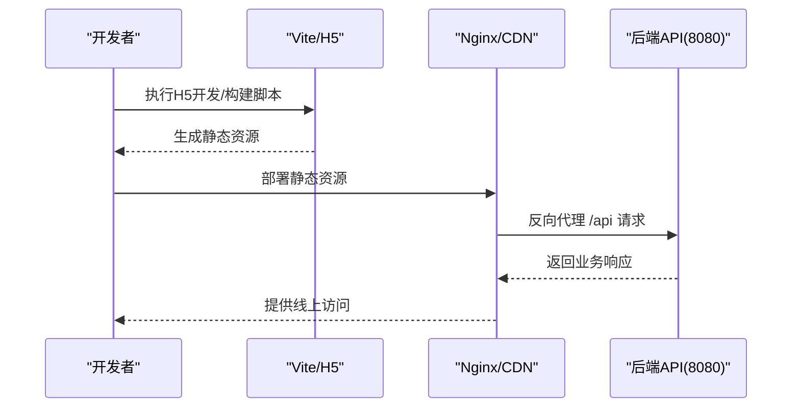
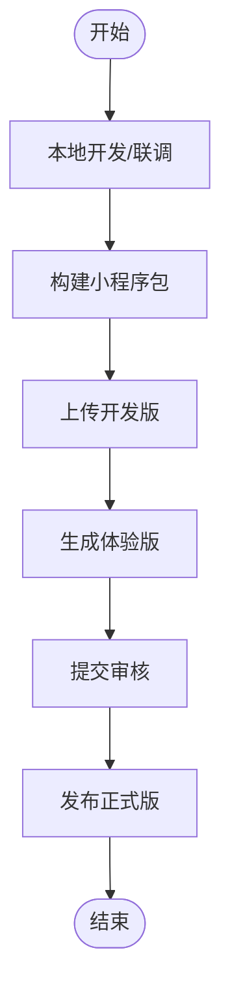
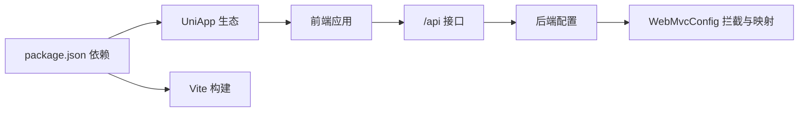

# 前端部署

<cite>
**本文引用的文件**
- [vite.config.js](file://helenedu-frontend/vite.config.js)
- [package.json](file://helenedu-frontend/package.json)
- [manifest.json](file://helenedu-frontend/src/manifest.json)
- [pages.json](file://helenedu-frontend/src/pages.json)
- [main.js](file://helenedu-frontend/src/main.js)
- [App.vue](file://helenedu-frontend/src/App.vue)
- [request.js](file://helenedu-frontend/src/utils/request.js)
- [auth.js](file://helenedu-frontend/src/api/auth.js)
- [index.js](file://helenedu-frontend/src/api/index.js)
- [WebMvcConfig.java](file://helenedu-backend/src/main/java/com/helen/eduedu/config/WebMvcConfig.java)
- [application.yml](file://helenedu-backend/src/main/resources/application.yml)
- [README.md](file://README.md)
</cite>

## 目录
1. [简介](#简介)
2. [项目结构](#项目结构)
3. [核心组件](#核心组件)
4. [架构总览](#架构总览)
5. [详细组件分析](#详细组件分析)
6. [依赖分析](#依赖分析)
7. [性能考虑](#性能考虑)
8. [故障排查指南](#故障排查指南)
9. [结论](#结论)
10. [附录](#附录)

## 简介
本指南面向HelenEdu项目的前端部署与上线，覆盖以下内容：
- Vue.js（基于UniApp）应用的构建与多端编译配置（小程序、H5）
- Vite构建配置与静态资源优化、代码分割策略
- 静态资源服务器（Nginx）配置要点、CDN部署与缓存策略
- 微信小程序发布流程（开发版上传、体验版发布、正式版提交审核）
- 前端性能优化（资源压缩、懒加载、预加载）
- 错误监控与用户行为分析的集成建议

## 项目结构
前端采用UniApp框架，使用Vite作为构建工具，通过脚本实现多端编译。后端为Spring Boot应用，默认监听8080端口，提供REST API与文件上传服务。

图表来源
- [vite.config.js:1-7](file://helenedu-frontend/vite.config.js#L1-L7)
- [package.json:1-28](file://helenedu-frontend/package.json#L1-L28)
- [manifest.json:1-34](file://helenedu-frontend/src/manifest.json#L1-L34)
- [pages.json:1-112](file://helenedu-frontend/src/pages.json#L1-L112)
- [main.js:1-11](file://helenedu-frontend/src/main.js#L1-L11)
- [App.vue:1-104](file://helenedu-frontend/src/App.vue#L1-L104)
- [request.js:1-83](file://helenedu-frontend/src/utils/request.js#L1-L83)
- [index.js:1-50](file://helenedu-frontend/src/api/index.js#L1-L50)
- [auth.js:1-8](file://helenedu-frontend/src/api/auth.js#L1-L8)
- [application.yml:1-58](file://helenedu-backend/src/main/resources/application.yml#L1-L58)
- [WebMvcConfig.java:1-39](file://helenedu-backend/src/main/java/com/helen/eduedu/config/WebMvcConfig.java#L1-L39)

章节来源
- [README.md:1-3](file://README.md#L1-L3)
- [package.json:1-28](file://helenedu-frontend/package.json#L1-L28)

## 核心组件
- 构建与多端编译：通过Vite插件与UniApp CLI实现，支持小程序与H5双端构建。
- 应用入口与状态：Vue应用入口与Pinia状态管理初始化。
- 页面路由与TabBar：统一在pages.json中声明页面与导航样式。
- 配置中心：manifest.json集中管理小程序与H5端差异化配置，含开发服务器代理。
- 请求封装：统一的HTTP客户端，内置鉴权头、错误处理与上传能力。
- 后端接口：Spring Boot提供认证、作业、班级、用户、看板等REST接口，并映射文件上传目录。

章节来源
- [vite.config.js:1-7](file://helenedu-frontend/vite.config.js#L1-L7)
- [package.json:6-11](file://helenedu-frontend/package.json#L6-L11)
- [main.js:1-11](file://helenedu-frontend/src/main.js#L1-L11)
- [pages.json:1-112](file://helenedu-frontend/src/pages.json#L1-L112)
- [manifest.json:1-34](file://helenedu-frontend/src/manifest.json#L1-L34)
- [request.js:1-83](file://helenedu-frontend/src/utils/request.js#L1-L83)
- [application.yml:1-58](file://helenedu-backend/src/main/resources/application.yml#L1-L58)
- [WebMvcConfig.java:1-39](file://helenedu-backend/src/main/java/com/helen/eduedu/config/WebMvcConfig.java#L1-L39)

## 架构总览
前端通过UniApp在不同目标平台生成对应代码；H5端通过Vite构建，小程序端通过UniApp编译。请求统一走后端API，文件上传经由后端映射目录提供访问。

图表来源
- [package.json:6-11](file://helenedu-frontend/package.json#L6-L11)
- [manifest.json:19-32](file://helenedu-frontend/src/manifest.json#L19-L32)
- [application.yml:43-46](file://helenedu-backend/src/main/resources/application.yml#L43-L46)
- [WebMvcConfig.java:33-38](file://helenedu-backend/src/main/java/com/helen/eduedu/config/WebMvcConfig.java#L33-L38)

## 详细组件分析

### Vite构建与插件配置
- 插件：使用@uni/vite-plugin-uni启用UniApp多端编译。
- 脚本：通过uni命令分别执行H5与小程序的开发与构建。
- 优化：可扩展Vite配置以引入压缩、资源内联、产物分析等策略（见“性能考虑”）。

章节来源
- [vite.config.js:1-7](file://helenedu-frontend/vite.config.js#L1-L7)
- [package.json:6-11](file://helenedu-frontend/package.json#L6-L11)

### UniApp多端编译与差异化配置
- 小程序端：在manifest.json中配置appid、编译选项、组件化、权限等。
- H5端：配置路由模式、开发服务器端口与代理，将/api前缀代理到后端8080端口。
- 多端脚本：通过package.json中的脚本分别启动H5开发、H5构建、小程序开发、小程序构建。

章节来源
- [manifest.json:8-18](file://helenedu-frontend/src/manifest.json#L8-L18)
- [manifest.json:19-32](file://helenedu-frontend/src/manifest.json#L19-L32)
- [package.json:6-11](file://helenedu-frontend/package.json#L6-L11)

### 页面与导航配置
- 页面清单：在pages.json中声明所有页面路径与导航栏标题。
- 全局样式：统一导航栏文字颜色、背景色与页面背景色。
- TabBar：定义三类角色可见的Tab项及图标路径，图标需替换为实际PNG文件。

章节来源
- [pages.json:2-78](file://helenedu-frontend/src/pages.json#L2-L78)
- [pages.json:79-84](file://helenedu-frontend/src/pages.json#L79-L84)
- [pages.json:85-111](file://helenedu-frontend/src/pages.json#L85-L111)
- [README.js:1-9](file://helenedu-frontend/src/static/tab/README.js#L1-L9)

### 应用入口与状态管理
- 入口函数：创建SSR应用实例并挂载Pinia。
- 组件：全局样式与通用UI样式类，便于跨页面复用。

章节来源
- [main.js:1-11](file://helenedu-frontend/src/main.js#L1-L11)
- [App.vue:15-103](file://helenedu-frontend/src/App.vue#L15-L103)

### 请求封装与鉴权
- 基础地址：默认指向本地后端8080端口，生产环境需替换为线上域名。
- 鉴权头：自动携带Authorization Bearer Token。
- 错误处理：401时清理本地存储并跳转登录；业务错误弹出提示。
- 上传：封装uploadFile方法，统一处理返回体解析与错误提示。

章节来源
- [request.js:1-83](file://helenedu-frontend/src/utils/request.js#L1-L83)

### API模块
- 认证：wxLogin、getUserInfo。
- 作业：列表、详情、提交、批改、查看提交等。
- 预习资料：列表、详情、增删改。
- 班级：列表、成员管理、教师/学生关联。
- 用户：列表、角色查询、启停用。
- 看板：概览与班级排行。

章节来源
- [auth.js:1-8](file://helenedu-frontend/src/api/auth.js#L1-L8)
- [index.js:1-50](file://helenedu-frontend/src/api/index.js#L1-L50)

### 后端接口与文件服务
- 端口与上下文：server.port=8080，context-path为根路径。
- 文件上传：最大单文件与请求大小限制，上传目录与对外访问基础URL。
- 资源映射：/uploads/** 映射到本地文件系统目录。
- 拦截器：对/api/**进行JWT拦截，排除登录与刷新接口。

章节来源
- [application.yml:1-58](file://helenedu-backend/src/main/resources/application.yml#L1-L58)
- [WebMvcConfig.java:20-38](file://helenedu-backend/src/main/java/com/helen/eduedu/config/WebMvcConfig.java#L20-L38)

### 构建与部署流程（H5）
- 开发：运行H5开发脚本，使用manifest.json中配置的代理将/api转发至后端。
- 构建：运行H5构建脚本，产出静态资源。
- 部署：将产物部署至Nginx或CDN，确保静态资源缓存与HTTPS。

图表来源
- [package.json:6-11](file://helenedu-frontend/package.json#L6-L11)
- [manifest.json:23-31](file://helenedu-frontend/src/manifest.json#L23-L31)
- [application.yml:1-2](file://helenedu-backend/src/main/resources/application.yml#L1-L2)

### 小程序发布流程（微信）
- 准备：在manifest.json中填写小程序appid与编译设置。
- 开发：使用小程序开发工具连接本地或测试服务器。
- 上传：通过uni命令构建并上传开发版。
- 体验版：在微信公众平台生成体验版链接。
- 提审：按规范准备版本说明与截图，提交审核。

图表来源
- [manifest.json:8-18](file://helenedu-frontend/src/manifest.json#L8-L18)
- [package.json:7-8](file://helenedu-frontend/package.json#L7-L8)

## 依赖分析
- 前端依赖：@dcloudio/uni-app、@dcloudio/uni-h5、@dcloudio/uni-mp-weixin、vite、vue、pinia。
- 后端依赖：Spring Boot、MyBatis-Plus、JWT、文件上传、Knife4j（Swagger）。
- 关键耦合点：前端请求统一走/api前缀，后端通过WebMvcConfig拦截与资源映射。

图表来源
- [package.json:12-26](file://helenedu-frontend/package.json#L12-L26)
- [WebMvcConfig.java:1-39](file://helenedu-backend/src/main/java/com/helen/eduedu/config/WebMvcConfig.java#L1-L39)
- [application.yml:1-58](file://helenedu-backend/src/main/resources/application.yml#L1-L58)

章节来源
- [package.json:12-26](file://helenedu-frontend/package.json#L12-L26)
- [WebMvcConfig.java:20-38](file://helenedu-backend/src/main/java/com/helen/eduedu/config/WebMvcConfig.java#L20-L38)

## 性能考虑
- 资源压缩与分包
  - 使用Vite插件链路开启压缩与产物分析，合理拆分第三方库与业务代码，减少首屏体积。
  - 对图片与字体进行压缩与格式优化，必要时启用WebP。
- 代码分割
  - 按路由或功能模块进行动态导入，实现按需加载。
  - 将不常用的功能延迟加载，缩短首屏渲染时间。
- 预加载与懒加载
  - 对关键路由与首屏资源使用preload/async策略。
  - 图片与非首屏资源采用懒加载，降低初始带宽压力。
- 缓存策略
  - 静态资源设置长缓存（如immutable），版本化文件名。
  - HTML与API响应设置合理的短缓存或no-cache，避免接口数据陈旧。
- H5端代理与CDN
  - 在manifest.json中配置开发代理，生产环境通过Nginx反代/api至后端。
  - CDN回源时注意缓存键包含查询参数与Cookie，避免错误缓存。

[本节为通用性能指导，无需特定文件引用]

## 故障排查指南
- 登录鉴权问题
  - 现象：401频繁跳转登录。
  - 排查：确认请求头是否携带有效Token；检查后端JWT过期策略与刷新机制。
- 接口跨域与代理
  - 现象：H5开发时出现CORS或代理失败。
  - 排查：确认manifest.json中/devServer.proxy配置正确，目标地址与changeOrigin设置。
- 文件上传失败
  - 现象：上传报错或无法访问已上传文件。
  - 排查：确认后端文件上传目录存在且可写，/uploads/**资源映射正常，BASE_URL与后端一致。
- 小程序包构建异常
  - 现象：构建失败或运行报错。
  - 排查：检查manifest.json中appid与编译设置，确保依赖安装完整，使用uni命令构建。

章节来源
- [request.js:20-41](file://helenedu-frontend/src/utils/request.js#L20-L41)
- [manifest.json:23-31](file://helenedu-frontend/src/manifest.json#L23-L31)
- [application.yml:43-46](file://helenedu-backend/src/main/resources/application.yml#L43-L46)
- [WebMvcConfig.java:33-38](file://helenedu-backend/src/main/java/com/helen/eduedu/config/WebMvcConfig.java#L33-L38)

## 结论
本指南提供了从构建、多端编译、静态资源服务器到小程序发布的完整部署路径。建议在生产环境中：
- 将前端产物托管于CDN并开启HTTPS与安全头部；
- 后端启用鉴权与限流，确保文件上传目录安全；
- 建立CI/CD流水线自动化构建与发布；
- 引入前端错误监控与埋点分析，持续优化用户体验。

[本节为总结性内容，无需特定文件引用]

## 附录

### 常用部署命令（参考）
- H5开发：执行H5开发脚本
- H5构建：执行H5构建脚本
- 小程序开发：执行小程序开发脚本
- 小程序构建：执行小程序构建脚本

章节来源
- [package.json:6-11](file://helenedu-frontend/package.json#L6-L11)

### Nginx反向代理与缓存示例思路
- 反代/api至后端8080
- 静态资源设置长缓存与版本化命名
- HTML与动态接口设置短缓存或no-cache
- 开启gzip/br压缩，配置安全响应头

[本节为概念性说明，无需特定文件引用]

### 微信小程序发布步骤（参考）
- 在微信公众平台填写基本信息与业务域名
- 使用uni命令构建并上传开发版
- 生成体验版进行自测
- 准备版本说明与截图，提交审核

[本节为概念性说明，无需特定文件引用]