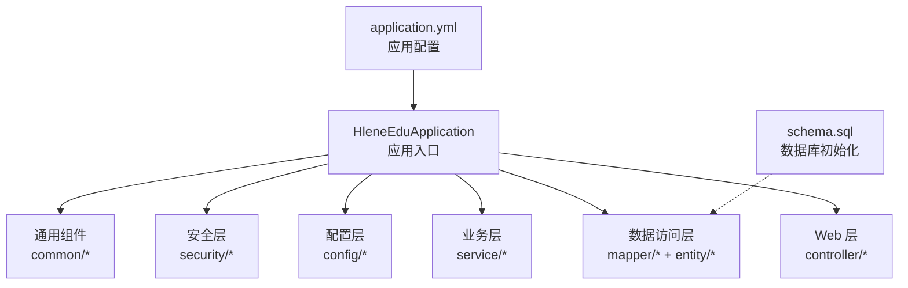
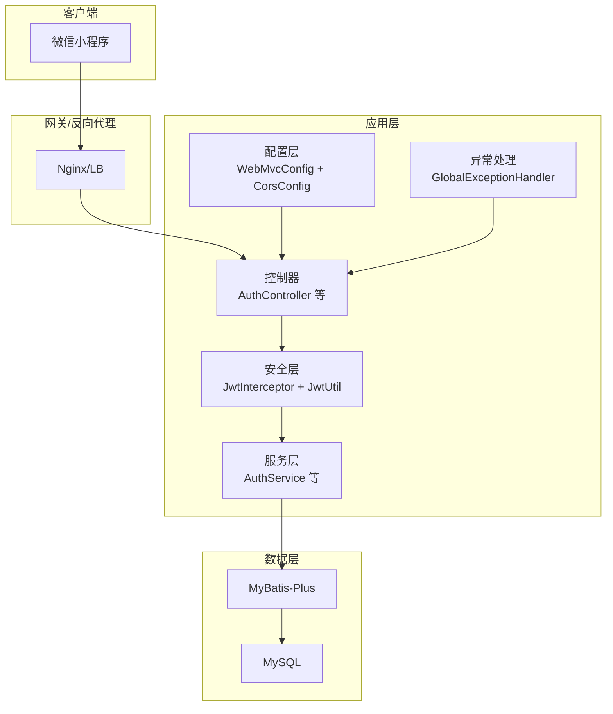
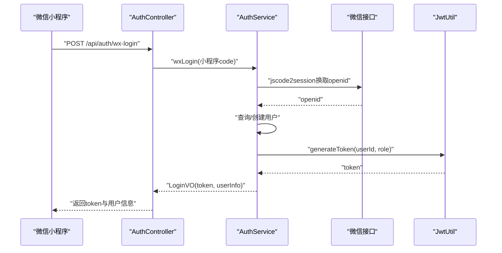
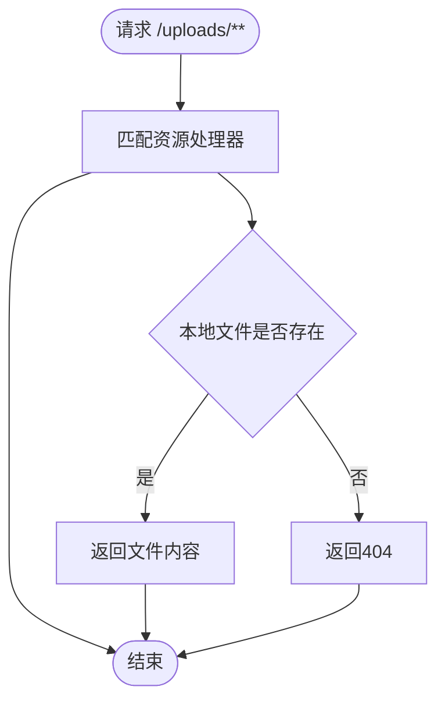
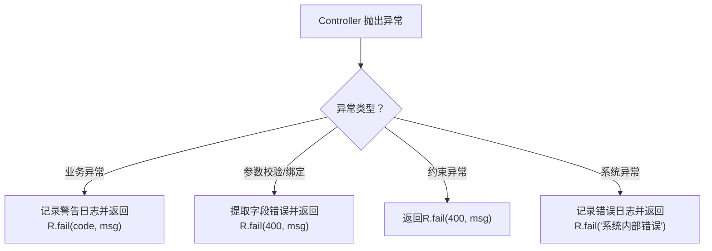
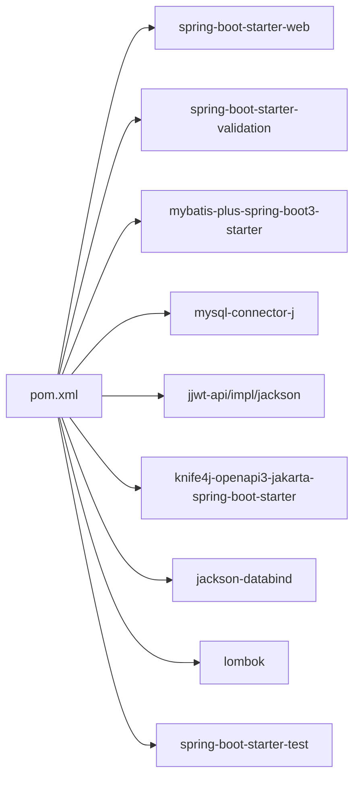

# 后端部署

<cite>
**本文引用的文件**
- [pom.xml](file://helenedu-backend/pom.xml)
- [application.yml](file://helenedu-backend/src/main/resources/application.yml)
- [HleneEduApplication.java](file://helenedu-backend/src/main/java/com/helen/eduedu/HleneEduApplication.java)
- [CorsConfig.java](file://helenedu-backend/src/main/java/com/helen/eduedu/config/CorsConfig.java)
- [WebMvcConfig.java](file://helenedu-backend/src/main/java/com/helen/eduedu/config/WebMvcConfig.java)
- [JwtUtil.java](file://helenedu-backend/src/main/java/com/helen/eduedu/security/JwtUtil.java)
- [JwtInterceptor.java](file://helenedu-backend/src/main/java/com/helen/eduedu/security/JwtInterceptor.java)
- [AuthService.java](file://helenedu-backend/src/main/java/com/helen/eduedu/service/AuthService.java)
- [AuthController.java](file://helenedu-backend/src/main/java/com/helen/eduedu/controller/AuthController.java)
- [GlobalExceptionHandler.java](file://helenedu-backend/src/main/java/com/helen/eduedu/common/GlobalExceptionHandler.java)
- [schema.sql](file://helenedu-backend/src/main/resources/db/schema.sql)
</cite>

## 目录
1. [简介](#简介)
2. [项目结构](#项目结构)
3. [核心组件](#核心组件)
4. [架构总览](#架构总览)
5. [详细组件分析](#详细组件分析)
6. [依赖关系分析](#依赖关系分析)
7. [性能与资源规划](#性能与资源规划)
8. [部署与运维指南](#部署与运维指南)
9. [故障排查](#故障排查)
10. [结论](#结论)
11. [附录](#附录)

## 简介
本指南面向HelenEdu后端服务的生产部署，覆盖Spring Boot应用的打包、运行参数、生产环境配置、服务启停脚本、负载均衡与集群、日志与监控等方面。文档以项目实际代码为依据，确保可操作性与可追溯性。

## 项目结构
后端采用标准Spring Boot工程结构，核心目录与职责如下：
- src/main/java：Java源码，按功能分层组织（controller、service、mapper、config、security、common、vo、dto）
- src/main/resources：资源配置与数据库初始化脚本
- pom.xml：Maven构建与依赖管理

图表来源
- [HleneEduApplication.java:1-15](file://helenedu-backend/src/main/java/com/helen/eduedu/HleneEduApplication.java#L1-L15)
- [application.yml:1-59](file://helenedu-backend/src/main/resources/application.yml#L1-L59)
- [schema.sql:1-94](file://helenedu-backend/src/main/resources/db/schema.sql#L1-L94)

章节来源
- [HleneEduApplication.java:1-15](file://helenedu-backend/src/main/java/com/helen/eduedu/HleneEduApplication.java#L1-L15)
- [application.yml:1-59](file://helenedu-backend/src/main/resources/application.yml#L1-L59)
- [schema.sql:1-94](file://helenedu-backend/src/main/resources/db/schema.sql#L1-L94)

## 核心组件
- 应用入口与扫描：应用入口类负责启动Spring Boot，并扫描Mapper包以启用MyBatis-Plus。
- 配置体系：application.yml集中管理服务器端口、数据源、文件上传、JWT、微信小程序、Knife4j等配置。
- 安全体系：基于JWT的拦截器在进入Controller前进行鉴权与权限校验；全局异常处理器统一返回格式。
- 文件上传：通过WebMvc配置映射静态资源访问路径，支持本地目录存储与跨域访问。
- 数据库初始化：提供完整的建表与初始数据脚本。

章节来源
- [HleneEduApplication.java:1-15](file://helenedu-backend/src/main/java/com/helen/eduedu/HleneEduApplication.java#L1-L15)
- [application.yml:1-59](file://helenedu-backend/src/main/resources/application.yml#L1-L59)
- [WebMvcConfig.java:1-40](file://helenedu-backend/src/main/java/com/helen/eduedu/config/WebMvcConfig.java#L1-L40)
- [JwtInterceptor.java:1-85](file://helenedu-backend/src/main/java/com/helen/eduedu/security/JwtInterceptor.java#L1-L85)
- [GlobalExceptionHandler.java:1-58](file://helenedu-backend/src/main/java/com/helen/eduedu/common/GlobalExceptionHandler.java#L1-L58)
- [schema.sql:1-94](file://helenedu-backend/src/main/resources/db/schema.sql#L1-L94)

## 架构总览
后端服务采用经典的三层架构：控制层接收请求，业务层处理领域逻辑，数据访问层对接数据库。安全层通过JWT拦截器实现统一鉴权与权限控制。

图表来源
- [AuthController.java:1-39](file://helenedu-backend/src/main/java/com/helen/eduedu/controller/AuthController.java#L1-L39)
- [AuthService.java:1-128](file://helenedu-backend/src/main/java/com/helen/eduedu/service/AuthService.java#L1-L128)
- [JwtInterceptor.java:1-85](file://helenedu-backend/src/main/java/com/helen/eduedu/security/JwtInterceptor.java#L1-L85)
- [JwtUtil.java:1-87](file://helenedu-backend/src/main/java/com/helen/eduedu/security/JwtUtil.java#L1-L87)
- [WebMvcConfig.java:1-40](file://helenedu-backend/src/main/java/com/helen/eduedu/config/WebMvcConfig.java#L1-L40)
- [CorsConfig.java:1-28](file://helenedu-backend/src/main/java/com/helen/eduedu/config/CorsConfig.java#L1-L28)
- [GlobalExceptionHandler.java:1-58](file://helenedu-backend/src/main/java/com/helen/eduedu/common/GlobalExceptionHandler.java#L1-L58)

## 详细组件分析

### 组件一：认证与安全（JWT）
- 功能要点
  - 生成与解析JWT，包含用户ID与角色信息。
  - 在拦截器中校验Token有效性与角色权限，非Controller方法与OPTIONS请求直接放行。
  - 支持从请求头与查询参数两种方式提取Token。
- 关键流程

图表来源
- [AuthController.java:1-39](file://helenedu-backend/src/main/java/com/helen/eduedu/controller/AuthController.java#L1-L39)
- [AuthService.java:1-128](file://helenedu-backend/src/main/java/com/helen/eduedu/service/AuthService.java#L1-L128)
- [JwtUtil.java:1-87](file://helenedu-backend/src/main/java/com/helen/eduedu/security/JwtUtil.java#L1-L87)

章节来源
- [JwtUtil.java:1-87](file://helenedu-backend/src/main/java/com/helen/eduedu/security/JwtUtil.java#L1-L87)
- [JwtInterceptor.java:1-85](file://helenedu-backend/src/main/java/com/helen/eduedu/security/JwtInterceptor.java#L1-L85)
- [AuthController.java:1-39](file://helenedu-backend/src/main/java/com/helen/eduedu/controller/AuthController.java#L1-L39)
- [AuthService.java:1-128](file://helenedu-backend/src/main/java/com/helen/eduedu/service/AuthService.java#L1-L128)

### 组件二：文件上传与静态资源
- 功能要点
  - 通过WebMvc配置映射“/uploads/**”到本地目录，实现静态文件访问。
  - 支持跨域访问，允许任意来源、头与方法。
  - 上传大小限制在配置文件中定义。
- 关键流程

图表来源
- [WebMvcConfig.java:1-40](file://helenedu-backend/src/main/java/com/helen/eduedu/config/WebMvcConfig.java#L1-L40)
- [CorsConfig.java:1-28](file://helenedu-backend/src/main/java/com/helen/eduedu/config/CorsConfig.java#L1-L28)
- [application.yml:12-16](file://helenedu-backend/src/main/resources/application.yml#L12-L16)

章节来源
- [WebMvcConfig.java:1-40](file://helenedu-backend/src/main/java/com/helen/eduedu/config/WebMvcConfig.java#L1-L40)
- [CorsConfig.java:1-28](file://helenedu-backend/src/main/java/com/helen/eduedu/config/CorsConfig.java#L1-L28)
- [application.yml:12-16](file://helenedu-backend/src/main/resources/application.yml#L12-L16)

### 组件三：全局异常处理
- 功能要点
  - 对业务异常、参数校验异常、绑定异常、约束异常与系统异常进行统一处理。
  - 返回统一响应体R，便于前端消费。
- 关键流程

图表来源
- [GlobalExceptionHandler.java:1-58](file://helenedu-backend/src/main/java/com/helen/eduedu/common/GlobalExceptionHandler.java#L1-L58)

章节来源
- [GlobalExceptionHandler.java:1-58](file://helenedu-backend/src/main/java/com/helen/eduedu/common/GlobalExceptionHandler.java#L1-L58)

## 依赖关系分析
- 构建与打包
  - 使用Spring Boot Maven插件，排除Lombok以减小运行时依赖。
- 运行时依赖
  - Web、Validation、MyBatis-Plus、MySQL驱动、JWT、Knife4j、Jackson、Lombok、测试。

图表来源
- [pom.xml:1-118](file://helenedu-backend/pom.xml#L1-L118)

章节来源
- [pom.xml:1-118](file://helenedu-backend/pom.xml#L1-L118)

## 性能与资源规划
- JVM建议
  - 基于应用规模选择合适的堆内存与GC策略；生产环境建议开启JFR与GC日志以便问题定位。
- 数据库
  - 使用连接池与慢查询日志；合理设置索引与分区策略；读写分离与只读副本用于报表场景。
- 缓存
  - 对热点接口使用Redis缓存，降低数据库压力；注意缓存一致性与过期策略。
- 文件存储
  - 大文件建议使用对象存储（OSS/COS），本地存储仅限小文件或开发测试。
- 并发与线程
  - Web线程池与IO线程池根据CPU核数与QPS估算配置；避免阻塞操作阻塞IO线程。

[本节为通用指导，不直接分析具体文件]

## 部署与运维指南

### 一、Maven构建与JAR包生成
- 构建命令
  - 使用Maven构建，生成可执行JAR包。
- 插件配置
  - Spring Boot Maven插件已配置，排除Lombok以减少运行时依赖。
- 产物位置
  - 产物位于target目录，文件名为项目artifactId与版本组合。

章节来源
- [pom.xml:101-116](file://helenedu-backend/pom.xml#L101-L116)

### 二、生产环境配置修改清单
- 数据库连接
  - 修改数据源URL、用户名、密码与驱动类名，确保网络可达与账号权限正确。
- JWT密钥与过期时间
  - 更换JWT密钥字符串，确保长度足够；调整过期时间以平衡安全性与用户体验。
- 文件上传路径与访问域名
  - 更新本地上传目录与对外访问基础URL；如使用对象存储，改为对应域名。
- 微信小程序配置
  - 填写正确的AppId与Secret，确保登录流程可用。
- Jackson日期格式与时区
  - 保持与前端一致的时间格式与时区，避免显示偏差。
- MyBatis-Plus配置
  - Mapper扫描路径、驼峰映射、日志输出与逻辑删除字段按需调整。
- Knife4j开关与语言
  - 生产环境建议关闭或限制访问，避免泄露接口细节。

章节来源
- [application.yml:6-59](file://helenedu-backend/src/main/resources/application.yml#L6-L59)

### 三、服务启动与停止脚本
- 启动参数建议
  - JVM参数：堆大小、GC策略、JFR、GC日志、线程栈大小、DNS缓存等。
  - 应用参数：端口、上下文路径、PID文件、日志级别与输出路径。
- 进程管理
  - 推荐使用systemd或Supervisor管理进程，设置自动重启与资源限制。
- 健康检查
  - 提供健康端点（如/actuator/health），结合探针实现就绪/存活检查。
- 自动重启机制
  - 结合进程管理器与日志监控，异常退出自动拉起；避免频繁重启风暴。

[本节为通用指导，不直接分析具体文件]

### 四、负载均衡与集群部署
- 负载均衡
  - 使用Nginx/HAProxy/Tengine作为前置LB，支持HTTP/HTTPS与WS转发。
- 集群部署
  - 多实例部署，共享数据库与缓存；使用会话粘性或无状态设计。
- 服务发现
  - 如使用Spring Cloud，可集成Eureka/Nacos；否则通过LB配置静态后端列表。
- 静态资源
  - 将上传目录挂载至共享存储或对象存储，保证多实例一致性。

[本节为通用指导，不直接分析具体文件]

### 五、日志配置与日志轮转
- 日志级别
  - 生产环境默认INFO，关键模块可临时提升DEBUG；避免在高并发场景打印过多日志。
- 敏感信息脱敏
  - 对日志中的Token、密码、手机号等敏感字段进行脱敏处理。
- 日志轮转
  - 使用logrotate或类似工具，按大小与时间轮转，保留周期与压缩策略按合规要求设定。
- 日志收集与分析
  - 采集到ELK/日志服务，建立告警规则与仪表盘，支持快速定位问题。

[本节为通用指导，不直接分析具体文件]

## 故障排查
- 登录失败
  - 检查微信AppId/Secret是否正确；确认网络可访问微信接口；查看全局异常返回的错误信息。
- 权限不足
  - 检查Token是否有效与过期；确认控制器上的角色注解与用户角色匹配。
- 文件访问异常
  - 检查上传目录是否存在且具备读权限；确认资源映射路径与跨域配置。
- 数据库连接异常
  - 检查URL、账号、密码与网络连通性；确认驱动版本兼容性。

章节来源
- [AuthService.java:102-126](file://helenedu-backend/src/main/java/com/helen/eduedu/service/AuthService.java#L102-L126)
- [JwtInterceptor.java:27-68](file://helenedu-backend/src/main/java/com/helen/eduedu/security/JwtInterceptor.java#L27-L68)
- [WebMvcConfig.java:33-38](file://helenedu-backend/src/main/java/com/helen/eduedu/config/WebMvcConfig.java#L33-L38)
- [GlobalExceptionHandler.java:19-56](file://helenedu-backend/src/main/java/com/helen/eduedu/common/GlobalExceptionHandler.java#L19-L56)

## 结论
本指南基于项目现有代码与配置，给出了从构建、配置、部署到运维的完整路径。建议在生产环境中进一步完善安全加固、监控告警与灾备方案，并持续优化性能与稳定性。

## 附录

### A. 数据库初始化脚本
- 包含数据库创建、表结构与初始数据插入，首次部署时执行。

章节来源
- [schema.sql:1-94](file://helenedu-backend/src/main/resources/db/schema.sql#L1-L94)

### B. 应用启动入口
- 应用主类负责启动Spring Boot并扫描Mapper包。

章节来源
- [HleneEduApplication.java:1-15](file://helenedu-backend/src/main/java/com/helen/eduedu/HleneEduApplication.java#L1-L15)