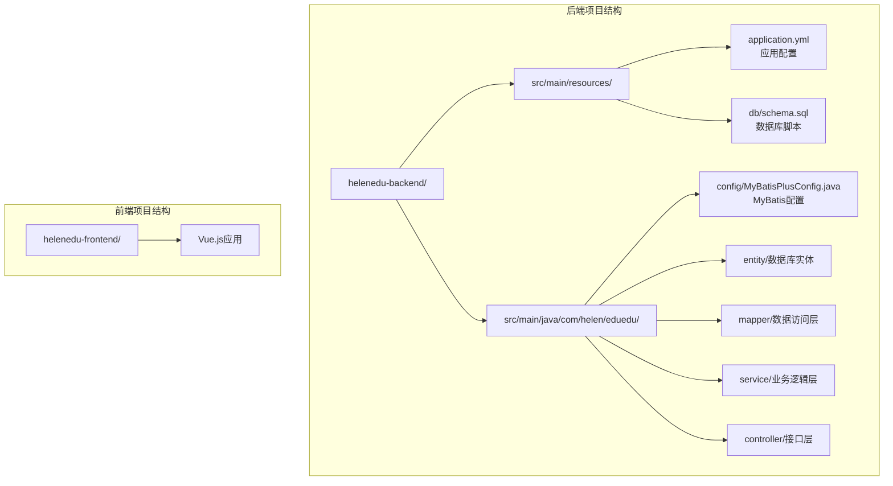
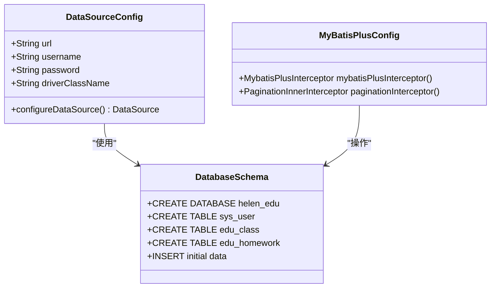
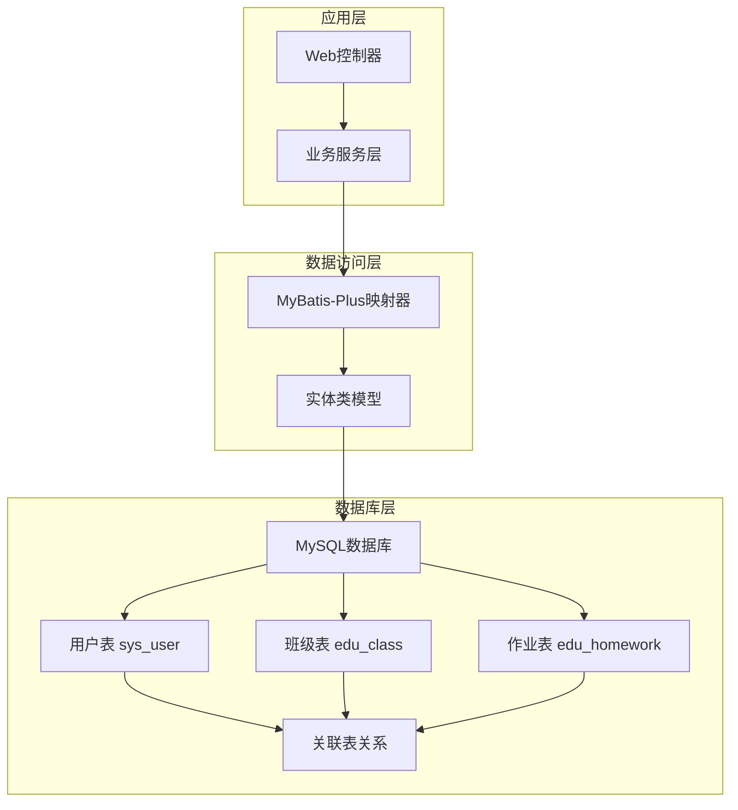
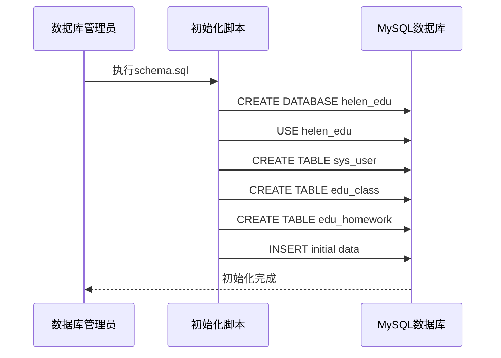
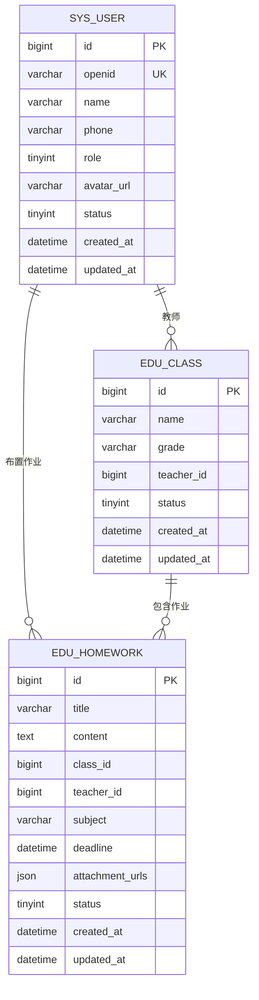
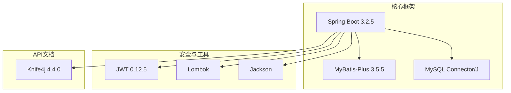
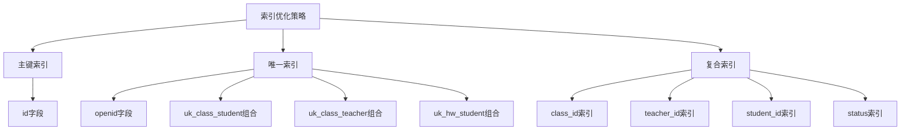
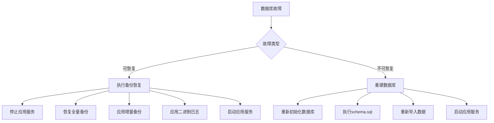

# 数据库部署

<cite>
**本文引用的文件**
- [application.yml](file://helenedu-backend/src/main/resources/application.yml)
- [schema.sql](file://helenedu-backend/src/main/resources/db/schema.sql)
- [pom.xml](file://helenedu-backend/pom.xml)
- [SysUser.java](file://helenedu-backend/src/main/java/com/helen/eduedu/entity/SysUser.java)
- [EduClass.java](file://helenedu-backend/src/main/java/com/helen/eduedu/entity/EduClass.java)
- [EduHomework.java](file://helenedu-backend/src/main/java/com/helen/eduedu/entity/EduHomework.java)
- [MyBatisPlusConfig.java](file://helenedu-backend/src/main/java/com/helen/eduedu/config/MyBatisPlusConfig.java)
- [README.md](file://README.md)
</cite>

## 目录
1. [简介](#简介)
2. [项目结构](#项目结构)
3. [核心组件](#核心组件)
4. [架构概览](#架构概览)
5. [详细组件分析](#详细组件分析)
6. [依赖关系分析](#依赖关系分析)
7. [性能考虑](#性能考虑)
8. [故障排除指南](#故障排除指南)
9. [结论](#结论)

## 简介

HelenEdu是一个基于Spring Boot和Vue.js开发的轻量级作业管理小程序后端系统。该项目采用MySQL作为主要数据库存储，支持微信小程序登录认证，提供作业发布、提交、批改等功能。本文档提供了完整的数据库部署指南，包括MySQL安装配置、数据库初始化、用户权限管理、性能优化和故障处理等关键内容。

## 项目结构

HelenEdu项目采用标准的Spring Boot分层架构，数据库相关的核心文件主要集中在以下位置：

**图表来源**
- [application.yml:1-59](file://helenedu-backend/src/main/resources/application.yml#L1-L59)
- [schema.sql:1-94](file://helenedu-backend/src/main/resources/db/schema.sql#L1-L94)

**章节来源**
- [application.yml:1-59](file://helenedu-backend/src/main/resources/application.yml#L1-L59)
- [schema.sql:1-94](file://helenedu-backend/src/main/resources/db/schema.sql#L1-L94)

## 核心组件

### 数据库配置组件

项目使用Spring Boot的自动配置机制来管理数据库连接，核心配置位于application.yml文件中：

**图表来源**
- [application.yml:6-11](file://helenedu-backend/src/main/resources/application.yml#L6-L11)
- [MyBatisPlusConfig.java:12-21](file://helenedu-backend/src/main/java/com/helen/eduedu/config/MyBatisPlusConfig.java#L12-L21)

### 数据模型组件

系统包含多个核心数据表，每个表都对应相应的Java实体类：

**章节来源**
- [application.yml:6-11](file://helenedu-backend/src/main/resources/application.yml#L6-L11)
- [MyBatisPlusConfig.java:12-21](file://helenedu-backend/src/main/java/com/helen/eduedu/config/MyBatisPlusConfig.java#L12-L21)

## 架构概览

HelenEdu的数据库架构采用经典的三层架构设计，实现了清晰的职责分离：

**图表来源**
- [SysUser.java:14-41](file://helenedu-backend/src/main/java/com/helen/eduedu/entity/SysUser.java#L14-L41)
- [EduClass.java:14-35](file://helenedu-backend/src/main/java/com/helen/eduedu/entity/EduClass.java#L14-L35)
- [EduHomework.java:17-51](file://helenedu-backend/src/main/java/com/helen/eduedu/entity/EduHomework.java#L17-L51)

## 详细组件分析

### 数据库连接配置

项目使用Spring Boot的JDBC连接方式，配置参数如下：

| 配置项 | 值 | 说明 |
|--------|-----|------|
| 数据库URL | jdbc:mysql://localhost:3306/helen_edu | 连接地址 |
| 用户名 | root | 数据库用户名 |
| 密码 | root | 数据库密码 |
| 驱动类名 | com.mysql.cj.jdbc.Driver | MySQL驱动 |
| 字符集 | utf-8 | 支持中文字符 |
| 时区 | Asia/Shanghai | 中国标准时间 |

**章节来源**
- [application.yml:8-11](file://helenedu-backend/src/main/resources/application.yml#L8-L11)

### 数据库初始化脚本

数据库初始化脚本包含完整的DDL和DML操作：

**图表来源**
- [schema.sql:1-94](file://helenedu-backend/src/main/resources/db/schema.sql#L1-L94)

### 数据实体模型

系统采用MyBatis-Plus框架，每个数据库表都有对应的实体类：

**图表来源**
- [SysUser.java:14-41](file://helenedu-backend/src/main/java/com/helen/eduedu/entity/SysUser.java#L14-L41)
- [EduClass.java:14-35](file://helenedu-backend/src/main/java/com/helen/eduedu/entity/EduClass.java#L14-L35)
- [EduHomework.java:17-51](file://helenedu-backend/src/main/java/com/helen/eduedu/entity/EduHomework.java#L17-L51)

**章节来源**
- [SysUser.java:14-41](file://helenedu-backend/src/main/java/com/helen/eduedu/entity/SysUser.java#L14-L41)
- [EduClass.java:14-35](file://helenedu-backend/src/main/java/com/helen/eduedu/entity/EduClass.java#L14-L35)
- [EduHomework.java:17-51](file://helenedu-backend/src/main/java/com/helen/eduedu/entity/EduHomework.java#L17-L51)

## 依赖关系分析

### 技术栈依赖

项目的技术栈和依赖关系如下：

**图表来源**
- [pom.xml:20-25](file://helenedu-backend/pom.xml#L20-L25)
- [pom.xml:40-78](file://helenedu-backend/pom.xml#L40-L78)

### 数据访问层配置

MyBatis-Plus配置确保了MySQL数据库的正确支持：

**章节来源**
- [pom.xml:40-78](file://helenedu-backend/pom.xml#L40-L78)
- [MyBatisPlusConfig.java:12-21](file://helenedu-backend/src/main/java/com/helen/eduedu/config/MyBatisPlusConfig.java#L12-L21)

## 性能考虑

### MySQL数据库优化建议

基于项目需求，建议进行以下MySQL优化配置：

#### 字符集和排序规则
- 使用utf8mb4字符集支持完整的UTF-8字符
- 推荐使用utf8mb4_unicode_ci排序规则
- 确保所有表和列都使用统一的字符集

#### 存储引擎选择
- 建议使用InnoDB存储引擎
- 支持事务、外键约束和行级锁定
- 提供更好的数据完整性和并发性能

#### 关键性能参数调优

| 参数类别 | 建议值 | 说明 |
|----------|--------|------|
| innodb_buffer_pool_size | 512M-2G | InnoDB缓冲池大小 |
| innodb_log_file_size | 64M | 日志文件大小 |
| innodb_flush_log_at_trx_commit | 2 | 平衡安全性与性能 |
| query_cache_type | 0 | 关闭查询缓存 |
| max_connections | 200 | 最大连接数 |
| innodb_autoinc_lock_mode | 2 | 改进批量插入性能 |

### 索引优化策略

根据实体关系分析，建议在以下字段上建立索引：

**图表来源**
- [schema.sql:34-44](file://helenedu-backend/src/main/resources/db/schema.sql#L34-L44)
- [schema.sql:73-74](file://helenedu-backend/src/main/resources/db/schema.sql#L73-L74)

### 查询优化建议

针对系统特点，建议优化以下类型的查询：

1. **用户认证查询**：优化基于openid的查询
2. **班级关联查询**：优化多表关联查询
3. **作业管理查询**：优化按状态和时间的过滤查询
4. **分页查询优化**：利用MyBatis-Plus的分页插件

**章节来源**
- [MyBatisPlusConfig.java:15-20](file://helenedu-backend/src/main/java/com/helen/eduedu/config/MyBatisPlusConfig.java#L15-L20)

## 故障排除指南

### 常见数据库问题及解决方案

#### 连接问题
- **问题**：无法连接到MySQL数据库
- **原因**：网络配置错误、防火墙阻拦、MySQL服务未启动
- **解决方案**：检查MySQL服务状态、验证网络连通性、确认防火墙设置

#### 字符集问题
- **问题**：中文显示乱码
- **原因**：字符集配置不正确
- **解决方案**：确保数据库、表、列都使用utf8mb4字符集

#### 权限问题
- **问题**：应用无法访问数据库
- **原因**：数据库用户权限不足
- **解决方案**：为应用用户授予必要的数据库权限

#### 性能问题
- **问题**：查询响应缓慢
- **原因**：缺少索引、查询语句效率低
- **解决方案**：添加适当的索引、优化查询语句、调整MySQL参数

### 数据库监控指标

建议监控以下关键指标：

| 监控指标 | 检查频率 | 告警阈值 |
|----------|----------|----------|
| 连接数 | 实时 | >80%最大连接数 |
| 缓冲池命中率 | 每小时 | <90% |
| 慢查询数量 | 每小时 | >10个/小时 |
| 锁等待时间 | 每分钟 | >1秒 |
| 磁盘空间使用率 | 每日 | >80% |

### 备份和恢复策略

#### 完整备份策略
1. **全量备份**：每周日凌晨2点执行全量备份
2. **增量备份**：每日执行增量备份
3. **二进制日志备份**：实时备份二进制日志

#### 恢复流程

**图表来源**
- [schema.sql:1-94](file://helenedu-backend/src/main/resources/db/schema.sql#L1-L94)

## 结论

HelenEdu项目的数据库部署相对简单，主要依赖于Spring Boot的自动配置功能。通过合理的MySQL配置、完善的初始化脚本和适当的性能优化措施，可以确保系统的稳定运行。

关键成功因素包括：
1. 正确的MySQL安装和配置
2. 完整的数据库初始化
3. 合理的权限管理和安全设置
4. 持续的性能监控和优化
5. 完善的备份和恢复策略

建议在生产环境中实施更严格的监控和备份策略，并根据实际使用情况调整MySQL参数配置。