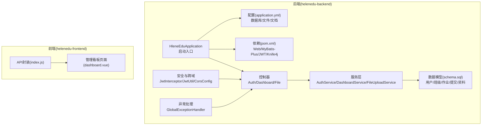
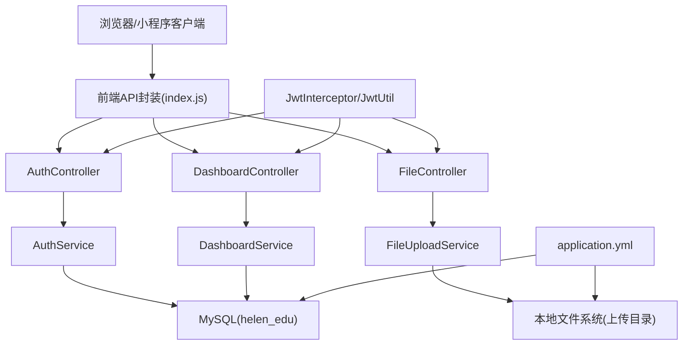
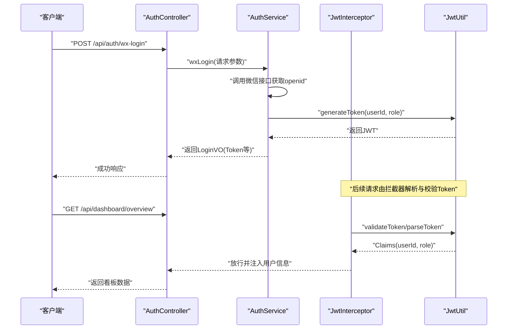
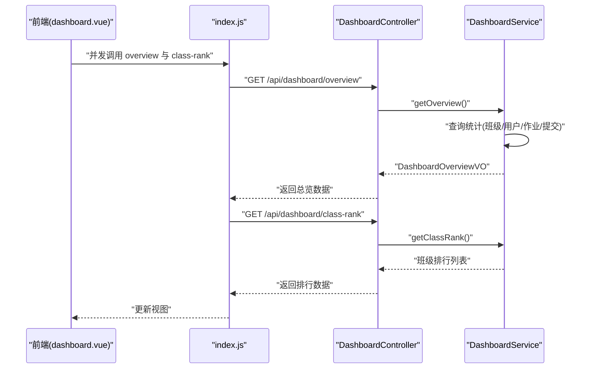
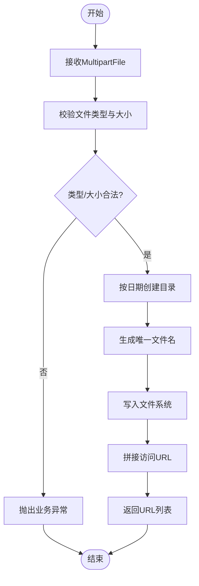
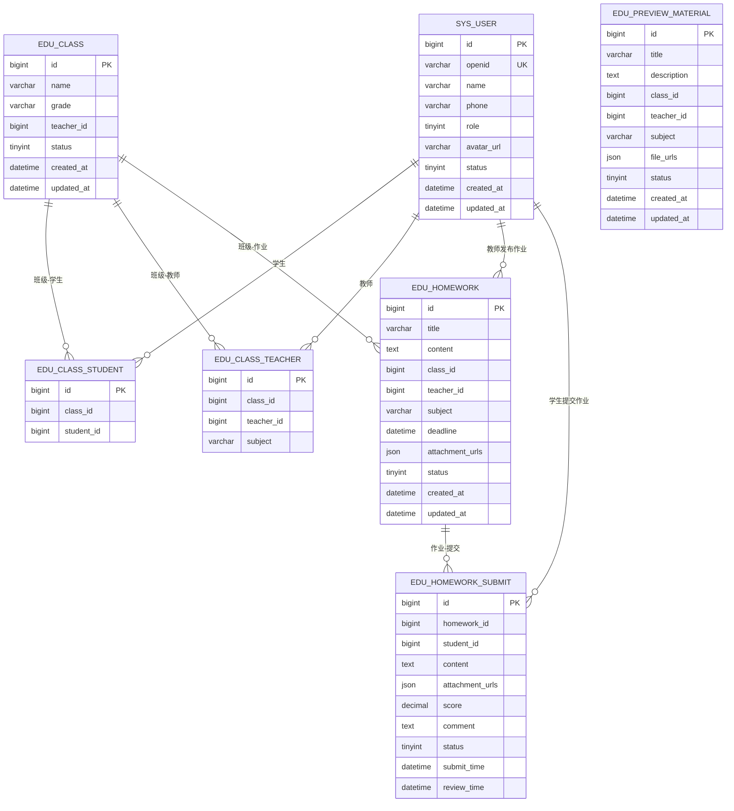
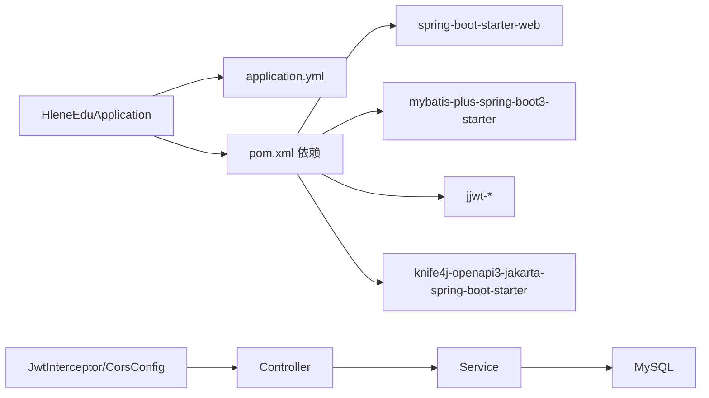

# 监控运维

<cite>
**本文引用的文件**
- [HleneEduApplication.java](file://helenedu-backend/src/main/java/com/helen/eduedu/HleneEduApplication.java)
- [application.yml](file://helenedu-backend/src/main/resources/application.yml)
- [pom.xml](file://helenedu-backend/pom.xml)
- [schema.sql](file://helenedu-backend/src/main/resources/db/schema.sql)
- [CorsConfig.java](file://helenedu-backend/src/main/java/com/helen/eduedu/config/CorsConfig.java)
- [MyBatisPlusConfig.java](file://helenedu-backend/src/main/java/com/helen/eduedu/config/MyBatisPlusConfig.java)
- [JwtInterceptor.java](file://helenedu-backend/src/main/java/com/helen/eduedu/security/JwtInterceptor.java)
- [JwtUtil.java](file://helenedu-backend/src/main/java/com/helen/eduedu/security/JwtUtil.java)
- [AuthService.java](file://helenedu-backend/src/main/java/com/helen/eduedu/service/AuthService.java)
- [FileUploadService.java](file://helenedu-backend/src/main/java/com/helen/eduedu/service/FileUploadService.java)
- [FileController.java](file://helenedu-backend/src/main/java/com/helen/eduedu/controller/FileController.java)
- [DashboardController.java](file://helenedu-backend/src/main/java/com/helen/eduedu/controller/DashboardController.java)
- [DashboardService.java](file://helenedu-backend/src/main/java/com/helen/eduedu/service/DashboardService.java)
- [DashboardOverviewVO.java](file://helenedu-backend/src/main/java/com/helen/eduedu/vo/DashboardOverviewVO.java)
- [GlobalExceptionHandler.java](file://helenedu-backend/src/main/java/com/helen/eduedu/common/GlobalExceptionHandler.java)
- [BusinessException.java](file://helenedu-backend/src/main/java/com/helen/eduedu/common/BusinessException.java)
- [AuthController.java](file://helenedu-backend/src/main/java/com/helen/eduedu/controller/AuthController.java)
- [index.js](file://helenedu-frontend/src/api/index.js)
- [dashboard.vue](file://helenedu-frontend/src/pages/admin/dashboard.vue)
</cite>

## 目录
1. [简介](#简介)
2. [项目结构](#项目结构)
3. [核心组件](#核心组件)
4. [架构总览](#架构总览)
5. [详细组件分析](#详细组件分析)
6. [依赖分析](#依赖分析)
7. [性能考虑](#性能考虑)
8. [故障排查指南](#故障排查指南)
9. [结论](#结论)
10. [附录](#附录)

## 简介
本指南面向 HelenEdu 项目的监控与运维，围绕应用监控、系统资源监控、日志管理、数据库监控与优化、备份恢复策略以及安全监控与合规检查展开。当前代码库尚未集成 Spring Boot Actuator、Prometheus、Grafana 或 ELK 等监控栈组件，因此本指南在“现有能力”基础上提出可落地的扩展建议与最佳实践，帮助团队快速建立完善的监控运维体系。

## 项目结构
后端采用 Spring Boot 3 + MyBatis-Plus 架构，前端为 Vue 3 应用。整体结构清晰，按功能模块划分：控制器、服务、数据访问层、配置与安全组件等。数据库初始化脚本包含用户、班级、作业、预习资料等核心表。

图表来源
- [HleneEduApplication.java:1-15](file://helenedu-backend/src/main/java/com/helen/eduedu/HleneEduApplication.java#L1-L15)
- [application.yml:1-59](file://helenedu-backend/src/main/resources/application.yml#L1-L59)
- [pom.xml:1-118](file://helenedu-backend/pom.xml#L1-L118)
- [schema.sql:1-94](file://helenedu-backend/src/main/resources/db/schema.sql#L1-L94)
- [AuthController.java:1-38](file://helenedu-backend/src/main/java/com/helen/eduedu/controller/AuthController.java#L1-L38)
- [DashboardController.java:1-40](file://helenedu-backend/src/main/java/com/helen/eduedu/controller/DashboardController.java#L1-L40)
- [FileController.java:1-35](file://helenedu-backend/src/main/java/com/helen/eduedu/controller/FileController.java#L1-L35)
- [AuthService.java:1-44](file://helenedu-backend/src/main/java/com/helen/eduedu/service/AuthService.java#L1-L44)
- [DashboardService.java:1-42](file://helenedu-backend/src/main/java/com/helen/eduedu/service/DashboardService.java#L1-L42)
- [FileUploadService.java:1-100](file://helenedu-backend/src/main/java/com/helen/eduedu/service/FileUploadService.java#L1-L100)
- [JwtInterceptor.java:1-84](file://helenedu-backend/src/main/java/com/helen/eduedu/security/JwtInterceptor.java#L1-L84)
- [JwtUtil.java:1-86](file://helenedu-backend/src/main/java/com/helen/eduedu/security/JwtUtil.java#L1-L86)
- [CorsConfig.java:1-27](file://helenedu-backend/src/main/java/com/helen/eduedu/config/CorsConfig.java#L1-L27)
- [GlobalExceptionHandler.java:1-57](file://helenedu-backend/src/main/java/com/helen/eduedu/common/GlobalExceptionHandler.java#L1-L57)
- [index.js:43-49](file://helenedu-frontend/src/api/index.js#L43-L49)
- [dashboard.vue:72-96](file://helenedu-frontend/src/pages/admin/dashboard.vue#L72-L96)

章节来源
- [HleneEduApplication.java:1-15](file://helenedu-backend/src/main/java/com/helen/eduedu/HleneEduApplication.java#L1-L15)
- [application.yml:1-59](file://helenedu-backend/src/main/resources/application.yml#L1-L59)
- [pom.xml:1-118](file://helenedu-backend/pom.xml#L1-L118)
- [schema.sql:1-94](file://helenedu-backend/src/main/resources/db/schema.sql#L1-L94)

## 核心组件
- 启动与装配：应用入口负责扫描包与启动容器。
- 配置中心：数据库连接、文件上传路径与基础 URL、Knife4j 文档路径等集中于配置文件。
- 安全与鉴权：基于 JWT 的拦截器与工具类，统一解析与校验 Token，并结合注解进行角色控制。
- 数据访问：MyBatis-Plus 分页插件与逻辑删除配置，配合实体与 Mapper 使用。
- 控制器与服务：认证、看板统计、文件上传等模块化实现。
- 异常处理：全局异常捕获与统一返回格式，便于监控侧识别错误趋势。
- 前端对接：管理端看板调用后端接口，拉取总览与排行数据。

章节来源
- [HleneEduApplication.java:1-15](file://helenedu-backend/src/main/java/com/helen/eduedu/HleneEduApplication.java#L1-L15)
- [application.yml:1-59](file://helenedu-backend/src/main/resources/application.yml#L1-L59)
- [JwtInterceptor.java:1-84](file://helenedu-backend/src/main/java/com/helen/eduedu/security/JwtInterceptor.java#L1-L84)
- [JwtUtil.java:1-86](file://helenedu-backend/src/main/java/com/helen/eduedu/security/JwtUtil.java#L1-L86)
- [MyBatisPlusConfig.java:1-21](file://helenedu-backend/src/main/java/com/helen/eduedu/config/MyBatisPlusConfig.java#L1-L21)
- [AuthController.java:1-38](file://helenedu-backend/src/main/java/com/helen/eduedu/controller/AuthController.java#L1-L38)
- [DashboardController.java:1-40](file://helenedu-backend/src/main/java/com/helen/eduedu/controller/DashboardController.java#L1-L40)
- [FileController.java:1-35](file://helenedu-backend/src/main/java/com/helen/eduedu/controller/FileController.java#L1-L35)
- [GlobalExceptionHandler.java:1-57](file://helenedu-backend/src/main/java/com/helen/eduedu/common/GlobalExceptionHandler.java#L1-L57)
- [index.js:43-49](file://helenedu-frontend/src/api/index.js#L43-L49)
- [dashboard.vue:72-96](file://helenedu-frontend/src/pages/admin/dashboard.vue#L72-L96)

## 架构总览
下图展示从浏览器到后端服务、数据库与文件存储的整体链路，以及当前代码中涉及的关键组件。

图表来源
- [index.js:43-49](file://helenedu-frontend/src/api/index.js#L43-L49)
- [AuthController.java:1-38](file://helenedu-backend/src/main/java/com/helen/eduedu/controller/AuthController.java#L1-L38)
- [DashboardController.java:1-40](file://helenedu-backend/src/main/java/com/helen/eduedu/controller/DashboardController.java#L1-L40)
- [FileController.java:1-35](file://helenedu-backend/src/main/java/com/helen/eduedu/controller/FileController.java#L1-L35)
- [AuthService.java:1-44](file://helenedu-backend/src/main/java/com/helen/eduedu/service/AuthService.java#L1-L44)
- [DashboardService.java:1-42](file://helenedu-backend/src/main/java/com/helen/eduedu/service/DashboardService.java#L1-L42)
- [FileUploadService.java:1-100](file://helenedu-backend/src/main/java/com/helen/eduedu/service/FileUploadService.java#L1-L100)
- [JwtInterceptor.java:1-84](file://helenedu-backend/src/main/java/com/helen/eduedu/security/JwtInterceptor.java#L1-L84)
- [JwtUtil.java:1-86](file://helenedu-backend/src/main/java/com/helen/eduedu/security/JwtUtil.java#L1-L86)
- [application.yml:1-59](file://helenedu-backend/src/main/resources/application.yml#L1-L59)
- [schema.sql:1-94](file://helenedu-backend/src/main/resources/db/schema.sql#L1-L94)

## 详细组件分析

### 认证与鉴权流程
该流程涵盖 Token 生成、拦截校验、角色判定与错误返回，是安全监控与审计的重要入口。

图表来源
- [AuthController.java:1-38](file://helenedu-backend/src/main/java/com/helen/eduedu/controller/AuthController.java#L1-L38)
- [AuthService.java:1-44](file://helenedu-backend/src/main/java/com/helen/eduedu/service/AuthService.java#L1-L44)
- [JwtInterceptor.java:1-84](file://helenedu-backend/src/main/java/com/helen/eduedu/security/JwtInterceptor.java#L1-L84)
- [JwtUtil.java:1-86](file://helenedu-backend/src/main/java/com/helen/eduedu/security/JwtUtil.java#L1-L86)

章节来源
- [AuthController.java:1-38](file://helenedu-backend/src/main/java/com/helen/eduedu/controller/AuthController.java#L1-L38)
- [AuthService.java:1-44](file://helenedu-backend/src/main/java/com/helen/eduedu/service/AuthService.java#L1-L44)
- [JwtInterceptor.java:1-84](file://helenedu-backend/src/main/java/com/helen/eduedu/security/JwtInterceptor.java#L1-L84)
- [JwtUtil.java:1-86](file://helenedu-backend/src/main/java/com/helen/eduedu/security/JwtUtil.java#L1-L86)

### 看板数据统计流程
看板接口用于聚合班级、用户、作业与提交等数据，便于监控与运营分析。

图表来源
- [dashboard.vue:72-96](file://helenedu-frontend/src/pages/admin/dashboard.vue#L72-L96)
- [index.js:43-49](file://helenedu-frontend/src/api/index.js#L43-L49)
- [DashboardController.java:1-40](file://helenedu-backend/src/main/java/com/helen/eduedu/controller/DashboardController.java#L1-L40)
- [DashboardService.java:1-42](file://helenedu-backend/src/main/java/com/helen/eduedu/service/DashboardService.java#L1-L42)
- [DashboardOverviewVO.java:1-24](file://helenedu-backend/src/main/java/com/helen/eduedu/vo/DashboardOverviewVO.java#L1-L24)

章节来源
- [DashboardController.java:1-40](file://helenedu-backend/src/main/java/com/helen/eduedu/controller/DashboardController.java#L1-L40)
- [DashboardService.java:1-42](file://helenedu-backend/src/main/java/com/helen/eduedu/service/DashboardService.java#L1-L42)
- [DashboardOverviewVO.java:1-24](file://helenedu-backend/src/main/java/com/helen/eduedu/vo/DashboardOverviewVO.java#L1-L24)
- [dashboard.vue:72-96](file://helenedu-frontend/src/pages/admin/dashboard.vue#L72-L96)
- [index.js:43-49](file://helenedu-frontend/src/api/index.js#L43-L49)

### 文件上传流程
文件上传服务对类型与大小进行校验，并按日期分目录存储，返回可访问 URL。

图表来源
- [FileUploadService.java:1-100](file://helenedu-backend/src/main/java/com/helen/eduedu/service/FileUploadService.java#L1-L100)
- [FileController.java:1-35](file://helenedu-backend/src/main/java/com/helen/eduedu/controller/FileController.java#L1-L35)
- [application.yml:43-47](file://helenedu-backend/src/main/resources/application.yml#L43-L47)

章节来源
- [FileUploadService.java:1-100](file://helenedu-backend/src/main/java/com/helen/eduedu/service/FileUploadService.java#L1-L100)
- [FileController.java:1-35](file://helenedu-backend/src/main/java/com/helen/eduedu/controller/FileController.java#L1-L35)
- [application.yml:43-47](file://helenedu-backend/src/main/resources/application.yml#L43-L47)

### 数据模型概览
数据库包含用户、班级、作业、提交与预习资料等核心实体，支撑看板与业务功能。

图表来源
- [schema.sql:1-94](file://helenedu-backend/src/main/resources/db/schema.sql#L1-L94)

章节来源
- [schema.sql:1-94](file://helenedu-backend/src/main/resources/db/schema.sql#L1-L94)

## 依赖分析
- 启动与装配：应用入口扫描包并启动容器。
- 配置与依赖：数据库驱动、MyBatis-Plus、JWT、Knife4j、Jackson、测试等依赖在 POM 中声明。
- 安全与跨域：拦截器与 CORS 配置确保请求安全与跨域放行。
- 数据访问：MyBatis-Plus 分页插件与逻辑删除配置。
- 控制器与服务：模块职责清晰，便于扩展监控埋点。
- 异常处理：统一异常返回，利于监控平台识别错误趋势。

图表来源
- [HleneEduApplication.java:1-15](file://helenedu-backend/src/main/java/com/helen/eduedu/HleneEduApplication.java#L1-L15)
- [application.yml:1-59](file://helenedu-backend/src/main/resources/application.yml#L1-L59)
- [pom.xml:1-118](file://helenedu-backend/pom.xml#L1-L118)
- [JwtInterceptor.java:1-84](file://helenedu-backend/src/main/java/com/helen/eduedu/security/JwtInterceptor.java#L1-L84)
- [CorsConfig.java:1-27](file://helenedu-backend/src/main/java/com/helen/eduedu/config/CorsConfig.java#L1-L27)

章节来源
- [pom.xml:1-118](file://helenedu-backend/pom.xml#L1-L118)
- [application.yml:1-59](file://helenedu-backend/src/main/resources/application.yml#L1-L59)
- [JwtInterceptor.java:1-84](file://helenedu-backend/src/main/java/com/helen/eduedu/security/JwtInterceptor.java#L1-L84)
- [CorsConfig.java:1-27](file://helenedu-backend/src/main/java/com/helen/eduedu/config/CorsConfig.java#L1-L27)

## 性能考虑
- 数据库层面
  - 使用 MyBatis-Plus 分页插件避免一次性加载大量数据；对高频查询建立必要索引（如作业截止时间、提交状态、用户 openid）。
  - 合理使用逻辑删除字段，减少全表扫描。
- 接口层面
  - 对看板接口进行缓存优化，降低聚合计算压力；对并发请求进行限流与熔断。
- 文件上传
  - 限制文件大小与类型，避免大文件占用带宽与存储；上传目录按日期分层，便于清理与归档。
- 日志与监控
  - 在关键方法上增加日志埋点，记录耗时、参数与结果；结合监控平台进行性能分析。

## 故障排查指南
- 认证相关
  - 若出现 401 未登录或 403 权限不足，检查请求头 Authorization 是否携带 Bearer Token，或参数 token 是否正确传递；确认 Token 未过期且角色满足接口要求。
- 参数校验
  - 参数校验失败会返回 400，检查请求体与字段约束；关注全局异常处理器中的日志输出。
- 业务异常
  - 抛出 BusinessException 时，统一返回错误码与消息；查看日志定位具体原因。
- 文件上传
  - 类型不支持或超限会触发异常；检查允许类型列表与最大大小配置；确认上传目录可写。

章节来源
- [JwtInterceptor.java:1-84](file://helenedu-backend/src/main/java/com/helen/eduedu/security/JwtInterceptor.java#L1-L84)
- [GlobalExceptionHandler.java:1-57](file://helenedu-backend/src/main/java/com/helen/eduedu/common/GlobalExceptionHandler.java#L1-L57)
- [BusinessException.java:1-21](file://helenedu-backend/src/main/java/com/helen/eduedu/common/BusinessException.java#L1-L21)
- [FileUploadService.java:1-100](file://helenedu-backend/src/main/java/com/helen/eduedu/service/FileUploadService.java#L1-L100)

## 结论
当前代码库具备清晰的模块划分与基础安全机制，但尚未集成专业的监控与日志体系。建议优先引入 Spring Boot Actuator、Prometheus、Grafana 与 ELK，完善指标采集、可视化与日志分析；同时强化数据库慢查询与连接池监控、制定备份与灾备策略，并持续开展安全审计与漏洞扫描，以构建完整的监控运维闭环。

## 附录

### 监控运维实施建议（概念性）
- 应用监控与指标采集
  - 引入 Actuator 暴露健康检查、JVM、进程、HTTP 请求等指标；结合 Prometheus 抓取。
- 可视化与告警
  - Grafana 建立仪表盘，覆盖 CPU、内存、磁盘、网络、请求延迟与错误率；配置告警规则。
- 系统资源监控
  - 关键指标：CPU 使用率、内存占用、磁盘容量与 IO、网络吞吐；设置阈值与通知渠道。
- 日志管理
  - ELK 收集应用日志、访问日志与错误日志；建立日志分析规则，支持错误追踪与性能分析。
- 数据库监控与优化
  - 慢查询日志与执行计划分析；连接数与锁等待监控；定期维护与索引优化。
- 备份与恢复
  - 数据库全量/增量备份策略；文件备份与版本管理；定期演练灾难恢复。
- 安全监控与合规
  - 访问审计与操作日志；漏洞扫描与基线检查；事件响应流程与处置记录。

[本节为通用运维建议，不直接分析具体源文件，故不附加章节来源]