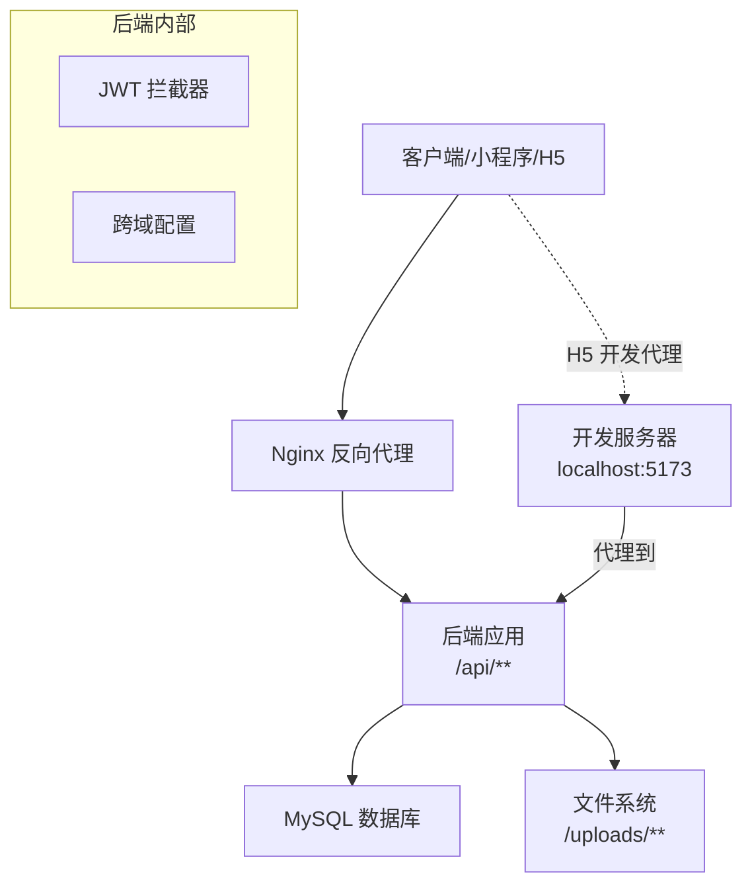
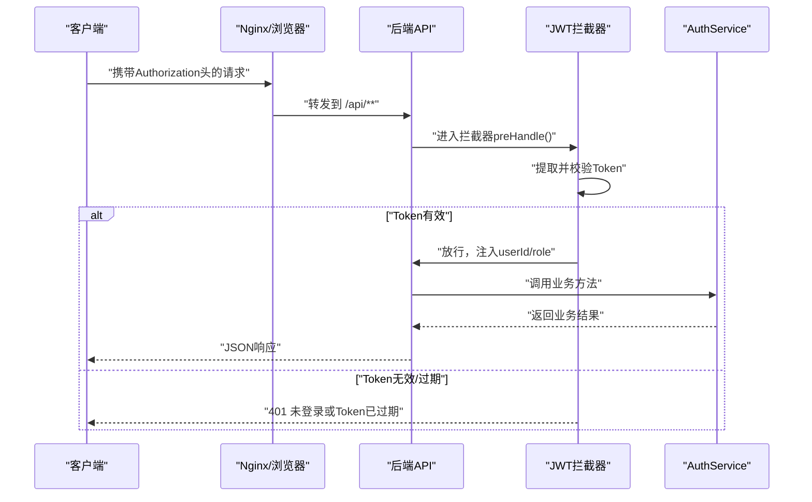
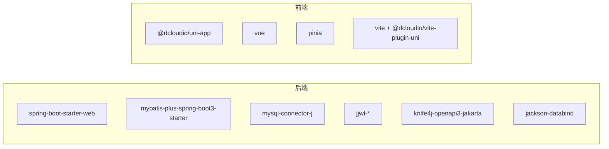

# 部署指南

<cite>
**本文引用的文件**
- [application.yml](file://helenedu-backend/src/main/resources/application.yml)
- [schema.sql](file://helenedu-backend/src/main/resources/db/schema.sql)
- [pom.xml](file://helenedu-backend/pom.xml)
- [HleneEduApplication.java](file://helenedu-backend/src/main/java/com/helen/eduedu/HleneEduApplication.java)
- [WebMvcConfig.java](file://helenedu-backend/src/main/java/com/helen/eduedu/config/WebMvcConfig.java)
- [CorsConfig.java](file://helenedu-backend/src/main/java/com/helen/eduedu/config/CorsConfig.java)
- [JwtInterceptor.java](file://helenedu-backend/src/main/java/com/helen/eduedu/security/JwtInterceptor.java)
- [AuthService.java](file://helenedu-backend/src/main/java/com/helen/eduedu/service/AuthService.java)
- [AuthController.java](file://helenedu-backend/src/main/java/com/helen/eduedu/controller/AuthController.java)
- [package.json](file://helenedu-frontend/package.json)
- [vite.config.js](file://helenedu-frontend/vite.config.js)
- [pages.json](file://helenedu-frontend/src/pages.json)
- [manifest.json](file://helenedu-frontend/src/manifest.json)
- [README.md](file://README.md)
</cite>

## 目录
1. [简介](#简介)
2. [项目结构](#项目结构)
3. [核心组件](#核心组件)
4. [架构总览](#架构总览)
5. [详细组件分析](#详细组件分析)
6. [依赖分析](#依赖分析)
7. [性能考虑](#性能考虑)
8. [故障排查指南](#故障排查指南)
9. [结论](#结论)
10. [附录](#附录)

## 简介
本指南面向HelenEdu项目的生产环境部署，覆盖服务器环境准备、依赖安装、系统与应用配置优化、代码编译打包、数据库初始化与迁移、配置文件设置、服务启动与验证、Docker容器化与编排、Nginx反向代理与SSL部署、性能监控与日志管理、备份恢复与灾备策略、常见问题排查以及自动化部署与CI/CD集成建议。文档所有技术要点均基于仓库中现有源码与配置文件进行提炼与落地。

## 项目结构
HelenEdu采用前后端分离架构：后端为Spring Boot微服务，使用MyBatis-Plus、MySQL、JWT鉴权；前端为UniApp多端应用（支持微信小程序与H5），通过Vite构建工具进行开发与打包。

```mermaid
graph TB
subgraph "后端(helenedu-backend)"
A["Spring Boot 应用<br/>HleneEduApplication"]
B["配置<br/>application.yml"]
C["数据库脚本<br/>schema.sql"]
D["Maven 构建<br/>pom.xml"]
end
subgraph "前端(helenedu-frontend)"
E["UniApp 应用<br/>pages.json/manifest.json"]
F["构建配置<br/>vite.config.js"]
G["包管理与脚本<br/>package.json"]
end
E --> |"H5 开发/构建"| A
A --> |"HTTP 接口"/api/**|" E
A --> |"静态资源上传映射"| E
```

图表来源
- [HleneEduApplication.java:1-15](file://helenedu-backend/src/main/java/com/helen/eduedu/HleneEduApplication.java#L1-L15)
- [application.yml:1-59](file://helenedu-backend/src/main/resources/application.yml#L1-L59)
- [schema.sql:1-94](file://helenedu-backend/src/main/resources/db/schema.sql#L1-L94)
- [pom.xml:1-118](file://helenedu-backend/pom.xml#L1-L118)
- [pages.json:1-112](file://helenedu-frontend/src/pages.json#L1-L112)
- [manifest.json:1-34](file://helenedu-frontend/src/manifest.json#L1-L34)
- [vite.config.js:1-7](file://helenedu-frontend/vite.config.js#L1-L7)
- [package.json:1-28](file://helenedu-frontend/package.json#L1-L28)

章节来源
- [README.md:1-3](file://README.md#L1-L3)
- [HleneEduApplication.java:1-15](file://helenedu-backend/src/main/java/com/helen/eduedu/HleneEduApplication.java#L1-L15)
- [application.yml:1-59](file://helenedu-backend/src/main/resources/application.yml#L1-L59)
- [schema.sql:1-94](file://helenedu-backend/src/main/resources/db/schema.sql#L1-L94)
- [pom.xml:1-118](file://helenedu-backend/pom.xml#L1-L118)
- [pages.json:1-112](file://helenedu-frontend/src/pages.json#L1-L112)
- [manifest.json:1-34](file://helenedu-frontend/src/manifest.json#L1-L34)
- [vite.config.js:1-7](file://helenedu-frontend/vite.config.js#L1-L7)
- [package.json:1-28](file://helenedu-frontend/package.json#L1-L28)

## 核心组件
- 后端应用入口与扫描：Spring Boot启动类负责应用启动与Mapper扫描。
- 配置中心：application.yml集中管理服务器端口、数据库连接、文件上传目录、JWT与微信小程序参数、Knife4j文档开关等。
- 数据库：schema.sql定义了用户、班级、作业、提交、预习资料等核心表及初始数据。
- 前端多端：pages.json声明页面路由与TabBar；manifest.json定义小程序与H5开发服务器代理；vite.config.js提供UniApp插件配置；package.json定义构建脚本与依赖。

章节来源
- [HleneEduApplication.java:1-15](file://helenedu-backend/src/main/java/com/helen/eduedu/HleneEduApplication.java#L1-L15)
- [application.yml:1-59](file://helenedu-backend/src/main/resources/application.yml#L1-L59)
- [schema.sql:1-94](file://helenedu-backend/src/main/resources/db/schema.sql#L1-L94)
- [pages.json:1-112](file://helenedu-frontend/src/pages.json#L1-L112)
- [manifest.json:1-34](file://helenedu-frontend/src/manifest.json#L1-L34)
- [vite.config.js:1-7](file://helenedu-frontend/vite.config.js#L1-L7)
- [package.json:1-28](file://helenedu-frontend/package.json#L1-L28)

## 架构总览
后端通过Spring Web提供REST接口，统一在“/api”前缀下暴露；前端H5通过本地代理转发至后端；JWT拦截器对受保护接口进行鉴权与角色校验；文件上传通过资源映射对外提供访问。



图表来源
- [WebMvcConfig.java:1-40](file://helenedu-backend/src/main/java/com/helen/eduedu/config/WebMvcConfig.java#L1-L40)
- [CorsConfig.java:1-28](file://helenedu-backend/src/main/java/com/helen/eduedu/config/CorsConfig.java#L1-L28)
- [JwtInterceptor.java:1-85](file://helenedu-backend/src/main/java/com/helen/eduedu/security/JwtInterceptor.java#L1-L85)
- [application.yml:1-59](file://helenedu-backend/src/main/resources/application.yml#L1-L59)
- [manifest.json:19-32](file://helenedu-frontend/src/manifest.json#L19-L32)

## 详细组件分析

### 后端应用与配置
- 启动类：负责Spring Boot应用启动与Mapper扫描。
- 配置项重点：
  - 服务器端口与上下文路径
  - 数据源：MySQL连接串、用户名、密码、驱动
  - 文件上传：最大大小、上传目录与对外访问基础URL
  - MyBatis-Plus：Mapper XML位置、驼峰映射、日志实现、逻辑删除字段
  - JWT：密钥与过期时间
  - 微信小程序：AppId与Secret
  - Knife4j：Swagger UI与OpenAPI文档路径

章节来源
- [HleneEduApplication.java:1-15](file://helenedu-backend/src/main/java/com/helen/eduedu/HleneEduApplication.java#L1-L15)
- [application.yml:1-59](file://helenedu-backend/src/main/resources/application.yml#L1-L59)

### 数据库初始化与迁移
- schema.sql包含数据库创建、表结构定义、索引约束与初始用户数据插入。
- 建议在首次部署时执行该SQL脚本完成数据库与表结构初始化。
- 生产环境可结合版本化迁移工具（如Flyway/liquibase）进行后续变更管理。

章节来源
- [schema.sql:1-94](file://helenedu-backend/src/main/resources/db/schema.sql#L1-L94)

### 前端构建与运行
- UniApp多端：支持微信小程序与H5。
- H5开发服务器默认端口与代理配置指向后端8080端口。
- 构建脚本涵盖小程序与H5的开发与生产构建命令。

章节来源
- [pages.json:1-112](file://helenedu-frontend/src/pages.json#L1-L112)
- [manifest.json:19-32](file://helenedu-frontend/src/manifest.json#L19-L32)
- [package.json:1-28](file://helenedu-frontend/package.json#L1-L28)
- [vite.config.js:1-7](file://helenedu-frontend/vite.config.js#L1-L7)

### 安全与鉴权流程
- JWT拦截器负责：
  - 放行OPTIONS与非Controller请求
  - 提取Authorization头或查询参数中的Token
  - 校验Token有效性并解析用户ID与角色
  - 结合@RequireRole注解进行角色权限校验
- 认证服务对接微信登录，获取openid并生成JWT返回给前端。



图表来源
- [JwtInterceptor.java:1-85](file://helenedu-backend/src/main/java/com/helen/eduedu/security/JwtInterceptor.java#L1-L85)
- [AuthService.java:1-128](file://helenedu-backend/src/main/java/com/helen/eduedu/service/AuthService.java#L1-L128)
- [AuthController.java:1-39](file://helenedu-backend/src/main/java/com/helen/eduedu/controller/AuthController.java#L1-L39)

### 文件上传与静态资源
- WebMvc配置：
  - 注册JWT拦截器，排除登录与刷新接口
  - 将“/uploads/**”映射到本地文件系统目录
- application.yml定义上传目录与对外访问基础URL。

章节来源
- [WebMvcConfig.java:1-40](file://helenedu-backend/src/main/java/com/helen/eduedu/config/WebMvcConfig.java#L1-L40)
- [application.yml:43-47](file://helenedu-backend/src/main/resources/application.yml#L43-L47)

## 依赖分析
- 后端依赖：
  - Spring Boot Web、Validation、MyBatis-Plus、MySQL驱动、JWT、Knife4j、Lombok、Jackson
- 前端依赖：
  - UniApp生态、Vue3、Pinia、Vite与相关插件



图表来源
- [pom.xml:27-98](file://helenedu-backend/pom.xml#L27-L98)
- [package.json:12-26](file://helenedu-frontend/package.json#L12-L26)

章节来源
- [pom.xml:1-118](file://helenedu-backend/pom.xml#L1-L118)
- [package.json:1-28](file://helenedu-frontend/package.json#L1-L28)

## 性能考虑
- JVM与线程池：根据并发与GC压力调整JVM参数与线程池大小（建议在容器或系统层面配置）
- 连接池：合理设置数据库连接池大小与超时
- 缓存：对热点查询引入Redis缓存（需在配置中新增）
- 日志：控制INFO级别以上输出，避免过多I/O
- 文件存储：大文件建议使用对象存储（OSS/COS），减少磁盘IO
- CDN：静态资源走CDN加速
- 监控：接入APM（如SkyWalking/OpenTelemetry）与Prometheus/Grafana

## 故障排查指南
- 启动失败
  - 端口占用：检查server.port配置与系统占用
  - 数据库不可达：核对application.yml中的数据库URL、用户名、密码
  - 驱动缺失：确认MySQL驱动版本与依赖一致
- 登录/鉴权异常
  - JWT过期或签名不匹配：检查jwt.secret与过期时间
  - 微信登录失败：核对wechat.appid与wechat.secret，并检查网络可达性
- 文件上传失败
  - 上传目录权限不足或路径不正确：核对file.upload-dir与file.base-url
  - 跨域问题：确认CORS配置允许来源与方法
- 前端H5无法访问后端
  - 开发代理未生效：检查manifest.json中/devServer.proxy配置
  - Nginx未正确转发：核对反向代理规则

章节来源
- [application.yml:1-59](file://helenedu-backend/src/main/resources/application.yml#L1-L59)
- [JwtInterceptor.java:1-85](file://helenedu-backend/src/main/java/com/helen/eduedu/security/JwtInterceptor.java#L1-L85)
- [AuthService.java:1-128](file://helenedu-backend/src/main/java/com/helen/eduedu/service/AuthService.java#L1-L128)
- [WebMvcConfig.java:1-40](file://helenedu-backend/src/main/java/com/helen/eduedu/config/WebMvcConfig.java#L1-L40)
- [manifest.json:19-32](file://helenedu-frontend/src/manifest.json#L19-L32)

## 结论
本部署指南基于仓库现有配置与代码，给出了从环境准备、编译打包、数据库初始化、配置设置、服务启动验证到容器化、反向代理与SSL、监控与日志、备份恢复、问题排查与自动化集成的完整路径。建议在生产环境中补充安全加固、缓存与CDN、APM监控与告警体系，并制定严格的变更与回滚流程。

## 附录

### 一、生产环境部署清单
- 服务器环境
  - 操作系统：Linux（推荐Ubuntu/CentOS）
  - Java：JDK 17（与pom.xml一致）
  - MySQL：8.0+（与驱动兼容）
  - Nginx：用于反向代理与静态资源
  - Docker：可选，便于容器化与编排
- 依赖安装
  - 安装JDK 17、MySQL、Nginx、Docker（可选）
- 系统配置优化
  - 关闭SELinux（如启用）、防火墙开放80/443/8080
  - 设置时区与语言环境
  - 调整文件句柄限制与内核参数（根据负载）

### 二、部署流程
- 后端
  - 打包：使用Maven构建可执行jar（参考pom.xml与spring-boot-maven-plugin）
  - 数据库：执行schema.sql初始化数据库与表结构
  - 配置：准备application.yml（替换数据库凭据、JWT密钥、微信参数、文件上传目录与URL）
  - 启动：以无前台方式运行jar，或使用systemd管理
  - 验证：访问Swagger文档路径与关键接口（如登录）
- 前端
  - 构建：按package.json脚本构建H5或小程序产物
  - 部署：将H5产物部署至Nginx静态目录，或上传至小程序平台
  - 代理：开发阶段确保manifest.json中/devServer.proxy指向后端

章节来源
- [pom.xml:101-116](file://helenedu-backend/pom.xml#L101-L116)
- [schema.sql:1-94](file://helenedu-backend/src/main/resources/db/schema.sql#L1-L94)
- [application.yml:1-59](file://helenedu-backend/src/main/resources/application.yml#L1-L59)
- [package.json:6-11](file://helenedu-frontend/package.json#L6-L11)
- [manifest.json:19-32](file://helenedu-frontend/src/manifest.json#L19-L32)

### 三、Docker容器化部署方案
- Dockerfile（示例思路）
  - 基础镜像：openjdk:17-jre-slim
  - 复制后端jar与配置文件
  - 暴露8080端口
  - CMD启动Spring Boot应用
- 镜像构建
  - docker build -t helenedu-backend .
- 容器运行
  - docker run -d -p 8080:8080 --name helenedu-backend -v /宿主机配置:/app/config helenedu-backend
- Compose编排（建议）
  - 使用docker-compose同时编排后端、MySQL、Nginx
  - 挂载持久化卷与环境变量

说明：本节为通用容器化实践建议，具体镜像与编排文件需按实际环境定制。

### 四、Nginx反向代理与SSL部署
- 反向代理
  - 将域名解析到服务器IP
  - 在Nginx中配置server块，将/api转发至后端8080端口
  - 对静态资源（H5产物）提供静态服务
- SSL证书
  - 使用Let’s Encrypt免费证书（acme.sh或certbot）
  - 配置HTTPS监听与重定向

### 五、性能监控与日志管理
- 应用监控
  - 启用Actuator与健康检查端点
  - 集成APM（SkyWalking/OpenTelemetry）追踪链路
- 数据库监控
  - 使用慢查询日志、性能Schema与DBA工具
- 系统资源监控
  - Prometheus + Grafana采集CPU/内存/磁盘/网络
- 日志管理
  - 统一日志格式与输出级别
  - 使用ELK/EFK集中收集与检索

### 六、备份恢复与灾备策略
- 数据库备份
  - 定时快照与增量备份（mysqldump/物理备份）
  - 异地容灾与自动切换演练
- 应用与文件备份
  - 备份jar包、配置文件、上传目录
- 灾难恢复
  - 制定RTO/RPO目标与恢复步骤
  - 定期演练与验证

### 七、自动化部署与CI/CD集成
- CI/CD流水线建议
  - 触发条件：push到主分支或打标签
  - 步骤：代码检出 → Maven构建 → 单元测试 → Docker镜像构建 → 推送镜像 → 编排部署
  - 工具：GitHub Actions/GitLab CI/Jenkins
- 蓝绿/金丝雀发布
  - 通过服务发现与负载均衡实现平滑切换