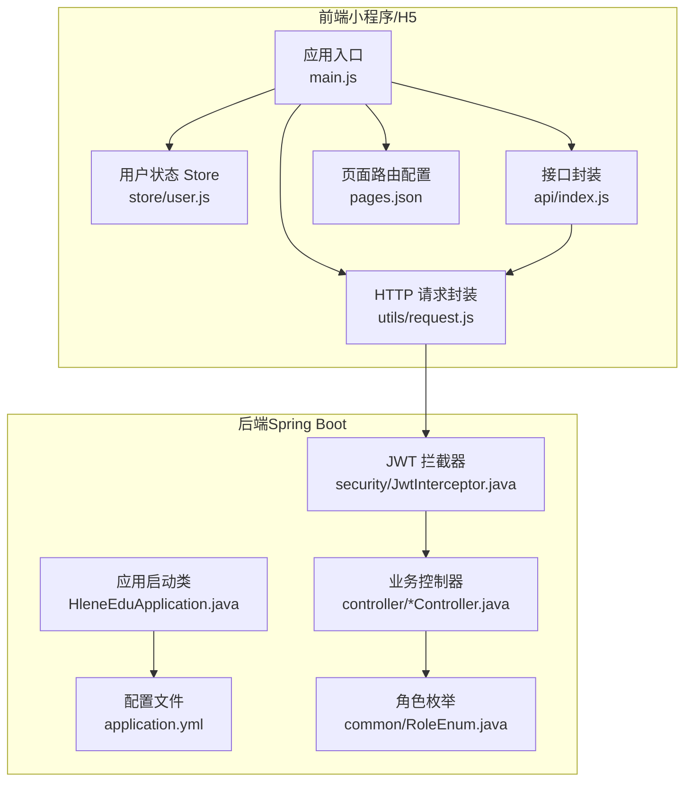
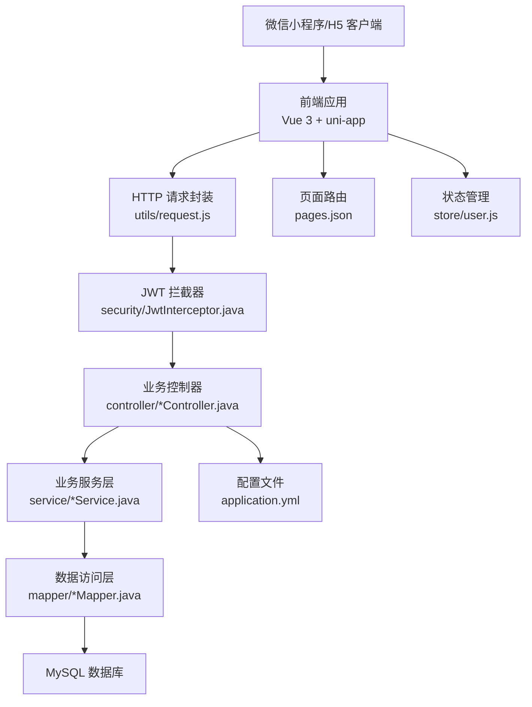
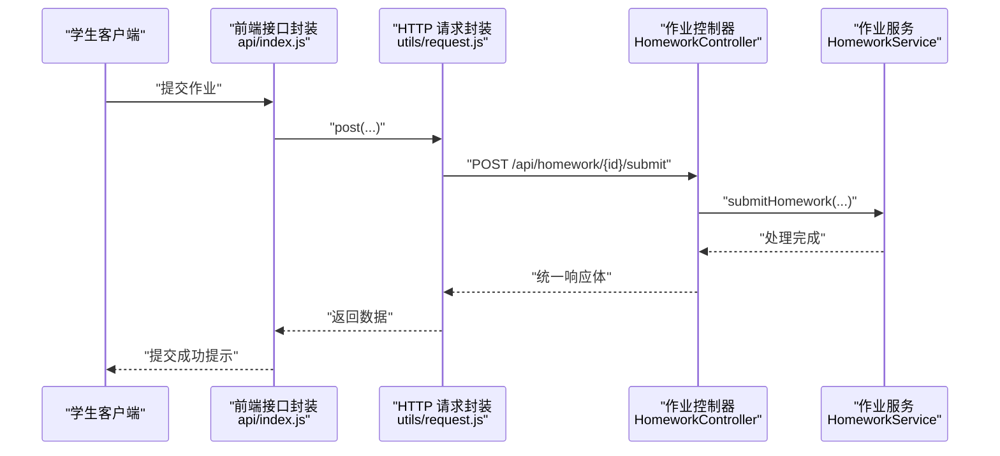
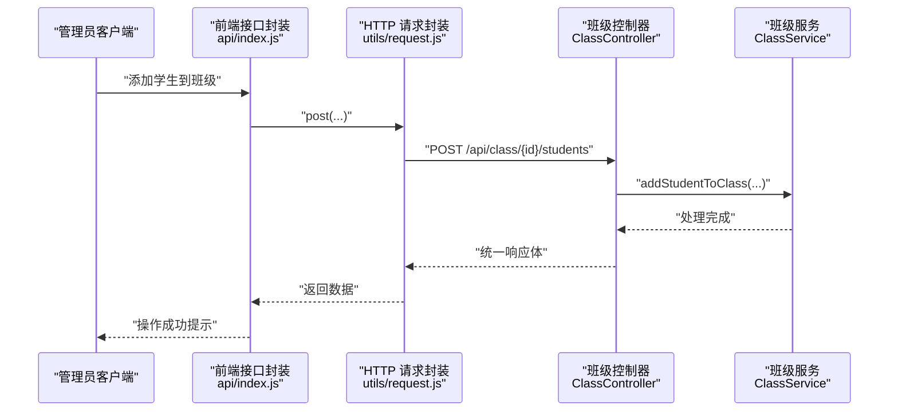
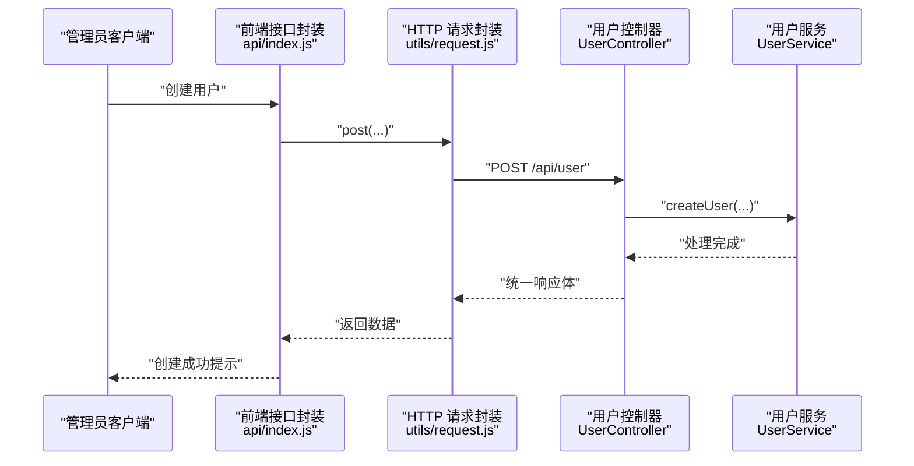
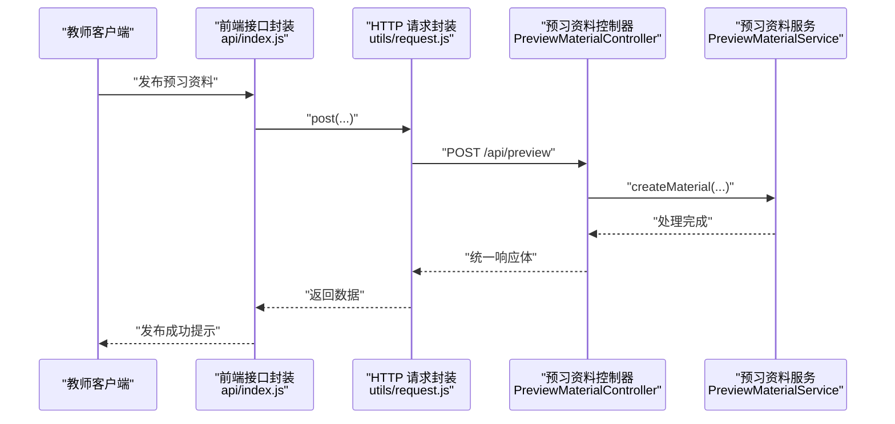
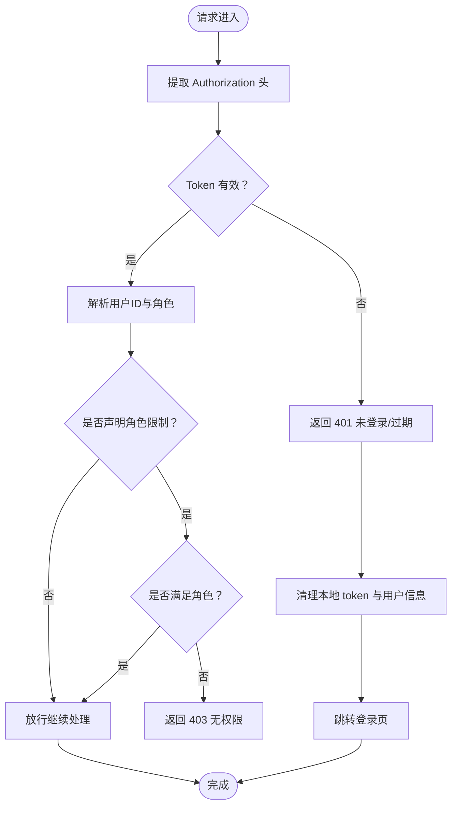
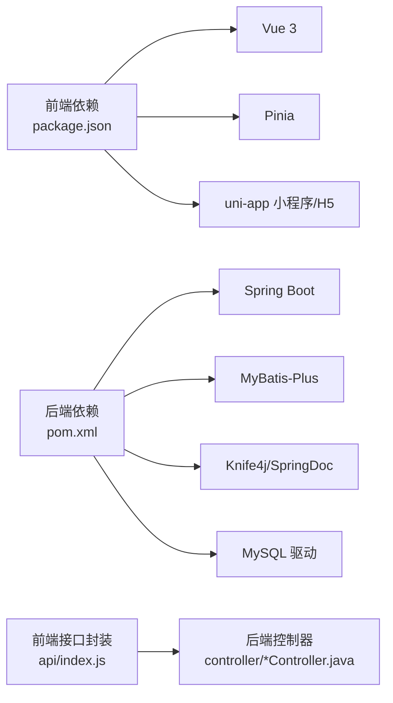

# 项目概述

<cite>
**本文引用的文件**
- [README.md](file://README.md)
- [HleneEduApplication.java](file://helenedu-backend/src/main/java/com/helen/eduedu/HleneEduApplication.java)
- [application.yml](file://helenedu-backend/src/main/resources/application.yml)
- [RoleEnum.java](file://helenedu-backend/src/main/java/com/helen/eduedu/common/RoleEnum.java)
- [JwtInterceptor.java](file://helenedu-backend/src/main/java/com/helen/eduedu/security/JwtInterceptor.java)
- [HomeworkController.java](file://helenedu-backend/src/main/java/com/helen/eduedu/controller/HomeworkController.java)
- [ClassController.java](file://helenedu-backend/src/main/java/com/helen/eduedu/controller/ClassController.java)
- [UserController.java](file://helenedu-backend/src/main/java/com/helen/eduedu/controller/UserController.java)
- [PreviewMaterialController.java](file://helenedu-backend/src/main/java/com/helen/eduedu/controller/PreviewMaterialController.java)
- [package.json](file://helenedu-frontend/package.json)
- [main.js](file://helenedu-frontend/src/main.js)
- [pages.json](file://helenedu-frontend/src/pages.json)
- [request.js](file://helenedu-frontend/src/utils/request.js)
- [user.js](file://helenedu-frontend/src/store/user.js)
- [index.js](file://helenedu-frontend/src/api/index.js)
</cite>

## 目录
1. [引言](#引言)
2. [项目结构](#项目结构)
3. [核心组件](#核心组件)
4. [架构总览](#架构总览)
5. [详细组件分析](#详细组件分析)
6. [依赖关系分析](#依赖关系分析)
7. [性能考虑](#性能考虑)
8. [故障排除指南](#故障排除指南)
9. [结论](#结论)
10. [附录](#附录)

## 引言
本项目为“HelenEdu 教育管理系统”，是一个面向微信小程序的前后端分离教学管理平台。系统围绕学生、教师、管理员三类角色构建权限体系，提供作业管理、班级管理、用户管理、预习资料管理等核心功能模块，旨在提升课堂内外的教学协同效率与数据可视化能力。

- 项目名称：HelenEdu（海伦云作业）
- 目标用户：学生、教师、管理员
- 核心价值主张：统一身份认证与权限控制、清晰的作业与预习流程、可扩展的数据看板与班级组织管理

## 项目结构
系统采用前后端分离架构：
- 后端：基于 Spring Boot 的 RESTful 服务，使用 MyBatis-Plus 进行数据持久化，内置 JWT 拦截器实现统一鉴权与角色校验，并通过 Knife4j/SpringDoc 提供在线接口文档。
- 前端：基于 Vue 3 + Pinia + uni-app，适配微信小程序与 H5 双端运行，通过封装的请求工具与 Pinia Store 实现统一的状态与接口调用。

图表来源
- [main.js:1-11](file://helenedu-frontend/src/main.js#L1-L11)
- [user.js:1-62](file://helenedu-frontend/src/store/user.js#L1-L62)
- [index.js:1-50](file://helenedu-frontend/src/api/index.js#L1-L50)
- [request.js:1-83](file://helenedu-frontend/src/utils/request.js#L1-L83)
- [pages.json:1-112](file://helenedu-frontend/src/pages.json#L1-L112)
- [HleneEduApplication.java:1-15](file://helenedu-backend/src/main/java/com/helen/eduedu/HleneEduApplication.java#L1-L15)
- [application.yml:1-59](file://helenedu-backend/src/main/resources/application.yml#L1-L59)
- [JwtInterceptor.java:1-85](file://helenedu-backend/src/main/java/com/helen/eduedu/security/JwtInterceptor.java#L1-L85)
- [RoleEnum.java:1-28](file://helenedu-backend/src/main/java/com/helen/eduedu/common/RoleEnum.java#L1-L28)
- [HomeworkController.java:1-123](file://helenedu-backend/src/main/java/com/helen/eduedu/controller/HomeworkController.java#L1-L123)
- [ClassController.java:1-129](file://helenedu-backend/src/main/java/com/helen/eduedu/controller/ClassController.java#L1-L129)
- [UserController.java:1-78](file://helenedu-backend/src/main/java/com/helen/eduedu/controller/UserController.java#L1-L78)
- [PreviewMaterialController.java:1-80](file://helenedu-backend/src/main/java/com/helen/eduedu/controller/PreviewMaterialController.java#L1-L80)

章节来源
- [README.md:1-3](file://README.md#L1-L3)
- [HleneEduApplication.java:1-15](file://helenedu-backend/src/main/java/com/helen/eduedu/HleneEduApplication.java#L1-L15)
- [application.yml:1-59](file://helenedu-backend/src/main/resources/application.yml#L1-L59)
- [package.json:1-28](file://helenedu-frontend/package.json#L1-L28)
- [main.js:1-11](file://helenedu-frontend/src/main.js#L1-L11)
- [pages.json:1-112](file://helenedu-frontend/src/pages.json#L1-L112)

## 核心组件
- 角色与权限
  - 角色定义：学生（1）、教师（2）、管理员（3），通过注解在控制器层进行角色限制。
  - 统一鉴权：JWT 拦截器负责提取令牌、校验有效性并将用户 ID 与角色注入请求属性，配合控制器注解完成细粒度权限控制。
- 接口与数据模型
  - 统一响应体：后端以统一包装对象返回结果，前端据此解析状态码与消息。
  - 分页查询：多处接口支持分页参数，便于大数据量场景下的性能优化。
- 前后端交互
  - 前端通过封装的请求库自动附加 Authorization 头与 Token；401 自动跳转登录；错误提示统一处理。
  - 页面路由按角色划分，首页根据角色动态跳转至对应业务页。

章节来源
- [RoleEnum.java:1-28](file://helenedu-backend/src/main/java/com/helen/eduedu/common/RoleEnum.java#L1-L28)
- [JwtInterceptor.java:1-85](file://helenedu-backend/src/main/java/com/helen/eduedu/security/JwtInterceptor.java#L1-L85)
- [request.js:1-83](file://helenedu-frontend/src/utils/request.js#L1-L83)
- [user.js:1-62](file://helenedu-frontend/src/store/user.js#L1-L62)
- [pages.json:1-112](file://helenedu-frontend/src/pages.json#L1-L112)

## 架构总览
系统采用典型的前后端分离架构，前端通过 uni-app 跨端渲染，后端提供 RESTful API 并通过 JWT 完成认证与授权。数据库连接由 MyBatis-Plus 管理，配置文件集中管理数据源、文件上传、JWT 与 Knife4j 文档等关键参数。

图表来源
- [request.js:1-83](file://helenedu-frontend/src/utils/request.js#L1-L83)
- [JwtInterceptor.java:1-85](file://helenedu-backend/src/main/java/com/helen/eduedu/security/JwtInterceptor.java#L1-L85)
- [HomeworkController.java:1-123](file://helenedu-backend/src/main/java/com/helen/eduedu/controller/HomeworkController.java#L1-L123)
- [ClassController.java:1-129](file://helenedu-backend/src/main/java/com/helen/eduedu/controller/ClassController.java#L1-L129)
- [UserController.java:1-78](file://helenedu-backend/src/main/java/com/helen/eduedu/controller/UserController.java#L1-L78)
- [PreviewMaterialController.java:1-80](file://helenedu-backend/src/main/java/com/helen/eduedu/controller/PreviewMaterialController.java#L1-L80)
- [application.yml:1-59](file://helenedu-backend/src/main/resources/application.yml#L1-L59)
- [pages.json:1-112](file://helenedu-frontend/src/pages.json#L1-L112)
- [user.js:1-62](file://helenedu-frontend/src/store/user.js#L1-L62)

## 详细组件分析

### 作业管理模块
- 功能要点
  - 教师：布置、修改、删除作业；查看作业列表；查看作业提交列表；批改作业；查看提交详情。
  - 学生：查看作业列表；查看作业详情；提交作业；查看提交详情。
- 权限控制
  - 教师端接口均标注角色限制；学生端接口限制为学生角色。
- 数据流
  - 学生提交作业后，教师可在后台查看并批改，最终形成作业完成情况的数据闭环。

图表来源
- [HomeworkController.java:88-98](file://helenedu-backend/src/main/java/com/helen/eduedu/controller/HomeworkController.java#L88-L98)
- [index.js:10-12](file://helenedu-frontend/src/api/index.js#L10-L12)
- [request.js:1-83](file://helenedu-frontend/src/utils/request.js#L1-L83)

章节来源
- [HomeworkController.java:1-123](file://helenedu-backend/src/main/java/com/helen/eduedu/controller/HomeworkController.java#L1-L123)
- [index.js:1-13](file://helenedu-frontend/src/api/index.js#L1-L13)

### 班级管理模块
- 功能要点
  - 管理员：创建、修改、删除班级；添加/移除学生与教师；查询班级列表与详情。
  - 教师：查看我的班级列表；查看班级成员。
  - 学生：查看我的班级列表。
- 权限控制
  - 班级 CRUD 与成员管理接口仅管理员可用；教师与学生分别通过专用接口获取自身班级。

图表来源
- [ClassController.java:75-81](file://helenedu-backend/src/main/java/com/helen/eduedu/controller/ClassController.java#L75-L81)
- [index.js:33-36](file://helenedu-frontend/src/api/index.js#L33-L36)
- [request.js:1-83](file://helenedu-frontend/src/utils/request.js#L1-L83)

章节来源
- [ClassController.java:1-129](file://helenedu-backend/src/main/java/com/helen/eduedu/controller/ClassController.java#L1-L129)
- [index.js:23-36](file://helenedu-frontend/src/api/index.js#L23-L36)

### 用户管理模块
- 功能要点
  - 管理员：创建、修改、删除用户；启用/禁用用户；查询用户列表与按角色筛选；获取全部教师/学生列表。
- 权限控制
  - 用户管理接口统一要求管理员角色。

图表来源
- [UserController.java:29-33](file://helenedu-backend/src/main/java/com/helen/eduedu/controller/UserController.java#L29-L33)
- [index.js:42-45](file://helenedu-frontend/src/api/index.js#L42-L45)
- [request.js:1-83](file://helenedu-frontend/src/utils/request.js#L1-L83)

章节来源
- [UserController.java:1-78](file://helenedu-backend/src/main/java/com/helen/eduedu/controller/UserController.java#L1-L78)
- [index.js:38-45](file://helenedu-frontend/src/api/index.js#L38-L45)

### 预习资料模块
- 功能要点
  - 教师：发布、修改、删除预习资料；查看资料列表；查看资料详情。
  - 学生：查看预习资料列表；查看资料详情。
- 权限控制
  - 教师端接口限制为教师角色；学生端接口限制为学生角色。

图表来源
- [PreviewMaterialController.java:27-33](file://helenedu-backend/src/main/java/com/helen/eduedu/controller/PreviewMaterialController.java#L27-L33)
- [index.js:19-21](file://helenedu-frontend/src/api/index.js#L19-L21)
- [request.js:1-83](file://helenedu-frontend/src/utils/request.js#L1-L83)

章节来源
- [PreviewMaterialController.java:1-80](file://helenedu-backend/src/main/java/com/helen/eduedu/controller/PreviewMaterialController.java#L1-L80)
- [index.js:15-21](file://helenedu-frontend/src/api/index.js#L15-L21)

### 登录与权限拦截流程
- 流程说明
  - 前端发起请求时自动携带 Authorization 头；
  - 后端拦截器校验 Token 有效性，解析用户 ID 与角色；
  - 若接口声明了角色限制，则进一步校验是否满足；
  - 401 自动清理本地存储并跳转登录；403 返回权限不足提示。

图表来源
- [JwtInterceptor.java:27-68](file://helenedu-backend/src/main/java/com/helen/eduedu/security/JwtInterceptor.java#L27-L68)
- [request.js:20-28](file://helenedu-frontend/src/utils/request.js#L20-L28)

章节来源
- [JwtInterceptor.java:1-85](file://helenedu-backend/src/main/java/com/helen/eduedu/security/JwtInterceptor.java#L1-L85)
- [request.js:1-83](file://helenedu-frontend/src/utils/request.js#L1-L83)
- [user.js:25-31](file://helenedu-frontend/src/store/user.js#L25-L31)

## 依赖关系分析
- 技术栈与版本
  - 后端：Spring Boot、MyBatis-Plus、Knife4j/SpringDoc、MySQL 驱动
  - 前端：Vue 3、Pinia、uni-app（含小程序与 H5 插件）
- 关键依赖关系
  - 前端通过封装的请求库统一调用后端接口，接口路径与后端控制器一一对应。
  - 前端页面路由按角色划分，首页根据用户角色动态跳转。
  - 后端通过配置文件集中管理数据库连接、文件上传目录与 JWT 密钥等。

图表来源
- [package.json:12-26](file://helenedu-frontend/package.json#L12-L26)
- [application.yml:6-11](file://helenedu-backend/src/main/resources/application.yml#L6-L11)
- [index.js:1-50](file://helenedu-frontend/src/api/index.js#L1-L50)
- [HomeworkController.java:1-27](file://helenedu-backend/src/main/java/com/helen/eduedu/controller/HomeworkController.java#L1-L27)

章节来源
- [package.json:1-28](file://helenedu-frontend/package.json#L1-L28)
- [application.yml:1-59](file://helenedu-backend/src/main/resources/application.yml#L1-L59)

## 性能考虑
- 分页查询：多处接口支持分页参数，建议在大数据量场景下默认启用分页，避免一次性加载过多数据。
- 文件上传：后端配置了合理的文件大小限制，前端上传组件需配合后端策略使用。
- 缓存与鉴权：建议在网关层或反向代理层增加静态资源缓存与限流策略，减少后端压力。
- 数据库：合理设计索引与查询条件，避免 N+1 查询；对高频接口可引入 Redis 缓存热点数据。

## 故障排除指南
- 登录态异常
  - 现象：接口返回 401 或自动跳转登录。
  - 处理：检查本地存储的 token 是否存在且未过期；确认后端 JWT 密钥与过期时间配置一致。
- 权限不足
  - 现象：接口返回 403。
  - 处理：确认当前用户角色是否满足接口所需角色；检查控制器上的角色注解与拦截器逻辑。
- 接口调用失败
  - 现象：网络错误提示或后端返回非 200。
  - 处理：检查前端请求封装中的 Base URL 与 Authorization 头；确认后端接口路径与参数正确。

章节来源
- [request.js:20-41](file://helenedu-frontend/src/utils/request.js#L20-L41)
- [JwtInterceptor.java:79-83](file://helenedu-backend/src/main/java/com/helen/eduedu/security/JwtInterceptor.java#L79-L83)

## 结论
HelenEdu 教育管理系统通过前后端分离架构实现了清晰的职责划分与良好的可维护性。基于角色的权限控制与统一的鉴权拦截机制确保了系统的安全性；模块化的业务控制器与服务层便于扩展与测试。对于初学者，系统提供了明确的功能边界与接口规范；对于有经验的开发者，系统具备完善的配置与扩展点，适合进一步演进为更复杂的教学管理平台。

## 附录
- 开发与部署建议
  - 后端：使用 Docker 化部署，集中管理配置文件与数据库连接；开启慢查询日志与监控指标。
  - 前端：使用 CI/CD 自动构建小程序与 H5 版本；在开发环境与生产环境区分 Base URL 与调试开关。
- 扩展方向
  - 引入消息推送与通知中心；
  - 增加数据看板与报表模块；
  - 支持更多第三方登录与文件存储服务。